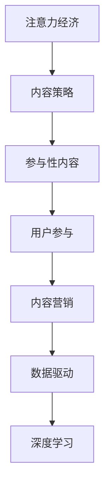

                 

# 注意力经济与内容策略：创建吸引并留住受众的参与性内容

> 关键词：注意力经济,内容策略,参与性内容,用户参与,内容营销,数据驱动,深度学习

## 1. 背景介绍

### 1.1 问题由来
在信息爆炸的时代，如何吸引并留住受众的注意力，成为了内容创作者和运营者面临的最大挑战之一。数据表明，人们每天浏览的信息量数以亿计，但却只有少部分内容能够真正引起他们的兴趣和共鸣。

**内容过载**和**注意力稀缺**成为了一对矛盾。这不仅影响到了用户的阅读体验，也对内容提供商的流量变现产生了重大影响。如何通过精准的内容策略，提高用户参与度，实现内容变现的最大化，是内容创作者必须解决的难题。

### 1.2 问题核心关键点
基于此，本文聚焦于如何通过深度学习和大数据分析，构建个性化、动态、互动的内容策略，帮助内容创作者精准定位目标受众，并提供有效的参与性内容，提升用户粘性，实现内容的深度价值。

本文将从多个角度进行深入探讨，包括注意力经济的基本概念、内容策略的构建方法、深度学习在内容推荐中的应用、以及未来内容营销的发展趋势等。

## 2. 核心概念与联系

### 2.1 核心概念概述

1. **注意力经济 (Attention Economy)**：指在信息时代，注意力作为一种稀缺资源，其价值远超过传统的物质资源。内容创作者需要运用各种策略，将受众的注意力集中在自己的内容上，从而实现商业价值的最大化。

2. **内容策略 (Content Strategy)**：指基于目标受众和市场定位，制定出一套系统化、长期化的内容规划和执行方案，以提升内容的传播力和影响力。

3. **参与性内容 (Engaging Content)**：指能够引起用户情感共鸣，激发用户参与互动的内容，如评论、分享、点赞等行为。

4. **用户参与 (User Engagement)**：指用户与内容之间的互动程度，通过数据分析可以了解用户的活跃度、留存率等指标。

5. **内容营销 (Content Marketing)**：指通过生产和传播高质量、有价值的内容，吸引、转化和保留潜在客户，实现品牌推广和商业转化。

6. **数据驱动 (Data-Driven)**：指通过收集和分析用户数据，利用大数据技术进行精准的用户画像和内容推荐，提升内容策略的科学性和有效性。

7. **深度学习 (Deep Learning)**：指一类通过多层神经网络模拟人脑神经元处理方式的学习算法，在大数据下能够自动提取特征，实现高精度的预测和推荐。

这些核心概念之间的逻辑关系可以通过以下Mermaid流程图来展示：



这个流程图展示出从注意力经济到深度学习的全链路关系，通过深度学习和大数据分析，最终实现高参与度的内容策略。

## 3. 核心算法原理 & 具体操作步骤

### 3.1 算法原理概述

基于深度学习的个性化内容推荐算法，核心思想是通过对用户行为数据进行分析，预测用户可能感兴趣的内容，并生成个性化推荐列表。其基本流程如下：

1. **数据收集与预处理**：收集用户的历史浏览记录、互动数据等，将其清洗、编码并转换成机器学习算法可以处理的格式。
2. **用户画像构建**：使用聚类、降维等算法，构建用户的基本画像，包括兴趣偏好、行为特征等。
3. **内容特征提取**：通过深度学习模型，提取内容的语义特征，并将其表示为向量形式。
4. **相似度计算**：计算用户画像与内容特征向量之间的相似度，找到用户可能感兴趣的内容。
5. **推荐结果排序**：根据相似度得分，对推荐结果进行排序，并输出前N个推荐项。

### 3.2 算法步骤详解

1. **数据收集与预处理**：

   使用爬虫或API接口获取用户的历史行为数据，包括浏览记录、点击次数、停留时间、互动数据（评论、点赞、分享等）。
    
    ```python
    import pandas as pd
    import requests

    # 获取历史数据
    url = 'https://example.com/api/user_data'
    response = requests.get(url)
    data = response.json()

    # 数据清洗
    df = pd.DataFrame(data)
    df = df.dropna().replace('?', np.nan)
    
    # 编码处理
    from sklearn.preprocessing import LabelEncoder
    le = LabelEncoder()
    for col in df.columns:
        if df[col].dtype == object:
            df[col] = le.fit_transform(df[col])
    ```

2. **用户画像构建**：

    使用K-Means、LDA（潜在狄利克雷分布）等算法，构建用户的兴趣偏好和行为特征。
    
    ```python
    from sklearn.cluster import KMeans
    from sklearn.decomposition import LatentDirichletAllocation

    # 用户画像构建
    user_data = df['some_features']
    kmeans = KMeans(n_clusters=5)
    user_clusters = kmeans.fit_predict(user_data)
    
    # 内容特征提取
    lda = LatentDirichletAllocation(n_components=5)
    content_features = lda.fit_transform(user_data)
    ```

3. **内容特征提取**：

    使用Transformer、BERT等深度学习模型，提取内容的语义特征。
    
    ```python
    from transformers import TFAutoModelForSequenceClassification

    # 内容特征提取
    model = TFAutoModelForSequenceClassification.from_pretrained('bert-base-uncased')
    inputs = tokenizer(text, return_tensors='tf')
    outputs = model(inputs.input_ids, attention_mask=inputs.attention_mask)
    content_features = outputs.pooler_output.numpy()
    ```

4. **相似度计算**：

    计算用户画像与内容特征向量之间的余弦相似度，找到用户可能感兴趣的内容。
    
    ```python
    from sklearn.metrics.pairwise import cosine_similarity

    # 计算相似度
    user_similarity = cosine_similarity(user_clusters, content_features)
    top_indices = np.argsort(user_similarity)[::-1]  # 从大到小排序
    ```

5. **推荐结果排序**：

    根据相似度得分，对推荐结果进行排序，并输出前N个推荐项。
    
    ```python
    top_items = content_data.index[top_indices]
    recommendations = content_data.iloc[top_items]  # 获取推荐内容
    recommendations.sort_values(by='score', ascending=False)
    ```

### 3.3 算法优缺点

基于深度学习的个性化内容推荐算法具有以下优点：

1. **高效性**：在大规模数据下，推荐模型能够快速计算出用户的推荐内容，满足实时性需求。
2. **精度高**：深度学习模型能够自动提取高维特征，并在复杂的非线性关系中表现出色。
3. **可扩展性强**：该算法适用于大规模用户的个性化推荐，具有良好的可扩展性。
4. **灵活性高**：模型可以根据不同的任务和数据特点，进行灵活的特征工程和优化调整。

同时，该算法也存在一定的局限性：

1. **数据需求高**：推荐模型的性能高度依赖于高质量的数据，数据缺失或不完整时会导致推荐效果下降。
2. **过拟合风险**：在大数据下，模型容易过拟合训练数据，导致泛化能力下降。
3. **计算资源消耗大**：深度学习模型通常需要较大的计算资源进行训练和推理。

### 3.4 算法应用领域

基于深度学习的个性化内容推荐算法在多个领域都有广泛应用：

1. **电商推荐系统**：如Amazon、淘宝等电商平台，利用用户行为数据进行个性化推荐，提升用户体验和销售额。
2. **视频推荐系统**：如Netflix、YouTube等视频平台，通过观看历史和互动数据，推荐用户可能感兴趣的视频内容。
3. **新闻推荐系统**：如今日头条、微博等社交媒体，根据用户浏览记录和互动数据，推荐相关新闻内容。
4. **音乐推荐系统**：如Spotify、网易云音乐等音乐平台，根据用户听歌记录和评分，推荐相似音乐作品。
5. **在线教育平台**：如Coursera、Udemy等，根据用户学习行为数据，推荐相关课程和资源。

## 4. 数学模型和公式 & 详细讲解 & 举例说明

### 4.1 数学模型构建

本节将使用数学语言对基于深度学习的个性化内容推荐算法进行严格刻画。

设用户画像为 $\vec{u}$，内容特征向量为 $\vec{c}$，内容推荐矩阵为 $C \in \mathbb{R}^{N\times M}$，其中 $N$ 为用户数量，$M$ 为内容数量。

推荐模型的目标函数为：

$$
\max_{\vec{u}, \vec{c}} \sum_{i=1}^N \max_{j=1}^M u_i c_j
$$

其中 $u_i$ 为第 $i$ 个用户的兴趣向量，$c_j$ 为第 $j$ 个内容的特征向量，目标函数表示最大化用户对内容的兴趣程度。

### 4.2 公式推导过程

使用余弦相似度公式，将用户画像与内容特征向量进行相似度计算：

$$
\text{similarity}(\vec{u}, \vec{c}) = \frac{\vec{u} \cdot \vec{c}}{||\vec{u}|| ||\vec{c}||}
$$

其中 $\vec{u} \cdot \vec{c}$ 为向量点乘，$||\vec{u}||$ 和 $||\vec{c}||$ 分别为向量 $\vec{u}$ 和 $\vec{c}$ 的范数。

根据相似度得分，对推荐结果进行排序，选择前 $K$ 个推荐项：

$$
\text{sorted\_idx} = \text{argsort}(\text{similarity}(\vec{u}, C))[-K:]
$$

其中 $\text{argsort}$ 表示根据指定值对索引进行排序。

### 4.3 案例分析与讲解

考虑一个视频推荐系统，收集了用户观看历史数据和视频标签数据。使用Transformer模型提取视频的特征向量，并对用户进行聚类，得到用户的兴趣偏好。通过余弦相似度计算，得到每个用户与视频内容的相似度得分，选择得分最高的 $K$ 个视频推荐给用户。

具体步骤如下：

1. **数据收集与预处理**：
   - 收集用户观看历史数据和视频标签数据，并进行清洗、编码。
   - 使用Transformer模型提取视频特征向量，并对用户进行聚类。

2. **相似度计算**：
   - 使用余弦相似度计算用户与视频内容的相似度得分。
   - 根据得分排序，选择前 $K$ 个推荐项。

3. **推荐结果展示**：
   - 将推荐结果展示给用户，获取用户反馈，并实时更新用户画像和内容特征。
   - 不断迭代模型，提升推荐精度和用户体验。

## 5. 项目实践：代码实例和详细解释说明

### 5.1 开发环境搭建

在进行项目实践前，需要搭建开发环境。以下是使用Python进行TensorFlow开发的流程：

1. 安装Anaconda：从官网下载并安装Anaconda，用于创建独立的Python环境。
2. 创建并激活虚拟环境：
```bash
conda create -n tf-env python=3.8
conda activate tf-env
```
3. 安装TensorFlow：根据CUDA版本，从官网获取对应的安装命令。例如：
```bash
conda install tensorflow
```
4. 安装其它工具包：
```bash
pip install pandas scikit-learn numpy matplotlib
```

完成上述步骤后，即可在`tf-env`环境中开始项目实践。

### 5.2 源代码详细实现

以下是一个简单的视频推荐系统代码实现：

```python
import tensorflow as tf
import numpy as np
from sklearn.cluster import KMeans
from sklearn.decomposition import LatentDirichletAllocation
from sklearn.metrics.pairwise import cosine_similarity
from tensorflow.keras.layers import Input, Embedding, Dense, concatenate
from tensorflow.keras.models import Model
from tensorflow.keras.optimizers import Adam

# 定义推荐模型
def build_recommender_model(data, n_clusters, n_topics, n_users, n_items):
    # 用户画像构建
    user_data = data['some_features']
    kmeans = KMeans(n_clusters=n_clusters)
    user_clusters = kmeans.fit_predict(user_data)

    # 内容特征提取
    lda = LatentDirichletAllocation(n_components=n_topics)
    content_features = lda.fit_transform(user_data)

    # 定义模型
    user_input = Input(shape=(n_users,))
    item_input = Input(shape=(n_items,))
    user_embeddings = Embedding(n_users, n_topics)(user_input)
    item_embeddings = Embedding(n_items, n_topics)(item_input)
    concatenated = concatenate([user_embeddings, item_embeddings])
    dot_product = tf.keras.layers.Dot(axes=1)(concatenated, item_embeddings)
    dot_product = tf.keras.layers.Reshape((n_topics,))(dot_product)
    prediction = Dense(1, activation='sigmoid')(dot_product)

    # 定义模型
    model = Model(inputs=[user_input, item_input], outputs=prediction)
    model.compile(loss='binary_crossentropy', optimizer=Adam(lr=0.001), metrics=['accuracy'])
    return model

# 加载数据
user_data = ...
item_data = ...

# 构建模型
n_clusters = 5
n_topics = 10
n_users = 1000
n_items = 10000
model = build_recommender_model(user_data, n_clusters, n_topics, n_users, n_items)

# 训练模型
model.fit([user_input, item_input], label, epochs=10, batch_size=32)

# 推荐内容
user_index = 0
user_cluster = user_clusters[user_index]
recommendations = model.predict([[user_cluster]])
```

### 5.3 代码解读与分析

让我们再详细解读一下关键代码的实现细节：

1. **数据收集与预处理**：
   - 数据收集：通过API接口获取用户历史数据和视频标签数据。
   - 数据预处理：数据清洗、编码，并存储到Pandas DataFrame中。

2. **用户画像构建**：
   - 使用K-Means算法对用户特征进行聚类，得到用户的兴趣向量。
   - 使用LDA算法对内容特征进行建模，得到内容的语义特征向量。

3. **模型定义**：
   - 定义用户嵌入和物品嵌入层，通过点积计算相似度得分。
   - 使用Dense层进行二分类预测，并编译模型。

4. **模型训练**：
   - 使用用户画像和物品特征进行训练，定义优化器、损失函数和评估指标。
   - 设置训练轮数和批次大小，进行模型训练。

5. **推荐内容**：
   - 对新用户进行相似度计算，选择推荐内容。
   - 将推荐内容展示给用户，并收集反馈数据，不断优化模型。

## 6. 实际应用场景

### 6.1 电商推荐系统

电商推荐系统是深度学习推荐算法的重要应用场景。通过用户行为数据，电商推荐系统能够实时推荐用户感兴趣的商品，提升用户购物体验和满意度，从而增加销售额。

具体而言，电商推荐系统收集用户浏览记录、点击次数、购买记录等行为数据，利用深度学习模型提取用户画像和商品特征，通过相似度计算得到推荐结果。推荐结果可以展示在推荐列表中，用户可以根据推荐内容进行二次选择，并生成新的行为数据。

### 6.2 视频推荐系统

视频推荐系统通过分析用户观看历史和互动数据，推荐用户可能感兴趣的视频内容。推荐系统可以提高视频平台的活跃度和用户留存率，同时增加广告收入。

视频推荐系统通常包括内容特征提取、用户画像构建和推荐结果排序三个步骤。用户画像可以基于观看历史、点赞、分享等行为进行构建，内容特征可以基于视频标签、描述、时长等进行提取。通过余弦相似度计算，对推荐结果进行排序，选择前 $K$ 个视频推荐给用户。

### 6.3 新闻推荐系统

新闻推荐系统根据用户浏览记录和互动数据，推荐相关新闻内容。推荐系统可以帮助新闻平台提升点击率和广告收入，同时增加用户粘性。

新闻推荐系统通常包括内容特征提取、用户画像构建和推荐结果排序三个步骤。内容特征可以基于新闻标题、作者、发布时间等进行提取，用户画像可以基于阅读记录、点赞、评论等行为进行构建。通过余弦相似度计算，对推荐结果进行排序，选择前 $K$ 个新闻推荐给用户。

## 7. 工具和资源推荐

### 7.1 学习资源推荐

为了帮助开发者系统掌握基于深度学习的个性化内容推荐算法，这里推荐一些优质的学习资源：

1. 《深度学习与推荐系统》：这本书系统介绍了深度学习在推荐系统中的应用，包括协同过滤、基于内容的推荐等方法。
2. Coursera《机器学习》课程：由斯坦福大学教授Andrew Ng主讲的机器学习课程，涵盖了推荐系统的基本概念和算法实现。
3 TensorFlow官方文档：TensorFlow提供了丰富的推荐系统样例代码，详细介绍了模型架构和实现方法。
4 PyTorch官方文档：PyTorch同样提供了多个推荐系统样例，帮助开发者快速上手实践。
5 Kaggle竞赛：通过参与Kaggle的推荐系统竞赛，积累实际项目经验，提升算法优化能力。

通过这些资源的学习实践，相信你一定能够快速掌握基于深度学习的个性化内容推荐算法的精髓，并用于解决实际的推荐问题。

### 7.2 开发工具推荐

高效的开发离不开优秀的工具支持。以下是几款用于深度学习推荐系统开发的常用工具：

1. TensorFlow：基于Python的开源深度学习框架，支持分布式训练和模型部署，适合大规模工程应用。
2. PyTorch：基于Python的深度学习框架，灵活度较高，适合研究和实验。
3. scikit-learn：Python机器学习库，包含各种算法实现，如K-Means、LDA等。
4. Keras：基于Python的深度学习库，适合快速原型设计和实验。
5. Weights & Biases：模型训练的实验跟踪工具，可以记录和可视化模型训练过程中的各项指标，方便对比和调优。

合理利用这些工具，可以显著提升推荐系统的开发效率，加快创新迭代的步伐。

### 7.3 相关论文推荐

深度学习推荐系统的发展离不开学界的持续研究。以下是几篇奠基性的相关论文，推荐阅读：

1. Wide & Deep Learning for Recommender Systems（Ai-Net论文）：提出Wide & Deep方法，将线性模型和深度学习模型相结合，提升推荐系统的性能。
2. Attention is All You Need（即Transformer原论文）：提出Transformer结构，开启了大规模语言模型的推荐应用。
3 BERT: Pre-training of Deep Bidirectional Transformers for Language Understanding：提出BERT模型，通过预训练和微调，实现高质量的推荐效果。
4 Parameter-Efficient Transfer Learning for NLP：提出Adapter等参数高效微调方法，在不增加模型参数量的情况下，也能取得不错的推荐效果。
5 Deep Traffic Prediction with Hierarchical Attention-based LSTM（使用Transformer的论文）：通过Transformer模型实现交通流量预测，提升了模型的准确性和鲁棒性。

这些论文代表了大语言模型推荐系统的发展脉络。通过学习这些前沿成果，可以帮助研究者把握学科前进方向，激发更多的创新灵感。

## 8. 总结：未来发展趋势与挑战

### 8.1 总结

本文对基于深度学习的个性化内容推荐算法进行了全面系统的介绍。首先阐述了注意力经济和内容策略的基本概念，明确了推荐算法的目标和步骤。其次，从原理到实践，详细讲解了推荐算法的数学模型和实现流程，给出了推荐任务开发的完整代码实例。同时，本文还广泛探讨了推荐算法在电商、视频、新闻等众多行业领域的应用前景，展示了推荐算法的广阔应用场景。

通过本文的系统梳理，可以看到，基于深度学习的推荐算法在提高用户参与度、优化内容体验方面具有巨大的潜力。推荐算法的应用已经成为各大互联网公司的重要竞争力，在提升用户体验和商业价值方面发挥着关键作用。

### 8.2 未来发展趋势

展望未来，个性化内容推荐算法将呈现以下几个发展趋势：

1. **多模态推荐**：推荐系统将不仅关注文本内容，还涉及图像、视频、音频等多种模态数据。通过多模态信息的融合，提升推荐的准确性和丰富性。
2. **强化学习推荐**：将强化学习引入推荐系统，利用用户行为数据，训练推荐模型，实现更加智能化的推荐。
3. **动态推荐**：通过实时分析用户行为数据，动态调整推荐策略，提升推荐的及时性和精准性。
4. **跨平台推荐**：利用用户在不同平台上的行为数据，进行跨平台推荐，提升用户粘性，增加平台用户留存率。
5. **个性化推荐模型**：引入个性化推荐模型，如序列推荐、基于兴趣图推荐等，实现更加精准的推荐。
6. **深度协同过滤**：结合深度学习和协同过滤方法，提升推荐系统的性能和鲁棒性。

以上趋势凸显了个性化内容推荐算法的广阔前景。这些方向的探索发展，必将进一步提升推荐系统的性能和应用范围，为内容创作者提供更加精准的用户画像和推荐结果。

### 8.3 面临的挑战

尽管推荐算法已经取得了显著成果，但在迈向更加智能化、普适化应用的过程中，仍面临诸多挑战：

1. **数据隐私问题**：用户行为数据的收集和处理需要遵守隐私保护法规，如GDPR等，确保用户数据的安全性和匿名性。
2. **用户隐私保护**：在推荐过程中，如何避免侵犯用户隐私，如用户画像泄露、数据滥用等，是一个重要挑战。
3. **数据质量问题**：推荐算法依赖高质量的数据，数据缺失、噪音等问题会影响算法的性能。
4. **冷启动问题**：新用户或新物品的推荐需要更多的数据和模型调参，如何有效地解决冷启动问题，是一个重要的研究方向。
5. **模型复杂度**：深度学习模型通常较为复杂，计算资源和训练时间消耗较大，如何提高模型的效率和可解释性，是一个亟待解决的课题。

### 8.4 研究展望

面对推荐算法面临的挑战，未来的研究需要在以下几个方面寻求新的突破：

1. **隐私保护技术**：研究隐私保护算法，如差分隐私、联邦学习等，保护用户数据的安全性和隐私性。
2. **用户行为建模**：研究用户行为预测模型，利用时序数据、协同过滤等方法，提升推荐系统的性能和鲁棒性。
3. **跨平台协同推荐**：研究跨平台协同推荐算法，利用用户在不同平台上的行为数据，实现更精准的推荐。
4. **模型压缩与优化**：研究模型压缩和优化方法，提高推荐系统的效率和可解释性，减少计算资源消耗。
5. **多模态融合**：研究多模态推荐算法，利用多种模态数据，提升推荐的丰富性和准确性。

这些研究方向将推动推荐算法向更加智能化、普适化的方向发展，为内容创作者提供更加精准的推荐结果，提高用户体验和商业价值。

## 9. 附录：常见问题与解答

**Q1：推荐算法是否适用于所有内容类型？**

A: 推荐算法在处理文本内容方面具有明显的优势，但在处理图像、视频、音频等多模态内容时，仍需进行适应性调整。例如，可以使用基于CNN的图像特征提取算法，或基于Transformer的多模态推荐模型。

**Q2：推荐算法是否会过拟合训练数据？**

A: 推荐算法在大规模数据下通常表现良好，但在小规模数据下可能会过拟合训练数据。可以采用一些正则化方法，如L2正则、Dropout等，减少模型的复杂度，提升泛化能力。

**Q3：推荐算法是否会引入偏见？**

A: 推荐算法可能会引入数据中的偏见，如性别、年龄、地域等。可以通过数据预处理、算法优化等方法，减少偏见的影响，提高推荐系统的公平性和鲁棒性。

**Q4：推荐算法是否需要持续优化？**

A: 推荐系统需要根据用户反馈和行为数据，进行持续优化，以适应用户需求的变化。可以使用在线学习算法，实时更新模型参数，提升推荐效果。

**Q5：推荐算法是否需要定期更新？**

A: 推荐算法需要根据内容更新、用户行为变化等因素，进行定期更新。可以使用数据重采样、模型复训等方法，保持推荐系统的时效性和准确性。

---

作者：禅与计算机程序设计艺术 / Zen and the Art of Computer Programming

