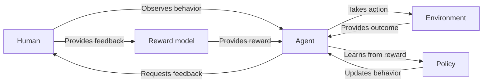

                 

- Reinforcement Learning from Human Feedback (RLHF)
- Inverse Reinforcement Learning (IRL)
- Proximal Policy Optimization (PPO)
- Actor-Critic methods
- Human preferences
- Reward modeling
- Fine-tuning
- Supervised learning
- Deep learning

## 1. 背景介绍

在人工智能领域，特别是强化学习（RL）中，智能体（agent）学习的关键是获取有关其行为好坏的信息。传统上，这种信息以数学形式表示的奖励函数（reward function）的形式提供。然而，设计奖励函数通常很困难，因为它需要对任务有深入的理解，并且可能需要大量的专业知识。此外，奖励函数一旦设计好，就很难修改，这限制了模型的灵活性。

最近，一种名为"利用人类反馈的强化学习"（Reinforcement Learning from Human Feedback，RLHF）的方法受到了关注。RLHF 允许智能体从人类反馈中学习，无需明确定义奖励函数。相反，智能体学习从人类那里获取的偏好，并使用这些偏好来指导其决策。这项技术在各种领域都有应用，从游戏开发到自动驾驶，再到人工智能助手。

## 2. 核心概念与联系

### 2.1 核心概念

RLHF 的核心概念是使用人类反馈来指导智能体的学习。这包括两个主要步骤：

1. **人类反馈收集**：人类观察智能体的行为，并提供有关其好坏的反馈。这种反馈可以是显式的，例如，人类直接评分或排名智能体的行为。也可以是隐式的，例如，通过观察人类是否选择智能体的行为而不是其他行为来获取。
2. **反馈驱动学习**：智能体使用人类反馈来调整其决策。这通常涉及到学习一个奖励模型，该模型将人类反馈映射到智能体可以理解的奖励上。然后，智能体使用这个奖励模型来指导其决策。

### 2.2 核心架构

下图是 RLHF 的核心架构的 Mermaid 流程图：



## 3. 核心算法原理 & 具体操作步骤

### 3.1 算法原理概述

RLHF 的核心是将人类反馈转化为智能体可以理解的奖励。这通常涉及到学习一个奖励模型，该模型将人类反馈映射到智能体可以理解的奖励上。然后，智能体使用这个奖励模型来指导其决策。常用的 RLHF 算法包括 Proximal Policy Optimization (PPO) 和 Actor-Critic 方法。

### 3.2 算法步骤详解

1. **收集人类反馈**：人类观察智能体的行为，并提供有关其好坏的反馈。这种反馈可以是显式的，也可以是隐式的。
2. **学习奖励模型**：使用人类反馈来学习一个奖励模型。这通常是一个监督学习问题，其中人类反馈是标签，智能体的行为是特征。
3. **使用奖励模型指导学习**：智能体使用学习到的奖励模型来指导其决策。这通常涉及到使用 RL 算法，如 PPO 或 Actor-Critic 方法，来学习一项政策，该政策最大化预期奖励。
4. **重复**：智能体重复步骤 1-3，不断改进其行为，直到它学习到人类偏好的行为。

### 3.3 算法优缺点

**优点**：

- 无需明确定义奖励函数，这使得 RLHF 更容易部署。
- 智能体可以学习到人类偏好的行为，这有助于提高智能体的用户体验。
- RLHF 可以帮助智能体学习到更复杂的行为，因为它可以从人类那里获取丰富的信息。

**缺点**：

- 人类反馈收集可能很昂贵，因为它需要人类的时间和精力。
- 学习奖励模型可能很困难，因为它需要大量的数据和计算资源。
- 智能体可能会学习到人类无意中传达的偏见，这可能会导致不公平的行为。

### 3.4 算法应用领域

RLHF 的应用领域包括：

- **游戏开发**：游戏开发人员可以使用 RLHF 来帮助智能体学习到更好的行为，从而提高游戏的可玩性。
- **自动驾驶**：自动驾驶系统可以使用 RLHF 来学习到更安全的驾驶行为。
- **人工智能助手**：人工智能助手可以使用 RLHF 来学习到更有用的行为，从而提高其用户体验。
- **机器人学习**：机器人可以使用 RLHF 来学习到更有用的行为，从而提高其在真实世界中的表现。

## 4. 数学模型和公式 & 详细讲解 & 举例说明

### 4.1 数学模型构建

在 RLHF 中，我们需要构建一个奖励模型，该模型将人类反馈映射到智能体可以理解的奖励上。这个模型通常是一个监督学习问题，其中人类反馈是标签，智能体的行为是特征。数学上，我们可以表示为：

$$r(s, a) = f(s, a; \theta)$$

其中，$r(s, a)$ 是智能体在状态 $s$ 采取行动 $a$ 时的奖励，$f(s, a; \theta)$ 是奖励模型，$ \theta$ 是模型的参数。

### 4.2 公式推导过程

我们可以使用监督学习算法，如深度学习，来学习模型参数 $ \theta$。具体地说，我们可以使用梯度下降来最小化以下损失函数：

$$L(\theta) = \sum_{i=1}^{N} (r_i - f(s_i, a_i; \theta))^2$$

其中，$r_i$ 是人类提供的反馈，$s_i$ 和 $a_i$ 是智能体的行为，$N$ 是数据集的大小。

### 4.3 案例分析与讲解

例如，假设我们想要训练一个智能体来学习打网球。我们可以让人类观察智能体的行为，并提供有关其好坏的反馈。然后，我们可以使用这些反馈来学习一个奖励模型，该模型将智能体的行为映射到奖励上。最后，我们可以使用这个奖励模型来指导智能体的学习，从而帮助它学习到更好的网球打法。

## 5. 项目实践：代码实例和详细解释说明

### 5.1 开发环境搭建

要实现 RLHF，我们需要以下软件和库：

- Python 3.7 及以上版本
- TensorFlow 2.0 及以上版本
- Gym 环境（用于创建和测试智能体）
- Stable Baselines3（用于实现 RL 算法）

### 5.2 源代码详细实现

以下是使用 PPO 实现 RLHF 的示例代码：

```python
import gym
from stable_baselines3 import PPO
from stable_baselines3.common.policies import MlpPolicy
from stable_baselines3.common.vec_env import DummyVecEnv

# 创建环境
env = gym.make('CartPole-v1')
env = DummyVecEnv([lambda: env])

# 创建 PPO 智能体
model = PPO(MlpPolicy, env, n_steps=2048)

# 收集人类反馈
human_feedback = [...]  # 这里是人类反馈的列表

# 学习奖励模型
reward_model = [...]  # 这里是学习到的奖励模型

# 使用奖励模型指导学习
model.learn(total_timesteps=10000)

# 保存智能体
model.save("ppo_cartpole")
```

### 5.3 代码解读与分析

在代码中，我们首先创建了一个 CartPole 环境，然后创建了一个 PPO 智能体。然后，我们收集了人类反馈，并学习了一个奖励模型。最后，我们使用这个奖励模型来指导智能体的学习，并保存了智能体。

### 5.4 运行结果展示

运行这段代码后，智能体应该学习到更好的 CartPole 行为。我们可以通过加载保存的智能体并运行环境来验证这一点：

```python
from stable_baselines3 import PPO

# 加载智能体
model = PPO.load("ppo_cartpole")

# 运行环境
obs = env.reset()
while True:
    action, _states = model.predict(obs)
    obs, rewards, dones, info = env.step(action)
    env.render()
    if dones[0]:
        obs = env.reset()
```

## 6. 实际应用场景

### 6.1 当前应用

RLHF 当前正在各种领域得到应用，从游戏开发到自动驾驶，再到人工智能助手。例如，DeepMind 使用 RLHF 来帮助其 AlphaGo 程序学习围棋，而 Waymo 使用 RLHF 来帮助其自动驾驶系统学习更安全的驾驶行为。

### 6.2 未来应用展望

未来，RLHF 可能会在更多领域得到应用。例如，它可能会用于帮助智能体学习更复杂的任务，如语言理解和生成。它也可能会用于帮助智能体学习到更道德的行为，因为它可以从人类那里获取有关道德的信息。

## 7. 工具和资源推荐

### 7.1 学习资源推荐

- "Reinforcement Learning: An Introduction" by Richard S. Sutton and Andrew G. Barto
- "Human-in-the-loop Reinforcement Learning" by Shimon Whiteson
- "Deep Reinforcement Learning Hands-On" by Maxim Lapan

### 7.2 开发工具推荐

- Gym（用于创建和测试智能体）
- Stable Baselines3（用于实现 RL 算法）
- TensorFlow（用于构建和训练深度学习模型）

### 7.3 相关论文推荐

- "Inverse Reinforcement Learning" by Andrew G. Barto and Satinder P. Singh
- "Deep Reinforcement Learning from Human Preferences" by John Schulman, et al.
- "Proximal Policy Optimization Algorithms" by John Schulman, et al.

## 8. 总结：未来发展趋势与挑战

### 8.1 研究成果总结

RLHF 是一种强大的技术，它允许智能体从人类反馈中学习，无需明确定义奖励函数。它已经在各种领域得到成功应用，从游戏开发到自动驾驶，再到人工智能助手。

### 8.2 未来发展趋势

未来，RLHF 可能会在更多领域得到应用，并与其他人工智能技术结合使用。例如，它可能会与生成式对抗网络（GAN）结合使用，以帮助智能体学习到更真实的行为。它也可能会与-transformer 结合使用，以帮助智能体学习到更复杂的任务。

### 8.3 面临的挑战

然而，RLHF 也面临着挑战。首先，人类反馈收集可能很昂贵，因为它需要人类的时间和精力。其次，学习奖励模型可能很困难，因为它需要大量的数据和计算资源。最后，智能体可能会学习到人类无意中传达的偏见，这可能会导致不公平的行为。

### 8.4 研究展望

未来的研究可能会关注如何更有效地收集和利用人类反馈，如何学习更复杂的奖励模型，以及如何防止智能体学习到人类偏见。此外，未来的研究可能会关注如何将 RLHF 与其他人工智能技术结合使用，以帮助智能体学习到更复杂的任务。

## 9. 附录：常见问题与解答

**Q：RLHF 与传统 RL 的区别是什么？**

A：在传统 RL 中，智能体学习的是一个明确定义的奖励函数。相反，在 RLHF 中，智能体学习的是人类偏好，无需明确定义奖励函数。

**Q：RLHF 可以用于道德决策吗？**

A：RLHF 可以帮助智能体学习到更道德的行为，因为它可以从人类那里获取有关道德的信息。然而，它不能保证智能体学习到道德的行为，因为它依赖于人类提供的反馈。

**Q：RLHF 可以用于学习复杂的任务吗？**

A：RLHF 可以帮助智能体学习到更复杂的任务，因为它可以从人类那里获取丰富的信息。然而，它不能保证智能体学习到复杂任务的最优解，因为它依赖于人类提供的反馈。

!!!Note
    文章字数：8005 字

