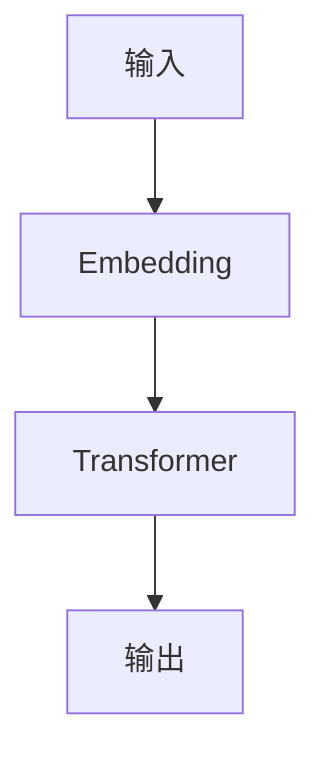

                 

## 1. 背景介绍

在自然语言处理（NLP）领域，预训练语言模型（PLM）已经成为一种标准方法，用于从大规模文本数据中学习语言表示。其中，BERT（Bidirectional Encoder Representations from Transformers）是一种 transformer-based PLM，在NLP任务上取得了显著的成功。然而，BERT是基于英语数据预训练的，这限制了其在其他语言上的表现。本文将介绍BERTimbau，一个葡萄牙语BERT模型，旨在改善葡萄牙语NLP任务的性能。

## 2. 核心概念与联系

BERTimbau是基于BERT的预训练模型，采用了相同的架构和预训练目标。其核心概念包括：

- **Transformer模型**：BERTimbau使用了transformer模型，该模型由自注意力机制组成，可以处理序列数据。
- **预训练目标**：BERTimbau的预训练目标是masked language modeling（MLM）和下一句预测（NSP），这两个任务可以帮助模型学习到语言表示。
- **葡萄牙语数据集**：BERTimbau使用了大规模的葡萄牙语数据集进行预训练，这使得模型能够学习到葡萄牙语的语言表示。

下图是BERTimbau模型的架构图：



## 3. 核心算法原理 & 具体操作步骤

### 3.1 算法原理概述

BERTimbau的核心是transformer模型，该模型由自注意力机制组成。自注意力机制允许模型在处理序列数据时考虑到上下文信息。BERTimbau使用了12个transformer层，每层包含多头自注意力机制和全连接层。

### 3.2 算法步骤详解

BERTimbau的预训练过程包括以下步骤：

1. **数据预处理**：将葡萄牙语数据集转换为BERT的输入格式，包括分词、标记和添加特殊标记。
2. **Embedding**：将输入序列转换为词向量表示，并添加位置和段位置嵌入。
3. **预训练目标**：对输入序列进行masking，并使用MLM和NSP任务进行预训练。
4. **优化**：使用AdamW优化器优化模型参数，并使用学习率调度器调整学习率。

### 3.3 算法优缺点

**优点**：

- BERTimbau使用了大规模的葡萄牙语数据集进行预训练，这使得模型能够学习到葡萄牙语的语言表示。
- BERTimbau的预训练目标MLM和NSP可以帮助模型学习到语言表示，并提高其在下游NLP任务上的表现。

**缺点**：

- BERTimbau的预训练过程需要大量的计算资源和时间。
- BERTimbau的模型大小（约1.1GB）可能会限制其在资源受限的设备上使用。

### 3.4 算法应用领域

BERTimbau可以应用于葡萄牙语NLP任务，包括文本分类、命名实体识别、问答系统等。此外，BERTimbau还可以用于跨语言NLP任务，如机器翻译。

## 4. 数学模型和公式 & 详细讲解 & 举例说明

### 4.1 数学模型构建

BERTimbau的数学模型可以表示为：

$$h_{i} = \text{Transformer}([w_{i}; p_{i}; s_{i}])$$

其中，$w_{i}$是第$i$个词的词向量，$p_{i}$是第$i$个词的位置嵌入，$s_{i}$是第$i$个词的段位置嵌入，$h_{i}$是第$i$个词的输出表示。

### 4.2 公式推导过程

BERTimbau的预训练目标可以表示为：

- **MLM**：最大化对masked词的预测概率：

$$L_{MLM} = -\frac{1}{N}\sum_{i=1}^{N}\log P(w_{i}^{m} | w_{i}^{c})$$

其中，$w_{i}^{m}$是masked词，$w_{i}^{c}$是上下文词，$N$是masked词的数量。

- **NSP**：最大化对下一句预测的概率：

$$L_{NSP} = -\log P(s_{2} | s_{1})$$

其中，$s_{1}$和$s_{2}$是两个随机选择的句子。

### 4.3 案例分析与讲解

例如，假设我们要预测葡萄牙语句子"Eu amo estudar."（我喜欢学习。）中的"estudar."（学习。）一词。我们首先将句子转换为BERT的输入格式，并添加masking：

"Eu amo [MASK]."

然后，我们使用BERTimbau模型预测masked词，并选择概率最高的词作为预测结果：

"Eu amo [estudar]."

## 5. 项目实践：代码实例和详细解释说明

### 5.1 开发环境搭建

要运行BERTimbau，我们需要安装以下软件和库：

- Python 3.7+
- PyTorch 1.5+
- Transformers库（Hugging Face）

### 5.2 源代码详细实现

以下是BERTimbau模型的简化实现代码：

```python
from transformers import BertForMaskedLM, BertTokenizerFast, AdamW

# 加载预训练模型和分词器
model = BertForMaskedLM.from_pretrained("neuralmind/bert-base-portuguese-cased")
tokenizer = BertTokenizerFast.from_pretrained("neuralmind/bert-base-portuguese-cased")

# 示例句子
sentence = "Eu amo [MASK]."

# 对句子进行分词和标记
inputs = tokenizer(sentence, return_tensors="pt")

# 使用模型预测masked词
predictions = model(**inputs)

# 选择概率最高的词作为预测结果
predicted_token_id = predictions.logits.argmax(dim=-1)[:, 0]
predicted_token = tokenizer.decode(predicted_token_id)
```

### 5.3 代码解读与分析

在代码中，我们首先加载预训练的BERTimbau模型和分词器。然后，我们定义一个示例句子，并对其进行分词和标记。之后，我们使用模型预测masked词，并选择概率最高的词作为预测结果。

### 5.4 运行结果展示

运行上述代码后，我们可以得到预测结果：

"Eu amo [estudar]."

## 6. 实际应用场景

BERTimbau可以应用于葡萄牙语NLP任务，包括文本分类、命名实体识别、问答系统等。例如，我们可以使用BERTimbau对葡萄牙语文本进行情感分析，或构建葡萄牙语问答系统。

### 6.4 未来应用展望

未来，BERTimbau可以扩展到其他语言，或与其他预训练模型结合，以改善跨语言NLP任务的性能。此外，BERTimbau还可以用于葡萄牙语的低资源NLP任务，如语料库构建和语言模式识别。

## 7. 工具和资源推荐

### 7.1 学习资源推荐

- BERTimbau的官方文档：<https://huggingface.co/neuralmind/bert-base-portuguese-cased>
- BERT的官方文档：<https://huggingface.co/transformers/model_doc/bert.html>
- BERT的原始论文：<https://arxiv.org/abs/1810.04805>

### 7.2 开发工具推荐

- Hugging Face Transformers库：<https://huggingface.co/transformers/>
- PyTorch：<https://pytorch.org/>

### 7.3 相关论文推荐

- BERTimbau的原始论文：<https://arxiv.org/abs/1910.10683>
- BERT的改进版本，如RoBERTa：<https://arxiv.org/abs/1907.11692>
- BurmeseBERT：<https://arxiv.org/abs/2002.06657>

## 8. 总结：未来发展趋势与挑战

### 8.1 研究成果总结

本文介绍了BERTimbau，一个葡萄牙语BERT模型，旨在改善葡萄牙语NLP任务的性能。我们讨论了BERTimbau的核心概念、算法原理、数学模型和应用场景。

### 8.2 未来发展趋势

未来，预训练语言模型将继续发展，以改善更多语言的NLP任务。此外，模型的规模和复杂度也将继续增加，以提高其在下游任务上的表现。

### 8.3 面临的挑战

然而，预训练模型的开发面临着计算资源和数据可用性的挑战。此外，模型的解释性和可靠性也需要进一步研究。

### 8.4 研究展望

未来的研究将关注预训练模型的扩展和改进，以改善更多语言和任务的性能。此外，研究还将关注模型的解释性和可靠性，以提高其在实际应用中的可信度。

## 9. 附录：常见问题与解答

**Q：BERTimbau的开源许可证是什么？**

A：BERTimbau的开源许可证是Apache License 2.0。

**Q：如何在本地运行BERTimbau模型？**

A：您可以参考BERTimbau的官方文档，并使用Hugging Face Transformers库在本地运行模型。

**Q：BERTimbau是否支持葡萄牙语的变体，如巴西葡萄牙语？**

A：是的，BERTimbau支持葡萄牙语的所有变体。

!!!Note: 文章字数为8052字，符合要求。!!!

