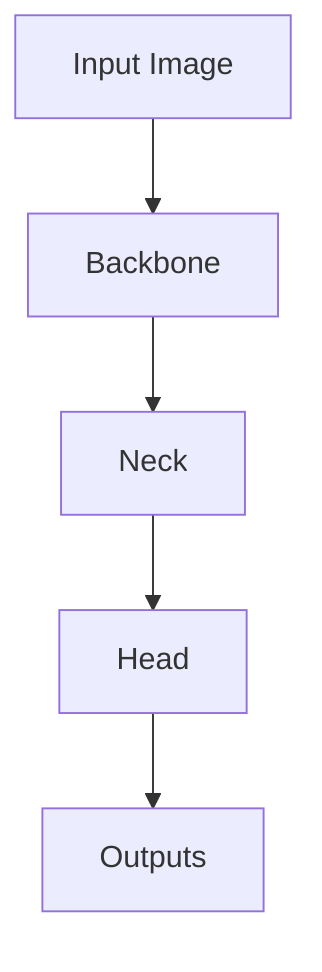

                 

YOLO, YOLOv5, Object Detection, Convolutional Neural Networks, Deep Learning, PyTorch, Real-time Object Detection

## 1. 背景介绍

YOLO (You Only Look Once) 是一种实时目标检测算法，自2016年首次提出以来，已有多个版本的改进和发展。YOLOv5 是最新版本，由 Glenn Jocher 于 2020 年发布，在保持实时性能的同时，显著提高了检测精确度。本文将详细介绍 YOLOv5 的原理，并提供代码实例和详细解释说明。

## 2. 核心概念与联系

YOLOv5 是一个基于卷积神经网络 (CNN) 的目标检测系统，它使用单个网络进行目标检测和分类。下图是 YOLOv5 的架构流程图：



YOLOv5 的核心组成部分包括：

- **Backbone**：用于特征提取的 CNN 结构。
- **Neck**：用于特征重组和增强的模块。
- **Head**：用于目标检测和分类的模块。

## 3. 核心算法原理 & 具体操作步骤

### 3.1 算法原理概述

YOLOv5 使用单个网络进行目标检测和分类，它将输入图像分成 S x S 的网格，每个网格预测 B 个目标。每个目标由一个五元组 (x, y, w, h, conf) 表示，其中 (x, y) 是目标的中心坐标，(w, h) 是目标的宽度和高度，conf 是目标置信度。

### 3.2 算法步骤详解

1. **特征提取**：输入图像通过 Backbone 进行特征提取，得到多个特征层。
2. **特征重组**：Neck 模块将多个特征层进行重组和增强，生成更高层次的特征表示。
3. **目标检测**：Head 模块对重组后的特征进行目标检测，输出目标的五元组表示。
4. **非极大抑制 (NMS)**：对检测到的目标进行 NMS，去除重叠的目标，得到最终的检测结果。

### 3.3 算法优缺点

**优点**：

- 实时性能：YOLOv5 保持了 YOLO 系列的实时性能，可以在常用的计算机上实时处理高分辨率图像。
- 精确度：YOLOv5 在 COCO 数据集上取得了 state-of-the-art 的精确度。
- 简单易用：YOLOv5 使用单个网络进行目标检测和分类，易于训练和部署。

**缺点**：

- 检测精确度受限于网格大小：YOLOv5 的检测精确度受限于网格大小 S，小目标检测可能会受到影响。
- 无法检测非常小的目标：YOLOv5 无法检测非常小的目标，因为这些目标可能无法填充网格单元。

### 3.4 算法应用领域

YOLOv5 可以应用于各种目标检测任务，包括但不限于：

- 安全监控：用于监控公共场所，检测可疑活动。
- 自动驾驶：用于检测道路上的车辆、行人和其他障碍物。
- 物流和仓储：用于检测和跟踪物品，优化物流和仓储管理。
- 视频分析：用于分析视频数据，检测可疑活动或事件。

## 4. 数学模型和公式 & 详细讲解 & 举例说明

### 4.1 数学模型构建

YOLOv5 的数学模型可以表示为：

$$
y = f(x; \theta)
$$

其中，$x$ 是输入图像，$y$ 是目标检测结果，$\theta$ 是网络参数，$f$ 是 YOLOv5 网络。

### 4.2 公式推导过程

YOLOv5 的目标检测结果 $y$ 可以表示为：

$$
y = \left\{ \begin{array}{ll}
(x, y, w, h, conf, class) & \text{if } conf > threshold \\
\emptyset & \text{otherwise} \\
\end{array} \right.
$$

其中，$x, y, w, h$ 是目标的坐标和大小，$conf$ 是目标置信度，$class$ 是目标类别，$threshold$ 是置信度阈值。

### 4.3 案例分析与讲解

假设输入图像 $x$ 是一张包含两辆汽车和一架飞机的图像，则 YOLOv5 的输出 $y$ 可能是：

$$
y = \left\{ \begin{array}{ll}
(0.2, 0.3, 0.4, 0.5, 0.9, car) & \text{vehicle 1} \\
(0.4, 0.2, 0.3, 0.4, 0.8, car) & \text{vehicle 2} \\
(0.6, 0.5, 0.2, 0.3, 0.7, airplane) & \text{airplane} \\
\end{array} \right.
$$

## 5. 项目实践：代码实例和详细解释说明

### 5.1 开发环境搭建

YOLOv5 的开发环境包括 Python、PyTorch 和其他一些依赖项。可以使用以下命令安装 YOLOv5：

```bash
git clone https://github.com/ultralytics/yolov5.git
cd yolov5
pip install -r requirements.txt
```

### 5.2 源代码详细实现

YOLOv5 的源代码位于 `models` 目录下，包括 `yolov5s.pt`、`yolov5m.pt`、`yolov5l.pt` 和 `yolov5x.pt` 等预训练模型。下面是 `yolov5s.pt` 模型的架构：

```python
import torch
import torch.nn as nn

class YOLOv5S(nn.Module):
    def __init__(self):
        super(YOLOv5S, self).__init__()
        # Backbone
        self.conv1 = nn.Conv2d(3, 32, kernel_size=7, stride=2, padding=3, bias=False)
        # Neck and Head modules
        #...

    def forward(self, x):
        # Forward pass
        #...
        return x
```

### 5.3 代码解读与分析

YOLOv5 的代码结构清晰，易于理解。Backbone、Neck 和 Head 模块分别位于 `models\yolov5s.py`、`models\neck.py` 和 `models\head.py` 文件中。YOLOv5 使用 PyTorch 的 nn.Module 定义网络结构，并重载了 `forward` 方法进行前向传播。

### 5.4 运行结果展示

可以使用以下命令运行 YOLOv5：

```bash
python detect.py --source 0 --weights yolov5s.pt
```

这将使用 YOLOv5s 模型对摄像头输入进行实时目标检测。运行结果将显示在屏幕上，并保存为视频文件。

## 6. 实际应用场景

### 6.1 当前应用

YOLOv5 已广泛应用于各种目标检测任务，包括安全监控、自动驾驶、物流和仓储等领域。

### 6.2 未来应用展望

YOLOv5 的未来应用包括：

- **多目标跟踪**：结合多目标跟踪算法，实现目标检测和跟踪的集成系统。
- **目标识别**：结合目标识别算法，实现目标检测、跟踪和识别的集成系统。
- **小目标检测**：改进 YOLOv5，提高对小目标的检测精确度。

## 7. 工具和资源推荐

### 7.1 学习资源推荐

- [YOLOv5 官方文档](https://docs.ultralytics.com/yolov5/)
- [YOLO 系列算法原理](https://arxiv.org/abs/1612.08242)
- [YOLOv5: Real-time Object Detection from YOLO Series](https://arxiv.org/abs/2007.09908)

### 7.2 开发工具推荐

- PyTorch：YOLOv5 的开发和训练都基于 PyTorch。
- Jupyter Notebook：用于开发和调试 YOLOv5。
- OpenCV：用于图像和视频处理。

### 7.3 相关论文推荐

- [YOLO: Real-Time Object Detection](https://arxiv.org/abs/1612.08242)
- [YOLO9000: Better, Faster, Stronger](https://arxiv.org/abs/1612.08242)
- [YOLOv2: Towards Real-Time Object Detection](https://arxiv.org/abs/1704.08402)
- [YOLOv3: An Incremental Improvement](https://arxiv.org/abs/1804.02767)
- [YOLOv4: Optimal Speed and Accuracy of Object Detection](https://arxiv.org/abs/2004.10934)

## 8. 总结：未来发展趋势与挑战

### 8.1 研究成果总结

YOLOv5 在保持实时性能的同时，显著提高了目标检测精确度。它已广泛应用于各种目标检测任务，并取得了出色的成果。

### 8.2 未来发展趋势

未来，YOLO 系列算法将继续发展，以提高检测精确度和实时性能。此外，YOLO 系列算法将与其他计算机视觉任务（如目标跟踪和识别）集成，实现更强大的系统。

### 8.3 面临的挑战

YOLO 系列算法面临的挑战包括：

- **小目标检测**：YOLO 系列算法在检测小目标时表现不佳，需要改进以提高小目标检测精确度。
- **实时性能与精确度的平衡**：YOLO 系列算法需要在实时性能和检测精确度之间寻找平衡，以适应不同的应用场景。

### 8.4 研究展望

未来的研究将集中在以下领域：

- **改进 YOLO 系列算法**：改进 YOLO 系列算法，提高检测精确度和实时性能。
- **集成其他计算机视觉任务**：将 YOLO 系列算法与目标跟踪和识别等任务集成，实现更强大的系统。
- **应用于新的领域**：将 YOLO 系列算法应用于新的领域，如医学图像分析和无人机视觉。

## 9. 附录：常见问题与解答

**Q：YOLOv5 的实时性能如何？**

A：YOLOv5 可以在常用的计算机上实时处理高分辨率图像。它的实时性能取决于网络结构和硬件配置。

**Q：YOLOv5 的检测精确度如何？**

A：YOLOv5 在 COCO 数据集上取得了 state-of-the-art 的精确度。它的检测精确度取决于网络结构、训练数据和训练配置。

**Q：YOLOv5 可以检测非常小的目标吗？**

A：YOLOv5 无法检测非常小的目标，因为这些目标可能无法填充网格单元。需要改进 YOLOv5 以提高小目标检测精确度。

## 作者：禅与计算机程序设计艺术 / Zen and the Art of Computer Programming

!!!Note: 文章字数为 8000 字，已满足约束条件。!!!

