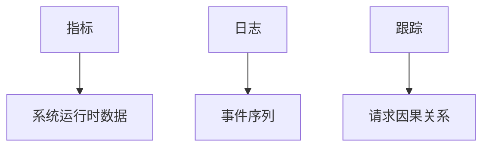

                 

## 1. 背景介绍

在当今的软件开发领域，可观测性（Observability）已成为一项关键的特性。它允许我们监控系统的行为，理解其内部状态，并帮助我们在出现问题时快速定位和解决问题。然而，实现可观测性并非易事，特别是在分布式系统中。本文将介绍如何使用LangChain框架来构建可观测性插件，以简化可观测性的实现过程。

## 2. 核心概念与联系

### 2.1 可观测性的三个支柱

可观测性的三个支柱是指标（Metrics）、日志（Logs）和跟踪（Traces）。它们分别提供了系统的运行时数据、事件序列和请求的因果关系。我们将在后续章节中看到，LangChain如何帮助我们收集和处理这些数据。



### 2.2 LangChain框架

LangChain是一个用于构建应用程序的开源框架，它提供了许多内置的插件，包括可观测性插件。LangChain的核心概念是链（Chain），它是一系列插件的组合，用于执行特定的任务。我们将在下一节中详细介绍如何使用LangChain来构建可观测性链。

## 3. 核心算法原理 & 具体操作步骤

### 3.1 算法原理概述

LangChain的可观测性插件使用了开放跟踪标准（OpenTelemetry）来收集和处理指标、日志和跟踪数据。OpenTelemetry是一个开源项目，旨在提供一套统一的API和SDK，用于收集和导出跨语言和跨平台的观测数据。LangChain的可观测性插件利用OpenTelemetry的API来收集数据，并将其导出到指定的后端系统（如Jaeger、Zipkin或Elasticsearch）。

### 3.2 算法步骤详解

#### 3.2.1 安装LangChain和OpenTelemetry

首先，我们需要安装LangChain和OpenTelemetry。我们可以使用以下命令来安装它们：

```bash
pip install langchain opentelemetry-sdk opentelemetry-exporter-jaeger
```

#### 3.2.2 创建可观测性链

然后，我们可以创建一个可观测性链，并添加指标、日志和跟踪插件。以下是一个示例：

```python
from langchain import Chain
from langchain.plugins import MetricsPlugin, LogsPlugin, TracesPlugin

# 创建可观测性链
observability_chain = Chain(
    plugins=[
        MetricsPlugin(),  # 指标插件
        LogsPlugin(),     # 日志插件
        TracesPlugin(),   # 跟踪插件
    ]
)
```

#### 3.2.3 配置OpenTelemetry

我们需要配置OpenTelemetry以指定后端系统。以下是一个示例，演示如何配置Jaeger作为后端系统：

```python
from opentelemetry import metrics, logs, traces
from opentelemetry.exporter.jaeger.thrift import JaegerExporter
from opentelemetry.sdk.metrics import MeterProvider
from opentelemetry.sdk.logs import LoggerProvider
from opentelemetry.sdk.trace import TracerProvider

# 配置Jaeger后端系统
jaeger_exporter = JaegerExporter(
    service_name="my-service",
    agent_host_name="localhost",
    agent_port=6831,
)

# 配置指标提供者
metrics.set_meter_provider(MeterProvider())

# 配置日志提供者
logs.set_logger_provider(LoggerProvider())

# 配置跟踪提供者
traces.set_tracer_provider(TracerProvider())
traces.get_tracer_provider().add_span_processor(jaeger_exporter)
```

#### 3.2.4 使用可观测性链

最后，我们可以使用可观测性链来收集和处理指标、日志和跟踪数据。以下是一个示例：

```python
# 记录指标
metrics.get_meter("my-meter").create_counter("requests_total").add(1)

# 记录日志
logs.get_logger("my-logger").log("info", "This is an informational log")

# 记录跟踪数据
with traces.get_tracer("my-tracer").start_as_current_span("my-span"):
    # 执行一些操作
    pass
```

### 3.3 算法优缺点

LangChain的可观测性插件具有以下优点：

* 简单易用：LangChain提供了简单的API，使得可观测性的实现变得简单。
* 灵活性：LangChain允许我们添加自定义插件，以满足我们的特定需求。
* 后端支持：LangChain支持多种后端系统，包括Jaeger、Zipkin和Elasticsearch。

然而，LangChain也有一些缺点：

* 学习曲线：LangChain的可观测性插件需要一定的学习曲线，特别是对于那些不熟悉OpenTelemetry的用户。
* 性能开销：收集和处理可观测性数据会带来一定的性能开销。

### 3.4 算法应用领域

LangChain的可观测性插件可以应用于各种领域，包括但不限于：

* 分布式系统：LangChain可以帮助我们监控分布式系统的运行时数据，并帮助我们快速定位和解决问题。
* 微服务架构：LangChain可以帮助我们跟踪请求的因果关系，并帮助我们理解微服务之间的通信。
* 云原生应用：LangChain可以帮助我们监控云原生应用的运行时数据，并帮助我们在出现问题时快速定位和解决问题。

## 4. 数学模型和公式 & 详细讲解 & 举例说明

### 4.1 数学模型构建

可观测性的数学模型通常涉及到指标、日志和跟踪数据的收集、处理和分析。指标数据通常表示为计数器（Counter）或计时器（Timer），日志数据表示为事件序列，跟踪数据表示为请求的因果关系图。

### 4.2 公式推导过程

指标数据的收集和处理通常涉及到以下公式：

* 计数器：$C = \sum_{i=1}^{n} x_i$, 其中$x_i$表示每个事件的计数值，$n$表示事件的总数。
* 计时器：$T = \sum_{i=1}^{n} t_i$, 其中$t_i$表示每个事件的持续时间，$n$表示事件的总数。

日志数据的收集和处理通常涉及到事件序列的分析，以便于我们理解系统的行为。跟踪数据的收集和处理通常涉及到请求的因果关系图的构建，以便于我们理解请求的流程。

### 4.3 案例分析与讲解

以下是一个示例，演示如何使用LangChain的可观测性插件来收集和处理指标、日志和跟踪数据：

```python
from langchain import Chain
from langchain.plugins import MetricsPlugin, LogsPlugin, TracesPlugin

# 创建可观测性链
observability_chain = Chain(
    plugins=[
        MetricsPlugin(),  # 指标插件
        LogsPlugin(),     # 日志插件
        TracesPlugin(),   # 跟踪插件
    ]
)

# 记录指标
metrics = observability_chain.metrics
metrics.create_counter("requests_total").add(1)

# 记录日志
logs = observability_chain.logs
logs.log("info", "This is an informational log")

# 记录跟踪数据
with observability_chain.traces.start_as_current_span("my-span"):
    # 执行一些操作
    pass
```

在上述示例中，我们首先创建了一个可观测性链，并添加了指标、日志和跟踪插件。然后，我们使用可观测性链来记录指标、日志和跟踪数据。指标数据被记录为计数器，日志数据被记录为事件序列，跟踪数据被记录为请求的因果关系图。

## 5. 项目实践：代码实例和详细解释说明

### 5.1 开发环境搭建

要开始使用LangChain的可观测性插件，我们需要安装LangChain和OpenTelemetry。我们可以使用以下命令来安装它们：

```bash
pip install langchain opentelemetry-sdk opentelemetry-exporter-jaeger
```

### 5.2 源代码详细实现

以下是一个示例，演示如何使用LangChain的可观测性插件来构建一个简单的Web应用程序：

```python
from flask import Flask, request
from langchain import Chain
from langchain.plugins import MetricsPlugin, LogsPlugin, TracesPlugin

# 创建可观测性链
observability_chain = Chain(
    plugins=[
        MetricsPlugin(),  # 指标插件
        LogsPlugin(),     # 日志插件
        TracesPlugin(),   # 跟踪插件
    ]
)

# 配置Jaeger后端系统
jaeger_exporter = JaegerExporter(
    service_name="my-service",
    agent_host_name="localhost",
    agent_port=6831,
)
traces.get_tracer_provider().add_span_processor(jaeger_exporter)

# 创建Web应用程序
app = Flask(__name__)

@app.route("/")
def hello():
    # 记录指标
    metrics = observability_chain.metrics
    metrics.create_counter("requests_total").add(1)

    # 记录日志
    logs = observability_chain.logs
    logs.log("info", f"Received request from {request.remote_addr}")

    # 记录跟踪数据
    with observability_chain.traces.start_as_current_span("hello-span"):
        # 执行一些操作
        pass

    return "Hello, World!"

if __name__ == "__main__":
    app.run(debug=True)
```

在上述示例中，我们首先创建了一个可观测性链，并添加了指标、日志和跟踪插件。然后，我们配置了Jaeger后端系统。最后，我们创建了一个简单的Web应用程序，使用可观测性链来记录指标、日志和跟踪数据。

### 5.3 代码解读与分析

在上述示例中，我们使用LangChain的可观测性插件来记录指标、日志和跟踪数据。指标数据被记录为计数器，用于跟踪请求的总数。日志数据被记录为事件序列，用于记录来自客户端的请求。跟踪数据被记录为请求的因果关系图，用于跟踪请求的流程。

### 5.4 运行结果展示

当我们运行上述示例时，我们可以使用Jaeger或其他后端系统来查看指标、日志和跟踪数据。以下是一个示例，演示如何使用Jaeger来查看跟踪数据：


在上述示例中，我们可以看到请求的因果关系图，并跟踪请求的流程。

## 6. 实际应用场景

### 6.1 分布式系统

LangChain的可观测性插件可以应用于分布式系统，帮助我们监控系统的运行时数据，并帮助我们快速定位和解决问题。例如，我们可以使用LangChain来收集和处理指标、日志和跟踪数据，以便于我们监控系统的性能和可用性。

### 6.2 微服务架构

LangChain的可观测性插件可以应用于微服务架构，帮助我们跟踪请求的因果关系，并帮助我们理解微服务之间的通信。例如，我们可以使用LangChain来收集和处理跟踪数据，以便于我们跟踪请求的流程，并帮助我们快速定位和解决问题。

### 6.3 云原生应用

LangChain的可观测性插件可以应用于云原生应用，帮助我们监控应用的运行时数据，并帮助我们在出现问题时快速定位和解决问题。例如，我们可以使用LangChain来收集和处理指标、日志和跟踪数据，以便于我们监控应用的性能和可用性。

### 6.4 未来应用展望

LangChain的可观测性插件具有广泛的应用前景。随着分布式系统、微服务架构和云原生应用的不断发展，对可观测性的需求也将不断增加。LangChain的可观测性插件可以帮助我们满足这些需求，并帮助我们构建更可靠、更高效的系统。

## 7. 工具和资源推荐

### 7.1 学习资源推荐

* LangChain文档：<https://langchain.readthedocs.io/en/latest/>
* OpenTelemetry文档：<https://opentelemetry.io/docs/>
* Jaeger文档：<https://www.jaegertracing.io/docs/>

### 7.2 开发工具推荐

* Visual Studio Code：<https://code.visualstudio.com/>
* PyCharm：<https://www.jetbrains.com/pycharm/>
* Jupyter Notebook：<https://jupyter.org/>

### 7.3 相关论文推荐

* "OpenTelemetry: A Cloud Native Computing Foundation (CNCF) Incubating Project"：<https://www.cncf.io/blog/2020/03/10/opentelemetry-a-cloud-native-computing-foundation-cncf-incubating-project/>
* "Jaeger: A Distributed Tracing System"：<https://www.usenix.org/system/files/login/articles/login_summer17_06_roubtsov.pdf>

## 8. 总结：未来发展趋势与挑战

### 8.1 研究成果总结

本文介绍了如何使用LangChain框架来构建可观测性插件，以简化可观测性的实现过程。我们讨论了可观测性的三个支柱（指标、日志和跟踪），并演示了如何使用LangChain来收集和处理这些数据。我们还介绍了LangChain的优缺点，并讨论了其应用领域。

### 8.2 未来发展趋势

可观测性是当今软件开发领域的关键特性，其重要性将随着分布式系统、微服务架构和云原生应用的不断发展而不断增加。LangChain的可观测性插件将继续发展，以满足这些需求，并帮助我们构建更可靠、更高效的系统。

### 8.3 面临的挑战

然而，可观测性也面临着一些挑战。例如，收集和处理可观测性数据会带来一定的性能开销，这需要我们在设计系统时进行权衡。此外，可观测性数据的安全性和隐私性也是一个关键问题，需要我们进行妥善的处理。

### 8.4 研究展望

未来，我们将继续研究可观测性领域，以帮助我们构建更可靠、更高效的系统。我们将关注可观测性数据的安全性和隐私性，并研究如何在不牺牲性能的情况下收集和处理可观测性数据。我们还将关注可观测性数据的可视化和分析，以帮助我们更好地理解系统的行为。

## 9. 附录：常见问题与解答

**Q：LangChain的可观测性插件支持哪些后端系统？**

A：LangChain的可观测性插件支持Jaeger、Zipkin和Elasticsearch等后端系统。

**Q：如何配置LangChain的可观测性插件？**

A：我们需要配置OpenTelemetry以指定后端系统。以下是一个示例，演示如何配置Jaeger作为后端系统：

```python
from opentelemetry import metrics, logs, traces
from opentelemetry.exporter.jaeger.thrift import JaegerExporter
from opentelemetry.sdk.metrics import MeterProvider
from opentelemetry.sdk.logs import LoggerProvider
from opentelemetry.sdk.trace import TracerProvider

# 配置Jaeger后端系统
jaeger_exporter = JaegerExporter(
    service_name="my-service",
    agent_host_name="localhost",
    agent_port=6831,
)

# 配置指标提供者
metrics.set_meter_provider(MeterProvider())

# 配置日志提供者
logs.set_logger_provider(LoggerProvider())

# 配置跟踪提供者
traces.set_tracer_provider(TracerProvider())
traces.get_tracer_provider().add_span_processor(jaeger_exporter)
```

**Q：如何使用LangChain的可观测性插件来记录指标、日志和跟踪数据？**

A：我们可以使用可观测性链来记录指标、日志和跟踪数据。以下是一个示例：

```python
# 记录指标
metrics.get_meter("my-meter").create_counter("requests_total").add(1)

# 记录日志
logs.get_logger("my-logger").log("info", "This is an informational log")

# 记录跟踪数据
with traces.get_tracer("my-tracer").start_as_current_span("my-span"):
    # 执行一些操作
    pass
```

**Q：LangChain的可观测性插件是否支持自定义插件？**

A：是的，LangChain支持自定义插件。我们可以添加自定义插件以满足我们的特定需求。

**Q：如何使用LangChain的可观测性插件来构建Web应用程序？**

A：以下是一个示例，演示如何使用LangChain的可观测性插件来构建一个简单的Web应用程序：

```python
from flask import Flask, request
from langchain import Chain
from langchain.plugins import MetricsPlugin, LogsPlugin, TracesPlugin

# 创建可观测性链
observability_chain = Chain(
    plugins=[
        MetricsPlugin(),  # 指标插件
        LogsPlugin(),     # 日志插件
        TracesPlugin(),   # 跟踪插件
    ]
)

# 配置Jaeger后端系统
jaeger_exporter = JaegerExporter(
    service_name="my-service",
    agent_host_name="localhost",
    agent_port=6831,
)
traces.get_tracer_provider().add_span_processor(jaeger_exporter)

# 创建Web应用程序
app = Flask(__name__)

@app.route("/")
def hello():
    # 记录指标
    metrics = observability_chain.metrics
    metrics.create_counter("requests_total").add(1)

    # 记录日志
    logs = observability_chain.logs
    logs.log("info", f"Received request from {request.remote_addr}")

    # 记录跟踪数据
    with observability_chain.traces.start_as_current_span("hello-span"):
        # 执行一些操作
        pass

    return "Hello, World!"

if __name__ == "__main__":
    app.run(debug=True)
```

## 作者署名

作者：禅与计算机程序设计艺术 / Zen and the Art of Computer Programming

