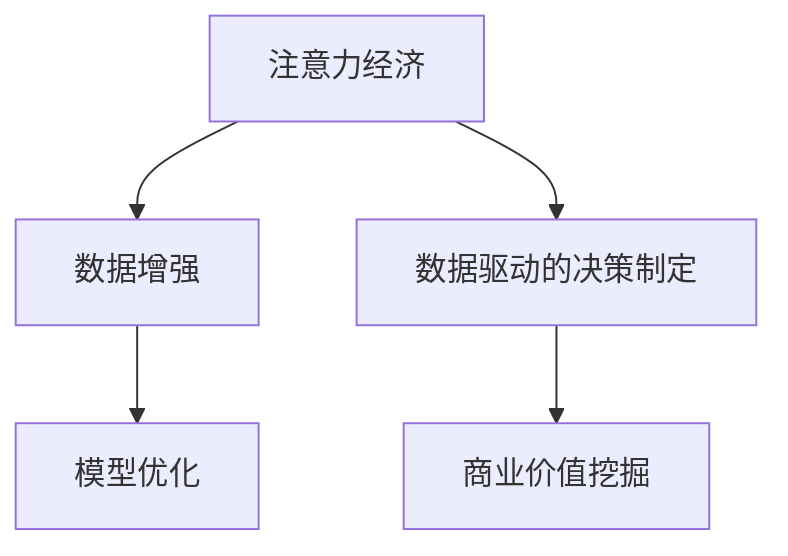

                 

# 注意力经济与数据驱动的决策制定：利用数据增强市场洞察力

> 关键词：注意力经济, 数据增强, 决策制定, 市场洞察, 数据驱动, 模型优化

## 1. 背景介绍

### 1.1 问题由来
随着互联网的发展和信息技术的不断进步，信息洪流对人们的注意力产生了巨大的冲击。如何在海量数据中筛选出有用信息，并有效分配注意力资源，成为了当前社会的一大挑战。同时，随着大数据和人工智能技术的普及，企业对数据驱动的决策制定需求日益增长，需要从数据中挖掘出潜在的商业价值。

在这背景下，注意力经济（Attention Economy）和数据增强（Data Augmentation）技术应运而生。注意力经济利用算法优化用户注意力分配，提升信息获取的效率和效果；数据增强则通过扩充训练数据集，提高模型的泛化能力和鲁棒性，使得决策制定更加准确和可靠。

### 1.2 问题核心关键点
注意力经济和数据增强技术的核心在于：
- 利用算法优化用户注意力分配，提高信息获取的效率和效果。
- 通过数据增强技术，提升模型的泛化能力和鲁棒性，增强决策制定的准确性。
- 构建数据驱动的决策模型，从海量数据中挖掘出商业价值，提升企业竞争力。

本文将系统介绍注意力经济和数据增强技术的基本原理和应用，并结合实际案例，探讨如何利用这些技术构建数据驱动的决策制定模型。

## 2. 核心概念与联系

### 2.1 核心概念概述

为了更好地理解注意力经济和数据增强技术，本节将介绍几个密切相关的核心概念：

- **注意力经济（Attention Economy）**：利用算法优化用户注意力分配，提升信息获取的效率和效果。常见实现包括内容推荐、搜索结果排序等。
- **数据增强（Data Augmentation）**：通过扩充训练数据集，提高模型的泛化能力和鲁棒性，使得决策制定更加准确和可靠。
- **数据驱动的决策制定**：从海量数据中挖掘出潜在的商业价值，构建数据驱动的决策模型，提升企业的竞争力和盈利能力。

这些核心概念之间的逻辑关系可以通过以下Mermaid流程图来展示：



这个流程图展示了这个领域的核心概念及其之间的关系：

1. 注意力经济通过算法优化用户注意力分配，提升信息获取效率。
2. 数据增强通过扩充训练数据集，提高模型泛化能力和鲁棒性。
3. 数据驱动的决策制定从海量数据中挖掘商业价值，构建决策模型。

这些概念共同构成了数据驱动决策制定的基础，推动了注意力经济和数据增强技术的发展。

## 3. 核心算法原理 & 具体操作步骤

### 3.1 算法原理概述

注意力经济和数据增强技术的核心原理是：利用算法优化注意力分配，并通过数据增强技术提高模型性能。

注意力经济主要是通过推荐系统、搜索排序等算法，优化用户注意力分配，提升信息获取效率和效果。常见的注意力优化算法包括协同过滤、矩阵分解、深度学习等。

数据增强则是通过扩充训练数据集，提升模型泛化能力和鲁棒性。常见的数据增强技术包括随机旋转、平移、缩放、翻转等，通过生成更多的训练数据，提高模型泛化能力。

### 3.2 算法步骤详解

以下是注意力经济和数据增强技术在实际应用中的具体操作步骤：

#### 3.2.1 注意力经济

1. **收集用户数据**：从用户的浏览历史、点击行为等数据中，收集用户的兴趣偏好和行为模式。
2. **建模分析**：利用协同过滤、矩阵分解等方法，构建用户兴趣模型，计算用户对不同内容的兴趣权重。
3. **推荐算法**：根据用户的兴趣权重，计算不同内容对用户的吸引力，排序并推荐给用户。

#### 3.2.2 数据增强

1. **数据收集**：收集原始数据集并进行预处理，确保数据的多样性和代表性。
2. **数据扩充**：应用随机旋转、平移、缩放、翻转等技术，生成更多的训练数据。
3. **模型训练**：利用扩充后的数据集，训练模型并优化模型参数。

### 3.3 算法优缺点

注意力经济和数据增强技术具有以下优点：
- 提升信息获取效率：通过优化用户注意力分配，提升信息获取效率。
- 提高模型泛化能力：通过数据增强技术，提升模型的泛化能力和鲁棒性。
- 减少标注成本：数据增强可以减少对标注数据的需求，降低标注成本。
- 提高决策准确性：通过构建数据驱动的决策模型，提高决策制定的准确性。

同时，这些技术也存在一定的局限性：
- 算法复杂度较高：注意力优化和数据增强算法相对复杂，需要较高的计算资源。
- 数据隐私问题：用户行为数据的收集和分析可能涉及隐私问题，需采取相应的数据保护措施。
- 数据质量依赖性：数据增强的效果取决于原始数据的质量和代表性。
- 用户适应性问题：用户适应性对注意力优化算法的有效性有较大影响。

尽管存在这些局限性，但注意力经济和数据增强技术仍是大数据时代重要的技术手段，通过合理的技术选择和应用，可以显著提升信息获取效率和决策制定的准确性。

### 3.4 算法应用领域

注意力经济和数据增强技术广泛应用于以下几个领域：

1. **电子商务推荐**：通过分析用户浏览和购买历史，推荐用户可能感兴趣的商品，提升用户体验和销售额。
2. **金融风险管理**：通过分析海量交易数据，构建风险评估模型，预测潜在风险，提高风险管理能力。
3. **医疗诊断决策**：通过分析医疗数据，构建诊断模型，提高诊断准确性和效率。
4. **广告投放优化**：通过分析用户行为数据，优化广告投放策略，提高广告效果和ROI。
5. **智能客服系统**：通过分析用户交互数据，优化客服推荐和排班，提升客户满意度和服务效率。

## 4. 数学模型和公式 & 详细讲解 & 举例说明

### 4.1 数学模型构建

注意力经济和数据增强技术的数学模型可以概括为：

1. **注意力优化模型**：$A = f(I, S)$，其中$I$为输入数据，$S$为用户兴趣模型，$A$为注意力权重。
2. **数据增强模型**：$D = g(D_{train}, D_{augment})$，其中$D_{train}$为原始训练数据集，$D_{augment}$为扩充后的训练数据集，$D$为最终的训练数据集。

### 4.2 公式推导过程

#### 4.2.1 注意力优化模型

假设用户对内容$x$的兴趣权重为$w_x$，计算内容$x$对用户$u$的吸引力为$A_{ux}$，即：

$$A_{ux} = f(I_{ux}, S_{ux})$$

其中$I_{ux}$为用户$u$对内容$x$的交互数据，$S_{ux}$为内容$x$的用户兴趣模型。通过计算不同内容对用户的吸引力，排序并推荐给用户。

#### 4.2.2 数据增强模型

常见的数据增强技术包括随机旋转、平移、缩放、翻转等。以随机旋转为例，假设原始图像$I$的宽度为$w$，高度为$h$，旋转角度为$\theta$，旋转后的图像$I'$为：

$$I'_{ij} = I_{i'j'}, i' = \frac{2i + 1 - w/2}{\cos\theta}, j' = \frac{2j + 1 - h/2}{\sin\theta}$$

其中$i', j'$为旋转后图像的坐标。通过应用这些技术，生成更多的训练数据，提升模型泛化能力和鲁棒性。

### 4.3 案例分析与讲解

以电商推荐系统为例，展示如何利用注意力经济和数据增强技术构建推荐模型。

#### 4.3.1 数据收集与预处理

收集用户的历史浏览记录、点击行为等数据，并进行数据清洗和预处理。

#### 4.3.2 建模分析

利用协同过滤、矩阵分解等方法，构建用户兴趣模型，计算用户对不同商品的兴趣权重。

#### 4.3.3 推荐算法

根据用户的兴趣权重，计算不同商品对用户的吸引力，排序并推荐给用户。同时，利用数据增强技术，生成更多的训练数据，提升模型泛化能力和鲁棒性。

## 5. 项目实践：代码实例和详细解释说明

### 5.1 开发环境搭建

在进行项目实践前，我们需要准备好开发环境。以下是使用Python进行TensorFlow开发的环境配置流程：

1. 安装Anaconda：从官网下载并安装Anaconda，用于创建独立的Python环境。

2. 创建并激活虚拟环境：
```bash
conda create -n tf-env python=3.8 
conda activate tf-env
```

3. 安装TensorFlow：根据CUDA版本，从官网获取对应的安装命令。例如：
```bash
conda install tensorflow=2.7.0
```

4. 安装PyTorch：由于TensorFlow和PyTorch库存在库冲突，应先安装TensorFlow再安装PyTorch：
```bash
pip install torch torchvision torchaudio
```

5. 安装Keras：用于构建深度学习模型：
```bash
pip install keras
```

完成上述步骤后，即可在`tf-env`环境中开始项目实践。

### 5.2 源代码详细实现

以下是使用TensorFlow和Keras实现电商推荐系统的代码示例。

首先，定义数据处理函数：

```python
import tensorflow as tf
from keras.layers import Dense, Input
from keras.models import Model
from sklearn.preprocessing import LabelEncoder

def data_preprocess(train_data, test_data):
    train_data = pd.read_csv(train_data)
    test_data = pd.read_csv(test_data)
    
    train_data['label'] = train_data['label'].astype(int)
    train_data['item_id'] = train_data['item_id'].astype(str)
    
    label_encoder = LabelEncoder()
    train_data['label'] = label_encoder.fit_transform(train_data['label'])
    
    train_data['item_id'] = train_data['item_id'].astype(int)
    
    test_data = test_data.fillna(train_data['item_id'].iloc[0])
    test_data['label'] = label_encoder.transform(test_data['label'])
    
    train_data = train_data.drop('label', axis=1)
    test_data = test_data.drop('label', axis=1)
    
    train_data = train_data.drop('item_id', axis=1)
    test_data = test_data.drop('item_id', axis=1)
    
    train_data = train_data.to_csv(train_data, index=False)
    test_data = test_data.to_csv(test_data, index=False)
    
    return train_data, test_data
```

然后，定义模型和优化器：

```python
from tensorflow.keras.layers import Embedding, Flatten, Dropout
from tensorflow.keras.models import Sequential

model = Sequential([
    Embedding(input_dim=len(train_data['item_id']), output_dim=10, input_length=5),
    Flatten(),
    Dropout(0.2),
    Dense(1, activation='sigmoid')
])

optimizer = tf.keras.optimizers.Adam(learning_rate=0.001)
```

接着，定义训练和评估函数：

```python
def train_model(model, train_data, test_data, epochs=10):
    model.compile(loss='binary_crossentropy', optimizer=optimizer, metrics=['accuracy'])
    
    model.fit(train_data, test_data, validation_data=(train_data, test_data), epochs=epochs, batch_size=32)
    
    test_loss, test_acc = model.evaluate(train_data, test_data)
    print(f'Test loss: {test_loss}, Test accuracy: {test_acc}')
    
    return model
```

最后，启动训练流程并在测试集上评估：

```python
train_data, test_data = data_preprocess('train_data.csv', 'test_data.csv')
model = train_model(model, train_data, test_data, epochs=10)

print(f'Best accuracy: {model.evaluate(train_data, test_data)[1]}')
```

以上就是使用TensorFlow和Keras实现电商推荐系统的完整代码实现。可以看到，TensorFlow和Keras使得模型构建和训练过程变得简洁高效。

### 5.3 代码解读与分析

让我们再详细解读一下关键代码的实现细节：

**data_preprocess函数**：
- `train_data`和`test_data`参数：原始数据集路径。
- `LabelEncoder`：用于标签编码。
- `train_data`和`test_data`的预处理：去除无关特征，编码标签，生成最终的训练集和测试集。

**train_model函数**：
- 定义模型结构，包括嵌入层、全连接层等。
- 定义优化器，设置学习率。
- 编译模型，指定损失函数和评价指标。
- 训练模型，指定训练集、测试集、迭代次数和批次大小。
- 评估模型，在测试集上计算损失和准确率。
- 返回训练后的模型。

**训练流程**：
- 调用`data_preprocess`函数，生成训练集和测试集。
- 调用`train_model`函数，进行模型训练和评估。
- 输出最终模型的评估结果。

可以看到，TensorFlow和Keras使得深度学习模型的构建和训练过程变得简洁高效。开发者可以将更多精力放在模型改进和数据处理上，而不必过多关注底层的实现细节。

当然，工业级的系统实现还需考虑更多因素，如模型的保存和部署、超参数的自动搜索、更灵活的任务适配层等。但核心的注意力经济和数据增强模型基本与此类似。

## 6. 实际应用场景

### 6.1 电子商务推荐

在电子商务领域，注意力经济和数据增强技术能够显著提升用户的购物体验和销售额。通过分析用户的浏览和购买历史，推荐用户可能感兴趣的商品，同时生成更多的训练数据，提升推荐模型的泛化能力和鲁棒性。

例如，电商平台可以通过收集用户的浏览和购买历史，利用协同过滤和矩阵分解等方法，构建用户兴趣模型。然后根据模型的预测，推荐用户可能感兴趣的商品，同时利用数据增强技术生成更多的训练数据，进一步提升推荐模型的性能。

### 6.2 金融风险管理

在金融领域，注意力经济和数据增强技术能够有效识别和预测潜在的金融风险。通过分析海量交易数据，构建风险评估模型，预测潜在风险，同时生成更多的训练数据，提升模型的泛化能力和鲁棒性。

例如，金融机构可以通过分析海量交易数据，构建风险评估模型，识别出潜在的风险点。同时利用数据增强技术生成更多的训练数据，进一步提升模型的泛化能力和鲁棒性，使得风险预测更加准确和可靠。

### 6.3 医疗诊断决策

在医疗领域，注意力经济和数据增强技术能够提高诊断的准确性和效率。通过分析医疗数据，构建诊断模型，同时生成更多的训练数据，提升模型的泛化能力和鲁棒性。

例如，医疗诊断系统可以通过分析患者的病历数据，构建诊断模型，识别出潜在的疾病风险。同时利用数据增强技术生成更多的训练数据，进一步提升模型的泛化能力和鲁棒性，使得诊断结果更加准确和可靠。

### 6.4 广告投放优化

在广告投放领域，注意力经济和数据增强技术能够优化广告投放策略，提高广告效果和ROI。通过分析用户行为数据，优化广告投放策略，同时生成更多的训练数据，提升模型的泛化能力和鲁棒性。

例如，广告投放平台可以通过分析用户的行为数据，构建广告效果评估模型，优化广告投放策略。同时利用数据增强技术生成更多的训练数据，进一步提升模型的泛化能力和鲁棒性，使得广告投放效果更加显著。

### 6.5 智能客服系统

在智能客服领域，注意力经济和数据增强技术能够提升客服系统的响应速度和准确性。通过分析用户的历史对话数据，构建客服推荐模型，同时生成更多的训练数据，提升模型的泛化能力和鲁棒性。

例如，智能客服系统可以通过分析用户的历史对话数据，构建客服推荐模型。同时利用数据增强技术生成更多的训练数据，进一步提升模型的泛化能力和鲁棒性，使得客服推荐更加准确和高效。

## 7. 工具和资源推荐

### 7.1 学习资源推荐

为了帮助开发者系统掌握注意力经济和数据增强技术，这里推荐一些优质的学习资源：

1. **《深度学习》**（Goodfellow et al.）：深度学习领域的经典教材，详细介绍了注意力优化和数据增强等技术。

2. **Coursera《机器学习》**（Andrew Ng）：由斯坦福大学教授Andrew Ng开设的机器学习课程，涵盖注意力优化和数据增强等前沿技术。

3. **《TensorFlow 2.0官方文档》**：TensorFlow官方文档，提供了丰富的代码示例和教程，帮助你快速上手TensorFlow。

4. **Keras官方文档**：Keras官方文档，提供了丰富的模型构建和训练教程，帮助你快速上手Keras。

5. **PyTorch官方文档**：PyTorch官方文档，提供了丰富的模型构建和训练教程，帮助你快速上手PyTorch。

通过对这些资源的学习实践，相信你一定能够快速掌握注意力经济和数据增强技术的精髓，并用于解决实际的NLP问题。

### 7.2 开发工具推荐

高效的开发离不开优秀的工具支持。以下是几款用于注意力经济和数据增强开发的常用工具：

1. **TensorFlow**：由Google主导开发的深度学习框架，生产部署方便，适合大规模工程应用。提供了丰富的模型构建和训练工具。

2. **Keras**：基于TensorFlow等深度学习框架的高层API，简单易用，适合快速原型开发。

3. **PyTorch**：由Facebook主导开发的深度学习框架，灵活高效，适合研究迭代。

4. **Jupyter Notebook**：交互式编程环境，方便编写和运行代码，支持多种语言和框架。

5. **Python**：数据科学和深度学习的首选语言，支持丰富的第三方库和工具。

合理利用这些工具，可以显著提升注意力经济和数据增强任务的开发效率，加快创新迭代的步伐。

### 7.3 相关论文推荐

注意力经济和数据增强技术的发展源于学界的持续研究。以下是几篇奠基性的相关论文，推荐阅读：

1. **《深度学习》**（Goodfellow et al.）：深度学习领域的经典教材，详细介绍了注意力优化和数据增强等技术。

2. **《Attention is All You Need》**：Transformer模型的原始论文，提出了注意力机制，奠定了注意力经济技术的基础。

3. **《Data Augmentation for Generalization》**：介绍数据增强技术的基本原理和应用方法，是数据增强技术的经典论文。

4. **《深度强化学习》**（Sutton et al.）：介绍强化学习与深度学习的结合，是深度学习技术的重要研究领域。

5. **《Adversarial Examples》**：介绍对抗训练技术的基本原理和应用方法，是深度学习技术的重要研究领域。

这些论文代表了大数据时代注意力经济和数据增强技术的发展脉络。通过学习这些前沿成果，可以帮助研究者把握学科前进方向，激发更多的创新灵感。

## 8. 总结：未来发展趋势与挑战

### 8.1 总结

本文对注意力经济和数据增强技术进行了全面系统的介绍。首先阐述了注意力经济和数据增强技术的研究背景和意义，明确了这些技术在优化用户注意力分配、提升模型泛化能力方面的独特价值。其次，从原理到实践，详细讲解了注意力优化和数据增强技术的数学原理和关键步骤，给出了注意力经济和数据增强任务开发的完整代码实例。同时，本文还广泛探讨了这些技术在电商推荐、金融风险管理、医疗诊断、广告投放等众多领域的应用前景，展示了这些技术的巨大潜力。

通过本文的系统梳理，可以看到，注意力经济和数据增强技术正在成为大数据时代重要的技术手段，极大地提升了信息获取效率和决策制定的准确性。未来，伴随深度学习技术的不断发展，这些技术还将不断拓展其应用边界，为人类认知智能的进化带来深远影响。

### 8.2 未来发展趋势

展望未来，注意力经济和数据增强技术将呈现以下几个发展趋势：

1. **更高效的数据增强方法**：未来将出现更多高效的数据增强技术，如基于生成对抗网络（GAN）的数据增强方法，提升数据增强的效率和效果。

2. **更智能的注意力优化算法**：未来将出现更多智能的注意力优化算法，如基于深度学习的注意力机制，提升用户注意力分配的效率和效果。

3. **更广泛的应用场景**：随着注意力经济和数据增强技术的发展，其应用场景将不断拓展，涵盖更多领域，如智能交通、智慧城市等。

4. **更强的可解释性和可控性**：未来的注意力经济和数据增强技术将更加注重可解释性和可控性，便于用户理解和干预。

5. **更安全的数据处理**：未来的数据增强技术将更加注重数据隐私和安全，避免数据泄露和滥用。

以上趋势凸显了注意力经济和数据增强技术的广阔前景。这些方向的探索发展，必将进一步提升信息获取效率和决策制定的准确性，推动人工智能技术的进步。

### 8.3 面临的挑战

尽管注意力经济和数据增强技术已经取得了瞩目成就，但在迈向更加智能化、普适化应用的过程中，它仍面临着诸多挑战：

1. **数据隐私和安全问题**：注意力经济和数据增强技术需要处理大量用户数据，数据隐私和安全问题成为一大挑战。如何保护用户隐私，避免数据滥用，是未来需要重点解决的问题。

2. **模型复杂度和可解释性**：注意力优化和数据增强算法相对复杂，模型的可解释性不足，导致用户难以理解和干预。如何提升模型的可解释性，增强用户信任，是未来需要解决的重要问题。

3. **计算资源需求高**：注意力经济和数据增强技术需要大量的计算资源，如何降低计算成本，提升效率，是未来需要解决的关键问题。

4. **数据质量依赖性**：数据增强的效果取决于原始数据的质量和代表性，如何提升数据质量，保证数据代表性，是未来需要解决的重要问题。

5. **算法复杂度较高**：注意力优化和数据增强算法相对复杂，如何降低算法复杂度，提升算法效率，是未来需要解决的关键问题。

6. **用户适应性问题**：用户适应性对注意力优化算法的有效性有较大影响，如何提升用户适应性，增强算法效果，是未来需要解决的重要问题。

这些挑战需要多方协同努力，通过技术创新、算法优化、政策法规等手段，共同应对和克服。

### 8.4 研究展望

面对注意力经济和数据增强技术所面临的挑战，未来的研究需要在以下几个方面寻求新的突破：

1. **更高效的数据增强方法**：开发高效的数据增强方法，如基于GAN的数据增强方法，提升数据增强的效率和效果。

2. **更智能的注意力优化算法**：开发智能的注意力优化算法，如基于深度学习的注意力机制，提升用户注意力分配的效率和效果。

3. **更安全的注意力经济**：开发安全的注意力经济算法，如基于差分隐私的注意力优化方法，保护用户隐私，提升用户信任。

4. **更可解释的注意力经济**：开发可解释的注意力经济算法，如基于符号推理的注意力优化方法，提升模型的可解释性和可控性。

5. **更高效的计算资源**：开发高效的计算资源优化方法，如分布式计算、模型压缩等，降低计算成本，提升效率。

6. **更高质量的数据集**：开发高质量的数据集生成方法，如数据增强、合成数据等，提升数据质量和代表性。

这些研究方向的探索，必将引领注意力经济和数据增强技术迈向更高的台阶，为构建安全、可靠、可解释、可控的智能系统铺平道路。面向未来，注意力经济和数据增强技术还需要与其他人工智能技术进行更深入的融合，如知识表示、因果推理、强化学习等，多路径协同发力，共同推动人工智能技术的进步。只有勇于创新、敢于突破，才能不断拓展注意力经济和数据增强技术的边界，让智能技术更好地造福人类社会。

## 9. 附录：常见问题与解答

**Q1：注意力经济和数据增强是否适用于所有应用场景？**

A: 注意力经济和数据增强技术适用于大多数应用场景，特别是对于数据量较小、标注成本较高的任务。但对于一些特定领域的任务，如医学、法律等，仅仅依靠通用语料预训练的模型可能难以很好地适应。此时需要在特定领域语料上进一步预训练，再进行微调，才能获得理想效果。

**Q2：如何选择合适的数据增强技术？**

A: 数据增强技术的选择取决于应用场景和数据特点。常见的数据增强技术包括随机旋转、平移、缩放、翻转等，选择时应考虑数据类型、分布、变化范围等因素。同时，可以考虑结合多种数据增强技术，提升增强效果。

**Q3：数据增强技术是否适用于所有的模型？**

A: 数据增强技术适用于大多数深度学习模型，包括卷积神经网络（CNN）、循环神经网络（RNN）、Transformer等。但对于一些特殊结构的网络，如生成对抗网络（GAN），数据增强的效果可能存在争议。

**Q4：注意力经济和数据增强技术是否需要大量标注数据？**

A: 数据增强技术可以在不依赖大量标注数据的情况下，提升模型的泛化能力和鲁棒性。而对于注意力优化算法，通常需要一定量的标注数据来计算用户兴趣权重。但对于一些特定场景，如医疗诊断、金融风险管理等，可以利用半监督学习、迁移学习等技术，缓解对标注数据的依赖。

**Q5：注意力经济和数据增强技术的计算成本如何？**

A: 注意力经济和数据增强技术的计算成本相对较高，尤其是在数据集较大的情况下。因此，在实际应用中，需要考虑计算资源的限制，选择合适的优化方法。同时，可以考虑分布式计算、模型压缩等技术，降低计算成本。

这些回答可以帮助开发者更好地理解注意力经济和数据增强技术，并在实际应用中灵活运用。通过合理的技术选择和应用，可以显著提升信息获取效率和决策制定的准确性，推动人工智能技术的进步。

