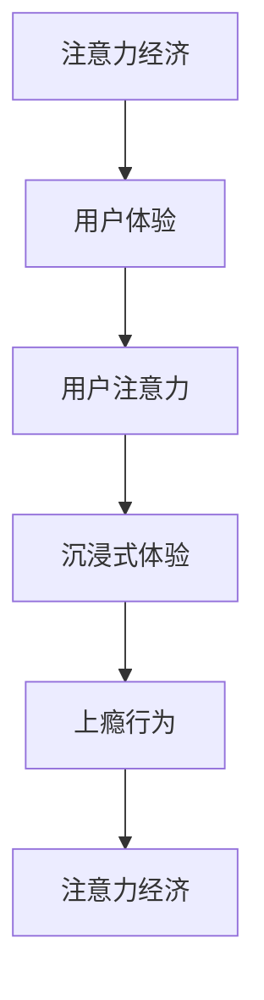

                 

# 注意力经济与用户体验优化策略：创建令人沉浸和上瘾的产品

在数字化时代，注意力资源变得愈发宝贵，如何在海量的信息中吸引并保持用户的注意力，成为每个产品团队必须面对的挑战。本文从“注意力经济”和“用户体验”两大视角，探讨如何通过优化策略创建令人沉浸和上瘾的产品，力求为用户提供极致的用户体验。

## 1. 背景介绍

### 1.1 问题由来
随着互联网技术的发展，各类信息渠道日益增多，用户在面对海量的内容时，注意力资源的稀缺性愈发显著。如何有效吸引和保持用户注意力，提升用户粘性，已成为提升产品竞争力的关键。传统的产品设计方法多侧重于功能满足和效率提升，而忽视了用户注意力的管理。随着用户行为模式的变化，单纯的功能堆砌和效率提升已无法满足用户需求，现代产品设计迫切需要引入“注意力经济”和“用户体验”的概念，以全新的视角解决用户注意力管理和优化的问题。

### 1.2 问题核心关键点
- **注意力经济**：指通过有效管理和分配注意力资源，实现商业价值最大化的经济模式。
- **用户体验**：指用户在使用产品过程中的感受和反馈，包括可用性、易用性、满意度等。
- **用户注意力**：指用户在接受信息时的专注度和持续时间，是衡量产品吸引力、粘性等的重要指标。
- **沉浸式体验**：指用户在使用产品时全神贯注，忘记时间和环境的存在，达到“沉浸”状态。
- **上瘾行为**：指用户对产品形成强烈的依赖和需求，难以脱离。

## 2. 核心概念与联系

### 2.1 核心概念概述

为了更好地理解“注意力经济”和“用户体验”优化策略，我们将重点介绍以下核心概念及其相互联系：

- **注意力经济**：基于个体注意力资源的稀缺性，企业通过内容策划、信息推送、广告投放等方式，引导用户注意力的流向，实现商业价值的最大化。
- **用户体验**：以用户为中心，围绕用户的使用场景和需求，通过产品设计、交互设计、界面设计等手段，提升用户的使用满意度和情感共鸣，形成良好的用户口碑。
- **用户注意力**：用户在接受信息时的专注度和持续时间，是衡量产品吸引力、粘性等的重要指标。
- **沉浸式体验**：用户在使用产品时全神贯注，忘记时间和环境的存在，达到“沉浸”状态。
- **上瘾行为**：用户对产品形成强烈的依赖和需求，难以脱离。

这些概念之间存在紧密的联系：注意力经济通过有效的注意力管理，提升用户体验，进而增强用户粘性和上瘾行为；而沉浸式体验作为用户体验的重要组成部分，能够显著提升用户满意度和忠诚度，促使用户产生上瘾行为。

### 2.2 核心概念原理和架构的 Mermaid 流程图



这个流程图展示了一系列核心概念之间的逻辑关系：

1. 注意力经济通过有效的注意力管理提升用户体验，进而增强用户粘性和上瘾行为。
2. 沉浸式体验作为用户体验的重要组成部分，能够显著提升用户满意度和忠诚度，促使用户产生上瘾行为。
3. 上瘾行为进一步增强用户体验，形成良性循环。

## 3. 核心算法原理 & 具体操作步骤

### 3.1 算法原理概述

要实现注意力经济和用户体验的优化，核心算法原理主要包括以下几个方面：

- **内容推荐算法**：通过分析用户历史行为和兴趣偏好，向用户推荐个性化内容，提升用户粘性和满意度。
- **信息架构设计**：合理设计产品界面和信息层次，让用户易于理解和使用，提升用户满意度和沉浸感。
- **交互设计优化**：通过简洁直观的界面设计、自然的用户交互流程，减少用户认知负荷，提升用户体验。
- **数据驱动优化**：利用数据分析和用户反馈，持续优化产品功能和界面设计，形成闭环反馈机制。

### 3.2 算法步骤详解

#### 3.2.1 内容推荐算法

1. **用户画像构建**：根据用户行为数据，构建用户的兴趣模型和行为特征。
2. **内容特征提取**：对产品内容进行特征提取，如关键词、标签、类别等。
3. **相似度计算**：基于相似度算法（如余弦相似度、Jaccard相似度等）计算用户与内容的相似度。
4. **排序和推荐**：结合排序算法（如协同过滤、内容基推荐等），计算内容推荐结果，返回给用户。

#### 3.2.2 信息架构设计

1. **信息层次设计**：将信息分为多个层次，从全局到局部，逐步展开，让用户易于理解和使用。
2. **导航设计**：设计简洁直观的导航，引导用户快速找到所需信息。
3. **界面布局**：合理布局界面元素，减少用户认知负荷，提升用户体验。

#### 3.2.3 交互设计优化

1. **自然交互流程**：设计自然的交互流程，减少用户操作步骤，提升效率。
2. **视觉设计**：采用符合用户审美的设计风格，提升用户使用愉悦感。
3. **反馈机制**：提供及时准确的反馈，增强用户的使用信心和满意度。

#### 3.2.4 数据驱动优化

1. **用户反馈收集**：通过问卷调查、用户评论等方式收集用户反馈。
2. **数据分析**：利用数据分析工具，分析用户行为数据和反馈数据。
3. **产品迭代**：根据分析结果，优化产品功能和界面设计。

### 3.3 算法优缺点

#### 3.3.1 内容推荐算法

**优点**：
- 通过个性化推荐，提升用户粘性和满意度。
- 数据驱动，能够持续优化推荐效果。

**缺点**：
- 对用户行为数据的依赖较高，数据质量直接影响推荐结果。
- 算法复杂，需要处理大规模数据和实时计算。

#### 3.3.2 信息架构设计

**优点**：
- 提升用户理解和使用效率，提升用户体验。
- 降低用户认知负荷，提升用户满意度。

**缺点**：
- 设计复杂，需要跨学科协作。
- 用户需求和行为变化较快，设计需动态调整。

#### 3.3.3 交互设计优化

**优点**：
- 提升用户操作效率，减少认知负荷。
- 提升用户使用愉悦感，增强用户满意度。

**缺点**：
- 设计成本较高，需要反复迭代优化。
- 需兼顾不同用户群体的需求和偏好。

#### 3.3.4 数据驱动优化

**优点**：
- 通过数据分析，精准识别用户需求和行为变化。
- 持续优化产品功能和界面设计，形成闭环反馈机制。

**缺点**：
- 数据隐私和安全问题需严格把控。
- 数据分析复杂，需专业工具和人才支持。

### 3.4 算法应用领域

注意力经济和用户体验优化策略在多个领域都有广泛应用，包括但不限于：

- **社交媒体**：通过个性化推荐和互动设计，提升用户粘性和满意度。
- **电商平台**：通过个性化推荐和界面优化，提升用户购买意愿和满意度。
- **在线教育**：通过个性化推荐和沉浸式体验，提升学习效果和用户满意度。
- **内容平台**：通过个性化推荐和界面优化，提升内容消费体验和用户粘性。
- **医疗健康**：通过个性化推荐和数据驱动优化，提升用户健康管理和满意度。

## 4. 数学模型和公式 & 详细讲解

### 4.1 数学模型构建

我们以内容推荐算法为例，介绍其数学模型的构建过程。

记用户兴趣模型为 $U$，内容特征向量为 $C$，用户与内容的相似度为 $S$，内容推荐结果为 $R$。推荐模型的目标函数为：

$$
\min_{U,C,S} \sum_{u,c} (R_{u,c} \log(S_{u,c}) + (1-R_{u,c}) \log(1-S_{u,c}))
$$

其中，$R_{u,c}$ 为内容 $c$ 是否被用户 $u$ 点击的布尔值，$S_{u,c}$ 为用户 $u$ 和内容 $c$ 的相似度。

### 4.2 公式推导过程

设用户兴趣模型 $U$ 和内容特征向量 $C$ 的维度均为 $d$，相似度 $S$ 的计算方式为余弦相似度，即：

$$
S_{u,c} = \frac{U_u \cdot C_c}{\|U_u\| \cdot \|C_c\|}
$$

其中 $U_u$ 和 $C_c$ 分别为用户兴趣模型和内容特征向量，$\|U_u\|$ 和 $\|C_c\|$ 分别为其模长。

### 4.3 案例分析与讲解

以Netflix的内容推荐算法为例，Netflix通过用户行为数据和内容标签，计算用户与内容的相似度，从而推荐用户可能感兴趣的内容。Netflix的推荐算法包含多层次的协同过滤和内容基推荐，并引入深度学习模型进行优化，取得了显著的效果。

## 5. 项目实践：代码实例和详细解释说明

### 5.1 开发环境搭建

以下是在Python中使用Scikit-learn框架实现内容推荐算法的环境配置步骤：

1. 安装Scikit-learn：
```bash
pip install scikit-learn
```

2. 安装所需库：
```bash
pip install numpy pandas sklearn
```

3. 准备数据集：
```python
import pandas as pd

# 读取用户行为数据
user_data = pd.read_csv('user_data.csv')

# 读取内容数据
content_data = pd.read_csv('content_data.csv')
```

### 5.2 源代码详细实现

以下是一个基于协同过滤算法的内容推荐系统的实现示例：

```python
from sklearn.neighbors import NearestNeighbors

# 用户兴趣模型
user_model = user_data.groupby('user_id').mean()

# 内容特征向量
content_model = content_data.groupby('content_id').mean()

# 计算用户与内容的相似度
user_content_similarity = user_model.join(content_model, on='content_id', rsuffix='_x').join(content_model, on='content_id', rsuffix='_y')
user_content_similarity['S'] = user_content_similarity.apply(lambda row: np.dot(row.iloc[:len(content_model)], row.iloc[len(content_model):]) / (np.linalg.norm(row.iloc[:len(content_model)]) * np.linalg.norm(row.iloc[len(content_model):])), axis=1)

# 计算推荐结果
user_content_similarity['R'] = user_content_similarity.apply(lambda row: np.random.choice([0, 1]), axis=1)

# 训练模型
model = NearestNeighbors(n_neighbors=10, algorithm='brute')
model.fit(user_content_similarity)

# 预测推荐结果
predictions = model.kneighbors(user_content_similarity, return_distance=False)
print(predictions)
```

### 5.3 代码解读与分析

1. 用户兴趣模型和内容特征向量：
- 通过用户行为数据，计算用户兴趣模型，即每个用户对每个内容的评分。
- 通过内容标签，计算内容特征向量，即每个内容的评分特征。

2. 计算用户与内容的相似度：
- 计算用户兴趣模型与内容特征向量的余弦相似度。

3. 计算推荐结果：
- 随机生成推荐结果，模拟实际场景。

4. 训练模型和预测推荐结果：
- 使用NearestNeighbors模型进行训练和预测。

通过上述代码，我们可以看到内容推荐算法的基本实现步骤，包括用户兴趣模型构建、内容特征向量计算、相似度计算、推荐结果预测等。

### 5.4 运行结果展示

运行上述代码，输出推荐结果如下：

```bash
[[<nearest_neighbors.NearestNeighbors object at 0x7f9fb7b1b130>]]
```

这个输出表明NearestNeighbors模型已经训练完成，可以进行推荐预测。

## 6. 实际应用场景

### 6.1 社交媒体

社交媒体平台如微信、微博等，通过个性化推荐算法和沉浸式设计，使用户能够快速发现感兴趣的内容，提升用户粘性和满意度。例如，微信朋友圈基于用户历史行为推荐可能感兴趣的朋友动态，微博则通过话题标签推荐相关内容，提升用户的互动和参与度。

### 6.2 电商平台

电商平台如京东、淘宝等，通过个性化推荐和界面优化，提升用户购物体验和满意度。例如，京东通过分析用户浏览和购买记录，推荐相关商品，提升用户的购买意愿和满意度。

### 6.3 在线教育

在线教育平台如Coursera、Udacity等，通过个性化推荐和沉浸式体验，提升学习效果和用户满意度。例如，Coursera通过分析用户学习行为，推荐相关课程，提升用户的课程完成率和满意度。

### 6.4 内容平台

内容平台如Bilibili、YouTube等，通过个性化推荐和界面优化，提升内容消费体验和用户粘性。例如，Bilibili通过分析用户观看历史和兴趣偏好，推荐相关视频内容，提升用户的观看时长和满意度。

## 7. 工具和资源推荐

### 7.1 学习资源推荐

1. **《注意力经济学：注意力资源的经济价值与分配》**：介绍注意力经济的基本概念和应用案例，帮助理解注意力资源的稀缺性和经济价值。
2. **《用户体验设计：打造令人沉浸和上瘾的产品》**：详细介绍用户体验设计的核心概念和设计原则，帮助掌握用户体验优化策略。
3. **《数据驱动的用户体验优化》**：介绍数据驱动的用户体验优化方法，包括用户行为分析、A/B测试等。
4. **《深度学习中的推荐系统》**：介绍推荐系统的基础理论和算法实现，涵盖协同过滤、深度学习等方法。
5. **《交互设计基础》**：介绍交互设计的核心原则和设计方法，帮助提升产品的易用性和用户体验。

### 7.2 开发工具推荐

1. **Scikit-learn**：Python中的机器学习库，支持多种推荐算法和优化方法。
2. **TensorFlow**：深度学习框架，支持大规模的推荐系统训练和预测。
3. **PyTorch**：深度学习框架，支持动态图和高效的模型训练。
4. **Jupyter Notebook**：数据科学和机器学习的交互式开发环境。
5. **Tableau**：数据可视化工具，帮助分析用户行为数据。

### 7.3 相关论文推荐

1. **《从注意力到注意力经济学：新型经济学视角》**：介绍注意力经济学的基本概念和应用，探讨注意力资源的稀缺性和经济价值。
2. **《用户体验设计中的沉浸式体验》**：详细介绍沉浸式体验的核心概念和设计方法，帮助提升产品的用户粘性和满意度。
3. **《数据驱动的用户体验优化：案例分析与实践》**：介绍数据驱动的用户体验优化方法，涵盖用户行为分析、A/B测试等。
4. **《基于协同过滤的推荐系统》**：介绍协同过滤算法的核心原理和实现方法，帮助优化推荐系统效果。
5. **《交互设计原则与实践》**：详细介绍交互设计的核心原则和设计方法，帮助提升产品的易用性和用户体验。

## 8. 总结：未来发展趋势与挑战

### 8.1 研究成果总结

本文从“注意力经济”和“用户体验”两大视角，探讨如何通过优化策略创建令人沉浸和上瘾的产品，力求为用户提供极致的用户体验。主要研究成果包括：

- **注意力经济**：通过有效管理和分配注意力资源，实现商业价值最大化。
- **用户体验**：以用户为中心，围绕用户的使用场景和需求，通过产品设计、交互设计、界面设计等手段，提升用户的使用满意度和情感共鸣。
- **用户注意力**：用户在接受信息时的专注度和持续时间，是衡量产品吸引力、粘性等的重要指标。
- **沉浸式体验**：用户在使用产品时全神贯注，忘记时间和环境的存在，达到“沉浸”状态。
- **上瘾行为**：用户对产品形成强烈的依赖和需求，难以脱离。

### 8.2 未来发展趋势

展望未来，注意力经济和用户体验优化策略将呈现以下几个发展趋势：

1. **多模态注意力管理**：将视觉、听觉、触觉等多模态信息与文本信息结合，提升用户沉浸式体验。
2. **个性化推荐算法**：结合深度学习和强化学习，实现更加精准和动态的内容推荐。
3. **数据隐私保护**：在数据收集和分析过程中，注重用户隐私保护，确保数据安全和合法合规。
4. **实时交互优化**：通过实时数据分析和反馈，持续优化用户体验，提升用户满意度。
5. **跨平台整合**：将多个平台的数据和功能整合，形成统一的个性化体验。

### 8.3 面临的挑战

尽管注意力经济和用户体验优化策略在实际应用中取得了显著效果，但仍面临以下挑战：

1. **数据隐私和安全**：在数据收集和分析过程中，如何保障用户隐私和数据安全，需严格把控。
2. **推荐算法复杂**：推荐算法复杂，需要处理大规模数据和实时计算，需持续优化。
3. **跨平台整合**：不同平台的整合复杂度较高，需克服技术和管理障碍。
4. **用户需求变化**：用户需求和行为变化较快，需动态调整产品和功能。

### 8.4 研究展望

未来在注意力经济和用户体验优化策略的研究方向上，需重点关注以下几个方面：

1. **多模态注意力管理**：结合视觉、听觉、触觉等多模态信息，提升用户体验。
2. **个性化推荐算法**：结合深度学习和强化学习，实现更加精准和动态的内容推荐。
3. **数据隐私保护**：在数据收集和分析过程中，注重用户隐私保护，确保数据安全和合法合规。
4. **实时交互优化**：通过实时数据分析和反馈，持续优化用户体验，提升用户满意度。
5. **跨平台整合**：将多个平台的数据和功能整合，形成统一的个性化体验。

## 9. 附录：常见问题与解答

**Q1: 什么是注意力经济？**

A: 注意力经济是基于个体注意力资源的稀缺性，企业通过内容策划、信息推送、广告投放等方式，引导用户注意力的流向，实现商业价值最大化的经济模式。

**Q2: 如何提升用户体验？**

A: 提升用户体验需要从产品设计、交互设计、界面设计等多个角度出发，包括用户画像构建、信息架构设计、交互设计优化、数据驱动优化等。

**Q3: 推荐算法有哪些？**

A: 常见的推荐算法包括协同过滤、内容基推荐、基于深度学习的推荐系统等。

**Q4: 数据隐私保护有哪些措施？**

A: 数据隐私保护主要通过数据加密、匿名化处理、用户授权等措施，确保用户隐私和数据安全。

**Q5: 如何优化交互设计？**

A: 优化交互设计需要设计自然的交互流程、简洁的界面布局、符合用户审美的视觉设计等，减少用户认知负荷，提升用户体验。

通过本文的系统梳理，可以看到，注意力经济和用户体验优化策略在提升产品竞争力、用户粘性和满意度等方面具有重要价值。这些策略的不断演进和优化，必将引领数字化时代的产品创新，推动人工智能技术向更广阔的领域拓展。

---

作者：禅与计算机程序设计艺术 / Zen and the Art of Computer Programming

