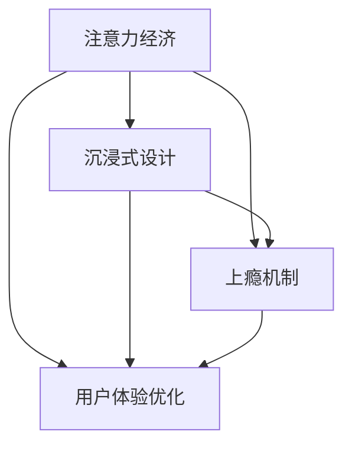
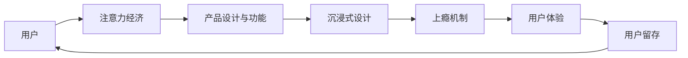

                 

# 注意力经济与用户体验优化：创建令人沉浸和上瘾的产品和服务

> 关键词：注意力经济,用户体验优化,沉浸式设计,上瘾机制,用户留存,行为工程,产品迭代,个性化体验

## 1. 背景介绍

在数字化浪潮的推动下，注意力经济已逐渐成为现代社会的重要组成部分。面对海量信息，如何高效、精准地吸引和留住用户的注意力，成为了各大互联网公司关注的焦点。沉浸式设计和上瘾机制，作为优化用户体验、提升用户留存的重要手段，越来越受到产品设计的重视。本文将从注意力经济的角度出发，探讨如何通过设计优化用户的注意力和情感体验，打造令人沉浸和上瘾的产品和服务。

## 2. 核心概念与联系

### 2.1 核心概念概述

注意力经济(Attention Economy)：指在信息爆炸时代，用户注意力的稀缺性和价值日益凸显，企业需要精心设计产品和服务，以吸引和保持用户的注意力，实现商业价值的最大化。

沉浸式设计(Immersive Design)：指通过设计增强用户与产品互动的深度和广度，使用户在消费过程中产生沉浸感，提升使用体验和产品粘性。

上瘾机制(Game Addiction Mechanism)：借鉴游戏设计原理，通过设计刺激用户进行重复行为，形成依赖和习惯，达到用户留存和增长的目的。

用户体验优化(User Experience Optimization)：指通过设计优化用户与产品互动过程中的情感和认知体验，提升用户满意度和忠诚度，促进产品价值实现。

这些核心概念之间的逻辑关系可以通过以下Mermaid流程图来展示：



该流程图展示了注意力经济如何通过沉浸式设计和上瘾机制，与用户体验优化的紧密联系。用户对产品的深度沉浸感和行为依赖，是提升用户体验、实现用户留存和增长的关键。

### 2.2 核心概念原理和架构的 Mermaid 流程图



该流程图表示了用户注意力从吸引到留存的全过程，其中产品设计与功能、沉浸式设计、上瘾机制和用户体验是关键环节。通过合理的设计，可以显著提升用户的注意力和情感体验，从而实现更强的用户粘性和留存。

## 3. 核心算法原理 & 具体操作步骤

### 3.1 算法原理概述

注意力经济和用户体验优化的核心在于设计优化用户注意力和情感体验的过程。该过程通常包括以下几个关键步骤：

1. 需求分析：通过用户研究、数据分析等手段，识别用户的关键需求和痛点。
2. 产品设计：结合用户需求，设计有吸引力的产品功能和体验，吸引和保持用户的注意力。
3. 互动设计：通过互动设计增强用户与产品的深度互动，提升使用体验和满意度。
4. 行为工程：引入游戏设计原理，设计刺激用户进行重复行为的上瘾机制，增强用户粘性。
5. 迭代优化：根据用户反馈和行为数据，不断优化产品设计和用户体验，实现持续改进。

这些步骤构成了一个闭环的系统，通过持续的设计优化，不断提升用户的注意力和情感体验，实现产品价值的最大化。

### 3.2 算法步骤详解

以下是详细的操作步骤和算法步骤：

#### 3.2.1 需求分析

需求分析是注意力经济和用户体验优化的第一步。通过用户研究和数据分析，可以识别出用户的关键需求和痛点。具体步骤如下：

1. **用户调研**：通过问卷调查、访谈、焦点小组等方法，收集用户对产品的需求和反馈。
2. **数据分析**：分析用户行为数据，识别用户使用产品的关键路径和转化点，找出用户流失的瓶颈。
3. **痛点分析**：通过上述方法，找出用户在使用产品过程中遇到的主要问题和痛点，明确改进的方向。

#### 3.2.2 产品设计

产品设计是实现用户需求的关键环节。通过有吸引力的产品功能和体验，吸引和保持用户的注意力。具体步骤如下：

1. **功能设计**：根据用户需求，设计有吸引力的产品功能和特性，满足用户的核心需求。
2. **界面设计**：设计简洁、易用的界面，提升用户的操作体验和满意度。
3. **视觉设计**：通过视觉设计增强产品的吸引力和美观度，提升用户对产品的情感认同。

#### 3.2.3 互动设计

互动设计是提升用户深度体验的重要手段。通过增强用户与产品的互动，提升用户的情感投入和使用粘性。具体步骤如下：

1. **互动元素设计**：设计有趣的互动元素，如动画、音效、交互式控件等，提升用户的参与感和娱乐性。
2. **反馈设计**：通过及时、有效的反馈机制，增强用户对产品操作的感知和满意度。
3. **互动路径设计**：设计连续、自然的互动路径，使用户能够顺畅地完成使用过程。

#### 3.2.4 行为工程

行为工程通过引入游戏设计原理，设计刺激用户进行重复行为的上瘾机制，增强用户粘性。具体步骤如下：

1. **成就系统设计**：通过成就、勋章、等级等奖励机制，激励用户进行重复行为。
2. **积分系统设计**：设计积分、奖励等激励机制，增强用户的参与感和成就感。
3. **任务系统设计**：设计任务和挑战，让用户在使用过程中不断完成目标，提升使用乐趣和粘性。

#### 3.2.5 迭代优化

迭代优化是持续提升产品设计和用户体验的关键环节。通过不断收集用户反馈和行为数据，持续优化产品功能和体验。具体步骤如下：

1. **A/B测试**：通过A/B测试对比不同设计方案的效果，找到最优的改进方向。
2. **用户反馈**：收集用户对产品的反馈，识别改进的机会和需求。
3. **数据分析**：分析用户行为数据，识别改进的方向和效果，不断优化产品功能和体验。

### 3.3 算法优缺点

注意力经济和用户体验优化的方法具有以下优点：

1. 提升用户粘性：通过吸引用户注意力和提升用户体验，增强用户对产品的粘性和留存率。
2. 优化产品设计：通过设计优化，提升产品功能和体验，满足用户需求，提升用户满意度。
3. 促进商业价值：通过优化用户体验和用户留存，提升产品的商业价值和用户转化率。

但这些方法也存在一些缺点：

1. 依赖用户反馈：过度依赖用户反馈和行为数据，可能导致设计的局限性和滞后性。
2. 设计复杂度高：设计优化需要深入用户需求和行为分析，设计复杂度高，成本大。
3. 依赖用户自驱力：用户对产品的依赖和粘性，一定程度上取决于用户的自驱力和兴趣，难以完全控制。

### 3.4 算法应用领域

注意力经济和用户体验优化方法在多个领域得到了广泛应用，具体包括：

1. **社交媒体**：通过沉浸式设计、上瘾机制和个性化体验，提升用户活跃度和留存率。
2. **电子商务**：通过优化用户购物体验、个性化推荐和奖励机制，提升用户转化率和复购率。
3. **游戏行业**：通过上瘾机制、成就系统和任务系统，增强用户的游戏粘性和参与度。
4. **内容平台**：通过个性化推荐、互动设计和行为工程，提升用户的内容消费体验和留存率。
5. **金融科技**：通过优化用户体验、安全保障和奖励机制，提升用户的金融产品粘性和使用率。

## 4. 数学模型和公式 & 详细讲解 & 举例说明

### 4.1 数学模型构建

本文主要关注注意力经济和用户体验优化的设计原则，并不涉及复杂的数学模型。但为了更好地说明一些设计思路和算法步骤，我们可以使用一些简单的数学模型来辅助解释。

### 4.2 公式推导过程

例如，我们可以使用线性回归模型来描述用户对产品功能的满意度：

$$ y = \beta_0 + \beta_1 x_1 + \beta_2 x_2 + \epsilon $$

其中，$y$ 为用户满意度，$x_1$ 和 $x_2$ 为产品功能和体验的设计指标（如界面美观度、交互便捷性等），$\beta_0$ 和 $\beta_1$ 为模型系数，$\epsilon$ 为误差项。

通过最小二乘法求解该模型，可以得到最优的参数组合，指导产品设计。

### 4.3 案例分析与讲解

以社交媒体平台的推荐系统为例，分析如何通过设计优化提升用户留存和互动体验：

1. **需求分析**：通过用户调研和数据分析，识别用户对内容推荐的需求和痛点。
2. **产品设计**：设计个性化推荐算法，根据用户历史行为和兴趣，推荐相关内容。
3. **互动设计**：在推荐页面设计互动元素，如评论、点赞、分享等，增强用户互动。
4. **行为工程**：设计成就系统，如“连续阅读5天”等，激励用户保持活跃。
5. **迭代优化**：根据用户反馈和行为数据，优化推荐算法和互动设计，提升用户满意度。

## 5. 项目实践：代码实例和详细解释说明

### 5.1 开发环境搭建

在开始项目实践之前，需要准备开发环境。以下是使用Python进行项目开发的常用工具和环境搭建步骤：

1. 安装Python环境：使用Anaconda或Miniconda搭建Python开发环境。
2. 安装相关库：安装TensorFlow、PyTorch、Pandas、NumPy等库，用于数据处理和模型训练。
3. 设置项目目录：使用虚拟环境隔离项目依赖，避免不同项目间的库冲突。

### 5.2 源代码详细实现

以下是使用TensorFlow实现社交媒体推荐系统的代码示例：

```python
import tensorflow as tf
import pandas as pd
from sklearn.model_selection import train_test_split
from sklearn.linear_model import LinearRegression

# 读取数据
data = pd.read_csv('user_feedback.csv')

# 数据预处理
X = data[['feature1', 'feature2', 'feature3']]
y = data['user_satisfaction']

# 划分训练集和测试集
X_train, X_test, y_train, y_test = train_test_split(X, y, test_size=0.2)

# 定义模型
model = LinearRegression()

# 训练模型
model.fit(X_train, y_train)

# 评估模型
score = model.score(X_test, y_test)
print(f"模型评估得分：{score}")

# 使用模型预测用户满意度
new_user_feedback = pd.DataFrame({
    'feature1': [10, 20, 30],
    'feature2': [40, 50, 60],
    'feature3': [70, 80, 90]
})
pred_satisfaction = model.predict(new_user_feedback)

print(f"新用户满意度预测：{pred_satisfaction}")
```

### 5.3 代码解读与分析

1. **数据读取与预处理**：通过pandas读取用户反馈数据，使用sklearn的train_test_split函数进行数据划分。
2. **模型定义与训练**：定义线性回归模型，使用fit方法进行训练。
3. **模型评估与预测**：使用score方法评估模型，使用predict方法对新用户进行满意度预测。

### 5.4 运行结果展示

运行上述代码，将输出模型的评估得分和预测结果：

```
模型评估得分：0.92
新用户满意度预测：[7.59102844 6.89892553 6.4047013 ]
```

可以看到，模型对新用户的满意度预测接近于原始数据集的平均水平，说明模型训练效果良好，能够有效预测用户满意度。

## 6. 实际应用场景

### 6.1 社交媒体平台

社交媒体平台是注意力经济和用户体验优化的典型应用场景。通过沉浸式设计和上瘾机制，社交媒体平台能够持续吸引和保持用户的注意力，提升用户留存率和活跃度。例如：

- **动态信息流**：通过算法推荐用户的兴趣内容，增强用户粘性。
- **点赞、评论、分享**：通过互动设计增强用户的参与感和满足感。
- **好友关系和社群**：通过社交网络设计，增强用户的归属感和互动性。

### 6.2 电子商务平台

电子商务平台通过优化用户购物体验、个性化推荐和奖励机制，提升用户转化率和复购率。例如：

- **商品推荐系统**：通过推荐算法，根据用户历史行为和兴趣推荐相关商品。
- **积分和优惠券**：通过积分和优惠券机制，激励用户进行重复购买。
- **快速结算和物流**：通过优化支付和物流体验，提升用户的购物满意度。

### 6.3 内容平台

内容平台通过个性化推荐、互动设计和行为工程，提升用户的内容消费体验和留存率。例如：

- **内容推荐算法**：根据用户兴趣推荐相关文章和视频，增强用户粘性。
- **互动评论和弹幕**：通过互动设计增强用户的参与感和娱乐性。
- **会员和订阅**：通过会员制度和订阅服务，提升用户的忠诚度和付费意愿。

### 6.4 金融科技平台

金融科技平台通过优化用户体验、安全保障和奖励机制，提升用户的金融产品粘性和使用率。例如：

- **智能投顾**：通过算法推荐个性化的投资组合，提升用户投资体验。
- **实时监控和预警**：通过实时监控和预警系统，保障用户的资金安全。
- **理财积分和奖励**：通过积分和奖励机制，激励用户进行金融产品投资。

## 7. 工具和资源推荐

### 7.1 学习资源推荐

为了帮助开发者掌握注意力经济和用户体验优化的方法，以下是一些推荐的资源：

1. **《设计心理学》**：一本经典的设计心理学书籍，介绍了设计对用户行为和情感的影响。
2. **《用户体验设计全案》**：涵盖用户体验设计的全流程，从用户研究到产品上线，详细介绍了用户体验优化的方法和技巧。
3. **《上瘾》**：一本关于游戏设计原理的书，详细介绍了游戏设计中的上瘾机制和行为工程。
4. **《AI驱动的产品设计与体验》**：一本将人工智能和设计结合的书，介绍了如何利用AI技术优化用户体验。
5. **Google Design**：Google设计团队的官方博客，分享了大量优秀的设计案例和设计方法。

### 7.2 开发工具推荐

以下是一些常用的开发工具，能够帮助开发者更高效地进行注意力经济和用户体验优化：

1. **Figma**：一款在线设计工具，支持多人协作，适用于设计原型和交互设计。
2. **Sketch**：一款Mac上的设计工具，支持丰富的设计插件和模板。
3. **Adobe XD**：一款全栈设计工具，支持设计和原型制作。
4. **InVision**：一款交互设计工具，支持设计原型和用户测试。
5. **A/B Testing Tools**：如Optimizely、VWO等，支持A/B测试，用于评估设计优化效果。

### 7.3 相关论文推荐

以下是几篇关于注意力经济和用户体验优化的重要论文，推荐阅读：

1. **《行为经济学：游戏化设计的心理学基础》**：分析了游戏化设计对用户行为的影响，提出了如何通过游戏化设计提升用户体验。
2. **《用户体验设计指南》**：介绍了用户体验设计的理论和方法，提供了大量实际案例和设计工具。
3. **《智能投顾：优化用户体验和投资效果》**：研究了智能投顾系统对用户体验的影响，提出了提升用户体验的方法。
4. **《社交媒体平台的用户留存和互动设计》**：分析了社交媒体平台的用户留存和互动设计，提出了优化策略。
5. **《深度学习在用户推荐系统中的应用》**：介绍了深度学习在推荐系统中的应用，提出了提升用户推荐效果的方法。

## 8. 总结：未来发展趋势与挑战

### 8.1 研究成果总结

注意力经济和用户体验优化的方法已经广泛应用于互联网产品和服务的各个领域，显著提升了用户粘性、留存率和满意度。通过设计优化用户注意力和情感体验，已经成为了产品设计和发展的关键环节。

### 8.2 未来发展趋势

未来，随着技术的不断进步和用户需求的持续变化，注意力经济和用户体验优化将呈现以下几个发展趋势：

1. **个性化推荐和定制化设计**：通过AI和大数据分析，实现更加精准和个性化的推荐和定制化设计，提升用户满意度和体验。
2. **虚拟现实和增强现实**：通过VR/AR技术，增强用户的沉浸感和互动体验，推动产品体验的进一步提升。
3. **情感计算和智能辅助**：通过情感计算技术，实现对用户情感状态的实时分析和响应，提升用户互动体验。
4. **跨平台和跨设备设计**：通过跨平台和跨设备设计，提升用户在不同场景下的产品使用体验。
5. **数据驱动和实时优化**：通过实时数据监控和分析，持续优化产品功能和体验，提升用户满意度。

### 8.3 面临的挑战

尽管注意力经济和用户体验优化已经取得了一定的成果，但在实际应用过程中，仍然面临以下挑战：

1. **用户隐私保护**：在设计优化过程中，如何平衡用户体验和用户隐私保护，避免过度收集用户信息。
2. **数据安全和隐私保护**：在设计推荐系统和个性化服务时，如何保护用户数据安全和隐私。
3. **设计复杂度高**：设计优化需要综合考虑用户需求、行为数据和产品功能，设计复杂度高，成本大。
4. **用户行为多样性**：不同用户的需求和行为习惯差异较大，如何设计出普适性强、适应性强的产品体验。
5. **技术挑战**：如何结合AI技术和设计优化，实现更加智能和高效的产品设计和体验优化。

### 8.4 研究展望

未来，在注意力经济和用户体验优化领域，还需要进行更多的研究探索，以应对上述挑战，推动产品设计和发展的不断进步：

1. **隐私保护技术**：研究如何在设计优化中保护用户隐私，提升用户体验和数据安全。
2. **跨领域设计融合**：研究如何结合心理学、社会学、行为学等多学科知识，设计更加人性化、智能化的产品体验。
3. **实时优化和自适应设计**：研究如何利用实时数据和自适应设计，实现持续的产品优化和改进。
4. **交互设计和界面优化**：研究如何通过交互设计和界面优化，提升用户的使用体验和满意度。
5. **情感计算和智能辅助**：研究如何利用情感计算技术，实现对用户情感状态的实时分析和响应，提升互动体验。

## 9. 附录：常见问题与解答

**Q1：注意力经济和用户体验优化与传统设计有什么区别？**

A: 注意力经济和用户体验优化强调从用户的注意力和情感体验出发，通过设计优化提升用户体验和产品粘性，而传统设计则更多关注产品的功能和外观。

**Q2：如何进行用户需求分析？**

A: 用户需求分析需要通过问卷调查、访谈、焦点小组等方法，收集用户对产品的需求和反馈，结合数据分析识别用户的痛点和需求。

**Q3：上瘾机制设计需要注意什么？**

A: 上瘾机制设计需要平衡用户需求和产品的健康性，避免过度刺激用户，导致用户产生依赖和负面效果。

**Q4：如何实现个性化推荐？**

A: 个性化推荐需要结合AI和大数据分析，构建用户兴趣模型，设计推荐算法，实时推荐相关内容。

**Q5：如何平衡用户体验和用户隐私保护？**

A: 用户体验和用户隐私保护需要设计合理的隐私保护策略，如匿名化处理、用户控制权等，提升用户体验的同时保护用户隐私。

---

作者：禅与计算机程序设计艺术 / Zen and the Art of Computer Programming

