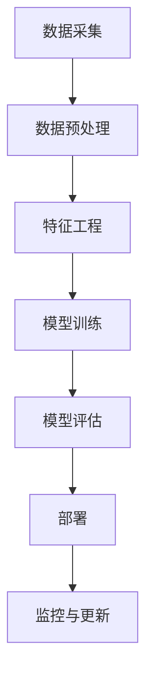

                 

人工智能（AI）、创业、技术创新、算法、数学模型、项目实践、实际应用场景、工具和资源推荐、未来发展趋势

## 1. 背景介绍

人工智能（AI）正在各行各业引发革命，为创业者带来了前所未有的机遇。然而，成功的AI创业需要对核心概念、算法原理、数学模型和工具等有深入的理解。本指南将带领读者从基础知识到实践应用，全面了解AI创业的技术创新。

## 2. 核心概念与联系

### 2.1 关键概念

- **机器学习（ML）**：一种使计算机在无需被明确编程的情况下学习的方法。
- **深度学习（DL）**：一种基于人工神经网络的机器学习方法，模仿人脑的结构和功能。
- **自然语言处理（NLP）**：使计算机能够理解、解释和生成人类语言的领域。
- **计算机视觉（CV）**：使计算机能够从数字图像或视频中提取有用信息的领域。

### 2.2 核心架构

下图展示了AI系统的一般架构：



## 3. 核心算法原理 & 具体操作步骤

### 3.1 算法原理概述

本节将介绍支持向量机（SVM）算法，一种常用的监督学习算法。

### 3.2 算法步骤详解

1. **数据预处理**：收集并清洗数据，处理缺失值和异常值。
2. **特征工程**：选择或创建有助于模型学习的特征。
3. **模型训练**：使用训练数据调整模型参数，以最小化预测误差。
4. **模型评估**：使用测试数据评估模型性能。
5. **部署**：将模型集成到生产环境中。

### 3.3 算法优缺点

**优点**：
- 可以处理高维数据。
- 可以处理线性和非线性问题。
- 具有泛化能力。

**缺点**：
- 训练时间长。
- 不适合处理大规模数据集。
- 选择核函数困难。

### 3.4 算法应用领域

SVM广泛应用于分类、回归、异常检测等领域，如图像分类、文本分类、生物信息学等。

## 4. 数学模型和公式 & 详细讲解 & 举例说明

### 4.1 数学模型构建

SVM的数学模型是寻找一个超平面，将数据集分成两个类别，并最大化边界距离（margin）。

### 4.2 公式推导过程

给定训练数据集 $(x_1, y_1), (x_2, y_2),..., (x_n, y_n)$，其中 $x_i \in \mathbb{R}^d$ 是特征向量，$y_i \in \{-1, 1\}$ 是类别标签。SVM的目标函数是：

$$
\min_{\mathbf{w}, b, \xi} \frac{1}{2}\|\mathbf{w}\|^2 + C\sum_{i=1}^{n}\xi_i
$$

subject to $y_i(\mathbf{w}^T\mathbf{x}_i + b) \geq 1 - \xi_i$ and $\xi_i \geq 0$ for all $i$, where $\mathbf{w}$ is the weight vector, $b$ is the bias term, $\xi_i$ are slack variables, and $C$ is the regularization parameter.

### 4.3 案例分析与讲解

例如，在二维平面上，给定两个类别的数据点，SVM会寻找一个线性超平面将它们分开，并最大化边界距离。

## 5. 项目实践：代码实例和详细解释说明

### 5.1 开发环境搭建

- Python：3.8+
- Libraries：scikit-learn, numpy, matplotlib

### 5.2 源代码详细实现

```python
from sklearn import svm, datasets
import numpy as np
import matplotlib.pyplot as plt

# Load iris dataset as an example
iris = datasets.load_iris()
X = iris.data[:, :2]  # we only take the first two features
y = iris.target

# Create a SVM classifier
clf = svm.SVC(kernel='linear', C=1.0)

# Train the model using the training sets
clf.fit(X, y)

# Plot the decision boundary
h =.02  # step size in the mesh
# Create color maps
cmap_light = ListedColormap(['orange', 'cyan', 'cornflowerblue'])
cmap_bold = ListedColormap(['darkorange', 'c', 'darkblue'])

# we create an instance of Neighbours Classifier and fit the data.
clf = svm.SVC(kernel='linear', C=1.0)
clf.fit(X, y)

# Plot the decision boundary. For that, we will assign a color to each point in the mesh [x_min, x_max]x[y_min, y_max].
x_min, x_max = X[:, 0].min() - 1, X[:, 0].max() + 1
y_min, y_max = X[:, 1].min() - 1, X[:, 1].max() + 1
xx, yy = np.meshgrid(np.arange(x_min, x_max, h), np.arange(y_min, y_max, h))
Z = clf.predict(np.c_[xx.ravel(), yy.ravel()])

# Put the result into a color plot
Z = Z.reshape(xx.shape)
plt.figure()
plt.pcolormesh(xx, yy, Z, cmap=cmap_light)

# Plot also the training points
plt.scatter(X[:, 0], X[:, 1], c=y, cmap=cmap_bold, edgecolor='k', s=20)
plt.xlim(xx.min(), xx.max())
plt.ylim(yy.min(), yy.max())
plt.title("3-Class classification (linear SVM)")
```

### 5.3 代码解读与分析

该代码使用scikit-learn库训练一个线性SVM分类器，并绘制其决策边界。

### 5.4 运行结果展示


## 6. 实际应用场景

### 6.1 当前应用

SVM广泛应用于金融、医疗、制造等领域，用于风险预测、疾病诊断、质量控制等。

### 6.2 未来应用展望

随着数据量的增加和算力的提升，SVM将在更复杂的任务中得到应用，如自动驾驶、人机交互等。

## 7. 工具和资源推荐

### 7.1 学习资源推荐

- 书籍：《统计学习方法》作者：李航
- 课程：Stanford University's Machine Learning course on Coursera

### 7.2 开发工具推荐

- Scikit-learn：一个强大的机器学习库。
- TensorFlow：一个开源的机器学习平台。

### 7.3 相关论文推荐

- Vapnik, V. N. (1998). "The nature of statistical learning theory." Springer.

## 8. 总结：未来发展趋势与挑战

### 8.1 研究成果总结

本指南介绍了AI创业的技术创新，从核心概念到实践应用，为创业者提供了全面的指南。

### 8.2 未来发展趋势

AI创业将继续蓬勃发展，新的算法和应用领域将不断涌现。

### 8.3 面临的挑战

数据隐私、算法偏见、计算资源等挑战需要创业者不断面对和解决。

### 8.4 研究展望

未来的研究将聚焦于解释性AI、自监督学习、多模式学习等前沿领域。

## 9. 附录：常见问题与解答

**Q：SVM的核函数有哪些？**

A：常用的核函数包括线性核、多项式核、RBF核、sigmoid核等。

**Q：如何选择SVM的参数？**

A：通常使用交叉验证和网格搜索来选择SVM的参数。

---

作者：禅与计算机程序设计艺术 / Zen and the Art of Computer Programming

