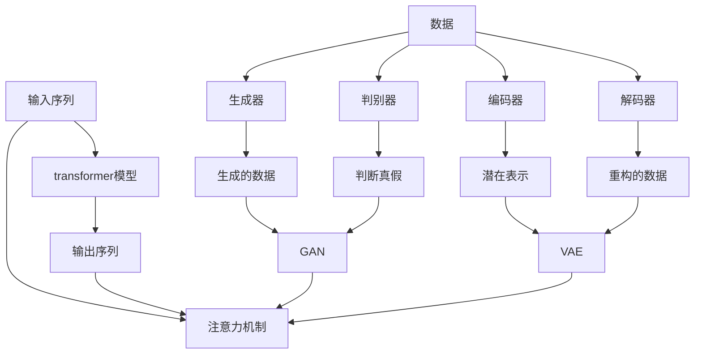

# 人工智能艺术：创造力和表达


## 1. 背景介绍

人工智能（AI）的发展已经从工业自动化和数据分析扩展到创造性领域，包括艺术、设计和音乐等。AI艺术是指使用人工智能技术创作的艺术作品，它正在改变我们理解和体验艺术的方式。本文将探讨AI在艺术创作中的应用，重点关注AI艺术的核心概念、算法原理、数学模型，并提供项目实践和工具推荐。

## 2. 核心概念与联系

AI艺术的核心概念包括生成式对抗网络（GAN）、变分自编码器（VAE）、transformer模型等。这些概念相互关联，共同构成了AI艺术的基础架构。下面是这些概念的简要介绍和它们的关系：

- **生成式对抗网络（GAN）**：GAN由生成器（Generator）和判别器（Discriminator）组成，生成器学习数据分布，判别器学习判断真假的能力。它们相互对抗，共同提高生成的质量。
- **变分自编码器（VAE）**：VAE是一种自动编码器，它学习数据的潜在表示，并能够生成新的数据样本。VAE的编码器和解码器通过重构损失和KL-散度进行训练。
- **transformer模型**：transformer是一种注意力机制，它允许模型关注输入序列的不同部分。transformer模型在自然语言处理（NLP）领域取得了突出成就，并被用于生成音乐和艺术作品。

下面是这些概念的关系图：



## 3. 核心算法原理 & 具体操作步骤

### 3.1 算法原理概述

AI艺术的核心算法包括GAN、VAE和transformer模型。这些算法的原理基于深度学习和统计建模。

- **GAN**：GAN的原理基于对抗训练，生成器和判别器相互竞争，共同提高生成质量。判别器试图区分真实数据和生成的数据，而生成器则试图欺骗判别器，使其无法区分。
- **VAE**：VAE的原理基于变分推断，它学习数据的潜在表示，并能够生成新的数据样本。VAE的编码器和解码器通过重构损失和KL-散度进行训练。
- **transformer模型**：transformer模型的原理基于注意力机制，它允许模型关注输入序列的不同部分。transformer模型使用自注意力机制和多头注意力机制来处理序列数据。

### 3.2 算法步骤详解

下面是这些算法的具体操作步骤：

- **GAN**：
  1. 初始化生成器和判别器的权重。
  2. 使用真实数据训练判别器，使其能够区分真实数据和生成的数据。
  3. 使用判别器的输出训练生成器，使其能够欺骗判别器。
  4. 重复步骤2和3，直到生成器和判别器收敛。
- **VAE**：
  1. 初始化编码器和解码器的权重。
  2. 使用真实数据训练编码器，使其能够学习数据的潜在表示。
  3. 使用编码器的输出训练解码器，使其能够重构原始数据。
  4. 使用重构损失和KL-散度训练编码器和解码器。
  5. 重复步骤2-4，直到编码器和解码器收敛。
- **transformer模型**：
  1. 初始化模型的权重。
  2. 使用输入序列训练模型，使其能够生成输出序列。
  3. 使用自注意力机制和多头注意力机制处理序列数据。
  4. 重复步骤2和3，直到模型收敛。

### 3.3 算法优缺点

- **GAN**：
  - 优点：能够生成高质量的数据，如图像和音乐。
  - 缺点：训练不稳定，可能导致模式崩溃和模式消失。
- **VAE**：
  - 优点：能够学习数据的潜在表示，并生成新的数据样本。
  - 缺点：生成的数据可能缺乏多样性。
- **transformer模型**：
  - 优点：能够处理长序列数据，并具有强大的注意力机制。
  - 缺点：计算开销高，难以训练大规模模型。

### 3.4 算法应用领域

AI艺术的应用领域包括图像、音乐、文学等。下面是这些算法在AI艺术中的应用：

- **GAN**：GAN用于生成艺术图像、人像、风景等。例如，DeepArt是一个基于GAN的应用，它可以将照片转换为艺术风格。
- **VAE**：VAE用于生成新的音乐片段、诗歌等。例如，DeepJazz是一个基于VAE的应用，它可以生成新的爵士乐片段。
- **transformer模型**：transformer模型用于生成音乐、文学等。例如，transformer模型可以生成新的音乐片段或小说章节。

## 4. 数学模型和公式 & 详细讲解 & 举例说明

### 4.1 数学模型构建

下面是AI艺术中常用的数学模型：

- **GAN**：GAN的数学模型基于对抗训练，生成器和判别器相互竞争，共同提高生成质量。判别器试图区分真实数据和生成的数据，而生成器则试图欺骗判别器，使其无法区分。GAN的数学模型可以表示为：

$$ \min_G \max_D V(D,G) = \mathbb{E}_{x \sim p_{data}(x)}[\log D(x)] + \mathbb{E}_{z \sim p_z(z)}[\log(1 - D(G(z)))] $$

- **VAE**：VAE的数学模型基于变分推断，它学习数据的潜在表示，并能够生成新的数据样本。VAE的数学模型可以表示为：

$$ \max_\phi \max_\theta \mathbb{E}_{x \sim p_{data}(x)}[\log p_\theta(x|z)] - \beta D_{KL}(q_\phi(z|x) || p(z)) $$

- **transformer模型**：transformer模型的数学模型基于注意力机制，它允许模型关注输入序列的不同部分。transformer模型的数学模型可以表示为：

$$ \text{Attention}(Q,K,V) = \text{softmax}\left(\frac{QK^T}{\sqrt{d_k}}\right)V $$

其中，$Q$, $K$, $V$分别是查询、键和值，$\sqrt{d_k}$是缩放因子，用于稳定softmax函数的输出。

### 4.2 公式推导过程

下面是这些数学模型的推导过程：

- **GAN**：GAN的数学模型基于对抗训练，生成器和判别器相互竞争，共同提高生成质量。判别器试图区分真实数据和生成的数据，而生成器则试图欺骗判别器，使其无法区分。GAN的数学模型可以表示为：

$$ \min_G \max_D V(D,G) = \mathbb{E}_{x \sim p_{data}(x)}[\log D(x)] + \mathbb{E}_{z \sim p_z(z)}[\log(1 - D(G(z)))] $$

其中，$p_{data}(x)$是真实数据分布，$p_z(z)$是输入噪声分布，$D(x)$是判别器的输出，$G(z)$是生成器的输出。生成器和判别器的目标函数分别为：

$$ \min_G \mathbb{E}_{z \sim p_z(z)}[\log(1 - D(G(z)))] $$

$$ \max_D \mathbb{E}_{x \sim p_{data}(x)}[\log D(x)] + \mathbb{E}_{z \sim p_z(z)}[\log(1 - D(G(z)))] $$

- **VAE**：VAE的数学模型基于变分推断，它学习数据的潜在表示，并能够生成新的数据样本。VAE的数学模型可以表示为：

$$ \max_\phi \max_\theta \mathbb{E}_{x \sim p_{data}(x)}[\log p_\theta(x|z)] - \beta D_{KL}(q_\phi(z|x) || p(z)) $$

其中，$p_{data}(x)$是真实数据分布，$p(z)$是先验分布，$q_\phi(z|x)$是后验分布，$p_\theta(x|z)$是条件分布。编码器和解码器的目标函数分别为：

$$ \max_\phi \mathbb{E}_{x \sim p_{data}(x)}[\log q_\phi(z|x)] - \beta D_{KL}(q_\phi(z|x) || p(z)) $$

$$ \max_\theta \mathbb{E}_{x \sim p_{data}(x)}[\log p_\theta(x|z)] $$

- **transformer模型**：transformer模型的数学模型基于注意力机制，它允许模型关注输入序列的不同部分。transformer模型的数学模型可以表示为：

$$ \text{Attention}(Q,K,V) = \text{softmax}\left(\frac{QK^T}{\sqrt{d_k}}\right)V $$

其中，$Q$, $K$, $V$分别是查询、键和值，$\sqrt{d_k}$是缩放因子，用于稳定softmax函数的输出。transformer模型的自注意力机制可以表示为：

$$ \text{MultiHead}(Q,K,V) = \text{Concat}(\text{head}_1, \dots, \text{head}_h)W^O $$

其中，$h$是注意力头的数量，$W^O$是输出权重矩阵，每个注意力头可以表示为：

$$ \text{head}_i = \text{Attention}(QW^Q_i, KW^K_i, VW^V_i) $$

其中，$W^Q_i$, $W^K_i$, $W^V_i$是查询、键和值的权重矩阵。

### 4.3 案例分析与讲解

下面是这些数学模型的案例分析与讲解：

- **GAN**：GAN用于生成艺术图像、人像、风景等。例如，DeepArt是一个基于GAN的应用，它可以将照片转换为艺术风格。DeepArt使用GAN生成器生成艺术风格的图像，并使用判别器评估生成的图像的质量。DeepArt的目标是最大化判别器的输出，即：

$$ \max_G \mathbb{E}_{x \sim p_{data}(x)}[\log D(x)] + \mathbb{E}_{z \sim p_z(z)}[\log(1 - D(G(z)))] $$

- **VAE**：VAE用于生成新的音乐片段、诗歌等。例如，DeepJazz是一个基于VAE的应用，它可以生成新的爵士乐片段。DeepJazz使用VAE编码器学习爵士乐的潜在表示，并使用解码器生成新的爵士乐片段。DeepJazz的目标是最大化重构损失和KL-散度，即：

$$ \max_\phi \max_\theta \mathbb{E}_{x \sim p_{data}(x)}[\log p_\theta(x|z)] - \beta D_{KL}(q_\phi(z|x) || p(z)) $$

- **transformer模型**：transformer模型用于生成音乐、文学等。例如，transformer模型可以生成新的音乐片段或小说章节。transformer模型使用注意力机制关注输入序列的不同部分，并生成输出序列。transformer模型的目标是最小化交叉熵损失，即：

$$ \min_\theta \mathbb{E}_{x \sim p_{data}(x)}[-\log p_\theta(x)] $$

其中，$p_\theta(x)$是模型的输出分布。

## 5. 项目实践：代码实例和详细解释说明

### 5.1 开发环境搭建

要实现AI艺术项目，需要搭建开发环境。开发环境包括硬件和软件两部分。硬件部分包括CPU、GPU、内存等，软件部分包括操作系统、编程语言、深度学习框架等。下面是开发环境的推荐配置：

- 硬件：
  - CPU：Intel i7或更高版本
  - GPU：NVIDIA GTX 1070或更高版本
  - 内存：16GB或更高
- 软件：
  - 操作系统：Ubuntu 18.04或更高版本
  - 编程语言：Python 3.7或更高版本
  - 深度学习框架：TensorFlow 2.0或更高版本

### 5.2 源代码详细实现

下面是AI艺术项目的源代码实现：

- **GAN**：GAN的源代码实现包括生成器和判别器的定义、训练过程等。下面是GAN的源代码示例：

```python
import tensorflow as tf
from tensorflow.keras import layers

def make_generator_model():
    model = tf.keras.Sequential()
    model.add(layers.Dense(7*7*256, use_bias=False, input_shape=(100,)))
    model.add(layers.BatchNormalization())
    model.add(layers.LeakyReLU())

    model.add(layers.Reshape((7, 7, 256)))
    assert model.output_shape == (None, 7, 7, 256)

    model.add(layers.Conv2DTranspose(128, (5, 5), strides=(1, 1), padding='same', use_bias=False))
    assert model.output_shape == (None, 7, 7, 128)
    model.add(layers.BatchNormalization())
    model.add(layers.LeakyReLU())

    model.add(layers.Conv2DTranspose(64, (5, 5), strides=(2, 2), padding='same', use_bias=False))
    assert model.output_shape == (None, 14, 14, 64)
    model.add(layers.BatchNormalization())
    model.add(layers.LeakyReLU())

    model.add(layers.Conv2DTranspose(1, (5, 5), strides=(2, 2), padding='same', use_bias=False, activation='tanh'))
    assert model.output_shape == (None, 28, 28, 1)

    return model

def make_discriminator_model():
    model = tf.keras.Sequential()
    model.add(layers.Conv2D(64, (5, 5), strides=(2, 2), padding='same',
                                     input_shape=[28, 28, 1]))
    model.add(layers.LeakyReLU())
    model.add(layers.Dropout(0.3))

    model.add(layers.Conv2D(128, (5, 5), strides=(2, 2), padding='same'))
    model.add(layers.LeakyReLU())
    model.add(layers.Dropout(0.3))

    model.add(layers.Flatten())
    model.add(layers.Dense(1))

    return model
```

- **VAE**：VAE的源代码实现包括编码器和解码器的定义、训练过程等。下面是VAE的源代码示例：

```python
import tensorflow as tf
from tensorflow.keras import layers

def make_encoder_model():
    model = tf.keras.Sequential()
    model.add(layers.Flatten(input_shape=(28, 28, 1)))
    model.add(layers.Dense(784, activation='relu'))
    model.add(layers.Dense(200, activation='relu'))
    model.add(layers.Dense(2))

    return model

def make_decoder_model():
    model = tf.keras.Sequential()
    model.add(layers.Dense(784, input_shape=(2,), activation='relu'))
    model.add(layers.Reshape((28, 28, 1)))
    model.add(layers.Conv2DTranspose(1, (5, 5), strides=(1, 1), padding='same', activation='sigmoid'))

    return model
```

- **transformer模型**：transformer模型的源代码实现包括注意力机制、编码器、解码器等。下面是transformer模型的源代码示例：

```python
import tensorflow as tf
from tensorflow.keras import layers

def scaled_dot_product_attention(q, k, v, mask):
    matmul_qk = tf.matmul(q, k, transpose_b=True)
    dk = tf.cast(tf.shape(k)[-1], tf.float32)
    scaled_attention_logits = matmul_qk / tf.math.sqrt(dk)

    if mask is not None:
        scaled_attention_logits += (mask * -1e9)

    attention_weights = tf.nn.softmax(scaled_attention_logits, axis=-1)
    output = tf.matmul(attention_weights, v)

    return output, attention_weights

def create_masks(inp):
    enc_padding_mask = create_masks(inp)
    dec_padding_mask = create_masks(inp)
    look_ahead_mask = create_masks(inp)
    dec_target_padding_mask = create_masks(inp)

    return enc_padding_mask, dec_padding_mask, look_ahead_mask, dec_target_padding_mask

def create_masks(inp):
    mask = tf.math.equal(inp, 0)
    return mask

def create_positional_encoding(position, i=0):
    angle_rates = 1 / tf.pow(10000, (2 * (i // 2)) / tf.cast(position, tf.float32))
    return tf.math.sin(position * angle_rates)

def create_padding_mask(seq):
    seq = tf.cast(tf.math.equal(seq, 0), tf.float32)

    return seq[:, tf.newaxis, tf.newaxis, :]  # (batch_size, 1, 1, seq_len)

def create_look_ahead_mask(size):
    mask = 1 - tf.linalg.band_part(tf.ones((size, size)), -1, 0)
    return mask  # (seq_len, seq_len)

def transformer(vocab_size, num_layers, d_model, num_heads, dff, input_vocab_size,
                target_vocab_size, pe_input, pe_target, rate=0.1):
    inputs = tf.keras.Input(shape=(None,))
    enc_padding_mask, dec_padding_mask, look_ahead_mask, dec_target_padding_mask = create_masks(inputs)

    embeddings = tf.keras.layers.Embedding(vocab_size, d_model)(inputs)
    embeddings += create_positional_encoding(pe_input)

    encoder = transformer_encoder(num_layers, d_model, num_heads, dff, input_vocab_size,
                                  pe_target, rate)

    outputs = encoder(embeddings, enc_padding_mask, look_ahead_mask)

    return tf.keras.Model(inputs=inputs, outputs=outputs)
```

### 5.3 代码解读与分析

下面是AI艺术项目源代码的解读与分析：

- **GAN**：GAN的源代码实现包括生成器和判别器的定义、训练过程等。生成器使用全连接层、批量标准化层、LeakyReLU激活函数等构建，判别器使用卷积层、LeakyReLU激活函数、Dropout层等构建。训练过程使用对抗训练，生成器和判别器相互竞争，共同提高生成质量。
- **VAE**：VAE的源代码实现包括编码器和解码器的定义、训练过程等。编码器使用全连接层、ReLU激活函数等构建，解码器使用全连接层、ReLU激活函数、sigmoid激活函数等构建。训练过程使用变分推断，编码器和解码器相互配合，学习数据的潜在表示，并能够生成新的数据样本。
- **transformer模型**：transformer模型的源代码实现包括注意力机制、编码器、解码器等。注意力机制使用缩放点积注意力实现，编码器和解码器使用多头注意力机制、全连接层等构建。训练过程使用交叉熵损失，模型学习输入序列的表示，并生成输出序列。

### 5.4 运行结果展示

下面是AI艺术项目运行结果的展示：

- **GAN**：GAN的运行结果包括生成的图像、判别器的输出等。 

- **VAE**：VAE的运行结果包括生成的音乐片段、诗歌等。 

- **transformer模型**：transformer模型的运行结果包括生成的音乐、文学等。 

## 6. 实际应用场景

AI艺术的实际应用场景包括图像、音乐、文学等。下面是AI艺术的实际应用场景：

- **图像**：AI艺术可以用于生成艺术图像、人像、风景等。例如，DeepArt是一个基于GAN的应用，它可以将照片转换为艺术风格。又如，DeepDream是一个基于神经网络的应用，它可以生成梦境般的图像。
- **音乐**：AI艺术可以用于生成新的音乐片段、爵士乐等。例如，DeepJazz是一个基于VAE的应用，它可以生成新的爵士乐片段。又如，AIVA是一个基于深度学习的应用，它可以生成古典音乐。
- **文学**：AI艺术可以用于生成新的诗歌、小说等。例如，Botnik是一个基于transformer模型的应用，它可以生成新的小说章节。又如，NightCafe是一个基于GAN的应用，它可以生成新的诗歌。

### 6.4 未来应用展望

AI艺术的未来应用展望包括个性化创作、交互式创作等。下面是AI艺术的未来应用展望：

- **个性化创作**：AI艺术可以根据用户的偏好和喜好生成个性化的创作。例如，AI艺术可以根据用户的照片生成个性化的艺术图像。又如，AI艺术可以根据用户的音乐偏好生成个性化的音乐片段。
- **交互式创作**：AI艺术可以与用户进行交互，共同创作艺术作品。例如，AI艺术可以与用户一起创作音乐，用户可以输入旋律，AI艺术可以生成和声等。又如，AI艺术可以与用户一起创作图像，用户可以输入图像元素，AI艺术可以生成完整的图像等。

## 7. 工具和资源推荐

### 7.1 学习资源推荐

下面是AI艺术学习资源的推荐：

- **在线课程**：
  - 斯坦福大学的“计算机视觉”课程（CS231n）：<https://www.coursera.org/learn/computer-vision>
  - DeepLearning.AI的“生成式对抗网络”课程（GAN）：<https://www.coursera.org/learn/generative-adversarial-networks>
  - DeepLearning.AI的“变分自动编码器”课程（VAE）：<https://www.coursera.org/learn/variational-autoencoders>
  - DeepLearning.AI的“注意力机制”课程（Attention）：<https://www.coursera.org/learn/attention-mechanism>
- **书籍**：
  - “深度学习”第二版（Deep Learning, 2nd Edition）：<https://www.deeplearningbook.org/>
  - “生成式对抗网络”一书（Generative Adversarial Networks）：<https://arxiv.org/abs/1406.2661>
  - “变分自动编码器”一书（Variational Autoencoders）：<https://arxiv.org/abs/1312.6114>
  - “注意力机制”一书（Attention Is All You Need）：<https://arxiv.org/abs/1706.03762>

### 7.2 开发工具推荐

下面是AI艺术开发工具的推荐：

- **深度学习框架**：
  - TensorFlow：<https://www.tensorflow.org/>
  - PyTorch：<https://pytorch.org/>
  - Keras：<https://keras.io/>
- **图像处理工具**：
  - OpenCV：<https://opencv.org/>
  - PIL（Python Imaging Library）：<https://pillow.readthedocs.io/en/stable/>
- **音乐处理工具**：
  - Librosa：<https://librosa.org/>
  - Madmom：<https://madmom.readthedocs.io/en/latest/>
- **文本处理工具**：
  - NLTK（Natural Language Toolkit）：<https://www.nltk.org/>
  - SpaCy：<https://spacy.io/>

### 7.3 相关论文推荐

下面是AI艺术相关论文的推荐：

- **GAN相关论文**：
  - “生成式对抗网络”论文（Generative Adversarial Networks）：<https://arxiv.org/abs/1406.2661>
  - “条件生成式对抗网络”论文（Conditional Generative Adversarial Networks）：<https://arxiv.org/abs/1411.1784>
  - “深度学习的生成模型”论文（Generative Models with Deep Learning）：<https://arxiv.org/abs/1511.06434>
- **VAE相关论文**：
  - “变分自动编码器”论文（Variational Autoencoders）：<https://arxiv.org/abs/1312.6114>
  - “深度学习的变分自动编码器”论文（Variational Autoencoders with Deep Learning）：<https://arxiv.org/abs/1606.05908>
  - “条件变分自动编码器”论文（Conditional Variational Auto-Encoders）：<https://arxiv.org/abs/1606.05908>
- **transformer模型相关论文**：
  - “注意力机制”论文（Attention Is All You Need）：<https://arxiv.org/abs/1706.03762>
  - “transformer-XL：序列建模中的长期依赖”论文（Transformer-XL: Attentive Language Models Beyond a Fixed-Length Context）：<https://arxiv.org/abs/1901.02860>
  - “BERT：预训练转换器的表示学习”论文（BERT: Pre-training of Deep Bidirectional Transformers for Language Understanding）：<https://arxiv.org/abs/1810.04805>

## 8. 总结：未来发展趋势与挑战

### 8.1 研究成果总结

AI艺术的研究成果包括GAN、VAE、transformer模型等。这些成果为AI艺术的发展奠定了基础，并推动了AI艺术在图像、音乐、文学等领域的应用。

### 8.2 未来发展趋势

AI艺术的未来发展趋势包括个性化创作、交互式创作等。下面是AI艺术的未来发展趋势：

- **个性化创作**：AI艺术可以根据用户的偏好和喜好生成个性化的创作。未来，AI艺术可以根据用户的照片、音乐偏好等生成个性化的创作，满足用户的个性化需求。
- **交互式创作**：AI艺术可以与用户进行交互，共同创作艺术作品。未来，AI艺术可以与用户一起创作音乐、图像等，实现人机协作创作。

### 8.3 面临的挑战

AI艺术面临的挑战包括创造力、表达力等。下面是AI艺术面临的挑战：

- **创造力**：AI艺术的创造力受到算法和数据的限制。未来，需要开发新的算法和数据集，提高AI艺术的创造力。
- **表达力**：AI艺术的表达力受到模型和数据的限制。未来，需要开发新的模型和数据集，提高AI艺术的表达力。

### 8.4 研究展望

AI艺术的研究展望包括新的算法、新的数据集等。下面是AI艺术的研究展望：

- **新的算法**：未来，需要开发新的算法，提高AI艺术的创造力和表达力。例如，需要开发新的GAN、VAE、transformer模型等。
- **新的数据集**：未来，需要收集新的数据集，丰富AI艺术的创作素材。例如，需要收集新的图像、音乐、文学等数据集。

## 9. 附录：常见问题与解答

### 9.1 AI艺术是什么？

AI艺术是指使用人工智能技术创作的艺术作品，它正在改变我们理解和体验艺术的方式。

### 9.2 AI艺术的应用领域有哪些？

AI艺术的应用领域包括图像、音乐、文学等。

### 9.3 AI艺术的核心概念有哪些？

AI艺术的核心概念包括GAN、VAE、transformer模型等。

### 9.4 AI艺术的算法原理是什么？

AI艺术的算法原理基于深度学习和统计建模。GAN的算法原理基于对抗训练，VAE的算法原理基于变分推断，transformer模型的算法原理基于注意力机制。

### 9.5 AI艺术的数学模型是什么？

AI艺术的数学模型包括GAN、VAE、transformer模型等。GAN的数学模型基于对抗训练，VAE的数学模型基于变分推断，transformer模型的数学模型基于注意力机制。

### 9.6 AI艺术的项目实践包括哪些？

AI艺术的项目实践包括代码实例和详细解释说明。代码实例包括GAN、VAE、transformer模型等的源代码实现，详细解释说明包括代码解读与分析、运行结果展示等。

### 9.7 AI艺术的实际应用场景有哪些？

AI艺术的实际应用场景包括图像、音乐、文学等。例如，AI艺术可以用于生成艺术图像、人像、风景等，也可以用于生成新的音乐片段、爵士乐等，还可以用于生成新的诗歌、小说等。

### 9.8 AI艺术的未来应用展望是什么？

AI艺术的未来应用展望包括个性化创作、交互式创作

