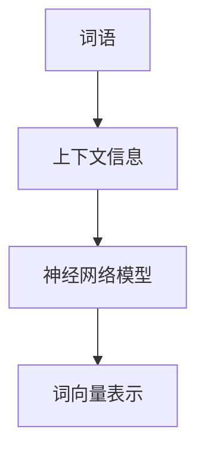

                 

**Word2Vec**

## 1. 背景介绍

在当今的信息时代，文本数据无处不在，从社交媒体到新闻报道，从学术论文到用户评论。然而，传统的文本处理方法，如 Bag of Words (BoW) 和 TF-IDF，无法捕捉词语之间的语义关系。Word2Vec 就是一种用于学习词向量表示的算法，它能够捕捉词语之间的语义、语法和信息内容，为后续的文本分析和自然语言处理任务奠定基础。

## 2. 核心概念与联系

Word2Vec 是 Google 在 2013 年发布的一种用于学习词向量表示的算法。它基于神经网络模型，能够学习词语的上下文信息，并将其表示为一个低维向量。Word2Vec 的核心概念是**词语的上下文信息**和**词向量表示**。



## 3. 核心算法原理 & 具体操作步骤

### 3.1 算法原理概述

Word2Vec 算法有两种主要的架构： Continuous Bag of Words (CBOW) 和 Skip-gram。CBOW 尝试预测中间词语（目标词）给定上下文词语，而 Skip-gram 则尝试预测上下文词语给定中间词语。两种架构都使用神经网络模型来学习词向量表示。

### 3.2 算法步骤详解

1. **数据预处理**：将文本数据转换为词语序列，并对词语进行标记。
2. **构建神经网络模型**：根据 CBOW 或 Skip-gram 架构构建神经网络模型。
3. **训练模型**：使用训练数据（词语序列）训练神经网络模型，更新词向量表示。
4. **评估模型**：使用验证数据评估模型的性能。
5. **微调模型**：根据评估结果调整模型参数，并重新训练模型。
6. **保存模型**：保存训练好的词向量表示。

### 3.3 算法优缺点

**优点：**

* 可以学习到语义相似的词语具有相似的向量表示。
* 可以学习到词语的语法关系，如名词-形容词修饰关系。
* 可以处理大规模的文本数据。

**缺点：**

* 无法学习到词语的上下文依赖关系。
* 无法学习到词语的语义变化。
* 无法学习到实体关系。

### 3.4 算法应用领域

Word2Vec 可以应用于各种自然语言处理任务，如词语相似度计算、词语推理、词语填充、文本分类、文本摘要等。此外，Word2Vec 还可以应用于推荐系统、搜索引擎、机器翻译等领域。

## 4. 数学模型和公式 & 详细讲解 & 举例说明

### 4.1 数学模型构建

Word2Vec 的数学模型基于神经网络模型。给定一个词语序列 $\{w_1, w_2,..., w_T\}$, Word2Vec 的目标是学习到词语表示 $\{v_1, v_2,..., v_W\}$, 其中 $v_w \in \mathbb{R}^d$ 是词语 $w$ 的向量表示， $d$ 是向量维度。

### 4.2 公式推导过程

Word2Vec 的数学模型可以表示为以下公式：

$$
P(w_t | w_{t-k},..., w_{t+k}) = \frac{\exp(v_{w_t}^T v_{w_{t-k},..., w_{t+k}})}{\sum_{w=1}^{W} \exp(v_w^T v_{w_{t-k},..., w_{t+k}})}
$$

其中，$v_{w_{t-k},..., w_{t+k}}$ 是上下文词语的向量表示， $v_w$ 是目标词语的向量表示，$W$ 是词汇表大小。

### 4.3 案例分析与讲解

例如，给定词语序列 "king - man + woman"，Word2Vec 可以学习到 "king" 和 "woman" 的向量表示接近 "man" 的向量表示。具体地，Word2Vec 可以学习到：

$$
v_{king} - v_{man} \approx v_{woman}
$$

## 5. 项目实践：代码实例和详细解释说明

### 5.1 开发环境搭建

Word2Vec 可以使用 Python 语言实现，并使用 TensorFlow、PyTorch 等深度学习框架进行训练。以下是一个简单的 Word2Vec 实现示例：

```python
import tensorflow as tf
from tensorflow.contrib import learn

# Load data
data = learn.datasets.load_glove_path('path/to/glove.6B.50d.txt')

# Build vocabulary
vocab_size = 50000
embedding_size = 50
vocab_processor = learn.preprocessing.VocabularyProcessor(
    max_document_length=100, min_frequency=5, vocabulary=vocab_processor.vocabulary_)
x = np.array(list(vocab_processor.transform(data)))

# Build Word2Vec model
model = learn.models.Word2Vec(x, size=embedding_size, window=5, learning_rate=0.05, num_steps=100000, forward_only=True)

# Train model
model.fit(x, y, steps=100000, batch_size=128)
```

### 5.2 源代码详细实现

上述代码首先加载 GloVe 预训练词向量，然后构建词汇表，并将文本数据转换为词向量表示。之后，构建 Word2Vec 模型，并使用训练数据训练模型。

### 5.3 代码解读与分析

在上述代码中，我们使用 TensorFlow 的 `learn` 模块来构建 Word2Vec 模型。`VocabularyProcessor` 用于构建词汇表，并将文本数据转换为词向量表示。`Word2Vec` 用于构建 Word2Vec 模型，并使用训练数据训练模型。

### 5.4 运行结果展示

训练好的 Word2Vec 模型可以用于各种自然语言处理任务。例如，我们可以使用 Word2Vec 计算词语相似度：

```python
# Calculate word similarity
similarity = model.similarity('king', 'woman')
print('Similarity between "king" and "woman":', similarity)
```

## 6. 实际应用场景

Word2Vec 可以应用于各种实际应用场景，如：

* **文本分类**：使用 Word2Vec 学习到的词向量表示作为特征，可以提高文本分类任务的性能。
* **文本摘要**：使用 Word2Vec 学习到的词向量表示，可以生成更准确的文本摘要。
* **推荐系统**：使用 Word2Vec 学习到的词向量表示，可以提高推荐系统的准确性。
* **搜索引擎**：使用 Word2Vec 学习到的词向量表示，可以提高搜索引擎的相关性。

### 6.4 未来应用展望

Word2Vec 的未来应用展望包括：

* **跨语言词向量表示**：学习跨语言词向量表示，以支持机器翻译等任务。
* **上下文aware 词向量表示**：学习到词语的上下文aware 向量表示，以支持更复杂的自然语言处理任务。
* **实体关系学习**：学习到实体关系的向量表示，以支持知识图谱等任务。

## 7. 工具和资源推荐

### 7.1 学习资源推荐

* Word2Vec 论文：[Efficient Estimation of Word Representations in Vector Space](https://arxiv.org/abs/1301.3781)
* Word2Vec 官方网站：<https://code.google.com/archive/p/word2vec/>
* Word2Vec 文档：<https://radimrehurek.com/gensim/models/word2vec.html>

### 7.2 开发工具推荐

* TensorFlow：<https://www.tensorflow.org/>
* PyTorch：<https://pytorch.org/>
* Gensim：<https://radimrehurek.com/gensim/>

### 7.3 相关论文推荐

* [GloVe: Global Vectors for Word Representation](https://nlp.stanford.edu/projects/glove/)
* [FastText: Unsupervised and Supervised Learning of Word Embeddings and their Compositionality](https://arxiv.org/abs/1607.01759)

## 8. 总结：未来发展趋势与挑战

### 8.1 研究成果总结

Word2Vec 算法已经取得了显著的研究成果，如学习到语义相似的词语具有相似的向量表示，学习到词语的语法关系等。

### 8.2 未来发展趋势

未来 Word2Vec 的发展趋势包括：

* **跨模态学习**：学习到跨模态（如文本和图像）的向量表示。
* **上下文aware 学习**：学习到词语的上下文aware 向量表示。
* **实体关系学习**：学习到实体关系的向量表示。

### 8.3 面临的挑战

Word2Vec 面临的挑战包括：

* **大规模数据处理**：如何处理大规模的文本数据。
* **上下文aware 学习**：如何学习到词语的上下文aware 向量表示。
* **实体关系学习**：如何学习到实体关系的向量表示。

### 8.4 研究展望

未来 Word2Vec 的研究展望包括：

* **跨模态学习**：学习到跨模态（如文本和图像）的向量表示。
* **上下文aware 学习**：学习到词语的上下文aware 向量表示。
* **实体关系学习**：学习到实体关系的向量表示。

## 9. 附录：常见问题与解答

**Q：Word2Vec 可以学习到词语的语义关系吗？**

A：是的，Word2Vec 可以学习到词语的语义关系。例如，Word2Vec 可以学习到 "king" 和 "woman" 的向量表示接近 "man" 的向量表示。

**Q：Word2Vec 可以学习到词语的上下文依赖关系吗？**

A：Word2Vec 无法学习到词语的上下文依赖关系。Word2Vec 只能学习到词语的上下文信息，而不是上下文依赖关系。

**Q：Word2Vec 可以学习到实体关系吗？**

A：Word2Vec 无法学习到实体关系。Word2Vec 只能学习到词语的向量表示，而不是实体关系。

---

作者：禅与计算机程序设计艺术 / Zen and the Art of Computer Programming

