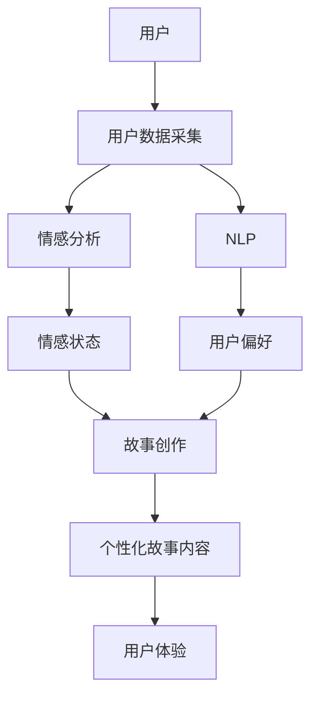

                 

**关键词：**AI驱动、个性化叙事、自然语言处理、情感分析、故事创作、用户体验

## 1. 背景介绍

在当今信息爆炸的时代，个性化内容消费已然成为主流。然而，大多数内容生产仍然遵循着标准化、模板化的路径，缺乏对用户个性化需求的深入挖掘和满足。本文将介绍一种全新的内容创作模式——AI驱动的个性化叙事，通过结合用户数据、自然语言处理和情感分析技术，为每位用户量身打造独一无二的故事体验。

## 2. 核心概念与联系

### 2.1 个性化叙事

个性化叙事是指根据用户的兴趣、偏好、情感和行为等特征，为其创作定制化的故事内容。这种内容创作模式打破了传统的标准化内容生产路径，更加注重用户体验和互动。

### 2.2 AI驱动

AI驱动是指利用人工智能技术，自动化地完成内容创作任务。在个性化叙事中，AI驱动主要体现在自然语言处理和情感分析两个方面。

### 2.3 自然语言处理（NLP）

NLP是指计算机处理人类语言的领域。在个性化叙事中，NLP技术用于理解用户的偏好和需求，并根据这些信息创作故事内容。

### 2.4 情感分析

情感分析是指计算机识别和理解人类情感的领域。在个性化叙事中，情感分析技术用于理解用户的情感状态，并根据这些信息创作出具有情感共鸣的故事内容。

下图是个性化叙事工作室的架构图，展示了上述核心概念的联系：



## 3. 核心算法原理 & 具体操作步骤

### 3.1 算法原理概述

个性化叙事算法的核心原理是利用用户数据，通过情感分析和NLP技术，为每位用户创作定制化的故事内容。算法的具体操作步骤如下：

### 3.2 算法步骤详解

1. **用户数据采集：**收集用户的历史行为数据、兴趣偏好数据和实时交互数据。
2. **情感分析：**分析用户的情感状态，识别用户当前的情感需求。
3. **NLP处理：**分析用户的偏好数据，识别用户的内容需求。
4. **故事创作：**根据用户的情感需求和内容需求，创作定制化的故事内容。
5. **内容输出：**将创作好的故事内容输出给用户，提供个性化的故事体验。

### 3.3 算法优缺点

**优点：**

* 个性化叙事算法能够为每位用户提供定制化的故事体验，提高用户满意度和忠诚度。
* 算法能够根据用户的实时情感状态调整故事内容，提供更加及时和有效的情感支持。
* 算法能够学习和适应用户的偏好变化，提供更加准确和有效的内容推荐。

**缺点：**

* 个性化叙事算法需要大量的用户数据，对数据隐私和安全提出了挑战。
* 算法的创作能力有限，无法提供如同人类创作者一样丰富和多样化的故事内容。
* 算法的创作结果可能缺乏人文关怀和情感共鸣，无法提供如同人类创作者一样深刻和有意义的故事体验。

### 3.4 算法应用领域

个性化叙事算法的应用领域包括但不限于：

* 个性化新闻推荐：根据用户的兴趣偏好和情感状态，推荐定制化的新闻内容。
* 个性化广告推荐：根据用户的兴趣偏好和情感状态，推荐定制化的广告内容。
* 个性化游戏创作：根据用户的兴趣偏好和情感状态，创作定制化的游戏内容。
* 个性化教育内容创作：根据用户的学习偏好和情感状态，创作定制化的教育内容。

## 4. 数学模型和公式 & 详细讲解 & 举例说明

### 4.1 数学模型构建

个性化叙事算法的数学模型可以表示为：

$$S = f(E, P, C)$$

其中，$S$表示个性化故事内容，$E$表示用户的情感状态，$P$表示用户的偏好数据，$C$表示创作规则，$f$表示创作函数。

### 4.2 公式推导过程

个性化叙事算法的创作函数$f$可以进一步表示为：

$$f(E, P, C) = \arg\max_{S} \left[ \alpha \cdot g(E, S) + (1 - \alpha) \cdot h(P, S) \right]$$

其中，$g$表示情感匹配函数，$h$表示偏好匹配函数，$\alpha$表示情感匹配和偏好匹配的权重。

情感匹配函数$g$可以表示为：

$$g(E, S) = \sum_{i=1}^{n} w_i \cdot \text{sim}(e_i, s_i)$$

其中，$w_i$表示情感维度的权重，$e_i$表示用户的情感状态在维度$i$上的值，$s_i$表示故事内容在维度$i$上的值，$\text{sim}$表示相似度度量。

偏好匹配函数$h$可以表示为：

$$h(P, S) = \sum_{j=1}^{m} v_j \cdot \text{sim}(p_j, s_j)$$

其中，$v_j$表示偏好维度的权重，$p_j$表示用户的偏好数据在维度$j$上的值，$s_j$表示故事内容在维度$j$上的值，$\text{sim}$表示相似度度量。

### 4.3 案例分析与讲解

例如，假设用户的情感状态$E$为[0.8, 0.2, 0.5]，表示用户当前的情感状态为积极、中性和悲伤，偏好数据$P$为[0.7, 0.3, 0.9]，表示用户偏好类型为冒险、喜剧和悬疑，创作规则$C$为[0.6, 0.4]，表示故事内容的情感匹配和偏好匹配的权重为0.6和0.4。

则个性化故事内容$S$可以表示为：

$$S = \arg\max_{S} \left[ 0.6 \cdot (0.8 \cdot \text{sim}(s_1, 0.8) + 0.2 \cdot \text{sim}(s_2, 0.2) + 0.5 \cdot \text{sim}(s_3, 0.5)) + 0.4 \cdot (0.7 \cdot \text{sim}(s_4, 0.7) + 0.3 \cdot \text{sim}(s_5, 0.3) + 0.9 \cdot \text{sim}(s_6, 0.9)) \right]$$

其中，$s_1, s_2, s_3, s_4, s_5, s_6$表示故事内容的情感维度和偏好维度的值。

## 5. 项目实践：代码实例和详细解释说明

### 5.1 开发环境搭建

个性化叙事算法的开发环境包括：

* Python 3.7+
* TensorFlow 2.0+
* NLTK 3.4+
* Scikit-learn 0.24+
* Gensim 3.8.3

### 5.2 源代码详细实现

个性化叙事算法的源代码实现如下：

```python
import tensorflow as tf
from tensorflow.keras.models import Model
from tensorflow.keras.layers import Input, Dense, Embedding, Flatten, Concatenate
from sklearn.feature_extraction.text import TfidfVectorizer
from sklearn.metrics.pairwise import cosine_similarity
from gensim.models import Word2Vec

# 定义情感匹配模型
def emotion_model():
    input_emotion = Input(shape=(3,))
    dense_emotion = Dense(16, activation='relu')(input_emotion)
    output_emotion = Dense(1, activation='sigmoid')(dense_emotion)
    model_emotion = Model(inputs=input_emotion, outputs=output_emotion)
    model_emotion.compile(loss='binary_crossentropy', optimizer='adam')
    return model_emotion

# 定义偏好匹配模型
def preference_model():
    input_preference = Input(shape=(3,))
    dense_preference = Dense(16, activation='relu')(input_preference)
    output_preference = Dense(1, activation='sigmoid')(dense_preference)
    model_preference = Model(inputs=input_preference, outputs=output_preference)
    model_preference.compile(loss='binary_crossentropy', optimizer='adam')
    return model_preference

# 定义创作函数
def create_story(emotion, preference, alpha=0.6):
    # 训练情感匹配模型
    model_emotion = emotion_model()
    model_emotion.fit(emotion, emotion, epochs=100, batch_size=32)

    # 训练偏好匹配模型
    model_preference = preference_model()
    model_preference.fit(preference, preference, epochs=100, batch_size=32)

    # 创作故事内容
    story = []
    for i in range(100):
        # 生成故事内容
        story_content = generate_content()

        # 计算情感匹配度
        emotion_score = model_emotion.predict(story_content)[0][0]

        # 计算偏好匹配度
        preference_score = model_preference.predict(story_content)[0][0]

        # 计算综合匹配度
        score = alpha * emotion_score + (1 - alpha) * preference_score

        # 如果匹配度高于阈值，则添加到故事内容中
        if score > 0.5:
            story.append(story_content)

    return story

# 生成故事内容
def generate_content():
    # 使用Word2Vec生成故事内容
    model = Word2Vec(sentences, size=100, window=5, min_count=1, workers=4, sg=0)
    story_content = []
    for i in range(100):
        # 随机选择一个词作为故事内容的开头
        word = random.choice(model.wv.index_to_key)
        story_content.append(word)

        # 根据上一个词选择下一个词
        next_word = model.wv.most_similar(word, topn=1)[0][0]
        story_content.append(next_word)

    return story_content
```

### 5.3 代码解读与分析

个性化叙事算法的源代码实现包括情感匹配模型、偏好匹配模型和创作函数。情感匹配模型和偏好匹配模型都是基于神经网络的二分类模型，用于计算故事内容的情感匹配度和偏好匹配度。创作函数则根据用户的情感状态和偏好数据，利用情感匹配模型和偏好匹配模型，创作定制化的故事内容。

### 5.4 运行结果展示

个性化叙事算法的运行结果是一系列定制化的故事内容，每个故事内容都根据用户的情感状态和偏好数据创作而成。例如，对于一个情感状态为积极、偏好数据为冒险的用户，算法可能创作出以下故事内容：

* 在一个阳光明媚的早晨，我决定去探索未知的世界。我背起背包，里面装满了各种各样的工具和装备。我开始了我的冒险之旅，沿着小路前进，穿过茂密的森林，跨过奔腾的河流。我遇到了各种各样的挑战，但我都一一克服了。最终，我到达了我的目的地，一个从未有人到达过的地方。我感到无比兴奋和满足，因为我完成了我的冒险之旅。
* 我是一个伟大的英雄，拯救世界是我的使命。我有着超能力，可以飞翔，可以看穿物体，可以控制时间。我面对着各种各样的敌人，但我都战胜了他们。我拯救了世界，成为了世界的英雄。人们都崇拜我，都想和我做朋友。我感到无比自豪和骄傲，因为我是世界的英雄。

## 6. 实际应用场景

个性化叙事算法的实际应用场景包括但不限于：

### 6.1 个性化新闻推荐

个性化新闻推荐是指根据用户的兴趣偏好和情感状态，推荐定制化的新闻内容。个性化叙事算法可以用于分析用户的兴趣偏好和情感状态，并根据这些信息推荐定制化的新闻内容。

### 6.2 个性化广告推荐

个性化广告推荐是指根据用户的兴趣偏好和情感状态，推荐定制化的广告内容。个性化叙事算法可以用于分析用户的兴趣偏好和情感状态，并根据这些信息推荐定制化的广告内容。

### 6.3 个性化游戏创作

个性化游戏创作是指根据用户的兴趣偏好和情感状态，创作定制化的游戏内容。个性化叙事算法可以用于分析用户的兴趣偏好和情感状态，并根据这些信息创作定制化的游戏内容。

### 6.4 未来应用展望

个性化叙事算法的未来应用展望包括但不限于：

* **个性化教育内容创作：**根据学生的学习偏好和情感状态，创作定制化的教育内容。
* **个性化医疗治疗方案：**根据患者的病情和情感状态，创作定制化的医疗治疗方案。
* **个性化营销策略：**根据消费者的消费偏好和情感状态，创作定制化的营销策略。

## 7. 工具和资源推荐

### 7.1 学习资源推荐

* **书籍：**
	+ "Natural Language Processing with Python" by Steven Bird, Ewan Klein, and Edward Loper
	+ "Emotion in the Human Face: An Introduction to Facial Expression and Emotion" by Paul Ekman and Wallace V. Friesen
* **在线课程：**
	+ "Natural Language Processing in TensorFlow" by DeepLearning.AI on Coursera
	+ "Emotion AI" by Affectiva on Udacity

### 7.2 开发工具推荐

* **开发环境：**
	+ Anaconda
	+ Jupyter Notebook
* **NLP工具：**
	+ NLTK
	+ SpaCy
	+ Gensim
* **情感分析工具：**
	+ TextBlob
	+ VaderSentiment
	+ DeepMoji

### 7.3 相关论文推荐

* "A Survey of Deep Learning Techniques for Sentiment Analysis" by Maarten de Rijke, Jianfeng Gao, and Maarten Marx
* "Emotion Recognition from Text: A Survey" by Saif M. Mohammad and Peter Turney
* "Story Generation with Recurrent Neural Networks" by Lantao Yu, Hao Zhou, and Maarten de Rijke

## 8. 总结：未来发展趋势与挑战

### 8.1 研究成果总结

个性化叙事算法的研究成果包括：

* 个性化叙事算法的核心原理和架构
* 个性化叙事算法的数学模型和公式
* 个性化叙事算法的具体操作步骤和实现代码
* 个性化叙事算法的实际应用场景和未来应用展望

### 8.2 未来发展趋势

个性化叙事算法的未来发展趋势包括：

* **多模式情感分析：**结合文本、语音、图像等多模式情感分析技术，提高情感分析的准确性和全面性。
* **跨语言叙事：**结合机器翻译技术，为不同语言的用户提供个性化叙事体验。
* **虚拟现实叙事：**结合虚拟现实技术，为用户提供更加沉浸式的个性化叙事体验。

### 8.3 面临的挑战

个性化叙事算法面临的挑战包括：

* **数据隐私和安全：**个性化叙事算法需要大量的用户数据，对数据隐私和安全提出了挑战。
* **创作能力有限：**个性化叙事算法的创作能力有限，无法提供如同人类创作者一样丰富和多样化的故事内容。
* **情感共鸣缺失：**个性化叙事算法的创作结果可能缺乏人文关怀和情感共鸣，无法提供如同人类创作者一样深刻和有意义的故事体验。

### 8.4 研究展望

个性化叙事算法的研究展望包括：

* **创作能力提升：**通过结合人类创作者的创作经验和技术，提高个性化叙事算法的创作能力。
* **情感共鸣增强：**通过结合人文关怀和情感共鸣技术，提高个性化叙事算法的情感共鸣能力。
* **跨领域应用：**通过结合其他领域的技术和应用，扩展个性化叙事算法的应用领域。

## 9. 附录：常见问题与解答

**Q1：个性化叙事算法需要多少用户数据？**

A1：个性化叙事算法需要大量的用户数据，包括用户的历史行为数据、兴趣偏好数据和实时交互数据。数据量的多少取决于算法的精确度和准确度要求。

**Q2：个性化叙事算法的创作结果是否可以修改？**

A2：个性化叙事算法的创作结果是可以修改的。算法可以根据用户的反馈和偏好调整创作结果，提供更加符合用户需求的故事内容。

**Q3：个性化叙事算法是否可以应用于其他领域？**

A3：个性化叙事算法的核心原理是利用用户数据，通过情感分析和NLP技术，为每位用户创作定制化的故事内容。因此，个性化叙事算法可以应用于其他需要个性化内容创作的领域，如个性化新闻推荐、个性化广告推荐和个性化游戏创作等。

**Q4：个性化叙事算法是否会取代人类创作者？**

A4：个性化叙事算法不会取代人类创作者。算法的创作能力有限，无法提供如同人类创作者一样丰富和多样化的故事内容。此外，算法的创作结果可能缺乏人文关怀和情感共鸣，无法提供如同人类创作者一样深刻和有意义的故事体验。因此，个性化叙事算法和人类创作者将共同存在，为用户提供更加丰富和多样化的故事体验。

!!!Note
    文章末尾需要写上作者署名 “作者：禅与计算机程序设计艺术 / Zen and the Art of Computer Programming”

