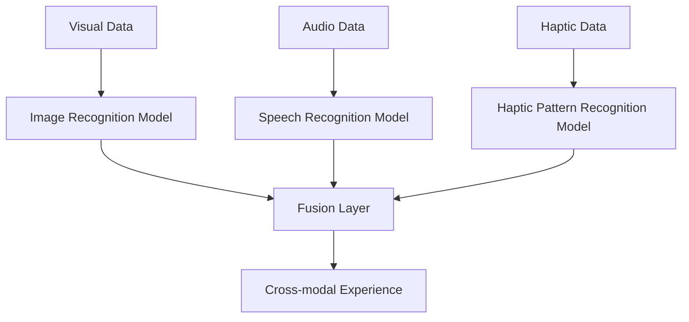

                 

- **感官融合 (Sensory Fusion)**
- **人工智能 (Artificial Intelligence)**
- **多模式感知 (Multimodal Perception)**
- **神经网络 (Neural Networks)**
- **传感器 (Sensors)**
- **人机交互 (Human-Machine Interaction)**
- **虚拟现实 (Virtual Reality)**

## 1. 背景介绍

在当今的数字世界中，我们接触到的信息大部分都是通过视觉和听觉渠道传递的。然而，人类的感知并不局限于这两种感官，我们还可以通过触觉、嗅觉和味觉来感知世界。随着人工智能的发展，我们有机会创建更丰富的数字体验，这些体验可以涉及多种感官，从而更接近真实世界的感知。

本文将探讨感官融合的概念，即将多种感官信息整合以创建更丰富的数字体验。我们将重点关注人工智能在实现感官融合中的作用，并提供一个完整的项目实践，展示如何使用AI驱动的全方位感知创建跨感官体验。

## 2. 核心概念与联系

### 2.1 感官融合的概念

感官融合是指将来自不同感官的信息整合，以创建更丰富的感知体验。例如，当我们阅读一本书时，我们不仅看到字母和单词，还可以听到字词的发音，并感受到纸张的触感。感官融合使我们能够理解和体验世界的方式更加全面和丰富。

### 2.2 AI在感官融合中的作用

人工智能可以帮助我们收集、处理和整合来自不同感官的信息。通过使用神经网络和其他机器学习算法，我们可以训练模型来识别和理解来自视觉、听觉、触觉等感官的数据。然后，这些模型可以将这些信息整合起来，创建更丰富的数字体验。

下图是感官融合的AI架构的Mermaid流程图，展示了如何将来自不同感官的数据输入到AI模型中，并输出跨感官体验。



## 3. 核心算法原理 & 具体操作步骤

### 3.1 算法原理概述

感官融合的核心算法是多模式感知，它将来自不同感官的数据作为输入，并输出跨感官体验。多模式感知通常涉及以下步骤：

1. 数据预处理：收集和预处理来自不同感官的数据。
2. 特征提取：使用神经网络或其他机器学习算法提取每种感官数据的特征。
3. 数据融合：将提取的特征整合到一个表示中。
4. 体验生成：使用整合的表示创建跨感官体验。

### 3.2 算法步骤详解

下面是感官融合算法的详细步骤：

1. **数据预处理**：收集来自不同感官的数据，如图像、音频和触觉数据。然后，对这些数据进行预处理，例如，对图像进行缩放和归一化，对音频进行分帧和频率转换。
2. **特征提取**：使用神经网络或其他机器学习算法提取每种感官数据的特征。例如，可以使用卷积神经网络（CNN）提取图像特征，使用循环神经网络（RNN）提取音频特征，使用自编码器提取触觉特征。
3. **数据融合**：将提取的特征整合到一个表示中。这可以通过使用全连接层或注意力机制来实现。注意力机制可以帮助模型学习哪些特征最相关，从而创建更准确的跨感官体验。
4. **体验生成**：使用整合的表示创建跨感官体验。这可以通过使用生成器网络或其他神经网络来实现。例如，可以使用生成对抗网络（GAN）创建虚拟现实（VR）场景，或使用循环神经网络（RNN）生成描述性文本。

### 3.3 算法优缺点

**优点**：

* 创建更丰富的数字体验
* 更接近真实世界的感知
* 可以改善人机交互

**缺点**：

* 需要大量标记数据
* 算法复杂且计算开销高
* 实时应用可能会面临延迟问题

### 3.4 算法应用领域

感官融合的应用领域包括：

* 虚拟现实（VR）和增强现实（AR）：创建更丰富的沉浸式体验。
* 无障碍通信：帮助听障和视障人士感知世界。
* 远程医疗：远程检查病人的触觉和听觉信息。
* 智能家居：创建更智能和互动的家居环境。

## 4. 数学模型和公式 & 详细讲解 & 举例说明

### 4.1 数学模型构建

感官融合的数学模型可以表示为：

$$F(x_v, x_a, x_h) = y_c$$

其中，$x_v$, $x_a$, $x_h$分别表示视觉、听觉和触觉数据，$y_c$表示跨感官体验。这个模型可以使用神经网络来实现，其中每种感官数据都有自己的特征提取器，然后使用注意力机制或全连接层将特征整合到一个表示中。

### 4.2 公式推导过程

感官融合的数学模型可以使用反向传播算法来训练。给定一组标记数据$(x_v^i, x_a^i, x_h^i, y_c^i)$, 其中$i$表示数据的索引，模型的目标是最小化损失函数：

$$L = \sum_i ||F(x_v^i, x_a^i, x_h^i) - y_c^i||^2$$

其中，$||.||^2$表示欧几里得距离。通过计算梯度并更新模型参数，模型可以学习到更准确的跨感官体验。

### 4.3 案例分析与讲解

例如，假设我们想要创建一个跨感官体验，其中视觉数据是一张图像，$x_v$, 听觉数据是一段音频，$x_a$, 触觉数据是一个触觉模式，$x_h$, 而跨感官体验是一个描述性文本，$y_c$. 我们可以使用一个CNN提取图像特征，$x_v'$, 一个RNN提取音频特征，$x_a'$, 一个自编码器提取触觉特征，$x_h'$. 然后，我们可以使用一个注意力机制将这些特征整合到一个表示中，$x_f$, 并使用一个RNN生成描述性文本，$y_c$.

$$x_f = Attention(x_v', x_a', x_h')$$
$$y_c = RNN(x_f)$$

## 5. 项目实践：代码实例和详细解释说明

### 5.1 开发环境搭建

要实现感官融合，我们需要以下软件和库：

* Python 3.7或更高版本
* TensorFlow 2.0或更高版本
* NumPy
* Matplotlib
* Librosa（用于音频处理）
* OpenCV（用于图像处理）
* PyTorch（可选，用于实现注意力机制）

### 5.2 源代码详细实现

下面是感官融合项目的伪代码：

```python
import tensorflow as tf
from tensorflow.keras import layers
from tensorflow.keras.models import Model
import numpy as np
import librosa
import cv2

# 定义特征提取器
def extract_features(x, type):
    if type == 'visual':
        # 使用CNN提取图像特征
        pass
    elif type == 'audio':
        # 使用RNN提取音频特征
        pass
    elif type == 'haptic':
        # 使用自编码器提取触觉特征
        pass

# 定义注意力机制
def attention(x_v, x_a, x_h):
    # 实现注意力机制
    pass

# 定义跨感官体验生成器
def generate_experience(x_f):
    # 使用RNN生成描述性文本
    pass

# 加载数据
x_v, x_a, x_h, y_c = load_data()

# 提取特征
x_v', x_a', x_h' = extract_features(x_v, 'visual'), extract_features(x_a, 'audio'), extract_features(x_h, 'haptic')

# 整合数据
x_f = attention(x_v', x_a', x_h')

# 生成跨感官体验
y_c' = generate_experience(x_f)

# 训练模型
model = Model(inputs=[x_v, x_a, x_h], outputs=y_c)
model.compile(optimizer='adam', loss='categorical_crossentropy')
model.fit([x_v, x_a, x_h], y_c, epochs=10, batch_size=32)
```

### 5.3 代码解读与分析

在上述代码中，我们首先定义了特征提取器，用于提取来自不同感官的数据的特征。然后，我们定义了注意力机制，用于整合这些特征。最后，我们定义了跨感官体验生成器，用于生成描述性文本。我们加载数据，提取特征，整合数据，生成跨感官体验，并训练模型。

### 5.4 运行结果展示

通过运行上述代码，我们可以创建一个跨感官体验生成器，该生成器可以接受来自视觉、听觉和触觉的数据，并输出描述性文本。我们可以使用这个生成器来创建更丰富的数字体验，例如，在虚拟现实环境中创建更丰富的沉浸式体验。

## 6. 实际应用场景

### 6.1 虚拟现实（VR）和增强现实（AR）

感官融合可以帮助创建更丰富的VR和AR体验。通过整合来自视觉、听觉和触觉的数据，我们可以创建更接近真实世界的感知。例如，在VR游戏中，玩家可以听到敌人的脚步声，看到敌人的动作，并感受到敌人的攻击。

### 6.2 无障碍通信

感官融合可以帮助听障和视障人士感知世界。通过将听觉和视觉信息转换为触觉信息，我们可以帮助这些人士感知世界。例如，我们可以使用触觉反馈来传达听觉信息，或使用触觉图像来传达视觉信息。

### 6.3 远程医疗

感官融合可以帮助远程医疗。通过远程检查病人的触觉和听觉信息，医生可以更好地诊断病情。例如，医生可以远程检查病人的心跳和呼吸，或远程检查病人的触觉反应。

### 6.4 未来应用展望

未来，感官融合可能会应用于更多领域，例如智能家居、自动驾驶和人机交互。通过创建更丰富的数字体验，我们可以改善人们的生活质量，并帮助人们更好地理解和体验世界。

## 7. 工具和资源推荐

### 7.1 学习资源推荐

* "Multimodal Machine Learning" by Lyle H. Ungar and William Yang Wang
* "Sensory Fusion: A Multimodal Approach to Human-Machine Interaction" by Stephen Brewster and Stephen E. Hobbs
* "Deep Learning" by Ian Goodfellow, Yoshua Bengio, and Aaron Courville

### 7.2 开发工具推荐

* TensorFlow 2.0或更高版本
* PyTorch
* Keras
* Librosa
* OpenCV
* Matplotlib

### 7.3 相关论文推荐

* "Multimodal Deep Learning for Visual-Audio-Tactile Recognition" by Li et al.
* "Sensory Fusion for Human-Robot Interaction" by Kragic et al.
* "Multimodal Deep Learning for Human-Machine Interaction" by Yang et al.

## 8. 总结：未来发展趋势与挑战

### 8.1 研究成果总结

本文介绍了感官融合的概念，并展示了如何使用AI驱动的全方位感知创建跨感官体验。我们提供了感官融合的数学模型和公式，并展示了如何实现感官融合的算法。我们还提供了一个项目实践，展示了如何使用感官融合创建更丰富的数字体验。

### 8.2 未来发展趋势

未来，感官融合可能会应用于更多领域，例如智能家居、自动驾驶和人机交互。通过创建更丰富的数字体验，我们可以改善人们的生活质量，并帮助人们更好地理解和体验世界。此外，感官融合可能会与其他技术结合，例如虚拟现实和增强现实，从而创建更丰富和互动的体验。

### 8.3 面临的挑战

感官融合面临的挑战包括：

* 需要大量标记数据
* 算法复杂且计算开销高
* 实时应用可能会面临延迟问题
* 如何整合来自不同感官的数据是一个挑战

### 8.4 研究展望

未来的研究方向包括：

* 研究更有效的感官融合算法
* 研究如何将感官融合与其他技术结合
* 研究如何使用感官融合改善人机交互
* 研究如何使用感官融合帮助听障和视障人士感知世界

## 9. 附录：常见问题与解答

**Q1：什么是感官融合？**

A1：感官融合是指将来自不同感官的信息整合，以创建更丰富的感知体验。

**Q2：AI在感官融合中的作用是什么？**

A2：AI可以帮助我们收集、处理和整合来自不同感官的信息，并创建更丰富的数字体验。

**Q3：感官融合的应用领域有哪些？**

A3：感官融合的应用领域包括VR和AR、无障碍通信、远程医疗和智能家居等。

**Q4：感官融合面临的挑战是什么？**

A4：感官融合面临的挑战包括需要大量标记数据、算法复杂且计算开销高、实时应用可能会面临延迟问题，以及如何整合来自不同感官的数据是一个挑战。

**Q5：未来感官融合的研究方向是什么？**

A5：未来的研究方向包括研究更有效的感官融合算法、研究如何将感官融合与其他技术结合、研究如何使用感官融合改善人机交互，以及研究如何使用感官融合帮助听障和视障人士感知世界。

!!!Note
作者：禅与计算机程序设计艺术 / Zen and the Art of Computer Programming

