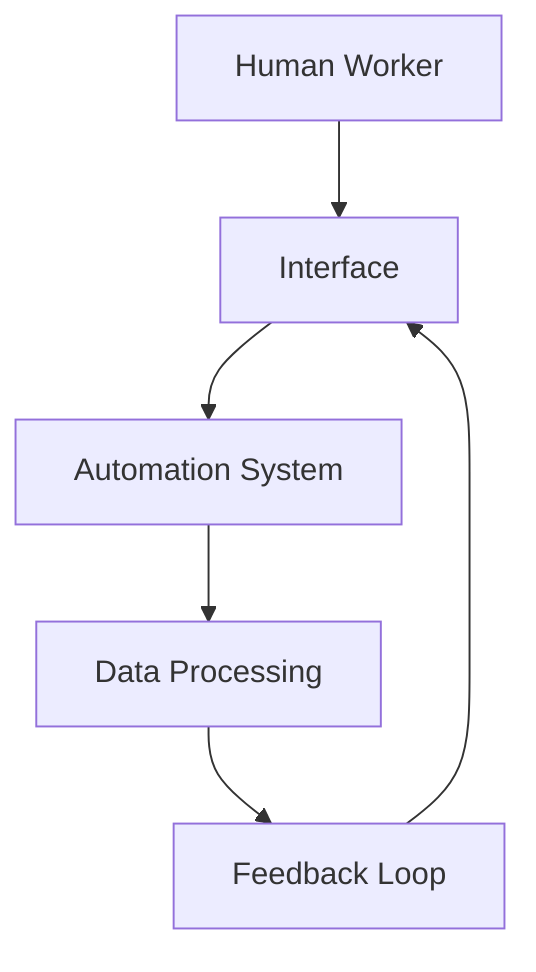

                 

**保护工人权益：人类计算中的监管挑战**

**作者：禅与计算机程序设计艺术 / Zen and the Art of Computer Programming**

## 1. 背景介绍

随着人工智能（AI）和自动化技术的发展，人类计算（Human-in-the-Loop）系统变得越来越普遍。这些系统依赖于人类工作者的判断和决策，但同时也面临着监管和保护工人权益的挑战。本文将深入探讨人类计算中的监管挑战，并提出解决方案。

## 2. 核心概念与联系

### 2.1 人类计算系统的架构

人类计算系统的核心是人类工作者和自动化系统之间的互动。下图展示了人类计算系统的架构：



### 2.2 监管挑战

人类计算系统面临的监管挑战包括：

- **工人福祉**：确保工人在工作环境中感到舒适和安全。
- **决策透明度**：确保工人理解系统的决策过程，并能够质疑和挑战这些决策。
- **公平性**：确保系统对所有工人一视同仁，并防止偏见和歧视。
- **隐私**：保护工人的个人数据和隐私。

## 3. 核心算法原理 & 具体操作步骤

### 3.1 算法原理概述

监管人类计算系统的关键是设计能够监控和评估系统行为的算法。这些算法应该能够检测不当行为，并提供反馈以改进系统。

### 3.2 算法步骤详解

1. **数据收集**：收集系统的行为数据，包括工人的输入和系统的输出。
2. **异常检测**：使用异常检测算法（如 Isolation Forest 或 Local Outlier Factor）检测系统行为的异常。
3. **行为评估**：使用行为评估模型（如基于规则的系统或深度学习模型）评估系统行为的合理性。
4. **反馈提供**：如果检测到异常或不合理行为，则提供反馈以改进系统。

### 3.3 算法优缺点

优点：

- 能够检测系统行为的异常和不合理性。
- 提供反馈以改进系统。

缺点：

- 可能会导致系统过度监管，限制工人的自主权。
- 设计复杂的行为评估模型可能需要大量的数据和计算资源。

### 3.4 算法应用领域

监管算法可以应用于各种人类计算系统，包括自动驾驶汽车、医疗诊断系统和金融决策系统。

## 4. 数学模型和公式 & 详细讲解 & 举例说明

### 4.1 数学模型构建

监管算法的数学模型可以表示为：

$$M = \{D, E, F, R\}$$

其中：

- $D$ 是系统行为的数据集。
- $E$ 是异常检测算法。
- $F$ 是行为评估模型。
- $R$ 是反馈机制。

### 4.2 公式推导过程

监管算法的目标是最小化系统行为的异常和不合理性。可以使用以下公式表示这个目标：

$$\min_{E, F, R} \sum_{d \in D} (e(d) + f(d) + r(d))$$

其中：

- $e(d)$ 是异常检测算法对数据点 $d$ 的异常分数。
- $f(d)$ 是行为评估模型对数据点 $d$ 的不合理性分数。
- $r(d)$ 是反馈机制对数据点 $d$ 的惩罚。

### 4.3 案例分析与讲解

例如，在自动驾驶汽车系统中，监管算法可以检测系统是否以不安全的方式行驶。如果检测到异常，算法可以提供反馈，并调整系统的参数以改进其行为。

## 5. 项目实践：代码实例和详细解释说明

### 5.1 开发环境搭建

本项目使用 Python 和 Scikit-learn 进行开发。首先，安装必要的库：

```bash
pip install scikit-learn numpy pandas
```

### 5.2 源代码详细实现

以下是监管算法的 Python 实现：

```python
import numpy as np
import pandas as pd
from sklearn.ensemble import IsolationForest

# 读取系统行为数据
data = pd.read_csv('system_behavior.csv')

# 初始化异常检测算法
clf = IsolationForest(contamination=0.01)

# 检测异常
y_pred = clf.fit_predict(data)

# 评估行为合理性（示例：使用简单的规则系统）
data['reasonable'] = (data['speed'] < 100) & (data['acceleration'] < 10)

# 提供反馈（示例：对异常和不合理行为进行标记）
data['feedback'] = np.where((y_pred == -1) | (~data['reasonable']), '改进', '正常')

# 打印结果
print(data[['speed', 'acceleration', 'feedback']])
```

### 5.3 代码解读与分析

代码首先读取系统行为数据，然后使用 Isolation Forest 算法检测异常。接着，代码使用简单的规则系统评估行为合理性。如果检测到异常或不合理行为，则提供反馈，并标记为 '改进'。

### 5.4 运行结果展示

运行结果将显示系统的速度、加速度和反馈。如果检测到异常或不合理行为，则会在 'feedback' 列中显示 '改进'。

## 6. 实际应用场景

### 6.1 工人福祉

监管算法可以监控工人的工作环境，确保其感到舒适和安全。例如，在远程工作场景中，算法可以检测工人是否长时间保持静止，并提供提醒以鼓励其活动。

### 6.2 决策透明度

监管算法可以帮助工人理解系统的决策过程。例如，在金融决策系统中，算法可以提供决策的理由，并允许工人质疑和挑战这些决策。

### 6.3 公平性

监管算法可以检测系统是否存在偏见和歧视。例如，在招聘系统中，算法可以检测是否存在基于性别或种族的偏见，并提供反馈以改进系统。

### 6.4 未来应用展望

未来，监管算法将变得越来越智能和自适应。它们将能够学习和适应新的行为模式，并提供个性化的反馈以改进系统。

## 7. 工具和资源推荐

### 7.1 学习资源推荐

- "Human-in-the-Loop Machine Learning" 课程：<https://www.coursera.org/learn/human-in-the-loop-machine-learning>
- "Fairness, Accountability, and Transparency in Machine Learning" 课程：<https://www.coursera.org/learn/fairness-accountability-and-transparency-in-machine-learning>

### 7.2 开发工具推荐

- Scikit-learn：<https://scikit-learn.org/>
- TensorFlow：<https://www.tensorflow.org/>
- PyTorch：<https://pytorch.org/>

### 7.3 相关论文推荐

- "Human-in-the-Loop Machine Learning"：<https://arxiv.org/abs/1904.08779>
- "Fairness, Accountability, and Transparency in Machine Learning"：<https://arxiv.org/abs/1904.08778>

## 8. 总结：未来发展趋势与挑战

### 8.1 研究成果总结

本文介绍了人类计算系统中的监管挑战，并提出了监管算法的解决方案。这些算法能够检测系统行为的异常和不合理性，并提供反馈以改进系统。

### 8.2 未来发展趋势

未来，监管算法将变得越来越智能和自适应。它们将能够学习和适应新的行为模式，并提供个性化的反馈以改进系统。

### 8.3 面临的挑战

监管算法面临的挑战包括设计复杂的行为评估模型，防止系统过度监管，并确保工人的隐私和数据安全。

### 8.4 研究展望

未来的研究将关注监管算法的自适应性、个性化反馈和隐私保护。此外，研究还将探索监管算法在新领域（如生物医学和自动驾驶）的应用。

## 9. 附录：常见问题与解答

**Q：监管算法是否会限制工人的自主权？**

**A：**监管算法的目的是改进系统，而不是限制工人的自主权。通过提供反馈，算法可以帮助工人更好地理解系统的决策过程，并使其能够更有效地控制系统。

**Q：监管算法是否会侵犯工人的隐私？**

**A：**监管算法收集的数据应当是系统行为数据，而不是工人的个人数据。此外，应该采取措施保护工人的隐私，例如使用匿名数据或差分隐私技术。

**Q：监管算法是否会导致系统过度监管？**

**A：**监管算法的设计应当平衡监管和工人的自主权。通过提供个性化的反馈和允许工人质疑和挑战系统的决策，算法可以帮助工人更好地控制系统，而不是限制其自主权。

**作者：禅与计算机程序设计艺术 / Zen and the Art of Computer Programming**

