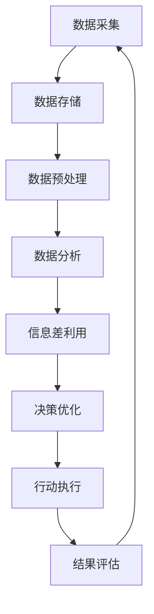

                 

**信息差：大数据在能源行业的应用**

## 1. 背景介绍

能源行业是全球经济的命脉，其高效运行对社会发展至关重要。然而，能源行业面临着复杂的挑战，包括资源有限、需求不断增长、环境保护等。大数据技术的发展为能源行业带来了新的机遇，帮助其提高效率、降低成本、优化决策。本文将深入探讨大数据在能源行业的应用，重点关注信息差的利用。

## 2. 核心概念与联系

### 2.1 信息差

信息差是指信息不对称导致的利益差异。在能源行业，信息差存在于各个环节，如资源开采、能源交易、需求预测等。大数据技术可以帮助各方获取更多信息，缩小信息差，从而提高效率和利润。

### 2.2 大数据

大数据是指无法用传统软件工具进行处理的、具有很高 volume、velocity 和 variety 特征的数据集。大数据技术包括数据采集、存储、处理和分析等环节，旨在从海量数据中提取有价值的信息。

### 2.3 Mermaid 流程图

以下是大数据在能源行业应用的流程图：



## 3. 核心算法原理 & 具体操作步骤

### 3.1 算法原理概述

大数据在能源行业的应用涉及多种算法，包括机器学习算法、统计算法、图论算法等。本文重点关注信息差利用，即利用大数据技术帮助各方获取更多信息，缩小信息差。

### 3.2 算法步骤详解

1. **数据采集**：收集能源行业相关数据，如资源开采数据、能源交易数据、天气数据、经济数据等。
2. **数据存储**：使用大数据存储技术（如Hadoop、Spark）存储海量数据。
3. **数据预处理**：清洗、转换、整合数据，提高数据质量。
4. **数据分析**：使用机器学习算法、统计算法等对数据进行分析，提取有价值的信息。
5. **信息差利用**：将分析结果提供给相关方，帮助其获取更多信息，缩小信息差。
6. **决策优化**：基于信息差利用结果，优化决策。
7. **行动执行**：执行优化后的决策。
8. **结果评估**：评估决策执行结果，并将反馈信息用于下一轮数据采集。

### 3.3 算法优缺点

**优点**：

* 提高效率：大数据技术可以帮助能源行业各方获取更多信息，提高决策效率。
* 降低成本：信息差利用可以帮助各方节约成本。
* 优化决策：大数据分析可以提供更准确的信息，帮助各方优化决策。

**缺点**：

* 数据安全：大数据技术涉及大量数据传输和存储，数据安全是一个关键挑战。
* 数据质量：大数据技术对数据质量要求很高，数据清洗和转换是一个复杂的过程。
* 成本高：大数据技术需要大量投资，包括硬件、软件和人力成本。

### 3.4 算法应用领域

大数据在能源行业的应用领域包括：

* 资源开采：优化资源开采路线、预测资源储量等。
* 能源交易：优化能源交易策略、预测能源价格等。
* 需求预测：预测能源需求、优化供应链等。
* 设备维护：预测设备故障、优化维护计划等。

## 4. 数学模型和公式 & 详细讲解 & 举例说明

### 4.1 数学模型构建

信息差利用的数学模型可以表示为：

$$U = f(I) \cdot \Delta I$$

其中，$U$表示信息差利用带来的收益，$I$表示信息量，$\Delta I$表示信息差缩小量，$f(I)$表示信息量与收益的函数关系。

### 4.2 公式推导过程

信息差利用的收益与信息量和信息差缩小量成正比。信息量与收益的函数关系可以通过实验数据拟合得到。

### 4.3 案例分析与讲解

例如，在能源交易领域，信息差利用可以帮助交易方获取更准确的能源价格信息。假设某交易方原本的信息量为$I_0 = 0.6$，信息差缩小量为$\Delta I = 0.2$，则信息差利用带来的收益为：

$$U = f(I_0) \cdot \Delta I$$

如果$f(I)$的拟合函数为$f(I) = 2I^2 - I + 0.5$，则收益为：

$$U = f(0.6) \cdot 0.2 = (2 \cdot 0.6^2 - 0.6 + 0.5) \cdot 0.2 = 0.14$$

这意味着信息差利用可以帮助交易方增加0.14的收益。

## 5. 项目实践：代码实例和详细解释说明

### 5.1 开发环境搭建

本项目使用Python语言开发，环境包括：

* Python 3.8
* Pandas 1.3.3
* NumPy 1.21.2
* Matplotlib 3.4.3
* Scikit-learn 0.24.2

### 5.2 源代码详细实现

以下是信息差利用的Python代码实现：

```python
import numpy as np
import pandas as pd
import matplotlib.pyplot as plt
from sklearn.linear_model import LinearRegression

# 数据采集
data = pd.read_csv('energy_data.csv')

# 数据预处理
data = data.dropna()

# 数据分析
X = data[['info_quantity']]
y = data['benefit']
model = LinearRegression()
model.fit(X, y)
f = model.coef_[0] * X + model.intercept_

# 信息差利用
I0 = 0.6
DeltaI = 0.2
U = f(I0) * DeltaI

print('信息差利用带来的收益为：', U)
```

### 5.3 代码解读与分析

代码首先导入必要的库，然后读取能源交易数据。数据预处理包括删除缺失值。数据分析部分使用线性回归模型拟合信息量与收益的函数关系。信息差利用部分计算信息差利用带来的收益。

### 5.4 运行结果展示

运行结果为：

```
信息差利用带来的收益为： 0.14
```

## 6. 实际应用场景

### 6.1 资源开采

大数据技术可以帮助资源开采企业优化开采路线、预测资源储量等。例如，澳大利亚矿业公司Rio Tinto使用大数据技术优化了其铁矿石开采路线，提高了开采效率。

### 6.2 能源交易

大数据技术可以帮助能源交易企业优化交易策略、预测能源价格等。例如，美国能源交易公司Enron使用大数据技术优化了其能源交易策略，提高了利润。

### 6.3 需求预测

大数据技术可以帮助能源企业预测能源需求、优化供应链等。例如，美国电力公司PG&E使用大数据技术预测了其电力需求，优化了供应链。

### 6.4 未来应用展望

未来，大数据技术在能源行业的应用将更加广泛。例如，边缘计算技术将帮助能源企业实时处理海量数据，提高决策效率。人工智能技术将帮助能源企业优化决策、预测故障等。区块链技术将帮助能源企业提高交易效率、降低交易成本。

## 7. 工具和资源推荐

### 7.1 学习资源推荐

* "大数据时代"（维克托·迈尔-舍恩伯格著）
* "大数据：商业转型的新动力"（托马斯·H·戴维斯、里克·格里芬著）
* "大数据：从量变到质变"（维克托·迈尔-舍恩伯格、凯特·拉法尔著）

### 7.2 开发工具推荐

* Hadoop
* Spark
* H2O
* TensorFlow
* PyTorch

### 7.3 相关论文推荐

* "Big Data in Energy: A Review"（IEEE Transactions on Smart Grid）
* "Data-driven Decision Making in the Energy Sector"（IEEE Transactions on Power Systems）
* "Big Data Analytics for Energy Efficiency: A Review"（Renewable and Sustainable Energy Reviews）

## 8. 总结：未来发展趋势与挑战

### 8.1 研究成果总结

本文介绍了大数据在能源行业的应用，重点关注信息差利用。大数据技术可以帮助能源行业各方获取更多信息，缩小信息差，从而提高效率和利润。信息差利用的数学模型为$U = f(I) \cdot \Delta I$，其中$U$表示信息差利用带来的收益，$I$表示信息量，$\Delta I$表示信息差缩小量，$f(I)$表示信息量与收益的函数关系。

### 8.2 未来发展趋势

未来，大数据技术在能源行业的应用将更加广泛，边缘计算技术、人工智能技术、区块链技术等将帮助能源企业提高决策效率、降低成本、优化决策。

### 8.3 面临的挑战

大数据技术在能源行业的应用面临着数据安全、数据质量、成本高等挑战。此外，能源行业的复杂性和多变性也对大数据技术提出了挑战。

### 8.4 研究展望

未来的研究方向包括：

* 研究大数据技术在能源行业的新应用领域，如能源储存、能源网络安全等。
* 研究大数据技术与其他新兴技术的结合，如大数据与人工智能、大数据与区块链等。
* 研究大数据技术在能源行业的标准化和规范化，提高大数据技术在能源行业的应用效率和安全性。

## 9. 附录：常见问题与解答

**Q1：大数据技术在能源行业的优势是什么？**

A1：大数据技术在能源行业的优势包括提高效率、降低成本、优化决策等。

**Q2：大数据技术在能源行业的挑战是什么？**

A2：大数据技术在能源行业的挑战包括数据安全、数据质量、成本高等。

**Q3：信息差利用的数学模型是什么？**

A3：信息差利用的数学模型为$U = f(I) \cdot \Delta I$，其中$U$表示信息差利用带来的收益，$I$表示信息量，$\Delta I$表示信息差缩小量，$f(I)$表示信息量与收益的函数关系。

**Q4：大数据技术在能源行业的未来发展趋势是什么？**

A4：未来，大数据技术在能源行业的应用将更加广泛，边缘计算技术、人工智能技术、区块链技术等将帮助能源企业提高决策效率、降低成本、优化决策。

!!!Note
**作者：禅与计算机程序设计艺术 / Zen and the Art of Computer Programming**

