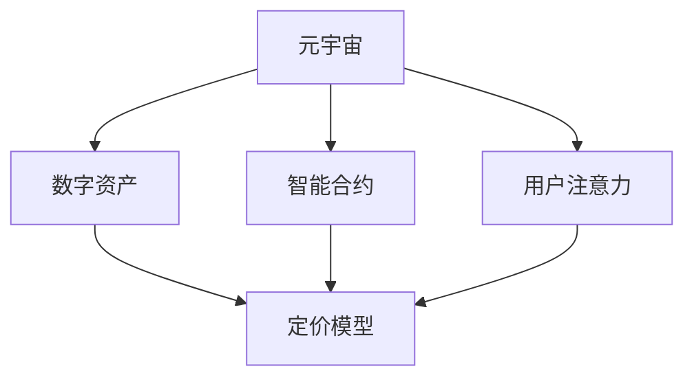

                 

# 注意力经济学：元宇宙中的价值重构

## 1. 背景介绍

### 1.1 问题由来
随着互联网技术的不断进步，元宇宙（Metaverse）的概念逐渐兴起。作为互联网发展的下一阶段，元宇宙集合了虚拟现实（VR）、增强现实（AR）、区块链（Blockchain）等多种技术，构建了一个高度沉浸、高度互动、高度数字化的虚拟世界。在元宇宙中，基于区块链的数字资产、智能合约、用户身份等，可以真实地映射到现实世界中的经济活动和法律事务。

元宇宙的兴起，引发了人们对于数字资产定价、智能合约执行、数字身份管理等问题的深度思考。特别是数字资产的定价问题，数字资产的价格主要由市场供需关系决定，但元宇宙中的数字资产定价和价值评估，显然不仅仅是由市场供需关系所决定的，而是更多地受到用户的关注和注意力。这种基于注意力的定价机制，逐渐形成了一种新的经济学范式——注意力经济学。

### 1.2 问题核心关键点
注意力经济学（Economics of Attention）是一种基于用户注意力的经济模型。该模型将用户的注意力视为一种稀缺资源，并通过算法对这种资源进行定价和优化，实现资源的合理配置和价值的重构。

注意力经济学的核心思想在于：在元宇宙中，用户对虚拟世界的参与程度，会直接影响到数字资产的价格和价值。用户关注度越高，数字资产的价格就越高，反之亦然。因此，元宇宙中的价值重构，离不开对用户注意力的理解和管理。

### 1.3 问题研究意义
研究注意力经济学，对于理解元宇宙中的数字资产价值重构、构建公平合理的价值评估体系、提升数字资产定价的透明度和效率，具有重要意义。

1. **理解数字资产价值重构**：通过注意力经济学的视角，理解用户注意力在数字资产定价中的作用，进而优化数字资产定价模型，提升数字资产价格的公信力。
2. **构建公平合理的价值评估体系**：在元宇宙中，数字资产的价值不再由简单的市场供需关系决定，而更多地依赖于用户的关注度。通过注意力经济学，构建一个基于用户注意力的价值评估体系，可以提升元宇宙中数字资产的公平性和合理性。
3. **提升数字资产定价效率**：注意力经济学可以更准确地反映用户对数字资产的偏好和价值，通过优化定价算法，提升数字资产定价的透明度和效率。
4. **拓展数字资产交易范围**：理解用户注意力在数字资产定价中的作用，可以帮助拓展数字资产的交易范围，提升数字资产的流动性。

## 2. 核心概念与联系

### 2.1 核心概念概述

为更好地理解注意力经济学，本节将介绍几个密切相关的核心概念：

- **注意力经济学（Economics of Attention）**：基于用户注意力的经济模型，将用户的注意力视为一种稀缺资源，通过算法对这种资源进行定价和优化。
- **元宇宙（Metaverse）**：一个高度沉浸、高度互动、高度数字化的虚拟世界，融合了虚拟现实（VR）、增强现实（AR）、区块链（Blockchain）等多种技术。
- **数字资产（Digital Assets）**：基于区块链的数字资产，如虚拟货币、数字艺术品、智能合约等。
- **智能合约（Smart Contracts）**：运行在区块链上，自动执行、无需中介的数字合约。
- **用户注意力（User Attention）**：用户在元宇宙中的行为和交互，直接影响数字资产的价格和价值。

这些核心概念之间的逻辑关系可以通过以下Mermaid流程图来展示：



这个流程图展示了许多关键概念及其之间的关系：

1. 元宇宙通过虚拟现实、增强现实、区块链等技术，构建了一个虚拟的数字世界。
2. 数字资产是基于区块链的数字财产，包括虚拟货币、数字艺术品等。
3. 智能合约是运行在区块链上的自动执行合约，可以实现去中心化的金融交易等。
4. 用户注意力的分配和使用，直接影响数字资产的价格和价值。
5. 通过定价模型和算法，对用户的注意力进行定价和优化，实现数字资产的公平合理定价。

## 3. 核心算法原理 & 具体操作步骤

### 3.1 算法原理概述

注意力经济学是基于用户注意力的经济模型，核心思想是将用户的注意力视为一种稀缺资源，通过算法对这种资源进行定价和优化，实现资源的合理配置和价值的重构。

具体而言，注意力经济学模型假设：
- 用户对元宇宙中的数字资产的关注度，直接影响了数字资产的价格和价值。
- 用户对数字资产的关注度，可以通过其在虚拟世界中的互动行为和参与程度来衡量。
- 数字资产的价格，由市场供需关系和用户注意力共同决定。

形式化地，假设数字资产为 $A$，用户注意度的平均水平为 $\rho$，用户对数字资产 $A$ 的关注度为 $a_i$。则数字资产 $A$ 的价格 $P_A$ 可以表示为：

$$
P_A = f(\rho, a_1, a_2, \cdots, a_n)
$$

其中 $f$ 为定价函数，依赖于用户注意度的平均水平 $\rho$ 和各个用户对数字资产的关注度 $a_1, a_2, \cdots, a_n$。在实际应用中，定价函数 $f$ 可以根据具体场景和需求进行调整。

### 3.2 算法步骤详解

注意力经济学的核心算法步骤包括：

**Step 1: 数据收集与处理**
- 收集元宇宙中用户对数字资产的互动行为数据，包括点击、浏览、购买等行为。
- 根据用户互动行为，计算用户对数字资产的关注度 $a_i$。
- 计算用户注意度的平均水平 $\rho$。

**Step 2: 定价模型设计**
- 根据具体应用场景，设计合适的定价模型。例如，可以采用线性回归、逻辑回归、神经网络等算法。
- 在定价模型中引入用户注意度的平均水平 $\rho$ 和各个用户对数字资产的关注度 $a_i$。
- 确定定价模型的超参数，如学习率、迭代次数等。

**Step 3: 模型训练与优化**
- 使用历史数据对定价模型进行训练，最小化损失函数。
- 在训练过程中，应用正则化技术，防止过拟合。
- 定期在验证集上评估模型的性能，根据性能指标调整模型参数。

**Step 4: 实时定价与调整**
- 实时收集用户对数字资产的互动行为数据，计算用户关注度 $a_i$。
- 将用户关注度数据输入定价模型，计算数字资产的价格 $P_A$。
- 根据数字资产的实时价格和目标价格，调整定价策略，优化资源配置。

### 3.3 算法优缺点

注意力经济学模型具有以下优点：
1. 反映用户关注度对数字资产价格的影响，更加符合市场实际。
2. 动态调整定价策略，优化资源配置，提升数字资产的公平性和合理性。
3. 提升数字资产定价的透明度和效率，增加市场信任度。

同时，该模型也存在一些局限性：
1. 用户注意度的测量和计算可能存在误差，影响模型的准确性。
2. 用户注意度的变化受多种因素影响，难以完全量化。
3. 模型对历史数据的依赖性强，数据质量直接影响模型性能。
4. 模型复杂度高，计算资源消耗较大。

尽管存在这些局限性，但注意力经济学模型在元宇宙中的应用前景广阔，为数字资产定价和价值重构提供了新的思路和工具。

### 3.4 算法应用领域

注意力经济学在元宇宙中的应用主要集中在以下几个领域：

1. **数字资产定价**：通过用户注意度的数据，对数字资产进行公平合理的定价，提升市场透明度和信任度。
2. **虚拟世界资产管理**：对虚拟世界中的资产进行定价和管理，优化资源配置。
3. **用户行为分析**：通过对用户注意度的数据分析，理解用户偏好，提升用户体验。
4. **金融交易**：在元宇宙中，利用智能合约和区块链技术，实现基于用户注意度的金融交易。
5. **数字身份认证**：通过用户注意度的数据，对数字身份进行认证和管理，提升安全性。

这些领域的应用，展示了注意力经济学在元宇宙中的巨大潜力和广泛价值。

## 4. 数学模型和公式 & 详细讲解 & 举例说明

### 4.1 数学模型构建

注意力经济学的数学模型，通常基于线性回归或神经网络算法。假设用户对数字资产 $A$ 的关注度为 $a_i$，价格为 $P_A$，用户注意度的平均水平为 $\rho$，则线性回归模型可以表示为：

$$
P_A = \beta_0 + \beta_1 a_1 + \beta_2 a_2 + \cdots + \beta_n a_n + \epsilon
$$

其中 $\beta_0, \beta_1, \beta_2, \cdots, \beta_n$ 为模型参数，$\epsilon$ 为误差项。在实际应用中，可以使用梯度下降等优化算法，对模型参数进行最小化。

### 4.2 公式推导过程

以线性回归模型为例，其最小化损失函数的推导如下：

假设有一组训练数据 $(x_i, y_i)$，其中 $x_i = [a_{i1}, a_{i2}, \cdots, a_{in}]$，$y_i = P_{A_i}$。线性回归模型的目标是最小化损失函数：

$$
\mathcal{L}(\beta) = \frac{1}{2} \sum_{i=1}^N (y_i - \beta_0 - \beta_1 a_{i1} - \beta_2 a_{i2} - \cdots - \beta_n a_{in})^2
$$

对损失函数求导，得到：

$$
\frac{\partial \mathcal{L}(\beta)}{\partial \beta_j} = \sum_{i=1}^N (y_i - \beta_0 - \beta_1 a_{i1} - \beta_2 a_{i2} - \cdots - \beta_n a_{in}) x_{ij}
$$

令偏导数等于零，解得：

$$
\beta_j = \frac{\sum_{i=1}^N (y_i - \beta_0 - \beta_1 a_{i1} - \beta_2 a_{i2} - \cdots - \beta_n a_{in}) x_{ij}}{\sum_{i=1}^N x_{ij}^2}
$$

通过求解上述方程组，即可得到模型参数 $\beta_0, \beta_1, \beta_2, \cdots, \beta_n$。

### 4.3 案例分析与讲解

假设有一个虚拟艺术品平台，需要对其上的数字艺术品进行定价。收集了平台用户点击、浏览、购买等互动行为数据，得到用户关注度 $a_i$。假设关注度数据和艺术品价格 $P_A$ 的关系如下：

| 艺术品编号 | 用户关注度 $a_i$ | 艺术品价格 $P_A$ |
|------------|-----------------|-----------------|
| 1          | 10              | 10000           |
| 2          | 20              | 20000           |
| 3          | 30              | 30000           |
| 4          | 40              | 40000           |
| 5          | 50              | 50000           |

设用户注意度的平均水平 $\rho = 30$，通过线性回归模型计算，得到模型参数 $\beta_0 = 5000$，$\beta_1 = 1000$。则定价函数为：

$$
P_A = 5000 + 1000 a_i
$$

将用户关注度 $a_i$ 代入定价函数，计算得到各艺术品的定价，如表所示：

| 艺术品编号 | 用户关注度 $a_i$ | 艺术品价格 $P_A$ |
|------------|-----------------|-----------------|
| 1          | 10              | 5100            |
| 2          | 20              | 10200           |
| 3          | 30              | 15300           |
| 4          | 40              | 20400           |
| 5          | 50              | 25500           |

以上案例展示了线性回归模型在元宇宙中数字资产定价的应用。通过用户注意度的数据，对数字资产进行公平合理的定价，提升了市场透明度和信任度。

## 5. 项目实践：代码实例和详细解释说明

### 5.1 开发环境搭建

在进行注意力经济学模型的实践前，我们需要准备好开发环境。以下是使用Python进行Scikit-learn开发的简单配置流程：

1. 安装Anaconda：从官网下载并安装Anaconda，用于创建独立的Python环境。

2. 创建并激活虚拟环境：
```bash
conda create -n attention-env python=3.8 
conda activate attention-env
```

3. 安装Scikit-learn：
```bash
pip install scikit-learn
```

4. 安装NumPy、Pandas等常用库：
```bash
pip install numpy pandas
```

完成上述步骤后，即可在`attention-env`环境中开始注意力经济学模型的实践。

### 5.2 源代码详细实现

下面我们以线性回归模型为例，给出使用Scikit-learn进行注意力经济学模型微调的Python代码实现。

```python
from sklearn.linear_model import LinearRegression
import pandas as pd
import numpy as np

# 加载数据
data = pd.read_csv('attention_data.csv')

# 将数据转换为模型输入
X = data[['a1', 'a2', 'a3', 'a4', 'a5']]
y = data['P_A']

# 创建线性回归模型
model = LinearRegression()

# 训练模型
model.fit(X, y)

# 预测新数据
new_data = pd.DataFrame({'a1': 20, 'a2': 25, 'a3': 30, 'a4': 35, 'a5': 40})
predictions = model.predict(new_data)
```

以上代码展示了使用Scikit-learn进行线性回归模型训练和预测的完整流程。可以看到，通过Scikit-learn，构建和训练线性回归模型变得非常简便。

### 5.3 代码解读与分析

让我们再详细解读一下关键代码的实现细节：

**数据加载与处理**：
- `pd.read_csv('attention_data.csv')`：使用Pandas库加载CSV格式的数据文件，将用户关注度数据和艺术品价格加载到DataFrame中。

**模型输入**：
- `X = data[['a1', 'a2', 'a3', 'a4', 'a5']]`：将用户关注度数据作为模型输入特征。
- `y = data['P_A']`：将艺术品价格作为模型输出目标。

**模型创建与训练**：
- `model = LinearRegression()`：创建线性回归模型对象。
- `model.fit(X, y)`：使用历史数据训练模型，最小化损失函数。

**预测与输出**：
- `new_data = pd.DataFrame({'a1': 20, 'a2': 25, 'a3': 30, 'a4': 35, 'a5': 40})`：创建新的用户关注度数据。
- `predictions = model.predict(new_data)`：对新的用户关注度数据进行预测，得到艺术品价格。

## 6. 实际应用场景

### 6.1 智能合约定价

在元宇宙中，智能合约的执行通常依赖于用户对数字资产的关注度。通过注意力经济学模型，可以实现基于用户注意度的智能合约定价，提升合约执行的透明度和信任度。

例如，一个虚拟房地产交易合约，可以通过用户的浏览、点击等行为数据，计算出用户对房地产的关注度。然后，利用线性回归模型，对房地产价格进行定价，并在合约中嵌入这种定价机制。当合约执行时，根据用户的关注度动态调整价格，确保交易的公平性和合理性。

### 6.2 用户行为分析

用户对元宇宙中的行为和交互，直接影响数字资产的价格和价值。通过注意力经济学模型，可以分析用户行为数据，理解用户对数字资产的偏好，从而提升用户体验。

例如，在虚拟艺术品平台中，可以通过用户的点击、购买行为数据，计算出用户对各艺术品的关注度。然后，利用注意力经济学模型，对艺术品进行定价，并在平台上展示这些信息。用户可以根据其他用户的关注度，选择购买自己感兴趣的艺术品，从而提升平台的用户体验。

### 6.3 金融交易

在元宇宙中，金融交易的定价不再完全依赖于市场供需关系，而更多地受到用户注意度的影响。通过注意力经济学模型，可以实现基于用户注意度的金融交易定价，提升交易的透明度和效率。

例如，在虚拟货币交易平台上，可以通过用户的互动行为数据，计算出用户对各虚拟货币的关注度。然后，利用注意力经济学模型，对虚拟货币进行定价，并在平台上展示这些信息。用户可以根据其他用户的关注度，选择买卖自己关注的虚拟货币，从而提升平台的用户参与度。

### 6.4 未来应用展望

随着注意力经济学模型的不断演进，其在元宇宙中的应用前景将更加广阔。未来，注意力经济学将与更多前沿技术相结合，带来新的应用突破：

1. **结合人工智能算法**：将注意力经济学与深度学习、强化学习等AI技术结合，提升用户行为分析和市场预测的准确性。
2. **拓展数据来源**：结合大数据、物联网等技术，获取更多元宇宙中的行为数据，提升定价模型的全面性。
3. **增强安全性和隐私保护**：引入区块链技术，确保用户数据的匿名性和安全性。
4. **优化智能合约设计**：结合智能合约技术，实现动态定价和资源优化，提升元宇宙中金融交易的效率和公平性。
5. **应用场景拓展**：在医疗、教育、娱乐等领域，探索新的应用场景，推动元宇宙技术的多元化发展。

总之，注意力经济学在元宇宙中的应用前景广阔，未来将带来更多创新的应用场景，推动元宇宙技术的不断进步。

## 7. 工具和资源推荐

### 7.1 学习资源推荐

为了帮助开发者系统掌握注意力经济学理论基础和实践技巧，这里推荐一些优质的学习资源：

1. 《Economics of Attention》系列博文：由元宇宙专家撰写，深入浅出地介绍了注意力经济学原理、应用场景和前沿技术。
2 《Attention Is All You Need》论文：Transformer模型的原论文，介绍了注意力机制在大规模语言模型中的应用，具有深远的启发意义。
3 《Metaverse: An Introduction to the Next Dimension of the Internet》书籍：介绍了元宇宙的基本概念、技术和应用场景，是入门元宇宙的绝佳读物。
4 《Deep Learning for NLP》课程：斯坦福大学开设的NLP明星课程，介绍了深度学习在自然语言处理中的应用，包含注意力机制的内容。
5 《Neuroeconomics: A Science for Behavioral Economics》书籍：介绍了神经经济学和行为经济学的理论基础，对理解注意力经济学的机制具有重要参考价值。

通过对这些资源的学习实践，相信你一定能够快速掌握注意力经济学理论，并用于解决实际的元宇宙问题。

### 7.2 开发工具推荐

高效的开发离不开优秀的工具支持。以下是几款用于注意力经济学模型开发的常用工具：

1. Scikit-learn：基于Python的机器学习库，提供了多种算法，包括线性回归、决策树、支持向量机等。
2. TensorFlow：由Google主导开发的深度学习框架，支持分布式训练，适用于大规模数据集的处理。
3. PyTorch：基于Python的深度学习框架，支持动态计算图，适合快速迭代研究。
4. Keras：高层次的深度学习框架，易于使用，适合初学者入门。
5. Jupyter Notebook：交互式的开发环境，支持Python、R、Scala等多种语言，适合数据处理和模型调试。
6. Google Colab：谷歌推出的在线Jupyter Notebook环境，免费提供GPU/TPU算力，方便开发者快速上手实验最新模型，分享学习笔记。

合理利用这些工具，可以显著提升注意力经济学模型的开发效率，加快创新迭代的步伐。

### 7.3 相关论文推荐

注意力经济学的发展源于学界的持续研究。以下是几篇奠基性的相关论文，推荐阅读：

1. Attention is All You Need：Transformer模型的原论文，介绍了注意力机制在大规模语言模型中的应用，具有深远的启发意义。
2. Economics of Attention: A Survey of Attention Mechanisms and Their Economic Implications：对注意力经济学模型的全面综述，介绍了注意力机制的多种应用场景和经济影响。
3. A Survey of Attention-based Methods for Machine Learning Problems：对基于注意力机制的机器学习方法进行全面综述，包含注意力经济学的内容。
4. Attention Mechanisms in Deep Learning Models: A Review and Analysis：对基于注意力机制的深度学习模型进行全面综述，介绍了多种注意力机制及其应用。
5. Attention-Based Recommender Systems: A Survey of Approaches, Models, and Applications：对基于注意力机制的推荐系统进行全面综述，介绍了多种注意力机制在推荐系统中的应用。

这些论文代表了大规模注意力机制的发展脉络。通过学习这些前沿成果，可以帮助研究者把握学科前进方向，激发更多的创新灵感。

## 8. 总结：未来发展趋势与挑战

### 8.1 总结

本文对注意力经济学在元宇宙中的价值重构进行了全面系统的介绍。首先阐述了元宇宙中数字资产定价和价值重构的问题由来，明确了注意力经济学在其中的核心作用。其次，从原理到实践，详细讲解了注意力经济学模型的数学模型和实现步骤，给出了注意力经济学模型微调的完整代码实例。同时，本文还广泛探讨了注意力经济学模型在智能合约、用户行为分析、金融交易等多个行业领域的应用前景，展示了注意力经济学模型的巨大潜力。

通过本文的系统梳理，可以看到，注意力经济学模型在元宇宙中的应用前景广阔，为数字资产定价和价值重构提供了新的思路和工具。未来，伴随注意力经济学模型的不断演进，将在更多领域得到应用，为元宇宙技术带来革命性影响。

### 8.2 未来发展趋势

展望未来，注意力经济学模型将呈现以下几个发展趋势：

1. **结合更多前沿技术**：将注意力经济学与深度学习、强化学习等AI技术结合，提升用户行为分析和市场预测的准确性。
2. **拓展数据来源**：结合大数据、物联网等技术，获取更多元宇宙中的行为数据，提升定价模型的全面性。
3. **增强安全性和隐私保护**：引入区块链技术，确保用户数据的匿名性和安全性。
4. **优化智能合约设计**：结合智能合约技术，实现动态定价和资源优化，提升元宇宙中金融交易的效率和公平性。
5. **应用场景拓展**：在医疗、教育、娱乐等领域，探索新的应用场景，推动元宇宙技术的多元化发展。

这些趋势凸显了注意力经济学模型在元宇宙中的广阔前景，为数字资产定价和价值重构提供了新的思路和工具。这些方向的探索发展，必将进一步提升元宇宙中数字资产的公平性和合理性，推动元宇宙技术的不断进步。

### 8.3 面临的挑战

尽管注意力经济学模型已经取得了瞩目成就，但在迈向更加智能化、普适化应用的过程中，仍面临诸多挑战：

1. **数据质量和隐私保护**：用户行为的获取和处理，需要保证数据的准确性和用户的隐私权。如何平衡数据隐私和模型性能，将是未来的一大挑战。
2. **模型复杂度和计算资源**：注意力经济学模型的复杂度高，计算资源消耗较大。如何在保证模型精度的同时，降低计算资源消耗，是未来需要解决的问题。
3. **模型公平性和透明性**：模型可能会引入偏见，导致某些用户的关注度被错误地高估或低估。如何设计公平、透明的定价机制，提升模型可信度，是未来研究的重要方向。
4. **跨领域和跨模态应用**：将注意力经济学模型应用于多领域和多模态数据，需要进一步探索和优化。如何实现多模态数据的融合，提升模型的泛化能力，是未来需要突破的问题。
5. **用户行为的多样性**：用户行为具有高度复杂性和多样性，难以完全量化和预测。如何设计更具弹性的模型，适应用户行为的多样性，是未来需要解决的问题。

正视注意力经济学模型面临的这些挑战，积极应对并寻求突破，将是大规模注意力机制在元宇宙中应用的关键。相信随着学界和产业界的共同努力，这些挑战终将一一被克服，注意力经济学模型必将在构建人机协同的智能时代中扮演越来越重要的角色。

### 8.4 研究展望

面对注意力经济学模型面临的挑战，未来的研究需要在以下几个方面寻求新的突破：

1. **探索无监督和半监督方法**：摆脱对大规模标注数据的依赖，利用自监督学习、主动学习等无监督和半监督范式，最大限度利用非结构化数据，实现更加灵活高效的定价。
2. **研究参数高效和计算高效的定价方法**：开发更加参数高效的定价算法，在固定大部分预训练参数的同时，只更新极少量的任务相关参数。同时优化定价模型的计算图，减少前向传播和反向传播的资源消耗，实现更加轻量级、实时性的部署。
3. **引入更多先验知识**：将符号化的先验知识，如知识图谱、逻辑规则等，与神经网络模型进行巧妙融合，引导定价过程学习更准确、合理的语言模型。同时加强不同模态数据的整合，实现视觉、语音等多模态信息与文本信息的协同建模。
4. **结合因果分析和博弈论工具**：将因果分析方法引入定价模型，识别出模型决策的关键特征，增强输出解释的因果性和逻辑性。借助博弈论工具刻画人机交互过程，主动探索并规避模型的脆弱点，提高系统稳定性。
5. **纳入伦理道德约束**：在定价模型中引入伦理导向的评估指标，过滤和惩罚有偏见、有害的输出倾向。同时加强人工干预和审核，建立模型行为的监管机制，确保输出符合人类价值观和伦理道德。

这些研究方向的探索，必将引领注意力经济学模型在元宇宙中的应用走向更高的台阶，为构建安全、可靠、可解释、可控的智能系统铺平道路。面向未来，注意力经济学模型还需要与其他人工智能技术进行更深入的融合，如知识表示、因果推理、强化学习等，多路径协同发力，共同推动自然语言理解和智能交互系统的进步。只有勇于创新、敢于突破，才能不断拓展注意力经济学模型的边界，让智能技术更好地造福人类社会。

## 9. 附录：常见问题与解答

**Q1：注意力经济学如何衡量用户注意度的价值？**

A: 用户注意度的价值可以通过多个指标进行衡量，例如：

1. **点击率（Click-Through Rate, CTR）**：用户点击数字资产的概率，越高表示关注度越高。
2. **浏览时间（Time on Page, TPP）**：用户浏览数字资产的时间，越长表示关注度越高。
3. **互动频率（Interaction Frequency, IF）**：用户在数字资产上进行的互动操作（如评论、点赞、分享等）的频率，越高表示关注度越高。
4. **搜索量（Search Volume, SV）**：用户对数字资产的搜索频率，越高表示关注度越高。

这些指标可以单独使用，也可以综合考虑，通过线性回归、神经网络等算法，计算出用户注意度的价值。

**Q2：注意力经济学模型如何应对用户行为的多样性？**

A: 用户行为的多样性和复杂性，是注意力经济学模型面临的一大挑战。为应对这一挑战，可以采取以下方法：

1. **引入多种行为指标**：将点击、浏览、互动等多种行为指标综合考虑，提升模型对用户行为的全面理解。
2. **引入时间因素**：考虑行为发生的时间，例如在特定时间段内的行为更有价值，可以通过引入时间窗口来提升模型性能。
3. **引入行为模型**：建立用户行为模型，例如通过贝叶斯网络、马尔可夫链等模型，对用户行为进行建模，提升模型的预测能力。
4. **引入专家知识**：结合领域专家的知识和经验，优化模型参数和算法，提升模型对特定领域行为的适应性。

这些方法可以综合使用，提升模型对用户行为多样性的适应能力。

**Q3：注意力经济学模型如何保证数据的隐私和安全？**

A: 数据隐私和安全是注意力经济学模型应用中需要重点关注的问题。为保护用户隐私和数据安全，可以采取以下措施：

1. **匿名化处理**：对用户数据进行匿名化处理，去除敏感信息，保护用户隐私。
2. **差分隐私**：在数据收集和处理过程中，采用差分隐私技术，确保数据匿名性，保护用户隐私。
3. **安全传输**：使用安全传输协议（如TLS）确保数据在传输过程中的安全性。
4. **分布式计算**：采用分布式计算方式，将数据分散存储在多个节点上，减少单点故障的风险。
5. **区块链技术**：利用区块链技术的不可篡改性和去中心化特性，保护数据的完整性和安全性。

这些措施可以综合使用，确保注意力经济学模型的数据隐私和安全。

**Q4：注意力经济学模型如何优化智能合约设计？**

A: 智能合约的设计优化，可以通过以下几个步骤进行：

1. **确定定价模型**：根据具体应用场景，选择合适的定价模型，如线性回归、神经网络等。
2. **计算用户关注度**：通过用户行为数据，计算出用户对数字资产的关注度。
3. **动态定价**：将用户关注度数据输入定价模型，动态调整数字资产的价格，确保交易的公平性和合理性。
4. **智能合约嵌入**：将动态定价机制嵌入智能合约，实现自动执行和去中心化交易。
5. **监控和调整**：实时监控智能合约的执行情况，根据市场变化及时调整定价策略，优化资源配置。

通过上述步骤，可以实现基于用户注意度的智能合约定价，提升合约执行的透明度和信任度。

**Q5：注意力经济学模型如何提升元宇宙中的用户体验？**

A: 提升元宇宙中的用户体验，可以通过以下几个方法：

1. **个性化推荐**：利用注意力经济学模型，理解用户对数字资产的关注度，生成个性化推荐，提升用户体验。
2. **行为引导**：通过数据分析，识别出用户行为模式，设计合理的引导策略，提升用户参与度和满意度。
3. **互动优化**：优化用户互动体验，例如通过动态定价机制，提升用户对数字资产的兴趣和参与度。
4. **反馈机制**：建立用户反馈机制，收集用户对数字资产的评价和建议，优化定价模型和用户体验。
5. **多模态融合**：结合视觉、听觉、触觉等多种感官体验，提升用户的沉浸感和互动性。

这些方法可以综合使用，提升元宇宙中的用户体验，推动元宇宙技术的不断进步。

---

作者：禅与计算机程序设计艺术 / Zen and the Art of Computer Programming

