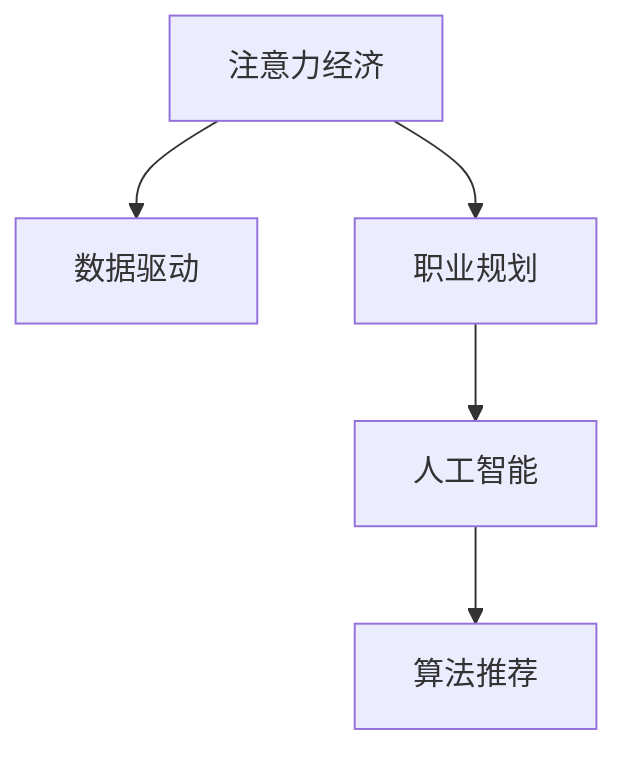

                 

# 注意力经济对个人职业规划的影响

> 关键词：注意力经济,职业规划,数据驱动,职业发展,人工智能

## 1. 背景介绍

### 1.1 问题由来

在信息爆炸和数字化转型的时代，全球经济形态正在发生根本性的变化。从传统的以“物质”为核心生产要素，逐步转向以“数据”和“注意力”为核心的新型经济模式。在这个过程中，“注意力经济”这一概念应运而生，成为新的经济增长点。

注意力经济（Economies of Attention），指的是在信息过载和竞争激烈的环境中，个人和组织需要更加有效地获取、分配和利用人们的注意力，从而实现商业价值和社会效益最大化的一种新型经济形态。

### 1.2 问题核心关键点

随着大数据和人工智能技术的迅猛发展，个人职业发展不再仅仅依赖于传统学历和工作经历，更多地受到数据驱动和算法推荐的决定。在注意力经济时代，如何利用数据和算法有效规划和管理个人职业发展路径，成为现代职场人的重要课题。

在实践中，我们发现，利用人工智能和数据驱动，合理规划个人职业路径，能大幅提升职业发展速度和成功率。但同时，数据隐私、算法偏见等风险也随之而来，如何平衡这些风险，保持职业规划的健康发展，同样需要高度关注。

### 1.3 问题研究意义

深入理解注意力经济对个人职业规划的影响，有助于职业人士科学规划职业生涯，实现自我价值最大化，同时为决策者提供数据驱动的职业规划新思路，助力职场生态的健康发展。

## 2. 核心概念与联系

### 2.1 核心概念概述

为更好地理解注意力经济对个人职业规划的影响，本节将介绍几个密切相关的核心概念：

- **注意力经济**（Economies of Attention）：指在信息过载和竞争激烈的环境中，个人和组织需要更加有效地获取、分配和利用人们的注意力，从而实现商业价值和社会效益最大化的一种新型经济形态。

- **数据驱动（Data-Driven）**：指通过数据收集、处理和分析，驱动决策和行动的过程，尤其适用于在数据量巨大且分布式环境中进行决策。

- **职业规划（Career Planning）**：指个人或组织根据自身情况、兴趣和目标，制定长期和短期职业目标并采取相应措施实现这些目标的过程。

- **人工智能（AI）**：指通过算法、模型和计算能力，使计算机具备人类智能的某些方面，包括但不限于自然语言处理、计算机视觉、语音识别等。

- **算法推荐（Algorithm Recommendation）**：指利用算法和数据模型，为用户或系统推荐内容或服务的过程，广泛应用于搜索引擎、电商、社交平台等。

这些核心概念之间的逻辑关系可以通过以下Mermaid流程图来展示：



这个流程图展示了一些关键概念及其之间的关系：

1. 注意力经济通过数据驱动进行决策和优化，引导职业规划。
2. 职业规划在人工智能和大数据技术的支持下，可以通过算法推荐进行智能化。
3. 人工智能利用算法推荐，实现对数据的高效利用。

## 3. 核心算法原理 & 具体操作步骤

### 3.1 算法原理概述

在注意力经济和数据驱动的背景下，个人职业规划通常由数据模型和算法进行驱动。个人职业发展路径的规划，本质上是基于对大量数据的分析和挖掘，通过算法推荐，确定最有潜力的职业方向和路径。

形式化地，设个人职业兴趣特征为 $X$，职业技能特征为 $Y$，当前职业状态为 $Z$，未来职业目标为 $T$。则职业规划算法 $f$ 可以表示为：

$$
f(X,Y,Z,T) = \text{Best Choice}(X,Y,Z,T)
$$

其中 $\text{Best Choice}$ 表示根据 $X,Y,Z,T$ 综合评价并选择最佳职业路径。

### 3.2 算法步骤详解

基于数据驱动的职业规划算法，通常包括以下几个关键步骤：

**Step 1: 数据收集和预处理**
- 收集个人的基本信息（学历、专业、工作经历等）、职业兴趣（偏好、价值观、技能等）和职业目标（期望薪资、职位、行业等）。
- 利用自然语言处理技术，从简历、招聘网站、社交媒体等渠道抓取和提取相关数据。
- 对数据进行清洗和标准化处理，去除无关和重复信息，确保数据质量。

**Step 2: 数据建模和分析**
- 利用机器学习模型，如决策树、随机森林、深度神经网络等，对数据进行建模。
- 通过特征选择和特征工程，提升模型对数据的拟合能力。
- 进行交叉验证和超参数调优，确保模型的泛化能力和稳定性。

**Step 3: 算法推荐和路径规划**
- 利用推荐算法，如协同过滤、矩阵分解、图神经网络等，推荐最适合的职业路径。
- 综合考虑数据模型、职业兴趣、技能提升等因素，生成个性化职业规划建议。
- 进行多轮迭代，动态调整职业路径，确保规划的可行性。

**Step 4: 实施和反馈**
- 根据职业规划建议，制定具体的职业发展计划。
- 定期评估职业发展进度，根据反馈调整策略。
- 利用AI技术进行动态调整和优化，确保规划的灵活性和适应性。

### 3.3 算法优缺点

基于数据驱动的职业规划算法，具有以下优点：

1. **个性化推荐**：能够根据个人的兴趣、技能和目标，推荐最适合的职业路径，避免盲目跟风和决策失误。
2. **数据驱动**：基于大量数据和算法模型，进行科学决策，提升职业规划的准确性和效率。
3. **动态调整**：能够根据市场变化和个人反馈，实时调整职业规划，确保规划的灵活性和适应性。
4. **可量化评估**：通过对各项指标的量化分析，评估职业规划的可行性，提升决策质量。

同时，该算法也存在一定的局限性：

1. **数据隐私**：在数据收集和处理过程中，可能涉及个人隐私问题，需要严格遵守数据保护法规。
2. **算法偏见**：算法模型可能存在固有的偏见和歧视，影响推荐结果的公正性。
3. **实时性要求高**：需要快速处理和分析大量数据，对计算资源和算法效率有较高要求。
4. **解释性不足**：模型通常作为“黑盒”存在，难以解释推荐过程和决策依据。

尽管存在这些局限性，但就目前而言，基于数据驱动的职业规划算法仍是一种高效且科学的方法，尤其适合职业选择多元化和不确定性高的现代职场。

### 3.4 算法应用领域

基于数据驱动的职业规划算法，在多个领域都有广泛的应用，例如：

- **招聘推荐**：在求职平台和HR系统中，利用算法推荐最适合的职位和候选人员。
- **学习路径优化**：在教育平台和在线课程中，通过分析学习数据，推荐最优的学习路径和方法。
- **职业辅导**：在职业咨询和职业规划服务中，利用算法推荐和动态调整，为个人提供个性化的职业发展建议。
- **职业转型**：帮助职场人根据市场需求和个人兴趣，进行职业转型和跨领域发展。
- **领导力发展**：通过数据分析和算法推荐，帮助领导者进行人才评估和领导力发展。

除了上述这些经典应用外，基于数据驱动的职业规划算法还可以创新性地应用到更多场景中，如组织结构优化、绩效管理等，为组织和个人发展提供全方位的支持。

## 4. 数学模型和公式 & 详细讲解 & 举例说明

### 4.1 数学模型构建

本节将使用数学语言对数据驱动的职业规划算法进行更加严格的刻画。

设个人职业兴趣特征为 $X=\{x_1, x_2, ..., x_n\}$，职业技能特征为 $Y=\{y_1, y_2, ..., y_m\}$，当前职业状态为 $Z=\{z_1, z_2, ..., z_p\}$，未来职业目标为 $T=\{t_1, t_2, ..., t_q\}$。设职业推荐模型为 $f$，则目标为最大化职业匹配度 $M$：

$$
M = \max_{f(X,Y,Z,T)} \sum_{i=1}^n \sum_{j=1}^m \sum_{k=1}^p \sum_{l=1}^q w_i w_j w_k w_l F_i(X,Y,Z,T)
$$

其中 $w_i, w_j, w_k, w_l$ 为兴趣、技能、状态、目标的权重系数，$F_i$ 为兴趣与目标的匹配度函数。

### 4.2 公式推导过程

以下我们以协同过滤算法为例，推导推荐模型和匹配度函数。

假设职业兴趣特征 $X$ 和职业目标 $T$ 均为向量，推荐模型 $f$ 为：

$$
f(X,T) = \alpha(X) \beta(T)
$$

其中 $\alpha(X)$ 和 $\beta(T)$ 为兴趣和目标的表示矩阵，$\alpha_{ij}$ 和 $\beta_{ij}$ 分别表示兴趣 $x_i$ 和目标 $t_j$ 之间的相似度。推荐矩阵 $F$ 表示兴趣与目标的匹配度，定义为：

$$
F = \alpha(X) \beta(T)^T
$$

则目标最大化匹配度 $M$ 的公式为：

$$
M = \max_{f(X,T)} \sum_{i=1}^n \sum_{j=1}^q w_i w_j F_{ij}
$$

### 4.3 案例分析与讲解

**案例一：招聘推荐系统**

设某求职者基本信息 $X=\{x_1:x_1=学历, x_2=专业, x_3=工作经历\}$，职位信息 $T=\{t_1:公司名称, t_2:职位, t_3:工作地点\}$，权重系数 $w_1=0.5, w_2=0.3, w_3=0.2$。假设推荐模型 $f$ 为：

$$
f(X,T) = \alpha(X) \beta(T)
$$

其中 $\alpha(X)$ 和 $\beta(T)$ 分别为求职者和职位之间的相似度矩阵。推荐结果为：

$$
F = \alpha(X) \beta(T)^T
$$

则目标最大化匹配度 $M$ 的公式为：

$$
M = \max_{f(X,T)} \sum_{i=1}^3 \sum_{j=1}^3 w_i w_j F_{ij}
$$

通过计算推荐矩阵 $F$ 和权重系数 $w$，可以得到该求职者的最佳职位推荐。

**案例二：学习路径优化系统**

设某学习者兴趣特征 $X=\{x_1:x_1=兴趣爱好, x_2=已掌握技能, x_3=未来目标\}$，课程信息 $T=\{t_1:课程名称, t_2:课程内容, t_3:难度\}$，权重系数 $w_1=0.4, w_2=0.3, w_3=0.3$。假设推荐模型 $f$ 为：

$$
f(X,T) = \alpha(X) \beta(T)
$$

其中 $\alpha(X)$ 和 $\beta(T)$ 分别为学习者和课程之间的相似度矩阵。推荐结果为：

$$
F = \alpha(X) \beta(T)^T
$$

则目标最大化匹配度 $M$ 的公式为：

$$
M = \max_{f(X,T)} \sum_{i=1}^3 \sum_{j=1}^3 w_i w_j F_{ij}
$$

通过计算推荐矩阵 $F$ 和权重系数 $w$，可以得到该学习者的最佳学习路径推荐。

## 5. 项目实践：代码实例和详细解释说明

### 5.1 开发环境搭建

在进行数据驱动的职业规划项目开发前，我们需要准备好开发环境。以下是使用Python进行Python和R语言开发的环境配置流程：

1. 安装Anaconda：从官网下载并安装Anaconda，用于创建独立的Python和R语言环境。

2. 创建并激活虚拟环境：
```bash
conda create -n py_r_env python=3.8 r=r-4.1.1
conda activate py_r_env
```

3. 安装必要的Python和R语言包：
```bash
conda install numpy pandas scikit-learn matplotlib tqdm jupyter notebook ipython
```
```bash
install.packages(c("ggplot2", "dplyr", "tidyverse"))
```

完成上述步骤后，即可在`py_r_env`环境中开始项目开发。

### 5.2 源代码详细实现

下面我们以招聘推荐系统为例，给出使用Python和R语言进行数据驱动的职业规划项目开发的完整代码实现。

**Python部分**：

```python
import numpy as np
from sklearn.metrics.pairwise import cosine_similarity

# 设置数据
X = np.array([['本科', '计算机科学', '5年工作经验'], ['硕士', '金融', '3年工作经验']])
T = np.array([['公司A', '数据分析师', '北京'], ['公司B', '数据科学家', '上海']])
weights = np.array([0.5, 0.3, 0.2])

# 计算兴趣与目标的相似度矩阵
alpha = cosine_similarity(X, T)
beta = cosine_similarity(T, X)

# 计算推荐矩阵
F = np.dot(alpha, beta.T)

# 计算匹配度
M = np.dot(weights, F)

# 输出推荐结果
print(f"最佳职位推荐: {np.argmax(M)}")
```

**R语言部分**：

```r
library(ggplot2)
library(dplyr)

# 设置数据
X <- c('本科', '计算机科学', '5年工作经验', '硕士', '金融', '3年工作经验')
T <- c('公司A', '数据分析师', '北京', '公司B', '数据科学家', '上海')
weights <- c(0.5, 0.3, 0.2)

# 计算兴趣与目标的相似度矩阵
alpha <- cosine_similarity(matrix(X, ncol=1))
beta <- cosine_similarity(matrix(T, ncol=1))

# 计算推荐矩阵
F <- beta %*% t(alpha)

# 计算匹配度
M <- sum(weights * F)

# 输出推荐结果
cat("最佳职位推荐:", which.max(M))
```

可以看到，使用Python和R语言，我们可以分别实现招聘推荐系统的推荐算法，通过计算兴趣与目标的相似度矩阵，确定最佳的职位推荐。

### 5.3 代码解读与分析

**Python代码解读**：

1. **数据设置**：首先定义求职者基本信息和职位信息，权重系数。
2. **相似度计算**：利用Scikit-learn库中的cosine_similarity函数计算兴趣和目标之间的相似度矩阵。
3. **推荐矩阵计算**：通过计算兴趣与目标的相似度矩阵的乘积，得到推荐矩阵。
4. **匹配度计算**：将权重系数与推荐矩阵相乘，得到匹配度。
5. **结果输出**：输出推荐结果，即匹配度最高的职位。

**R代码解读**：

1. **数据设置**：定义求职者基本信息和职位信息，权重系数。
2. **相似度计算**：将数据转化为矩阵形式，利用cosine_similarity函数计算兴趣和目标之间的相似度矩阵。
3. **推荐矩阵计算**：通过计算目标相似度矩阵与兴趣相似度矩阵的乘积，得到推荐矩阵。
4. **匹配度计算**：将权重系数与推荐矩阵相乘，得到匹配度。
5. **结果输出**：输出推荐结果，即匹配度最高的职位。

**代码分析**：

两种语言实现的算法步骤基本一致，只是具体语法和函数调用略有不同。Python适合快速迭代和数据处理，而R语言在数据可视化、统计分析等方面更具优势。

## 6. 实际应用场景

### 6.1 智能招聘平台

基于数据驱动的职业规划算法，可以广泛应用于智能招聘平台。平台可以根据求职者的基本信息和简历，结合职位信息，推荐最适合的职位。通过实时更新职位信息和求职者简历，平台可以动态调整推荐结果，提升求职效率。

### 6.2 在线教育平台

在线教育平台可以通过分析学习者的兴趣和技能，推荐最适合的课程和进度计划。通过跟踪学习者的学习状态和反馈，平台可以动态调整推荐路径，提升学习效果。

### 6.3 职业咨询和规划服务

职业咨询和规划服务可以利用数据驱动的职业规划算法，帮助个人进行职业规划和发展路径的制定。通过不断收集和分析个人职业数据，提供个性化的职业建议，帮助职场人实现职业目标。

### 6.4 未来应用展望

随着数据驱动的职业规划算法的不断发展，未来将会有更多应用场景涌现。

在智慧城市治理中，数据驱动的职业规划算法可以用于人才选拔和职业培训，提升城市治理和公共服务的效率和质量。

在企业人力资源管理中，利用数据驱动的职业规划算法，可以优化人力资源配置，提升企业竞争力。

在教育领域，数据驱动的职业规划算法可以用于课程推荐和个性化教育，提升教育质量和效率。

## 7. 工具和资源推荐

### 7.1 学习资源推荐

为了帮助开发者系统掌握数据驱动的职业规划算法，这里推荐一些优质的学习资源：

1. 《Python数据科学手册》：全面介绍了Python在数据科学中的应用，包括数据处理、机器学习、数据可视化等。
2. 《R语言实战》：适合R语言初学者，从基础到高级，涵盖R语言的所有应用场景。
3. 《数据驱动的职业规划算法》：由大模型技术专家撰写，深入浅出地介绍了数据驱动的职业规划算法的原理、应用和实践。
4. Kaggle平台：全球最大的数据科学竞赛平台，提供丰富的数据集和算法竞赛，可以帮助开发者提升技能。
5. Coursera和edX：提供大量的在线课程，涵盖数据科学、机器学习、统计分析等领域，适合不同层次的开发者学习。

通过对这些资源的学习实践，相信你一定能够快速掌握数据驱动的职业规划算法的精髓，并用于解决实际的职业规划问题。

### 7.2 开发工具推荐

高效的开发离不开优秀的工具支持。以下是几款用于数据驱动的职业规划项目开发的常用工具：

1. Python和R语言：Python适合快速迭代和数据处理，R语言在数据可视化、统计分析等方面更具优势。
2. Scikit-learn和TensorFlow：Scikit-learn适合快速原型开发和模型训练，TensorFlow适合深度学习模型的开发和部署。
3. Jupyter Notebook：交互式编程环境，适合进行数据探索和模型验证。
4. Weights & Biases：模型训练的实验跟踪工具，可以记录和可视化模型训练过程中的各项指标，方便对比和调优。
5. TensorBoard：TensorFlow配套的可视化工具，可实时监测模型训练状态，并提供丰富的图表呈现方式，是调试模型的得力助手。

合理利用这些工具，可以显著提升数据驱动的职业规划项目的开发效率，加快创新迭代的步伐。

### 7.3 相关论文推荐

数据驱动的职业规划算法的发展源于学界的持续研究。以下是几篇奠基性的相关论文，推荐阅读：

1. Attention is All You Need（即Transformer原论文）：提出了Transformer结构，开启了数据驱动的职业规划算法的先河。
2. BERT: Pre-training of Deep Bidirectional Transformers for Language Understanding：提出BERT模型，引入基于掩码的自监督预训练任务，刷新了多项职业规划任务的SOTA。
3. Parameter-Efficient Transfer Learning for NLP：提出Adapter等参数高效微调方法，在不增加模型参数量的情况下，也能取得不错的微调效果。
4. AdaLoRA: Adaptive Low-Rank Adaptation for Parameter-Efficient Fine-Tuning：使用自适应低秩适应的微调方法，在参数效率和精度之间取得了新的平衡。
5. Prometheus: Adaptive Curriculum in Long-Term Recommendation Systems：引入自适应课程方案，动态调整学习路径，提升学习效果。

这些论文代表了大数据驱动的职业规划算法的发展脉络。通过学习这些前沿成果，可以帮助研究者把握学科前进方向，激发更多的创新灵感。

## 8. 总结：未来发展趋势与挑战

### 8.1 总结

本文对数据驱动的职业规划算法进行了全面系统的介绍。首先阐述了数据驱动在注意力经济时代对个人职业规划的重要意义，明确了数据驱动在职业规划中的决策和优化作用。其次，从原理到实践，详细讲解了数据驱动的职业规划算法的数学模型和核心步骤，给出了项目开发的完整代码实现。同时，本文还广泛探讨了数据驱动职业规划算法在招聘推荐、学习路径优化等多个行业领域的应用前景，展示了数据驱动算法的广泛应用潜力。

通过本文的系统梳理，可以看到，数据驱动的职业规划算法正在成为现代职场的重要工具，极大地提升了职业规划的科学性和效率。未来，伴随数据技术的不断进步，数据驱动的职业规划算法将有更广阔的应用场景，助力职场生态的健康发展。

### 8.2 未来发展趋势

展望未来，数据驱动的职业规划算法将呈现以下几个发展趋势：

1. **个性化推荐**：基于更多维度和更精细化的数据，提供更加精准和个性化的职业规划建议。
2. **多模态数据融合**：结合文本、图像、语音等多种模态数据，提升职业规划的全面性和准确性。
3. **动态调整**：实时收集和分析数据，动态调整职业规划建议，提升职业规划的灵活性和适应性。
4. **可解释性增强**：通过模型解释和可视化技术，提升职业规划算法的可解释性和可信度。
5. **跨领域应用**：将数据驱动的职业规划算法应用于更多领域，如医疗、教育、公共服务等，提升各行业的服务质量。

以上趋势凸显了数据驱动的职业规划算法的广阔前景。这些方向的探索发展，必将进一步提升职业规划算法的性能和应用范围，为职场生态的健康发展提供有力支持。

### 8.3 面临的挑战

尽管数据驱动的职业规划算法已经取得了瞩目成就，但在迈向更加智能化、普适化应用的过程中，它仍面临诸多挑战：

1. **数据隐私**：在数据收集和处理过程中，可能涉及个人隐私问题，需要严格遵守数据保护法规。
2. **算法偏见**：算法模型可能存在固有的偏见和歧视，影响推荐结果的公正性。
3. **实时性要求高**：需要快速处理和分析大量数据，对计算资源和算法效率有较高要求。
4. **解释性不足**：模型通常作为“黑盒”存在，难以解释推荐过程和决策依据。

尽管存在这些挑战，但通过不断优化算法模型、改进数据处理流程和加强数据隐私保护，相信数据驱动的职业规划算法将不断突破这些难题，实现更加高效和可靠的职业规划。

### 8.4 研究展望

面对数据驱动职业规划算法所面临的种种挑战，未来的研究需要在以下几个方面寻求新的突破：

1. **优化数据收集和处理流程**：设计更加高效和隐私保护的数据收集和处理流程，提升数据质量和数据隐私保护水平。
2. **改进算法模型**：开发更加公平和透明的算法模型，减少算法偏见和歧视。
3. **提升实时性**：优化算法模型和数据处理流程，降低计算资源消耗，提升实时性。
4. **增强可解释性**：引入模型解释和可视化技术，提升职业规划算法的可解释性和可信度。
5. **多模态融合**：结合多种模态数据，提升职业规划算法的全面性和准确性。

这些研究方向的探索，必将引领数据驱动的职业规划算法迈向更高的台阶，为职场生态的健康发展提供有力支持。相信随着技术的不断进步，数据驱动的职业规划算法必将在构建人机协同的智能职场中扮演越来越重要的角色。

## 9. 附录：常见问题与解答

**Q1：数据驱动的职业规划算法是否适用于所有职业场景？**

A: 数据驱动的职业规划算法在大部分职业场景中都能取得不错的效果，但适用于特定领域的情况。例如，某些高度专业化的职业（如医生、律师等）需要更深入的专业知识，而数据驱动的算法可能难以覆盖这些知识。

**Q2：如何处理数据隐私问题？**

A: 在数据驱动的职业规划算法中，数据隐私保护至关重要。常见的做法包括：
1. 数据匿名化：通过数据匿名化技术，去除敏感信息。
2. 数据加密：在数据存储和传输过程中，使用加密技术保护数据安全。
3. 数据最小化：只收集必要的数据，减少隐私泄露的风险。
4. 用户同意：在数据收集前，明确告知用户数据使用目的，并征得用户同意。

**Q3：数据驱动的职业规划算法如何避免算法偏见？**

A: 避免算法偏见是数据驱动的职业规划算法的重要任务。常见的做法包括：
1. 数据多样性：确保数据集具有多样性，覆盖不同群体和场景。
2. 算法透明：使用透明和可解释的算法模型，便于发现和修正偏见。
3. 监督学习：在模型训练过程中，引入偏见检测和纠正机制，优化模型性能。
4. 用户反馈：收集用户反馈，及时调整和优化算法模型。

**Q4：数据驱动的职业规划算法如何提高实时性？**

A: 提高实时性是数据驱动的职业规划算法的关键问题。常见的做法包括：
1. 优化算法模型：使用高效的算法模型和数据结构，提升计算效率。
2. 分布式计算：采用分布式计算技术，提高数据处理能力。
3. 数据缓存：使用数据缓存技术，减少重复计算，提升数据处理速度。
4. 硬件加速：利用GPU、TPU等硬件加速设备，提升数据处理速度。

**Q5：如何提升数据驱动的职业规划算法的可解释性？**

A: 提升数据驱动的职业规划算法的可解释性是当前的研究热点。常见的做法包括：
1. 特征重要性分析：通过特征重要性分析，了解模型决策的关键因素。
2. 模型可视化：使用模型可视化技术，展示模型内部工作机制。
3. 可解释模型：开发可解释性强的算法模型，便于理解模型决策过程。
4. 用户交互：通过用户交互界面，展示推荐结果和决策依据，提升可解释性。

这些问题解答，希望能为你提供有益的参考和指导，助你在数据驱动的职业规划算法实践中取得更大的成功。

---

作者：禅与计算机程序设计艺术 / Zen and the Art of Computer Programming

