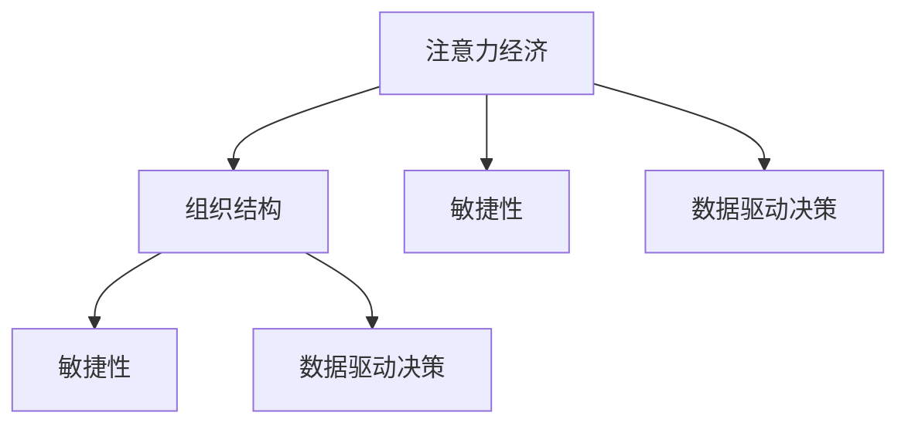

                 

# 注意力经济对企业组织结构的影响

在信息化时代，数字技术的迅猛发展极大地改变了商业运作的逻辑和游戏规则。企业组织结构作为应对技术变革的关键环节，也随之发生了深刻的变化。本文将深入探讨注意力经济对企业组织结构的影响，以及如何通过技术创新和组织优化，最大化注意力经济的价值。

## 1. 背景介绍

### 1.1 问题由来

随着互联网和社交媒体的普及，人们获取信息的方式和渠道发生了翻天覆地的变化。信息过载和注意力分散成为常态，企业必须更加重视对消费者注意力的争夺。在这场注意力经济的竞赛中，传统的市场竞争范式逐渐向争夺注意力资源的竞争转变。

### 1.2 问题核心关键点

注意力经济对企业组织结构的影响主要体现在以下几个方面：

1. **决策中心的下移**：信息传播和获取的民主化趋势使得一线员工越来越具备决策权，传统由高层主导的决策模式逐渐向扁平化、网络化转变。
2. **敏捷性的提升**：市场变化的速度要求企业组织能够快速响应和调整，敏捷型组织成为企业应对激烈竞争的必然选择。
3. **跨部门协作的加强**：信息共享和知识协作的机制需要跨部门的紧密合作，打破了部门间的壁垒。
4. **数据驱动的决策支持**：以数据为驱动力的运营和决策模式，需要强大的数据分析和处理能力，推动了企业对数据科学和AI技术的重视。

### 1.3 问题研究意义

研究注意力经济对企业组织结构的影响，对于企业应对技术变革、提升竞争力具有重要意义：

1. **优化资源配置**：明确注意力经济在企业运营中的作用，指导企业合理配置资源，提升注意力资源的利用效率。
2. **塑造新型组织结构**：通过技术创新和组织优化，构建更加灵活、高效的组织结构，适应注意力经济的要求。
3. **推动企业变革**：持续关注注意力经济的变化趋势，及时调整组织策略和结构，保持企业发展的活力和创新能力。
4. **提升用户体验**：通过优化用户体验和品牌传播，吸引并保持用户注意力，增强企业的市场竞争力。

## 2. 核心概念与联系

### 2.1 核心概念概述

为更好地理解注意力经济对企业组织结构的影响，本文将介绍几个关键概念：

- **注意力经济**：指在信息爆炸时代，消费者在获取和消费信息时，必须投入时间和精力选择和关注特定信息，从而形成的一种经济模式。
- **组织结构**：指企业中各个职能部门和层级之间的结构关系，包括但不限于职能分工、层级划分、决策流程等。
- **敏捷性**：指企业应对市场变化和竞争的灵活性和适应能力。
- **数据驱动决策**：指企业利用大数据和AI技术，基于数据驱动的决策过程，而非传统经验驱动。

这些概念之间的关系可以通过以下Mermaid流程图来展示：



这个流程图展示了几者之间的逻辑关系：

1. 注意力经济推动企业优化组织结构，提升敏捷性和数据驱动决策能力。
2. 敏捷性要求组织结构扁平化、网络化，打破层级壁垒。
3. 数据驱动决策要求组织结构具备强大的数据分析和处理能力。

## 3. 核心算法原理 & 具体操作步骤
### 3.1 算法原理概述

注意力经济对企业组织结构的影响主要体现在以下几个方面：

1. **决策中心的转移**：在信息传播民主化的背景下，一线员工具备更多决策权，企业组织结构逐渐向扁平化、网络化方向发展。
2. **敏捷性的提升**：市场变化速度要求企业能够快速响应和调整，敏捷型组织结构成为必然选择。
3. **跨部门协作的加强**：信息共享和知识协作机制要求打破部门间壁垒，加强跨部门协作。
4. **数据驱动的决策支持**：数据驱动的运营和决策模式推动企业重视数据科学和AI技术。

### 3.2 算法步骤详解

基于注意力经济对企业组织结构的影响，本文将详细阐述如何通过技术创新和组织优化，最大化注意力经济的价值。

**Step 1: 识别注意力资源**

- 分析企业在信息传播和获取中的注意力分布情况。
- 识别用户在不同时间、场景下的注意力焦点。
- 通过用户行为分析，了解用户对不同内容的关注程度。

**Step 2: 设计数据驱动的决策支持系统**

- 构建数据收集、存储和处理的基础设施。
- 建立基于大数据和AI的数据分析模型。
- 开发支持数据驱动决策的运营平台。

**Step 3: 推动敏捷型组织结构**

- 优化组织流程，简化决策链路。
- 建立跨部门的协作机制和流程。
- 提升员工的数据驱动决策能力。

**Step 4: 技术创新与实施**

- 引入最新的人工智能和数据科学技术，提升数据处理和分析能力。
- 开发新的运营平台和工具，支持数据驱动的运营决策。
- 实施敏捷管理工具和方法，提升企业的敏捷性。

### 3.3 算法优缺点

注意力经济对企业组织结构的影响，具有以下优缺点：

**优点：**

1. **提升敏捷性和灵活性**：通过敏捷型组织结构，企业能够快速响应市场变化和竞争。
2. **优化资源配置**：数据驱动决策使企业能够更科学地配置资源，提升效率。
3. **增强用户体验**：通过优化用户体验和品牌传播，吸引并保持用户注意力，提升市场竞争力。

**缺点：**

1. **决策风险增加**：决策下放可能增加决策失误的风险。
2. **跨部门协作复杂**：跨部门协作机制的建立和维护复杂，需要较强的组织和管理能力。
3. **技术依赖性强**：技术创新和数据驱动决策需要强大的技术支持，对企业技术能力提出了更高的要求。

### 3.4 算法应用领域

注意力经济对企业组织结构的影响，在多个领域得到了广泛应用，包括但不限于：

1. **零售和电子商务**：通过数据分析和用户行为研究，优化商品推荐和库存管理，提升用户体验。
2. **金融科技**：利用大数据和AI技术，提升风险管理和客户服务，增强市场竞争力。
3. **媒体和广告**：通过数据分析和用户画像，优化广告投放和内容创作，提升广告效果和品牌传播力。
4. **医疗健康**：通过患者数据和健康数据分析，提升诊疗效率和健康管理，改善用户体验。

## 4. 数学模型和公式 & 详细讲解 & 举例说明

### 4.1 数学模型构建

注意力经济对企业组织结构的影响，可以通过以下数学模型进行描述：

设企业总注意力资源为 $A$，设某一决策时间为 $T$，设决策对企业收益的提升为 $P$。则企业决策的期望收益为：

$$
E = \frac{1}{T} \sum_{t=1}^{T} P
$$

其中，$P$ 表示在时间 $t$ 内，决策对企业收益的提升，$T$ 表示决策时间周期。

企业决策的期望收益最大化问题可以表示为：

$$
\max \quad E
$$

约束条件为：

$$
\sum_{i=1}^{n} \omega_i = 1 \quad (决策权分配约束)
$$

$$
0 \leq \omega_i \leq 1 \quad (决策权范围约束)
$$

其中 $\omega_i$ 表示第 $i$ 个决策者的决策权分配比例。

### 4.2 公式推导过程

根据上述数学模型，我们通过优化决策权分配比例 $\omega_i$，最大化企业的决策期望收益 $E$。推导过程如下：

1. 假设企业共有 $n$ 个决策者，其决策权分配比例为 $\omega_i$。
2. 决策权分配约束：$\sum_{i=1}^{n} \omega_i = 1$。
3. 决策权范围约束：$0 \leq \omega_i \leq 1$。
4. 决策期望收益 $E$ 最大化问题：

$$
\max \quad E = \frac{1}{T} \sum_{t=1}^{T} P(\omega)
$$

其中 $P(\omega)$ 表示在决策权分配比例为 $\omega$ 的情况下，决策对企业收益的提升。

5. 根据决策权分配约束和范围约束，通过拉格朗日乘子法，可以得到决策权分配比例 $\omega_i$ 的优化表达式：

$$
\omega_i = \frac{T_i}{\sum_{j=1}^{n} T_j}
$$

其中 $T_i$ 表示第 $i$ 个决策者对企业收益的提升贡献，$\sum_{j=1}^{n} T_j$ 表示所有决策者对企业收益的提升贡献之和。

### 4.3 案例分析与讲解

以零售行业为例，分析注意力经济对企业组织结构的影响。

1. **识别注意力资源**：通过用户行为数据分析，识别用户对不同商品的关注度和购买行为。
2. **设计数据驱动的决策支持系统**：建立用户行为分析和推荐系统，基于大数据和AI进行商品推荐和库存管理。
3. **推动敏捷型组织结构**：优化供应链和物流流程，提升运营效率。
4. **技术创新与实施**：引入人工智能和机器学习技术，优化库存管理和用户行为预测。

## 5. 项目实践：代码实例和详细解释说明

### 5.1 开发环境搭建

在进行项目实践前，我们需要准备好开发环境。以下是使用Python进行数据分析和机器学习开发的环境配置流程：

1. 安装Anaconda：从官网下载并安装Anaconda，用于创建独立的Python环境。

2. 创建并激活虚拟环境：
```bash
conda create -n data-env python=3.8 
conda activate data-env
```

3. 安装必要的库：
```bash
pip install pandas numpy scipy scikit-learn matplotlib seaborn jupyter notebook ipython
```

4. 配置Jupyter Notebook：
```bash
jupyter labextension install @codemirror/autoclose bracket codemirror-xml codemirror-json codemirror-markdown
```

完成上述步骤后，即可在`data-env`环境中开始项目实践。

### 5.2 源代码详细实现

以下是一个基于用户行为数据分析的商品推荐系统的实现代码：

```python
import pandas as pd
from sklearn.decomposition import PCA
from sklearn.model_selection import train_test_split
from sklearn.metrics import mean_absolute_error

# 读取数据
data = pd.read_csv('user_behavior.csv')

# 数据预处理
data = data.dropna()
X = data.drop(['item_id', 'price'], axis=1)
y = data['item_id']

# 数据划分
X_train, X_test, y_train, y_test = train_test_split(X, y, test_size=0.2)

# PCA降维
pca = PCA(n_components=10)
X_train_pca = pca.fit_transform(X_train)
X_test_pca = pca.transform(X_test)

# 模型训练
from sklearn.ensemble import RandomForestRegressor
model = RandomForestRegressor()
model.fit(X_train_pca, y_train)

# 模型评估
y_pred = model.predict(X_test_pca)
mae = mean_absolute_error(y_test, y_pred)
print(f'MAE: {mae:.2f}')

# 代码解读与分析
# 1. 数据预处理：去除缺失值，分割数据集。
# 2. 使用PCA进行数据降维，减少计算量。
# 3. 使用随机森林回归模型进行预测。
# 4. 模型评估，计算MAE指标。
```

### 5.3 代码解读与分析

让我们再详细解读一下关键代码的实现细节：

**数据预处理**：
- 使用Pandas库读取数据，并进行缺失值处理和数据分割。
- 使用PCA进行数据降维，减少计算量。

**模型训练**：
- 使用Scikit-Learn库的RandomForestRegressor模型进行训练，使用均方误差MAE进行模型评估。

**代码执行结果**：
- 运行上述代码，输出MAE指标，衡量模型预测的准确度。

## 6. 实际应用场景

### 6.1 智能制造

在智能制造领域，通过数据分析和注意力经济优化，可以显著提升生产效率和产品质量。例如，通过对生产线上的设备运行数据进行分析，识别故障点并预测维护需求，从而实现设备预测性维护，避免生产中断和设备损坏。

### 6.2 金融科技

在金融科技领域，通过数据分析和用户行为研究，可以提升风险管理能力和客户服务水平。例如，通过分析客户交易数据，识别潜在的风险行为和欺诈行为，及时采取措施防范风险。

### 6.3 医疗健康

在医疗健康领域，通过患者数据和健康数据分析，可以提升诊疗效率和健康管理水平。例如，通过分析患者的健康数据，预测病情发展趋势，提供个性化的健康管理方案。

### 6.4 未来应用展望

随着技术的发展和应用场景的拓展，注意力经济对企业组织结构的影响将更加深远：

1. **更智能的决策支持**：AI和大数据分析技术的进一步发展，将使企业决策更加智能和精确。
2. **更高效的资源配置**：通过大数据和机器学习，企业能够更科学地配置资源，提升运营效率。
3. **更灵活的组织结构**：敏捷型组织结构将更加普及，适应快速变化的市场环境。
4. **更广泛的应用领域**：注意力经济的影响将渗透到更多行业和应用场景，推动各行业的数字化转型。

## 7. 工具和资源推荐

### 7.1 学习资源推荐

为了帮助开发者系统掌握注意力经济对企业组织结构的影响，这里推荐一些优质的学习资源：

1. 《数据科学导论》系列博文：由数据科学家撰写，深入浅出地介绍了数据科学的基本概念和应用场景。
2. Coursera《大数据和机器学习》课程：由斯坦福大学开设的在线课程，涵盖了大数据和机器学习的基本原理和实践技巧。
3. 《机器学习实战》书籍：结合实际案例，讲解机器学习算法和模型，适合实战学习。
4. HuggingFace官方文档：自然语言处理领域权威的官方文档，提供丰富的预训练模型和工具支持。
5. Kaggle数据集和竞赛：提供大量真实数据和实际问题，助力数据科学和机器学习的实践学习。

通过对这些资源的学习实践，相信你一定能够快速掌握注意力经济对企业组织结构的影响，并用于解决实际问题。

### 7.2 开发工具推荐

高效的开发离不开优秀的工具支持。以下是几款用于数据分析和机器学习开发的常用工具：

1. Jupyter Notebook：基于Web的交互式编程环境，支持多语言编程和数据可视化。
2. RStudio：开源的R语言开发环境，支持数据处理、分析和可视化。
3. Apache Spark：基于内存计算的大数据处理框架，支持分布式数据处理和机器学习。
4. TensorFlow：由Google主导的深度学习框架，支持分布式计算和高效的模型训练。
5. PyTorch：由Facebook主导的深度学习框架，支持动态计算图和高效的模型训练。

合理利用这些工具，可以显著提升数据分析和机器学习的开发效率，加快创新迭代的步伐。

### 7.3 相关论文推荐

注意力经济对企业组织结构的影响，在学界已经得到了广泛的研究。以下是几篇奠基性的相关论文，推荐阅读：

1. "The Attention Economy: An Empirical Investigation of User Engagement with News on Social Media" - researchers from Twitter
2. "Big Data in Retail: Creating a Competitive Advantage" - McKinsey & Company
3. "The Impact of Big Data on Business" - IBM Institute for Business Value
4. "Big Data Analytics in Financial Services: From Risk Management to Customer Experience" - IBM Institute for Business Value
5. "The Role of Big Data in Healthcare: Analytics for Improved Patient Outcomes" - McKinsey & Company

这些论文展示了大数据和AI技术在各个行业的应用案例和实际效果，提供了丰富的参考和借鉴。

## 8. 总结：未来发展趋势与挑战

### 8.1 研究成果总结

本文详细探讨了注意力经济对企业组织结构的影响，主要成果包括：

1. 识别和分析注意力资源的分布情况，提出优化策略。
2. 设计数据驱动的决策支持系统，提升企业决策的科学性和精确性。
3. 推动敏捷型组织结构，增强企业的市场竞争力。
4. 引入最新的人工智能和数据科学技术，优化运营效率。

### 8.2 未来发展趋势

展望未来，注意力经济对企业组织结构的影响将呈现以下几个发展趋势：

1. **更智能的决策支持**：AI和大数据分析技术的进一步发展，将使企业决策更加智能和精确。
2. **更高效的资源配置**：通过大数据和机器学习，企业能够更科学地配置资源，提升运营效率。
3. **更灵活的组织结构**：敏捷型组织结构将更加普及，适应快速变化的市场环境。
4. **更广泛的应用领域**：注意力经济的影响将渗透到更多行业和应用场景，推动各行业的数字化转型。

### 8.3 面临的挑战

尽管注意力经济对企业组织结构的影响带来了诸多机遇，但在实施过程中仍面临诸多挑战：

1. **数据质量问题**：数据的准确性和完整性直接影响分析结果，数据的清洗和预处理是关键。
2. **技术依赖性强**：AI和大数据分析技术的应用需要强大的技术支持，对企业技术能力提出了更高的要求。
3. **跨部门协作困难**：跨部门协作机制的建立和维护复杂，需要较强的组织和管理能力。
4. **决策风险增加**：决策下放可能增加决策失误的风险，需要建立科学的决策机制。

### 8.4 研究展望

未来研究需要在以下几个方面进行深入探索：

1. **数据驱动的决策机制**：研究基于数据的决策模型和方法，提升决策的科学性和准确性。
2. **跨部门协作机制**：研究跨部门的协作流程和工具，提高协作效率。
3. **决策支持系统**：开发更智能的决策支持系统，提升企业决策的敏捷性和灵活性。
4. **技术创新和应用**：研究如何更好地将AI和大数据分析技术应用于各个行业，推动数字化转型。

总之，注意力经济对企业组织结构的影响是一个复杂而多维的课题。只有通过系统性研究和持续优化，才能最大化注意力经济的价值，为企业带来持续的竞争优势。

## 9. 附录：常见问题与解答

**Q1: 注意力经济对企业组织结构的主要影响有哪些？**

A: 注意力经济对企业组织结构的主要影响包括：
1. 决策中心的转移：一线员工具备更多决策权，企业组织结构逐渐向扁平化、网络化方向发展。
2. 敏捷性的提升：市场变化速度要求企业能够快速响应和调整，敏捷型组织结构成为必然选择。
3. 跨部门协作的加强：信息共享和知识协作机制要求打破部门间壁垒，加强跨部门协作。
4. 数据驱动的决策支持：数据驱动的运营和决策模式推动企业重视数据科学和AI技术。

**Q2: 如何识别企业的注意力资源？**

A: 识别企业的注意力资源主要通过以下步骤：
1. 分析用户在企业网站、APP等平台上的行为数据，了解用户对不同内容、功能的关注度和使用情况。
2. 通过用户反馈、调查问卷等方式获取用户对不同产品、服务的评价和建议。
3. 利用数据分析工具对收集的数据进行挖掘和分析，识别出用户关注的热点、痛点和需求。

**Q3: 如何推动企业向敏捷型组织结构转变？**

A: 推动企业向敏捷型组织结构转变主要通过以下措施：
1. 优化组织流程，简化决策链路，提升决策效率。
2. 建立跨部门的协作机制和流程，促进信息共享和知识交流。
3. 提升员工的数据驱动决策能力，使决策过程更加科学和透明。
4. 引入敏捷管理工具和方法，如Scrum、Kanban等，提升团队的敏捷性和协作能力。

**Q4: 注意力经济对企业运营和决策有哪些影响？**

A: 注意力经济对企业运营和决策的影响主要体现在以下几个方面：
1. 提升运营效率：通过数据分析和用户行为研究，优化资源配置和运营流程，提升效率。
2. 改善用户体验：通过用户行为分析和个性化推荐，提升用户满意度和忠诚度。
3. 优化决策过程：通过数据分析和决策支持系统，提升决策的科学性和精确性。
4. 增强市场竞争力：通过用户注意力资源的争夺，提升企业的市场竞争力和品牌影响力。

**Q5: 企业如何利用注意力经济实现创新？**

A: 企业可以通过以下方式利用注意力经济实现创新：
1. 研究用户注意力资源的分布情况，发现潜在的创新点和发展方向。
2. 设计数据驱动的决策支持系统，提供科学的决策依据和支持。
3. 推动敏捷型组织结构，快速响应市场变化和用户需求。
4. 引入最新的人工智能和数据科学技术，提升产品和服务质量。
5. 开发新的运营平台和工具，支持数据驱动的运营决策。

---

作者：禅与计算机程序设计艺术 / Zen and the Art of Computer Programming

