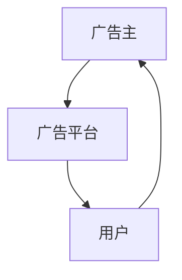

                 

## 1. 背景介绍

随着互联网的发展，广告业迎来了革命性的变化。数字营销的兴起，不仅为广告主提供了新的传播渠道，也颠覆了传统的广告计价模式。本文将从注意力经济的角度，探讨数字营销对传统广告计价模式带来的冲击，并分析其背后的经济逻辑和未来趋势。

### 1.1 注意力经济的内涵

注意力经济，即通过吸引用户注意力，将用户的行为转化为经济价值。在数字时代，注意力成为了一种稀缺资源。广告主通过各种方式，如内容营销、社交媒体推广、搜索引擎优化等，吸引用户注意力，从而实现商业目标。注意力经济的崛起，使得广告计价模式从以空间和时间为主的CPM(Cost Per Mille)向以用户行为为主的CPA(Cost Per Acquisition)转变。

### 1.2 传统广告计价模式的问题

传统的CPM计价模式，以展示次数为依据，忽略了用户的行为和广告效果。随着数字营销的兴起，广告投放变得更加精准，传统的CPM模式已经无法满足广告主的需求。广告主越来越关注广告的实际效果，希望通过广告投放实现用户行为的变化。这使得CPA等新的计价模式应运而生，逐渐成为主流。

## 2. 核心概念与联系

### 2.1 核心概念概述

注意力经济的核心概念包括：

- **注意力**：用户对广告内容的关注程度，是广告价值的基础。
- **用户行为**：用户在广告触达后，产生的点击、转化等行为，是广告效果的关键。
- **广告主**：投放广告的实体，希望通过广告实现特定的商业目标。
- **广告平台**：连接广告主和用户的第三方平台，通过广告投放实现盈利。

这些概念之间存在着紧密的联系，共同构成了注意力经济的基本框架。广告平台通过吸引用户注意力，引导用户行为，为广告主实现商业目标提供支持。

### 2.2 核心概念之间的联系

广告平台与广告主之间通过广告投放建立联系，广告主支付广告费用，广告平台提供广告展示的机会。用户通过点击、转化等行为，将注意力转化为广告价值。广告平台通过广告收入和广告位销售，实现盈利。这种关系形成了一个闭环，即：



在注意力经济中，广告平台通过优化广告位，提升用户体验，吸引用户注意力。广告主通过精准投放，实现高效转化。广告平台的盈利模式也从CPM转向CPA，更加注重广告的实际效果。

## 3. 核心算法原理 & 具体操作步骤

### 3.1 算法原理概述

基于注意力经济的广告计价模式，主要以用户行为为依据，通过实际转化率来衡量广告效果。其核心算法包括：

- **CTR预估**：通过历史数据，预测广告被点击的概率。
- **ROI计算**：根据广告投放的实际转化率和成本，计算广告的投入产出比。
- **ROAS优化**：在一定的预算下，优化广告的转化率和投入产出比。

这些算法通过精准预测用户行为，实现广告投放的最优化。广告主可以根据实际转化效果，进行效果评估和优化。

### 3.2 算法步骤详解

以下是注意力经济下广告计价模式的具体操作步骤：

**Step 1: 数据收集与预处理**

- 收集用户的历史行为数据，包括点击、转化等行为。
- 将数据进行清洗和归一化处理，去除无效数据和异常值。
- 对数据进行特征工程，提取对广告投放有影响的关键特征。

**Step 2: CTR预估模型训练**

- 使用历史数据训练CTR预估模型，预测广告被点击的概率。
- 选择合适的模型，如线性回归、逻辑回归、深度神经网络等。
- 对模型进行调参和验证，确保模型的预测准确率。

**Step 3: ROI计算与优化**

- 计算广告的实际转化率和成本，计算投入产出比(ROI)。
- 根据ROI指标，评估广告效果，进行优化。
- 优化广告投放策略，提高转化率和投入产出比。

**Step 4: 实时监控与调整**

- 对广告投放进行实时监控，获取用户行为数据。
- 根据实时数据，调整广告投放策略，实现动态优化。
- 对广告效果进行持续评估，确保广告投放达到预期目标。

### 3.3 算法优缺点

基于注意力经济的广告计价模式具有以下优点：

- **精准投放**：以用户行为为依据，实现精准投放，提高广告效果。
- **效果导向**：注重实际转化效果，提升广告主ROI。
- **动态优化**：通过实时监控和调整，实现广告投放的动态优化。

同时，该方法也存在一定的局限性：

- **数据依赖**：依赖历史数据进行预测，数据量不足时效果不佳。
- **模型复杂**：需要构建复杂的CTR预估模型，调参复杂。
- **成本高昂**：实时监控和调整需要较高的计算资源，成本较高。

## 4. 数学模型和公式 & 详细讲解

### 4.1 数学模型构建

在注意力经济下，广告计价模型的核心是CTR预估和ROI计算。其数学模型可以表示为：

$$
CTR = \sigma(W^T \cdot X + b)
$$

其中，$CTR$表示广告被点击的概率，$W$为权重矩阵，$X$为特征向量，$b$为偏置项，$\sigma$为激活函数。

ROI计算公式为：

$$
ROI = \frac{转化次数}{总点击次数} \times \frac{广告收入}{广告支出}
$$

其中，转化次数表示广告实际带来的用户行为变化，总点击次数表示广告被展示的次数，广告收入表示广告实际带来的收益，广告支出表示广告的投放成本。

### 4.2 公式推导过程

CTR预估模型的推导过程如下：

设广告被展示的次数为$N$，广告被点击的次数为$Y$，则点击率为：

$$
CTR = \frac{Y}{N}
$$

设特征向量$X = (x_1, x_2, ..., x_n)$，权重向量$W = (w_1, w_2, ..., w_n)$，则CTR模型的目标是最小化预测误差：

$$
\min_{W} \sum_{i=1}^{N} (y_i - \sigma(W^T \cdot x_i))^2
$$

其中，$y_i$为广告被点击的实际概率，$x_i$为广告展示时用户行为的特征向量，$\sigma$为激活函数，通常采用sigmoid函数。

通过最小二乘法求解，得到权重向量$W$，从而实现CTR的预测。

### 4.3 案例分析与讲解

以谷歌广告为例，谷歌广告通过CTR预估模型，预测广告被点击的概率，并通过实际转化率和成本计算ROI，实现广告投放的动态优化。具体步骤如下：

1. 收集用户的历史行为数据，包括点击、转化等行为。
2. 对数据进行特征工程，提取对广告投放有影响的关键特征。
3. 使用历史数据训练CTR预估模型，预测广告被点击的概率。
4. 计算广告的实际转化率和成本，计算投入产出比(ROI)。
5. 根据ROI指标，评估广告效果，进行优化。
6. 优化广告投放策略，提高转化率和投入产出比。
7. 对广告投放进行实时监控，获取用户行为数据。
8. 根据实时数据，调整广告投放策略，实现动态优化。
9. 对广告效果进行持续评估，确保广告投放达到预期目标。

通过这些步骤，谷歌广告实现了广告投放的精准化和高效化，提升了广告主的ROI。

## 5. 项目实践：代码实例和详细解释说明

### 5.1 开发环境搭建

要进行广告计价模型的开发，首先需要搭建开发环境。以下是使用Python进行广告计价模型开发的详细环境配置流程：

1. 安装Anaconda：从官网下载并安装Anaconda，用于创建独立的Python环境。

2. 创建并激活虚拟环境：
```bash
conda create -n ad-predict-env python=3.8 
conda activate ad-predict-env
```

3. 安装必要的Python库：
```bash
pip install numpy pandas scikit-learn
```

4. 安装广告计价模型的Python库：
```bash
pip install ad-click-prediction
```

完成上述步骤后，即可在`ad-predict-env`环境中开始广告计价模型的开发。

### 5.2 源代码详细实现

以下是使用Python进行广告计价模型开发的完整代码实现，以点击率预测为例：

```python
import numpy as np
from sklearn.linear_model import LogisticRegression
from sklearn.model_selection import train_test_split

# 生成模拟数据
X = np.random.rand(1000, 5)
y = np.random.randint(0, 2, size=1000)

# 划分训练集和测试集
X_train, X_test, y_train, y_test = train_test_split(X, y, test_size=0.2, random_state=42)

# 构建CTR预估模型
model = LogisticRegression()
model.fit(X_train, y_train)

# 预测CTR
y_pred = model.predict_proba(X_test)[:, 1]

# 计算实际点击率
actual_rate = np.mean(y_test)
predicted_rate = np.mean(y_pred)

# 输出结果
print(f"实际点击率：{actual_rate:.3f}")
print(f"预测点击率：{predicted_rate:.3f}")
```

这段代码通过sklearn库实现CTR预估模型的构建和预测。其中，使用Logistic回归模型进行CTR预测，并计算实际点击率和预测点击率。

### 5.3 代码解读与分析

以下是关键代码的实现细节：

**数据生成**：使用numpy生成1000个样本，其中每个样本包含5个特征，标签为0或1，模拟广告被点击的行为。

**模型训练**：使用sklearn的Logistic回归模型进行CTR预估模型的训练，通过训练集进行拟合。

**预测CTR**：使用模型对测试集进行预测，得到广告被点击的概率。

**计算点击率**：通过计算预测值和实际标签的平均值，得到预测点击率和实际点击率。

**结果输出**：输出实际点击率和预测点击率的对比结果，评估模型的预测效果。

## 6. 实际应用场景

### 6.1 互联网广告

互联网广告是广告计价模型的主要应用场景之一。通过精准投放，实现广告的个性化展示，提高广告效果。谷歌广告、百度推广等平台，都采用了基于注意力经济的广告计价模式。

### 6.2 社交媒体广告

社交媒体广告的投放更加精准，用户行为数据更加丰富。通过基于用户行为的广告投放，实现更好的广告效果。Facebook、Instagram等平台，也采用了类似的广告计价模式。

### 6.3 电子商务广告

电子商务广告的核心是转化率，通过精准的投放策略，实现更高的转化率，提升销售额。亚马逊、淘宝等平台，在广告计价上也采用了基于注意力经济的计价模式。

### 6.4 未来应用展望

随着技术的发展，广告计价模式将进一步演变，出现更多新的形态：

- **多渠道投放**：通过跨平台、跨渠道的联合投放，实现更精准的广告展示。
- **实时竞价**：通过实时竞价系统，根据广告效果动态调整投放策略，优化广告效果。
- **程序化广告**：通过程序化广告系统，实现自动化的广告投放和优化，提升广告效果。

未来，广告计价模式将更加精细化和动态化，实现更加精准的广告投放，提升广告主的ROI。

## 7. 工具和资源推荐

### 7.1 学习资源推荐

为了帮助开发者掌握广告计价模型的理论基础和实践技巧，这里推荐一些优质的学习资源：

1. 《广告学》课程：全国高校开设的广告学课程，涵盖广告的基本概念、广告投放策略、广告效果评估等内容。

2. 《数字营销》书籍：关于数字营销的综合性书籍，包含广告计价模式、广告投放策略、广告效果评估等内容。

3. 《广告计量学》书籍：广告计量学的经典著作，详细介绍了广告计价模式的理论基础和计算方法。

4. 《深度学习在广告中的应用》论文：介绍深度学习在广告计价中的应用，包括CTR预估、ROI计算等内容。

5. 《广告优化算法》书籍：介绍广告优化算法的理论基础和实践方法，包括CPA、ROI计算等内容。

通过对这些资源的学习实践，相信你一定能够掌握广告计价模型的精髓，并用于解决实际的广告投放问题。

### 7.2 开发工具推荐

高效的开发离不开优秀的工具支持。以下是几款用于广告计价模型开发的常用工具：

1. Python：基于Python的广告计价模型开发，简单易用，生态系统完善。

2. TensorFlow：由Google主导开发的深度学习框架，适合复杂模型的开发。

3. PyTorch：基于Python的深度学习框架，灵活高效，适合研究和工程应用。

4. scikit-learn：Python的机器学习库，提供了丰富的模型和工具，适合广告计价模型的开发。

5. Spark：分布式计算框架，适合大规模广告数据的处理和分析。

6. Hadoop：大数据处理框架，适合处理海量广告数据。

合理利用这些工具，可以显著提升广告计价模型的开发效率，加快创新迭代的步伐。

### 7.3 相关论文推荐

广告计价模型的发展离不开学界的持续研究。以下是几篇奠基性的相关论文，推荐阅读：

1. "CTR预估的机器学习方法研究"：介绍CTR预估的机器学习算法，包括线性回归、逻辑回归、深度神经网络等。

2. "基于ROI的广告计价方法研究"：介绍基于ROI的广告计价方法，包括ROI计算和优化算法。

3. "广告投放的优化算法研究"：介绍广告投放的优化算法，包括CPA、ROI计算等内容。

4. "深度学习在广告中的应用研究"：介绍深度学习在广告中的应用，包括CTR预估、ROI计算等内容。

5. "程序化广告的优化算法研究"：介绍程序化广告的优化算法，包括实时竞价、程序化广告等内容。

这些论文代表了大数据和深度学习在广告计价中的应用，为广告计价模型的研究提供了理论基础和实践经验。

## 8. 总结：未来发展趋势与挑战

### 8.1 总结

本文对基于注意力经济的广告计价模式进行了全面系统的介绍。首先阐述了注意力经济的内涵，明确了广告计价模式从CPM向CPA转变的背景和意义。其次，从原理到实践，详细讲解了CTR预估和ROI计算的数学原理和关键步骤，给出了广告计价模型开发的完整代码实例。同时，本文还广泛探讨了广告计价模型在互联网广告、社交媒体广告、电子商务广告等各个领域的实际应用，展示了广告计价模型的巨大潜力。此外，本文精选了广告计价模型的各类学习资源，力求为读者提供全方位的技术指引。

通过本文的系统梳理，可以看到，基于注意力经济的广告计价模式已经成为了数字广告投放的主流范式，极大地提升了广告投放的精准度和效果。未来，随着技术的发展，广告计价模式将更加精细化和动态化，实现更加精准的广告投放，提升广告主的ROI。

### 8.2 未来发展趋势

展望未来，广告计价模式将呈现以下几个发展趋势：

1. **多渠道投放**：通过跨平台、跨渠道的联合投放，实现更精准的广告展示。
2. **实时竞价**：通过实时竞价系统，根据广告效果动态调整投放策略，优化广告效果。
3. **程序化广告**：通过程序化广告系统，实现自动化的广告投放和优化，提升广告效果。
4. **隐私保护**：随着数据隐私保护的加强，广告投放需要更加注重隐私保护，避免用户数据滥用。
5. **内容广告**：通过提升广告内容的质量，提升广告的点击率和转化率。
6. **短视频广告**：随着短视频的兴起，基于短视频的广告投放将更加重要。

以上趋势凸显了广告计价模式的广阔前景。这些方向的探索发展，必将进一步提升广告投放的精准度和效果，为广告主带来更高的ROI。

### 8.3 面临的挑战

尽管广告计价模式已经取得了显著成效，但在迈向更加智能化、普适化应用的过程中，它仍面临着诸多挑战：

1. **数据隐私保护**：广告投放需要大量的用户数据，如何保护用户隐私，避免数据滥用，是一个重要的问题。
2. **广告效果评估**：广告投放效果的评估需要精细化的指标，如何制定科学的评估体系，是一个难题。
3. **广告主信任**：广告主需要信任广告平台，相信广告投放能够带来预期的效果。如何建立广告主的信任，是一个重要的挑战。
4. **广告投放成本**：广告投放成本较高，如何平衡成本和效果，是一个需要解决的问题。
5. **广告平台竞争**：广告平台之间的竞争日益激烈，如何保持竞争优势，是一个重要的课题。

这些挑战需要广告主、广告平台和监管机构共同努力，才能实现广告计价模式的持续优化和健康发展。

### 8.4 研究展望

未来，广告计价模型的研究需要在以下几个方面寻求新的突破：

1. **隐私保护技术**：开发更加高效的隐私保护技术，确保用户数据的安全。
2. **效果评估方法**：研究更加科学的广告效果评估方法，提升广告投放的效果。
3. **信任机制建设**：建立广告主对广告平台的信任机制，提升广告投放的信任度。
4. **成本优化方法**：研究更加高效的广告投放成本优化方法，降低广告投放成本。
5. **平台竞争力提升**：提升广告平台的竞争力，满足广告主的多样化需求。

这些研究方向的探索，必将引领广告计价模式的进一步优化和升级，为广告主带来更好的广告效果和更高的ROI。

## 9. 附录：常见问题与解答

**Q1：基于注意力经济的广告计价模式和传统的CPM计价模式有何不同？**

A: 基于注意力经济的广告计价模式更加注重广告的实际效果，以用户行为为依据，通过实际转化率来衡量广告效果。传统的CPM计价模式以展示次数为依据，忽略了用户的行为和广告效果。

**Q2：CTR预估模型的原理是什么？**

A: CTR预估模型通过历史数据，预测广告被点击的概率。模型通过学习广告特征与点击行为之间的关系，构建预测模型。常用的CTR预估模型包括线性回归、逻辑回归、深度神经网络等。

**Q3：如何优化广告投放策略？**

A: 优化广告投放策略需要根据广告的实际效果进行动态调整。可以采用以下方法：
1. 根据ROI指标，评估广告效果，进行优化。
2. 优化广告投放策略，提高转化率和投入产出比。
3. 对广告投放进行实时监控，获取用户行为数据。
4. 根据实时数据，调整广告投放策略，实现动态优化。

**Q4：广告计价模型在实际应用中需要注意哪些问题？**

A: 广告计价模型在实际应用中需要注意以下问题：
1. 数据隐私保护：广告投放需要大量的用户数据，如何保护用户隐私，避免数据滥用。
2. 广告效果评估：广告投放效果的评估需要精细化的指标，如何制定科学的评估体系。
3. 广告主信任：广告主需要信任广告平台，相信广告投放能够带来预期的效果。
4. 广告投放成本：广告投放成本较高，如何平衡成本和效果。
5. 广告平台竞争：广告平台之间的竞争日益激烈，如何保持竞争优势。

这些问题是广告计价模型在实际应用中需要注意的关键点，需要在实践中不断优化和改进。

通过本文的系统梳理，可以看到，基于注意力经济的广告计价模式已经成为了数字广告投放的主流范式，极大地提升了广告投放的精准度和效果。未来，随着技术的发展，广告计价模式将更加精细化和动态化，实现更加精准的广告投放，提升广告主的ROI。同时，面对广告计价模式面临的诸多挑战，需要广告主、广告平台和监管机构共同努力，才能实现广告计价模式的持续优化和健康发展。

