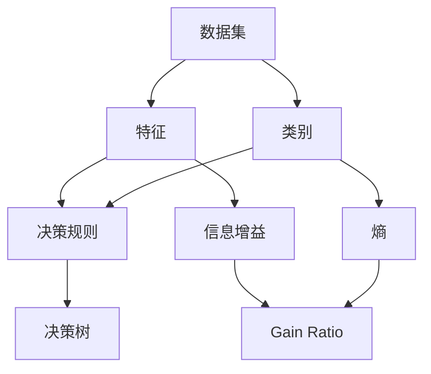

                 

## 1. 背景介绍

决策树是一种常用的机器学习算法，被广泛应用于分类和回归任务。它通过构建一棵树形结构来表示决策规则，每个内部节点表示一个特征的测试，每个分支表示测试的结果，每个叶子节点表示一个类别或一个值。决策树的优点是它易于理解和解释，并且可以处理多种类型的特征。然而，决策树也有其缺点，例如易于过拟合和不适合处理线性可分的数据。

## 2. 核心概念与联系

决策树的核心概念包括特征、类别、决策规则、信息增益、熵、Gain Ratio等。这些概念是构建决策树的基础，也是理解决策树算法的关键。下面是这些概念的 Mermaid 流程图表示：



## 3. 核心算法原理 & 具体操作步骤

### 3.1 算法原理概述

决策树算法的原理是通过构建一棵树形结构来表示决策规则。算法从根节点开始，选择一个最优特征来进行测试，将数据集分成几个子集，每个子集对应一个分支。然后，对每个子集递归地构建决策树，直到所有数据都被分类或达到最大深度。

### 3.2 算法步骤详解

1. 选择最优特征：计算每个特征的信息增益或Gain Ratio，选择信息增益最大或Gain Ratio最大的特征作为最优特征。
2. 创建决策节点：使用最优特征创建一个决策节点，并将数据集分成几个子集。
3. 递归构建决策树：对每个子集递归地构建决策树，直到所有数据都被分类或达到最大深度。
4. 创建叶子节点：如果所有数据都属于同一类别，则创建一个叶子节点，并标记该类别；否则，创建一个叶子节点，并标记该节点为未分类。
5. 返回决策树：返回构建好的决策树。

### 3.3 算法优缺点

优点：

* 易于理解和解释
* 可以处理多种类型的特征
* 可以处理高维数据
* 可以处理缺失值

缺点：

* 易于过拟合
* 不适合处理线性可分的数据
* 不适合处理数值型数据

### 3.4 算法应用领域

决策树被广泛应用于分类和回归任务，例如：

* 信用评分：预测客户是否会违约
* 电信客户流失预测：预测客户是否会流失
* 癌症诊断：预测患者是否患有癌症
* 网络入侵检测：检测网络是否受到入侵
* 图像分类：识别图像中的对象

## 4. 数学模型和公式 & 详细讲解 & 举例说明

### 4.1 数学模型构建

决策树的数学模型是基于信息论和概率论构建的。决策树的目标是最小化数据集的不确定性或熵。熵是度量数据集不确定性的指标，它定义为：

$$H(D) = -\sum_{i=1}^{n} p(c_i) \log p(c_i)$$

其中，$D$是数据集，$c_i$是类别，$p(c_i)$是类别$c_i$的概率。

信息增益是度量特征对数据集不确定性减少的指标，它定义为：

$$Gain(S, A) = H(S) - H(S|A)$$

其中，$S$是数据集，$A$是特征，$H(S)$是数据集$S$的熵，$H(S|A)$是数据集$S$在特征$A$条件下的熵。

Gain Ratio是信息增益的修正版本，它考虑了特征的分裂信息，定义为：

$$GainRatio(S, A) = \frac{Gain(S, A)}{H(A)}$$

其中，$H(A)$是特征$A$的熵。

### 4.2 公式推导过程

信息增益和Gain Ratio的推导过程如下：

1. 计算数据集$S$的熵$H(S)$：
$$H(S) = -\sum_{i=1}^{n} p(c_i) \log p(c_i)$$
2. 计算数据集$S$在特征$A$条件下的熵$H(S|A)$：
$$H(S|A) = \sum_{j=1}^{m} \frac{|S_j|}{|S|} H(S_j)$$
其中，$S_j$是数据集$S$在特征$A$条件下的第$j$个子集，$m$是子集的数量。
3. 计算信息增益$Gain(S, A)$：
$$Gain(S, A) = H(S) - H(S|A)$$
4. 计算特征$A$的熵$H(A)$：
$$H(A) = -\sum_{j=1}^{m} p(S_j) \log p(S_j)$$
其中，$p(S_j)$是子集$S_j$的概率。
5. 计算Gain Ratio$GainRatio(S, A)$：
$$GainRatio(S, A) = \frac{Gain(S, A)}{H(A)}$$

### 4.3 案例分析与讲解

例如，假设我们有以下数据集：

| 年龄 | 收入 | 信用等级 |
| --- | --- | --- |
|青年|低|好|
|青年|高|好|
|中年|低|好|
|中年|高|不好|
|老年|低|不好|
|老年|高|好|

我们想构建一棵决策树来预测信用等级。我们可以使用信息增益或Gain Ratio来选择最优特征。假设我们选择信息增益，则我们可以计算每个特征的信息增益：

* 年龄的信息增益：$Gain(年龄) = 0.918$
* 收入的信息增益：$Gain(收入) = 0.247$

因此，我们选择年龄作为最优特征，并创建一个决策节点。然后，我们将数据集分成两个子集：青年和中年老年。对于青年子集，我们可以看到所有数据都属于“好”类别，因此我们创建一个叶子节点，并标记该类别。对于中年老年子集，我们需要选择下一个最优特征，并递归地构建决策树。

## 5. 项目实践：代码实例和详细解释说明

### 5.1 开发环境搭建

我们将使用Python和scikit-learn库来实现决策树算法。首先，我们需要安装scikit-learn库：

```bash
pip install -U scikit-learn
```

### 5.2 源代码详细实现

以下是使用scikit-learn库实现决策树算法的源代码：

```python
from sklearn.tree import DecisionTreeClassifier
from sklearn.model_selection import train_test_split
from sklearn.metrics import accuracy_score
import pandas as pd

# 加载数据集
data = pd.read_csv('credit_data.csv')

# 分割特征和目标变量
X = data[['年龄', '收入']]
y = data['信用等级']

# 分割训练集和测试集
X_train, X_test, y_train, y_test = train_test_split(X, y, test_size=0.2, random_state=42)

# 创建决策树分类器
clf = DecisionTreeClassifier()

# 拟合模型
clf.fit(X_train, y_train)

# 预测测试集
y_pred = clf.predict(X_test)

# 计算准确度
accuracy = accuracy_score(y_test, y_pred)
print('Accuracy:', accuracy)
```

### 5.3 代码解读与分析

* 我们首先导入必要的库和模块。
* 我们加载数据集，并分割特征和目标变量。
* 我们分割训练集和测试集，并创建一个决策树分类器。
* 我们使用训练集拟合模型，并使用测试集进行预测。
* 我们计算预测结果的准确度。

### 5.4 运行结果展示

运行上述代码后，我们可以得到决策树分类器的准确度。例如，我们可能会得到以下结果：

```
Accuracy: 0.75
```

这意味着决策树分类器在测试集上的准确度为75%。

## 6. 实际应用场景

决策树被广泛应用于各种实际应用场景，例如：

* 金融领域：预测客户是否会违约，评估信用风险。
* 电信领域：预测客户是否会流失，优化营销策略。
* 医疗领域：诊断疾病，预测病情发展。
* 网络安全领域：检测网络入侵，保护网络安全。
* 图像分类领域：识别图像中的对象，进行目标检测。

## 7. 工具和资源推荐

### 7.1 学习资源推荐

* 机器学习在线课程：<https://www.coursera.org/learn/machine-learning>
* 统计学习方法（周志华）：<https://www.algorithm-interview.com/statistical-learning-methods/>
* 机器学习实战（Peter Harrington）：<https://github.com/pengjunlee/MLBook>

### 7.2 开发工具推荐

* Python：<https://www.python.org/>
* scikit-learn：<https://scikit-learn.org/>
* Jupyter Notebook：<https://jupyter.org/>

### 7.3 相关论文推荐

* C4.5：<https://www.cs.otago.ac.nz/staffpriv/mike/teaching/601/readings/quinlan79.pdf>
* CART：<https://www.stat.berkeley.edu/~breiman/ftp/books/ClassificationAndRegressionTrees.pdf>
* ID3：<https://www.cs.otago.ac.nz/staffpriv/mike/teaching/601/readings/quinlan86.pdf>

## 8. 总结：未来发展趋势与挑战

### 8.1 研究成果总结

决策树是一种简单有效的机器学习算法，被广泛应用于分类和回归任务。它易于理解和解释，并且可以处理多种类型的特征。然而，决策树也有其缺点，例如易于过拟合和不适合处理线性可分的数据。

### 8.2 未来发展趋势

未来，决策树算法的发展趋势包括：

* 使用集成学习方法提高决策树的性能，例如随机森林和梯度提升机。
* 使用深度学习方法构建更深的决策树，以提高其表示能力。
* 使用并行计算方法加速决策树的训练过程。
* 使用自动特征工程方法自动生成新的特征，以提高决策树的性能。

### 8.3 面临的挑战

决策树算法面临的挑战包括：

* 如何避免过拟合，例如使用正则化方法或集成学习方法。
* 如何处理高维数据，例如使用特征选择方法或维度降低方法。
* 如何处理缺失值，例如使用插补方法或模型方法。
* 如何处理不平衡数据，例如使用采样方法或成本敏感学习方法。

### 8.4 研究展望

未来，决策树算法的研究展望包括：

* 研究决策树的理论基础，以提高其性能和泛化能力。
* 研究决策树的可解释性，以帮助用户理解模型的决策规则。
* 研究决策树的可视化，以帮助用户理解模型的结构和决策过程。
* 研究决策树的应用，以帮助用户在实际应用场景中部署模型。

## 9. 附录：常见问题与解答

**Q1：决策树的优点是什么？**

A1：决策树的优点包括易于理解和解释，可以处理多种类型的特征，可以处理高维数据，可以处理缺失值。

**Q2：决策树的缺点是什么？**

A2：决策树的缺点包括易于过拟合，不适合处理线性可分的数据，不适合处理数值型数据。

**Q3：如何避免决策树的过拟合？**

A3：可以使用正则化方法或集成学习方法来避免决策树的过拟合。

**Q4：如何处理高维数据？**

A4：可以使用特征选择方法或维度降低方法来处理高维数据。

**Q5：如何处理缺失值？**

A5：可以使用插补方法或模型方法来处理缺失值。

## 作者：禅与计算机程序设计艺术 / Zen and the Art of Computer Programming

