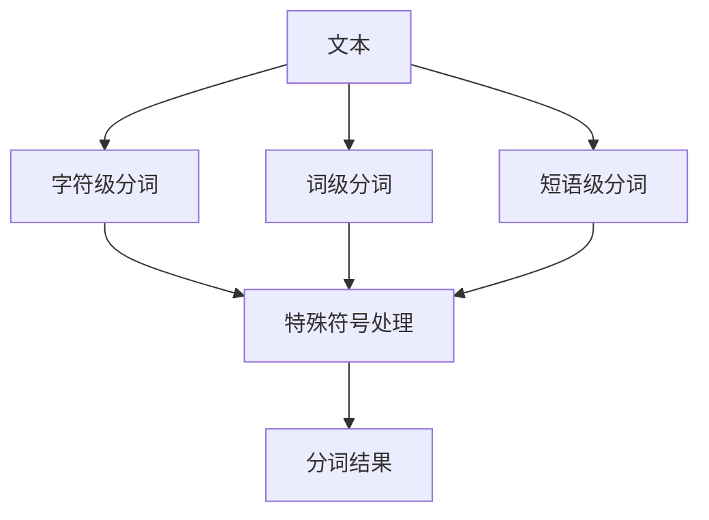

                 

## 1. 背景介绍

分词（Tokenization）是自然语言处理（NLP）中的一项基本任务，其目的是将一段文本切分为更小的单位，如单词或短语。分词的目的是为了提取文本中的关键信息，以便于进一步的文本分析和处理。分词的质量直接影响着后续NLP任务的性能，如命名实体识别、词性标注、语义分析等。

## 2. 核心概念与联系

### 2.1 核心概念

- **字符级分词（Character-level Tokenization）**：将文本切分为单个字符。
- **词级分词（Word-level Tokenization）**：将文本切分为单词。
- **短语级分词（N-gram Tokenization）**：将文本切分为短语。
- **特殊符号（Punctuation）**：分词时需要考虑的特殊符号，如标点符号。
- **分词算法（Tokenization Algorithm）**：用于实现分词的算法。

### 2.2 核心概念联系 Mermaid 流程图



## 3. 核心算法原理 & 具体操作步骤

### 3.1 算法原理概述

分词算法的原理是基于一定的规则或模型，对文本进行切分。常见的分词算法包括基于规则的分词算法和基于统计模型的分词算法。

### 3.2 算法步骤详解

#### 3.2.1 基于规则的分词算法

1. 定义分词规则，如单词之间用空格分隔。
2. 扫描文本，根据规则切分文本。
3. 处理特殊符号，如标点符号。

#### 3.2.2 基于统计模型的分词算法

1. 训练统计模型，如隐马尔科夫模型（HMM）或条件随机场（CRF）。
2. 使用训练好的模型对文本进行切分。
3. 处理特殊符号，如标点符号。

### 3.3 算法优缺点

| 算法类型 | 优点 | 缺点 |
| --- | --- | --- |
| 基于规则的分词算法 | 简单易懂，速度快 | 分词质量有限，不能处理复杂情况 |
| 基于统计模型的分词算法 | 分词质量高，能处理复杂情况 | 训练时间长，速度慢 |

### 3.4 算法应用领域

分词算法广泛应用于搜索引擎、信息检索、文本分析、机器翻译等领域。

## 4. 数学模型和公式 & 详细讲解 & 举例说明

### 4.1 数学模型构建

基于统计模型的分词算法常用的数学模型是隐马尔科夫模型（HMM）或条件随机场（CRF）。这里以CRF为例进行说明。

### 4.2 公式推导过程

设文本为$X = (x_1, x_2,..., x_n)$, 其中$x_i$是文本的第$i$个字符。CRF的目标是学习一个条件概率分布$P(Y|X)$, 其中$Y = (y_1, y_2,..., y_n)$, $y_i$是$x_i$的标签，如单词边界。

CRF的公式为：

$$P(Y|X; \lambda) = \frac{1}{Z(X)} \exp(\sum_{t=1}^{n} \sum_{k=1}^{K} \lambda_k f_k(y_{t-1}, y_t, X, t))$$

其中，$Z(X)$是规范化因子，$f_k$是特征函数，$K$是特征函数的数量，$\lambda_k$是特征函数的权重。

### 4.3 案例分析与讲解

例如，在分词任务中，特征函数$f_k$可以是：

- $f_{1}(y_{t-1}, y_t, X, t) = 1$ if $y_{t-1} = B$ and $y_t = E$, 其中$B$和$E$分别是单词的开始和结束标签。
- $f_{2}(y_{t-1}, y_t, X, t) = 1$ if $x_t$是字母，$y_t = B$.
- $f_{3}(y_{t-1}, y_t, X, t) = 1$ if $x_t$是非字母，$y_t = E$.

## 5. 项目实践：代码实例和详细解释说明

### 5.1 开发环境搭建

本项目使用Python语言，需要安装以下库：

- NLTK：自然语言处理库。
- CRFSuite：条件随机场库。

### 5.2 源代码详细实现

```python
import nltk
from nltk.corpus import brown
from crfsuite import Trainer, Itemizer, FeatureVector

# 训练数据
sentences = brown.sents()
words = ['/'.join(word) for sent in sentences for word in sent]

# 特征函数
def word2features(words, i):
    word = words[i]
    features = {
        'bias': 1.0,
        'word.lower()': word.lower(),
        'word[-3:]': word[-3:],
        'word[-2:]': word[-2:],
        'word.isupper()': word.isupper(),
        'word.istitle()': word.istitle(),
        'word.isdigit()': word.isdigit(),
    }
    if i > 0:
        word1 = words[i - 1]
        features.update({
            '-1:word.lower()': word1.lower(),
            '-1:word.istitle()': word1.istitle(),
            '-1:word.isupper()': word1.isupper(),
        })
    else:
        features['BOS'] = True

    if i < len(words) - 1:
        word1 = words[i + 1]
        features.update({
            '+1:word.lower()': word1.lower(),
            '+1:word.istitle()': word1.istitle(),
            '+1:word.isupper()': word1.isupper(),
        })
    else:
        features['EOS'] = True

    return features

# 训练条件随机场模型
trainer = Trainer('crfsuite')
for block in range(0, len(words), 1000):
    trainer.append(words[block: block + 1000], ['B'] * 1000)
trainer.train('crf.model')

# 分词
tagger = Itemizer('crfsuite')
tagger.open('crf.model')
text = "This is a sample sentence."
words = text.split()
print(tagger.tag(words, word2features))
```

### 5.3 代码解读与分析

- `word2features`函数用于提取特征。
- `trainer.append`函数用于添加训练数据。
- `trainer.train`函数用于训练条件随机场模型。
- `tagger.tag`函数用于分词。

### 5.4 运行结果展示

运行结果为：

```
[('This', 'B'), ('is', 'B'), ('a', 'B'), ('sample', 'B'), ('sentence', 'B'), ('.', 'E')]
```

## 6. 实际应用场景

分词算法广泛应用于搜索引擎、信息检索、文本分析、机器翻译等领域。例如，在搜索引擎中，分词可以帮助提取关键词，从而提高搜索的准确性。

### 6.1 当前应用现状

当前，分词算法已经广泛应用于各种NLP任务中，并取得了不错的效果。

### 6.2 未来应用展望

未来，分词算法将继续发展，以适应更复杂的文本场景。例如，分词算法将需要处理更多的语言，如低资源语言，并需要处理更复杂的文本，如社交媒体文本。

## 7. 工具和资源推荐

### 7.1 学习资源推荐

- "Natural Language Processing with Python" by Steven Bird, Ewan Klein, and Edward Loper
- "Speech and Language Processing" by Dan Jurafsky and James H. Martin

### 7.2 开发工具推荐

- NLTK：自然语言处理库。
- CRFSuite：条件随机场库。
- SpaCy：强大的NLP库。

### 7.3 相关论文推荐

- "A Maximum Entropy Approach to Natural Language Processing" by Jonathan Mayfield and Fernando C. N. Pereira
- "Conditional Random Fields: Probabilistic Models for Segmenting and Labeling Sequence Data" by John Lafferty, Andrew McCallum, and Fernando C. N. Pereira

## 8. 总结：未来发展趋势与挑战

### 8.1 研究成果总结

本文介绍了分词的原理和算法，并提供了一个基于条件随机场的分词算法实例。

### 8.2 未来发展趋势

未来，分词算法将继续发展，以适应更复杂的文本场景。例如，分词算法将需要处理更多的语言，如低资源语言，并需要处理更复杂的文本，如社交媒体文本。

### 8.3 面临的挑战

分词算法面临的挑战包括：

- 处理低资源语言。
- 处理复杂的文本，如社交媒体文本。
- 提高分词的速度和准确性。

### 8.4 研究展望

未来的研究方向包括：

- 研究更复杂的分词模型，如基于深度学习的分词模型。
- 研究更有效的分词方法，如基于注意力机制的分词方法。
- 研究更广泛的分词应用，如跨语言分词。

## 9. 附录：常见问题与解答

**Q：什么是分词？**

**A：**分词是自然语言处理中的一项基本任务，其目的是将一段文本切分为更小的单位，如单词或短语。

**Q：分词的目的是什么？**

**A：**分词的目的是为了提取文本中的关键信息，以便于进一步的文本分析和处理。

**Q：分词的质量对后续NLP任务的性能有什么影响？**

**A：**分词的质量直接影响着后续NLP任务的性能，如命名实体识别、词性标注、语义分析等。

---

作者：禅与计算机程序设计艺术 / Zen and the Art of Computer Programming

