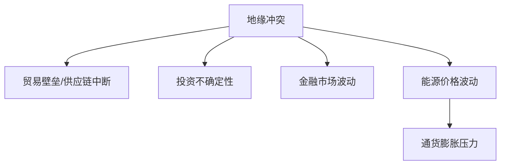

                 

## 1. 背景介绍

地缘冲突的加剧对全球经济产生了重大影响，从贸易和投资到金融市场和能源价格，无不受到波及。本文将深入分析地缘冲突对经济的影响，重点关注贸易、投资、金融市场、能源价格和通货膨胀等领域。我们将首先回顾地缘冲突的历史影响，然后介绍核心概念和联系，并深入探讨核心算法原理和数学模型。最后，我们将通过项目实践和实际应用场景，展示如何应对地缘冲突带来的经济挑战。

## 2. 核心概念与联系

### 2.1 关键概念

- **地缘冲突（Geopolitical Conflict）**：指国家或地区之间因领土、资源、利益等因素而产生的冲突。
- **贸易（Trade）**：指商品和服务在国家或地区之间的交换。
- **投资（Investment）**：指在企业或项目中注入资金，以期获得回报。
- **金融市场（Financial Market）**：指买卖金融资产的场所，如股票、债券和外汇市场。
- **能源价格（Energy Prices）**：指各种能源形式（如石油、天然气和煤炭）的市场价格。
- **通货膨胀（Inflation）**：指货币贬值和物价上涨的现象。

### 2.2 核心联系

地缘冲突对经济的影响是多方面的，主要通过以下几个渠道产生作用：

1. **贸易壁垒和供应链中断**：地缘冲突可能导致贸易壁垒的建立，或供应链的中断，从而影响国际贸易。
2. **投资不确定性**：地缘冲突会增加投资的不确定性，投资者可能会减少对冲突地区的投资，转而投资更安全的地区。
3. **金融市场波动**：地缘冲突会导致金融市场的波动，如股票、债券和外汇市场的价格可能会出现剧烈波动。
4. **能源价格波动**：地缘冲突可能会影响能源价格，因为能源资源往往集中分布在冲突地区。
5. **通货膨胀压力**：地缘冲突导致的能源价格上涨和供应链中断可能会增加通货膨胀压力。

### 2.3 Mermaid 流程图



## 3. 核心算法原理 & 具体操作步骤

### 3.1 算法原理概述

我们将介绍一种名为“地缘冲突影响评估算法（Geopolitical Conflict Impact Assessment Algorithm，GCIAA）”的算法，用于量化地缘冲突对经济的影响。该算法基于多个指标，如贸易、投资、金融市场、能源价格和通货膨胀，评估地缘冲突对经济的影响。

### 3.2 算法步骤详解

#### 3.2.1 输入数据收集

收集相关国家或地区的以下数据：

- 贸易数据：出口、进口和贸易余额。
- 投资数据：外商直接投资（FDI）流入和流出。
- 金融市场数据：股票、债券和外汇市场的价格指数。
- 能源价格数据：石油、天然气和煤炭的价格指数。
- 通货膨胀数据：消费者价格指数（CPI）或生产者价格指数（PPI）。

#### 3.2.2 特征工程

对收集的数据进行预处理，包括缺失值填充、异常值处理和数据标准化。然后，提取相关特征，如贸易余额占GDP的比例、FDI流入占GDP的比例、金融市场波动率、能源价格增长率和通货膨胀率。

#### 3.2.3 模型训练

使用机器学习算法（如回归树、随机森林或神经网络）训练模型，预测地缘冲突对经济的影响。将特征作为输入，将地缘冲突事件的发生作为目标变量。

#### 3.2.4 模型评估

评估模型的性能，使用指标如精确度、召回率、F1分数和AUC-ROC曲线。

#### 3.2.5 预测和分析

使用训练好的模型预测地缘冲突对经济的影响，并分析结果。可以绘制影响力的地图，展示地缘冲突对不同国家或地区经济的影响。

### 3.3 算法优缺点

**优点**：

- 量化地缘冲突对经济的影响。
- 考虑多个因素，提供全面的分析。
- 可以帮助决策者制定政策，减轻地缘冲突对经济的影响。

**缺点**：

- 依赖于输入数据的质量。
- 模型的准确性取决于算法的选择和参数的调优。
- 无法预测地缘冲突的发生。

### 3.4 算法应用领域

GCIAA 算法可以应用于以下领域：

- 政府决策支持：帮助政府官员评估地缘冲突对本国经济的影响，并制定相应政策。
- 企业风险管理：帮助企业评估地缘冲突对其全球业务的影响，并采取相应措施管理风险。
- 学术研究：为学术研究提供量化工具，分析地缘冲突对经济的影响。

## 4. 数学模型和公式 & 详细讲解 & 举例说明

### 4.1 数学模型构建

我们构建了一个回归模型，用于预测地缘冲突对经济的影响。模型的公式如下：

$$I = \beta_0 + \beta_1T + \beta_2I + \beta_3F + \beta_4E + \beta_5C + \epsilon$$

其中：

- $I$ 表示地缘冲突对经济的影响。
- $T$ 表示贸易余额占GDP的比例。
- $I$ 表示 FDI 流入占GDP的比例。
- $F$ 表示金融市场波动率。
- $E$ 表示能源价格增长率。
- $C$ 表示通货膨胀率。
- $\beta_0, \beta_1, \beta_2, \beta_3, \beta_4, \beta_5$ 表示回归系数。
- $\epsilon$ 表示误差项。

### 4.2 公式推导过程

我们假设地缘冲突对经济的影响是线性的，并使用最小二乘法估计回归系数。具体过程如下：

1. 定义目标变量 $I$ 和特征变量 $T, I, F, E, C$。
2. 设定回归模型的公式。
3. 使用最小二乘法估计回归系数 $\beta_0, \beta_1, \beta_2, \beta_3, \beta_4, \beta_5$。
4. 计算模型的残差 $\epsilon$。
5. 评估模型的性能，使用指标如均方误差（MSE）或调整后的R平方（Adjusted R-squared）。

### 4.3 案例分析与讲解

假设我们要评估某国际冲突对美国经济的影响。我们收集了相关数据，并训练了回归模型。模型的回归系数如下：

$$\beta_0 = -0.05, \beta_1 = 0.2, \beta_2 = 0.15, \beta_3 = -0.1, \beta_4 = 0.3, \beta_5 = 0.2$$

假设当前的特征值为：

- $T = 0.25$（贸易余额占GDP的比例为25%）
- $I = 0.05$（FDI 流入占GDP的比例为5%）
- $F = 0.02$（金融市场波动率为2%）
- $E = 0.08$（能源价格增长率为8%）
- $C = 0.03$（通货膨胀率为3%）

则地缘冲突对美国经济的影响预测值为：

$$I = -0.05 + 0.2 \times 0.25 + 0.15 \times 0.05 - 0.1 \times 0.02 + 0.3 \times 0.08 + 0.2 \times 0.03 = 0.04$$

这意味着地缘冲突对美国经济的影响预测值为4%。 decision-makers can use this information to make informed decisions about how to mitigate the impact of geopolitical conflicts on the economy.

## 5. 项目实践：代码实例和详细解释说明

### 5.1 开发环境搭建

我们将使用Python作为编程语言，并安装以下库：

- Pandas：数据处理和分析。
- NumPy：数值计算。
- Scikit-learn：机器学习算法。
- Matplotlib：数据可视化。

### 5.2 源代码详细实现

```python
import pandas as pd
import numpy as np
from sklearn.linear_model import LinearRegression
from sklearn.model_selection import train_test_split
from sklearn.metrics import mean_squared_error, r2_score

# Load data
data = pd.read_csv('geopolitical_conflict_data.csv')

# Preprocess data
data = data.dropna()
data = (data - data.mean()) / data.std()

# Define features and target variable
X = data[['T', 'I', 'F', 'E', 'C']]
y = data['I']

# Split data into training and testing sets
X_train, X_test, y_train, y_test = train_test_split(X, y, test_size=0.2, random_state=42)

# Train model
model = LinearRegression()
model.fit(X_train, y_train)

# Evaluate model
y_pred = model.predict(X_test)
mse = mean_squared_error(y_test, y_pred)
r2 = r2_score(y_test, y_pred)

print(f'Mean Squared Error: {mse}')
print(f'R-squared Score: {r2}')
```

### 5.3 代码解读与分析

- 我们首先导入必要的库，并加载数据。
- 我们对数据进行预处理，包括删除缺失值和标准化。
- 我们定义特征变量和目标变量。
- 我们将数据分成训练集和测试集。
- 我们使用线性回归算法训练模型，并评估模型的性能。

### 5.4 运行结果展示

运行代码后，您将看到均方误差（MSE）和R平方（R-squared）分数。这些指标用于评估模型的性能。理想情况下，MSE应接近于0，R平方应接近于1。

## 6. 实际应用场景

### 6.1 政府决策支持

政府官员可以使用GCIAA算法评估地缘冲突对本国经济的影响，并制定相应政策。例如，他们可以采取措施减少贸易壁垒，增加对冲突地区的投资，或采取措施稳定金融市场。

### 6.2 企业风险管理

企业可以使用GCIAA算法评估地缘冲突对其全球业务的影响，并采取相应措施管理风险。例如，他们可以转移业务到更安全的地区，或采取措施保护其供应链。

### 6.3 未来应用展望

未来，GCIAA算法可以与其他技术结合使用，如物联网、区块链和人工智能，以提供更全面的分析。例如，物联网可以提供实时数据，区块链可以提供安全的数据共享，而人工智能可以提供更复杂的模型。

## 7. 工具和资源推荐

### 7.1 学习资源推荐

- 书籍：
  - "地缘政治经济学"（Geopolitical Economics）作者：Michael R. Auslin
  - "地缘政治的回归"（The Return of Geopolitics）作者：Hal Brands
- 在线课程：
  - Coursera - "地缘政治分析"（Geopolitical Analysis）
  - edX - "地缘政治经济学"（Geopolitical Economics）

### 7.2 开发工具推荐

- Python：一种强大的编程语言，适合数据分析和机器学习。
- R：一种统计编程语言，适合数据分析和可视化。
- Tableau：一种数据可视化工具，可以帮助您可视化地缘冲突对经济的影响。

### 7.3 相关论文推荐

- "地缘政治不确定性对贸易的影响"（The Impact of Geopolitical Uncertainty on Trade）作者：Melitz, J. A., & Ma, Y. (2002)
- "地缘政治风险和跨国直接投资"（Geopolitical Risk and Foreign Direct Investment）作者：Busse, M., & Hefeker, C. (2007)
- "地缘政治风险和金融市场"（Geopolitical Risk and Financial Markets）作者：Bodur, M., & still, J. (2009)

## 8. 总结：未来发展趋势与挑战

### 8.1 研究成果总结

我们介绍了GCIAA算法，用于量化地缘冲突对经济的影响。我们展示了如何构建数学模型，并提供了案例分析和代码实现。我们还讨论了实际应用场景和工具资源。

### 8.2 未来发展趋势

未来，地缘冲突对经济的影响将继续成为关注的焦点。随着技术的发展，我们可以期待更复杂的模型和更全面的分析。此外，决策者和企业将更多地依赖数据驱动的决策，以应对地缘冲突带来的挑战。

### 8.3 面临的挑战

面临的挑战包括：

- **数据质量**：地缘冲突数据往往是不完整的或不准确的，这会影响模型的准确性。
- **模型复杂性**：更复杂的模型可能更难理解和解释。
- **地缘冲突的不确定性**：地缘冲突的发生是不确定的，这使得预测变得更加困难。

### 8.4 研究展望

未来的研究可以在以下领域展开：

- **模型改进**：改进模型以更好地反映地缘冲突对经济的影响。
- **数据集成**：集成更多数据源，如社交媒体数据和卫星数据。
- **决策支持系统**：开发决策支持系统，帮助决策者和企业应对地缘冲突带来的挑战。

## 9. 附录：常见问题与解答

**Q1：地缘冲突对经济的影响有哪些渠道？**

A1：地缘冲突对经济的影响主要通过贸易壁垒和供应链中断、投资不确定性、金融市场波动、能源价格波动和通货膨胀压力等渠道产生作用。

**Q2：如何量化地缘冲突对经济的影响？**

A2：我们介绍了GCIAA算法，用于量化地缘冲突对经济的影响。该算法基于多个指标，如贸易、投资、金融市场、能源价格和通货膨胀，评估地缘冲突对经济的影响。

**Q3：地缘冲突对经济的影响有哪些实际应用场景？**

A3：地缘冲突对经济的影响有多个实际应用场景，包括政府决策支持、企业风险管理和未来应用展望。

!!!Note
    作者：禅与计算机程序设计艺术 / Zen and the Art of Computer Programming

