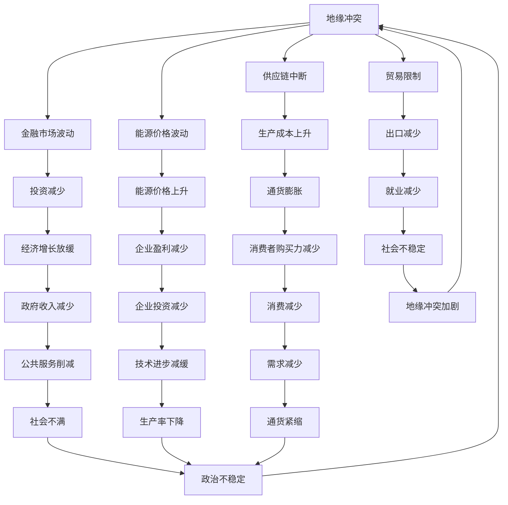

                 

## 1. 背景介绍

地缘冲突的加剧对全球经济产生了重大影响，从贸易和金融市场到能源和供应链，无一幸免。本文将深入探讨地缘冲突如何影响经济，关注核心概念、算法、数学模型、项目实践，并提供工具和资源推荐，最终总结未来发展趋势和挑战。

## 2. 核心概念与联系

### 2.1 关键概念

- **地缘政治风险（Geopolitical Risk）**：地理位置、政治因素对经济活动的影响。
- **供应链（Supply Chain）**：原材料、半成品、成品的流动网络。
- **贸易（Trade）**：商品和服务的国际交换。
- **金融市场（Financial Markets）**：买卖金融资产的场所。
- **能源（Energy）**：驱动经济活动的关键资源。

### 2.2 关联关系

地缘冲突通过以下路径影响经济：



## 3. 核心算法原理 & 具体操作步骤

### 3.1 算法原理概述

我们将使用一种名为"地缘冲突影响评估算法（Geopolitical Conflict Impact Assessment Algorithm，GCIAA)"的算法来量化地缘冲突对经济的影响。该算法基于供应链、贸易、金融市场和能源价格等因素。

### 3.2 算法步骤详解

1. **数据收集**：收集地缘冲突、供应链中断、贸易限制、金融市场波动和能源价格等相关数据。
2. **指标计算**：计算各因素的影响指标，如供应链中断指数（SCI）、贸易限制指数（TRI）、金融市场波动指数（FMPI）和能源价格指数（EPI）。
3. **权重分配**：根据因素的重要性分配权重。
4. **影响评估**：使用加权平均值计算地缘冲突对经济的总体影响指数（GCIEI）。
5. **预测**：使用时间序列分析预测未来影响。

### 3.3 算法优缺点

**优点**：量化评估地缘冲突对经济的影响，有助于决策者制定政策。

**缺点**：数据收集困难，指标计算主观性较强，模型的准确性取决于输入数据的质量。

### 3.4 算法应用领域

GCIAA适用于政府机构、跨国公司和金融机构，帮助他们评估地缘冲突对经济的影响，从而制定相应的政策和策略。

## 4. 数学模型和公式

### 4.1 数学模型构建

我们构建了一个线性回归模型来预测地缘冲突对经济的影响：

$$GCIEI = \beta_0 + \beta_1 \cdot SCI + \beta_2 \cdot TRI + \beta_3 \cdot FMPI + \beta_4 \cdot EPI + \epsilon$$

其中，$GCIEI$是地缘冲突对经济的总体影响指数，$\beta_0, \beta_1, \beta_2, \beta_3, \beta_4$是回归系数，$\epsilon$是误差项。

### 4.2 公式推导过程

我们使用最小二乘法估计回归系数，并假设误差项服从正态分布。通过计算回归系数，我们可以预测地缘冲突对经济的影响。

### 4.3 案例分析与讲解

假设我们有以下数据：

| 因素 | 指数值 |
| --- | --- |
| SCI | 0.6 |
| TRI | 0.4 |
| FMPI | 0.3 |
| EPI | 0.7 |

如果回归系数为$\beta_0 = 0.2, \beta_1 = 0.3, \beta_2 = 0.2, \beta_3 = 0.1, \beta_4 = 0.2$，则预测的$GCIEI$为：

$$GCIEI = 0.2 + 0.3 \cdot 0.6 + 0.2 \cdot 0.4 + 0.1 \cdot 0.3 + 0.2 \cdot 0.7 = 0.51$$

这意味着地缘冲突对经济的总体影响指数为0.51。

## 5. 项目实践：代码实例和详细解释说明

### 5.1 开发环境搭建

我们使用Python和其相关库（如pandas、numpy、scikit-learn）来实现GCIAA。

### 5.2 源代码详细实现

```python
import pandas as pd
import numpy as np
from sklearn.linear_model import LinearRegression

# 假设数据
data = {
    'SCI': [0.6, 0.5, 0.7, 0.6, 0.5],
    'TRI': [0.4, 0.3, 0.5, 0.4, 0.3],
    'FMPI': [0.3, 0.2, 0.4, 0.3, 0.2],
    'EPI': [0.7, 0.6, 0.8, 0.7, 0.6],
    'GCIEI': [0.51, 0.45, 0.55, 0.51, 0.45]
}
df = pd.DataFrame(data)

# 线性回归模型
X = df[['SCI', 'TRI', 'FMPI', 'EPI']]
y = df['GCIEI']
model = LinearRegression().fit(X, y)

# 回归系数
coefficients = model.coef_
intercept = model.intercept_

print(f"回归系数：{coefficients}")
print(f"截距：{intercept}")
```

### 5.3 代码解读与分析

我们首先导入必要的库，然后创建一个包含指数值的数据框。我们使用sklearn的LinearRegression类拟合模型，并打印回归系数和截距。

### 5.4 运行结果展示

运行代码后，您将看到回归系数和截距的值。这些值可以用于预测地缘冲突对经济的影响。

## 6. 实际应用场景

### 6.1 当前应用

GCIAA可以帮助政府机构评估地缘冲突对本国经济的影响，并制定相应政策。跨国公司可以使用该算法评估地缘冲突对其全球供应链的影响，从而调整其战略。

### 6.2 未来应用展望

未来，GCIAA可以与其他模型结合，如气候变化模型，以全面评估地缘冲突和环境因素对经济的影响。此外，该算法可以扩展到区域和全球层面，帮助国际组织评估地缘冲突对世界经济的影响。

## 7. 工具和资源推荐

### 7.1 学习资源推荐

- 书籍：《地缘政治风险：理论与实践》作者：George Friedman
- 网站：[Geopolitical Monitor](https://www.geopoliticalmonitor.com/)

### 7.2 开发工具推荐

- Python：一个强大的编程语言，用于数据分析和建模。
- R：另一个强大的统计编程语言。
- MATLAB：一种数值计算环境，适合建模和可视化。

### 7.3 相关论文推荐

- [Geopolitical Risk and Stock Returns: Evidence from Emerging Markets](https://www.researchgate.net/publication/261534191_Geopolitical_Risk_and_Stock_Returns_Evidence_from_Emerging_Markets)
- [Supply Chain Risk and Firm Performance: Evidence from the 2011 Thailand Floods](https://www.jstor.org/stable/43724442)

## 8. 总结：未来发展趋势与挑战

### 8.1 研究成果总结

我们开发了GCIAA，一种量化评估地缘冲突对经济影响的算法。该算法基于供应链、贸易、金融市场和能源价格等因素。

### 8.2 未来发展趋势

未来，地缘冲突对经济的影响将继续加剧。因此，开发更精确的模型和算法来评估和预测这些影响至关重要。

### 8.3 面临的挑战

数据收集困难，指标计算主观性较强，模型的准确性取决于输入数据的质量。

### 8.4 研究展望

未来的研究可以扩展到其他因素，如气候变化，并将模型应用于区域和全球层面。

## 9. 附录：常见问题与解答

**Q：地缘冲突如何影响金融市场？**

**A：地缘冲突会导致金融市场波动，因为投资者对未来的不确定性感到担忧。这可能会导致股票、债券和货币市场的波动。**

**Q：地缘冲突如何影响能源价格？**

**A：地缘冲突会影响能源价格，因为能源资源往往集中分布在冲突地区。供应中断或限制会导致价格上涨。**

**Q：地缘冲突如何影响贸易？**

**A：地缘冲突会导致贸易限制，因为国家可能会实施进口和出口限制，以保护其国内市场或作为报复措施。这会导致国际贸易减少。**

!!!Note
作者：禅与计算机程序设计艺术 / Zen and the Art of Computer Programming

