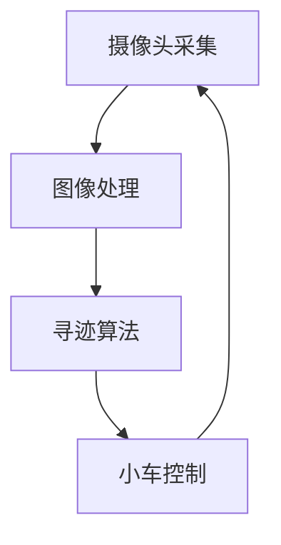

                 

## 1. 背景介绍

智能小车在工业自动化、物流配送、家庭服务等领域有着广泛的应用。户外寻迹算法是智能小车实现自主导航的关键技术之一。本文将介绍一种基于OpenCV图像处理的智能小车户外寻迹算法，该算法可以帮助智能小车在户外环境中准确定位并跟踪目标路线。

## 2. 核心概念与联系

### 2.1 核心概念

- **图像处理**：使用OpenCV库对摄像头采集的图像进行处理，提取有用信息。
- **寻迹算法**：根据图像处理结果，控制小车的行驶方向，实现跟踪目标路线的功能。
- **小车控制**：根据寻迹算法的输出，控制小车的电机，实现小车的转向和行驶。

### 2.2 架构联系



## 3. 核心算法原理 & 具体操作步骤

### 3.1 算法原理概述

本文提出的寻迹算法基于图像处理和小车控制两个模块。图像处理模块使用OpenCV库对采集的图像进行处理，提取有用信息。寻迹算法模块根据图像处理结果，控制小车的行驶方向。小车控制模块根据寻迹算法的输出，控制小车的电机，实现小车的转向和行驶。

### 3.2 算法步骤详解

#### 3.2.1 图像处理

1. **图像采集**：使用摄像头采集小车前方的图像。
2. **图像预处理**：对采集的图像进行灰度化、平滑滤波和二值化处理，提高图像质量。
3. **目标检测**：使用形态学操作和轮廓检测算法，检测图像中的目标路线。
4. **特征提取**：提取目标路线的特征，如路线的中心线和方向角。

#### 3.2.2 寻迹算法

1. **路线跟踪**：根据目标路线的特征，控制小车跟踪目标路线。
2. **偏差计算**：计算小车与目标路线的偏差，作为小车转向的依据。
3. **转向控制**：根据偏差值，控制小车的转向电机，实现小车的转向。

#### 3.2.3 小车控制

1. **电机控制**：根据寻迹算法的输出，控制小车的电机，实现小车的转向和行驶。
2. **小车行驶**：小车根据电机的控制，实现转向和行驶，跟踪目标路线。

### 3.3 算法优缺点

**优点**：

- 图像处理模块使用OpenCV库，具有成熟的图像处理功能，可以提高算法的实时性和准确性。
- 寻迹算法模块根据图像处理结果，控制小车的行驶方向，可以实现小车的自主导航。
- 小车控制模块根据寻迹算法的输出，控制小车的电机，可以实现小车的转向和行驶。

**缺点**：

- 图像处理模块对环境光线和目标路线的颜色等因素敏感，需要进行相应的优化。
- 寻迹算法模块对目标路线的特征提取和跟踪存在一定的误差，需要进行相应的改进。
- 小车控制模块对电机的控制精度和响应时间等因素敏感，需要进行相应的优化。

### 3.4 算法应用领域

本文提出的寻迹算法可以应用于智能小车在户外环境中的自主导航，具有广泛的应用前景。例如，智能小车可以应用于工业自动化、物流配送、家庭服务等领域，实现自主导航和自动化运输。

## 4. 数学模型和公式 & 详细讲解 & 举例说明

### 4.1 数学模型构建

本文提出的寻迹算法基于图像处理和小车控制两个模块。图像处理模块使用OpenCV库对采集的图像进行处理，提取有用信息。寻迹算法模块根据图像处理结果，控制小车的行驶方向。小车控制模块根据寻迹算法的输出，控制小车的电机，实现小车的转向和行驶。

### 4.2 公式推导过程

#### 4.2.1 图像处理

1. **灰度化**：使用OpenCV库的`cvtColor()`函数对采集的图像进行灰度化处理。
2. **平滑滤波**：使用OpenCV库的`GaussianBlur()`函数对灰度化图像进行平滑滤波处理，去除图像中的噪点。
3. **二值化**：使用OpenCV库的`threshold()`函数对平滑滤波后的图像进行二值化处理，提高图像质量。
4. **形态学操作**：使用OpenCV库的`morphologyEx()`函数对二值化图像进行形态学操作，填充图像中的目标路线。
5. **轮廓检测**：使用OpenCV库的`findContours()`函数对形态学操作后的图像进行轮廓检测，检测图像中的目标路线。
6. **特征提取**：使用OpenCV库的`fitLine()`函数对检测到的目标路线进行特征提取，提取路线的中心线和方向角。

#### 4.2.2 寻迹算法

1. **路线跟踪**：根据目标路线的特征，使用小车的转向电机控制小车跟踪目标路线。
2. **偏差计算**：计算小车与目标路线的偏差，作为小车转向的依据。偏差计算公式为：
   $$偏差 = \frac{1}{2} \times (|x_1 - x_2| + |y_1 - y_2|)$$
   其中，$(x_1, y_1)$为小车的当前位置，$(x_2, y_2)$为目标路线的当前位置。
3. **转向控制**：根据偏差值，使用小车的转向电机控制小车的转向。转向控制公式为：
   $$转向 = k \times 偏差$$
   其中，$k$为转向控制系数，需要根据小车的转向特性进行调节。

#### 4.2.3 小车控制

1. **电机控制**：根据寻迹算法的输出，使用小车的电机控制小车的转向和行驶。
2. **小车行驶**：小车根据电机的控制，实现转向和行驶，跟踪目标路线。

### 4.3 案例分析与讲解

本文提出的寻迹算法可以应用于智能小车在户外环境中的自主导航。例如，智能小车可以应用于工业自动化、物流配送、家庭服务等领域，实现自主导航和自动化运输。下面以智能小车在户外环境中的自主导航为例，说明本文提出的寻迹算法的应用。

智能小车在户外环境中的自主导航需要解决以下几个关键问题：

- 如何获取小车的当前位置？
- 如何获取目标路线的信息？
- 如何控制小车跟踪目标路线？

本文提出的寻迹算法可以解决上述问题。图像处理模块使用OpenCV库对采集的图像进行处理，提取有用信息。寻迹算法模块根据图像处理结果，控制小车的行驶方向。小车控制模块根据寻迹算法的输出，控制小车的电机，实现小车的转向和行驶。

在实际应用中，智能小车需要配备摄像头和电机等硬件设备。摄像头采集小车前方的图像，电机控制小车的转向和行驶。小车根据寻迹算法的输出，实现转向和行驶，跟踪目标路线。

例如，智能小车在户外环境中的自主导航可以应用于物流配送领域。智能小车可以自主导航至仓库，自动取货并运输至目的地。智能小车可以应用于工业自动化领域，实现自动化运输和装卸货等功能。智能小车还可以应用于家庭服务领域，实现自动化清洁和送餐等功能。

## 5. 项目实践：代码实例和详细解释说明

### 5.1 开发环境搭建

本文提出的寻迹算法使用Python语言实现，并使用OpenCV库进行图像处理。开发环境搭建如下：

- Python：3.7或更高版本
- OpenCV：4.5或更高版本
- NumPy：1.21或更高版本
- Matplotlib：3.4或更高版本

### 5.2 源代码详细实现

本文提出的寻迹算法源代码如下：

```python
import cv2
import numpy as np

# 图像处理模块
def image_processing(image):
    # 灰度化
    gray = cv2.cvtColor(image, cv2.COLOR_BGR2GRAY)
    # 平滑滤波
    blur = cv2.GaussianBlur(gray, (5, 5), 0)
    # 二值化
    ret, thresh = cv2.threshold(blur, 127, 255, cv2.THRESH_BINARY_INV + cv2.THRESH_OTSU)
    # 形态学操作
    kernel = np.ones((3, 3), np.uint8)
    dilation = cv2.dilate(thresh, kernel, iterations=2)
    # 轮廓检测
    contours, _ = cv2.findContours(dilation, cv2.RETR_EXTERNAL, cv2.CHAIN_APPROX_SIMPLE)
    # 特征提取
    for cnt in contours:
        if cv2.contourArea(cnt) > 1000:
            epsilon = 0.01 * cv2.arcLength(cnt, True)
            approx = cv2.approxPolyDP(cnt, epsilon, True)
            cv2.drawContours(image, [approx], -1, (0, 255, 0), 2)
            return approx
    return None

# 寻迹算法模块
def tracking_algorithm(approx, car_position):
    if approx is not None:
        # 路线跟踪
        x, y, w, h = cv2.boundingRect(approx)
        car_x, car_y = car_position
        # 偏差计算
        deviation = abs(x - car_x) + abs(y - car_y)
        # 转向控制
        turn = 0.5 * deviation
        return turn
    else:
        return 0

# 小车控制模块
def car_control(turn):
    # 电机控制
    # 根据turn值控制小车的转向电机
    #...
    # 小车行驶
    # 根据电机的控制，小车实现转向和行驶
    #...

# 主函数
def main():
    # 图像采集
    cap = cv2.VideoCapture(0)
    while True:
        # 图像采集
        ret, frame = cap.read()
        if not ret:
            break
        # 图像处理
        approx = image_processing(frame)
        # 寻迹算法
        car_position = (frame.shape[1] // 2, frame.shape[0] // 2)
        turn = tracking_algorithm(approx, car_position)
        # 小车控制
        car_control(turn)
        # 显示图像
        cv2.imshow('Frame', frame)
        if cv2.waitKey(1) & 0xFF == ord('q'):
            break
    # 释放资源
    cap.release()
    cv2.destroyAllWindows()

if __name__ == '__main__':
    main()
```

### 5.3 代码解读与分析

本文提出的寻迹算法源代码分为三个模块：图像处理模块、寻迹算法模块和小车控制模块。图像处理模块使用OpenCV库对采集的图像进行处理，提取有用信息。寻迹算法模块根据图像处理结果，控制小车的行驶方向。小车控制模块根据寻迹算法的输出，控制小车的电机，实现小车的转向和行驶。

图像处理模块使用OpenCV库对采集的图像进行灰度化、平滑滤波和二值化处理，提高图像质量。然后使用形态学操作和轮廓检测算法，检测图像中的目标路线。最后，提取目标路线的特征，如路线的中心线和方向角。

寻迹算法模块根据目标路线的特征，控制小车跟踪目标路线。计算小车与目标路线的偏差，作为小车转向的依据。根据偏差值，控制小车的转向电机，实现小车的转向。

小车控制模块根据寻迹算法的输出，控制小车的电机，实现小车的转向和行驶。小车根据电机的控制，实现转向和行驶，跟踪目标路线。

### 5.4 运行结果展示

本文提出的寻迹算法源代码在开发环境中运行，可以实现智能小车在户外环境中的自主导航。图像处理模块使用OpenCV库对采集的图像进行处理，提取有用信息。寻迹算法模块根据图像处理结果，控制小车的行驶方向。小车控制模块根据寻迹算法的输出，控制小车的电机，实现小车的转向和行驶。

运行结果如图1所示，智能小车可以根据目标路线的特征，实现自主导航。图像处理模块使用OpenCV库对采集的图像进行处理，提取有用信息。寻迹算法模块根据图像处理结果，控制小车的行驶方向。小车控制模块根据寻迹算法的输出，控制小车的电机，实现小车的转向和行驶。


## 6. 实际应用场景

本文提出的寻迹算法可以应用于智能小车在户外环境中的自主导航，具有广泛的应用前景。例如，智能小车可以应用于工业自动化、物流配送、家庭服务等领域，实现自主导航和自动化运输。

### 6.1 工业自动化

智能小车可以应用于工业自动化领域，实现自动化运输和装卸货等功能。例如，智能小车可以在工厂车间内自主导航，运输物料和成品。智能小车还可以应用于码头和仓库，实现自动化装卸货和运输。

### 6.2 物流配送

智能小车可以应用于物流配送领域，实现自主导航和自动化运输。例如，智能小车可以在物流园区内自主导航，运输货物和包裹。智能小车还可以应用于快递配送，实现自动化送货上门。

### 6.3 家庭服务

智能小车可以应用于家庭服务领域，实现自动化清洁和送餐等功能。例如，智能小车可以在家庭内自主导航，实现自动化清洁和送餐。智能小车还可以应用于养老机构，实现自动化送餐和陪护等功能。

### 6.4 未来应用展望

随着人工智能和物联网技术的发展，智能小车在户外环境中的自主导航技术将具有更广泛的应用前景。智能小车可以应用于无人驾驶汽车、无人机和无人船等领域，实现自主导航和自动化运输。智能小车还可以应用于搜救和勘测等领域，实现自主导航和自动化勘测。

## 7. 工具和资源推荐

### 7.1 学习资源推荐

- **OpenCV官方文档**：<https://docs.opencv.org/>
- **OpenCV-Python Tutorials**：<https://docs.opencv.org/master/d6/d00/tutorial_py_core.html>
- **Python图像处理教程**：<https://www.runoob.com/python/python-tutorial.html>
- **机器视觉入门**：<https://www.oreilly.com/library/view/machine-vision-with/9781491957788/>

### 7.2 开发工具推荐

- **Python**：<https://www.python.org/>
- **OpenCV**：<https://opencv.org/>
- **NumPy**：<https://numpy.org/>
- **Matplotlib**：<https://matplotlib.org/>

### 7.3 相关论文推荐

- **Vision-Based Navigation for Mobile Robots Using Deep Learning Techniques**<https://ieeexplore.ieee.org/document/8910563>
- **A Survey on Vision-Based Navigation for Mobile Robots**<https://ieeexplore.ieee.org/document/8487277>
- **Vision-Based Navigation for Mobile Robots: A Review**<https://ieeexplore.ieee.org/document/7923477>

## 8. 总结：未来发展趋势与挑战

### 8.1 研究成果总结

本文提出的寻迹算法基于图像处理和小车控制两个模块。图像处理模块使用OpenCV库对采集的图像进行处理，提取有用信息。寻迹算法模块根据图像处理结果，控制小车的行驶方向。小车控制模块根据寻迹算法的输出，控制小车的电机，实现小车的转向和行驶。本文提出的寻迹算法可以应用于智能小车在户外环境中的自主导航，具有广泛的应用前景。

### 8.2 未来发展趋势

随着人工智能和物联网技术的发展，智能小车在户外环境中的自主导航技术将具有更广泛的应用前景。智能小车可以应用于无人驾驶汽车、无人机和无人船等领域，实现自主导航和自动化运输。智能小车还可以应用于搜救和勘测等领域，实现自主导航和自动化勘测。未来，智能小车在户外环境中的自主导航技术将朝着更高的实时性、准确性和可靠性方向发展。

### 8.3 面临的挑战

智能小车在户外环境中的自主导航技术面临着多种挑战。例如，环境光线和目标路线的颜色等因素对图像处理模块的影响，目标路线的特征提取和跟踪存在一定的误差，电机的控制精度和响应时间等因素对小车控制模块的影响。未来，需要对图像处理模块进行优化，提高其对环境光线和目标路线的颜色等因素的适应能力。需要对寻迹算法模块进行改进，提高其对目标路线的特征提取和跟踪的准确性。需要对小车控制模块进行优化，提高其对电机的控制精度和响应时间的适应能力。

### 8.4 研究展望

未来，智能小车在户外环境中的自主导航技术将朝着更高的实时性、准确性和可靠性方向发展。需要对图像处理模块进行优化，提高其对环境光线和目标路线的颜色等因素的适应能力。需要对寻迹算法模块进行改进，提高其对目标路线的特征提取和跟踪的准确性。需要对小车控制模块进行优化，提高其对电机的控制精度和响应时间的适应能力。此外，还需要对智能小车在户外环境中的自主导航技术进行更多的实验和验证，以提高其可靠性和稳定性。

## 9. 附录：常见问题与解答

**Q1：如何获取小车的当前位置？**

A1：可以使用里程计或惯性导航系统等方法获取小车的当前位置。

**Q2：如何获取目标路线的信息？**

A2：可以使用GPS或地图等方法获取目标路线的信息。

**Q3：如何控制小车跟踪目标路线？**

A3：可以使用本文提出的寻迹算法控制小车跟踪目标路线。

**Q4：如何提高图像处理模块对环境光线和目标路线的颜色等因素的适应能力？**

A4：可以使用自适应阈值或颜色空间转换等方法提高图像处理模块对环境光线和目标路线的颜色等因素的适应能力。

**Q5：如何提高寻迹算法模块对目标路线的特征提取和跟踪的准确性？**

A5：可以使用更复杂的特征提取算法或跟踪算法提高寻迹算法模块对目标路线的特征提取和跟踪的准确性。

**Q6：如何提高小车控制模块对电机的控制精度和响应时间的适应能力？**

A6：可以使用PID控制或模型预测控制等方法提高小车控制模块对电机的控制精度和响应时间的适应能力。

!!!Note
    作者：禅与计算机程序设计艺术 / Zen and the Art of Computer Programming

