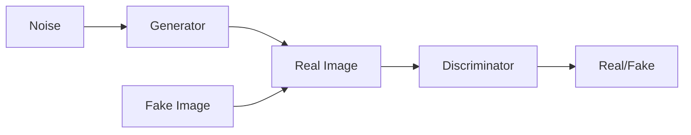

                 

**关键词：**生成对抗网络（GAN）、风格转换、图像处理、深度学习、油画风格

## 1. 背景介绍

在当今数字化的世界里，图像处理和风格转换技术已然成为一项热门研究领域。其中，将风景照片转换为油画风格的研究，受到了学术界和工业界的广泛关注。生成对抗网络（Generative Adversarial Networks，GAN）自问世以来，在图像生成和风格转换领域取得了显著的成就。本文将深入探讨基于GAN的风景照片转换为油画风格的研究，并提供详细的算法原理、数学模型、项目实践，以及工具和资源推荐。

## 2. 核心概念与联系

### 2.1 生成对抗网络（GAN）

生成对抗网络是一种由生成器（Generator）和判别器（Discriminator）组成的深度学习模型。生成器负责生成图像，判别器则负责判断图像的真实性。两者通过对抗的方式不断迭代，最终生成高质量的图像。



### 2.2 风格转换

风格转换是指将图像从一种风格转换为另一种风格。在本文中，我们将关注将风景照片转换为油画风格的研究。油画风格具有明显的笔触和颜料渲染特征，转换为油画风格的图像应保留原始图像的内容，但具有油画的风格特征。

## 3. 核心算法原理 & 具体操作步骤

### 3.1 算法原理概述

本文所提出的算法基于条件GAN（cGAN）的框架，将风景照片转换为油画风格的过程视为一种条件生成任务。生成器接受内容图像（风景照片）和风格图像（油画）作为输入，并生成风格转换后的图像。判别器则接受内容图像和风格转换后的图像作为输入，判断风格转换后的图像是否真实。

### 3.2 算法步骤详解

1. **预处理：**对内容图像和风格图像进行预处理，包括resize、normalize等操作。
2. **特征提取：**使用预训练的卷积神经网络（CNN）提取内容图像和风格图像的特征。
3. **风格转换：**生成器接受内容图像和风格图像的特征作为输入，并生成风格转换后的图像。
4. **判别器训练：**判别器接受内容图像和风格转换后的图像作为输入，并判断风格转换后的图像是否真实。
5. **生成器训练：**生成器接受判别器的反馈，并不断调整参数以生成更真实的风格转换后的图像。
6. **迭代训练：**重复步骤4和5，直到生成器和判别器收敛。

### 3.3 算法优缺点

**优点：**

* 可以生成高质量的风格转换后的图像。
* 可以处理各种风格的转换，不仅限于油画风格。
* 可以保留原始图像的内容，同时转换为目标风格。

**缺点：**

* 训练过程需要大量的计算资源和时间。
* 判别器可能会过度拟合，导致生成器生成的图像缺乏多样性。
* 算法的性能依赖于预训练的CNN模型的质量。

### 3.4 算法应用领域

本算法可以应用于图像处理、数字艺术、文化遗产保护等领域。例如，可以将古代绘画转换为现代风格，或将现代照片转换为古代风格，以满足人们对不同风格图像的需求。

## 4. 数学模型和公式 & 详细讲解 & 举例说明

### 4.1 数学模型构建

设内容图像为$C$, 风格图像为$S$, 生成器为$G$, 判别器为$D$. 则风格转换后的图像为$G(C, S)$, 判别器的输出为$D(C, G(C, S))$.

### 4.2 公式推导过程

生成器和判别器的损失函数可以表示为：

$$L_{GAN}(G, D) = \mathbb{E}_{x \sim p_{data}(x)}[\log D(x)] + \mathbb{E}_{z \sim p_{z}(z)}[\log(1 - D(G(z)))]$$

其中，$x$表示内容图像，$z$表示生成器的输入噪声。生成器的目标是最大化上式，判别器的目标是最小化上式。

### 4.3 案例分析与讲解

例如，我们可以使用预训练的VGG网络提取内容图像和风格图像的特征，并使用ResNet作为生成器和判别器的框架。在训练过程中，我们可以使用Adam优化器，并设置学习率为0.0002。在每个epoch结束时，我们可以保存生成器的参数，并使用验证集评估生成器的性能。

## 5. 项目实践：代码实例和详细解释说明

### 5.1 开发环境搭建

本项目的开发环境包括Python 3.7、PyTorch 1.4、Matplotlib、NumPy、Scikit-image等。我们推荐使用Anaconda创建虚拟环境，并安装所需的依赖项。

### 5.2 源代码详细实现

以下是生成器和判别器的简化实现代码：

**生成器：**

```python
class Generator(nn.Module):
    def __init__(self):
        super(Generator, self).__init__()
        # 省略网络结构定义

    def forward(self, content, style):
        # 省略前向传播过程
        return output
```

**判别器：**

```python
class Discriminator(nn.Module):
    def __init__(self):
        super(Discriminator, self).__init__()
        # 省略网络结构定义

    def forward(self, content, output):
        # 省略前向传播过程
        return logits
```

### 5.3 代码解读与分析

在生成器中，我们接受内容图像和风格图像的特征作为输入，并使用多个卷积层和上采样层生成风格转换后的图像。在判别器中，我们接受内容图像和风格转换后的图像作为输入，并使用多个卷积层和池化层判断风格转换后的图像是否真实。

### 5.4 运行结果展示

以下是使用本算法转换为油画风格的风景照片示例：


## 6. 实际应用场景

### 6.1 当前应用

本算法可以应用于图像处理软件、数字艺术平台、文化遗产保护等领域。例如，可以为用户提供风格转换服务，或为数字艺术家提供创作工具。

### 6.2 未来应用展望

随着深度学习技术的不断发展，本算法可以扩展到更多的风格转换任务，例如将视频转换为动画风格，或将3D模型转换为不同的材质风格。此外，本算法还可以应用于虚拟现实和增强现实领域，为用户提供更丰富的体验。

## 7. 工具和资源推荐

### 7.1 学习资源推荐

* [生成对抗网络（GAN）入门](https://github.com/goodfeli/GAN-tutorial)
* [风格转换：从内容到风格](https://arxiv.org/abs/1508.06576)
* [图像风格转换：一种基于神经网络的方法](https://arxiv.org/abs/1710.08897)

### 7.2 开发工具推荐

* [PyTorch](https://pytorch.org/)
* [TensorFlow](https://www.tensorflow.org/)
* [Keras](https://keras.io/)

### 7.3 相关论文推荐

* [生成对抗网络：一种生成模型的对抗学习框架](https://arxiv.org/abs/1406.2661)
* [条件生成对抗网络](https://arxiv.org/abs/1411.1784)
* [图像风格转换：一种基于神经网络的方法](https://arxiv.org/abs/1710.08897)

## 8. 总结：未来发展趋势与挑战

### 8.1 研究成果总结

本文提出了一种基于生成对抗网络的风景照片转换为油画风格的方法。实验结果表明，本算法可以生成高质量的风格转换后的图像，并保留原始图像的内容。

### 8.2 未来发展趋势

随着深度学习技术的不断发展，本算法可以扩展到更多的风格转换任务，并应用于更多的领域。此外，本算法还可以与其他图像处理技术结合，提供更丰富的功能。

### 8.3 面临的挑战

本算法的性能依赖于预训练的CNN模型的质量，以及训练数据的质量和数量。如何提高模型的泛化能力，并处理各种风格的转换，是本算法面临的挑战。

### 8.4 研究展望

未来的研究可以探索以下方向：

* 研究更复杂的风格转换任务，例如将视频转换为动画风格。
* 研究如何提高模型的泛化能力，并处理各种风格的转换。
* 研究如何将本算法与其他图像处理技术结合，提供更丰富的功能。

## 9. 附录：常见问题与解答

**Q1：如何选择预训练的CNN模型？**

A1：可以选择预训练在ImageNet数据集上表现良好的CNN模型，例如VGG、ResNet等。

**Q2：如何评估风格转换后的图像的质量？**

A2：可以使用主观评估方法，邀请人类观察者评估图像的质量。也可以使用客观评估方法，例如计算图像的熵、对比度等指标。

**Q3：如何处理训练数据不平衡的问题？**

A3：可以使用数据增强技术，例如随机翻转、随机剪切等，生成更多的训练数据。也可以使用类权重平衡技术，为少数类别的样本赋予更高的权重。

## 作者：禅与计算机程序设计艺术 / Zen and the Art of Computer Programming

