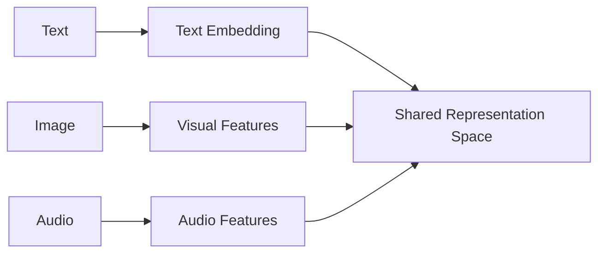

                 

## 1. 背景介绍

在人工智能（AI）领域，大模型（Large Language Models）已经取得了显著的成功，在自然语言处理（NLP）任务中表现出色。然而，现实世界中的信息并不只是存在于文本中，还存在于图像、音频、视频等多种模态中。因此，开发能够处理和理解多模态数据的大模型变得至关重要。本文将探讨多模态大模型的应用前景，其核心概念、算法原理，以及在实际应用中的潜在用途。

## 2. 核心概念与联系

多模态大模型（Multimodal Large Models）是一种能够处理和理解来自不同模态的数据的大型模型。这些模型需要能够理解文本、图像、音频等多种模态的表示，并能够在模态之间进行转换和关联。

### 2.1 多模态表示

多模态表示是指将不同模态的数据转换为共享表示空间的过程。这允许模型在模态之间进行转换和关联。例如，文本可以表示为词嵌入，图像可以表示为视觉特征，音频可以表示为音频特征。这些表示然后可以映射到共享表示空间中。



### 2.2 多模态转换

多模态转换是指将一种模态的表示转换为另一种模态的表示的过程。例如，文本到图像的转换可以生成描述文本内容的图像，图像到文本的转换可以生成描述图像内容的文本。

## 3. 核心算法原理 & 具体操作步骤

### 3.1 算法原理概述

多模态大模型的核心算法原理是基于Transformer架构的模型，该架构已在大型语言模型中取得了成功。多模态大模型扩展了Transformer架构，以处理和理解来自不同模态的数据。

### 3.2 算法步骤详解

1. **表示学习**：首先，每种模态的数据都转换为其表示。这可以通过使用预训练的模型（如CNN、RNN、Transformer）或自监督学习方法来实现。
2. **表示映射**：然后，每种模态的表示都映射到共享表示空间中。这可以通过使用线性层或Transformer编码器来实现。
3. **模态融合**：在共享表示空间中，来自不同模态的表示被合并。这可以通过简单的求和、注意力机制或其他更复杂的方法来实现。
4. **任务特定层**：根据任务，可以添加任务特定的层，如分类器或生成器。
5. **训练**：模型然后在任务数据上进行训练，优化损失函数。

### 3.3 算法优缺点

**优点**：多模态大模型可以处理和理解来自不同模态的数据，这使其能够在需要跨模态理解的任务中表现出色。它们还可以利用来自不同模态的信息进行预测，从而提高模型的泛化能力。

**缺点**：多模态大模型需要大量的计算资源和数据，这限制了其应用领域。此外，它们还面临模态表示学习和模态融合的挑战。

### 3.4 算法应用领域

多模态大模型的应用领域包括但不限于：视觉问答（如VQA），图像描述，文本到图像生成，跨模态推理，情感分析，多模态摘要生成等。

## 4. 数学模型和公式 & 详细讲解 & 举例说明

### 4.1 数学模型构建

设想我们有来自不同模态的数据$x_m$，其中$m$表示模态。每种模态的数据都转换为其表示$z_m$。然后，这些表示被映射到共享表示空间中，并进行模态融合，得到表示$z$。最后，根据任务，可以添加任务特定的层，得到输出$y$。

$$z_m = f_m(x_m)$$
$$z = g(z_1, z_2,..., z_M)$$
$$y = h(z)$$

### 4.2 公式推导过程

推导过程取决于具体的模型架构和任务。例如，在Transformer架构中，表示学习和映射可以通过自注意力机制来实现。模态融合可以通过多头注意力机制来实现。任务特定层的推导过程则取决于任务。

### 4.3 案例分析与讲解

例如，在视觉问答任务中，输入是一张图像和一个问题。图像表示通过预训练的CNN模型学习，问题表示通过预训练的Transformer模型学习。然后，这两个表示都映射到共享表示空间中，并进行模态融合。最后，一个分类器用于预测答案。

## 5. 项目实践：代码实例和详细解释说明

### 5.1 开发环境搭建

开发环境需要安装Python，PyTorch，Transformers库等。具体的安装过程取决于操作系统。

### 5.2 源代码详细实现

以下是一个简单的多模态大模型的Python代码示例。该模型接受文本和图像作为输入，并预测图像的标签。

```python
import torch
from transformers import AutoTokenizer, AutoModel
from torchvision import models, transforms

class MultimodalModel(torch.nn.Module):
    def __init__(self):
        super(MultimodalModel, self).__init__()
        self.text_encoder = AutoModel.from_pretrained('bert-base-uncased')
        self.image_encoder = models.resnet50(pretrained=True)
        self.fc = torch.nn.Linear(1000 + 768, 1000)

    def forward(self, text, image):
        text_embedding = self.text_encoder(text['input_ids'], attention_mask=text['attention_mask'])[0][0]
        image_embedding = self.image_encoder(image)
        embedding = torch.cat((text_embedding, image_embedding), dim=1)
        output = self.fc(embedding)
        return output
```

### 5.3 代码解读与分析

该模型首先使用预训练的BERT模型编码文本，使用预训练的ResNet模型编码图像。然后，这两个表示被合并，并通过一个全连接层进行预测。

### 5.4 运行结果展示

运行结果取决于具体的任务和数据集。在视觉问答任务中，模型的准确性可以作为评估指标。

## 6. 实际应用场景

### 6.1 当前应用

多模态大模型已经在视觉问答，图像描述，文本到图像生成等任务中取得了成功。它们还被用于情感分析，多模态摘要生成等任务。

### 6.2 未来应用展望

未来，多模态大模型有望在更多需要跨模态理解的任务中取得成功。它们还可以用于开发更智能的助手，能够理解和响应来自不同模态的输入。

## 7. 工具和资源推荐

### 7.1 学习资源推荐

- "Multimodal Machine Learning" by Jason Yosinski
- "Multimodal Learning in NLP" by Luke Zettlemoyer and Richard Socher
- "A Survey of Multimodal Learning" by Li et al.

### 7.2 开发工具推荐

- PyTorch
- Transformers library by Hugging Face
- TensorFlow
- PyTorch Lightning

### 7.3 相关论文推荐

- "Multimodal Transformer for Visual Question Answering" by Lu et al.
- "Multimodal Learning with a Joint Embedding Space" by Rongali et al.
- "Multimodal Learning with a Shared Representation Space" by Chen et al.

## 8. 总结：未来发展趋势与挑战

### 8.1 研究成果总结

多模态大模型已经取得了显著的成功，在需要跨模态理解的任务中表现出色。

### 8.2 未来发展趋势

未来，多模态大模型有望在更多需要跨模态理解的任务中取得成功。它们还可以用于开发更智能的助手，能够理解和响应来自不同模态的输入。

### 8.3 面临的挑战

然而，多模态大模型还面临模态表示学习和模态融合的挑战。此外，它们还需要大量的计算资源和数据。

### 8.4 研究展望

未来的研究可以探索新的模态表示学习方法，模态融合方法，以及更有效的训练方法。还可以探索多模态大模型在更多任务中的应用。

## 9. 附录：常见问题与解答

**Q：多模态大模型需要多少计算资源？**

**A**：多模态大模型需要大量的计算资源，这取决于模型的大小和任务的复杂性。通常，它们需要GPU或TPU来进行训练。

**Q：多模态大模型需要多少数据？**

**A**：多模态大模型需要大量的多模态数据来进行训练。数据的质量和多样性也很重要。

**Q：多模态大模型可以处理哪些模态？**

**A**：多模态大模型可以处理和理解来自不同模态的数据，包括但不限于文本，图像，音频，视频等。

## 作者：禅与计算机程序设计艺术 / Zen and the Art of Computer Programming

