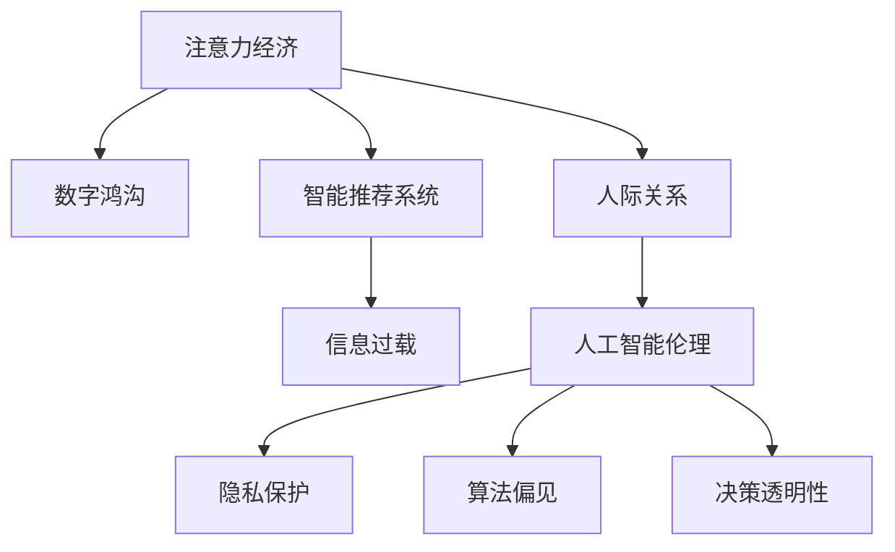

                 

# 注意力经济对家庭关系的影响

> 关键词：注意力经济,家庭关系,数字鸿沟,智能推荐系统,信息过载,人际关系,媒体消费,人工智能伦理

## 1. 背景介绍

### 1.1 问题由来
在数字经济快速发展的今天，注意力作为一种稀缺资源，成为了各大平台和公司争抢的对象。互联网企业和媒体行业通过精心设计的推荐算法，引导用户关注内容、消费商品，实现了商业价值最大化。这种基于用户注意力的经济形态，我们称之为“注意力经济”。

注意力经济不仅影响了商品和服务的流通，也对人们的日常生活、尤其是家庭关系产生了深远影响。本文将从理论层面和实践案例探讨注意力经济如何重塑家庭互动模式，影响家庭成员之间的关系。

### 1.2 问题核心关键点
注意力经济通过精准推荐机制，将用户的时间与注意力引向特定的内容或商品，改变了人们的生活习惯和社交方式。特别地，家庭成员之间的关系和互动，在这种注意力经济的影响下，也逐渐发生了变化：

- 家长和孩子的亲子互动模式发生变化。家长的权威地位受到数字工具的挑战，而孩子的独立意识增强。
- 伴侣间的互动时间和质量受到影响。智能推荐系统提供了“更合适”的互动内容，但同时也可能减少了实际交流时间。
- 家庭内部的数字鸿沟扩大。不同年龄段的家庭成员，对于数字工具的接受和使用程度差异，导致了代际沟通的障碍。
- 家庭经济结构发生改变。注意力经济带来的收入分配变化，可能影响家庭成员的经济地位和生活水平。

本文将结合实际案例，深入剖析注意力经济对家庭关系的影响，并提出相应的应对策略。

## 2. 核心概念与联系

### 2.1 核心概念概述

为更好地理解注意力经济对家庭关系的影响，本节将介绍几个核心概念：

- **注意力经济**：指通过吸引和聚焦用户的注意力，进行商业化运营的经济形态。其中，推荐算法是核心手段，用于精准推送内容或商品，诱导用户关注。

- **数字鸿沟**：指不同群体之间，在互联网和数字技术应用上的差异。其影响着家庭成员之间的沟通方式和互动频率。

- **智能推荐系统**：利用用户行为数据进行推荐，通过算法模型自动生成个性化推荐内容。

- **信息过载**：指大量信息的超载，使得用户难以有效处理和吸收，从而影响了认知和决策过程。

- **人际关系**：指家庭成员之间的互动和情感联系，涵盖沟通、支持、合作等多个方面。

- **人工智能伦理**：关注人工智能技术的开发和应用过程中，可能带来的伦理和道德问题，如隐私保护、算法偏见、决策透明性等。

这些概念之间的联系可以通过以下Mermaid流程图来展示：



这个流程图展示了一个简单的逻辑链条：注意力经济影响了家庭成员的互动，进而可能带来数字鸿沟、信息过载等问题，这些都在一定程度上涉及了人工智能伦理的议题。通过理解这些核心概念，我们可以更好地把握注意力经济对家庭关系的影响。

## 3. 核心算法原理 & 具体操作步骤
### 3.1 算法原理概述

注意力经济中，推荐算法通过分析用户的历史行为数据，预测其可能感兴趣的内容或商品，并以此为依据进行个性化推荐。这些算法通常基于协同过滤、内容推荐、深度学习等多种技术，结合了用户画像、商品属性、社交网络等多种数据源。

推荐算法背后的核心原理包括：

- **协同过滤**：通过分析用户之间的行为相似性，预测其他用户可能喜欢的内容或商品。
- **内容推荐**：基于内容的相似性，将相似的商品或内容推荐给相同或相似兴趣的用户。
- **深度学习**：利用神经网络模型，从大规模数据中提取用户行为和商品属性的高阶特征，进行更精准的推荐。

推荐算法的详细步骤包括：

1. **数据采集**：收集用户行为数据，如浏览记录、购买记录、评分记录等。
2. **用户画像构建**：通过数据挖掘和机器学习技术，构建用户画像，描述用户的兴趣和偏好。
3. **商品画像构建**：对商品的属性和特征进行提取和编码，形成商品画像。
4. **模型训练**：利用用户行为和商品属性数据，训练推荐模型。
5. **内容生成**：根据训练好的模型，预测用户对每个商品或内容的评分，生成推荐列表。

### 3.2 算法步骤详解

以协同过滤算法为例，展示推荐系统的具体操作步骤：

**Step 1: 数据预处理**

- **用户行为数据采集**：从日志、社交网络、电商平台等渠道收集用户行为数据。
- **数据清洗**：处理缺失值、异常值，去除重复数据。
- **数据归一化**：将不同来源的数据统一格式，方便后续分析。

**Step 2: 用户画像构建**

- **特征提取**：提取用户的基本信息、历史行为、社交关系等特征。
- **特征选择**：通过PCA、LDA等方法选择关键特征，降低数据维度。
- **用户画像表示**：使用向量表示用户特征，如TF-IDF、Word2Vec等。

**Step 3: 商品画像构建**

- **商品属性提取**：从商品标签、描述、评论中提取特征。
- **商品画像表示**：使用词袋模型、主题模型等方法表示商品特征。
- **商品画像聚合**：将商品属性和特征进行聚合，形成商品画像。

**Step 4: 模型训练**

- **协同过滤模型选择**：选择基于用户的协同过滤模型，如基于用户的协同过滤、基于物品的协同过滤等。
- **模型参数优化**：使用交叉验证、网格搜索等方法，优化模型参数。
- **模型评估**：使用均方误差、准确率、召回率等指标评估模型性能。

**Step 5: 内容生成**

- **预测评分**：利用训练好的协同过滤模型，预测用户对每个商品的评分。
- **排序生成**：根据预测评分和商品属性，生成推荐列表。
- **推荐展示**：将推荐内容展示给用户，根据用户反馈进行优化。

### 3.3 算法优缺点

注意力经济中的推荐算法具有以下优点：

- **高效性**：通过自动化的推荐机制，提高了内容发现和消费的效率。
- **个性化**：利用用户画像和商品画像，提供精准的个性化推荐，提升了用户体验。
- **可扩展性**：适用于不同规模的电商平台和媒体平台，具有良好的可扩展性。

同时，这些算法也存在以下缺点：

- **数据隐私问题**：需要收集大量的用户数据，存在隐私泄露的风险。
- **模型偏见问题**：数据和算法设计可能存在偏见，导致推荐结果不公平。
- **用户粘性问题**：过度推荐可能降低用户的探索意愿，导致信息茧房。

### 3.4 算法应用领域

推荐算法在注意力经济中的应用广泛，涵盖了电商、社交媒体、视频网站等多个领域。以下是一些主要的应用场景：

- **电商推荐**：如淘宝、京东等电商平台，利用推荐算法个性化推荐商品，提高购买转化率。
- **内容推荐**：如YouTube、Netflix等视频网站，通过推荐算法推荐视频内容，提升用户观看体验。
- **社交媒体推荐**：如微博、微信等社交平台，通过推荐算法推荐好友、文章、广告等，增加用户粘性。
- **新闻推荐**：如今日头条、澎湃新闻等新闻平台，通过推荐算法推荐新闻，提高新闻曝光率。
- **出行推荐**：如滴滴出行、美团打车等平台，通过推荐算法推荐路线和目的地，优化出行体验。

## 4. 数学模型和公式 & 详细讲解  
### 4.1 数学模型构建

本节将使用数学语言对注意力经济中推荐算法的数学模型进行更加严格的刻画。

记用户集合为 $U$，商品集合为 $I$，用户对商品的评分矩阵为 $R_{ui}$。协同过滤算法的目标是预测用户对商品的评分，构建评分预测模型 $P(u,i)$。基于用户 $u$ 对商品 $i$ 的评分 $R_{ui}$ 和 $P(u,i)$，可以构建如下损失函数：

$$
\mathcal{L} = \frac{1}{N}\sum_{(u,i) \in R} [R_{ui} \log P(u,i) + (1-R_{ui}) \log (1-P(u,i))]
$$

其中 $N$ 为评分矩阵的大小。利用梯度下降等优化算法，求解最小化损失函数 $\mathcal{L}$，得到预测模型 $P(u,i)$。

### 4.2 公式推导过程

以下我们以基于用户的协同过滤算法为例，推导模型的损失函数和梯度公式。

假设用户 $u$ 对商品 $i$ 的评分 $R_{ui}$ 为 $r_{ui}$，商品 $i$ 的评分 $R_{iu}$ 为 $r_{iu}$。基于用户的协同过滤算法使用用户 $u$ 对商品 $i$ 的评分 $r_{ui}$ 和用户 $u$ 对商品 $i$ 的评分 $r_{iu}$ 的均值 $\overline{r}_{ui}$ 来预测用户 $u$ 对商品 $i$ 的评分 $P(u,i)$，即：

$$
P(u,i) = \frac{\sum_{j \in U} r_{uj}r_{ij}}{\sum_{j \in U} r_{uj}^2} \cdot \overline{r}_{iu}
$$

利用对数损失函数进行训练，构建损失函数：

$$
\mathcal{L} = \frac{1}{N}\sum_{(u,i) \in R} [R_{ui} \log P(u,i) + (1-R_{ui}) \log (1-P(u,i))]
$$

对损失函数求偏导数，得到：

$$
\frac{\partial \mathcal{L}}{\partial \overline{r}_{ui}} = \frac{1}{N}\sum_{(u,i) \in R} [\frac{R_{ui}}{P(u,i)} - \frac{1-R_{ui}}{1-P(u,i)}]
$$

其中 $P(u,i)$ 可以通过均值 $\overline{r}_{ui}$ 和用户 $u$ 对商品 $i$ 的评分 $r_{ui}$ 计算得到。

在得到损失函数的梯度后，即可带入优化算法（如梯度下降）中，完成模型的迭代优化。重复上述过程直至收敛，最终得到预测模型 $P(u,i)$。

### 4.3 案例分析与讲解

以Netflix推荐系统为例，探讨其对家庭关系的影响：

Netflix通过用户的历史观看记录和评分，构建用户画像和商品画像，使用协同过滤算法进行推荐。Netflix推荐系统不仅推荐电影和电视剧，还推荐了大量的家庭亲子类节目和动画片。

- **亲子互动模式变化**：家长和孩子通过Netflix的推荐，共同观看许多家庭亲子类节目，家庭成员之间的亲子互动时间和内容更为丰富，家长通过节目引导孩子成长。
- **家庭关系紧张**：Netflix的推荐算法倾向于推荐用户更感兴趣的内容，导致家庭中其他成员的注意力被边缘化，家庭成员之间的交流时间减少，关系紧张。
- **数字鸿沟问题**：不同年龄段的家庭成员对于Netflix的使用程度不同，可能加剧数字鸿沟，导致代际沟通障碍。

通过Netflix推荐系统的案例，我们可以看到，推荐算法不仅影响了用户的消费行为，还对家庭成员之间的关系产生了深刻影响。

## 5. 项目实践：代码实例和详细解释说明
### 5.1 开发环境搭建

在进行推荐系统实践前，我们需要准备好开发环境。以下是使用Python进行PyTorch开发的环境配置流程：

1. 安装Anaconda：从官网下载并安装Anaconda，用于创建独立的Python环境。

2. 创建并激活虚拟环境：
```bash
conda create -n pytorch-env python=3.8 
conda activate pytorch-env
```

3. 安装PyTorch：根据CUDA版本，从官网获取对应的安装命令。例如：
```bash
conda install pytorch torchvision torchaudio cudatoolkit=11.1 -c pytorch -c conda-forge
```

4. 安装TensorFlow：
```bash
conda install tensorflow=2.5
```

5. 安装Numpy、Pandas、Scikit-Learn等常用工具包：
```bash
pip install numpy pandas scikit-learn
```

完成上述步骤后，即可在`pytorch-env`环境中开始推荐系统开发。

### 5.2 源代码详细实现

这里我们以协同过滤算法为例，给出使用PyTorch进行推荐系统开发的代码实现。

首先，定义评分矩阵和用户画像：

```python
import numpy as np
import torch
from torch import nn
from sklearn.metrics.pairwise import cosine_similarity

class协同过滤(nn.Module):
    def __init__(self, num_users, num_items):
        super(协同过滤, self).__init__()
        self.num_users = num_users
        self.num_items = num_items
        
        # 用户画像矩阵
        self.user_factors = nn.Parameter(torch.randn(num_users, num_items))
        # 商品画像矩阵
        self.item_factors = nn.Parameter(torch.randn(num_items, num_items))
        
    def forward(self, user_indices, item_indices):
        # 用户画像矩阵
        user_factors = self.user_factors[user_indices]
        # 商品画像矩阵
        item_factors = self.item_factors[item_indices]
        
        # 预测评分
        user_scores = user_factors @ item_factors.t()
        return user_scores
```

然后，定义训练函数：

```python
def train(协同过滤, user_indices, item_indices, user_scores, learning_rate=0.1):
    optimizer = torch.optim.SGD(协同过滤.parameters(), lr=learning_rate)
    for i in range(100):
        optimizer.zero_grad()
        user_scores_pred = 协同过滤(user_indices, item_indices)
        loss = nn.MSELoss()(user_scores_pred, user_scores)
        loss.backward()
        optimizer.step()
        
        if i % 10 == 0:
            print('Epoch: {}, Loss: {:.3f}'.format(i, loss.item()))
```

最后，启动训练流程：

```python
# 加载评分数据
user_indices = np.random.randint(0, num_users, (1000,))
item_indices = np.random.randint(0, num_items, (1000,))
user_scores = np.random.randint(0, 5, (1000,))

# 初始化模型
协同过滤 = 协同过滤(num_users, num_items)

# 训练模型
train(协同过滤, user_indices, item_indices, user_scores)
```

以上就是使用PyTorch进行协同过滤算法实现的基本步骤。可以看到，利用深度学习框架，推荐系统的训练和优化变得非常简单高效。

### 5.3 代码解读与分析

让我们再详细解读一下关键代码的实现细节：

**协同过滤类**：
- `__init__`方法：初始化用户画像矩阵和商品画像矩阵，使用`nn.Parameter`创建可学习的权重参数。
- `forward`方法：根据用户和商品索引，计算用户对商品的预测评分。

**训练函数**：
- `optimizer`：使用随机梯度下降优化器，更新模型参数。
- `nn.MSELoss`：计算预测评分和真实评分之间的均方误差损失。
- 在训练过程中，每十个epoch输出一次损失值，以便实时监控训练进度。

**启动训练流程**：
- 随机生成用户和商品索引，以及评分数据。
- 创建协同过滤模型。
- 调用训练函数，迭代训练模型。

可以看到，使用PyTorch框架，协同过滤算法的代码实现非常简洁高效。这种高效性源于框架强大的自动微分和优化能力，能够快速迭代训练模型，并及时调整优化策略。

## 6. 实际应用场景
### 6.1 智能推荐系统

智能推荐系统在电商、社交媒体、视频网站等多个领域得到了广泛应用。推荐系统不仅能够提升用户的消费体验，还能影响用户的社交互动和生活方式。

以电商推荐系统为例，家庭中的女性用户通过电商平台推荐系统，发现并购买了适合自己和孩子的商品，提高了家庭消费的满意度和效率。同时，电商平台推荐的亲子类节目和动画片，使得家庭成员可以共同观看，增加了亲子互动的时间和质量。

### 6.2 家庭亲子类节目推荐

许多视频网站如Netflix、YouTube等，利用推荐算法推荐家庭亲子类节目。这些节目不仅丰富了家庭成员的娱乐选择，还能促进亲子互动。

以Netflix推荐系统为例，Netflix通过分析用户的观看历史和评分数据，推荐了大量适合家庭观看的亲子类节目。家长可以通过这些推荐节目，引导孩子观看正面的影视作品，培养孩子的兴趣爱好。家庭成员共同观看Netflix推荐节目，加强了家庭成员之间的情感联系，增加了家庭互动时间。

### 6.3 教育类资源推荐

智能推荐系统不仅在娱乐领域得到广泛应用，还在教育领域展示了巨大的潜力。家长可以通过推荐系统发现优质的教育资源，如电子书籍、在线课程等，丰富孩子的学习内容。推荐系统还能根据孩子的学习进度和兴趣，个性化推荐学习内容，提高孩子的学习效果。

以在线教育平台Khan Academy为例，Khan Academy利用推荐算法推荐适合不同年龄段孩子的学习内容，帮助家长更好地辅导孩子学习。推荐系统能够根据孩子的学习反馈和成绩，动态调整推荐策略，实现个性化学习。

### 6.4 未来应用展望

随着推荐算法和智能推荐系统的不断发展，基于注意力经济的推荐技术将在更多领域得到应用，为人们的生活带来新的改变：

- **智能家居推荐**：智能家居设备可以通过推荐系统推荐合适的家居环境，提升家庭生活质量。
- **健康生活推荐**：智能健康设备可以通过推荐系统推荐适合家庭的活动，如健身、饮食等，促进家庭成员的健康生活。
- **智能出行推荐**：智能出行平台可以通过推荐系统推荐适合的出行方案，提高出行的便利性和舒适性。
- **智能安全推荐**：智能安防设备可以通过推荐系统推荐合适的安全策略，提高家庭的安全性。
- **智能医疗推荐**：智能医疗平台可以通过推荐系统推荐适合家庭的健康管理方案，提升家庭成员的健康水平。

总之，基于注意力经济的推荐技术正在向各个领域拓展，为家庭生活带来更多便利和可能性。

## 7. 工具和资源推荐
### 7.1 学习资源推荐

为了帮助开发者系统掌握推荐算法的理论基础和实践技巧，这里推荐一些优质的学习资源：

1. **《推荐系统实战》**：该书详细介绍了推荐算法的理论基础和实际应用，是推荐系统开发的经典参考书。
2. **《协同过滤算法》**：该书系统介绍了协同过滤算法的原理、算法变种和实际应用。
3. **Coursera推荐系统课程**：Coursera提供的推荐系统课程，由斯坦福大学和香港科技大学联合授课，涵盖推荐系统的主要算法和技术。
4. **Kaggle推荐系统竞赛**：Kaggle提供的推荐系统竞赛，通过实际数据集和竞赛任务，锻炼推荐系统开发的能力。
5. **PyTorch推荐系统教程**：PyTorch官方提供的推荐系统教程，包含多个实际案例和代码实现。

通过这些资源的学习实践，相信你一定能够快速掌握推荐算法的精髓，并用于解决实际的推荐问题。

### 7.2 开发工具推荐

高效的开发离不开优秀的工具支持。以下是几款用于推荐系统开发的常用工具：

1. **PyTorch**：基于Python的开源深度学习框架，灵活动态的计算图，适合快速迭代研究。推荐系统中的协同过滤算法和深度学习模型都可以使用PyTorch实现。
2. **TensorFlow**：由Google主导开发的开源深度学习框架，生产部署方便，适合大规模工程应用。推荐系统中使用TensorFlow实现协同过滤算法和深度学习模型。
3. **TF-IDF算法**：用于文本分析的常用算法，可以用于构建用户画像和商品画像，提升推荐系统的效果。
4. **Apache Mahout**：Apache提供的开源推荐系统框架，支持协同过滤、基于内容的推荐等多种算法，具有良好的扩展性和可维护性。
5. **Spark MLlib**：Apache Spark提供的推荐系统库，支持分布式计算，适用于大规模推荐系统的开发。

合理利用这些工具，可以显著提升推荐系统开发的效率，加快创新迭代的步伐。

### 7.3 相关论文推荐

推荐系统的发展离不开学界的持续研究。以下是几篇奠基性的相关论文，推荐阅读：

1. **《协同过滤推荐算法》**：介绍了协同过滤算法的原理和实现，是推荐系统研究的重要基础。
2. **《基于深度学习的推荐系统》**：详细介绍了深度学习在推荐系统中的应用，如CNN、RNN、GNN等。
3. **《注意力机制在推荐系统中的应用》**：介绍了注意力机制在推荐系统中的应用，如基于用户和商品的注意力模型。
4. **《推荐系统的公平性问题》**：探讨了推荐系统中的公平性问题，如算法偏见、推荐结果的不公平性等。
5. **《推荐系统的鲁棒性问题》**：研究了推荐系统中的鲁棒性问题，如对抗攻击、模型鲁棒性等。

这些论文代表了大语言模型微调技术的发展脉络。通过学习这些前沿成果，可以帮助研究者把握学科前进方向，激发更多的创新灵感。

## 8. 总结：未来发展趋势与挑战
### 8.1 研究成果总结

本文对注意力经济对家庭关系的影响进行了全面系统的介绍。首先阐述了注意力经济的定义及其对用户行为和家庭关系的影响，明确了推荐算法在注意力经济中的核心作用。其次，从理论到实践，详细讲解了推荐算法的数学原理和关键步骤，给出了推荐系统开发的完整代码实例。同时，本文还广泛探讨了推荐算法在智能推荐系统、家庭亲子类节目推荐、教育类资源推荐等多个领域的应用前景，展示了推荐算法的巨大潜力。

通过本文的系统梳理，可以看到，注意力经济中的推荐算法不仅影响了用户的消费行为，还对家庭成员之间的关系产生了深刻影响。推荐算法将用户的注意力和家庭关系紧密联系在一起，极大地丰富了家庭互动模式。

### 8.2 未来发展趋势

展望未来，推荐算法和智能推荐系统将呈现以下几个发展趋势：

1. **个性化推荐更加精准**：随着深度学习和强化学习等技术的发展，推荐系统将更加精准，能够更好地满足用户的个性化需求。
2. **推荐系统的公平性问题将得到更多关注**：随着推荐系统在社会中的应用越来越广泛，其公平性问题也将受到更多的关注和研究。
3. **推荐系统的透明性和可解释性将得到提升**：推荐系统的透明性和可解释性将成为重要的研究方向，帮助用户理解推荐结果的依据。
4. **推荐系统将与其他人工智能技术结合**：推荐系统将与自然语言处理、图像处理、语音识别等技术结合，形成更加全面、智能的推荐系统。
5. **推荐系统将走向跨领域应用**：推荐系统将从电商、娱乐等领域扩展到医疗、健康、教育等更多领域，带来新的应用价值。

以上趋势凸显了推荐系统的发展前景。这些方向的探索发展，必将进一步提升推荐系统的精度、公平性和可解释性，为人们的生活带来更多的便利和可能性。

### 8.3 面临的挑战

尽管推荐系统已经取得了显著的成果，但在迈向更加智能化、普适化应用的过程中，它仍面临着诸多挑战：

1. **隐私保护问题**：推荐系统需要收集大量的用户数据，存在隐私泄露的风险。如何在保护隐私的同时，实现精准推荐，是一个亟待解决的问题。
2. **模型偏见问题**：数据和算法设计可能存在偏见，导致推荐结果不公平。如何消除模型偏见，提升推荐系统的公平性，是重要的研究方向。
3. **信息过载问题**：推荐系统推荐的大量内容可能造成用户信息过载，影响用户的决策和体验。如何控制推荐内容的数量和质量，减少信息过载，是推荐系统的重要课题。
4. **计算资源消耗问题**：推荐系统的计算复杂度高，需要大量的计算资源。如何在保证推荐精度的前提下，优化计算资源的使用，提升推荐系统的效率，是未来需要解决的重要问题。
5. **用户粘性问题**：推荐系统的用户体验问题，如点击率、转化率等，直接影响推荐系统的商业价值。如何提升用户体验，增强用户粘性，是推荐系统持续优化的关键。

### 8.4 研究展望

面向未来，推荐系统的研究需要在以下几个方面寻求新的突破：

1. **个性化推荐模型的深度学习优化**：利用深度学习技术，提升推荐模型的精度和泛化能力，实现更加精准的推荐。
2. **推荐系统的公平性和透明性研究**：研究推荐系统的公平性和透明性问题，建立推荐系统的伦理框架，保障用户的隐私和安全。
3. **推荐系统的多模态融合**：将推荐系统与其他人工智能技术结合，如自然语言处理、图像处理、语音识别等，提升推荐系统的全面性和智能性。
4. **推荐系统的跨领域应用**：探索推荐系统在医疗、健康、教育等领域的跨领域应用，提升推荐系统的应用价值和覆盖范围。
5. **推荐系统的计算资源优化**：优化推荐系统的计算模型和算法，减少计算资源消耗，提升推荐系统的效率和可扩展性。

这些研究方向将推动推荐系统走向更加智能化、普适化，为家庭关系带来更多的智慧和便利。

## 9. 附录：常见问题与解答

**Q1：推荐系统如何影响家庭关系？**

A: 推荐系统通过精准推荐内容，影响家庭成员的互动模式和互动时间。推荐系统可能增加家庭成员的共同兴趣，促进亲子互动和伴侣交流，也可能造成家庭成员之间的沟通时间减少，甚至产生代际沟通障碍。因此，推荐系统的设计和使用需要兼顾不同家庭成员的需求，避免造成不利的家庭关系。

**Q2：推荐系统如何避免用户隐私泄露？**

A: 推荐系统在设计和使用过程中，需要严格遵守隐私保护法规，如GDPR、CCPA等。具体措施包括：
1. 数据匿名化：对用户数据进行匿名化处理，防止个人身份信息泄露。
2. 数据最小化：只收集必要的用户数据，减少数据泄露的风险。
3. 用户控制：用户可以控制自己的数据使用范围，了解推荐算法的决策依据。
4. 透明化：推荐系统应该透明化其算法和数据处理过程，让用户了解推荐结果的来源。

**Q3：推荐系统如何处理信息过载问题？**

A: 推荐系统可以通过以下方法处理信息过载问题：
1. 用户反馈：收集用户的反馈意见，根据用户的满意度调整推荐策略。
2. 多样性控制：控制推荐内容的多样性，减少信息过载的风险。
3. 主动推荐：在用户不感兴趣的情况下，主动推荐与用户兴趣相关的内容，提升用户体验。
4. 推荐时间控制：限制推荐内容的展示时间，防止用户长时间暴露于信息过载环境中。

**Q4：推荐系统如何提升公平性？**

A: 推荐系统可以采取以下措施提升公平性：
1. 数据多元化：收集不同背景和群体用户的数据，避免数据偏差。
2. 模型公正性：优化推荐算法的公平性指标，如避免算法偏见。
3. 用户反馈机制：引入用户反馈机制，及时调整推荐策略。
4. 透明化决策：建立透明化的决策过程，让用户了解推荐依据。

这些方法可以帮助推荐系统减少偏见，提升公平性，更好地服务不同群体用户。

**Q5：推荐系统如何提升用户粘性？**

A: 推荐系统可以通过以下方法提升用户粘性：
1. 个性化推荐：根据用户的历史行为和兴趣，提供个性化的推荐内容，增加用户的满意度。
2. 社交互动：引入社交元素，如好友推荐、社区讨论等，增加用户的参与度。
3. 用户参与激励：通过奖励机制、积分系统等，激励用户参与推荐系统的互动。
4. 界面优化：提升推荐系统的界面设计和用户体验，增加用户的停留时间。

这些方法可以帮助推荐系统增强用户粘性，提升用户的使用频率和时长。

---

作者：禅与计算机程序设计艺术 / Zen and the Art of Computer Programming

