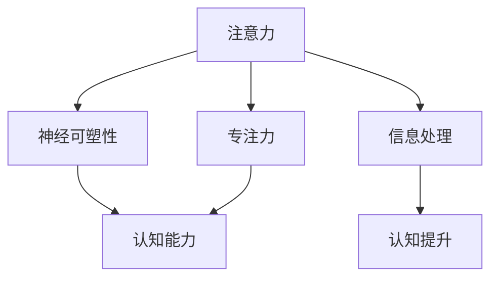

                 

# 注意力训练与大脑增强练习：通过专注力增强认知能力和神经可塑性

## 1. 背景介绍

### 1.1 问题由来
随着信息时代的到来，我们越来越依赖于数字设备和互联网，生活节奏加快，注意力集中困难等问题也日渐突出。这些问题不仅影响了我们的工作效率和生活质量，还可能引发心理问题。近年来，神经科学研究和技术日益成熟，注意力训练作为提升认知能力的手段，逐渐受到关注。

### 1.2 问题核心关键点
注意力训练的核心在于通过有针对性的练习，增强大脑的专注力和神经可塑性，提升认知能力。具体来说，注意力训练通常包括以下几个方面：

- **专注力增强**：通过训练，提高个体在单位时间内的信息处理能力和保持注意力的持久性。
- **神经可塑性改善**：通过重复训练，促进大脑神经元间的连接增强，改善信息传递效率。
- **认知能力提升**：如记忆力、学习能力、问题解决能力等，在训练中逐步提升。

## 2. 核心概念与联系

### 2.1 核心概念概述

为更好地理解注意力训练的原理和应用，本节将介绍几个关键概念及其相互关系：

- **注意力(Attention)**：指在信息处理过程中，集中于当前任务的相关信息，忽略无关信息的心理过程。
- **专注力(Focus)**：指个体在特定时间内，专注于某项任务的能力。
- **神经可塑性(Neural Plasticity)**：指大脑神经元间的连接可以根据外界刺激而改变的过程。
- **认知能力(Cognitive Ability)**：包括记忆力、注意力、学习能力等，是个体进行信息处理的基础能力。

这些概念之间的关系可以通过以下Mermaid流程图来展示：



这个流程图展示了注意力与专注力、神经可塑性、认知能力的关系：

- 注意力通过提高专注力，帮助个体更好地进行信息处理。
- 神经可塑性是注意力训练得以发挥作用的基础，通过训练可以改善大脑连接，提升信息传递效率。
- 认知能力是信息处理和学习的基石，通过注意力训练可以增强认知能力。

## 3. 核心算法原理 & 具体操作步骤
### 3.1 算法原理概述

注意力训练主要通过行为心理学和神经科学的理论基础，设计有针对性的练习，以改善大脑的注意力和认知能力。常见的注意力训练方法包括：

- **基于认知负荷理论的练习**：通过设计需要一定认知负荷的任务，促使大脑资源重新分配，提高信息处理能力。
- **基于正念冥想的练习**：通过训练专注力的技巧，帮助个体提高自我觉察和情绪调节能力。
- **基于游戏化的练习**：通过设计有趣的游戏任务，使注意力训练成为一种娱乐活动，提高参与度。

### 3.2 算法步骤详解

以基于认知负荷理论的练习为例，以下是注意力训练的详细步骤：

**Step 1: 设计认知负荷任务**  
根据认知负荷理论，任务难度和复杂度应适中，既有挑战性又不过于复杂。例如：

- **记忆数字**：列出一组随机数字，要求记忆并回忆。
- **分类排序**：给定一组物品图片，要求根据物品属性分类排序。
- **信息整合**：处理一段复杂文本，提取关键信息并生成摘要。

**Step 2: 执行注意力训练**  
将上述任务作为练习内容，设定训练周期和练习时长，每日练习。例如：

- **记忆数字**：每天练习5组，每组10个数字，计时2分钟。
- **分类排序**：每天练习3组，每组10个物品，计时5分钟。
- **信息整合**：每周练习3次，每次20分钟，提供一段复杂文本，要求生成摘要。

**Step 3: 评估训练效果**  
定期评估训练效果，记录每次练习的准确率和耗时，并根据表现调整任务难度和练习时长。例如：

- **记忆数字**：记录每组的正确率和耗时，难度增加至每组15个数字，耗时延长至3分钟。
- **分类排序**：记录每组的正确率和耗时，难度增加至每组15个物品，耗时延长至10分钟。
- **信息整合**：记录每周的摘要质量和耗时，难度增加至更长、更复杂的文本。

### 3.3 算法优缺点

基于认知负荷理论的注意力训练具有以下优点：

- **针对性训练**：任务设计结合认知负荷理论，有针对性的提升专注力和认知能力。
- **操作简便**：大多数任务不需要特殊设备，只需纸笔或电子设备即可进行。
- **效果显著**：多项研究显示，认知负荷训练能够显著提升记忆力和信息处理能力。

同时，这种训练方法也存在一些缺点：

- **个体差异大**：不同人的认知负荷和注意力能力不同，训练效果存在差异。
- **训练周期长**：训练效果往往需要长期持续进行才能显现。
- **任务单调**：长时间进行同一类型任务可能造成兴趣下降。

### 3.4 算法应用领域

注意力训练在多个领域都有广泛应用，包括但不限于：

- **教育**：通过训练提升学生的认知能力和学习效率，帮助其更好地掌握知识。
- **职场**：提升职业人士的信息处理能力和专注力，提高工作效率和绩效。
- **心理健康**：帮助注意力缺陷障碍(ADD)、多动症(ADHD)等患者改善症状，增强自我管理能力。
- **老年健康**：改善老年人的认知功能，提升生活质量。

## 4. 数学模型和公式 & 详细讲解 & 举例说明

### 4.1 数学模型构建

注意力训练的数学模型主要基于认知负荷理论，通过设计任务难度和复杂度来提升认知能力。假设训练任务为 $T$，训练时长为 $t$，认知负荷为 $C$，训练效果为 $E$。则注意力训练的数学模型可以表示为：

$$
E = f(T, t, C)
$$

其中，$f$ 为训练效果的函数，通过 $T$、$t$ 和 $C$ 的调整，优化训练效果。

### 4.2 公式推导过程

以记忆数字为例，假设每次练习的数字数量为 $N$，记忆时间为 $t$，正确率为 $R$。则训练效果的公式为：

$$
E = R \times \frac{N}{t}
$$

其中，$R$ 表示每组数字的正确率，$N$ 表示每组数字的数量，$t$ 表示每组的练习时间。根据公式，训练效果 $E$ 与正确率 $R$ 成正比，与记忆时间 $t$ 成反比。通过调整 $N$ 和 $t$ 的值，可以优化训练效果。

### 4.3 案例分析与讲解

假设进行记忆数字训练，初始参数为 $N=10$，$t=2$ 分钟，每次练习5组，连续进行一周，每天记录正确率和耗时。根据公式 $E = R \times \frac{N}{t}$，可以得出每天训练效果的评估公式：

$$
E = \frac{R_1 + R_2 + R_3 + R_4 + R_5}{5} \times \frac{10}{2}
$$

其中，$R_i$ 表示第 $i$ 组的正确率。通过每天评估 $E$，可以调整任务难度和练习时长，逐步提升训练效果。

## 5. 项目实践：代码实例和详细解释说明

### 5.1 开发环境搭建

在进行注意力训练的开发时，需要一个基本的开发环境。以下是Python环境搭建的步骤：

1. 安装Python：从官网下载Python安装包，根据系统选择对应版本安装。

2. 安装Python库：安装numpy、pandas、matplotlib等常用库，用于数据处理和可视化。

3. 开发工具：使用Jupyter Notebook进行代码开发，方便进行交互式编程和数据可视化。

### 5.2 源代码详细实现

以下是一个简单的基于认知负荷理论的记忆数字训练代码实现：

```python
import numpy as np
import matplotlib.pyplot as plt
from IPython.display import HTML

# 定义训练参数
N = 10  # 每次记忆的数字数量
t = 2   # 记忆时间，单位为分钟
R = np.zeros((7, 5))  # 记录每次训练的正确率

# 训练过程
for i in range(7):
    for j in range(5):
        # 生成随机数字
        digits = np.random.randint(0, 10, size=N)
        # 记忆并测试
        correct = 0
        for digit in digits:
            if digit in digits[:i+1]:
                correct += 1
        # 记录正确率
        R[i][j] = correct / N
        
# 计算训练效果
E = np.mean(R, axis=1) * N / t
plt.plot(E)
plt.xlabel('训练天数')
plt.ylabel('训练效果')
plt.title('记忆数字训练效果')
plt.show()
```

### 5.3 代码解读与分析

**训练参数定义**：
- `N`：每次记忆的数字数量。
- `t`：记忆时间，单位为分钟。
- `R`：记录每次训练的正确率，形状为 $(训练天数, 每次训练组数)$。

**训练过程**：
- 生成随机数字，并记录每次记忆的正确数量。
- 通过正确数量除以数字总数，计算正确率，并记录到数组 `R` 中。

**训练效果计算**：
- 通过计算每组的平均正确率，乘以数字数量 $N$，除以记忆时间 $t$，得到每天的训练效果 $E$。
- 使用matplotlib库绘制训练效果随时间的变化曲线。

### 5.4 运行结果展示

执行上述代码后，会生成记忆数字训练效果的折线图，展示训练效果随训练天数的变化趋势。

## 6. 实际应用场景

### 6.1 教育领域

在教育领域，注意力训练可以应用于以下场景：

- **课堂教学**：通过设计有认知负荷的任务，提升学生的注意力和信息处理能力，增强课堂教学效果。
- **课后练习**：设计不同类型的练习，帮助学生巩固知识，提高学习效率。
- **考试准备**：通过记忆数字、分类排序等任务，提升学生的信息整合和记忆力，为考试做准备。

### 6.2 职场环境

在职场环境中，注意力训练可以用于以下场景：

- **会议准备**：通过正念冥想和信息整合练习，帮助员工集中注意力，提高会议效率。
- **项目管理**：通过任务分配和优先级排序，提高项目管理的决策能力和执行力。
- **团队协作**：通过团队讨论和问题解决，提升团队成员的信息处理和协作能力。

### 6.3 心理健康

在心理健康领域，注意力训练可以用于以下场景：

- **注意力障碍治疗**：帮助注意力缺陷障碍(ADD)、多动症(ADHD)等患者，通过记忆数字、分类排序等任务，提高自我管理和注意力控制能力。
- **情绪调节**：通过正念冥想和情绪调节练习，帮助个体提升情绪管理能力，减少焦虑和压力。
- **压力缓解**：通过游戏化和放松练习，缓解工作和生活压力，提升心理健康水平。

### 6.4 老年健康

在老年健康领域，注意力训练可以用于以下场景：

- **认知训练**：通过记忆数字、分类排序等任务，提升老年人的认知能力和记忆力。
- **社会参与**：通过游戏化和社交互动，提升老年人的社交能力和情绪状态。
- **生活质量**：通过持续的注意力训练，提升老年人的生活质量和幸福感。

## 7. 工具和资源推荐

### 7.1 学习资源推荐

为了帮助开发者系统掌握注意力训练的理论基础和实践技巧，这里推荐一些优质的学习资源：

1. **认知负荷理论**：了解认知负荷理论的基本概念和应用方法，推荐书籍《认知负荷理论》。
2. **正念冥想**：学习正念冥想的基本技巧和实践方法，推荐App如Headspace、Calm等。
3. **游戏化训练**：设计有趣的游戏化任务，提高训练的趣味性和参与度，推荐平台如Kahoot、Quizlet等。
4. **认知训练应用**：了解市面上已有的认知训练应用，推荐平台如CogniFit、NeuroTrack等。
5. **科研论文**：查阅最新的注意力训练相关科研论文，推荐数据库如Google Scholar、PubMed等。

通过对这些资源的学习实践，相信你一定能够快速掌握注意力训练的精髓，并用于解决实际的认知问题。

### 7.2 开发工具推荐

高效的开发离不开优秀的工具支持。以下是几款用于注意力训练开发的常用工具：

1. **Python**：Python语言简单易学，开源社区庞大，适合进行认知负荷理论和游戏化设计的实现。
2. **Jupyter Notebook**：交互式编程环境，方便进行数据处理和可视化，适合进行注意力训练效果的展示。
3. **Matplotlib**：Python的绘图库，支持丰富的图表类型，适合进行训练效果的可视化展示。
4. **NumPy**：Python的科学计算库，支持高效的数组操作和数学计算，适合进行数据处理和统计分析。
5. **SciPy**：Python的科学计算库，支持更高级的数学计算和优化算法，适合进行模型训练和参数优化。

合理利用这些工具，可以显著提升注意力训练任务的开发效率，加快创新迭代的步伐。

### 7.3 相关论文推荐

注意力训练相关领域的研究十分活跃，以下是几篇具有代表性的论文，推荐阅读：

1. **认知负荷理论**：了解认知负荷理论的基本概念和应用方法，推荐论文《The Role of Cognitive Load Theory in Instructional Design》。
2. **正念冥想**：了解正念冥想的基本原理和应用效果，推荐论文《Mindfulness-Based Stress Reduction and Mindfulness-Based Cognitive Therapy》。
3. **游戏化训练**：了解游戏化训练的基本原理和应用效果，推荐论文《Serious Games as a Tool for Education》。
4. **注意力障碍治疗**：了解注意力障碍的认知训练方法，推荐论文《Cognitive Behavioral Therapy for ADHD》。
5. **老年人认知训练**：了解老年人认知训练的实践方法，推荐论文《Cognitive Training in Older Adults: Current State and Future Directions》。

这些论文代表了注意力训练技术的最新进展，通过学习这些前沿成果，可以帮助研究者把握学科前进方向，激发更多的创新灵感。

## 8. 总结：未来发展趋势与挑战

### 8.1 总结

本文对基于认知负荷理论的注意力训练方法进行了全面系统的介绍。首先阐述了注意力训练的背景和意义，明确了注意力训练在提升认知能力和神经可塑性方面的独特价值。其次，从原理到实践，详细讲解了注意力训练的数学模型和操作步骤，给出了注意力训练任务开发的完整代码实例。同时，本文还广泛探讨了注意力训练方法在教育、职场、心理健康、老年健康等多个领域的应用前景，展示了注意力训练范式的巨大潜力。此外，本文精选了注意力训练技术的各类学习资源，力求为读者提供全方位的技术指引。

通过本文的系统梳理，可以看到，基于认知负荷理论的注意力训练方法正在成为提升认知能力的重要手段，极大地改善了工作和学习效率，促进了心理健康。未来，伴随神经科学和技术的发展，注意力训练技术还将不断进步，为认知能力的提升提供更多有力工具。

### 8.2 未来发展趋势

展望未来，注意力训练技术将呈现以下几个发展趋势：

1. **技术手段多样**：除传统的认知负荷训练外，将引入更多技术手段，如脑波训练、生物反馈等，进一步提升注意力训练效果。
2. **个性化训练**：根据个体的认知特点，设计个性化的训练计划，实现更精准的训练效果。
3. **实时反馈**：通过脑波监测、情绪识别等技术，实时反馈训练效果，优化训练过程。
4. **跨领域应用**：在更多领域（如游戏、娱乐、医疗等）中应用注意力训练，提升整体认知水平。
5. **AI辅助**：引入AI技术，如推荐系统、智能辅导等，实现更加智能化、个性化的训练。

这些趋势凸显了注意力训练技术的广阔前景。这些方向的探索发展，必将进一步提升认知能力，为人类的思维和行为带来深刻变革。

### 8.3 面临的挑战

尽管注意力训练技术已经取得了显著成果，但在迈向更加智能化、普适化应用的过程中，它仍面临着诸多挑战：

1. **个体差异显著**：不同个体的认知特点不同，训练效果差异较大，个性化训练仍需进一步研究。
2. **训练效果参差不齐**：部分人群对训练效果反应不佳，如何提高训练的覆盖面和有效性是一大挑战。
3. **训练时间较长**：注意力训练往往需要较长的训练时间才能见效，如何在短时间内取得显著效果是一大难题。
4. **训练数据不足**：部分训练任务需要大量标注数据，数据获取成本较高，如何降低数据需求是一大挑战。
5. **设备依赖性强**：部分训练任务需要特殊的设备支持，如脑波监测设备，如何降低设备门槛是一大挑战。

这些挑战需要通过多学科协作和技术的不断进步来解决，但无疑将为注意力训练技术的发展提供更多方向和动力。

### 8.4 研究展望

未来的研究需要在以下几个方面寻求新的突破：

1. **多模态训练**：结合视觉、听觉、触觉等多模态信息，提升训练效果和应用场景。
2. **AI辅助设计**：引入AI技术，如自然语言处理、机器学习等，设计更智能化、个性化的训练方案。
3. **跨学科应用**：结合心理学、神经科学、教育学等学科，提升训练方案的科学性和有效性。
4. **长期跟踪**：建立长期跟踪机制，监测训练效果的变化和持续提升。
5. **伦理考量**：在训练设计中引入伦理考量，确保训练过程符合道德规范和法律法规。

这些研究方向的探索，必将引领注意力训练技术迈向更高的台阶，为提升认知能力提供更多有力工具。面向未来，注意力训练技术还需要与其他人工智能技术进行更深入的融合，多路径协同发力，共同推动认知智能的发展。

## 9. 附录：常见问题与解答

**Q1: 注意力训练和正念冥想有什么区别？**

A: 注意力训练和正念冥想是两种不同的认知训练方法。注意力训练主要通过设计任务，增强个体的注意力和信息处理能力；正念冥想则通过冥想训练，提高个体的自我觉察和情绪调节能力。两种方法相互补充，共同提升个体的认知水平。

**Q2: 注意力训练是否需要专业的教练指导？**

A: 专业的教练指导可以更好地帮助个体进行训练，避免训练过程中的误区和偏差。但并非每个人都需要专业教练，通过学习和自我训练，同样可以实现注意力训练的效果。

**Q3: 注意力训练的效果如何评估？**

A: 注意力训练的效果可以通过多种指标进行评估，如注意力持续性、信息处理速度、记忆能力、情绪调节能力等。通过定期记录和分析这些指标，可以评估训练效果，并调整训练方案。

**Q4: 注意力训练是否可以随时随地进行？**

A: 大多数注意力训练任务不需要特殊设备，可以在家中或办公室进行。但部分高级训练任务（如脑波训练）可能需要特定的设备支持，一般应在专业场所进行。

**Q5: 注意力训练是否适用于所有人群？**

A: 注意力训练对大多数人群都有一定的效果，但效果因人而异。对于某些特殊人群（如ADHD患者），注意力训练可以显著改善症状，但对于其他人群，效果可能不明显。

---

作者：禅与计算机程序设计艺术 / Zen and the Art of Computer Programming

