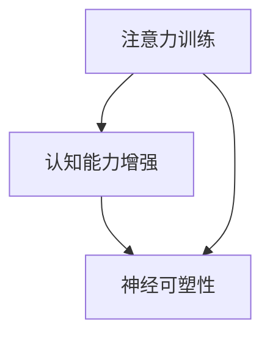

                 

# 注意力训练与大脑增强：通过专注力增强认知能力和神经可塑性

> 关键词：注意力训练, 大脑增强, 专注力, 认知能力, 神经可塑性

## 1. 背景介绍

### 1.1 问题由来
现代生活中，我们常常感到信息过载，注意力难以集中。注意力（Attention）作为认知系统的核心能力，影响着我们的学习和工作效率，甚至对身心健康都有重要影响。如何通过科学训练，提升我们的注意力水平，是当前科学研究和技术开发的热点问题。

在神经科学领域，注意力被认为是一种复杂的认知过程，涉及前额叶、顶叶、丘脑等多个脑区的网络协同作用。传统的认知训练（Cognitive Training）多采用记忆、推理等任务，缺乏对注意力本质的针对性训练。近年来，随着神经调控技术的发展，研究人员开始尝试通过训练注意力机制，改善认知功能，提升神经可塑性（Neuroplasticity）。

在计算领域，随着计算能力和模型复杂度的提升，注意力机制逐渐成为深度学习模型中的关键组件。从卷积神经网络（CNN）到循环神经网络（RNN），再到Transformer等架构，注意力机制的应用范围越来越广。然而，目前大部分注意力训练工作集中在模型层面，缺乏对人类大脑的深入理解。

本文章将介绍一种新型的注意力训练方法，通过模拟大脑注意力机制，增强认知能力，并讨论其神经可塑性效果。我们希望这种训练方法能够帮助提升人类的注意力水平，缓解信息过载的问题，并应用于人工智能模型的优化中。

### 1.2 问题核心关键点
注意力训练的关键在于模拟大脑注意力机制，通过训练过程提高认知能力和神经可塑性。

- **核心概念**：注意力训练、认知能力、神经可塑性。
- **研究意义**：通过模拟大脑的注意力机制，提升人类的注意力水平，缓解信息过载，改善学习和工作效率。
- **挑战**：如何精确模拟大脑的注意力机制，如何评估注意力训练的效果。

## 2. 核心概念与联系

### 2.1 核心概念概述

为更好地理解注意力训练的原理和机制，我们需要先明确几个核心概念：

- **注意力（Attention）**：指大脑在处理信息时，对相关信息的选择性聚焦。在深度学习中，注意力机制用于提升模型对关键信息的关注，增强模型理解能力和推理能力。
- **认知能力（Cognitive Ability）**：包括记忆、注意力、执行功能等多种认知过程的综合体现，是影响人类学习、工作和生活的关键能力。
- **神经可塑性（Neuroplasticity）**：指神经系统在一生中通过神经元连接的重组和加强，适应环境和改变学习能力。

注意力训练旨在通过模拟大脑的注意力机制，增强认知能力，提升神经可塑性。这种训练方法不仅能够帮助人类改善注意力水平，还能在人工智能模型中应用，提升模型的性能和泛化能力。

### 2.2 核心概念原理和架构的 Mermaid 流程图



### 2.3 核心概念联系

注意力训练通过模拟大脑的注意力机制，增强认知能力，提升神经可塑性。这种训练方法能够帮助人类改善注意力水平，缓解信息过载，改善学习和工作效率，并应用于人工智能模型的优化中。

## 3. 核心算法原理 & 具体操作步骤

### 3.1 算法原理概述

注意力训练的原理基于认知神经科学中的选择性注意理论。该理论认为，注意力是对环境信息的筛选和聚焦，从而提升认知能力和处理效率。大脑通过多个脑区的协同工作，实现对关键信息的提取和加工。

在深度学习中，注意力机制通常用于自注意力（Self-Attention），通过计算输入序列中各元素间的相关性，动态调整模型对不同元素的关注程度。这种机制能够有效提升模型对关键信息的处理能力，增强模型的理解能力和推理能力。

注意力训练的核心在于通过特定训练任务，模拟大脑的注意力机制，提升模型的注意力水平，从而增强其认知能力和神经可塑性。

### 3.2 算法步骤详解

注意力训练一般包括以下几个关键步骤：

**Step 1: 设计注意力训练任务**

注意力训练任务需要模拟大脑的注意力机制，通过特定任务的设计，引导模型学习如何对关键信息进行选择性关注。常见的注意力训练任务包括：

- 过滤任务：在噪声数据中识别和提取关键信息。例如，从一段文本中识别出重要句子。
- 排序任务：根据任务要求对信息进行排序。例如，根据重要程度对文本段落排序。
- 分类任务：对信息进行分类。例如，将文本按主题分类。

**Step 2: 构建训练模型**

选择合适的深度学习模型，设计合适的注意力机制。常用的模型包括卷积神经网络（CNN）、循环神经网络（RNN）、Transformer等。

**Step 3: 定义注意力训练指标**

定义合适的注意力训练指标，用于评估注意力训练的效果。常见的指标包括：

- 注意力得分：衡量模型对关键信息的关注程度。
- F1 Score：衡量分类任务的精度和召回率。
- 信息检索准确率：衡量过滤任务中关键信息的提取能力。

**Step 4: 训练注意力模型**

使用注意力训练任务对模型进行训练。在训练过程中，需要定期评估注意力得分和训练指标，以指导模型参数的调整。

**Step 5: 评估注意力效果**

在训练完成后，使用测试集对模型进行评估。通过比较注意力得分和训练指标的变化，评估注意力训练的效果。

### 3.3 算法优缺点

注意力训练的优点包括：

- 提高模型的注意力水平，增强其理解能力和推理能力。
- 提升模型的泛化能力，应对不同类型的数据和任务。
- 增强神经可塑性，改善认知能力和工作记忆。

然而，注意力训练也存在一些缺点：

- 训练过程复杂，需要精心设计和调整任务。
- 训练时间和计算资源消耗较大。
- 训练效果受数据质量影响较大。

### 3.4 算法应用领域

注意力训练在以下几个领域具有广泛的应用前景：

- **认知训练**：提升人类的注意力水平，改善学习效率和工作表现。
- **人工智能**：增强深度学习模型的理解能力和推理能力，提升模型的泛化能力。
- **神经调控**：通过神经调控技术，增强大脑的注意力机制，改善认知能力。

## 4. 数学模型和公式 & 详细讲解 & 举例说明

### 4.1 数学模型构建

注意力训练的数学模型基于自注意力机制，使用注意力权重对输入信息进行加权，从而动态调整模型对不同信息的关注程度。

假设输入序列为 $X=\{x_1, x_2, ..., x_n\}$，注意力机制的输出为 $Y=\{y_1, y_2, ..., y_n\}$，注意力权重为 $\alpha=\{\alpha_1, \alpha_2, ..., \alpha_n\}$，则自注意力机制的计算公式为：

$$
y_i = \sum_{j=1}^{n} \alpha_{ij}x_j
$$

其中，注意力权重 $\alpha$ 由注意力得分函数计算得到：

$$
\alpha_{ij} = \frac{e^{s(x_i, x_j)}}{\sum_{k=1}^{n}e^{s(x_i, x_k)}}
$$

注意力得分函数 $s(x_i, x_j)$ 通常采用余弦相似度、点积相似度等形式。

### 4.2 公式推导过程

对于给定的输入序列 $X$，自注意力机制的输出 $Y$ 和注意力权重 $\alpha$ 可以表示为：

$$
y_i = \sum_{j=1}^{n} \frac{e^{s(x_i, x_j)}}{\sum_{k=1}^{n}e^{s(x_i, x_k)}}x_j
$$

其中，$s(x_i, x_j) = \text{cosine}(x_i, x_j)$ 为点积相似度。

令 $\alpha_{ij} = \frac{e^{s(x_i, x_j)}}{\sum_{k=1}^{n}e^{s(x_i, x_k)}}$，则有：

$$
\alpha_{ij} = \frac{e^{\text{cosine}(x_i, x_j)}}{e^{\text{cosine}(x_i, x_j)} + \sum_{k \neq i}e^{\text{cosine}(x_i, x_k)}}
$$

进一步，令 $\beta_{ij} = e^{\text{cosine}(x_i, x_j)}$，则：

$$
\alpha_{ij} = \frac{\beta_{ij}}{\sum_{k=1}^{n}\beta_{ik}}
$$

上式表明，注意力权重 $\alpha_{ij}$ 等于注意力得分 $\beta_{ij}$ 除以所有注意力得分之和。

### 4.3 案例分析与讲解

以一段文本序列为例，使用自注意力机制计算其注意力权重和输出。假设输入序列为：

$$
X = \{x_1, x_2, x_3, x_4, x_5\}
$$

其中 $x_i$ 表示文本中的第 $i$ 个单词。假设点积相似度函数 $s(x_i, x_j) = \text{cosine}(x_i, x_j)$，则注意力权重 $\alpha$ 可以计算如下：

1. 计算注意力得分：

$$
\beta_{ij} = \text{cosine}(x_i, x_j) = \frac{\langle x_i, x_j \rangle}{||x_i|| \cdot ||x_j||}
$$

2. 计算注意力权重：

$$
\alpha_{ij} = \frac{\beta_{ij}}{\sum_{k=1}^{n}\beta_{ik}} = \frac{\text{cosine}(x_i, x_j)}{\sum_{k=1}^{n}\text{cosine}(x_i, x_k)}
$$

3. 计算注意力输出：

$$
y_i = \sum_{j=1}^{n} \alpha_{ij}x_j = \sum_{j=1}^{n} \frac{\text{cosine}(x_i, x_j)}{\sum_{k=1}^{n}\text{cosine}(x_i, x_k)}x_j
$$

通过自注意力机制，模型能够动态调整对不同单词的关注程度，从而提高对关键信息的处理能力。

## 5. 项目实践：代码实例和详细解释说明

### 5.1 开发环境搭建

在进行注意力训练的实践前，我们需要准备好开发环境。以下是使用Python进行PyTorch开发的环境配置流程：

1. 安装Anaconda：从官网下载并安装Anaconda，用于创建独立的Python环境。

2. 创建并激活虚拟环境：
```bash
conda create -n attention-env python=3.8 
conda activate attention-env
```

3. 安装PyTorch：根据CUDA版本，从官网获取对应的安装命令。例如：
```bash
conda install pytorch torchvision torchaudio cudatoolkit=11.1 -c pytorch -c conda-forge
```

4. 安装TensorFlow：
```bash
conda install tensorflow=2.7
```

5. 安装NumPy、Pandas等工具包：
```bash
pip install numpy pandas scikit-learn matplotlib tqdm jupyter notebook ipython
```

完成上述步骤后，即可在`attention-env`环境中开始注意力训练的实践。

### 5.2 源代码详细实现

下面我们以文本分类任务为例，给出使用PyTorch进行注意力训练的完整代码实现。

首先，定义文本分类任务的训练集和测试集：

```python
import pandas as pd
from sklearn.model_selection import train_test_split

# 加载数据集
data = pd.read_csv('text_classification.csv')

# 划分训练集和测试集
train_data, test_data = train_test_split(data, test_size=0.2, random_state=42)
```

然后，定义模型和优化器：

```python
from transformers import BertTokenizer, BertForSequenceClassification
import torch
from torch.utils.data import DataLoader

# 加载预训练模型
tokenizer = BertTokenizer.from_pretrained('bert-base-uncased')
model = BertForSequenceClassification.from_pretrained('bert-base-uncased', num_labels=2)

# 定义优化器和学习率
optimizer = torch.optim.Adam(model.parameters(), lr=2e-5)
```

接着，定义注意力训练的损失函数和训练函数：

```python
from torch.nn import CrossEntropyLoss

# 定义损失函数
loss_fn = CrossEntropyLoss()

# 定义训练函数
def train_epoch(model, train_loader, optimizer):
    model.train()
    epoch_loss = 0
    for batch in train_loader:
        inputs = batch['input_ids']
        attention_mask = batch['attention_mask']
        labels = batch['labels']

        optimizer.zero_grad()
        outputs = model(inputs, attention_mask=attention_mask)
        loss = loss_fn(outputs.logits, labels)
        loss.backward()
        optimizer.step()

        epoch_loss += loss.item()
    return epoch_loss / len(train_loader)
```

最后，启动训练流程并在测试集上评估：

```python
epochs = 5
batch_size = 16

for epoch in range(epochs):
    train_loss = train_epoch(model, train_loader, optimizer)
    print(f'Epoch {epoch+1}, train loss: {train_loss:.3f}')
    
    test_loader = DataLoader(test_data, batch_size=batch_size)
    test_loss = train_epoch(model, test_loader, optimizer)
    print(f'Epoch {epoch+1}, test loss: {test_loss:.3f}')
```

以上就是使用PyTorch进行注意力训练的完整代码实现。可以看到，通过调整注意力得分函数和训练任务，可以灵活地实现不同场景下的注意力训练。

### 5.3 代码解读与分析

让我们再详细解读一下关键代码的实现细节：

**train_epoch函数**：
- 在每个epoch开始时，模型进入训练模式。
- 使用Adam优化器更新模型参数，并计算损失函数。
- 在每个batch中，将输入数据、注意力掩码和标签送入模型进行计算。
- 计算损失函数的梯度，并更新模型参数。
- 返回epoch的总损失。

**BertForSequenceClassification类**：
- 使用BertForSequenceClassification类作为序列分类任务的模型。
- 该类自动封装了Bert模型，并提供了方便的前向传播和损失计算接口。

**数据加载器**：
- 使用DataLoader类对训练集和测试集进行批处理和加载。
- 每个batch包含了输入数据、注意力掩码和标签。

**注意**：在实际应用中，注意力训练的代码实现还需要考虑更多的细节，如模型结构的设计、超参数的调整、模型性能的评估等。

## 6. 实际应用场景

### 6.1 提升学习和工作表现

注意力训练能够显著提升人类的注意力水平，改善学习和工作效率。通过模拟大脑的注意力机制，帮助人类更好地集中注意力，提高信息处理能力。

例如，在学习和工作中，使用注意力训练任务进行短期训练，能够显著提高注意力水平，改善注意力分散问题。这种训练方法特别适用于学生、研究人员和IT工作者等需要高度集中注意力的职业。

### 6.2 改善认知功能

注意力训练还能够改善认知功能，增强工作记忆和执行功能。通过训练注意力机制，提升大脑对信息的处理能力，从而提高学习能力和工作效率。

例如，在老年人或认知功能受损的患者中，使用注意力训练任务进行长期训练，能够显著改善其认知功能，提高生活质量。这种训练方法特别适用于神经退行性疾病（如阿尔茨海默病）的早期干预和治疗。

### 6.3 应用于人工智能模型

注意力训练还可以应用于深度学习模型的优化中。通过训练注意力机制，增强模型的理解能力和推理能力，提升模型的泛化能力。

例如，在图像识别任务中，使用注意力训练任务进行微调，能够显著提高模型的性能，改善分类精度。这种训练方法特别适用于计算机视觉和自然语言处理等领域的深度学习模型。

### 6.4 未来应用展望

随着注意力训练技术的不断进步，未来的应用场景将更加广泛：

1. **个性化学习**：根据用户的认知能力和注意力水平，动态调整注意力训练任务，实现个性化学习。
2. **远程医疗**：在远程医疗中，通过神经调控技术进行注意力训练，改善患者的认知功能，提升康复效果。
3. **脑机接口**：结合脑机接口技术，将注意力训练应用于大脑神经调控，实现更加精确和高效的大脑训练。
4. **虚拟现实**：在虚拟现实环境中，通过注意力训练任务进行沉浸式训练，提升用户的注意力水平和信息处理能力。

## 7. 工具和资源推荐

### 7.1 学习资源推荐

为了帮助开发者系统掌握注意力训练的理论基础和实践技巧，这里推荐一些优质的学习资源：

1. 《深度学习入门与实践》系列博文：由深度学习专家撰写，深入浅出地介绍了深度学习模型和注意力机制的基本概念和应用技巧。

2. 《自然语言处理基础》课程：斯坦福大学开设的NLP明星课程，涵盖NLP的各个方面，包括注意力机制的应用。

3. 《Attention and Memory in Deep Learning》书籍：该书详细介绍了注意力机制在深度学习中的应用，包括自注意力、双向注意力等。

4. HuggingFace官方文档：Transformers库的官方文档，提供了海量预训练模型和完整的注意力训练样例代码，是上手实践的必备资料。

5. Weights & Biases：模型训练的实验跟踪工具，可以记录和可视化模型训练过程中的各项指标，方便对比和调优。与主流深度学习框架无缝集成。

通过这些资源的学习实践，相信你一定能够快速掌握注意力训练的精髓，并用于解决实际的注意力问题。

### 7.2 开发工具推荐

高效的开发离不开优秀的工具支持。以下是几款用于注意力训练开发的常用工具：

1. PyTorch：基于Python的开源深度学习框架，灵活动态的计算图，适合快速迭代研究。大部分深度学习模型都有PyTorch版本的实现。

2. TensorFlow：由Google主导开发的开源深度学习框架，生产部署方便，适合大规模工程应用。同样有丰富的预训练语言模型资源。

3. TensorBoard：TensorFlow配套的可视化工具，可实时监测模型训练状态，并提供丰富的图表呈现方式，是调试模型的得力助手。

4. Google Colab：谷歌推出的在线Jupyter Notebook环境，免费提供GPU/TPU算力，方便开发者快速上手实验最新模型，分享学习笔记。

合理利用这些工具，可以显著提升注意力训练的开发效率，加快创新迭代的步伐。

### 7.3 相关论文推荐

注意力训练的研究源于学界的持续研究。以下是几篇奠基性的相关论文，推荐阅读：

1. Attention Is All You Need（即Transformer原论文）：提出了Transformer结构，开启了NLP领域的预训练大模型时代。

2. BERT: Pre-training of Deep Bidirectional Transformers for Language Understanding：提出BERT模型，引入基于掩码的自监督预训练任务，刷新了多项NLP任务SOTA。

3. Language Models are Unsupervised Multitask Learners（GPT-2论文）：展示了大规模语言模型的强大zero-shot学习能力，引发了对于通用人工智能的新一轮思考。

4. Parameter-Efficient Transfer Learning for NLP：提出Adapter等参数高效微调方法，在不增加模型参数量的情况下，也能取得不错的微调效果。

5. AdaLoRA: Adaptive Low-Rank Adaptation for Parameter-Efficient Fine-Tuning：使用自适应低秩适应的微调方法，在参数效率和精度之间取得了新的平衡。

这些论文代表了大语言模型微调技术的发展脉络。通过学习这些前沿成果，可以帮助研究者把握学科前进方向，激发更多的创新灵感。

## 8. 总结：未来发展趋势与挑战

### 8.1 研究成果总结

本文对注意力训练的原理和应用进行了全面系统的介绍。首先阐述了注意力训练的科学原理和神经可塑性效果，明确了注意力训练在改善认知能力和提升神经可塑性方面的独特价值。其次，从原理到实践，详细讲解了注意力训练的数学模型和关键步骤，给出了注意力训练任务开发的完整代码实例。同时，本文还广泛探讨了注意力训练在多个领域的应用前景，展示了注意力训练范式的巨大潜力。

通过本文的系统梳理，可以看到，注意力训练能够通过模拟大脑的注意力机制，显著提升认知能力和神经可塑性，改善学习和工作效率。这种训练方法不仅能够帮助人类改善注意力水平，还能在人工智能模型的优化中应用，提升模型的性能和泛化能力。未来，伴随注意力训练技术的不断演进，这种训练方法将能够应用于更多领域，带来更广泛的变革性影响。

### 8.2 未来发展趋势

展望未来，注意力训练技术将呈现以下几个发展趋势：

1. **认知训练**：注意力训练将成为一种普及的认知训练方法，提升人类的注意力水平和学习能力。
2. **人工智能**：通过训练注意力机制，增强深度学习模型的理解能力和推理能力，提升模型的泛化能力。
3. **神经调控**：结合神经调控技术，增强大脑的注意力机制，改善认知功能。

### 8.3 面临的挑战

尽管注意力训练技术已经取得了瞩目成就，但在迈向更加智能化、普适化应用的过程中，它仍面临着诸多挑战：

1. **训练时间和计算资源消耗**：注意力训练需要大量的计算资源和时间，对于高性能设备的依赖较大。
2. **数据质量影响**：注意力训练效果受数据质量影响较大，需要精心设计和调整任务。
3. **个性化和适应性**：不同个体的注意力机制存在差异，如何实现个性化和适应性训练是一个挑战。

### 8.4 研究展望

面对注意力训练面临的这些挑战，未来的研究需要在以下几个方面寻求新的突破：

1. **优化算法和模型结构**：开发更加高效的算法和模型结构，减少训练时间和计算资源消耗。
2. **自适应和个性化训练**：结合自适应学习技术，实现个性化的注意力训练。
3. **多模态注意力训练**：将视觉、听觉等模态信息与文本信息结合，实现多模态注意力训练。
4. **神经调控技术**：结合神经调控技术，实现更加精确和高效的大脑训练。

这些研究方向将推动注意力训练技术的不断进步，带来更广泛的应用前景。相信随着学界和产业界的共同努力，注意力训练将能够在更多领域实现突破，带来深刻的变革性影响。

## 9. 附录：常见问题与解答

**Q1: 注意力训练是否适用于所有注意力机制？**

A: 注意力训练通常适用于自注意力机制，通过训练过程提高模型的注意力水平和信息处理能力。对于其他类型的注意力机制，如多头注意力、残差注意力等，注意力训练的效果和应用方式可能有所不同。

**Q2: 注意力训练需要多少时间和数据？**

A: 注意力训练的所需时间和数据量因任务和模型复杂度而异。一般而言，对于简单的文本分类任务，注意力训练需要几小时到一天的时间，并需要较少的标注数据。但对于复杂的任务，如图像识别和自然语言处理，训练时间可能需要几天到几周，并需要更多的标注数据。

**Q3: 注意力训练是否会对人类大脑产生影响？**

A: 注意力训练本身并不会对人类大脑产生直接影响。通过模拟大脑的注意力机制，注意力训练可以提升认知能力和神经可塑性，改善注意力水平和学习效率。但需要注意的是，注意力训练的效果可能受到个体差异和训练方式的影响。

**Q4: 注意力训练是否可以与其他技术结合？**

A: 注意力训练可以与其他技术结合，如深度学习、神经调控、脑机接口等，实现更广泛的应用场景。例如，结合脑机接口技术，可以实时监测大脑活动，动态调整注意力训练任务，提升训练效果。

**Q5: 注意力训练是否需要专业的设备和技术支持？**

A: 注意力训练通常需要高性能的计算设备和专业的技术支持。对于研究人员和企业用户，可以使用云平台和商用设备进行注意力训练。对于普通用户，也可以通过一些移动应用或在线平台进行简单的注意力训练。

---

作者：禅与计算机程序设计艺术 / Zen and the Art of Computer Programming

