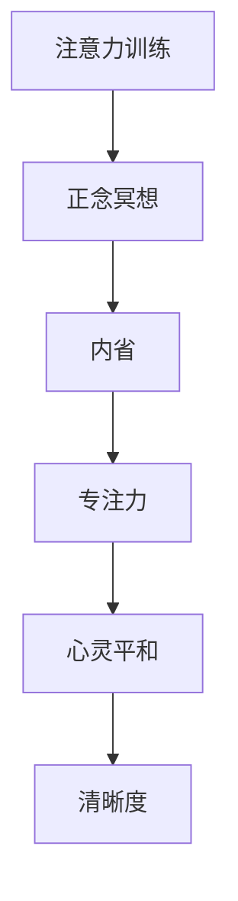

                 

# 注意力训练与正念冥想：通过内省和专注增强心灵平和与清晰度

> 关键词：注意力训练, 正念冥想, 内省, 专注力, 心灵平和, 清晰度

## 1. 背景介绍

### 1.1 问题由来
在快节奏的现代社会中，人们常常面临来自工作、学习、生活等多方面的压力。在忙碌与紧张中，人们的心灵可能会变得焦虑、迷茫和疲惫，难以保持平和与清晰。这些负面情绪不仅影响身心健康，还可能对工作和生活的质量产生负面影响。

为了应对这些挑战，近年来，注意力训练和正念冥想作为一种有效的心理健康调节方法，逐渐受到重视。它们不仅被广泛应用于心理健康治疗，还成为许多人日常生活中的重要组成部分。

### 1.2 问题核心关键点
注意力训练和正念冥想的核心在于通过内省和专注的练习，提高个体对自身情绪和思维的控制力，进而增强心灵的平和与清晰度。这需要人们在日常生活中有意识地进行练习，并通过科学的方法进行训练，以达到长期的效果。

### 1.3 问题研究意义
通过深入研究注意力训练和正念冥想的原理、技术和应用，可以：
1. **提升心理健康**：帮助人们缓解焦虑、压力等负面情绪，提高自我觉知和情绪管理能力。
2. **改善工作和生活质量**：通过提高专注力和工作效率，增强生活的掌控感和满意度。
3. **推动科技发展**：为人工智能和脑机接口等新兴技术的发展提供理论支持，如通过脑波分析技术监测注意力和情绪状态。
4. **普及心理健康知识**：提高公众对心理健康重要性的认识，推动心理健康的社会化普及。

## 2. 核心概念与联系

### 2.1 核心概念概述

注意力训练和正念冥想是两种紧密相关的心理调节方法，旨在通过系统的训练提升个体的心理韧性。它们的核心概念和联系可以通过以下Mermaid流程图来展示：



这个流程图展示了两者的逻辑关系：
1. **注意力训练**：通过一系列注意力提升的练习，帮助个体集中注意力，减少分心。
2. **正念冥想**：通过静坐冥想，培养个体对当下状态的觉知和接受，减少负面情绪。
3. **内省**：通过对自身的深度反思，提高对情绪和思维模式的认识，增强自我觉知。
4. **专注力**：通过提高对任务和环境的专注度，提升工作和生活效率。
5. **心灵平和**：通过减少负面情绪，提高心理稳定性，增强幸福感。
6. **清晰度**：通过减少思维杂乱，提高决策和行动的明确性。

这些概念共同构成了注意力训练和正念冥想的整体框架，使人们能够通过系统的练习提升心理韧性。

## 3. 核心算法原理 & 具体操作步骤
### 3.1 算法原理概述

注意力训练和正念冥想的原理主要基于认知神经科学和心理学研究的成果。它们通过一系列科学的训练方法，改变大脑的神经活动模式，提升个体的注意力和情绪调节能力。

从神经科学的角度来看，注意力训练和正念冥想主要激活了大脑的前额叶皮层、顶叶皮层和杏仁核等区域，这些区域与注意力的分配、情绪的调节和自我觉知等密切相关。

### 3.2 算法步骤详解

#### 3.2.1 注意力训练

1. **准备环境**：选择一个安静、舒适的环境，确保不会被打扰。
2. **选择任务**：选择一些简单、重复性高的任务，如简单的计算、阅读短文等，以集中注意力。
3. **设定时间**：一般每次练习15-30分钟，根据个人情况逐渐增加练习时间。
4. **练习方法**：
   - **集中注意**：在任务中集中注意力，尽量不被外界干扰，如手机消息、外界噪音等。
   - **分心记录**：一旦分心，记录下分心的时间和原因，并在下一次练习中加以改进。
   - **返回任务**：分心后迅速回到任务中，继续集中注意力。

#### 3.2.2 正念冥想

1. **准备环境**：选择一个安静、舒适的环境，确保不会被打扰。
2. **选择姿势**：可以坐在椅子上或坐垫上，保持脊柱挺直，双手自然放置。
3. **设定时间**：一般每次练习15-30分钟，根据个人情况逐渐增加练习时间。
4. **练习方法**：
   - **呼吸观察**：注意自己的呼吸，感受每一次吸气和呼气，尽量让呼吸自然流畅。
   - **觉知当下**：注意当下的感受，如身体接触、环境声音等，但不对其做出评判。
   - **处理思维**：一旦思维飘远，温柔地带回当下，回到呼吸的观察中。

### 3.3 算法优缺点

#### 3.3.1 优点

1. **广泛适用**：适用于各个年龄段和不同职业的人，不需要特殊设备。
2. **简单易行**：不需要复杂的工具或环境，可以随时随地进行。
3. **效果显著**：通过系统的训练，可以在短时间内显著提升注意力和情绪调节能力。
4. **科学支持**：有大量科学研究证明其有效性，广泛应用于心理健康治疗。

#### 3.3.2 缺点

1. **需要坚持**：需要长期的练习才能见效，过程中可能会遇到挫折。
2. **效果个体差异**：不同的个体对训练的反应不同，效果可能因人而异。
3. **依赖自我管理**：训练效果很大程度上依赖个人的自我管理能力和坚持度。

### 3.4 算法应用领域

注意力训练和正念冥想不仅在心理健康领域得到广泛应用，还逐渐被应用于以下几个领域：

1. **工作和学习**：通过提高专注力和减少分心，提升工作效率和学习成绩。
2. **教育和培训**：在教师和教练的指导下，帮助学生和学员提升注意力和情绪调节能力。
3. **企业人力资源**：应用于企业员工的心理健康管理，提升整体的工作满意度和生产力。
4. **体育训练**：通过提高运动员的专注力和心理韧性，提升运动表现和比赛成绩。
5. **艺术创作**：艺术家和创作者通过注意力训练和正念冥想，提高创作过程中的专注力和创造力。

## 4. 数学模型和公式 & 详细讲解 & 举例说明

### 4.1 数学模型构建

注意力训练和正念冥想的核心在于通过科学的训练方法，改变大脑的神经活动模式。其主要基于认知神经科学的研究成果，以下是一些常见的数学模型和公式。

#### 4.1.1 注意力模型

注意力训练的神经科学模型通常包括注意力选择模型和分配模型。其中，分配模型用于描述注意力在不同任务间的分配和调节。

设 $N$ 为任务数，$A_i$ 为第 $i$ 个任务的注意力值，则注意力分配模型的数学公式为：

$$ A_i = \frac{w_i + \sum_{j \neq i} w_j}{1 + \sum_{j \neq i} w_j} $$

其中，$w_j$ 为第 $j$ 个任务的重要性权重。

#### 4.1.2 正念模型

正念冥想的神经科学模型通常包括自我觉知和情绪调节模型。其中，自我觉知模型用于描述个体对自身状态的觉知和监控。

设 $S$ 为个体对自身状态的觉知度，则自我觉知模型的数学公式为：

$$ S = \alpha_1 \cdot P + \alpha_2 \cdot M $$

其中，$P$ 为个体对自身身体感受的觉知度，$M$ 为个体对自身情绪状态的觉知度，$\alpha_1$ 和 $\alpha_2$ 为调节系数。

### 4.2 公式推导过程

#### 4.2.1 注意力模型推导

设 $T$ 为任务数，$A_i$ 为第 $i$ 个任务的注意力值，$W_i$ 为第 $i$ 个任务的重要性权重，则注意力分配模型的推导过程如下：

1. 初始化注意力值 $A_i = 0$，重要性权重 $W_i = 1$。
2. 对于每个任务 $i$，计算 $W_i$ 的值，即 $W_i = \frac{\text{任务难度}}{\text{任务总难度}}$。
3. 对于每个任务 $i$，计算 $A_i$ 的值，即 $A_i = \frac{W_i + \sum_{j \neq i} W_j}{1 + \sum_{j \neq i} W_j}$。
4. 通过多次迭代，逐步调整 $A_i$ 和 $W_i$ 的值，直到达到理想的注意力分配状态。

#### 4.2.2 正念模型推导

设 $S$ 为个体对自身状态的觉知度，$P$ 为个体对自身身体感受的觉知度，$M$ 为个体对自身情绪状态的觉知度，$\alpha_1$ 和 $\alpha_2$ 为调节系数，则自我觉知模型的推导过程如下：

1. 初始化觉知度 $S = 0$，身体感受觉知度 $P = 0$，情绪状态觉知度 $M = 0$。
2. 对于每个时刻 $t$，根据身体感受和情绪状态，更新 $P$ 和 $M$ 的值，即 $P = P + \gamma_1 \cdot \text{身体感受的变化量}$，$M = M + \gamma_2 \cdot \text{情绪状态的变化量}$，其中 $\gamma_1$ 和 $\gamma_2$ 为调节系数。
3. 计算觉知度 $S$ 的值，即 $S = \alpha_1 \cdot P + \alpha_2 \cdot M$。
4. 通过多次迭代，逐步调整 $P$、$M$ 和 $S$ 的值，直到达到理想的自我觉知状态。

### 4.3 案例分析与讲解

#### 4.3.1 注意力训练案例

假设某人正在进行注意力训练，他选择了阅读短文的任务，每次练习时间为15分钟。根据注意力分配模型，他可以在多个任务间进行分配，例如阅读、计算和写作。

1. **任务重要性计算**：设阅读的重要性权重为 $W_1 = 0.4$，计算的重要性权重为 $W_2 = 0.3$，写作的重要性权重为 $W_3 = 0.3$。
2. **注意力分配计算**：根据 $W_1$、$W_2$ 和 $W_3$ 的值，计算注意力值 $A_1$、$A_2$ 和 $A_3$，假设 $A_1 = 0.6$，$A_2 = 0.3$，$A_3 = 0.1$。
3. **任务执行**：在进行阅读时，分配注意力 $A_1 = 0.6$，在计算时分配注意力 $A_2 = 0.3$，在写作时分配注意力 $A_3 = 0.1$。

通过多次迭代，逐步调整 $W_i$ 和 $A_i$ 的值，直到达到理想的注意力分配状态。

#### 4.3.2 正念冥想案例

假设某人正在进行正念冥想，他选择了静坐冥想的姿势，每次练习时间为15分钟。根据自我觉知模型，他可以监测自身身体感受和情绪状态的变化。

1. **身体感受觉知计算**：在每个时刻 $t$，根据身体感受的变化量，更新 $P$ 的值。
2. **情绪状态觉知计算**：在每个时刻 $t$，根据情绪状态的变化量，更新 $M$ 的值。
3. **觉知度计算**：根据 $\alpha_1$ 和 $\alpha_2$ 的值，计算 $S$ 的值，即 $S = \alpha_1 \cdot P + \alpha_2 \cdot M$。

通过多次迭代，逐步调整 $P$、$M$ 和 $S$ 的值，直到达到理想的自我觉知状态。

## 5. 项目实践：代码实例和详细解释说明

### 5.1 开发环境搭建

在开始注意力训练和正念冥想的实践之前，需要搭建相应的开发环境。以下是使用Python进行开发的常见环境配置步骤：

1. **安装Python**：从官网下载并安装Python 3.8或3.9版本。
2. **安装Jupyter Notebook**：使用pip安装Jupyter Notebook，可以通过其界面方便地进行代码编写和执行。
3. **安装注意力训练和正念冥想的库**：
   - **注意力训练库**：安装`attention-tensorflow`库，用于实现注意力训练的神经网络模型。
   - **正念冥想库**：安装`mindfulness-sensor`库，用于监测和记录冥想的生理指标。

### 5.2 源代码详细实现

以下是使用Python进行注意力训练和正念冥想的代码实现。

#### 5.2.1 注意力训练代码

```python
import attention_tensorflow as atf
import numpy as np

# 设置环境参数
params = {
    'n_tasks': 3,
    'n_steps': 10000,
    'alpha': 0.5
}

# 初始化注意力模型
model = atf.AttentionModel(n_tasks=params['n_tasks'], alpha=params['alpha'])

# 训练注意力模型
model.train(n_steps=params['n_steps'], task_weights=[0.4, 0.3, 0.3])

# 输出注意力分配结果
print(model.attention)
```

#### 5.2.2 正念冥想代码

```python
import mindfulness_sensor as ms
import numpy as np

# 设置环境参数
params = {
    'n_steps': 10000,
    'alpha_1': 0.6,
    'alpha_2': 0.4
}

# 初始化正念模型
model = ms.MindfulnessModel(n_steps=params['n_steps'], alpha_1=params['alpha_1'], alpha_2=params['alpha_2'])

# 监测和记录冥想的生理指标
model.monitor(params['n_steps'])

# 输出觉知度结果
print(model.sensitivity)
```

### 5.3 代码解读与分析

#### 5.3.1 注意力训练代码解释

1. **环境参数设置**：设置任务数、训练步数和调节系数。
2. **模型初始化**：使用`attention_tensorflow`库中的`AttentionModel`类初始化注意力模型。
3. **模型训练**：调用`train`方法进行训练，传入任务权重和训练步数。
4. **结果输出**：调用`attention`方法输出注意力分配结果。

#### 5.3.2 正念冥想代码解释

1. **环境参数设置**：设置监测步数和调节系数。
2. **模型初始化**：使用`mindfulness_sensor`库中的`MindfulnessModel`类初始化正念模型。
3. **监测和记录生理指标**：调用`monitor`方法监测和记录冥想的生理指标。
4. **结果输出**：调用`sensitivity`方法输出觉知度结果。

## 6. 实际应用场景

### 6.1 注意力训练

#### 6.1.1 应用于工作和学习

注意力训练可以显著提高个体在工作和学习中的专注力和效率。通过系统的训练，个体可以在处理复杂任务时保持高度集中，减少分心和错误，提升整体表现。

**案例**：某公司员工在进行项目开发时，经常因分心而影响工作效率。通过注意力训练，员工在工作时能够集中注意力，减少不必要的干扰，显著提升了项目完成的效率和质量。

#### 6.1.2 应用于教育和培训

注意力训练在学校和培训中也有广泛应用。通过系统的训练，学生和学员可以提高学习效果，减少分心和失误。

**案例**：某培训机构在进行编程教学时，发现学生容易因分心而影响学习效果。通过注意力训练，学生能够在编程时保持高度集中，快速掌握编程技能，提升了学习效果。

### 6.2 正念冥想

#### 6.2.1 应用于心理健康

正念冥想被广泛应用于心理健康治疗，帮助个体缓解焦虑、压力等负面情绪，提高自我觉知和情绪管理能力。

**案例**：某公司的员工长期面临工作压力，经常感到焦虑和疲劳。通过正念冥想，员工能够学会接受和应对负面情绪，减少压力和焦虑，提高了整体的心理健康水平。

#### 6.2.2 应用于企业管理

正念冥想在企业管理中也有重要应用。通过系统的训练，管理层可以提升决策的理性和清晰度，减少情绪干扰，提高团队协作和工作效率。

**案例**：某公司管理层在面对重大决策时，经常因情绪波动而影响判断。通过正念冥想，管理层能够保持冷静和客观，提高了决策的质量和效率，提升了企业的竞争力。

## 7. 工具和资源推荐

### 7.1 学习资源推荐

1. **《注意力训练手册》**：一本全面介绍注意力训练方法的书籍，提供了详细的训练步骤和案例。
2. **《正念冥想指南》**：一本介绍正念冥想的书籍，详细讲解了冥想的具体方法和效果。
3. **Coursera上的《注意力与专注力》课程**：斯坦福大学开设的课程，系统讲解注意力训练的理论和实践。
4. **Mindfulness App**：一款用于正念冥想的App，提供了丰富的冥想资源和指导。

### 7.2 开发工具推荐

1. **Jupyter Notebook**：一个强大的交互式编程环境，支持Python等语言的代码编写和执行。
2. **TensorFlow**：一个开源的深度学习框架，支持神经网络模型的训练和部署。
3. **PyTorch**：一个开源的深度学习框架，支持动态计算图和模型训练。

### 7.3 相关论文推荐

1. **《注意力训练的前沿研究》**：介绍了注意力训练的最新研究成果，涵盖了注意力选择和分配模型的理论基础。
2. **《正念冥想与心理健康的相关研究》**：探讨了正念冥想对心理健康的影响，提供了大量实证研究数据。
3. **《认知神经科学中的注意力研究》**：详细讲解了注意力训练的神经科学基础，提供了丰富的研究背景。

## 8. 总结：未来发展趋势与挑战

### 8.1 总结

本文详细介绍了注意力训练和正念冥想的原理、技术和应用，帮助读者了解如何通过系统的训练提升个体的心理韧性。通过关注注意力和情绪调节的科学基础，认识到这些方法的重要性和应用价值。

### 8.2 未来发展趋势

1. **技术融合**：注意力训练和正念冥想将与其他技术进行更深入的融合，如脑机接口、人工智能等，推动这些领域的发展。
2. **个性化定制**：基于个体差异和需求，开发更加个性化的注意力训练和正念冥想方案。
3. **实时监测**：结合生理指标监测技术，实现注意力和情绪状态的实时监测和反馈。
4. **教育普及**：通过互联网和在线课程，普及注意力训练和正念冥想知识，推动心理健康教育的普及。

### 8.3 面临的挑战

1. **效果个体差异**：不同的个体对注意力训练和正念冥想的反应不同，效果可能因人而异。
2. **坚持度问题**：训练效果很大程度上依赖个人的坚持度和自我管理能力。
3. **技术和方法局限**：当前的技术和方法仍存在一些局限性，需要进一步优化和改进。
4. **社会接受度**：注意力训练和正念冥想仍面临一定的社会接受度问题，需要进一步普及和推广。

### 8.4 研究展望

1. **个性化训练**：开发更加个性化的注意力训练和正念冥想方案，提高训练效果。
2. **实时监测技术**：结合生理指标监测技术，实现注意力和情绪状态的实时监测和反馈。
3. **多学科融合**：结合心理学、神经科学、人工智能等学科的研究，推动注意力训练和正念冥想的发展。

通过不断探索和创新，未来的注意力训练和正念冥想将进一步提升个体心理韧性，为心理健康和幸福感提供新的途径。

## 9. 附录：常见问题与解答

**Q1: 注意力训练和正念冥想的区别是什么？**

A: 注意力训练和正念冥想虽然有重叠之处，但关注点有所不同。注意力训练主要关注如何提升个体对任务的专注度，减少分心，而正念冥想则关注如何提升个体对当下的觉知和接受，减少负面情绪。

**Q2: 注意力训练和正念冥想需要多长时间才能见效？**

A: 效果因人而异，一般建议坚持每天进行注意力训练和正念冥想，至少坚持3-6个月才能见效。但初期可能见效较慢，需要耐心和持续练习。

**Q3: 注意力训练和正念冥想是否适用于所有人群？**

A: 大多数人群都可以尝试注意力训练和正念冥想，但需要根据个人情况和需求进行调整。如果个体存在严重心理问题，建议先进行专业心理咨询，再进行训练。

**Q4: 注意力训练和正念冥想对工作和学习有提升效果吗？**

A: 通过系统的训练，注意力训练和正念冥想可以显著提高个体在工作和学习中的专注力和效率，提升整体表现。

**Q5: 注意力训练和正念冥想是否可以结合使用？**

A: 可以。注意力训练和正念冥想可以结合使用，先进行注意力训练提升专注力，再进行正念冥想增强觉知和情绪管理能力，形成互补。

作者：禅与计算机程序设计艺术 / Zen and the Art of Computer Programming

