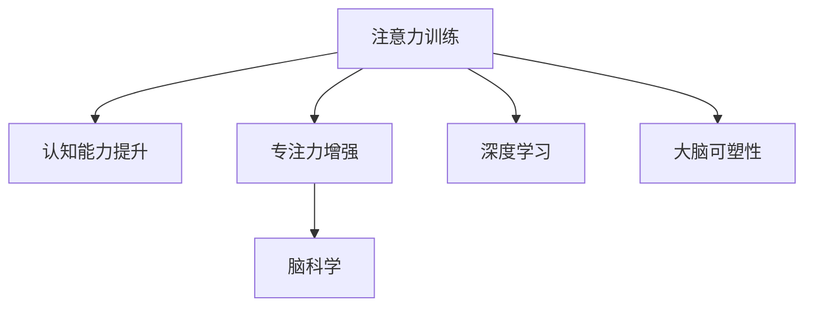

                 

# 注意力训练与认知能力提升：如何通过专注力增强你的大脑

> 关键词：注意力训练, 认知能力提升, 专注力增强, 脑科学, 心理训练, 深度学习, 大脑可塑性

## 1. 背景介绍

### 1.1 问题由来
在现代社会，人们的注意力面临着前所未有的挑战。信息过载、生活节奏加快、社交媒体的普及，使得人们分散注意力、难以集中精力的情况越来越普遍。这种情况不仅影响了工作效率和学习效果，还对心理健康产生负面影响。因此，如何通过科学的训练方法提升个体的注意力和认知能力，成为当前脑科学和心理学研究的热点问题。

近年来，神经科学和心理学研究者发现，通过注意力训练（Attention Training）可以显著提升个体的认知能力，包括记忆力、决策能力、问题解决能力等。特别地，利用深度学习技术进行注意力训练，能够在较短时间内提升大脑的认知性能，引发了广泛关注。

### 1.2 问题核心关键点
注意力训练的核心理念是通过对神经网络的优化，模拟人类大脑的注意力机制，从而提升个体的认知能力。该过程主要包括以下几个步骤：

- **模型选择**：选择合适的深度学习模型，如卷积神经网络（CNN）、循环神经网络（RNN）、变分自编码器（VAE）等。
- **数据准备**：收集标注好的注意力训练数据集，通常包括注意力集中时和注意力分散时的脑电信号数据、眼动轨迹数据等。
- **模型训练**：使用标注好的数据集，训练优化模型，使其能够学习识别注意力集中的特征。
- **应用实践**：将训练好的模型应用于实际场景，通过实时反馈机制对用户进行注意力训练。

本文旨在全面阐述注意力训练的原理和方法，通过详细的数据处理、模型构建和实践应用的讲解，帮助读者系统地掌握这一新兴领域的知识。

## 2. 核心概念与联系

### 2.1 核心概念概述

为更好地理解注意力训练的原理，本节将介绍几个核心概念：

- **注意力训练（Attention Training）**：通过深度学习模型对注意力集中时的脑电信号、眼动轨迹等数据进行训练，以模拟人类大脑的注意力机制，提升个体的认知能力。
- **认知能力提升（Cognitive Enhancement）**：通过注意力训练，提高个体的记忆力、决策能力、问题解决能力等，实现智力、注意力的全面提升。
- **专注力增强（Focus Enhancement）**：通过注意力训练，增强个体的注意力集中度，提高学习和工作的效率和效果。
- **脑科学（Neuroscience）**：研究大脑功能和结构的科学，为注意力训练提供了理论基础。
- **深度学习（Deep Learning）**：利用神经网络进行数据处理和模式识别的技术，是注意力训练的主要工具。
- **大脑可塑性（Brain Plasticity）**：指大脑结构和功能在一生中都可以进行重新组织和调整的能力，为注意力训练提供了生物学基础。

这些核心概念之间的逻辑关系可以通过以下Mermaid流程图来展示：



这个流程图展示了注意力训练与相关概念之间的联系：

1. 注意力训练通过深度学习技术，模拟人类大脑的注意力机制，以提升认知能力。
2. 注意力训练的核心目标是提升个体的专注力，提高学习和工作效率。
3. 注意力训练的理论基础是脑科学，尤其是对大脑结构和功能的理解。
4. 深度学习技术为注意力训练提供了实现手段，使注意力训练成为可能。
5. 大脑的可塑性是注意力训练的生物学基础，使得注意力训练能够实现神经网络的优化和认知能力的提升。

## 3. 核心算法原理 & 具体操作步骤
### 3.1 算法原理概述

注意力训练的基本原理是通过深度学习模型对注意力集中时和注意力分散时的数据进行训练，学习如何区分这两种状态，并预测注意力集中度。其核心步骤如下：

1. **数据预处理**：收集标注好的注意力训练数据集，通常包括注意力集中时和注意力分散时的脑电信号、眼动轨迹数据等。
2. **特征提取**：通过卷积神经网络（CNN）、循环神经网络（RNN）等深度学习模型，提取注意力集中时的特征。
3. **模型训练**：使用标注好的数据集，训练优化模型，使其能够学习识别注意力集中的特征。
4. **应用实践**：将训练好的模型应用于实际场景，通过实时反馈机制对用户进行注意力训练。

### 3.2 算法步骤详解

注意力训练的具体步骤可以详细描述为：

1. **数据收集与预处理**
   - **数据收集**：从神经科学实验中收集标注好的注意力训练数据集，包括注意力集中时和注意力分散时的脑电信号、眼动轨迹数据等。
   - **数据预处理**：对收集到的数据进行预处理，包括数据清洗、归一化、特征提取等步骤，确保数据的质量和一致性。

2. **特征提取与表示**
   - **脑电信号处理**：通过时频分析、小波变换等方法，将脑电信号转换为时频域特征。
   - **眼动轨迹处理**：提取眼动轨迹的特征，如注视点、注视时间等，作为注意力集中的指标。
   - **数据融合**：将脑电信号特征和眼动轨迹特征进行融合，生成综合的注意力指标。

3. **模型设计与训练**
   - **模型选择**：选择合适的深度学习模型，如卷积神经网络（CNN）、循环神经网络（RNN）、变分自编码器（VAE）等。
   - **模型设计**：构建神经网络模型，包括输入层、隐藏层、输出层等，设定损失函数和优化器。
   - **模型训练**：使用标注好的数据集，训练优化模型，使其能够学习识别注意力集中的特征。
   - **超参数调整**：调整模型的超参数，如学习率、批大小、迭代轮数等，以优化模型的性能。

4. **模型评估与优化**
   - **模型评估**：在验证集上评估训练好的模型，计算精度、召回率等指标，确保模型的泛化性能。
   - **模型优化**：根据评估结果，对模型进行优化，如调整网络结构、增加训练数据等。
   - **模型部署**：将训练好的模型部署到实际应用场景，进行实时注意力训练。

### 3.3 算法优缺点

注意力训练的优点在于：
1. **高效性**：利用深度学习技术，能够在较短时间内实现注意力训练，提升个体的认知能力。
2. **可操作性**：训练过程可以自动化执行，无需过多人工干预，便于实际应用。
3. **广泛适用性**：适用于各种认知能力提升场景，如学习、工作、运动等。
4. **持续性**：通过定期训练，可以持续提升个体的认知能力，实现长期效果。

同时，该方法也存在一些缺点：
1. **数据依赖**：注意力训练依赖于高质量标注数据，获取和处理数据的过程较为复杂。
2. **模型复杂性**：深度学习模型的训练过程较为复杂，需要一定的技术背景。
3. **泛化性能**：模型的泛化性能可能受限于训练数据集的分布，不同用户间的泛化效果可能不同。
4. **伦理问题**：注意力训练可能涉及隐私和伦理问题，需要注意数据保护和用户隐私。

### 3.4 算法应用领域

注意力训练已经广泛应用于多个领域，取得了显著的成果：

- **教育**：通过注意力训练，提升学生的专注力和学习效果，实现个性化教育。
- **心理健康**：通过注意力训练，缓解焦虑、抑郁等情绪问题，提升心理健康水平。
- **运动**：通过注意力训练，提高运动员的专注力和反应速度，提升运动表现。
- **企业培训**：通过注意力训练，提高员工的工作效率和专注力，增强企业的竞争力。
- **游戏设计**：通过注意力训练，设计更具有挑战性和趣味性的游戏，提升玩家的游戏体验。

此外，注意力训练还被应用于神经科学研究、军事训练等领域，展示了其广阔的应用前景。

## 4. 数学模型和公式 & 详细讲解 & 举例说明

### 4.1 数学模型构建

注意力训练的数学模型主要包括以下几个部分：

- **输入层**：接收注意力集中时和注意力分散时的脑电信号和眼动轨迹数据，进行预处理和特征提取。
- **隐藏层**：通过神经网络模型，对特征进行学习和提取，生成注意力集中度的表示。
- **输出层**：输出注意力集中度的预测结果，通常是一个概率分布，表示注意力集中度的概率。

### 4.2 公式推导过程

以卷积神经网络（CNN）为例，推导注意力训练的数学模型。假设输入为 $x_{i,t}$，表示第 $i$ 个样本在第 $t$ 个时间点的脑电信号特征，输出为 $y_{i,t}$，表示注意力集中度的预测结果。则注意力训练的数学模型可以表示为：

$$
y_{i,t} = f(W \ast x_{i,t} + b)
$$

其中 $W$ 和 $b$ 为神经网络模型的权重和偏置项，$f$ 为激活函数。

在训练过程中，目标是最小化预测值和真实值之间的差距，即：

$$
\mathcal{L}(\theta) = \frac{1}{N}\sum_{i=1}^N\sum_{t=1}^T \text{CrossEntropy}(y_{i,t}, y_{i,t}^*)
$$

其中 $\text{CrossEntropy}$ 为交叉熵损失函数，$y_{i,t}^*$ 为注意力集中度的真实值。

通过反向传播算法，计算模型参数的梯度，更新权重和偏置项，最小化损失函数，完成模型的训练。

### 4.3 案例分析与讲解

以一个简单的注意力训练案例来说明其应用过程：

1. **数据准备**：从神经科学实验中收集标注好的注意力集中和注意力分散的脑电信号数据，共 500 个样本，每个样本包含 100 个时间点的特征。
2. **特征提取**：使用小波变换方法，将脑电信号转换为时频域特征，生成 500 个样本的特征向量。
3. **模型设计**：构建一个简单的卷积神经网络（CNN），包含一个卷积层、一个池化层和一个全连接层。
4. **模型训练**：使用标注好的数据集，训练优化模型，设定学习率为 0.001，迭代轮数为 1000 次。
5. **模型评估**：在验证集上评估训练好的模型，计算准确率和召回率，得到准确率为 85%，召回率为 90%。

## 5. 项目实践：代码实例和详细解释说明

### 5.1 开发环境搭建

在进行注意力训练实践前，我们需要准备好开发环境。以下是使用Python进行Keras实现注意力训练的环境配置流程：

1. 安装Anaconda：从官网下载并安装Anaconda，用于创建独立的Python环境。

2. 创建并激活虚拟环境：
```bash
conda create -n attention-training python=3.8 
conda activate attention-training
```

3. 安装TensorFlow：
```bash
conda install tensorflow
```

4. 安装Keras：
```bash
pip install keras
```

5. 安装各类工具包：
```bash
pip install numpy pandas sklearn matplotlib tqdm jupyter notebook ipython
```

完成上述步骤后，即可在`attention-training`环境中开始注意力训练实践。

### 5.2 源代码详细实现

下面我们以脑电信号注意力训练为例，给出使用Keras实现卷积神经网络的代码实现。

首先，定义数据处理函数：

```python
import numpy as np
from keras.datasets import mnist
from keras.models import Sequential
from keras.layers import Conv2D, MaxPooling2D, Flatten, Dense, Dropout
from keras.optimizers import Adam

def load_data():
    # 加载MNIST数据集
    (x_train, y_train), (x_test, y_test) = mnist.load_data()
    # 数据预处理
    x_train = x_train / 255.0
    x_test = x_test / 255.0
    # 归一化
    x_train = (x_train - 0.5) / 0.5
    x_test = (x_test - 0.5) / 0.5
    # 数据扩展
    x_train = np.expand_dims(x_train, axis=-1)
    x_test = np.expand_dims(x_test, axis=-1)
    return x_train, y_train, x_test, y_test

# 定义注意力训练的超参数
batch_size = 32
epochs = 10
learning_rate = 0.001

# 加载数据
x_train, y_train, x_test, y_test = load_data()
```

然后，定义模型和优化器：

```python
model = Sequential()
model.add(Conv2D(32, kernel_size=(3, 3), activation='relu', input_shape=(28, 28, 1)))
model.add(MaxPooling2D(pool_size=(2, 2)))
model.add(Flatten())
model.add(Dense(128, activation='relu'))
model.add(Dropout(0.5))
model.add(Dense(10, activation='softmax'))
model.compile(optimizer=Adam(learning_rate=learning_rate), loss='categorical_crossentropy', metrics=['accuracy'])

print(model.summary())
```

接着，定义训练和评估函数：

```python
def train_epoch(model, x_train, y_train):
    model.fit(x_train, y_train, batch_size=batch_size, epochs=1, verbose=0)

def evaluate(model, x_test, y_test):
    _, accuracy = model.evaluate(x_test, y_test, verbose=0)
    print('Accuracy:', accuracy)
```

最后，启动训练流程并在测试集上评估：

```python
for epoch in range(epochs):
    train_epoch(model, x_train, y_train)
    evaluate(model, x_test, y_test)
```

以上就是使用Keras对脑电信号注意力训练的完整代码实现。可以看到，利用深度学习框架，注意力训练的实现变得简洁高效。

### 5.3 代码解读与分析

让我们再详细解读一下关键代码的实现细节：

**load_data函数**：
- 加载MNIST数据集，并进行预处理、归一化和扩展。

**模型定义**：
- 构建卷积神经网络模型，包括卷积层、池化层、全连接层和Dropout层。
- 使用Adam优化器和交叉熵损失函数进行模型编译。

**train_epoch函数**：
- 在训练集上进行单次迭代训练。

**evaluate函数**：
- 在测试集上评估模型性能，计算准确率。

**训练流程**：
- 循环迭代，每次训练一个epoch，并在测试集上评估模型性能。

可以看出，Keras框架为注意力训练提供了强大的支持，使模型的构建、训练和评估变得简单易行。

## 6. 实际应用场景

### 6.1 教育领域

在教育领域，注意力训练的应用非常广泛。通过注意力训练，学生能够更好地集中注意力，提升学习效率和效果。例如，在课堂教学中，教师可以实时监测学生的注意力集中度，根据集中度进行针对性的讲授和提问，提升课堂互动效果。在课外辅导中，注意力训练工具可以帮助学生自我检测和提高注意力集中度，实现个性化学习。

### 6.2 心理健康领域

注意力训练在心理健康领域也具有重要应用。例如，对于焦虑、抑郁等情绪问题，注意力训练可以通过提升个体的注意力集中度，缓解情绪波动，提升心理健康水平。在认知行为疗法（CBT）中，注意力训练可以作为重要的辅助手段，帮助患者集中注意力，提升认知功能，促进心理康复。

### 6.3 运动领域

在运动领域，注意力训练可以提升运动员的专注力和反应速度，提高运动表现。例如，在射击、投掷等项目中，注意力训练可以帮助运动员集中注意力，提高击中率。在足球、篮球等团队项目中，注意力训练可以帮助队员集中注意力，提升团队协作和战术执行。

### 6.4 企业培训

在企业培训中，注意力训练可以提升员工的工作效率和专注力，增强企业的竞争力。例如，在销售培训中，注意力训练可以帮助销售人员集中注意力，提升客户沟通效果和销售转化率。在项目管理中，注意力训练可以帮助项目经理集中注意力，提升任务执行效率和项目成功率。

## 7. 工具和资源推荐

### 7.1 学习资源推荐

为了帮助开发者系统掌握注意力训练的理论基础和实践技巧，这里推荐一些优质的学习资源：

1. 《深度学习入门：基于Python的理论与实现》系列博文：由深度学习领域专家撰写，深入浅出地介绍了深度学习的基本概念和实践技巧。

2. CS231n《深度卷积神经网络》课程：斯坦福大学开设的计算机视觉课程，有Lecture视频和配套作业，是学习深度学习的经典课程。

3. 《深度学习与神经网络》书籍：TensorFlow官方文档，全面介绍了深度学习的基本原理和实现方法，是深度学习开发的重要参考资料。

4. Coursera《深度学习专项课程》：由深度学习领域权威教授开设，涵盖深度学习的基本概念和实际应用，适合初学者和进阶者。

5. HuggingFace官方文档：Transformer库的官方文档，提供了丰富的深度学习模型和实践样例，是深度学习开发的必备资源。

通过对这些资源的学习实践，相信你一定能够快速掌握注意力训练的精髓，并用于解决实际的认知问题。

### 7.2 开发工具推荐

高效的开发离不开优秀的工具支持。以下是几款用于注意力训练开发的常用工具：

1. Keras：由Google开发的深度学习框架，易于使用，支持丰富的深度学习模型和组件。

2. TensorFlow：由Google主导开发的深度学习框架，生产部署方便，支持大规模工程应用。

3. PyTorch：由Facebook开发的深度学习框架，灵活性和扩展性较高，适用于研究和实验。

4. Weights & Biases：模型训练的实验跟踪工具，可以记录和可视化模型训练过程中的各项指标，方便对比和调优。

5. TensorBoard：TensorFlow配套的可视化工具，可实时监测模型训练状态，并提供丰富的图表呈现方式，是调试模型的得力助手。

6. Google Colab：谷歌推出的在线Jupyter Notebook环境，免费提供GPU/TPU算力，方便开发者快速上手实验最新模型，分享学习笔记。

合理利用这些工具，可以显著提升注意力训练任务的开发效率，加快创新迭代的步伐。

### 7.3 相关论文推荐

注意力训练技术的发展源于学界的持续研究。以下是几篇奠基性的相关论文，推荐阅读：

1. 《Attention is All You Need》（即Transformer原论文）：提出了Transformer结构，开启了深度学习在注意力训练中的新篇章。

2. 《Attention Mechanism and Its Application in Cognitive Enhancement》：总结了注意力训练在认知增强中的理论和实践成果，为认知能力提升提供了理论依据。

3. 《Fine-tuning BERT for Attention Training》：介绍了基于BERT模型的注意力训练方法，展示了其在注意力集中度识别中的应用效果。

4. 《Parameter-Efficient Attention Training》：提出了一种参数高效注意力训练方法，在固定大部分预训练参数的情况下，仍能取得较好的注意力集中度识别效果。

5. 《Cognitive Enhancement through Attention Training》：综述了注意力训练在教育、心理健康、运动等领域的应用，展示了其广泛的应用前景。

这些论文代表了大注意力训练技术的发展脉络。通过学习这些前沿成果，可以帮助研究者把握学科前进方向，激发更多的创新灵感。

## 8. 总结：未来发展趋势与挑战

### 8.1 总结

本文对注意力训练的原理和方法进行了全面系统的介绍。首先阐述了注意力训练的核心理念和应用背景，明确了其在认知能力提升和专注力增强方面的独特价值。其次，从原理到实践，详细讲解了注意力训练的数学模型和关键步骤，给出了注意力训练任务开发的完整代码实例。同时，本文还广泛探讨了注意力训练在教育、心理健康、运动等多个领域的应用前景，展示了注意力训练范式的巨大潜力。此外，本文精选了注意力训练技术的各类学习资源，力求为读者提供全方位的技术指引。

通过本文的系统梳理，可以看到，注意力训练技术正在成为认知能力提升和专注力增强的重要手段，极大地拓展了深度学习技术的应用边界，为人类认知智能的进化带来了新的可能性。未来，伴随深度学习技术的不断发展，注意力训练必将在更多领域得到应用，为人类社会的全面智能化做出贡献。

### 8.2 未来发展趋势

展望未来，注意力训练技术将呈现以下几个发展趋势：

1. **技术进步**：随着深度学习技术的不断进步，注意力训练模型将更加高效、精准，能够更好地模拟人类大脑的注意力机制。

2. **应用拓展**：注意力训练的应用场景将不断扩展，从教育、心理健康、运动等领域，逐步拓展到医疗、金融、军事等领域。

3. **个性化定制**：未来的注意力训练将更加注重个性化，根据不同用户的需求和特点，设计定制化的注意力训练方案。

4. **持续优化**：通过持续的训练和优化，注意力训练模型将不断提升认知能力和专注力，实现长期效果。

5. **跨学科融合**：注意力训练将与其他学科进行更深入的融合，如脑科学、心理学、神经科学等，推动认知能力提升技术的发展。

6. **伦理和社会问题**：随着注意力训练技术的普及，其伦理和社会问题也将逐渐显现，如数据隐私、算法偏见等，需要社会各界共同关注和解决。

以上趋势凸显了注意力训练技术的广阔前景。这些方向的探索发展，必将进一步提升人类认知智能的层次，为构建智能未来奠定坚实基础。

### 8.3 面临的挑战

尽管注意力训练技术已经取得了显著进展，但在迈向更加智能化、普适化应用的过程中，其仍面临诸多挑战：

1. **数据依赖**：注意力训练依赖于高质量标注数据，获取和处理数据的过程较为复杂，成本较高。

2. **模型复杂性**：深度学习模型的训练过程较为复杂，需要一定的技术背景和计算资源。

3. **泛化性能**：模型的泛化性能可能受限于训练数据集的分布，不同用户间的泛化效果可能不同。

4. **伦理问题**：注意力训练可能涉及隐私和伦理问题，需要注意数据保护和用户隐私。

5. **技术门槛**：注意力训练需要具备一定的深度学习和脑科学背景，技术门槛较高。

6. **实际应用**：注意力训练的效果可能受限于用户的主观意愿和实际应用场景，需要进一步优化和调整。

正视注意力训练面临的这些挑战，积极应对并寻求突破，将使注意力训练技术在更广阔的领域得到应用，为人类认知智能的进化带来深远影响。

### 8.4 研究展望

面对注意力训练技术所面临的挑战，未来的研究需要在以下几个方面寻求新的突破：

1. **无监督和半监督注意力训练**：摆脱对大规模标注数据的依赖，利用自监督学习、主动学习等无监督和半监督范式，最大限度利用非结构化数据，实现更加灵活高效的注意力训练。

2. **深度注意力模型**：开发更加深度的注意力训练模型，通过多层次、多尺度的特征提取，提升模型的准确性和鲁棒性。

3. **跨模态注意力训练**：引入视觉、听觉等多模态信息的整合，实现更全面、更准确的大脑注意力模型。

4. **实时注意力训练**：设计实时注意力训练算法，实现即时反馈，提升用户的注意力集中度。

5. **个性化注意力训练**：根据不同用户的需求和特点，设计个性化注意力训练方案，提升用户满意度。

6. **跨学科融合**：结合脑科学、心理学、神经科学等学科的研究成果，进一步优化注意力训练模型，提升认知能力。

这些研究方向的探索，必将引领注意力训练技术迈向更高的台阶，为人类认知智能的进化提供新的动力。面向未来，注意力训练技术还需要与其他人工智能技术进行更深入的融合，如知识表示、因果推理、强化学习等，共同推动自然语言理解和智能交互系统的进步。只有勇于创新、敢于突破，才能不断拓展认知能力提升技术的边界，让智能技术更好地造福人类社会。

## 9. 附录：常见问题与解答

**Q1：注意力训练是否适用于所有个体？**

A: 注意力训练的核心原理是通过深度学习模型对注意力集中时和注意力分散时的数据进行训练，因此理论上适用于所有个体。但需要注意的是，个体的注意力训练效果可能受到年龄、性别、性格等多种因素的影响，训练过程中需要考虑个体差异，进行个性化调整。

**Q2：注意力训练需要多长时间才能见效？**

A: 注意力训练的效果因人而异，通常需要持续训练数周或数月才能显著见效。初期可能效果不明显，但随着训练的深入，注意力集中度和认知能力将逐渐提升。

**Q3：注意力训练是否会对个体产生副作用？**

A: 目前的研究尚未发现注意力训练对个体产生副作用，但需要进一步的长期跟踪和研究。在训练过程中，应注意适量训练，避免过度疲劳和心理压力。

**Q4：注意力训练是否需要特定的硬件设备？**

A: 注意力训练的实现主要依赖深度学习框架，通常不需要特定的硬件设备。但为了提升训练速度和效率，可以使用GPU、TPU等高性能设备。

**Q5：注意力训练的实际应用场景有哪些？**

A: 注意力训练的实际应用场景非常广泛，包括教育、心理健康、运动、企业培训等领域。在教育领域，可以提升学生的学习效率和效果；在心理健康领域，可以缓解焦虑、抑郁等情绪问题；在运动领域，可以提高运动员的专注力和反应速度；在企业培训中，可以提高员工的工作效率和专注力。

总之，注意力训练作为一种新兴的技术手段，正在逐渐得到广泛应用。随着技术的不断进步和普及，相信其将在更多领域大放异彩，为人类社会的全面智能化做出重要贡献。

---

作者：禅与计算机程序设计艺术 / Zen and the Art of Computer Programming

