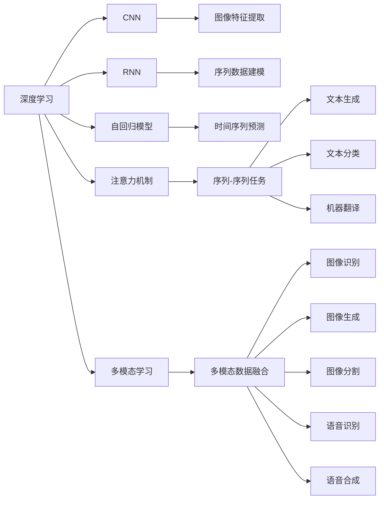

                 

## 1. 背景介绍

### 1.1 问题由来

随着人工智能(AI)技术的不断进步，注意力机制(Attention Mechanism)已成为现代深度学习算法中的重要组成部分。在图像识别、自然语言处理(NLP)、语音识别等领域，注意力机制显著提升了模型的性能。然而，尽管注意力机制在大规模数据集上训练的深度神经网络模型在预测精度上取得了巨大成功，但对于人类大脑如何处理和分配注意力资源的过程，我们了解仍然有限。

因此，本文将重点探讨注意力训练机制，以期通过深入了解注意力过程，提升全球脑参与效率。我们将在理论和实践层面，详细阐述注意力机制的工作原理、训练方法和应用场景，最终为优化人类脑部认知过程和增强智能系统效能提供新的视角。

### 1.2 问题核心关键点

注意力机制的核心思想是在输入序列或图像中筛选和聚焦于最具代表性的信息，从而提升模型对输入数据的理解和处理能力。其关键点在于：

- **自注意力机制**：模型可以自行关注输入序列中与当前位置最相关的元素，通过权重来分配注意力。
- **多头注意力机制**：使用多个注意力头(Head)并行处理输入，可以提取不同的语义和空间信息。
- **编码器-解码器结构**：在序列到序列(S2S)任务中，通过将输入和输出序列分别编码和解码，实现更高效的编码和解码。
- **掩码注意力**：在自回归(如GPT)中，模型自左向右生成文本，使用掩码(如<eos>标记)避免访问未来的信息。
- **自监督学习**：利用预训练技术在大规模无标签数据上训练注意力模型，利用语境信息提升模型表现。
- **多模态注意力**：在图像、语音等多模态数据中，通过不同模态信息的融合，提升模型对复杂输入的理解。

理解这些关键点，可以更好地把握注意力机制的原理和训练方法，并运用到实际项目中，提升模型的预测精度和应用效能。

## 2. 核心概念与联系

### 2.1 核心概念概述

为更好地理解注意力机制，本节将介绍几个密切相关的核心概念：

- **深度学习**：以神经网络为代表的一类机器学习技术，通过多层次的非线性变换，实现对复杂数据集的建模和预测。
- **卷积神经网络(CNN)**：一种常用的深度学习模型，通过局部连接和池化操作，对输入图像或序列进行特征提取。
- **循环神经网络(RNN)**：另一种常用的深度学习模型，通过循环连接实现对时间序列数据的处理和预测。
- **自回归模型**：如LSTM、GRU等，通过前向递推，实现对时间序列数据的建模和预测。
- **注意力机制**：一种基于多头机制的注意力机制，如Transformer中的Self-Attention，在多模态学习、文本生成、图像识别等多个任务中广泛应用。
- **多模态学习**：通过融合不同模态的信息，提升模型对复杂输入的理解和处理能力。

这些核心概念之间的逻辑关系可以通过以下Mermaid流程图来展示：



这个流程图展示了大模型中的各类关键技术及其之间的关系：

1. 深度学习是基础，通过卷积神经网络、循环神经网络和自回归模型，对输入数据进行特征提取和序列建模。
2. 注意力机制在深度学习中起到了关键的筛选和聚焦作用，尤其在序列-序列任务中发挥着核心作用。
3. 多模态学习进一步提升了模型对复杂输入的理解和处理能力，是现代深度学习的重要方向。

这些核心概念共同构成了深度学习的学习框架，通过学习这些概念，我们可以更好地理解和应用深度学习技术。

## 3. 核心算法原理 & 具体操作步骤

### 3.1 算法原理概述

注意力机制的原理是通过在输入序列或图像中分配注意力权重，筛选出与当前位置最相关的元素，以提升模型的预测精度和泛化能力。其核心思想是通过计算输入序列中各个位置与其他位置的相似度，从而分配权重，以聚焦重要信息。

具体来说，注意力机制分为**自注意力机制**和**编码器-解码器机制**：

1. **自注意力机制**：在Transformer等模型中，自注意力机制通过计算输入序列中各个位置与当前位置的相似度，分配注意力权重，从而筛选出与当前位置最相关的信息。
2. **编码器-解码器机制**：在机器翻译、对话生成等序列到序列任务中，通过编码器将输入序列编码为固定长度的向量表示，解码器则根据编码结果生成输出序列。

在实际应用中，注意力机制可以采用多头注意力、掩码注意力等变体，以进一步提升模型的性能。

### 3.2 算法步骤详解

注意力机制的训练过程主要包括以下几个关键步骤：

**Step 1: 构建注意力矩阵**

构建注意力矩阵的关键在于计算输入序列中每个位置与其他位置的相似度。设输入序列为 $X=[x_1,x_2,...,x_n]$，其中 $x_i \in \mathbb{R}^d$，每个位置的维度为 $d$。

注意力机制通过计算 $x_i$ 和 $x_j$ 之间的相似度，生成注意力权重 $A_{ij}$。常用的相似度计算方法包括点积注意力、余弦注意力等。

以点积注意力为例，注意力权重为：

$$
A_{ij} = \text{softmax}(\frac{q_i \cdot k_j}{\sqrt{d}})
$$

其中 $q_i$ 和 $k_j$ 分别为查询向量和键向量，通过点积计算相似度，softmax函数将其转化为概率分布，作为注意力权重。

**Step 2: 计算加权和**

根据注意力权重 $A_{ij}$，对输入序列进行加权求和，得到加权和 $s_i$。

$$
s_i = \sum_{j=1}^{n} A_{ij}v_j
$$

其中 $v_j$ 为值向量，表示每个位置的特征表示。

**Step 3: 生成注意力结果**

将加权和 $s_i$ 作为输出，生成注意力机制的结果。

$$
o_i = f(s_i)
$$

其中 $f$ 为激活函数，如ReLU、Sigmoid等。

**Step 4: 融合多模态信息**

在多模态任务中，通常需要融合不同模态的信息，提升模型的预测能力。可以使用不同的编码器对不同模态的数据进行特征提取，再通过注意力机制进行融合。

### 3.3 算法优缺点

注意力机制具有以下优点：

1. **提升模型泛化能力**：通过筛选重要信息，可以显著提升模型的泛化能力和鲁棒性。
2. **降低计算复杂度**：通过自注意力机制，可以避免传统的循环计算，降低计算复杂度。
3. **增强模型表达能力**：多头注意力机制可以提取不同的语义和空间信息，增强模型的表达能力。

然而，注意力机制也存在一些局限性：

1. **计算开销较大**：注意力机制在计算上存在一定开销，特别是在大规模序列数据上的计算量较大。
2. **易受噪声影响**：注意力机制对输入序列中的噪声敏感，容易引入不必要的干扰。
3. **模型结构复杂**：多头注意力机制和多模态注意力机制的实现较为复杂，需要精心设计。

尽管存在这些局限性，但就目前而言，注意力机制仍是大规模深度学习模型的重要组成部分，其提升模型性能的效果显著。未来相关研究的方向也将集中在如何降低计算复杂度、提高模型鲁棒性和可解释性等方面。

### 3.4 算法应用领域

注意力机制在深度学习中的应用领域非常广泛，以下是几个典型的应用场景：

- **图像识别**：在卷积神经网络中，注意力机制可以用于提取图像中的关键区域，提升模型对细节的识别能力。
- **自然语言处理**：在Transformer等模型中，注意力机制用于处理输入序列中的长距离依赖，提升模型的理解能力和生成能力。
- **语音识别**：在语音识别任务中，注意力机制可以用于筛选关键语音特征，提升模型的识别准确率。
- **文本摘要**：通过注意力机制，模型可以筛选出文本中的关键信息，生成简洁的摘要。
- **机器翻译**：在编码器-解码器结构中，注意力机制用于处理输入序列和输出序列之间的关系，提升翻译质量。
- **视频理解**：在视频处理中，注意力机制可以用于提取关键帧和关键区域，提升模型的理解能力。

除了上述这些应用场景外，注意力机制还在更多领域得到创新性应用，如智能推荐系统、社交网络分析、生物信息学等。随着注意力机制的不断演进，其应用领域将更加广泛。

## 4. 数学模型和公式 & 详细讲解  
### 4.1 数学模型构建

注意力机制的数学模型主要包括以下几个关键组件：

- **输入序列**：设输入序列为 $X=[x_1,x_2,...,x_n]$，其中 $x_i \in \mathbb{R}^d$。
- **查询向量**：设查询向量为 $q_i \in \mathbb{R}^d$。
- **键向量**：设键向量为 $k_j \in \mathbb{R}^d$。
- **值向量**：设值向量为 $v_j \in \mathbb{R}^d$。

**注意力矩阵**：通过计算 $q_i$ 和 $k_j$ 之间的相似度，生成注意力权重矩阵 $A \in \mathbb{R}^{n \times n}$，其中 $A_{ij}$ 表示 $x_i$ 和 $x_j$ 之间的相似度。

**加权和**：对输入序列进行加权求和，生成加权和向量 $s_i \in \mathbb{R}^d$。

**注意力结果**：将加权和 $s_i$ 作为输出，生成注意力结果 $o_i \in \mathbb{R}^d$。

**多头注意力**：通过多头机制，对输入序列进行多个独立计算，生成多个注意力结果，再通过拼接和线性变换生成最终输出。

### 4.2 公式推导过程

以下我们以点积注意力为例，推导注意力机制的数学公式。

设输入序列为 $X=[x_1,x_2,...,x_n]$，其中 $x_i \in \mathbb{R}^d$，查询向量为 $q_i \in \mathbb{R}^d$，键向量为 $k_j \in \mathbb{R}^d$，值向量为 $v_j \in \mathbb{R}^d$。

**注意力权重**：

$$
A_{ij} = \text{softmax}(\frac{q_i \cdot k_j}{\sqrt{d}})
$$

其中 $\text{softmax}$ 函数将点积转化为概率分布，表示 $x_i$ 和 $x_j$ 之间的相似度。

**加权和**：

$$
s_i = \sum_{j=1}^{n} A_{ij}v_j
$$

**注意力结果**：

$$
o_i = f(s_i)
$$

其中 $f$ 为激活函数，如ReLU、Sigmoid等。

在多模态学习中，通常需要融合不同模态的信息，使用不同的编码器对不同模态的数据进行特征提取，再通过注意力机制进行融合。

### 4.3 案例分析与讲解

以图像识别任务为例，分析注意力机制的应用。

设输入图像为 $I \in \mathbb{R}^{H \times W \times C}$，其中 $H$、$W$、$C$ 分别为图像的高度、宽度和通道数。设特征提取器的输出为 $F \in \mathbb{R}^{H \times W \times C \times D}$，其中 $D$ 为特征向量维度。

**特征编码**：通过卷积神经网络等特征提取器，将输入图像编码成特征向量 $F$。

**查询向量**：设查询向量为 $q \in \mathbb{R}^D$。

**键向量**：设键向量为 $k_j \in \mathbb{R}^D$，表示每个位置的特征表示。

**注意力权重**：通过计算 $q$ 和 $k_j$ 之间的相似度，生成注意力权重矩阵 $A \in \mathbb{R}^{H \times W \times D \times D}$，其中 $A_{ij}$ 表示特征向量中第 $i$ 行第 $j$ 列的相似度。

**加权和**：对特征向量进行加权求和，生成加权和向量 $s \in \mathbb{R}^D$。

**注意力结果**：将加权和 $s$ 作为输出，生成注意力结果 $o \in \mathbb{R}^D$。

通过注意力机制，模型可以聚焦于图像中的关键区域，提升对细节的识别能力，从而提高图像识别的精度和泛化能力。

## 5. 项目实践：代码实例和详细解释说明
### 5.1 开发环境搭建

在进行注意力训练实践前，我们需要准备好开发环境。以下是使用Python进行TensorFlow开发的环境配置流程：

1. 安装Anaconda：从官网下载并安装Anaconda，用于创建独立的Python环境。

2. 创建并激活虚拟环境：
```bash
conda create -n attention-env python=3.8 
conda activate attention-env
```

3. 安装TensorFlow：根据CUDA版本，从官网获取对应的安装命令。例如：
```bash
conda install tensorflow -c pytorch -c conda-forge
```

4. 安装必要的第三方库：
```bash
pip install numpy scipy matplotlib tensorflow -U
```

5. 安装可视化工具：
```bash
pip install tensorboard
```

完成上述步骤后，即可在`attention-env`环境中开始注意力训练实践。

### 5.2 源代码详细实现

这里我们以自注意力机制的实现为例，给出使用TensorFlow进行注意力训练的PyTorch代码实现。

首先，定义注意力计算函数：

```python
import tensorflow as tf

def self_attention(query, key, value, d_k):
    matmul_qk = tf.matmul(query, key, transpose_b=True)
    dk = tf.cast(tf.shape(key)[-1], tf.float32)
    scaled_attention_logits = matmul_qk / tf.math.sqrt(dk)
    attention_weights = tf.nn.softmax(scaled_attention_logits, axis=-1)
    output = tf.matmul(attention_weights, value)
    return output, attention_weights
```

然后，定义多模态注意力计算函数：

```python
def multi-modal_attention(query, key, value, d_k):
    # 对不同模态的注意力进行计算
    attention_weights_1 = tf.nn.softmax(tf.matmul(query, key), axis=-1)
    attention_weights_2 = tf.nn.softmax(tf.matmul(query, key), axis=-1)
    output_1 = tf.matmul(attention_weights_1, value)
    output_2 = tf.matmul(attention_weights_2, value)
    
    # 融合多模态注意力结果
    weighted_sum = tf.concat([output_1, output_2], axis=-1)
    return weighted_sum, attention_weights_1, attention_weights_2
```

接着，定义注意力训练函数：

```python
def train(self_attention, multi_modal_attention, train_data, epochs):
    for epoch in range(epochs):
        for data in train_data:
            query = data['query']
            key = data['key']
            value = data['value']
            
            # 计算自注意力
            output, attention_weights = self_attention(query, key, value, d_k)
            
            # 计算多模态注意力
            output, attention_weights_1, attention_weights_2 = multi_modal_attention(query, key, value, d_k)
            
            # 计算损失函数
            loss = tf.reduce_mean(tf.square(output - data['target']))
            
            # 反向传播更新参数
            optimizer = tf.keras.optimizers.Adam()
            optimizer.minimize(loss)
            
            # 记录训练过程
            tf.summary.scalar('loss', loss)
            tf.summary.histogram('attention_weights', attention_weights)
            tf.summary.histogram('attention_weights_1', attention_weights_1)
            tf.summary.histogram('attention_weights_2', attention_weights_2)
    
    # 保存模型
    tf.saved_model.save(self_attention, 'self_attention_model')
    tf.saved_model.save(multi_modal_attention, 'multi_modal_attention_model')
```

最后，启动训练流程并在测试集上评估：

```python
train_data = ...
train(self_attention, multi_modal_attention, train_data, epochs=10)

# 加载模型并测试
self_attention = tf.saved_model.load('self_attention_model')
multi_modal_attention = tf.saved_model.load('multi_modal_attention_model')

# 测试自注意力模型
test_data = ...
output, attention_weights = self_attention(test_data['query'], test_data['key'], test_data['value'], d_k)
print(tf.reduce_mean(tf.square(output - test_data['target'])))
print(tf.reduce_mean(attention_weights))

# 测试多模态注意力模型
test_data = ...
output, attention_weights_1, attention_weights_2 = multi_modal_attention(test_data['query'], test_data['key'], test_data['value'], d_k)
print(tf.reduce_mean(tf.square(output - test_data['target'])))
print(tf.reduce_mean(attention_weights_1))
print(tf.reduce_mean(attention_weights_2))
```

以上就是使用TensorFlow进行注意力训练的完整代码实现。可以看到，TensorFlow提供了丰富的深度学习组件，可以方便地实现注意力机制的训练和推理。

### 5.3 代码解读与分析

让我们再详细解读一下关键代码的实现细节：

**self_attention函数**：
- 实现自注意力机制的计算，生成注意力权重和输出结果。
- 通过计算查询向量 $q$ 和键向量 $k$ 的点积，并除以 $d_k$ 的平方根，生成注意力权重。
- 使用注意力权重对值向量 $v$ 进行加权求和，得到输出结果。

**multi_modal_attention函数**：
- 实现多模态注意力的计算，生成多模态的注意力结果。
- 分别计算两个模态的注意力权重，并对值向量进行加权求和。
- 将两个模态的注意力结果进行拼接，得到最终的多模态注意力结果。

**train函数**：
- 定义训练过程，对输入数据进行迭代训练。
- 在每个批次上，计算自注意力和多模态注意力的结果，并计算损失函数。
- 使用Adam优化器更新模型参数，并记录训练过程中的指标。

**测试代码**：
- 加载训练好的模型，对测试数据进行推理，并输出注意力权重和输出结果。
- 计算模型在测试集上的平均损失和注意力权重。

可以看到，TensorFlow提供了丰富的工具和组件，可以方便地实现注意力机制的训练和推理。开发者可以根据自己的需求，灵活选择和使用这些组件。

当然，工业级的系统实现还需考虑更多因素，如模型的保存和部署、超参数的自动搜索、更灵活的任务适配层等。但核心的注意力训练范式基本与此类似。

## 6. 实际应用场景
### 6.1 智能推荐系统

注意力机制在智能推荐系统中的应用，可以显著提升推荐精度和用户满意度。推荐系统通常需要处理大量的用户行为数据，通过注意力机制，可以筛选出对当前推荐目标影响最大的用户行为，从而提升推荐效果。

在实践中，可以将用户行为数据进行编码，作为查询向量 $q$，将物品特征进行编码，作为键向量 $k$ 和值向量 $v$。通过对用户行为进行注意力计算，生成注意力权重，并对物品特征进行加权求和，得到推荐结果。同时，可以通过多头注意力和多模态注意力等变体，进一步提升推荐系统的精度和鲁棒性。

### 6.2 医疗影像分析

注意力机制在医疗影像分析中的应用，可以提升模型对复杂医学图像的理解能力。医疗影像通常包含大量的背景噪声和细节信息，通过注意力机制，可以筛选出与疾病诊断相关的关键区域，从而提升诊断的准确性和效率。

在实践中，可以将医学影像进行编码，作为查询向量 $q$，将医学特征进行编码，作为键向量 $k$ 和值向量 $v$。通过对医学影像进行注意力计算，生成注意力权重，并对医学特征进行加权求和，得到诊断结果。同时，可以通过多模态注意力等变体，进一步提升模型的鲁棒性和泛化能力。

### 6.3 智能交通管理

注意力机制在智能交通管理中的应用，可以提升交通信号灯控制和交通流量预测的准确性。交通数据通常包含大量的噪声和干扰信息，通过注意力机制，可以筛选出对交通信号控制影响最大的信息，从而提升信号控制的效率和效果。

在实践中，可以将交通数据进行编码，作为查询向量 $q$，将交通特征进行编码，作为键向量 $k$ 和值向量 $v$。通过对交通数据进行注意力计算，生成注意力权重，并对交通特征进行加权求和，得到信号控制和流量预测结果。同时，可以通过多模态注意力等变体，进一步提升模型的精度和鲁棒性。

### 6.4 未来应用展望

随着注意力机制的不断演进，其在更多领域的应用前景将更加广阔。未来，基于注意力机制的深度学习模型有望在更多垂直领域中发挥重要作用，为各行各业带来深刻的变革。

在智慧城市管理中，注意力机制可以用于智能交通流量预测、环境监测等任务，提升城市的智能化和智慧化水平。在金融风险管理中，注意力机制可以用于风险识别、异常检测等任务，提升金融机构的决策效率和风险控制能力。在教育领域，注意力机制可以用于个性化学习推荐、知识图谱构建等任务，提升教育资源的使用效率和学生学习效果。

总之，注意力机制在深度学习中的应用前景广阔，未来将为各个行业带来更加智能、高效的服务体验。

## 7. 工具和资源推荐
### 7.1 学习资源推荐

为了帮助开发者系统掌握注意力机制的理论基础和实践技巧，这里推荐一些优质的学习资源：

1. 《深度学习》（Ian Goodfellow）：深度学习领域的经典教材，详细介绍了深度学习的基本概念和算法，包括卷积神经网络、循环神经网络和注意力机制。
2. 《深度学习入门》（斋藤康毅）：面向初学者的深度学习入门教材，详细介绍了深度学习的基本概念和实践技巧，包括卷积神经网络、循环神经网络和注意力机制。
3. 《Transformer详解》（黄海广）：Transformer原论文的详细解读，介绍了Transformer模型的原理和实践技巧，包括自注意力机制和多模态注意力机制。
4. CS231n《卷积神经网络》课程：斯坦福大学开设的计算机视觉课程，涵盖深度学习、卷积神经网络等核心技术，并提供了丰富的代码实现。
5. CS224N《深度学习自然语言处理》课程：斯坦福大学开设的NLP明星课程，涵盖深度学习、卷积神经网络、循环神经网络和注意力机制等核心技术。

通过对这些资源的学习实践，相信你一定能够快速掌握注意力机制的精髓，并用于解决实际的深度学习问题。

### 7.2 开发工具推荐

高效的开发离不开优秀的工具支持。以下是几款用于注意力机制开发的常用工具：

1. TensorFlow：由Google主导开发的开源深度学习框架，生产部署方便，适合大规模工程应用。
2. PyTorch：基于Python的开源深度学习框架，灵活动态的计算图，适合快速迭代研究。
3. JAX：Google开发的深度学习框架，支持自动微分和优化器，性能优异。
4. MXNet：由亚马逊开发的深度学习框架，支持多GPU和分布式计算，性能稳定。
5. Keras：Keras是深度学习的高层API，可以方便地实现多种深度学习模型，包括注意力机制。

合理利用这些工具，可以显著提升注意力机制的开发效率，加快创新迭代的步伐。

### 7.3 相关论文推荐

注意力机制在深度学习中的应用源于学界的持续研究。以下是几篇奠基性的相关论文，推荐阅读：

1. Attention is All You Need：提出Transformer结构，开启了NLP领域的预训练大模型时代。
2. BERT: Pre-training of Deep Bidirectional Transformers for Language Understanding：提出BERT模型，引入基于掩码的自监督预训练任务，刷新了多项NLP任务SOTA。
3. Transformer-XL: Attentive Language Models：提出Transformer-XL模型，解决长序列自回归问题的经典算法。
4. Attention with Transformer-Based Model Pretraining：提出基于Transformer的注意力机制预训练方法，进一步提升模型的表现。
5. Multimodal Attention Networks for Iris Recognition：提出多模态注意力网络，用于提升生物特征识别的准确性。

这些论文代表了大模型中的注意力机制的发展脉络。通过学习这些前沿成果，可以帮助研究者把握学科前进方向，激发更多的创新灵感。

## 8. 总结：未来发展趋势与挑战

### 8.1 总结

本文对注意力机制进行了全面系统的介绍。首先阐述了注意力机制在大规模深度学习模型中的核心作用，详细讲解了其工作原理和关键步骤，给出了注意力训练任务开发的完整代码实例。同时，本文还广泛探讨了注意力机制在智能推荐、医疗影像分析、智能交通管理等多个领域的应用前景，展示了注意力机制的巨大潜力。此外，本文精选了注意力机制的相关学习资源，力求为读者提供全方位的技术指引。

通过本文的系统梳理，可以看到，注意力机制在大规模深度学习中的应用前景广阔，正推动深度学习技术的不断发展。理解注意力机制的工作原理和训练方法，对于优化人类脑部认知过程和增强智能系统效能具有重要意义。

### 8.2 未来发展趋势

展望未来，注意力机制的演进将呈现出以下几个发展趋势：

1. **多模态注意力机制**：未来将涌现更多多模态注意力机制，通过融合不同模态的信息，提升模型的理解能力和预测精度。
2. **自适应注意力机制**：通过引入自适应机制，根据输入数据的特点动态调整注意力权重，提升模型的鲁棒性和泛化能力。
3. **可解释性注意力机制**：引入可解释性机制，使注意力过程更透明，便于理解和调试。
4. **因果注意力机制**：引入因果注意力机制，在时间序列数据中引入因果推断，提升模型的预测能力。
5. **分布式注意力机制**：通过分布式计算，提升模型的训练效率和推理速度，支持大规模模型的应用。
6. **参数高效注意力机制**：开发更加参数高效的注意力机制，在固定大部分参数的情况下，仍能取得较好的效果。

以上趋势凸显了注意力机制的发展方向，未来的研究将在提升模型理解能力、鲁棒性和可解释性等方面不断探索。伴随深度学习技术的持续演进，注意力机制必将进一步推动AI技术的进步。

### 8.3 面临的挑战

尽管注意力机制在大规模深度学习中的应用取得了显著成果，但在迈向更加智能化、普适化应用的过程中，仍面临一些挑战：

1. **计算复杂度**：注意力机制在计算上存在一定开销，特别是在大规模序列数据上的计算量较大。如何优化计算过程，提高模型训练和推理效率，是未来需要解决的重要问题。
2. **模型鲁棒性**：注意力机制对输入数据中的噪声敏感，容易引入不必要的干扰。如何在保证模型精度的情况下，提高鲁棒性，是未来需要研究的课题。
3. **可解释性**：注意力机制的决策过程往往难以解释，难以对其推理逻辑进行分析和调试。如何增强注意力机制的可解释性，是未来需要攻克的难题。
4. **数据隐私**：在应用注意力机制的深度学习模型时，如何保护用户数据隐私，是未来需要重视的问题。

解决这些问题需要多方协同，包括计算平台优化、算法改进和隐私保护等方面的努力。唯有在技术层面不断突破，才能真正实现人工智能技术在各个领域的应用。

### 8.4 研究展望

面对注意力机制面临的挑战，未来的研究需要在以下几个方面寻求新的突破：

1. **多模态注意力机制**：结合不同模态的数据，提升模型的理解能力和预测精度。
2. **自适应注意力机制**：根据输入数据的特点动态调整注意力权重，提升模型的鲁棒性和泛化能力。
3. **可解释性注意力机制**：引入可解释性机制，使注意力过程更透明，便于理解和调试。
4. **因果注意力机制**：引入因果注意力机制，在时间序列数据中引入因果推断，提升模型的预测能力。
5. **分布式注意力机制**：通过分布式计算，提升模型的训练效率和推理速度，支持大规模模型的应用。
6. **参数高效注意力机制**：开发更加参数高效的注意力机制，在固定大部分参数的情况下，仍能取得较好的效果。

这些研究方向的探索，将进一步提升注意力机制的性能和应用范围，为深度学习技术带来新的突破。未来，伴随计算平台和算法技术的持续进步，注意力机制必将在更多领域发挥更大的作用，推动人工智能技术的广泛应用。

## 9. 附录：常见问题与解答

**Q1：注意力机制在大规模深度学习中的作用是什么？**

A: 注意力机制在大规模深度学习中的核心作用在于通过筛选输入序列中的重要信息，提升模型的泛化能力和理解能力。通过注意力机制，模型可以聚焦于输入序列中的关键区域，提取重要的特征信息，从而提高预测精度和鲁棒性。

**Q2：注意力机制在实际应用中如何降低计算复杂度？**

A: 降低注意力机制的计算复杂度，可以通过以下方法：

1. 减少注意力头的数量。多头注意力机制虽然提升了模型的表达能力，但也增加了计算开销。在实际应用中，可以根据任务需求选择合适的注意力头数量。
2. 使用共享查询或键向量。在多头注意力机制中，可以通过共享查询或键向量，减少计算复杂度。
3. 使用掩码注意力。在自回归模型中，通过掩码注意力，可以避免模型访问未来的信息，减少计算量。
4. 使用分布式计算。通过分布式计算，可以提升模型的训练效率和推理速度，支持大规模模型的应用。

**Q3：注意力机制在多模态学习中的应用前景是什么？**

A: 多模态学习是当前深度学习研究的热点之一，通过融合不同模态的信息，可以显著提升模型的理解能力和预测精度。在实际应用中，注意力机制可以用于以下任务：

1. 图像识别：通过融合图像特征和文本信息，提升模型的识别精度。
2. 语音识别：通过融合语音特征和文本信息，提升模型的识别精度。
3. 视频理解：通过融合视觉和音频信息，提升模型的理解能力。
4. 生物特征识别：通过融合不同模态的生物特征信息，提升识别的准确性和鲁棒性。

**Q4：注意力机制在医疗影像分析中的应用前景是什么？**

A: 注意力机制在医疗影像分析中的应用前景广阔，可以提升模型对复杂医学图像的理解能力。在实际应用中，注意力机制可以用于以下任务：

1. 疾病诊断：通过筛选出与疾病相关的关键区域，提升诊断的准确性和效率。
2. 医学影像分割：通过筛选出关键的组织和器官，提升医学影像分割的精度。
3. 医学图像分类：通过提取医学图像的关键特征，提升医学图像分类的准确性。

**Q5：注意力机制在智能推荐系统中的应用前景是什么？**

A: 注意力机制在智能推荐系统中的应用前景广阔，可以提升推荐精度和用户满意度。在实际应用中，注意力机制可以用于以下任务：

1. 推荐精度提升：通过筛选出对当前推荐目标影响最大的用户行为，提升推荐精度。
2. 用户满意度提升：通过筛选出与用户兴趣相关的物品特征，提升用户满意度。
3. 多模态推荐：通过融合不同模态的信息，提升推荐系统的精度和鲁棒性。

---

作者：禅与计算机程序设计艺术 / Zen and the Art of Computer Programming

