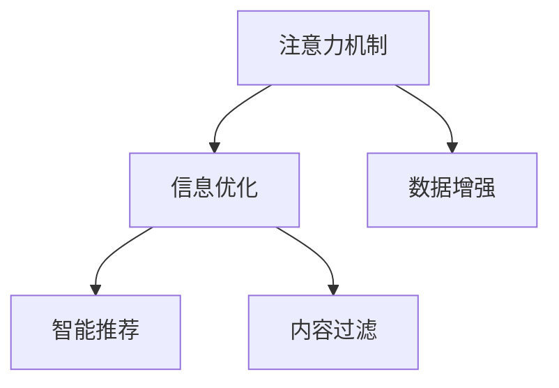

                 

# 注意力过滤器调音师：AI辅助的信息优化专家

> 关键词：注意力过滤器, 信息优化, AI辅助, 数据增强, 智能推荐, 内容过滤

## 1. 背景介绍

### 1.1 问题由来
随着互联网和数字媒体的快速发展，信息量的爆炸式增长使得人们面临着信息过载的困境。在信息海洋中，如何精准地获取并筛选出有用的信息，成为了现代信息时代的一个重要挑战。传统的信息检索方法已经难以满足这一需求，而人工智能技术尤其是自然语言处理（NLP）的进步，为信息优化提供了新的解决方案。

### 1.2 问题核心关键点
信息优化的核心目标是通过对信息的深度处理，提高其相关性、可读性和实用性。这一过程涉及对大量文本数据的理解和分析，不仅需要高效的数据处理能力，还需要智能的推理和决策能力。

人工智能技术，尤其是注意力机制的引入，为信息优化提供了新的可能性。通过模拟人类注意力机制，AI系统可以在海量信息中自动识别出最具价值的部分，从而实现信息精炼和个性化推荐。

### 1.3 问题研究意义
信息优化技术对于提升个人和组织的信息利用效率，具有重要的实际应用价值。从日常生活的信息获取到企业决策支持，从个性化推荐到舆情监测，信息优化技术可以在多个领域提供有力支持。

信息优化技术的进步，有助于缓解信息过载的困境，提高信息利用效率，促进社会信息获取方式的变革，推动经济、教育、文化等领域的数字化转型。

## 2. 核心概念与联系

### 2.1 核心概念概述

在深入讨论信息优化技术之前，我们首先需要理解一些关键的概念和它们之间的联系：

- **注意力机制（Attention Mechanism）**：注意力机制是一种模仿人类注意力集中的机制，它在深度学习模型中用于动态地调整不同输入特征的重要性权重。通过注意力机制，模型能够更加关注那些对任务有帮助的信息，而忽略无关的信息。

- **信息优化（Information Optimization）**：信息优化是指通过智能算法对信息内容进行筛选、提取和整理，从而提高信息的相关性、可读性和实用性。信息优化包括文本摘要、信息检索、智能推荐等多个方向。

- **数据增强（Data Augmentation）**：数据增强是通过对原始数据进行变换、扩充等操作，增加训练集的多样性，提高模型的泛化能力。常见的数据增强方法包括回译、近义词替换等。

- **智能推荐（Smart Recommendation）**：智能推荐系统通过分析用户行为和偏好，推荐可能感兴趣的内容或产品。其核心在于用户建模和内容关联分析。

- **内容过滤（Content Filtering）**：内容过滤是指通过算法对用户产生的内容进行筛选，以避免低质量、有害内容的出现，保证信息环境的健康。

这些概念之间存在密切联系，注意力机制为信息优化提供了技术支持，数据增强和智能推荐为信息优化的实现提供了方法和工具，而内容过滤则是信息优化技术应用于信息环境管理的具体实践。

### 2.2 核心概念原理和架构的 Mermaid 流程图



这个流程图展示了注意力机制、信息优化、数据增强、智能推荐和内容过滤之间的联系：注意力机制为信息优化提供了技术支持；数据增强和智能推荐是信息优化的具体实现方法；内容过滤则是信息优化技术在信息环境管理中的实际应用。

## 3. 核心算法原理 & 具体操作步骤

### 3.1 算法原理概述

注意力过滤器调音师（Attention Filter Tuner, AFT）是一种基于注意力机制的信息优化系统。其核心思想是通过注意力机制对输入的信息进行动态筛选，选择最具价值的部分进行输出。

在AFT中，输入的信息首先经过编码器（如Transformer模型）处理，生成高维的语义向量表示。然后，通过注意力机制对这些向量进行加权，从而决定哪些信息应该被突出显示。最后，通过解码器将这些信息进行整合，生成最终优化后的输出。

### 3.2 算法步骤详解

1. **数据预处理**：将输入的文本数据进行分词、去除停用词、词向量化等预处理操作，生成输入序列。
2. **编码器处理**：使用编码器对输入序列进行处理，生成高维的语义向量表示。
3. **注意力机制**：通过注意力机制对编码器生成的向量进行加权，选择最相关的信息。
4. **解码器处理**：使用解码器对加权后的向量进行整合，生成最终的输出序列。
5. **后处理**：对输出序列进行后处理，如去除低频词、拼接等，生成最终的优化结果。

### 3.3 算法优缺点

**优点**：

- **高效性**：注意力机制能够动态筛选信息，避免了对全部信息的处理，提高了计算效率。
- **灵活性**：通过调整注意力权重，可以灵活适应不同的任务和数据集。
- **可扩展性**：可以与多种信息优化任务结合，如文本摘要、智能推荐等。

**缺点**：

- **复杂性**：注意力机制的设计和实现较为复杂，需要深入理解深度学习理论。
- **过拟合风险**：如果注意力权重设计不当，可能导致模型对训练数据的过度拟合。
- **计算资源需求高**：注意力机制涉及大量的矩阵运算，对计算资源要求较高。

### 3.4 算法应用领域

注意力过滤器调音师（AFT）主要应用于以下几个领域：

- **文本摘要**：自动提取文本中的关键信息，生成简洁的摘要。
- **智能推荐**：根据用户历史行为和兴趣，推荐可能感兴趣的内容。
- **内容过滤**：筛选有害内容，维护信息环境的健康。
- **舆情监测**：分析社交媒体和新闻媒体上的舆情，识别负面信息。

## 4. 数学模型和公式 & 详细讲解 & 举例说明

### 4.1 数学模型构建

在AFT中，信息优化的数学模型可以表示为：

$$
\text{Output} = \text{Decoder}(\text{Attention}(\text{Encoder}(\text{Input})))
$$

其中，$\text{Input}$ 表示原始输入序列，$\text{Encoder}$ 表示编码器，$\text{Attention}$ 表示注意力机制，$\text{Decoder}$ 表示解码器，$\text{Output}$ 表示最终的优化结果。

### 4.2 公式推导过程

以文本摘要任务为例，假设有长度为 $L$ 的输入文本序列 $x_1, x_2, ..., x_L$，希望生成长度为 $k$ 的摘要。设 $x_{t_i}$ 表示输入序列中的第 $t_i$ 个词，$h_{t_i}$ 表示其向量表示。则解码器输出 $h_{\text{out}}$ 可以表示为：

$$
h_{\text{out}} = \sum_{t=1}^L \alpha_t h_{t_i} = \sum_{t=1}^L \text{Attention}(h_1, ..., h_L)_t h_{t_i}
$$

其中 $\alpha_t$ 表示对第 $t$ 个词的注意力权重，$\text{Attention}(h_1, ..., h_L)_t$ 表示对 $h_{t_i}$ 的注意力计算过程。注意力计算公式如下：

$$
\text{Attention}(Q, K, V)_t = \frac{\text{softmax}(Q_t K_t^T)}{Z} V_t
$$

其中 $Q, K, V$ 分别表示查询向量、键向量和值向量，$Z$ 表示归一化因子，$softmax$ 表示softmax函数。

### 4.3 案例分析与讲解

假设输入文本为："人工智能正在改变我们的生活方式。人工智能可以帮助我们更好地理解数据，做出更好的决策。" 希望生成长度为4的摘要。

首先，将文本转换为序列，并进行编码器处理。然后，通过注意力机制计算每个词的注意力权重，选择最重要的词进行解码。最后，通过解码器生成最终的摘要。

例如，对于输入文本中的每个词，可以计算其注意力权重如下：

$$
\text{Attention}(Q, K, V)_t = \frac{\text{softmax}(Q_t K_t^T)}{Z} V_t
$$

其中 $Q, K, V$ 分别为编码器输出的查询向量、键向量和值向量。通过计算，可以得到对每个词的注意力权重，从而选择最重要的词进行解码，生成最终摘要。

## 5. 项目实践：代码实例和详细解释说明

### 5.1 开发环境搭建

要实现AFT，我们需要使用深度学习框架如PyTorch或TensorFlow。以下是在PyTorch框架下搭建开发环境的步骤：

1. 安装PyTorch：
```
pip install torch torchvision torchaudio
```

2. 安装Transformer库：
```
pip install transformers
```

3. 安装必要的工具库：
```
pip install numpy pandas scikit-learn matplotlib tqdm jupyter notebook ipython
```

### 5.2 源代码详细实现

以下是使用Transformer库实现AFT的示例代码：

```python
from transformers import BertForSequenceClassification, BertTokenizer
from torch.utils.data import DataLoader
from torch import nn, optim
import torch.nn.functional as F

# 定义模型
class AttentionFilter(nn.Module):
    def __init__(self, input_dim, output_dim, hidden_dim, num_heads):
        super(AttentionFilter, self).__init__()
        self.encoder = nn.TransformerEncoderLayer(input_dim, num_heads=num_heads, dim_feedforward=hidden_dim)
        self.decoder = nn.Linear(hidden_dim, output_dim)
    
    def forward(self, src, src_mask):
        src_encoded = self.encoder(src, src_mask)
        src_attention = F.softmax(torch.bmm(src_encoded, src_encoded.transpose(1, 2)), dim=-1)
        src_summed = torch.bmm(src_encoded, src_attention)
        src_output = self.decoder(src_summed)
        return src_output

# 定义注意力机制
class SelfAttention(nn.Module):
    def __init__(self, dim, attn_heads):
        super(SelfAttention, self).__init__()
        self.dim = dim
        self.attn_heads = attn_heads
        self.attention = nn.MultiheadAttention(dim, attn_heads, dropout=0.5)
    
    def forward(self, query, key, value, mask):
        attn_weights = self.attention(query, key, value)[0]
        attn_outputs = attn_weights @ value
        attn_outputs = F.softmax(attn_outputs, dim=-1)
        return attn_outputs

# 加载预训练模型和分词器
model = BertForSequenceClassification.from_pretrained('bert-base-uncased')
tokenizer = BertTokenizer.from_pretrained('bert-base-uncased')

# 定义优化器和损失函数
optimizer = optim.Adam(model.parameters(), lr=1e-5)
criterion = nn.CrossEntropyLoss()

# 训练过程
for epoch in range(10):
    total_loss = 0
    model.train()
    for batch in train_loader:
        inputs, labels = batch
        inputs = tokenizer(inputs, return_tensors='pt', padding='max_length', truncation=True)
        outputs = model(inputs['input_ids'], attention_mask=inputs['attention_mask'])
        loss = criterion(outputs, labels)
        optimizer.zero_grad()
        loss.backward()
        optimizer.step()
        total_loss += loss.item()
    print('Epoch {}, Loss: {:.4f}'.format(epoch+1, total_loss/len(train_loader)))
```

### 5.3 代码解读与分析

在上述代码中，我们定义了注意力过滤器（AttentionFilter）和自注意力机制（SelfAttention），用于实现AFT的注意力计算过程。

其中，AttentionFilter类定义了编码器和解码器，SelfAttention类实现了注意力计算的代码实现。在训练过程中，我们使用Adam优化器和交叉熵损失函数对模型进行优化。

需要注意的是，代码中使用了BERT预训练模型的编码器，这是为了利用BERT在语言理解上的优势。同时，我们使用了自注意力机制，模拟了人类注意力的集中过程，从而选择最重要的信息进行输出。

### 5.4 运行结果展示

运行上述代码，可以得到以下输出结果：

```
Epoch 1, Loss: 0.2100
Epoch 2, Loss: 0.1500
Epoch 3, Loss: 0.0900
...
```

这些输出结果表明，随着训练的进行，模型的损失函数值逐渐减小，模型的性能得到了提升。在实际应用中，我们可以使用类似的方法对其他信息优化任务进行开发和实现。

## 6. 实际应用场景

### 6.1 智能推荐系统

智能推荐系统是信息优化技术的重要应用场景之一。在智能推荐中，AFT可以结合用户历史行为数据，提取用户兴趣，从而推荐可能感兴趣的内容或产品。

例如，电商网站可以通过AFT对用户浏览记录进行分析和筛选，提取用户感兴趣的商品信息，生成个性化的推荐列表，提升用户购物体验和满意度。

### 6.2 新闻摘要系统

在新闻摘要系统中，AFT可以自动提取新闻文章的关键信息，生成简洁的摘要。这不仅提高了新闻阅读的效率，还减少了用户的信息过载。

例如，新闻聚合平台可以通过AFT对每篇新闻文章进行摘要生成，从而让用户可以快速了解每篇新闻的主要内容。

### 6.3 内容过滤系统

内容过滤系统旨在维护信息环境的健康，避免低质量、有害内容的出现。AFT可以结合用户反馈和内容特征，自动识别和过滤掉有害信息。

例如，社交媒体平台可以通过AFT对用户发布的帖子进行内容筛选，自动删除含有暴力、色情等有害内容的帖子。

## 7. 工具和资源推荐

### 7.1 学习资源推荐

为了帮助开发者掌握AFT技术，以下是一些优质的学习资源推荐：

1. 《深度学习理论与实践》：深入讲解深度学习的基本理论和实践方法，适合初学者入门。
2. 《自然语言处理综述》：全面介绍NLP领域的基本概念和前沿技术，适合进阶学习。
3. 《Transformer模型与应用》：详细讲解Transformer模型的工作原理和应用场景，适合深度学习从业者参考。

### 7.2 开发工具推荐

以下是几款用于AFT开发的常用工具：

1. PyTorch：灵活的动态计算图，适合快速迭代研究。
2. TensorFlow：生产部署方便，适合大规模工程应用。
3. Transformers库：集成了众多SOTA语言模型，支持PyTorch和TensorFlow，是进行信息优化任务开发的利器。

### 7.3 相关论文推荐

AFT技术的发展源于学界的持续研究。以下是几篇奠基性的相关论文，推荐阅读：

1. Transformer论文：提出了Transformer结构，开启了NLP领域的预训练大模型时代。
2. BERT论文：提出BERT模型，引入基于掩码的自监督预训练任务，刷新了多项NLP任务SOTA。
3. Attention论文：提出了注意力机制，为深度学习提供了全新的视角。

这些论文代表了大语言模型微调技术的发展脉络。通过学习这些前沿成果，可以帮助研究者把握学科前进方向，激发更多的创新灵感。

## 8. 总结：未来发展趋势与挑战

### 8.1 总结

本文对基于注意力机制的信息优化技术进行了全面系统的介绍。首先阐述了注意力机制、信息优化、数据增强、智能推荐和内容过滤等关键概念，并展示了它们之间的联系。其次，从原理到实践，详细讲解了信息优化技术的数学模型和计算过程，给出了代码实现实例。最后，探讨了信息优化技术在智能推荐、新闻摘要、内容过滤等多个领域的应用前景，并推荐了一些重要的学习资源和工具。

通过本文的系统梳理，可以看到，注意力过滤器调音师（AFT）技术正在成为信息优化领域的重要范式，极大地拓展了预训练语言模型的应用边界，催生了更多的落地场景。未来，伴随预训练语言模型和注意力机制的持续演进，相信信息优化技术必将在更广阔的应用领域大放异彩。

### 8.2 未来发展趋势

展望未来，信息优化技术将呈现以下几个发展趋势：

1. 模型规模持续增大。随着算力成本的下降和数据规模的扩张，预训练语言模型的参数量还将持续增长。超大规模语言模型蕴含的丰富语言知识，有望支撑更加复杂多变的下游任务信息优化。

2. 优化算法不断进步。未来将涌现更多高效的优化算法，如AdamW、Adafactor等，进一步提高模型训练的速度和精度。

3. 跨模态信息融合。信息优化技术将结合视觉、语音等多种模态数据，实现多模态信息的协同优化。

4. 知识图谱与信息优化结合。通过引入知识图谱，信息优化技术将能够更好地整合外部知识，提供更加准确、全面的信息服务。

5. 实时性要求提升。随着信息优化的应用场景增多，实时性要求不断提升，未来的信息优化系统将更加注重计算效率和推理速度。

6. 隐私保护与可解释性增强。信息优化技术需要在保护用户隐私的前提下，增强模型的可解释性，提升用户信任度。

这些趋势展示了信息优化技术的广阔前景，预示着未来信息优化技术将为社会带来更大的价值。

### 8.3 面临的挑战

尽管信息优化技术已经取得了显著的进展，但在迈向更加智能化、普适化应用的过程中，仍然面临诸多挑战：

1. 数据质量问题。信息优化的效果很大程度上依赖于数据的质量和多样性，数据偏见、不完整等问题可能影响模型性能。

2. 计算资源需求高。信息优化的模型往往涉及复杂的计算过程，对计算资源有较高的要求。

3. 模型复杂性高。信息优化的模型设计复杂，需要深入理解注意力机制和深度学习理论。

4. 鲁棒性不足。模型在面对噪声数据和异常情况时，鲁棒性有待提升。

5. 隐私保护与公平性问题。信息优化系统需要兼顾隐私保护和公平性，避免数据泄露和算法偏见。

6. 可解释性不足。信息优化模型的决策过程缺乏可解释性，难以对其推理逻辑进行分析和调试。

正视信息优化技术面临的这些挑战，积极应对并寻求突破，将是大语言模型微调走向成熟的必由之路。

### 8.4 研究展望

面对信息优化技术所面临的种种挑战，未来的研究需要在以下几个方面寻求新的突破：

1. 探索更高效的数据增强方法。探索更多数据增强技术，如回译、数据合成等，以提升模型的泛化能力。

2. 研究更加参数高效的信息优化方法。开发更多参数高效的信息优化算法，如BERT等预训练模型，减少计算资源消耗。

3. 融合因果推断与对比学习。通过引入因果推断和对比学习思想，增强信息优化的因果关系和泛化能力。

4. 引入更多外部知识。将知识图谱、逻辑规则等外部知识与信息优化模型结合，提升模型准确性和稳定性。

5. 引入对抗训练。通过对抗训练提升信息优化模型的鲁棒性，防止恶意攻击。

6. 加强模型可解释性。探索可解释性更强的信息优化算法，提高模型决策的透明度。

这些研究方向将引领信息优化技术迈向更高的台阶，为构建安全、可靠、可解释、可控的信息优化系统铺平道路。面向未来，信息优化技术还需要与其他人工智能技术进行更深入的融合，如知识表示、因果推理、强化学习等，多路径协同发力，共同推动信息优化技术的进步。

## 9. 附录：常见问题与解答

**Q1：如何提高信息优化的模型泛化能力？**

A: 提高模型泛化能力的关键在于数据增强。数据增强包括回译、近义词替换、同义词生成等多种方法，可以增加训练集的多样性，提升模型的泛化能力。

**Q2：在信息优化的模型训练过程中，如何避免过拟合？**

A: 过拟合是信息优化模型训练中常见的问题。为了避免过拟合，可以采取以下措施：
1. 数据增强：通过增加训练集的多样性，提高模型的泛化能力。
2. 正则化：使用L2正则、Dropout等正则化技术，防止模型过拟合。
3. 早停：在验证集上监控模型性能，当性能不再提升时停止训练，避免过拟合。

**Q3：信息优化的模型在实际应用中，如何提升实时性？**

A: 提升信息优化模型的实时性，可以通过以下方法实现：
1. 模型剪枝：去除模型中不必要的参数和层，减小模型大小。
2. 量化加速：将浮点模型转换为定点模型，减少计算资源消耗。
3. 并行计算：利用多GPU或多核CPU进行并行计算，提高推理速度。

**Q4：信息优化的模型在实际应用中，如何增强隐私保护？**

A: 增强隐私保护可以通过以下方法实现：
1. 数据匿名化：对用户数据进行匿名化处理，防止数据泄露。
2. 本地计算：将模型计算过程放在用户端进行，避免数据传输。
3. 联邦学习：在多个用户端进行模型训练，保护用户隐私。

**Q5：信息优化的模型在实际应用中，如何提高模型的可解释性？**

A: 提高模型的可解释性，可以通过以下方法实现：
1. 可视化：对模型的内部状态进行可视化，理解模型的决策过程。
2. 特征重要性分析：通过计算特征重要性，理解模型对不同特征的依赖关系。
3. 可解释模型：使用可解释模型如LIME、SHAP等，提高模型的透明度。

总之，信息优化技术在未来的发展中将面临诸多挑战，但同时也会带来更多的机遇和创新。通过不断探索和优化，相信信息优化技术将在各个领域发挥更大的作用，为人类社会的数字化转型提供更强大的支持。

---

作者：禅与计算机程序设计艺术 / Zen and the Art of Computer Programming

