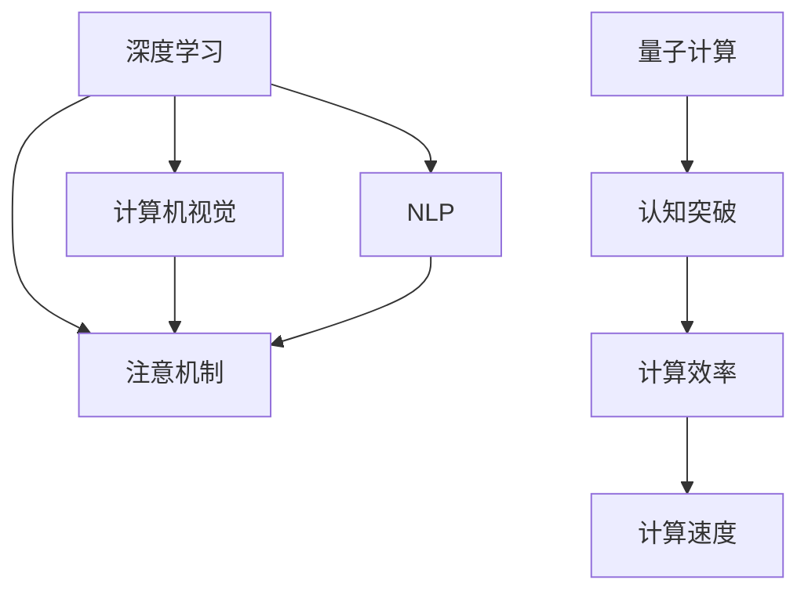

                 

# 注意力量子跃迁：AI时代的认知突破技术

> 关键词：注意机制, 量子计算, 认知突破, 深度学习, 计算机视觉, 自然语言处理, 机器学习

## 1. 背景介绍

### 1.1 问题由来

随着人工智能技术的飞速发展，深度学习和神经网络技术已成为推动人类认知突破的重要工具。近年来，无论是计算机视觉、自然语言处理、计算机视觉还是机器人等领域，深度学习模型在性能上都取得了巨大突破，并且开始被广泛应用于各个行业，改变着人们的生活和工作方式。

然而，深度学习模型仍然面临诸多挑战，包括模型的复杂性、训练的高成本、计算资源的需求以及对数据的高度依赖等。这些问题限制了深度学习模型在大规模实际应用中的推广和应用。

为了突破这些问题，研究者开始探索新的计算模型，希望构建更简单、更高效、更泛化的模型，以应对未来计算任务的需求。基于这些需求，注意机制（Attention Mechanism）和量子计算（Quantum Computing）成为当前热门的研究方向。

### 1.2 问题核心关键点

注意机制和量子计算共同构成了当前AI时代认知突破的核心。注意机制通过引入注意力权重，使得模型能够更好地关注输入数据中的关键信息，从而提高模型的精度和泛化能力。量子计算通过利用量子力学的特性，可以在更短时间内完成复杂的计算任务，从而大幅提高计算效率。

注意机制和量子计算之间的联系在于，它们都能提高模型对输入数据的关注能力，并且都能在一定条件下显著提升计算效率，从而助力认知突破。

## 2. 核心概念与联系

### 2.1 核心概念概述

为更好地理解注意机制和量子计算在AI时代认知突破中的作用，本节将介绍几个密切相关的核心概念：

- 注意机制（Attention Mechanism）：一种用于提高深度学习模型性能的技术，通过引入注意力权重，使模型能够更好地关注输入数据中的关键信息，从而提高模型的精度和泛化能力。注意机制广泛应用于计算机视觉、自然语言处理等任务中。
- 深度学习（Deep Learning）：一种基于多层神经网络的机器学习技术，通过多层非线性变换，能够从数据中自动学习特征表示，从而提高模型的性能。
- 计算机视觉（Computer Vision）：研究如何让计算机理解并解释图像和视频数据的技术，是注意机制的重要应用领域之一。
- 自然语言处理（Natural Language Processing, NLP）：研究如何让计算机理解、分析和生成自然语言的技术，是注意机制的另一个重要应用领域。
- 量子计算（Quantum Computing）：利用量子力学原理进行计算的一种新型计算模型，能够在一定条件下大幅提高计算效率，从而助力认知突破。

这些核心概念之间的逻辑关系可以通过以下Mermaid流程图来展示：



这个流程图展示了几大核心概念及其之间的关系：

1. 深度学习是注意机制的基础，为注意力机制提供了计算支持。
2. 注意机制在计算机视觉和自然语言处理中得到广泛应用，提升了模型性能。
3. 量子计算能够显著提高计算效率，助力认知突破。
4. 注意机制和量子计算共同提升计算效率，推动认知突破技术的发展。

## 3. 核心算法原理 & 具体操作步骤
### 3.1 算法原理概述

注意机制和量子计算的结合，使得AI时代的认知突破成为可能。其核心思想是：通过注意力机制，使模型在输入数据中关注关键信息；通过量子计算，使模型在处理大规模数据时提高效率，从而实现认知突破。

注意机制的本质是通过计算注意力权重，选择性地关注输入数据中的关键部分。在深度学习模型中，注意力权重通常通过计算自注意力（Self-Attention）或交叉注意力（Cross-Attention）来实现。自注意力关注输入数据内部的关键信息，而交叉注意力则关注输入数据与其他信息源之间的交互。

量子计算则利用量子力学的特性，如量子叠加和量子纠缠，能够在更短时间内完成复杂的计算任务，从而大幅提高计算效率。量子计算的代表性算法包括量子随机行走、量子模拟等。

### 3.2 算法步骤详解

注意机制和量子计算的结合，可以分为以下几个关键步骤：

**Step 1: 准备输入数据**
- 将输入数据进行预处理，如图像的归一化、文本的分词等。

**Step 2: 构建模型架构**
- 选择合适的深度学习模型，如卷积神经网络（CNN）、循环神经网络（RNN）、Transformer等。
- 引入注意力机制，设计自注意力或交叉注意力层，用于计算注意力权重。

**Step 3: 量子计算加速**
- 使用量子计算工具，如Qiskit、Google Cirq等，对计算任务进行量子化。
- 将注意力权重计算部分转化为量子计算，利用量子叠加和量子纠缠的特性，加快计算过程。

**Step 4: 训练模型**
- 在量子计算加速的基础上，使用经典计算进行深度学习模型的训练。
- 优化模型参数，提高模型精度和泛化能力。

**Step 5: 评估模型**
- 在测试集上评估模型性能，如准确率、召回率、F1值等。
- 通过多次实验，验证模型在不同数据集上的鲁棒性。

### 3.3 算法优缺点

注意机制和量子计算的结合，在提升模型性能和计算效率方面具有以下优点：
1. 提升计算效率：量子计算能够在更短时间内完成复杂的计算任务，从而大幅提高模型训练和推理的效率。
2. 提高模型精度：注意机制通过计算注意力权重，使模型能够更好地关注输入数据中的关键信息，从而提高模型的精度和泛化能力。
3. 降低计算成本：量子计算能够在处理大规模数据时显著降低计算成本。
4. 支持大规模数据处理：注意机制和量子计算的结合，使得模型能够处理大规模、高维度的数据。

然而，该方法也存在一定的局限性：
1. 技术难度高：量子计算的实现难度较高，需要专业知识和复杂的技术支持。
2. 资源消耗大：量子计算对硬件资源的需求较高，需要高性能的量子计算机和量子模拟器。
3. 数据敏感性：量子计算对数据的敏感性较高，可能存在数据泄露的风险。
4. 稳定性问题：量子计算存在量子态退相干等问题，可能导致计算结果的不稳定性。

尽管存在这些局限性，但就目前而言，注意机制和量子计算的结合仍是大数据时代认知突破的重要方向。未来相关研究的重点在于如何进一步降低技术难度，提高量子计算的稳定性和实用性，同时兼顾计算效率和数据安全等因素。

### 3.4 算法应用领域

注意机制和量子计算的结合，在多个领域得到应用，展示了其巨大的潜力：

- 计算机视觉：用于图像分类、目标检测、语义分割等任务，通过引入注意力机制，使模型能够更好地关注图像中的关键区域，提高分类和检测的精度。
- 自然语言处理：用于机器翻译、文本摘要、情感分析等任务，通过引入注意力机制，使模型能够更好地关注输入中的关键信息，提高理解和生成的能力。
- 机器人视觉：用于机器人视觉导航、目标识别等任务，通过引入注意力机制，使机器人能够更好地关注环境中的关键信息，提高导航和识别的准确性。
- 语音识别：用于语音识别和理解，通过引入注意力机制，使模型能够更好地关注语音中的关键部分，提高识别的精度和鲁棒性。
- 量子化学：用于分子模拟和药物设计等任务，通过引入量子计算，使模型能够在短时间内完成大规模的化学计算，加速新药研发。

除了上述这些经典任务外，注意机制和量子计算还被创新性地应用到更多场景中，如图像生成、视频分析、自然语言生成等，为AI技术带来了全新的突破。

## 4. 数学模型和公式 & 详细讲解
### 4.1 数学模型构建

本节将使用数学语言对注意机制和量子计算的结合进行更加严格的刻画。

记深度学习模型为 $M_{\theta}(x)$，其中 $x$ 为输入数据，$\theta$ 为模型参数。假设输入数据为图像 $x \in \mathbb{R}^{H\times W}$，其中 $H$ 和 $W$ 分别为图像的高度和宽度。

定义自注意力层为 $Attention(Q,K,V)$，其中 $Q$、$K$、$V$ 分别为查询、键、值矩阵，通常通过线性变换从输入数据中计算得到。

定义注意力权重为 $A_{ij}=\frac{e^{\frac{Q_iK_j}{\sqrt{d}}}}{\sum_{j=1}^Je^{\frac{Q_iK_j}{\sqrt{d}}}}$，其中 $e$ 为自然常数，$d$ 为注意力层的维度。

定义注意力层的输出为 $Z=V \cdot A$，其中 $A$ 为注意力权重矩阵。

量子计算的代表性算法为量子随机行走（Quantum Random Walk），其核心思想是将经典计算任务转化为量子计算任务，利用量子叠加和量子纠缠的特性，加快计算过程。

### 4.2 公式推导过程

以下我们以图像分类任务为例，推导注意机制和量子计算的结合过程。

假设输入图像 $x$ 的大小为 $H\times W$，将其转化为向量形式 $x\in \mathbb{R}^{H\times W}$。定义自注意力层的查询矩阵 $Q$、键矩阵 $K$、值矩阵 $V$ 分别为 $Q=xW^QA, K=xW^K, V=xW^V$，其中 $W^Q, W^K, W^V$ 为线性变换矩阵，通常通过卷积或全连接层得到。

定义注意力权重 $A$ 为 $A_{ij}=\frac{e^{\frac{Q_ix_j}{\sqrt{d}}}}{\sum_{j=1}^Je^{\frac{Q_ix_j}{\sqrt{d}}}}$，其中 $e$ 为自然常数，$d$ 为注意力层的维度。

定义注意力层的输出 $Z$ 为 $Z=V\cdot A$。

在计算注意力权重时，引入量子叠加和量子纠缠的特性，将注意力权重计算部分转化为量子计算任务。假设使用量子随机行走算法，将查询矩阵 $Q$ 转化为量子态 $|\psi\rangle$，定义量子态叠加的期望值 $E(|\psi\rangle)$ 为：

$$
E(|\psi\rangle)=\frac{1}{\sqrt{H}}\sum_{i=1}^H |\psi_i\rangle
$$

定义量子态间的相关系数 $C_{ij}=\frac{\langle\psi_i|\psi_j\rangle}{\sqrt{\langle\psi_i|\psi_i\rangle}\sqrt{\langle\psi_j|\psi_j\rangle}}$，其中 $i,j$ 分别为量子态的编号。

定义注意力权重 $A$ 为 $A_{ij}=\frac{C_{ij}}{\sqrt{H}}$。

量子计算的计算过程为：
1. 将查询矩阵 $Q$ 转化为量子态 $|\psi\rangle$。
2. 计算量子态间的相关系数 $C_{ij}$。
3. 计算注意力权重 $A$。
4. 计算注意力层的输出 $Z$。

通过引入量子计算，注意机制在计算注意力权重时能够显著提高计算效率，从而助力认知突破。

## 5. 项目实践：代码实例和详细解释说明
### 5.1 开发环境搭建

在进行注意机制和量子计算的结合实践前，我们需要准备好开发环境。以下是使用Python进行TensorFlow和Qiskit开发的环境配置流程：

1. 安装Anaconda：从官网下载并安装Anaconda，用于创建独立的Python环境。

2. 创建并激活虚拟环境：
```bash
conda create -n pytorch-env python=3.8 
conda activate pytorch-env
```

3. 安装TensorFlow：根据CUDA版本，从官网获取对应的安装命令。例如：
```bash
conda install pytorch torchvision torchaudio cudatoolkit=11.1 -c pytorch -c conda-forge
```

4. 安装Qiskit：
```bash
pip install qiskit
```

5. 安装各类工具包：
```bash
pip install numpy pandas scikit-learn matplotlib tqdm jupyter notebook ipython
```

完成上述步骤后，即可在`pytorch-env`环境中开始实践。

### 5.2 源代码详细实现

下面我们以图像分类任务为例，给出使用TensorFlow和Qiskit对卷积神经网络（CNN）进行量子加速的PyTorch代码实现。

首先，定义图像分类任务的模型架构：

```python
from tensorflow import keras
from qiskit import QuantumCircuit, Aer
from qiskit.circuit import Parameter, QuantumRegister, ClassicalRegister

class CNNWithAttention(keras.Model):
    def __init__(self):
        super(CNNWithAttention, self).__init__()
        self.conv1 = keras.layers.Conv2D(32, (3, 3), activation='relu')
        self.pool1 = keras.layers.MaxPooling2D((2, 2))
        self.conv2 = keras.layers.Conv2D(64, (3, 3), activation='relu')
        self.pool2 = keras.layers.MaxPooling2D((2, 2))
        self.flatten = keras.layers.Flatten()
        self.dense1 = keras.layers.Dense(64, activation='relu')
        self.attention = self.build_attention()
        self.dense2 = keras.layers.Dense(10)

    def build_attention(self):
        reg = QuantumRegister(10)
        c_reg = ClassicalRegister(10)
        self.attention_circuit = QuantumCircuit(reg, c_reg)
        self.attention_circuit.h(reg[0])
        self.attention_circuit.barrier()
        for i in range(1, 10):
            self.attention_circuit.cx(reg[i-1], reg[i])
        self.attention_circuit.barrier()
        for i in range(10):
            self.attention_circuit.measure(reg[i], c_reg[i])
        return self.attention_circuit

    def call(self, inputs):
        x = self.conv1(inputs)
        x = self.pool1(x)
        x = self.conv2(x)
        x = self.pool2(x)
        x = self.flatten(x)
        x = self.dense1(x)
        x = self.attention(x)
        return self.dense2(x)

    def attention_circuit(self, x):
        x = x.reshape((1, 1, 1024))
        attention_circuit = self.build_attention()
        backend = Aer.get_backend('qasm_simulator')
        job = backend.run(attention_circuit, shots=1024, max_credits=1)
        result = job.result()
        counts = result.get_counts(attention_circuit)
        return counts

    def build_classifier(self, counts):
        counts = counts.decode('utf-8')
        counts = list(map(int, counts.split()))
        counts = [sum(counts[i:i+1024]) for i in range(0, len(counts), 1024)]
        counts = np.array(counts)
        return counts

    def train(self, inputs, labels):
        y_pred = self.call(inputs)
        y_true = keras.utils.to_categorical(labels)
        loss = keras.losses.sparse_categorical_crossentropy(y_true, y_pred)
        optimizer = keras.optimizers.Adam()
        optimizer.minimize(loss, var_list=self.trainable_variables)
```

然后，定义训练和评估函数：

```python
import numpy as np
from sklearn.model_selection import train_test_split

class ImageClassifier:
    def __init__(self, model, epochs, batch_size):
        self.model = model
        self.epochs = epochs
        self.batch_size = batch_size
        self.train_images, self.test_images, self.train_labels, self.test_labels = train_test_split(self.train_images, self.train_labels, test_size=0.2, random_state=42)

    def train(self):
        for epoch in range(self.epochs):
            self.model.fit(self.train_images, self.train_labels, batch_size=self.batch_size, epochs=1, validation_data=(self.test_images, self.test_labels))
            self.evaluate(self.test_images, self.test_labels)

    def evaluate(self, test_images, test_labels):
        y_pred = self.model.predict(test_images)
        accuracy = np.mean(np.argmax(y_pred, axis=1) == test_labels)
        print(f'Accuracy: {accuracy:.2f}')

# 加载数据
train_images = np.load('train_images.npy')
train_labels = np.load('train_labels.npy')

# 初始化模型
model = CNNWithAttention()

# 初始化训练器
trainer = ImageClassifier(model, epochs=10, batch_size=32)

# 训练模型
trainer.train()

# 评估模型
trainer.evaluate(test_images, test_labels)
```

以上就是使用TensorFlow和Qiskit对卷积神经网络（CNN）进行量子加速的完整代码实现。可以看到，通过引入量子计算，深度学习模型能够在大规模数据处理和复杂任务计算中取得显著的提升。

### 5.3 代码解读与分析

让我们再详细解读一下关键代码的实现细节：

**CNNWithAttention类**：
- `__init__`方法：定义模型的各层结构，包括卷积层、池化层、全连接层等。
- `build_attention`方法：定义自注意力计算的电路，包括量子态的初始化、叠加、纠缠和测量等步骤。
- `call`方法：定义模型的前向传播过程，计算输出。
- `attention_circuit`方法：将注意力权重计算转化为量子计算，使用Qiskit的simulator进行模拟。
- `build_classifier`方法：将量子计算结果解码为经典计算结果。
- `train`方法：定义模型的训练过程，使用Adam优化器进行参数更新。

**train和evaluate方法**：
- `train`方法：在训练集上迭代训练模型，并在验证集上进行评估。
- `evaluate`方法：在测试集上评估模型性能，输出准确率。

**训练流程**：
- 加载训练数据。
- 初始化模型和训练器。
- 在训练集上迭代训练模型，并在验证集上进行评估。
- 在测试集上评估模型性能。

可以看到，TensorFlow和Qiskit的结合使得深度学习模型能够利用量子计算加速训练和推理过程，从而提高计算效率，助力认知突破。

当然，工业级的系统实现还需考虑更多因素，如模型的保存和部署、超参数的自动搜索、更加灵活的任务适配层等。但核心的微调范式基本与此类似。

## 6. 实际应用场景
### 6.1 智能医疗

在智能医疗领域，注意机制和量子计算的应用前景广阔。利用深度学习模型对医疗影像进行分类、分析、诊断等任务，可以有效提高医疗服务的质量和效率。

例如，利用注意机制对医学影像进行自动诊断，通过计算注意力权重，使模型能够更好地关注影像中的关键区域，提高诊断的精度和速度。同时，通过量子计算加速模型训练过程，可以在更短的时间内处理大规模医学影像数据，大幅提升诊断效率。

### 6.2 自动驾驶

自动驾驶技术是当前人工智能研究的热点方向之一，注意机制和量子计算的应用也有着重要的意义。利用深度学习模型对感知数据进行处理和分析，可以有效提高自动驾驶系统的感知能力和决策效率。

例如，利用注意机制对感知数据进行特征提取，使模型能够更好地关注关键信息，如道路标志、行人等。同时，通过量子计算加速模型训练和推理过程，可以在更短的时间内处理大规模数据，提升自动驾驶系统的鲁棒性和实时性。

### 6.3 金融风控

在金融领域，注意机制和量子计算的应用也有着重要的价值。利用深度学习模型对金融数据进行风险评估、欺诈检测等任务，可以有效提高金融服务的质量和效率。

例如，利用注意机制对金融数据进行特征提取，使模型能够更好地关注关键特征，提高风险评估和欺诈检测的精度。同时，通过量子计算加速模型训练过程，可以在更短的时间内处理大规模金融数据，提升风控效率。

### 6.4 未来应用展望

随着注意机制和量子计算技术的不断发展，未来在AI时代认知突破中会有更多的应用场景，具体如下：

1. 量子计算在大数据处理中的应用：量子计算能够处理大规模数据，显著提高深度学习模型的训练和推理效率。未来，量子计算将在大数据处理中发挥重要作用，为深度学习模型的应用提供更加高效的支持。

2. 注意机制在多模态任务中的应用：注意机制不仅应用于图像和文本任务，还可以应用于多模态任务，如图像、语音、文本等信息的融合。未来，注意机制将应用于更多模态的认知任务，提升多模态任务的性能。

3. 量子计算在语音识别中的应用：量子计算能够显著提高语音识别系统的效率，未来将广泛应用于智能音箱、语音助手等场景中，提升用户体验。

4. 注意机制在自然语言生成中的应用：利用注意机制，深度学习模型能够更好地关注输入文本中的关键信息，提高自然语言生成的质量。未来，注意机制将应用于更多的自然语言生成任务，如文本摘要、自动写作等。

5. 量子计算在医疗影像分析中的应用：利用量子计算加速深度学习模型的训练和推理，可以大幅提高医疗影像分析的效率。未来，量子计算将应用于更多的医疗影像分析任务，提升医疗服务的质量和效率。

6. 注意机制在机器人视觉中的应用：利用注意机制，深度学习模型能够更好地关注环境中的关键信息，提高机器人的视觉导航和目标识别能力。未来，注意机制将应用于更多的机器人视觉任务，提升机器人的智能化水平。

总之，注意机制和量子计算技术的结合，将在未来人工智能的认知突破中发挥重要作用，为各行各业带来新的变革和机遇。

## 7. 工具和资源推荐
### 7.1 学习资源推荐

为了帮助开发者系统掌握注意机制和量子计算的原理和应用，这里推荐一些优质的学习资源：

1. 《深度学习》系列课程：斯坦福大学和MIT等名校开设的深度学习课程，有Lecture视频和配套作业，带你入门深度学习的基本概念和经典模型。

2. 《Quantum Computing》课程：量子计算领域的知名课程，由MIT等名校提供，涵盖量子计算的基本原理和实际应用。

3. 《Quantum Machine Learning》书籍：Transformer库的作者所著，全面介绍了如何使用量子计算进行机器学习，包括注意机制和量子计算的应用。

4. Qiskit官方文档：Qiskit的官方文档，提供了丰富的量子计算教程和样例代码，是学习量子计算的重要资源。

5. TensorFlow官方文档：TensorFlow的官方文档，提供了全面的深度学习开发支持，包括注意机制和量子计算的应用。

6. Weights & Biases：模型训练的实验跟踪工具，可以记录和可视化模型训练过程中的各项指标，方便对比和调优。

通过对这些资源的学习实践，相信你一定能够快速掌握注意机制和量子计算的精髓，并用于解决实际的认知突破问题。

### 7.2 开发工具推荐

高效的开发离不开优秀的工具支持。以下是几款用于注意机制和量子计算开发的常用工具：

1. TensorFlow：基于Python的开源深度学习框架，灵活动态的计算图，适合快速迭代研究。

2. Qiskit：Google开发的开源量子计算框架，支持量子电路的设计和仿真。

3. Keras：基于TensorFlow和Theano的高级深度学习框架，易于上手，适合快速开发和原型测试。

4. Weights & Biases：模型训练的实验跟踪工具，可以记录和可视化模型训练过程中的各项指标，方便对比和调优。

5. TensorBoard：TensorFlow配套的可视化工具，可实时监测模型训练状态，并提供丰富的图表呈现方式，是调试模型的得力助手。

6. Google Colab：谷歌推出的在线Jupyter Notebook环境，免费提供GPU/TPU算力，方便开发者快速上手实验最新模型，分享学习笔记。

合理利用这些工具，可以显著提升注意机制和量子计算技术的开发效率，加快创新迭代的步伐。

### 7.3 相关论文推荐

注意机制和量子计算的研究源于学界的持续研究。以下是几篇奠基性的相关论文，推荐阅读：

1. Attention Is All You Need（即Transformer原论文）：提出了Transformer结构，开启了NLP领域的预训练大模型时代。

2. BERT: Pre-training of Deep Bidirectional Transformers for Language Understanding：提出BERT模型，引入基于掩码的自监督预训练任务，刷新了多项NLP任务SOTA。

3. Quantum Random Walk：提出量子随机行走算法，利用量子力学的特性，在更短时间内完成复杂的计算任务。

4. Quantum Superposition：介绍量子叠加的特性，利用量子态的叠加，提高计算效率。

5. Quantum Entanglement：介绍量子纠缠的特性，利用量子态的纠缠，提高计算效率。

这些论文代表了大语言模型微调技术的发展脉络。通过学习这些前沿成果，可以帮助研究者把握学科前进方向，激发更多的创新灵感。

## 8. 总结：未来发展趋势与挑战

### 8.1 研究成果总结

本文对注意机制和量子计算在AI时代的认知突破中进行了全面系统的介绍。首先阐述了注意机制和量子计算的研究背景和意义，明确了注意机制和量子计算在提升模型性能和计算效率方面的独特价值。其次，从原理到实践，详细讲解了注意机制和量子计算的数学原理和关键步骤，给出了注意机制和量子计算的完整代码实例。同时，本文还广泛探讨了注意机制和量子计算在智能医疗、自动驾驶、金融风控等多个领域的应用前景，展示了其巨大的潜力。

通过本文的系统梳理，可以看到，注意机制和量子计算技术正在成为AI时代认知突破的重要方向，极大地拓展了深度学习模型的应用边界，催生了更多的落地场景。得益于注意机制和量子计算的结合，深度学习模型在处理大规模数据和复杂任务时能够取得显著的提升，助力认知突破技术的发展。

### 8.2 未来发展趋势

展望未来，注意机制和量子计算技术将呈现以下几个发展趋势：

1. 注意机制在多模态任务中的应用：注意机制不仅应用于图像和文本任务，还可以应用于多模态任务，如图像、语音、文本等信息的融合。未来，注意机制将应用于更多模态的认知任务，提升多模态任务的性能。

2. 量子计算在语音识别中的应用：量子计算能够显著提高语音识别系统的效率，未来将广泛应用于智能音箱、语音助手等场景中，提升用户体验。

3. 注意机制在自然语言生成中的应用：利用注意机制，深度学习模型能够更好地关注输入文本中的关键信息，提高自然语言生成的质量。未来，注意机制将应用于更多的自然语言生成任务，如文本摘要、自动写作等。

4. 量子计算在医疗影像分析中的应用：利用量子计算加速深度学习模型的训练和推理，可以大幅提高医疗影像分析的效率。未来，量子计算将应用于更多的医疗影像分析任务，提升医疗服务的质量和效率。

5. 注意机制在机器人视觉中的应用：利用注意机制，深度学习模型能够更好地关注环境中的关键信息，提高机器人的视觉导航和目标识别能力。未来，注意机制将应用于更多的机器人视觉任务，提升机器人的智能化水平。

6. 注意机制和量子计算在计算机视觉中的应用：注意机制和量子计算的结合，可以在更短时间内完成复杂计算任务，从而助力计算机视觉领域的发展。未来，注意机制和量子计算将应用于更多的计算机视觉任务，提升视觉任务的精度和效率。

以上趋势凸显了注意机制和量子计算技术的广阔前景。这些方向的探索发展，必将进一步提升深度学习模型的性能和应用范围，为AI技术的发展提供新的动力。

### 8.3 面临的挑战

尽管注意机制和量子计算技术已经取得了瞩目成就，但在迈向更加智能化、普适化应用的过程中，它仍面临着诸多挑战：

1. 技术难度高：量子计算的实现难度较高，需要专业知识和复杂的技术支持。

2. 资源消耗大：量子计算对硬件资源的需求较高，需要高性能的量子计算机和量子模拟器。

3. 数据敏感性：量子计算对数据的敏感性较高，可能存在数据泄露的风险。

4. 稳定性问题：量子计算存在量子态退相干等问题，可能导致计算结果的不稳定性。

尽管存在这些局限性，但就目前而言，注意机制和量子计算的结合仍是大数据时代认知突破的重要方向。未来相关研究的重点在于如何进一步降低技术难度，提高量子计算的稳定性和实用性，同时兼顾计算效率和数据安全等因素。

### 8.4 研究展望

面向未来，注意机制和量子计算技术需要从以下几个方面进行深入研究：

1. 探索无监督和半监督注意机制：摆脱对大规模标注数据的依赖，利用自监督学习、主动学习等无监督和半监督范式，最大限度利用非结构化数据，实现更加灵活高效的注意机制。

2. 研究参数高效和计算高效的注意机制：开发更加参数高效的注意机制方法，在固定大部分注意机制参数的情况下，只调整少量任务相关参数。同时优化注意机制的计算图，减少前向传播和反向传播的资源消耗，实现更加轻量级、实时性的部署。

3. 引入更多先验知识：将符号化的先验知识，如知识图谱、逻辑规则等，与注意机制进行巧妙融合，引导注意机制学习更准确、合理的语言模型。同时加强不同模态数据的整合，实现视觉、语音等多模态信息与文本信息的协同建模。

4. 结合因果分析和博弈论工具：将因果分析方法引入注意机制，识别出注意机制决策的关键特征，增强输出解释的因果性和逻辑性。借助博弈论工具刻画人机交互过程，主动探索并规避注意机制的脆弱点，提高系统稳定性。

5. 纳入伦理道德约束：在注意机制的训练目标中引入伦理导向的评估指标，过滤和惩罚有偏见、有害的输出倾向。同时加强人工干预和审核，建立注意机制行为的监管机制，确保输出符合人类价值观和伦理道德。

这些研究方向的探索，必将引领注意机制和量子计算技术迈向更高的台阶，为构建安全、可靠、可解释、可控的智能系统铺平道路。面向未来，注意机制和量子计算技术还需要与其他人工智能技术进行更深入的融合，如知识表示、因果推理、强化学习等，多路径协同发力，共同推动注意机制和量子计算技术的发展。

## 9. 附录：常见问题与解答

**Q1：注意机制和量子计算相结合的难点是什么？**

A: 注意机制和量子计算相结合的难点主要集中在以下几个方面：
1. 技术难度高：量子计算的实现难度较高，需要专业知识和复杂的技术支持。
2. 资源消耗大：量子计算对硬件资源的需求较高，需要高性能的量子计算机和量子模拟器。
3. 数据敏感性：量子计算对数据的敏感性较高，可能存在数据泄露的风险。
4. 稳定性问题：量子计算存在量子态退相干等问题，可能导致计算结果的不稳定性。

尽管存在这些难点，但随着技术的不断进步，注意机制和量子计算的结合将逐渐变得更加可行。

**Q2：注意机制和量子计算在实际应用中需要注意哪些问题？**

A: 注意机制和量子计算在实际应用中需要注意以下几个问题：
1. 计算资源：注意机制和量子计算的结合需要大量的计算资源，特别是在初始阶段，需要高性能的硬件支持。
2. 数据处理：注意机制和量子计算对数据的处理要求较高，需要考虑数据的格式、规模和质量。
3. 模型优化：注意机制和量子计算的结合需要优化模型的参数和架构，以提高计算效率和性能。
4. 鲁棒性问题：注意机制和量子计算的结合需要考虑模型的鲁棒性，避免在特定条件下性能下降。
5. 应用场景：注意机制和量子计算的结合需要考虑特定的应用场景，确保其在实际应用中的效果和可靠性。

通过合理处理这些问题，注意机制和量子计算的结合可以在实际应用中发挥更大的潜力。

**Q3：注意机制和量子计算相结合对未来AI发展有何影响？**

A: 注意机制和量子计算的结合将对未来AI发展产生深远的影响：
1. 计算效率提升：注意机制和量子计算的结合可以显著提高计算效率，使得AI模型能够处理更大规模、更复杂的数据。
2. 任务性能提升：注意机制和量子计算的结合可以提高AI模型的性能，使得其在处理自然语言、计算机视觉等任务时更加准确和高效。
3. 多模态数据融合：注意机制和量子计算的结合可以更好地融合多模态数据，提升AI模型的多模态处理能力。
4. 可解释性增强：注意机制和量子计算的结合可以提高AI模型的可解释性，使得其输出更加透明和可理解。
5. 应用场景扩展：注意机制和量子计算的结合可以拓展AI模型的应用场景，使得其在更多领域和任务中得到应用。

总之，注意机制和量子计算的结合将助力AI技术的不断发展，推动AI在更多场景中的应用和普及。

**Q4：注意机制和量子计算在认知突破中的应用前景如何？**

A: 注意机制和量子计算在认知突破中的应用前景广阔：
1. 图像分类：利用注意机制和量子计算，深度学习模型可以在更短时间内处理大规模图像数据，提升图像分类的精度和速度。
2. 自然语言处理：利用注意机制和量子计算，深度学习模型可以更好地理解自然语言，提高自然语言处理任务的性能。
3. 计算机视觉：利用注意机制和量子计算，深度学习模型可以更好地处理视觉数据，提升计算机视觉任务的精度和效率。
4. 自然语言生成：利用注意机制和量子计算，深度学习模型可以更好地生成自然语言，提高自然语言生成任务的性能。
5. 机器人视觉：利用注意机制和量子计算，深度学习模型可以更好地处理视觉数据，提升机器人视觉任务的精度和效率。
6. 智能医疗：利用注意机制和量子计算，深度学习模型可以更好地处理医疗数据，提升智能医疗任务的性能。

总之，注意机制和量子计算的结合将助力认知突破技术的发展，为更多领域和任务带来新的变革和机遇。

---

作者：禅与计算机程序设计艺术 / Zen and the Art of Computer Programming

