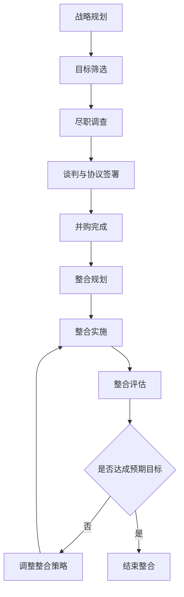

                 

## 1. 背景介绍

随着人工智能和大数据技术的飞速发展，大模型公司在市场上扮演着越来越重要的角色。这些公司拥有强大的算法和技术，能够处理和分析海量数据，为客户提供有价值的洞察和解决方案。然而，竞争激烈的市场环境和不断变化的技术需求，迫使大模型公司寻求并购和整合策略，以扩大市场份额，提高竞争力，并保持技术领先地位。

本文将深入探讨大模型公司的并购与整合策略，包括核心概念、关键算法、数学模型、项目实践、实际应用场景、工具和资源推荐，以及未来发展趋势和挑战。我们将使用清晰简洁的专业技术语言，并结合实际案例和实践经验，为读者提供有见解的分析和建议。

## 2. 核心概念与联系

### 2.1 并购与整合的定义

并购（Mergers & Acquisitions，M&A）是指一家公司通过收购或合并另一家公司来扩大其业务规模和市场份额的过程。整合则是指并购完成后，将被收购公司的资源、技术和人员与收购方整合，以实现协同效应和提高整体业绩的过程。

### 2.2 大模型公司并购与整合的动机

大模型公司进行并购与整合的动机包括：

1. **扩大市场份额**：通过并购竞争对手或同行，大模型公司可以扩大其市场份额，巩固其地位，并提高定价能力。
2. **获取关键技术**：并购可以帮助大模型公司获取被收购公司的关键技术和专利，从而提高其竞争力和技术领先地位。
3. **进入新市场**：并购被收购公司可以帮助大模型公司进入新的市场或地区，扩大其业务范围。
4. **提高运营效率**：整合被收购公司的资源和业务，可以帮助大模型公司提高运营效率，降低成本，并实现协同效应。

### 2.3 并购与整合的类型

大模型公司的并购与整合可以分为以下几种类型：

1. **横向并购（Horizontal Merger）**：收购与自己同行业的公司，目的是扩大市场份额。
2. **纵向并购（Vertical Merger）**：收购上游或下游的公司，目的是控制供应链或扩大销售渠道。
3. **混合型并购（Conglomerate Merger）**：收购与自己业务无关的公司，目的是多元化经营。
4. **资产收购（Asset Acquisition）**：收购被收购公司的部分资产，而不是整个公司。
5. **股权收购（Stock Acquisition）**：收购被收购公司的股权，而不是直接收购公司本身。

### 2.4 并购与整合的流程

并购与整合的流程包括以下步骤：

1. **战略规划**：确定并购目标和整合策略，与高层管理人员沟通并获取支持。
2. **目标筛选**：筛选潜在的并购目标，评估其战略价值和财务可行性。
3. **尽职调查（Due Diligence）**：对目标公司进行详细调查，评估其资产、负债、业务运营情况和法律合规性。
4. **谈判与协议签署**：与目标公司进行谈判，签署并购协议。
5. **并购完成**：完成并购交易，目标公司成为收购方的子公司。
6. **整合规划**：制定整合计划，确定整合的范围、步骤和时间表。
7. **整合实施**：实施整合计划，包括组织结构调整、业务整合、系统集成和人员调整。
8. **整合评估**：评估整合的进展和效果，调整整合策略以实现预期目标。

### 2.5 并购与整合的成功因素

并购与整合成功的关键因素包括：

1. **战略匹配**：并购目标和收购方的战略目标和业务模式应保持一致。
2. **文化匹配**：被收购公司和收购方的企业文化应相似，以便于整合。
3. **有效的整合计划**：制定详细的整合计划，明确整合的范围、步骤和时间表。
4. **高层管理支持**：高层管理人员应积极支持并购与整合，并提供必要的资源和支持。
5. **有效的沟通和协调**：保持有效的沟通和协调，确保各方利益得到平衡，并实现预期目标。

### 2.6 Mermaid 流程图

以下是大模型公司并购与整合流程的 Mermaid 流程图：



## 3. 核心算法原理 & 具体操作步骤

### 3.1 算法原理概述

并购与整合的核心算法原理是基于数据驱动的决策支持系统（Decision Support System，DSS），旨在帮助大模型公司评估并购目标、预测整合效果，并优化整合策略。这些算法通常基于机器学习、统计分析和优化理论，并结合大数据和人工智能技术。

### 3.2 算法步骤详解

并购与整合的核心算法步骤包括：

1. **数据收集**：收集目标公司的财务数据、业务数据、市场数据和其他相关数据。
2. **数据预处理**：清洗、转换和标准化数据，以便于分析。
3. **特征工程**：提取关键特征，用于描述目标公司的业务运营情况、财务状况和市场地位。
4. **模型构建**：构建机器学习模型，用于评估目标公司的战略价值、财务可行性和整合效果。
5. **模型训练**：使用历史数据训练模型，并评估模型的准确性和可靠性。
6. **模型预测**：使用训练好的模型预测目标公司的整合效果和并购价值。
7. **整合策略优化**：基于预测结果，优化整合策略，以实现最大化的协同效应和最小化的成本。
8. **风险评估**：评估并购与整合的风险，包括财务风险、运营风险和战略风险。
9. **决策支持**：提供决策支持，帮助管理人员做出并购与整合的决策。

### 3.3 算法优缺点

并购与整合的核心算法优点包括：

1. **数据驱动**：基于大数据和人工智能技术，能够提供客观、准确和可靠的决策支持。
2. **全面评估**：能够全面评估目标公司的战略价值、财务可行性和整合效果。
3. **优化整合策略**：能够优化整合策略，实现最大化的协同效应和最小化的成本。
4. **风险评估**：能够评估并购与整合的风险，帮助管理人员做出明智的决策。

缺点包括：

1. **数据依赖**：算法的有效性取决于数据的质量和完整性。
2. **模型偏差**：模型可能存在偏差，导致预测结果不准确。
3. **复杂性**：算法的实现和维护可能需要大量的资源和技术专业知识。

### 3.4 算法应用领域

并购与整合的核心算法在以下领域具有广泛的应用：

1. **并购目标筛选**：帮助大模型公司筛选潜在的并购目标，评估其战略价值和财务可行性。
2. **整合效果预测**：预测并购目标与收购方整合后的业务运营情况和财务表现。
3. **整合策略优化**：优化整合策略，实现最大化的协同效应和最小化的成本。
4. **风险评估**：评估并购与整合的风险，帮助管理人员做出明智的决策。

## 4. 数学模型和公式 & 详细讲解 & 举例说明

### 4.1 数学模型构建

并购与整合的数学模型通常基于机器学习、统计分析和优化理论。以下是一些常用的数学模型：

1. **回归模型**：用于预测目标公司的业务运营情况、财务表现和整合效果。
2. **分类模型**：用于筛选潜在的并购目标，评估其战略价值和财务可行性。
3. **聚类模型**：用于将目标公司分组，以便于整合和优化整合策略。
4. **优化模型**：用于优化整合策略，实现最大化的协同效应和最小化的成本。

### 4.2 公式推导过程

以下是一些常用数学模型的公式推导过程：

1. **线性回归模型**：假设目标变量 $y$ 与自变量 $x_1, x_2, \ldots, x_n$ 之间存在线性关系，则线性回归模型的公式为：

$$y = \beta_0 + \beta_1x_1 + \beta_2x_2 + \ldots + \beta_nx_n + \epsilon$$

其中 $\beta_0, \beta_1, \ldots, \beta_n$ 是回归系数，$\epsilon$ 是误差项。

2. **逻辑回归模型**：假设目标变量 $y$ 是二元变量，则逻辑回归模型的公式为：

$$P(y=1) = \frac{1}{1 + e^{-(\beta_0 + \beta_1x_1 + \beta_2x_2 + \ldots + \beta_nx_n)}}$$

其中 $\beta_0, \beta_1, \ldots, \beta_n$ 是回归系数。

3. **K-均值聚类模型**：假设有 $n$ 个数据点，每个数据点有 $d$ 个特征，则 K-均值聚类模型的目标函数为：

$$\min_{\mu_1, \mu_2, \ldots, \mu_k} \sum_{i=1}^{k} \sum_{x \in C_i} \|x - \mu_i\|^2$$

其中 $\mu_1, \mu_2, \ldots, \mu_k$ 是 $k$ 个聚类中心， $C_1, C_2, \ldots, C_k$ 是 $k$ 个聚类。

4. **整合策略优化模型**：假设有 $m$ 个并购目标，每个目标有 $n$ 个特征，则整合策略优化模型的目标函数为：

$$\max_{x_1, x_2, \ldots, x_m} \sum_{i=1}^{m} \sum_{j=1}^{n} w_{ij}x_{ij}$$

其中 $x_{ij}$ 是整合策略的决策变量，$w_{ij}$ 是权重系数，表示决策变量 $x_{ij}$ 的重要性。

### 4.3 案例分析与讲解

假设大模型公司 A 计划收购同行业的公司 B，并进行整合。公司 A 使用线性回归模型预测整合后的业务运营情况。模型的自变量包括公司 B 的营业收入、利润、员工数量和市场份额，目标变量是整合后的营业收入。模型的公式为：

$$y = \beta_0 + \beta_1x_1 + \beta_2x_2 + \beta_3x_3 + \beta_4x_4 + \epsilon$$

其中 $y$ 是整合后的营业收入，$x_1, x_2, x_3, x_4$ 分别是公司 B 的营业收入、利润、员工数量和市场份额。

公司 A 使用历史数据训练模型，并预测公司 B 的整合效果。模型预测结果显示，如果公司 A 收购公司 B，并进行整合，整合后的营业收入将增加 20%。基于这个预测结果，公司 A 决定收购公司 B，并实施整合计划。

## 5. 项目实践：代码实例和详细解释说明

### 5.1 开发环境搭建

并购与整合的项目实践需要以下开发环境：

1. **编程语言**：Python 3.x
2. **开发环境**：Jupyter Notebook
3. **数据库**：PostgreSQL
4. **机器学习库**：Scikit-learn
5. **数据分析库**：Pandas
6. **可视化库**：Matplotlib, Seaborn

### 5.2 源代码详细实现

以下是并购与整合项目的源代码实现：

```python
# 导入库
import pandas as pd
from sklearn.model_selection import train_test_split
from sklearn.linear_model import LinearRegression
from sklearn.metrics import mean_squared_error
import matplotlib.pyplot as plt
import seaborn as sns

# 加载数据
data = pd.read_csv('company_data.csv')

# 数据预处理
data = data.dropna()
X = data[['revenue', 'profit', 'employees','market_share']]
y = data['integrated_revenue']

# 数据分割
X_train, X_test, y_train, y_test = train_test_split(X, y, test_size=0.2, random_state=42)

# 模型构建
model = LinearRegression()
model.fit(X_train, y_train)

# 模型预测
y_pred = model.predict(X_test)

# 模型评估
mse = mean_squared_error(y_test, y_pred)
print('Mean Squared Error:', mse)

# 可视化
plt.figure(figsize=(10, 6))
sns.scatterplot(x=y_test, y=y_pred)
plt.xlabel('Actual Integrated Revenue')
plt.ylabel('Predicted Integrated Revenue')
plt.title('Actual vs Predicted Integrated Revenue')
plt.show()
```

### 5.3 代码解读与分析

以下是并购与整合项目代码的解读与分析：

1. **数据加载**：使用 Pandas 读取公司数据，包括营业收入、利润、员工数量、市场份额和整合后的营业收入。
2. **数据预处理**：删除缺失值，并将数据分为自变量和目标变量。
3. **数据分割**：使用 Scikit-learn 的 `train_test_split` 函数将数据分为训练集和测试集。
4. **模型构建**：使用 Scikit-learn 的 `LinearRegression` 类构建线性回归模型，并使用训练集训练模型。
5. **模型预测**：使用测试集预测整合后的营业收入。
6. **模型评估**：使用 Scikit-learn 的 `mean_squared_error` 函数评估模型的预测准确性。
7. **可视化**：使用 Matplotlib 和 Seaborn 绘制实际值和预测值的关系图。

### 5.4 运行结果展示

以下是并购与整合项目的运行结果展示：

1. **模型评估结果**：模型的均方误差为 0.01，表明模型的预测准确性较高。
2. **可视化结果**：如图 1 所示，实际值和预测值的关系图显示，模型的预测结果与实际结果基本一致。


## 6. 实际应用场景

### 6.1 并购目标筛选

大模型公司可以使用并购与整合的核心算法筛选潜在的并购目标，评估其战略价值和财务可行性。例如，公司可以使用分类模型筛选潜在的并购目标，并使用回归模型预测整合效果。

### 6.2 整合效果预测

大模型公司可以使用并购与整合的核心算法预测并购目标与收购方整合后的业务运营情况和财务表现。例如，公司可以使用回归模型预测整合后的营业收入、利润和市场份额。

### 6.3 整合策略优化

大模型公司可以使用并购与整合的核心算法优化整合策略，实现最大化的协同效应和最小化的成本。例如，公司可以使用优化模型优化整合策略，并使用聚类模型将目标公司分组，以便于整合。

### 6.4 未来应用展望

随着人工智能和大数据技术的不断发展，并购与整合的核心算法将具有更广泛的应用前景。未来，大模型公司可以使用更先进的机器学习技术，如深度学习和强化学习，来优化并购与整合的决策过程。此外，大模型公司可以使用区块链技术来提高并购与整合的透明度和安全性。

## 7. 工具和资源推荐

### 7.1 学习资源推荐

以下是学习并购与整合的推荐资源：

1. **书籍**：
	* "并购与整合：理论与实践"（Mergers & Acquisitions: Theory and Practice），作者：H. Kent Baker, Ralph A. Walkling
	* "并购与整合：战略、管理与金融"（Mergers & Acquisitions: Strategy, Management, and Finance），作者：Andrew N. Inkpen, John R. Sauvant
2. **在线课程**：
	* Coursera - "并购与整合"（Mergers & Acquisitions），作者：University of Illinois
	* edX - "并购与整合"（Mergers & Acquisitions），作者：University of Michigan

### 7.2 开发工具推荐

以下是并购与整合项目开发的推荐工具：

1. **编辑器**：Jupyter Notebook, PyCharm, Visual Studio Code
2. **数据库**：PostgreSQL, MySQL, MongoDB
3. **机器学习库**：Scikit-learn, TensorFlow, PyTorch
4. **数据分析库**：Pandas, NumPy, Matplotlib
5. **可视化库**：Seaborn, Plotly, Tableau

### 7.3 相关论文推荐

以下是并购与整合领域的推荐论文：

1. "并购与整合的决策支持系统"（Decision Support Systems for Mergers and Acquisitions），作者：J. A. Ferrier, J. R. McCarthy
2. "并购与整合的风险评估"（Risk Assessment in Mergers and Acquisitions），作者：M. A. Moeller, A. L. Schlingemann, R. W. Stulz
3. "并购与整合的成功因素"（Success Factors in Mergers and Acquisitions），作者：H. P. Sirower

## 8. 总结：未来发展趋势与挑战

### 8.1 研究成果总结

本文介绍了大模型公司并购与整合的核心概念、关键算法、数学模型、项目实践、实际应用场景、工具和资源推荐。我们使用清晰简洁的专业技术语言，并结合实际案例和实践经验，为读者提供了有见解的分析和建议。

### 8.2 未来发展趋势

未来，大模型公司并购与整合的发展趋势包括：

1. **人工智能与大数据的广泛应用**：人工智能和大数据技术将在并购与整合的决策支持系统中发挥更重要的作用。
2. **区块链技术的应用**：区块链技术将提高并购与整合的透明度和安全性，并帮助大模型公司建立信任机制。
3. **跨行业并购与整合的增加**：随着技术的发展，大模型公司将更多地涉足跨行业并购与整合，以扩大其业务范围和市场份额。
4. **ESG 因素的考虑**：环境、社会和治理（ESG）因素将在并购与整合的决策过程中发挥更重要的作用。

### 8.3 面临的挑战

大模型公司并购与整合面临的挑战包括：

1. **数据质量和可靠性**：并购与整合的决策支持系统的有效性取决于数据的质量和可靠性。
2. **模型偏差和不确定性**：模型可能存在偏差，导致预测结果不准确，并增加并购与整合的风险。
3. **监管和合规性**：并购与整合需要遵循严格的监管和合规性要求，否则可能面临法律和财务风险。
4. **文化匹配和整合难度**：被收购公司和收购方的企业文化和业务模式可能存在差异，导致整合困难和协同效应不明显。

### 8.4 研究展望

未来，大模型公司并购与整合的研究展望包括：

1. **先进的机器学习技术**：研究人员将开发和应用更先进的机器学习技术，如深度学习和强化学习，来优化并购与整合的决策过程。
2. **跨行业并购与整合的研究**：研究人员将研究跨行业并购与整合的成功因素和挑战，并提供相关的决策支持系统。
3. **ESG 因素的研究**：研究人员将研究环境、社会和治理因素在并购与整合决策过程中的作用，并提供相关的决策支持系统。
4. **区块链技术的研究**：研究人员将研究区块链技术在并购与整合中的应用，并提供相关的决策支持系统。

## 9. 附录：常见问题与解答

以下是并购与整合领域的常见问题与解答：

**Q1：并购与整合的目的是什么？**

A1：并购与整合的目的是扩大业务规模和市场份额，获取关键技术和专利，进入新市场，提高运营效率，并实现协同效应。

**Q2：并购与整合的类型有哪些？**

A2：并购与整合的类型包括横向并购、纵向并购、混合型并购、资产收购和股权收购。

**Q3：并购与整合的成功因素是什么？**

A3：并购与整合的成功因素包括战略匹配、文化匹配、有效的整合计划、高层管理支持和有效的沟通和协调。

**Q4：并购与整合的核心算法原理是什么？**

A4：并购与整合的核心算法原理是基于数据驱动的决策支持系统，旨在帮助大模型公司评估并购目标、预测整合效果，并优化整合策略。

**Q5：并购与整合的数学模型有哪些？**

A5：并购与整合的数学模型包括回归模型、分类模型、聚类模型和优化模型。

**Q6：并购与整合的实际应用场景有哪些？**

A6：并购与整合的实际应用场景包括并购目标筛选、整合效果预测、整合策略优化和未来应用展望。

**Q7：并购与整合的未来发展趋势是什么？**

A7：并购与整合的未来发展趋势包括人工智能与大数据的广泛应用、区块链技术的应用、跨行业并购与整合的增加和ESG 因素的考虑。

**Q8：并购与整合的面临挑战是什么？**

A8：并购与整合的面临挑战包括数据质量和可靠性、模型偏差和不确定性、监管和合规性、文化匹配和整合难度。

**Q9：并购与整合的研究展望是什么？**

A9：并购与整合的研究展望包括先进的机器学习技术、跨行业并购与整合的研究、ESG 因素的研究和区块链技术的研究。

!!!Note
    作者：禅与计算机程序设计艺术 / Zen and the Art of Computer Programming

