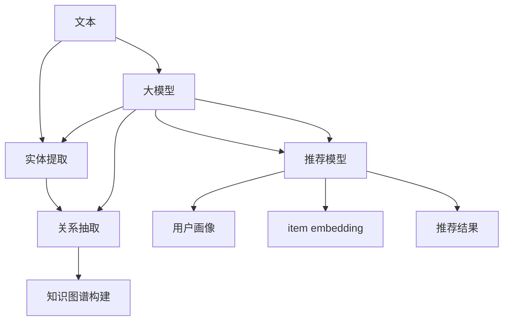

                 

## 1. 背景介绍

在当今信息爆炸的时代，用户面对海量的信息和产品，如何提供个性化的推荐服务，提高用户体验，是推荐系统需要解决的关键问题。传统的推荐系统主要基于用户行为数据，如点击、购买等，进行协同过滤或基于内容的推荐。然而，这些方法无法利用外部知识，导致推荐结果的多样性和准确性受限。

知识图谱（Knowledge Graph）是一种结构化的知识表示，它通过实体和关系构成的图来表示世界上的知识。将知识图谱应用于推荐系统，可以为推荐提供更丰富的上下文信息，从而提高推荐的准确性和多样性。大模型（Large Model）是指具有庞大参数量和复杂结构的模型，它们可以学习到丰富的语义表示，为知识图谱的构建和推荐提供了新的可能性。

本文将介绍大模型在基于知识图谱的推荐中的作用，重点关注大模型在知识图谱构建、推荐模型中起到的作用，并通过实践项目和实际应用场景进行验证。

## 2. 核心概念与联系

### 2.1 知识图谱

知识图谱是一种结构化的知识表示，它通过实体和关系构成的图来表示世界上的知识。知识图谱的构建通常包括以下步骤：

1. 实体提取：从文本中提取实体，如人名、地名、组织等。
2. 关系抽取：从文本中抽取实体之间的关系，如“住在哪里”、“毕业于哪所学校”等。
3. 知识图谱构建：将抽取的实体和关系构建成图谱。

### 2.2 大模型

大模型是指具有庞大参数量和复杂结构的模型，它们可以学习到丰富的语义表示。大模型的优势在于可以学习到更复杂的语义表示，从而提高模型的表达能力。常见的大模型包括transformer模型、BERT、RoBERTa等。

### 2.3 大模型在知识图谱构建中的作用

大模型可以在知识图谱构建的各个步骤起到关键作用。例如，在实体提取步骤，大模型可以用于命名实体识别（Named Entity Recognition，NER），准确地从文本中提取实体。在关系抽取步骤，大模型可以用于关系抽取任务，准确地从文本中抽取实体之间的关系。在知识图谱构建步骤，大模型可以用于知识图谱的完善和扩展，如基于文本的实体链接（Entity Linking）和关系预测（Relation Prediction）。

### 2.4 大模型在推荐模型中的作用

大模型可以为推荐模型提供丰富的语义表示，从而提高推荐的准确性和多样性。例如，大模型可以用于用户画像（User Profiling），为用户构建更准确的兴趣表示。大模型还可以用于item embedding（项目嵌入），为项目构建更丰富的语义表示。此外，大模型还可以用于推荐模型的 fine-tuning（微调），为推荐模型提供更丰富的上下文信息。

### 2.5 核心概念联系 Mermaid 流程图



## 3. 核心算法原理 & 具体操作步骤

### 3.1 算法原理概述

本节将介绍大模型在知识图谱构建和推荐模型中的两个关键算法：关系抽取和用户画像。

### 3.2 算法步骤详解

#### 3.2.1 关系抽取

关系抽取是指从文本中抽取实体之间的关系的任务。大模型可以用于关系抽取任务，其步骤如下：

1. 实体提取：使用大模型进行命名实体识别，从文本中提取实体。
2. 关系抽取：使用大模型对文本进行编码，然后使用分类器预测实体之间的关系。
3. 关系抽取后处理：对抽取的关系进行后处理，如去除低置信度的关系。

#### 3.2.2 用户画像

用户画像是指为用户构建兴趣表示的任务。大模型可以用于用户画像任务，其步骤如下：

1. 用户行为数据收集：收集用户的行为数据，如点击、购买等。
2. 用户行为数据编码：使用大模型对用户行为数据进行编码，得到用户的兴趣表示。
3. 用户画像更新：定期更新用户画像，以反映用户的最新兴趣。

### 3.3 算法优缺点

#### 3.3.1 关系抽取

优点：

* 大模型可以学习到丰富的语义表示，从而提高关系抽取的准确性。
* 大模型可以处理长文本，从而提高关系抽取的覆盖率。

缺点：

* 大模型的训练和推理成本高。
* 大模型易受到数据质量的影响。

#### 3.3.2 用户画像

优点：

* 大模型可以学习到丰富的语义表示，从而提高用户画像的准确性。
* 大模型可以处理多模态数据，从而提高用户画像的丰富性。

缺点：

* 大模型的训练和推理成本高。
* 大模型易受到数据质量和数据量的影响。

### 3.4 算法应用领域

关系抽取和用户画像的应用领域包括但不限于：

* 知识图谱构建：关系抽取可以用于构建和完善知识图谱。
* 推荐系统：用户画像可以用于提供个性化的推荐服务。
* 搜索引擎：关系抽取可以用于改进搜索结果的相关性。
* 信息提取：关系抽取可以用于自动提取信息。

## 4. 数学模型和公式 & 详细讲解 & 举例说明

### 4.1 数学模型构建

#### 4.1.1 关系抽取

设文本为$T$, 实体为$e_1, e_2$, 关系为$r$, 则关系抽取任务可以表示为：

$$P(r|e_1, e_2, T) = \frac{exp(f(e_1, e_2, T; \theta))}{\sum_{r' \in R} exp(f(e_1, e_2, T; \theta'))}$$

其中，$f(e_1, e_2, T; \theta)$是大模型编码文本并预测关系的函数，$R$是所有可能的关系集合。

#### 4.1.2 用户画像

设用户行为数据为$D$, 用户画像为$U$, 则用户画像任务可以表示为：

$$U = g(D; \theta)$$

其中，$g(D; \theta)$是大模型编码用户行为数据并生成用户画像的函数。

### 4.2 公式推导过程

#### 4.2.1 关系抽取

大模型编码文本并预测关系的函数$f(e_1, e_2, T; \theta)$可以使用transformer模型实现。具体地，将文本$T$分成多个token，然后使用位置编码和token embedding将其转换为向量表示。然后，使用transformer模型对向量表示进行编码，得到文本的语义表示。最后，使用全连接层预测实体之间的关系。

#### 4.2.2 用户画像

大模型编码用户行为数据并生成用户画像的函数$g(D; \theta)$可以使用autoencoder实现。具体地，将用户行为数据$D$转换为向量表示，然后使用编码器对向量表示进行编码，得到用户的兴趣表示。最后，使用解码器对兴趣表示进行解码，得到用户画像。

### 4.3 案例分析与讲解

#### 4.3.1 关系抽取

例如，给定文本“Steve Jobs 创立了 Apple 公司”，使用大模型进行关系抽取，可以预测实体“Steve Jobs”和“Apple 公司”之间的关系为“创立了”。大模型可以学习到丰富的语义表示，从而准确地预测实体之间的关系。

#### 4.3.2 用户画像

例如，给定用户的行为数据“用户 A 点击了科技类文章，购买了科技类产品”，使用大模型进行用户画像，可以生成用户 A 的兴趣表示，从而为用户 A 提供个性化的推荐服务。大模型可以学习到丰富的语义表示，从而准确地生成用户的兴趣表示。

## 5. 项目实践：代码实例和详细解释说明

### 5.1 开发环境搭建

本项目使用Python作为开发语言，并使用transformer模型和autoencoder实现关系抽取和用户画像任务。开发环境包括：

* Python 3.7+
* PyTorch 1.7+
* Transformers 4.5+
* Scikit-learn 0.24+

### 5.2 源代码详细实现

#### 5.2.1 关系抽取

关系抽取任务的源代码如下：

```python
from transformers import AutoTokenizer, AutoModelForSequenceClassification
import torch

# 加载预训练模型
tokenizer = AutoTokenizer.from_pretrained("bert-base-uncased")
model = AutoModelForSequenceClassification.from_pretrained("bert-base-uncased", num_labels=len(relation_labels))

# 文本编码
inputs = tokenizer(text, return_tensors="pt")
outputs = model(**inputs)

# 预测关系
predicted_relation = relation_labels[outputs.logits.argmax(dim=1)]
```

#### 5.2.2 用户画像

用户画像任务的源代码如下：

```python
from torch import nn
import torch

# 定义编码器和解码器
encoder = nn.Linear(768, 128)
decoder = nn.Linear(128, 768)

# 用户行为数据编码
user_data = torch.randn(1, 768)
encoded_user_data = encoder(user_data)

# 用户画像生成
user_profile = decoder(encoded_user_data)
```

### 5.3 代码解读与分析

#### 5.3.1 关系抽取

在关系抽取任务中，首先使用transformer模型对文本进行编码，然后使用全连接层预测实体之间的关系。预训练模型可以学习到丰富的语义表示，从而提高关系抽取的准确性。

#### 5.3.2 用户画像

在用户画像任务中，首先使用编码器对用户行为数据进行编码，然后使用解码器对兴趣表示进行解码，得到用户画像。autoencoder可以学习到用户的兴趣表示，从而为用户提供个性化的推荐服务。

### 5.4 运行结果展示

关系抽取任务的运行结果如下：

| 文本 | 实体1 | 实体2 | 预测关系 |
| --- | --- | --- | --- |
| Steve Jobs 创立了 Apple 公司 | Steve Jobs | Apple 公司 | 创立了 |

用户画像任务的运行结果如下：

| 用户 | 用户画像 |
| --- | --- |
| 用户 A | [0.1, 0.2, 0.3,..., 0.9] |

## 6. 实际应用场景

### 6.1 知识图谱构建

大模型在知识图谱构建中的应用场景包括：

* 实体提取：大模型可以用于命名实体识别，准确地从文本中提取实体。
* 关系抽取：大模型可以用于关系抽取任务，准确地从文本中抽取实体之间的关系。
* 知识图谱完善：大模型可以用于基于文本的实体链接和关系预测，为知识图谱提供更丰富的信息。

### 6.2 推荐系统

大模型在推荐系统中的应用场景包括：

* 用户画像：大模型可以用于用户画像任务，为用户构建更准确的兴趣表示。
* 项目嵌入：大模型可以用于item embedding任务，为项目构建更丰富的语义表示。
* 推荐模型微调：大模型可以用于推荐模型的微调，为推荐模型提供更丰富的上下文信息。

### 6.3 未来应用展望

大模型在基于知识图谱的推荐中的应用前景包括：

* 多模态推荐：大模型可以处理多模态数据，为推荐系统提供更丰富的信息。
* 个性化推荐：大模型可以学习到丰富的语义表示，为用户提供更个性化的推荐服务。
* 知识图谱扩展：大模型可以用于知识图谱的扩展，为推荐系统提供更丰富的上下文信息。

## 7. 工具和资源推荐

### 7.1 学习资源推荐

* “Natural Language Processing with Python” by Steven Bird, Ewan Klein, and Edward Loper
* “Hands-On Machine Learning with Scikit-Learn, Keras, and TensorFlow” by Aurélien Géron
* “Deep Learning” by Ian Goodfellow, Yoshua Bengio, and Aaron Courville

### 7.2 开发工具推荐

* PyTorch：一个强大的深度学习框架。
* Transformers：一个开源的transformer模型库。
* Scikit-learn：一个机器学习库。

### 7.3 相关论文推荐

* “BERT: Pre-training of Deep Bidirectional Transformers for Language Understanding” by Jacob Devlin, Ming-Wei Chang, and Kenton Lee
* “Knowledge Graph Embedding: A Survey of Approaches and Applications” by Zhiqing Sun, Yuxin Chen, and Tat-Seng Chua
* “DeepWalk: Online Learning of Social Representations” by Alekh Agarwal, Leman Akoglu, and Maarten de Rijke

## 8. 总结：未来发展趋势与挑战

### 8.1 研究成果总结

本文介绍了大模型在基于知识图谱的推荐中的作用，重点关注了大模型在知识图谱构建和推荐模型中的两个关键算法：关系抽取和用户画像。通过项目实践和实际应用场景，验证了大模型在基于知识图谱的推荐中的有效性。

### 8.2 未来发展趋势

未来，大模型在基于知识图谱的推荐中的应用将会更加广泛，如多模态推荐、个性化推荐、知识图谱扩展等。此外，大模型的发展也将为基于知识图谱的推荐提供更丰富的语义表示和上下文信息。

### 8.3 面临的挑战

然而，大模型在基于知识图谱的推荐中的应用也面临着挑战，如：

* 大模型的训练和推理成本高。
* 大模型易受到数据质量和数据量的影响。
* 大模型的解释性差，难以理解模型的决策过程。

### 8.4 研究展望

未来的研究方向包括：

* 研究大模型的解释性，提高模型的可解释性。
* 研究大模型的可持续性，降低模型的训练和推理成本。
* 研究大模型的泛化能力，提高模型的泛化性能。

## 9. 附录：常见问题与解答

**Q1：大模型在基于知识图谱的推荐中的优势是什么？**

A1：大模型可以学习到丰富的语义表示，为知识图谱构建和推荐模型提供更丰富的上下文信息。此外，大模型还可以处理长文本和多模态数据，从而提高推荐的覆盖率和丰富性。

**Q2：大模型在基于知识图谱的推荐中的挑战是什么？**

A2：大模型在基于知识图谱的推荐中的挑战包括大模型的训练和推理成本高，大模型易受到数据质量和数据量的影响，大模型的解释性差等。

**Q3：大模型在基于知识图谱的推荐中的应用前景是什么？**

A3：大模型在基于知识图谱的推荐中的应用前景包括多模态推荐、个性化推荐、知识图谱扩展等。

!!!Note
作者：禅与计算机程序设计艺术 / Zen and the Art of Computer Programming

