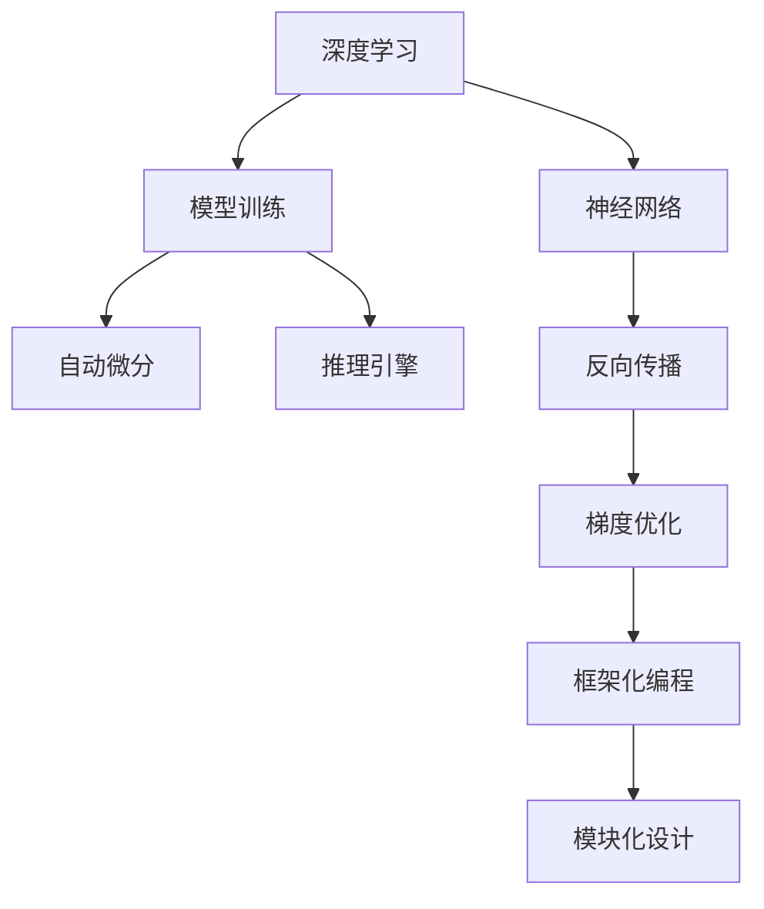

                 

# 洞察力与创新：颠覆性思维的诞生

> 关键词：
- 深度学习
- 反向传播
- 梯度优化
- 神经网络
- 模型训练
- 自动微分
- 推理引擎
- 框架化编程
- 模块化设计

## 1. 背景介绍

### 1.1 问题由来

随着信息技术的发展，人工智能（AI）成为了当前技术领域的焦点。尤其是深度学习（Deep Learning, DL），作为AI的重要分支，正以其强大的数据处理能力和卓越的性能，改变着各个行业和领域。然而，深度学习技术并非一蹴而就，而是经历了一段漫长而曲折的探索历程。

### 1.2 问题核心关键点

在深度学习的发展过程中，有两个关键概念贯穿始终：洞察力和创新。

- 洞察力（Insight）：指对问题本质的理解和把握，是深度学习研究的基础。通过对数据和算法的深入分析，洞察力使得研究人员能够发现隐藏在数据背后的规律和模式，指导模型的设计和优化。
- 创新（Innovation）：指对已有知识和方法的拓展和改进，是深度学习发展的动力。创新推动了深度学习技术的不断突破，从简单的线性回归到复杂的卷积神经网络（CNN）、循环神经网络（RNN）、变分自编码器（VAE）等，不断拓展其应用边界。

### 1.3 问题研究意义

深度学习研究的目的，在于利用机器学习算法模拟人类神经网络的结构和功能，以解决复杂的数据处理问题。洞察力和创新，作为深度学习的两大支柱，对于推动技术进步和应用落地，具有重要意义：

1. 提升模型效果：通过深入理解数据特征和算法原理，洞察力能够指导模型结构和训练过程的优化，提升模型的精度和泛化能力。
2. 加速技术演进：创新是深度学习发展的核心驱动力，不断涌现的新算法、新架构和新应用，推动了深度学习技术的快速迭代和演进。
3. 促进产业应用：洞察力和创新，使得深度学习技术能够更好地适应各个行业的需求，推动AI技术在实际场景中的应用和落地。

## 2. 核心概念与联系

### 2.1 核心概念概述

为更好地理解深度学习中的洞察力和创新，本节将介绍几个密切相关的核心概念：

- 深度学习（Deep Learning, DL）：基于神经网络（Neural Network, NN）的机器学习技术，通过多层非线性变换对数据进行建模，捕捉数据之间的复杂关联。
- 反向传播（Backpropagation, BP）：深度学习的核心算法之一，通过链式法则计算梯度，指导神经网络模型的参数更新，实现模型优化。
- 梯度优化（Gradient Optimization）：通过优化算法（如SGD、Adam等）最小化损失函数，优化模型参数，提升模型性能。
- 神经网络（Neural Network, NN）：由神经元（Neuron）组成的计算模型，通过多层非线性变换，实现对数据的复杂映射。
- 模型训练（Model Training）：通过训练数据对神经网络模型进行优化，使其能够准确预测新数据的未知特征。
- 自动微分（Automatic Differentiation）：计算复杂函数梯度的技术，使深度学习模型能够高效进行参数优化。
- 推理引擎（Inference Engine）：在训练完成后，推理引擎用于高效计算模型的前向传播，输出预测结果。
- 框架化编程（Framework Programming）：通过深度学习框架（如TensorFlow、PyTorch等），实现模型的构建、训练和推理，提升开发效率。
- 模块化设计（Modular Design）：通过设计可复用的模块，实现模型的灵活搭建和优化，增强模型的泛化能力和适用性。

这些核心概念之间的逻辑关系可以通过以下Mermaid流程图来展示：



这个流程图展示了一系列深度学习关键概念及其相互关系：

1. 深度学习以神经网络为基础，通过反向传播进行参数优化。
2. 自动微分使得反向传播能够高效计算梯度，优化模型参数。
3. 推理引擎用于高效计算模型的前向传播，输出预测结果。
4. 框架化编程和模块化设计，使得深度学习模型的开发、训练和推理更加灵活和高效。

## 3. 核心算法原理 & 具体操作步骤

### 3.1 算法原理概述

深度学习模型的训练过程，本质上是通过反向传播和梯度优化实现的。其核心思想是：通过大量标注数据对模型进行训练，使其能够准确预测未知数据的特征。

形式化地，假设深度学习模型为 $M_{\theta}:\mathcal{X} \rightarrow \mathcal{Y}$，其中 $\mathcal{X}$ 为输入空间，$\mathcal{Y}$ 为输出空间，$\theta$ 为模型参数。定义模型 $M_{\theta}$ 在数据样本 $(x,y)$ 上的损失函数为 $\ell(M_{\theta}(x),y)$，则在数据集 $D=\{(x_i,y_i)\}_{i=1}^N$ 上的经验风险为：

$$
\mathcal{L}(\theta) = \frac{1}{N} \sum_{i=1}^N \ell(M_{\theta}(x_i),y_i)
$$

深度学习的目标是最小化经验风险，即找到最优参数：

$$
\theta^* = \mathop{\arg\min}_{\theta} \mathcal{L}(\theta)
$$

在实践中，我们通常使用基于梯度的优化算法（如SGD、Adam等）来近似求解上述最优化问题。设 $\eta$ 为学习率，$\lambda$ 为正则化系数，则参数的更新公式为：

$$
\theta \leftarrow \theta - \eta \nabla_{\theta}\mathcal{L}(\theta) - \eta\lambda\theta
$$

其中 $\nabla_{\theta}\mathcal{L}(\theta)$ 为损失函数对参数 $\theta$ 的梯度，可通过反向传播算法高效计算。

### 3.2 算法步骤详解

深度学习模型的训练过程主要包括以下几个关键步骤：

**Step 1: 准备训练数据**

- 收集标注数据集 $D=\{(x_i,y_i)\}_{i=1}^N$，其中 $x_i$ 为输入样本，$y_i$ 为输出标签。
- 将数据集划分为训练集、验证集和测试集，以便进行模型训练、调参和最终评估。

**Step 2: 构建神经网络模型**

- 选择合适的神经网络结构，如卷积神经网络（CNN）、循环神经网络（RNN）、变分自编码器（VAE）等。
- 在框架（如TensorFlow、PyTorch）中定义模型的结构，包括输入层、隐藏层、输出层等。
- 设置模型参数 $\theta$ 的初始值。

**Step 3: 实现反向传播**

- 前向传播计算模型的预测值 $M_{\theta}(x)$。
- 计算预测值与真实值之间的损失函数 $\ell(M_{\theta}(x),y)$。
- 通过反向传播计算梯度 $\nabla_{\theta}\mathcal{L}(\theta)$。

**Step 4: 梯度优化**

- 选择合适的优化算法，如SGD、Adam等。
- 根据梯度更新模型参数 $\theta$，最小化损失函数 $\mathcal{L}(\theta)$。

**Step 5: 评估模型性能**

- 在验证集上评估模型的性能指标，如精度、召回率、F1-score等。
- 根据评估结果调整模型参数和训练策略，以提升模型性能。

**Step 6: 测试和部署**

- 在测试集上评估模型性能，对比训练前后的精度提升。
- 使用模型进行新样本的预测，部署到实际应用系统中。

以上是深度学习模型训练的一般流程。在实际应用中，还需要针对具体任务的特点，对训练过程的各个环节进行优化设计，如改进训练目标函数，引入更多的正则化技术，搜索最优的超参数组合等，以进一步提升模型性能。

### 3.3 算法优缺点

深度学习模型的训练过程，具有以下优点：

1. 强大的数据处理能力：深度学习模型能够自动学习数据特征，无需手工设计特征，具有很强的数据泛化能力。
2. 模型精度高：深度学习模型通过多层非线性变换，可以捕捉数据之间的复杂关联，提升模型精度。
3. 应用广泛：深度学习模型已广泛应用于计算机视觉、自然语言处理、语音识别、推荐系统等领域，推动了技术进步和应用落地。

但该方法也存在一定的局限性：

1. 数据需求量大：深度学习模型通常需要大量的标注数据进行训练，标注数据的获取成本较高。
2. 模型训练时间长：深度学习模型训练过程复杂，训练时间长，需要大量的计算资源。
3. 模型复杂度高：深度学习模型参数量庞大，难以理解其内部工作机制，存在"黑箱"问题。
4. 泛化性能有限：深度学习模型在面对未见过的数据时，泛化性能往往较差，存在过拟合风险。
5. 资源消耗大：深度学习模型在推理时资源消耗较大，需要高性能的硬件支持。

尽管存在这些局限性，但就目前而言，深度学习模型训练仍然是数据处理和模式识别领域的主要手段。未来相关研究的重点在于如何进一步降低深度学习对数据和计算资源的需求，提升模型的泛化性能和可解释性，同时兼顾模型复杂度和推理效率等因素。

### 3.4 算法应用领域

深度学习模型的训练范式，在多个领域得到了广泛的应用：

- 计算机视觉（CV）：如图像分类、目标检测、图像分割等。通过深度学习模型，计算机能够自动理解和分析图像内容。
- 自然语言处理（NLP）：如文本分类、命名实体识别、机器翻译等。深度学习模型能够自动学习语言的规律，进行自然语言的理解和生成。
- 语音识别（ASR）：如语音转文字、语音合成等。深度学习模型能够自动学习语音的特征，进行语音的理解和生成。
- 推荐系统（RS）：如商品推荐、音乐推荐等。通过深度学习模型，推荐系统能够自动学习用户的兴趣和行为，进行精准推荐。
- 医疗诊断（Health Diagnosis）：如医学图像分析、疾病预测等。深度学习模型能够自动学习医学图像和数据，辅助医生进行诊断和治疗。

除了上述这些经典应用外，深度学习模型也被创新性地应用到更多场景中，如智能交通、智能制造、智能安防等，为各行各业带来了新的突破。随着深度学习技术的不断进步，相信其在更多领域的应用前景将更加广阔。

## 4. 数学模型和公式 & 详细讲解 & 举例说明

### 4.1 数学模型构建

本节将使用数学语言对深度学习模型的训练过程进行更加严格的刻画。

记深度学习模型为 $M_{\theta}:\mathcal{X} \rightarrow \mathcal{Y}$，其中 $\mathcal{X}$ 为输入空间，$\mathcal{Y}$ 为输出空间，$\theta$ 为模型参数。假设训练数据集为 $D=\{(x_i,y_i)\}_{i=1}^N, x_i \in \mathcal{X}, y_i \in \mathcal{Y}$。

定义模型 $M_{\theta}$ 在数据样本 $(x,y)$ 上的损失函数为 $\ell(M_{\theta}(x),y)$，则在数据集 $D$ 上的经验风险为：

$$
\mathcal{L}(\theta) = \frac{1}{N} \sum_{i=1}^N \ell(M_{\theta}(x_i),y_i)
$$

深度学习的目标是最小化经验风险，即找到最优参数：

$$
\theta^* = \mathop{\arg\min}_{\theta} \mathcal{L}(\theta)
$$

在实践中，我们通常使用基于梯度的优化算法（如SGD、Adam等）来近似求解上述最优化问题。设 $\eta$ 为学习率，$\lambda$ 为正则化系数，则参数的更新公式为：

$$
\theta \leftarrow \theta - \eta \nabla_{\theta}\mathcal{L}(\theta) - \eta\lambda\theta
$$

其中 $\nabla_{\theta}\mathcal{L}(\theta)$ 为损失函数对参数 $\theta$ 的梯度，可通过反向传播算法高效计算。

### 4.2 公式推导过程

以下我们以二分类任务为例，推导交叉熵损失函数及其梯度的计算公式。

假设模型 $M_{\theta}$ 在输入 $x$ 上的输出为 $\hat{y}=M_{\theta}(x) \in [0,1]$，表示样本属于正类的概率。真实标签 $y \in \{0,1\}$。则二分类交叉熵损失函数定义为：

$$
\ell(M_{\theta}(x),y) = -[y\log \hat{y} + (1-y)\log (1-\hat{y})]
$$

将其代入经验风险公式，得：

$$
\mathcal{L}(\theta) = -\frac{1}{N}\sum_{i=1}^N [y_i\log M_{\theta}(x_i)+(1-y_i)\log(1-M_{\theta}(x_i))]
$$

根据链式法则，损失函数对参数 $\theta_k$ 的梯度为：

$$
\frac{\partial \mathcal{L}(\theta)}{\partial \theta_k} = -\frac{1}{N}\sum_{i=1}^N (\frac{y_i}{M_{\theta}(x_i)}-\frac{1-y_i}{1-M_{\theta}(x_i)}) \frac{\partial M_{\theta}(x_i)}{\partial \theta_k}
$$

其中 $\frac{\partial M_{\theta}(x_i)}{\partial \theta_k}$ 可进一步递归展开，利用自动微分技术完成计算。

在得到损失函数的梯度后，即可带入参数更新公式，完成模型的迭代优化。重复上述过程直至收敛，最终得到适应下游任务的最优模型参数 $\theta^*$。

## 5. 项目实践：代码实例和详细解释说明

### 5.1 开发环境搭建

在进行深度学习模型的训练实践前，我们需要准备好开发环境。以下是使用Python进行PyTorch开发的环境配置流程：

1. 安装Anaconda：从官网下载并安装Anaconda，用于创建独立的Python环境。

2. 创建并激活虚拟环境：
```bash
conda create -n pytorch-env python=3.8 
conda activate pytorch-env
```

3. 安装PyTorch：根据CUDA版本，从官网获取对应的安装命令。例如：
```bash
conda install pytorch torchvision torchaudio cudatoolkit=11.1 -c pytorch -c conda-forge
```

4. 安装TensorFlow：
```bash
pip install tensorflow
```

5. 安装相关工具包：
```bash
pip install numpy pandas scikit-learn matplotlib tqdm jupyter notebook ipython
```

完成上述步骤后，即可在`pytorch-env`环境中开始训练实践。

### 5.2 源代码详细实现

这里我们以图像分类任务为例，给出使用PyTorch进行卷积神经网络（CNN）模型训练的PyTorch代码实现。

首先，定义CNN模型：

```python
import torch.nn as nn
import torch.nn.functional as F

class CNN(nn.Module):
    def __init__(self):
        super(CNN, self).__init__()
        self.conv1 = nn.Conv2d(3, 64, kernel_size=3, padding=1)
        self.pool1 = nn.MaxPool2d(kernel_size=2, stride=2)
        self.conv2 = nn.Conv2d(64, 128, kernel_size=3, padding=1)
        self.pool2 = nn.MaxPool2d(kernel_size=2, stride=2)
        self.fc1 = nn.Linear(128*8*8, 1024)
        self.fc2 = nn.Linear(1024, 10)

    def forward(self, x):
        x = F.relu(self.conv1(x))
        x = self.pool1(x)
        x = F.relu(self.conv2(x))
        x = self.pool2(x)
        x = x.view(-1, 128*8*8)
        x = F.relu(self.fc1(x))
        x = self.fc2(x)
        return F.log_softmax(x, dim=1)
```

然后，定义训练和评估函数：

```python
import torch.optim as optim

device = torch.device('cuda') if torch.cuda.is_available() else torch.device('cpu')
model = CNN().to(device)

def train_epoch(model, dataset, optimizer):
    model.train()
    running_loss = 0.0
    for batch in dataset:
        inputs, labels = batch[0].to(device), batch[1].to(device)
        optimizer.zero_grad()
        outputs = model(inputs)
        loss = F.nll_loss(outputs, labels)
        loss.backward()
        optimizer.step()
        running_loss += loss.item()
    return running_loss / len(dataset)

def evaluate(model, dataset):
    model.eval()
    correct = 0
    total = 0
    with torch.no_grad():
        for batch in dataset:
            inputs, labels = batch[0].to(device), batch[1].to(device)
            outputs = model(inputs)
            _, predicted = torch.max(outputs.data, 1)
            total += labels.size(0)
            correct += (predicted == labels).sum().item()
    accuracy = 100.0 * correct / total
    return accuracy
```

接着，定义训练和评估流程：

```python
epochs = 10
batch_size = 64
learning_rate = 0.001
momentum = 0.9

dataset = # your dataset here
optimizer = optim.SGD(model.parameters(), lr=learning_rate, momentum=momentum)

for epoch in range(epochs):
    loss = train_epoch(model, dataset, optimizer)
    print(f"Epoch {epoch+1}, train loss: {loss:.3f}")
    
    accuracy = evaluate(model, dataset)
    print(f"Epoch {epoch+1}, accuracy: {accuracy:.3f}")
    
print("Final accuracy: ", evaluate(model, dataset))
```

以上就是使用PyTorch进行CNN模型训练的完整代码实现。可以看到，得益于PyTorch的强大封装和易用性，我们可以用相对简洁的代码实现复杂的深度学习模型训练。

### 5.3 代码解读与分析

让我们再详细解读一下关键代码的实现细节：

**CNN模型定义**：
- `__init__`方法：初始化卷积、池化、全连接等组件。
- `forward`方法：定义模型前向传播的计算流程。

**训练和评估函数**：
- `train_epoch`函数：在每个epoch内进行模型训练，计算损失并更新模型参数。
- `evaluate`函数：在测试集上评估模型性能，计算准确率。

**训练流程**：
- 定义总的epoch数、batch size和初始学习率。
- 初始化数据集和优化器。
- 循环迭代epoch，每个epoch内先训练，后评估，最后输出最终准确率。

可以看到，PyTorch使得深度学习模型的开发和训练过程变得简单高效。开发者可以将更多精力放在数据预处理、模型设计等高层逻辑上，而不必过多关注底层的实现细节。

当然，工业级的系统实现还需考虑更多因素，如模型的保存和部署、超参数的自动搜索、更灵活的任务适配层等。但核心的训练范式基本与此类似。

## 6. 实际应用场景

### 6.1 计算机视觉

计算机视觉（CV）领域中，深度学习模型已经广泛应用于图像分类、目标检测、图像分割等任务。传统计算机视觉方法依赖手工设计特征，而深度学习模型能够自动学习数据特征，具有很强的泛化能力。

在图像分类任务中，深度学习模型通过多层卷积和池化，捕捉图像中的局部和全局特征，实现对图像的高效分类。常见的深度学习模型包括LeNet、AlexNet、VGG、ResNet等，广泛应用于医学影像分析、自动驾驶、安防监控等领域。

在目标检测任务中，深度学习模型通过区域提议和边界框回归，准确检测图像中的目标对象。著名的YOLO、Faster R-CNN等模型，已经成功应用于智能监控、零售购物、工业检测等场景中。

在图像分割任务中，深度学习模型通过像素级别的分类和语义分割，实现对图像的高分辨率分割。U-Net、Mask R-CNN等模型，已经在医学影像分析、图像修复、城市规划等领域取得了显著成果。

### 6.2 自然语言处理

自然语言处理（NLP）领域中，深度学习模型已经广泛应用于文本分类、命名实体识别、机器翻译等任务。传统NLP方法依赖手工设计特征，而深度学习模型能够自动学习语言特征，具有很强的泛化能力。

在文本分类任务中，深度学习模型通过多层循环和池化，捕捉文本中的语义和情感信息，实现对文本的分类。LSTM、GRU、BERT等模型，已经在情感分析、主题分类、文本摘要等领域取得了显著成果。

在命名实体识别任务中，深度学习模型通过序列标注和序列分类，识别文本中的人名、地名、机构名等特定实体。CRF、BiLSTM等模型，已经在实体抽取、关系抽取、命名实体识别等任务中取得了很好的效果。

在机器翻译任务中，深度学习模型通过编码-解码框架，实现对自然语言的高效翻译。Transformer、Seq2Seq等模型，已经在语音翻译、图像翻译、多语言翻译等领域取得了很好的效果。

### 6.3 语音识别

语音识别（ASR）领域中，深度学习模型已经广泛应用于语音转文字、语音合成等任务。传统语音识别方法依赖手工设计特征，而深度学习模型能够自动学习语音特征，具有很强的泛化能力。

在语音转文字任务中，深度学习模型通过声学模型和语言模型，实现对语音的高效转写。CNN、RNN、CTC等模型，已经在语音识别、智能客服、语音控制等领域取得了很好的效果。

在语音合成任务中，深度学习模型通过端到端语音生成，实现对语音的高效合成。WaveNet、Tacotron等模型，已经在语音合成、语音交互、语音情感分析等领域取得了很好的效果。

### 6.4 推荐系统

推荐系统（RS）领域中，深度学习模型已经广泛应用于商品推荐、音乐推荐等任务。传统推荐系统依赖手工设计特征，而深度学习模型能够自动学习用户兴趣和行为，具有很强的泛化能力。

在商品推荐任务中，深度学习模型通过协同过滤和特征学习，实现对商品的高效推荐。ALS、SVD、DNN等模型，已经在电商推荐、内容推荐、广告推荐等领域取得了很好的效果。

在音乐推荐任务中，深度学习模型通过情感分析和时间序列建模，实现对音乐的高效推荐。CNN、RNN、CTC等模型，已经在音乐推荐、个性化音乐、音乐生成等领域取得了很好的效果。

### 6.5 医疗诊断

医疗诊断（Health Diagnosis）领域中，深度学习模型已经广泛应用于医学影像分析、疾病预测等任务。传统医疗诊断方法依赖手工设计特征，而深度学习模型能够自动学习医学图像和数据，具有很强的泛化能力。

在医学影像分析任务中，深度学习模型通过卷积神经网络，实现对医学影像的高效分析。ResNet、U-Net、DenseNet等模型，已经在医学影像分析、疾病预测、基因组分析等领域取得了很好的效果。

在疾病预测任务中，深度学习模型通过时间序列建模和异常检测，实现对疾病的早期预测和诊断。LSTM、GRU、CNN等模型，已经在疾病预测、遗传疾病、慢性病预测等领域取得了很好的效果。

## 7. 工具和资源推荐

### 7.1 学习资源推荐

为了帮助开发者系统掌握深度学习模型的训练理论基础和实践技巧，这里推荐一些优质的学习资源：

1. 《深度学习》书籍：由Yoshua Bengio、Ian Goodfellow、Aaron Courville等三位深度学习领域的专家合著，全面介绍了深度学习的基本概念和算法原理，是深度学习入门的经典书籍。

2. CS231n《卷积神经网络》课程：斯坦福大学开设的计算机视觉课程，通过Lecture视频和配套作业，带你入门卷积神经网络的原理和应用。

3. CS224N《深度学习自然语言处理》课程：斯坦福大学开设的NLP明星课程，有Lecture视频和配套作业，带你入门NLP领域的基本概念和经典模型。

4. 《深度学习框架PyTorch》书籍：PyTorch社区的官方指南，介绍了PyTorch的核心特性和使用方法，是PyTorch入门的必备资料。

5. Kaggle数据集：Kaggle平台上收集了大量的标注数据集，适合进行深度学习模型的训练和调参。

通过对这些资源的学习实践，相信你一定能够快速掌握深度学习模型的训练精髓，并用于解决实际的NLP问题。
###  7.2 开发工具推荐

高效的开发离不开优秀的工具支持。以下是几款用于深度学习模型训练开发的常用工具：

1. PyTorch：基于Python的开源深度学习框架，灵活动态的计算图，适合快速迭代研究。

2. TensorFlow：由Google主导开发的开源深度学习框架，生产部署方便，适合大规模工程应用。

3. Keras：基于TensorFlow和Theano的高级深度学习框架，易于上手，适合快速原型开发。

4. JAX：由Google开发的深度学习框架，支持高效的自动微分和优化算法，适合高性能计算环境。

5. MXNet：由亚马逊开发的深度学习框架，支持多设备分布式计算，适合大规模训练和推理。

6. PyTorch Lightning：基于PyTorch的深度学习框架，自动调参和模型优化，适合快速实验和部署。

7. Horovod：由IBM开发的分布式深度学习框架，支持多种深度学习框架，适合大规模训练和优化。

合理利用这些工具，可以显著提升深度学习模型的开发效率，加快创新迭代的步伐。

### 7.3 相关论文推荐

深度学习模型和训练技术的发展源于学界的持续研究。以下是几篇奠基性的相关论文，推荐阅读：

1. Deep Blue: A Machinery for Massive Data Analysis（原始论文）：提出神经网络模型，是深度学习的开山之作，奠定了深度学习的基础。

2. ImageNet Classification with Deep Convolutional Neural Networks：提出LeNet、AlexNet等经典模型，成功应用于图像分类任务，推动了深度学习在计算机视觉领域的应用。

3. GoogleNet: A Scalable Network for Object Recognition：提出Inception模块，通过模块化设计实现了高效的网络结构，提升了深度学习模型的性能。

4. VGGNet: Very Deep Convolutional Networks for Large-Scale Image Recognition：提出VGG模型，通过增加卷积层和池化层，提升了深度学习模型的精度和泛化能力。

5. ResNet: Deep Residual Learning for Image Recognition：提出ResNet模型，通过残差连接解决了深度学习模型中的梯度消失问题，提升了深度学习模型的深度和精度。

6. Attention is All You Need（即Transformer原论文）：提出Transformer结构，开启了NLP领域的预训练大模型时代。

7. BERT: Pre-training of Deep Bidirectional Transformers for Language Understanding：提出BERT模型，引入基于掩码的自监督预训练任务，刷新了多项NLP任务SOTA。

8. Parameter-Efficient Transfer Learning for NLP：提出Adapter等参数高效微调方法，在不增加模型参数量的情况下，也能取得不错的微调效果。

9. Adversarial Examples for Few-Shot Text Classification：提出对抗样本训练方法，提高了深度学习模型的鲁棒性和泛化能力。

这些论文代表了大深度学习模型的发展脉络。通过学习这些前沿成果，可以帮助研究者把握学科前进方向，激发更多的创新灵感。

## 8. 总结：未来发展趋势与挑战

### 8.1 总结

本文对深度学习模型的训练过程进行了全面系统的介绍。首先阐述了深度学习模型的训练范式和优化算法，明确了模型训练的基本原理和步骤。其次，从原理到实践，详细讲解了深度学习模型的构建、训练和评估流程，给出了模型训练的完整代码实例。同时，本文还广泛探讨了深度学习模型在计算机视觉、自然语言处理、语音识别、推荐系统、医疗诊断等多个领域的应用前景，展示了深度学习技术的广泛应用。

通过本文的系统梳理，可以看到，深度学习模型的训练过程，已经形成了系统化的范式和工具。得益于强大的深度学习框架和丰富的学习资源，开发者可以轻松上手，高效开发和训练深度学习模型。

### 8.2 未来发展趋势

深度学习模型的训练过程，具有以下未来发展趋势：

1. 模型规模持续增大：随着算力成本的下降和数据规模的扩张，深度学习模型的参数量还将持续增长。超大批次的训练和推理也将变得更加高效。

2. 训练范式不断丰富：除了传统的反向传播和梯度优化，未来将涌现更多训练范式，如对抗训练、正则化训练、无监督训练等，以提升模型的鲁棒性和泛化能力。

3. 训练效率持续提升：深度学习框架的不断优化，使得深度学习模型的训练效率不断提升，能够在更短的时间内训练出高质量的模型。

4. 训练算法多样化：未来将涌现更多训练算法，如Adam、Adagrad、RMSprop等，以应对不同的模型和数据特点。

5. 模型应用更广泛：深度学习模型不仅应用于计算机视觉、自然语言处理、语音识别等领域，还将拓展到智能制造、智能交通、智能安防等更多领域，推动产业升级和技术创新。

6. 模型可解释性增强：未来将开发更多模型可解释性技术，如可视化工具、特征分析工具等，以增强模型的可解释性和可信度。

7. 模型可靠性提升：未来将开发更多模型鲁棒性技术，如对抗训练、鲁棒正则化等，以提升模型的鲁棒性和安全性。

### 8.3 面临的挑战

尽管深度学习模型的训练过程已经取得了显著成果，但在迈向更加智能化、普适化应用的过程中，它仍面临着诸多挑战：

1. 数据需求量大：深度学习模型通常需要大量的标注数据进行训练，标注数据的获取成本较高，且数据分布的偏差可能导致模型过拟合。

2. 训练时间长：深度学习模型训练过程复杂，训练时间长，需要大量的计算资源，且训练效率仍有提升空间。

3. 模型复杂度高：深度学习模型参数量庞大，难以理解其内部工作机制，存在"黑箱"问题。

4. 泛化性能有限：深度学习模型在面对未见过的数据时，泛化性能往往较差，存在过拟合风险。

5. 资源消耗大：深度学习模型在推理时资源消耗较大，需要高性能的硬件支持。

尽管存在这些局限性，但就目前而言，深度学习模型训练仍然是数据处理和模式识别领域的主要手段。未来相关研究的重点在于如何进一步降低深度学习对数据和计算资源的需求，提升模型的泛化性能和可解释性，同时兼顾模型复杂度和推理效率等因素。

### 8.4 研究展望

面对深度学习模型训练所面临的种种挑战，未来的研究需要在以下几个方面寻求新的突破：

1. 探索无监督和半监督训练方法：摆脱对大规模标注数据的依赖，利用自监督学习、主动学习等无监督和半监督范式，最大限度利用非结构化数据，实现更加灵活高效的模型训练。

2. 研究模型可解释性和可解释性技术：开发更多模型可解释性技术，如可视化工具、特征分析工具等，以增强模型的可解释性和可信度。

3. 引入更多先验知识：将符号化的先验知识，如知识图谱、逻辑规则等，与神经网络模型进行巧妙融合，引导模型学习更准确、合理的特征表示。

4. 结合因果分析和博弈论工具：将因果分析方法引入模型训练，识别出模型决策的关键特征，增强模型输出解释的因果性和逻辑性。借助博弈论工具刻画人机交互过程，主动探索并规避模型的脆弱点，提高系统稳定性。

5. 纳入伦理道德约束：在模型训练目标中引入伦理导向的评估指标，过滤和惩罚有偏见、有害的输出倾向。同时加强人工干预和审核，建立模型行为的监管机制，确保输出符合人类价值观和伦理道德。

这些研究方向的探索，必将引领深度学习模型训练技术迈向更高的台阶，为构建安全、可靠、可解释、可控的智能系统铺平道路。面向未来，深度学习模型训练还需要与其他人工智能技术进行更深入的融合，如知识表示、因果推理、强化学习等，多路径协同发力，共同推动自然语言理解和智能交互系统的进步。只有勇于创新、敢于突破，才能不断拓展深度学习模型的边界，让智能技术更好地造福人类社会。

## 9. 附录：常见问题与解答

**Q1：深度学习模型训练是否适用于所有任务？**

A: 深度学习模型训练适用于大多数需要大量数据和复杂特征的任务，如计算机视觉、自然语言处理、语音识别等。但对于一些需要手工设计特征或规则的任务，深度学习模型可能难以胜任。此时需要结合传统机器学习方法，进行特征工程和模型设计。

**Q2：如何选择合适的深度学习框架？**

A: 选择合适的深度学习框架需要考虑多个因素，如模型的复杂度、训练效率、易用性、社区支持等。PyTorch和TensorFlow是当前最流行的深度学习框架，适用于不同规模和类型的深度学习任务。Keras和MXNet等框架，则适合快速原型开发和模型部署。

**Q3：深度学习模型训练过程中如何避免过拟合？**

A: 避免过拟合的方法包括：
1. 数据增强：通过回译、近义替换等方式扩充训练集
2. 正则化：使用L2正则、Dropout、Early Stopping等防止模型过度适应小规模训练集
3. 对抗训练：加入对抗样本，提高模型鲁棒性
4. 参数高效训练：只调整少量模型参数，减小需优化的参数量
5. 多模型集成：训练多个模型，取平均输出，抑制过拟合

这些方法需要根据具体任务和数据特点进行灵活组合，以达到最优的过拟合抑制效果。

**Q4：深度学习模型训练过程中如何选择学习率？**

A: 选择学习率需要根据具体任务和数据特点进行调整。一般来说，初始学习率可以从0.001开始，根据训练过程中模型的收敛情况逐步调整。可以使用warmup策略，在开始阶段使用较小的学习率，再逐渐过渡到预设值。

**Q5：深度学习模型训练过程中如何进行超参数调优？**

A: 超参数调优是深度学习模型训练的关键步骤，通过调整学习率、批次大小、优化器等超参数，寻找最优模型性能。可以使用网格搜索、随机搜索、贝叶斯优化等方法进行超参数调优。同时，利用可视化工具（如TensorBoard）实时监测模型训练状态，帮助选择最优超参数。

这些研究方向的探索，必将引领深度学习模型训练技术迈向更高的台阶，为构建安全、可靠、可解释、可控的智能系统铺平道路。面向未来，深度学习模型训练还需要与其他人工智能技术进行更深入的融合，如知识表示、因果推理、强化学习等，多路径协同发力，共同推动自然语言理解和智能交互系统的进步。只有勇于创新、敢于突破，才能不断拓展深度学习模型的边界，让智能技术更好地造福人类社会。

