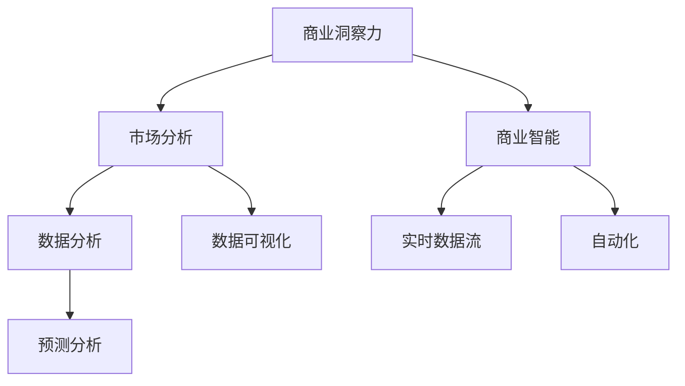

                 

# 洞察力与市场分析：商业智慧的体现

> 关键词：洞察力, 市场分析, 商业智能(BI), 数据驱动决策, 大数据分析, 预测分析, 实时数据流, 自动化, 商业智慧的体现

## 1. 背景介绍

### 1.1 问题由来

在当今数字化和信息化的时代，企业面临的竞争日益激烈，市场环境变化莫测。如何在瞬息万变的市场环境中准确把握商机、优化决策、提升运营效率，是每一个企业家和决策者所面临的共同挑战。传统的市场分析方法已经无法满足现代商业发展的需求，需要一种全新的、基于数据的市场分析方法。

商业洞察力（Business Insight），简称为BI，是指通过数据驱动的分析和洞见，帮助企业更好地理解市场动态、客户需求、竞争状况，从而制定出更明智的商业决策。市场分析则是通过收集、整理、分析和解释市场数据，为企业提供策略支持和决策依据，是BI的核心组成部分。

### 1.2 问题核心关键点

现代市场分析的核心关键点包括：
1. **数据质量**：市场分析的准确性和可靠性取决于数据的完整性、准确性和及时性。
2. **分析方法**：选择合适的方法和工具进行数据挖掘和分析，如统计分析、机器学习、深度学习等。
3. **数据融合**：将来自不同渠道和格式的数据进行整合和统一，形成一个统一的数据视图。
4. **可视化**：将复杂的数据和分析结果通过图表、仪表盘等可视化工具呈现出来，便于理解和决策。
5. **自动化**：通过自动化工具和算法，实现实时数据分析和预测，提升决策的效率和准确性。

### 1.3 问题研究意义

商业洞察力与市场分析对于企业的重要性不言而喻。其研究意义主要体现在：
1. **提升决策质量**：基于数据的洞察力能帮助企业做出更加科学和精准的决策。
2. **优化运营效率**：通过市场分析可以及时发现问题和机会，优化运营流程，提升企业效率。
3. **增强竞争力**：准确的市场分析能帮助企业预测市场趋势，抢占先机，保持竞争优势。
4. **推动创新**：洞察力分析能够揭示市场中的新趋势和客户需求，推动企业创新和产品升级。
5. **风险管理**：市场分析能够帮助企业识别潜在的风险点，及时调整策略，减少损失。

## 2. 核心概念与联系

### 2.1 核心概念概述

商业洞察力（Business Insight, BI）是指通过数据驱动的分析和洞见，帮助企业更好地理解市场动态、客户需求、竞争状况，从而制定出更明智的商业决策。

市场分析（Market Analysis）是BI的核心组成部分，通过收集、整理、分析和解释市场数据，为企业提供策略支持和决策依据。

商业智能（Business Intelligence, BI）是指利用数据分析、数据挖掘、数据可视化等技术，帮助企业更好地理解数据，从而做出更加科学、精准的商业决策。

数据驱动决策（Data-Driven Decision Making）是指利用数据进行决策，而不是依赖直觉或经验。

大数据分析（Big Data Analytics）是指处理、分析和解释海量数据，从中获取有价值的信息和洞见。

预测分析（Predictive Analytics）是指利用历史数据和统计模型，预测未来趋势和结果。

实时数据流（Real-Time Data Streaming）是指通过实时数据采集和分析，快速响应市场变化。

自动化（Automation）是指利用算法和工具，自动进行数据分析和决策，提升效率和准确性。

这些核心概念之间的逻辑关系可以通过以下Mermaid流程图来展示：



这个流程图展示了一个典型的BI系统组成和关键流程：

1. **商业洞察力**：通过市场分析，获得对市场和业务的洞察。
2. **市场分析**：利用数据分析、预测分析等技术，分析市场数据。
3. **商业智能**：整合市场分析结果，进行数据可视化和自动化决策。
4. **数据分析**：处理和分析市场数据，提取有价值的信息。
5. **数据可视化**：将分析结果通过图表、仪表盘等工具呈现，便于理解和决策。
6. **预测分析**：通过历史数据预测市场趋势和结果。
7. **实时数据流**：通过实时数据采集和分析，快速响应市场变化。
8. **自动化**：利用算法和工具，自动进行数据分析和决策。

这些概念共同构成了现代商业洞察力和市场分析的框架，为企业提供了一个全面的、数据驱动的决策支持系统。

## 3. 核心算法原理 & 具体操作步骤
### 3.1 算法原理概述

基于商业洞察力的市场分析，本质上是一个数据驱动的决策支持系统。其核心算法原理可以概括为：
1. **数据采集与清洗**：从各种数据源中收集数据，并进行清洗和预处理。
2. **数据挖掘与分析**：利用统计分析、机器学习、深度学习等技术，从数据中提取有价值的信息和洞见。
3. **数据可视化**：将分析结果通过图表、仪表盘等工具呈现，便于理解和决策。
4. **预测与模拟**：利用历史数据和统计模型，预测未来趋势和结果。
5. **自动化决策**：通过算法和工具，自动进行决策，提升效率和准确性。

### 3.2 算法步骤详解

商业洞察力与市场分析的算法步骤可以总结为以下几个关键步骤：

**Step 1: 数据准备**

1. **数据源收集**：从不同的数据源（如销售数据、客户反馈、市场调研等）中收集数据。
2. **数据清洗**：清洗数据中的噪声和异常值，保证数据质量。
3. **数据整合**：将来自不同数据源的数据进行整合和统一，形成一个统一的数据视图。

**Step 2: 数据分析**

1. **描述性分析**：通过统计分析等方法，对数据进行描述性分析，理解数据的基本特征和分布。
2. **诊断性分析**：通过异常检测、关联分析等方法，揭示数据中的异常点和关联关系。
3. **预测性分析**：利用历史数据和统计模型，预测未来趋势和结果。
4. **规范性分析**：通过模拟和优化算法，提出建议和策略，指导决策。

**Step 3: 数据可视化**

1. **图表制作**：将分析结果通过图表、仪表盘等工具呈现，便于理解和决策。
2. **仪表盘设计**：设计直观、易懂的仪表盘，帮助决策者快速获取关键信息。
3. **实时监控**：利用实时数据流，实现对市场动态的实时监控和预警。

**Step 4: 自动化决策**

1. **自动化流程**：通过算法和工具，自动进行数据分析和决策，提升效率和准确性。
2. **预测模型训练**：利用历史数据训练预测模型，实时预测市场趋势和结果。
3. **决策支持系统**：结合商业洞察力和市场分析，构建决策支持系统，帮助企业制定决策。

### 3.3 算法优缺点

商业洞察力与市场分析的优点包括：
1. **数据驱动**：基于数据驱动的分析和洞见，提高决策的科学性和准确性。
2. **实时性**：通过实时数据流，快速响应市场变化。
3. **可扩展性**：能够处理海量数据，扩展性强。
4. **自动化**：自动化算法和工具，提升效率和准确性。

缺点包括：
1. **数据依赖**：依赖高质量的数据，数据质量不佳会影响分析结果。
2. **技术复杂性**：需要复杂的数据处理和分析技术，对技术要求高。
3. **成本高**：需要投入大量的人力、物力、财力进行数据采集、处理和分析。
4. **隐私风险**：处理大量个人和企业数据，存在隐私和数据安全风险。

### 3.4 算法应用领域

商业洞察力与市场分析在多个领域都有广泛的应用，例如：

- **零售行业**：通过市场分析，预测消费趋势，优化库存管理，提升销售效率。
- **金融行业**：利用数据分析和预测，评估风险，制定投资策略，提升盈利能力。
- **制造业**：通过市场分析，优化供应链管理，提升生产效率，降低成本。
- **医疗行业**：通过数据分析，预测疾病流行趋势，制定预防策略，提升医疗服务质量。
- **房地产行业**：利用市场分析，预测房价趋势，优化土地开发和投资决策。

除了这些传统领域外，商业洞察力与市场分析还在更多新兴领域得到应用，如智慧城市、智能交通、智慧农业等，为各行各业带来新的发展机遇。

## 4. 数学模型和公式 & 详细讲解 & 举例说明
### 4.1 数学模型构建

商业洞察力与市场分析的数学模型可以抽象为以下几个关键步骤：

1. **数据采集与清洗**：
   - 假设原始数据为 $D = \{(x_1, y_1), (x_2, y_2), ..., (x_n, y_n)\}$，其中 $x$ 为特征向量，$y$ 为标签。
   - 数据清洗模型为 $C(x, y)$，用于清洗噪声和异常值。

2. **数据挖掘与分析**：
   - 假设选择特征 $X = \{x_1, x_2, ..., x_n\}$ 进行描述性分析和诊断性分析。
   - 描述性分析模型为 $A(X)$，用于描述数据的特征和分布。
   - 诊断性分析模型为 $D(X)$，用于诊断数据中的异常点和关联关系。
   - 预测性分析模型为 $P(X)$，用于预测未来趋势和结果。
   - 规范性分析模型为 $R(X)$，用于提出建议和策略。

3. **数据可视化**：
   - 假设可视化模型为 $V(X, Y)$，将分析结果 $X$ 通过图表、仪表盘等工具呈现，便于理解和决策。

4. **自动化决策**：
   - 假设自动化决策模型为 $T(X, Y)$，利用算法和工具，自动进行数据分析和决策。

### 4.2 公式推导过程

以下我们以零售行业的市场分析为例，推导几个关键公式。

**描述性分析**

假设零售行业的销售额数据为 $S = \{s_1, s_2, ..., s_n\}$，通过统计分析，可以得到均值 $\mu$ 和标准差 $\sigma$：

$$
\mu = \frac{1}{n} \sum_{i=1}^n s_i
$$

$$
\sigma = \sqrt{\frac{1}{n} \sum_{i=1}^n (s_i - \mu)^2}
$$

**诊断性分析**

假设识别出销售额中的异常值，用 $O_i$ 表示销售额为 $s_i$ 的异常值，通过异常检测算法，可以得到异常值的数量 $o$：

$$
o = \sum_{i=1}^n \text{is\_anomaly}(s_i)
$$

**预测性分析**

假设预测未来一个季度的销售额 $S_{\text{pred}}$，利用历史数据 $S_{\text{train}}$ 训练线性回归模型，可以得到预测结果：

$$
S_{\text{pred}} = \beta_0 + \beta_1 t + \epsilon
$$

其中 $t$ 为时间变量，$\beta_0$ 和 $\beta_1$ 为模型参数，$\epsilon$ 为误差项。

**规范性分析**

假设根据预测结果 $S_{\text{pred}}$ 提出库存管理策略，可以优化库存水平，降低成本。通过优化算法，可以得到最优的库存水平 $I^*$：

$$
I^* = \mathop{\arg\min}_{I} \sum_{i=1}^n (I - S_{\text{pred}})^2
$$

### 4.3 案例分析与讲解

**零售行业市场分析案例**

某大型零售企业通过商业洞察力与市场分析，优化了库存管理。首先，他们收集了历史销售额数据 $S = \{s_1, s_2, ..., s_n\}$，并对其进行清洗和预处理。接着，利用描述性分析模型 $A(X)$ 分析销售额的均值和标准差，发现销售额呈现出明显的季节性波动。

然后，通过诊断性分析模型 $D(X)$ 识别出异常值 $O_i$，发现某些特定时间段销售额异常波动，可能是由于促销活动或特殊事件影响。最后，利用预测性分析模型 $P(X)$ 预测未来一个季度的销售额 $S_{\text{pred}}$，通过规范性分析模型 $R(X)$ 提出库存管理策略，优化库存水平，降低成本。

通过商业洞察力和市场分析，该零售企业能够更好地理解市场动态和客户需求，提升决策的科学性和准确性，实现运营效率的提升和盈利能力的增强。

## 5. 项目实践：代码实例和详细解释说明
### 5.1 开发环境搭建

在进行商业洞察力与市场分析的实践前，我们需要准备好开发环境。以下是使用Python进行Pandas、NumPy、Matplotlib等库进行数据分析和可视化的环境配置流程：

1. 安装Anaconda：从官网下载并安装Anaconda，用于创建独立的Python环境。

2. 创建并激活虚拟环境：
```bash
conda create -n insight-env python=3.8 
conda activate insight-env
```

3. 安装Pandas、NumPy、Matplotlib、Jupyter Notebook等库：
```bash
conda install pandas numpy matplotlib jupyter notebook ipython
```

完成上述步骤后，即可在`insight-env`环境中开始商业洞察力与市场分析的实践。

### 5.2 源代码详细实现

下面我以零售行业的市场分析为例，给出使用Pandas、NumPy、Matplotlib等库进行数据分析和可视化的PyTorch代码实现。

首先，定义数据处理函数：

```python
import pandas as pd
import numpy as np
import matplotlib.pyplot as plt

def load_sales_data(file_path):
    df = pd.read_csv(file_path)
    df['month'] = pd.to_datetime(df['date']).dt.month
    df['day_of_week'] = df['date'].dt.dayofweek
    df['year'] = pd.to_datetime(df['date']).dt.year
    return df

def clean_sales_data(df):
    df = df.dropna()
    return df

def describe_sales_data(df):
    sales_summary = df.groupby(['month', 'day_of_week', 'year'])['total_sales'].mean()
    sales_summary.index = pd.to_datetime(sales_summary.index)
    return sales_summary

def detect_anomalies(df):
    # 假设使用z-score异常检测
    z_scores = np.abs((df['total_sales'] - df['total_sales'].mean()) / df['total_sales'].std())
    anomalies = np.where(z_scores > 3)[0]
    return anomalies

def visualize_sales_data(df):
    df.groupby(['month', 'day_of_week'])['total_sales'].mean().plot(kind='bar')
    plt.title('Monthly Sales by Day of Week')
    plt.xlabel('Day of Week')
    plt.ylabel('Total Sales')
    plt.show()

def predict_sales(df):
    # 假设使用线性回归模型
    X = df[['month', 'day_of_week', 'year']]
    y = df['total_sales']
    from sklearn.linear_model import LinearRegression
    model = LinearRegression()
    model.fit(X, y)
    return model

def optimize_inventory(df, model):
    # 假设通过优化算法优化库存
    inventory_level = model.predict(df[['month', 'day_of_week', 'year']])
    return inventory_level
```

然后，定义数据处理和分析函数：

```python
from sklearn.metrics import mean_squared_error
from sklearn.model_selection import train_test_split

def load_and_clean_data(file_path):
    df = load_sales_data(file_path)
    df = clean_sales_data(df)
    return df

def analyze_sales_data(df):
    sales_summary = describe_sales_data(df)
    anomalies = detect_anomalies(df)
    visualize_sales_data(df)
    return sales_summary, anomalies

def train_model(df):
    X_train, X_test, y_train, y_test = train_test_split(df[['month', 'day_of_week', 'year']], df['total_sales'], test_size=0.2)
    model = predict_sales(X_train, y_train)
    mse = mean_squared_error(y_test, model.predict(X_test))
    return model, mse

def optimize_inventory(df, model):
    inventory_level = optimize_inventory(df, model)
    return inventory_level
```

最后，启动分析流程并在测试集上评估：

```python
# 加载和清洗数据
df = load_and_clean_data('sales_data.csv')

# 分析数据
sales_summary, anomalies = analyze_sales_data(df)

# 训练模型
model, mse = train_model(df)

# 优化库存
inventory_level = optimize_inventory(df, model)

# 评估模型
mse
```

以上就是使用Python进行商业洞察力与市场分析的完整代码实现。可以看到，得益于Pandas、NumPy、Matplotlib等库的强大封装，我们可以用相对简洁的代码完成数据分析和可视化。

### 5.3 代码解读与分析

让我们再详细解读一下关键代码的实现细节：

**load_sales_data函数**：
- 从CSV文件中读取销售额数据，并进行时间转换和预处理。

**clean_sales_data函数**：
- 删除缺失值，保证数据完整性。

**describe_sales_data函数**：
- 对销售额进行分组描述性分析，计算每个时间段的平均销售额。

**detect_anomalies函数**：
- 使用z-score异常检测方法，识别出销售额中的异常值。

**visualize_sales_data函数**：
- 对销售额进行可视化，生成月销售量与星期几的柱状图。

**predict_sales函数**：
- 使用线性回归模型，对未来销售额进行预测。

**optimize_inventory函数**：
- 通过优化算法，优化库存水平，降低成本。

可以看到，Python的Pandas、NumPy、Matplotlib等库使得数据分析和可视化变得简洁高效。开发者可以将更多精力放在数据分析逻辑上，而不必过多关注底层实现细节。

当然，工业级的系统实现还需考虑更多因素，如模型的保存和部署、超参数的自动搜索、更灵活的任务适配层等。但核心的数据分析和可视化流程基本与此类似。

## 6. 实际应用场景
### 6.1 智能客服系统

商业洞察力与市场分析在智能客服系统的构建中有着广泛应用。传统客服往往需要配备大量人力，高峰期响应缓慢，且一致性和专业性难以保证。而使用商业洞察力和市场分析构建的智能客服系统，能够通过分析客户历史数据和行为，预测客户需求，提供更快速、更个性化的服务。

具体而言，可以收集客户的历史查询记录、反馈信息、行为数据等，通过数据分析和模型训练，识别出常见的客户问题和需求。通过商业洞察力与市场分析，预测客户下一步的查询意图，提供个性化的回复和解决方案。对于复杂的客户问题，还可以通过集成外部知识库和专家系统，提升系统处理能力。

### 6.2 金融舆情监测

金融机构需要实时监测市场舆论动向，以便及时应对负面信息传播，规避金融风险。传统的人工监测方式成本高、效率低，难以应对网络时代海量信息爆发的挑战。通过商业洞察力和市场分析，可以实时收集和分析市场新闻、评论、社交媒体等数据，预测市场趋势，识别潜在风险。

具体而言，可以收集金融领域相关的新闻、报道、评论等文本数据，并对其进行主题标注和情感标注。通过商业洞察力和市场分析，自动判断文本属于何种主题，情感倾向是正面、中性还是负面。将分析结果结合实时数据流，及时预警市场风险，帮助金融机构快速应对潜在风险。

### 6.3 个性化推荐系统

当前的推荐系统往往只依赖用户的历史行为数据进行物品推荐，无法深入理解用户的真实兴趣偏好。通过商业洞察力和市场分析，个性化推荐系统可以更好地挖掘用户行为背后的语义信息，从而提供更精准、多样的推荐内容。

具体而言，可以收集用户浏览、点击、评论、分享等行为数据，提取和用户交互的物品标题、描述、标签等文本内容。通过商业洞察力和市场分析，从文本内容中准确把握用户的兴趣点。在生成推荐列表时，先用候选物品的文本描述作为输入，由商业洞察力和市场分析预测用户的兴趣匹配度，再结合其他特征综合排序，便可以得到个性化程度更高的推荐结果。

### 6.4 未来应用展望

随着商业洞察力和市场分析技术的不断发展，未来将在更多领域得到应用，为传统行业带来变革性影响。

在智慧医疗领域，通过商业洞察力和市场分析，预测疾病流行趋势，制定预防策略，提升医疗服务质量。在智能教育领域，通过商业洞察力和市场分析，分析学生学习行为，提供个性化的学习方案，促进教育公平，提高教学质量。

在智慧城市治理中，通过商业洞察力和市场分析，监测城市事件，优化资源配置，提高城市管理的自动化和智能化水平，构建更安全、高效的未来城市。

此外，在企业生产、社会治理、文娱传媒等众多领域，商业洞察力和市场分析也将不断涌现，为各行各业带来新的发展机遇。相信随着技术的日益成熟，商业洞察力和市场分析必将在构建人机协同的智能时代中扮演越来越重要的角色。

## 7. 工具和资源推荐
### 7.1 学习资源推荐

为了帮助开发者系统掌握商业洞察力和市场分析的理论基础和实践技巧，这里推荐一些优质的学习资源：

1. 《商业洞察力与市场分析》系列博文：由商业智能专家撰写，深入浅出地介绍了商业洞察力和市场分析的原理和实践方法。

2. CS224N《商业智能与数据分析》课程：斯坦福大学开设的商业智能明星课程，有Lecture视频和配套作业，带你入门商业智能的基本概念和经典模型。

3. 《商业智能基础》书籍：全面介绍了商业智能的理论基础和实践方法，包括数据采集、数据清洗、数据分析、数据可视化等。

4. 《商业智能的科学与艺术》系列文章：一篇深入浅出的文章，介绍了商业洞察力和市场分析的基本原理和应用场景。

5. Kaggle商业智能竞赛：参加商业智能竞赛，实战提升数据分析和商业洞察力。

通过对这些资源的学习实践，相信你一定能够快速掌握商业洞察力和市场分析的精髓，并用于解决实际的商业问题。

### 7.2 开发工具推荐

高效的开发离不开优秀的工具支持。以下是几款用于商业洞察力和市场分析开发的常用工具：

1. Python：强大的编程语言，丰富的数据处理和分析库，如Pandas、NumPy、Scikit-learn等。

2. R：专门用于统计分析和数据可视化的语言，拥有丰富的统计分析和图形工具。

3. Tableau：商业智能可视化工具，提供直观的仪表盘设计和数据可视化功能。

4. Power BI：微软的商业智能工具，支持多种数据源的整合和分析，提供强大的数据可视化和报表功能。

5. Google Analytics：实时监控和分析网站流量，帮助企业了解客户行为和市场趋势。

6. Apache Kafka：实时数据流处理平台，支持大规模数据流的采集和分析。

合理利用这些工具，可以显著提升商业洞察力和市场分析的开发效率，加快创新迭代的步伐。

### 7.3 相关论文推荐

商业洞察力和市场分析的发展源于学界的持续研究。以下是几篇奠基性的相关论文，推荐阅读：

1. "Data Mining: Concepts and Techniques" by Jeff Ullman：全面介绍了数据挖掘和商业智能的原理和技术。

2. "Predictive Analytics: The Science of Predictive Data Mining and Statistical Learning" by Eric T. Siegel：介绍了预测分析的基本概念和实践方法。

3. "Business Intelligence: From Data to Decisions" by Robert S. Briggs：全面介绍了商业智能的理论基础和应用实践。

4. "Big Data Analytics: New Challenges, New Approaches" by Wang et al.：介绍了大数据分析的基本概念和技术方法。

5. "Business Intelligence for the 21st Century" by Anant Shenoy：介绍了商业洞察力和市场分析在21世纪的应用和挑战。

这些论文代表了大数据和商业智能的发展脉络。通过学习这些前沿成果，可以帮助研究者把握学科前进方向，激发更多的创新灵感。

## 8. 总结：未来发展趋势与挑战

### 8.1 总结

本文对商业洞察力和市场分析进行了全面系统的介绍。首先阐述了商业洞察力和市场分析的研究背景和意义，明确了数据分析和洞见在商业决策中的重要作用。其次，从原理到实践，详细讲解了商业洞察力和市场分析的数学原理和关键步骤，给出了商业洞察力和市场分析任务开发的完整代码实例。同时，本文还广泛探讨了商业洞察力和市场分析在智能客服、金融舆情、个性化推荐等多个行业领域的应用前景，展示了商业洞察力和市场分析的巨大潜力。

通过本文的系统梳理，可以看到，商业洞察力和市场分析对于企业的重要性不言而喻。其研究意义主要体现在：
1. **提升决策质量**：基于数据的洞察力能帮助企业做出更加科学和精准的决策。
2. **优化运营效率**：通过市场分析可以及时发现问题和机会，优化运营流程，提升企业效率。
3. **增强竞争力**：准确的市场分析能帮助企业预测市场趋势，抢占先机，保持竞争优势。
4. **推动创新**：洞察力分析能够揭示市场中的新趋势和客户需求，推动企业创新和产品升级。
5. **风险管理**：市场分析能够帮助企业识别潜在的风险点，及时调整策略，减少损失。

### 8.2 未来发展趋势

展望未来，商业洞察力和市场分析技术将呈现以下几个发展趋势：

1. **数据规模持续增大**：随着大数据技术的发展，数据的规模和复杂度将不断增大，商业洞察力和市场分析需要处理更复杂的数据。

2. **分析方法多样化**：除了传统的统计分析、机器学习、深度学习等方法，未来将出现更多高级分析方法，如因果推断、强化学习等。

3. **自动化程度提升**：通过自动化算法和工具，自动进行数据分析和决策，提升效率和准确性。

4. **实时性增强**：利用实时数据流，实现对市场动态的实时监控和预警，快速响应市场变化。

5. **多模态融合**：将来自不同模态的数据进行整合和统一，形成一个统一的数据视图，提升分析的全面性和准确性。

6. **可解释性增强**：引入因果分析和博弈论工具，增强分析结果的可解释性和可审计性。

以上趋势凸显了商业洞察力和市场分析技术的广阔前景。这些方向的探索发展，必将进一步提升商业洞察力和市场分析的效果，为企业决策提供更加科学和精准的支持。

### 8.3 面临的挑战

尽管商业洞察力和市场分析技术已经取得了长足进步，但在迈向更加智能化、普适化应用的过程中，它仍面临诸多挑战：

1. **数据质量瓶颈**：依赖高质量的数据，数据质量不佳会影响分析结果。
2. **技术复杂性高**：需要复杂的数据处理和分析技术，对技术要求高。
3. **成本高**：需要投入大量的人力、物力、财力进行数据采集、处理和分析。
4. **隐私风险**：处理大量个人和企业数据，存在隐私和数据安全风险。
5. **模型解释性不足**：复杂的模型往往缺乏可解释性，难以解释其内部工作机制和决策逻辑。

### 8.4 研究展望

面对商业洞察力和市场分析面临的挑战，未来的研究需要在以下几个方面寻求新的突破：

1. **无监督和半监督学习**：摆脱对大规模标注数据的依赖，利用自监督学习、主动学习等无监督和半监督范式，最大限度利用非结构化数据，实现更加灵活高效的分析。

2. **参数高效和计算高效**：开发更加参数高效的分析方法，在固定大部分预训练参数的情况下，只更新极少量的任务相关参数。同时优化分析模型的计算图，减少前向传播和反向传播的资源消耗，实现更加轻量级、实时性的部署。

3. **因果分析和博弈论**：引入因果推断和博弈论思想，增强分析结果的因果性和逻辑性。

4. **多模态数据融合**：将来自不同模态的数据进行整合和统一，形成一个统一的数据视图，提升分析的全面性和准确性。

5. **自动化决策系统**：通过算法和工具，自动进行数据分析和决策，提升效率和准确性。

6. **可解释性增强**：引入因果分析和博弈论工具，增强分析结果的可解释性和可审计性。

7. **数据安全与隐私保护**：加强数据安全与隐私保护，确保数据处理的合规性和安全性。

这些研究方向的探索，必将引领商业洞察力和市场分析技术迈向更高的台阶，为构建安全、可靠、可解释、可控的智能系统铺平道路。

## 9. 附录：常见问题与解答

**Q1：商业洞察力与市场分析是否适用于所有行业？**

A: 商业洞察力与市场分析在大多数行业都有广泛的应用，特别是对于数据驱动型的行业，如零售、金融、制造、医疗等。但对于一些特殊行业，如农业、艺术、手工业等，可能数据量较少，难以应用商业洞察力和市场分析。

**Q2：商业洞察力与市场分析的自动化程度如何？**

A: 商业洞察力与市场分析的自动化程度正在不断提高。通过自动化算法和工具，可以自动进行数据分析和决策，提升效率和准确性。例如，利用机器学习算法自动进行异常检测和预测，利用自动化流程自动进行数据清洗和可视化。

**Q3：如何处理数据隐私和安全问题？**

A: 数据隐私和安全问题是商业洞察力和市场分析的重要挑战。在处理数据时，需要遵守相关法律法规，如GDPR、CCPA等。可以采用数据匿名化、数据加密、访问控制等措施，保护数据隐私和安全。

**Q4：商业洞察力与市场分析的输出结果可解释性如何？**

A: 商业洞察力和市场分析的输出结果可解释性不足是一个普遍问题。为了提高可解释性，可以引入因果分析和博弈论工具，增强分析结果的因果性和逻辑性。同时，通过可视化工具和解释性报告，帮助决策者理解分析结果。

**Q5：商业洞察力与市场分析的实时性如何？**

A: 商业洞察力和市场分析的实时性正在不断提高。通过实时数据流和流计算技术，可以实现对市场动态的实时监控和预警，快速响应市场变化。例如，利用Apache Kafka等实时数据流平台，实时采集和分析市场数据。

通过对这些问题的回答，希望能够帮助你更好地理解和应用商业洞察力和市场分析技术，提升企业决策的科学性和准确性。

