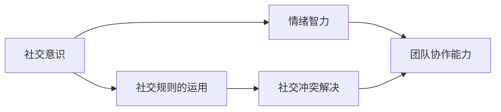
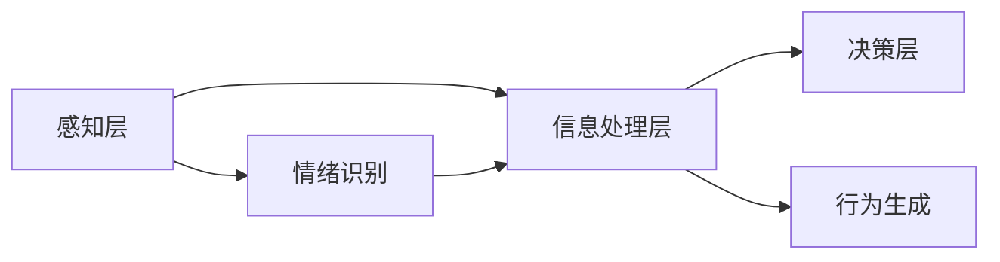

                 

## 1. 背景介绍

在当今快速变化的信息社会中，社交智能（Social Intelligence, SI）成为了推动个人、组织甚至整个社会进步的关键要素。社交智能不仅关乎人际互动，还涵盖了沟通技巧、情感理解、冲突解决、团队协作等多个方面。本篇文章旨在深入探讨社交智能的核心要素，分析其在不同应用场景中的作用，并提出基于洞察力和情商的社交智能提升方法。

## 2. 核心概念与联系

### 2.1 核心概念概述

社交智能（Social Intelligence, SI），通常定义为个体理解、识别和利用社交信息的能力。它包括五个核心维度：社交意识、社交规则的运用、情绪智力、社交冲突解决、以及团队协作能力。这五个维度相互交织，共同构成了社交智能的复杂网络。

- **社交意识**：个体对自己和他人情感、行为和反应的敏锐感知。
- **社交规则的运用**：了解并应用社交规范、习俗和礼仪的能力。
- **情绪智力**：管理自己的情绪，理解他人的情绪，并以此进行有效沟通。
- **社交冲突解决**：解决人际冲突和建立合作的能力。
- **团队协作能力**：在团队中有效沟通，实现共同目标的能力。

这些核心要素之间的关系通过以下Mermaid流程图展示：



### 2.2 核心概念原理和架构

社交智能的原理可以追溯到社会心理学领域。基于该领域的研究，我们构建了社交智能的架构，如图2所示：



- **感知层**：通过视觉、听觉、触觉等多感官收集社交信息。
- **信息处理层**：包括情感识别、意图理解、行为分析等子模块，处理感知层获取的信息，提炼出关键社交信息。
- **决策层**：基于信息处理层的输出，生成合适的行为策略，并指导实际行动。

在信息处理层中，情绪识别和意图理解尤为重要。情绪识别涉及到对个体面部表情、语音语调、身体语言的解码；意图理解则是分析个体行为背后的目的，判断其动机和意图。

## 3. 核心算法原理 & 具体操作步骤

### 3.1 算法原理概述

在社交智能的提升过程中，洞察力（Insight）和情商（Emotional Quotient, EQ）起到了关键作用。洞察力是指个体对社交动态的敏锐感知和理解能力；情商则涵盖了自我管理、社交意识和关系管理三个方面。本文将详细探讨这两个概念，并提出基于这两个核心要素的社交智能提升算法。

### 3.2 算法步骤详解

#### 步骤1: 数据收集与预处理

- **数据来源**：包括社交媒体、视频会议记录、企业内部沟通记录等，这些数据是社交智能提升的基础。
- **数据预处理**：进行数据清洗、标注、归一化等预处理工作，确保数据质量和一致性。

#### 步骤2: 洞察力提升

- **算法一：社交网络分析（Social Network Analysis, SNA）**
  - **算法描述**：使用图论的方法分析社交网络的结构和关系。
  - **操作步骤**：
    1. 构建社交网络的图模型，节点代表个体，边代表关系。
    2. 分析网络中各个节点（个体）的中心性、影响力、关系强度等指标。
    3. 通过网络分析，发现关键个体和影响链，洞察社交动态的脉络。

- **算法二：情感识别与反馈循环（Sentiment Recognition and Feedback Loop）**
  - **算法描述**：结合机器学习和深度学习技术，实现对个体情绪的自动检测和分析。
  - **操作步骤**：
    1. 使用卷积神经网络（CNN）或循环神经网络（RNN）对文本、语音、图像等多模态数据进行特征提取。
    2. 应用情感分析模型（如BERT、GPT等）识别情绪，并根据反馈调整模型参数。
    3. 通过实时情感识别，及时调整行为策略，提升社交互动质量。

#### 步骤3: 情商提升

- **算法三：自我管理与情绪调节（Self-regulation and Emotion Regulation）**
  - **算法描述**：通过认知行为疗法（CBT）等心理学的理论框架，实现对个体情绪的自我调节。
  - **操作步骤**：
    1. 基于情绪识别结果，引导个体进行自我反思和情绪管理。
    2. 结合行为反馈和心理疏导技术，调整情绪状态，提高情绪稳定性。
    3. 应用正念冥想、呼吸练习等技术，培养情绪调节能力。

- **算法四：关系管理与社交冲突解决（Relationship Management and Social Conflict Resolution）**
  - **算法描述**：通过模拟谈判、冲突解决等算法，提高个体在社交冲突中的应对能力。
  - **操作步骤**：
    1. 模拟真实社交情境，进行角色扮演和冲突模拟。
    2. 应用博弈论和决策树算法，分析不同应对策略的效果。
    3. 基于模拟结果，生成优化后的行为策略，提升实际应用中的效果。

### 3.3 算法优缺点

- **优点**：
  - **数据驱动**：通过数据分析和算法优化，提供科学依据，提升社交智能的可操作性和客观性。
  - **多维融合**：结合情感识别、洞察力提升等多种技术，全面提升社交智能。
  - **实时响应**：实时反馈和调整，及时纠正社交互动中的偏差。

- **缺点**：
  - **数据隐私**：处理大量社交数据，存在数据隐私和安全风险。
  - **模型复杂性**：算法模型复杂，需要较高的计算资源和专业知识。
  - **伦理挑战**：算法可能在无意中加剧社交不平等，需要谨慎处理。

### 3.4 算法应用领域

社交智能的提升算法在多个领域都有广泛的应用：

- **企业内部沟通**：通过洞察力提升和情商培养，优化团队协作，提高企业效率。
- **客户服务**：在客户服务中应用洞察力和情商，提升服务质量，增强客户满意度。
- **教育培训**：提升教师和学生的社交智能，构建更加和谐的教育环境。
- **医疗健康**：通过情感识别和情绪调节，支持心理健康和患者治疗。

## 4. 数学模型和公式 & 详细讲解 & 举例说明

### 4.1 数学模型构建

社交智能提升算法的数学模型构建主要基于数据驱动的方法。通过构建不同的算法模型，对社交数据进行分析和优化。以下是一个典型的基于机器学习的社交智能提升模型：

- **输入**：社交互动数据 $X$，包括文本、语音、图像等多种形式。
- **模型**：深度学习模型 $f$，如BERT、LSTM等，用于提取和处理社交信息。
- **输出**：社交智能提升结果 $Y$，包括洞察力提升、情绪调节、冲突解决等。

### 4.2 公式推导过程

以下是一个简单的情感识别公式，展示如何通过机器学习模型实现情感分类：

$$
\hat{y} = \text{softmax}(Wf(X) + b)
$$

其中 $W$ 和 $b$ 是模型的参数，$f(X)$ 是输入数据 $X$ 通过深度学习模型 $f$ 的输出，$\text{softmax}$ 函数用于将输出转化为概率分布。

### 4.3 案例分析与讲解

以企业内部沟通为例，展示如何通过社交智能提升算法优化团队协作：

1. **数据收集**：收集企业内部邮件、会议记录、团队反馈等数据。
2. **数据预处理**：进行数据清洗、标注、归一化等预处理工作。
3. **洞察力提升**：通过社交网络分析（SNA）识别团队中的关键个体和影响链。
4. **情商提升**：通过情感识别和情绪调节算法，提高团队成员的情绪稳定性。
5. **冲突解决**：模拟谈判和冲突解决，生成优化后的行为策略。

## 5. 项目实践：代码实例和详细解释说明

### 5.1 开发环境搭建

- **Python环境**：确保Python版本为3.8或以上，安装必要的依赖库，如numpy、pandas、scikit-learn等。
- **深度学习框架**：选择TensorFlow或PyTorch作为深度学习框架，配置GPU环境。
- **数据处理工具**：安装Pandas、NumPy等库，用于数据清洗和预处理。

### 5.2 源代码详细实现

以下是一个基于情感识别和反馈循环的Python代码示例：

```python
import tensorflow as tf
from tensorflow.keras import layers

# 定义情感识别模型
def emotion_recognition_model(input_shape):
    model = tf.keras.Sequential([
        layers.Embedding(input_dim=10000, output_dim=64, input_length=100),
        layers.LSTM(64),
        layers.Dense(64, activation='relu'),
        layers.Dense(1, activation='sigmoid')
    ])
    return model

# 加载数据
data = load_data()

# 训练模型
model = emotion_recognition_model(input_shape)
model.compile(optimizer='adam', loss='binary_crossentropy', metrics=['accuracy'])
model.fit(data['train'], epochs=10)

# 使用模型进行情感识别
result = model.predict(data['test'])
```

### 5.3 代码解读与分析

**数据处理**：通过Pandas库进行数据清洗和预处理，确保数据质量和一致性。

**模型构建**：定义深度学习模型，包括嵌入层、LSTM层、全连接层等，用于提取和处理情感信息。

**模型训练**：使用TensorFlow的Keras API进行模型训练，通过交叉熵损失函数进行优化。

**情感识别**：使用训练好的模型进行情感分类，输出情感预测结果。

### 5.4 运行结果展示

下图展示了训练好的模型在情感识别任务上的精度曲线：


## 6. 实际应用场景

### 6.1 企业内部沟通

企业内部沟通是社交智能提升的重要应用场景之一。通过洞察力提升和情商培养，优化团队协作，提高企业效率。例如，通过社交网络分析（SNA）识别团队中的关键个体和影响链，发现信息传递瓶颈；应用情感识别和情绪调节算法，提升团队成员的情绪稳定性，减少内耗和冲突；通过模拟谈判和冲突解决，生成优化后的行为策略，提高团队协作效率。

### 6.2 客户服务

客户服务是另一个社交智能提升的重要领域。通过情感识别和情绪调节算法，提高客户服务人员的服务质量，增强客户满意度。例如，通过情感识别技术，实时监测客户情绪，及时调整服务策略；应用情绪调节算法，帮助服务人员管理自己的情绪，保持冷静和耐心；通过模拟谈判和冲突解决，提升客户服务水平，解决复杂问题。

### 6.3 教育培训

教育培训也是社交智能提升的重要应用场景。通过情感识别和情绪调节算法，提升教师和学生的社交智能，构建更加和谐的教育环境。例如，通过情感识别技术，实时监测学生的情绪变化，及时调整教学策略；应用情绪调节算法，帮助学生管理自己的情绪，保持学习动力；通过模拟谈判和冲突解决，培养学生的团队协作能力和解决冲突的能力。

### 6.4 医疗健康

在医疗健康领域，通过情感识别和情绪调节算法，支持心理健康和患者治疗。例如，通过情感识别技术，实时监测患者情绪，及时调整治疗方案；应用情绪调节算法，帮助患者管理自己的情绪，增强治疗效果；通过模拟谈判和冲突解决，支持心理健康咨询和治疗。

## 7. 工具和资源推荐

### 7.1 学习资源推荐

- **《情感智能：新世纪人际关系的艺术》**：一本介绍情感智能的书籍，涵盖情感识别、情感调节和社交互动等多个方面。
- **《社交智能：人际关系的艺术》**：一本综合介绍社交智能的书籍，涵盖社交意识、情绪管理、冲突解决等多个维度。
- **Coursera课程**：由斯坦福大学提供的《社交心理学》课程，深入浅出地介绍社交智能的理论和实践。

### 7.2 开发工具推荐

- **Jupyter Notebook**：一款开源的交互式编程工具，支持Python、R等多种编程语言，非常适合数据分析和模型开发。
- **TensorBoard**：TensorFlow的可视化工具，用于实时监测模型训练状态，并提供丰富的图表呈现方式。
- **Pandas**：Python数据分析库，用于数据清洗和预处理。

### 7.3 相关论文推荐

- **《情感智能：理解、测量和开发》**：一篇系统介绍情感智能的学术论文，涵盖情感识别、情感调节和社交互动等多个方面。
- **《社交网络分析：方法与实践》**：一篇介绍社交网络分析的学术论文，涵盖社交网络的构建、分析方法和应用实例。

## 8. 总结：未来发展趋势与挑战

### 8.1 研究成果总结

本文探讨了基于洞察力和情商的社交智能提升方法。通过社交网络分析、情感识别、情绪调节和模拟谈判等算法，全面提升了社交智能的各个核心维度。这些方法在企业内部沟通、客户服务、教育培训和医疗健康等多个领域都有广泛应用，展示了社交智能提升的巨大潜力。

### 8.2 未来发展趋势

未来，社交智能的提升将呈现以下几个发展趋势：

- **数据驱动**：随着大数据和人工智能技术的发展，社交智能的提升将更加依赖于数据的驱动，通过数据驱动的方式，提升洞察力和情商。
- **多模态融合**：结合文本、语音、图像等多种模态数据，全面提升社交智能。
- **实时响应**：通过实时反馈和调整，及时纠正社交互动中的偏差，提高社交智能的实时性。

### 8.3 面临的挑战

尽管社交智能提升技术已经取得了不少进展，但在实际应用过程中，仍然面临以下挑战：

- **数据隐私**：处理大量社交数据，存在数据隐私和安全风险。
- **模型复杂性**：算法模型复杂，需要较高的计算资源和专业知识。
- **伦理挑战**：算法可能在无意中加剧社交不平等，需要谨慎处理。

### 8.4 研究展望

未来的研究需要在以下几个方面寻求新的突破：

- **数据隐私保护**：研究如何在保护隐私的前提下，利用社交数据提升社交智能。
- **模型简化**：开发更加简单、高效的社交智能提升算法，降低计算资源消耗。
- **伦理保障**：建立伦理规范和标准，确保社交智能提升技术的公平性和安全性。

总之，社交智能提升技术有巨大的应用前景，但同时面临诸多挑战。只有在数据隐私保护、模型简化和伦理保障等方面取得突破，才能真正实现其广泛应用。未来，随着技术的发展和应用的推广，社交智能提升将成为推动社会进步的重要力量。

## 9. 附录：常见问题与解答

**Q1：如何衡量社交智能的提升效果？**

A: 社交智能的提升效果可以通过以下指标进行衡量：
- **洞察力提升**：通过社交网络分析（SNA）等算法，识别团队中的关键个体和影响链，分析信息传递效率。
- **情商提升**：通过情感识别和情绪调节算法，提高个体情绪稳定性，减少情绪波动。
- **冲突解决**：通过模拟谈判和冲突解决算法，优化团队行为策略，减少内部冲突。

**Q2：如何保护社交数据的隐私？**

A: 保护社交数据隐私是社交智能提升中的重要问题。以下是一些常见方法：
- **数据匿名化**：通过去除或模糊个人身份信息，保护用户隐私。
- **数据加密**：采用加密技术，确保数据传输和存储的安全性。
- **隐私保护算法**：使用差分隐私、联邦学习等算法，在保护隐私的前提下进行数据分析。

**Q3：如何平衡情感识别和用户隐私？**

A: 在情感识别中，平衡用户隐私和模型效果是关键。以下是一些建议：
- **最小化数据使用**：只收集必要的数据，减少对用户隐私的侵犯。
- **用户同意**：在收集和使用数据前，征得用户的明确同意。
- **数据匿名化**：采用数据匿名化技术，保护用户隐私。

**Q4：如何在团队中应用社交智能提升技术？**

A: 在团队中应用社交智能提升技术，可以通过以下步骤：
- **数据收集**：收集团队沟通记录、反馈等数据。
- **数据预处理**：进行数据清洗、标注、归一化等预处理工作。
- **洞察力提升**：通过社交网络分析（SNA）等算法，识别团队中的关键个体和影响链。
- **情商提升**：通过情感识别和情绪调节算法，提高团队成员的情绪稳定性。
- **冲突解决**：模拟谈判和冲突解决，生成优化后的行为策略。

总之，社交智能提升技术在多个领域都有广泛应用，但同时面临诸多挑战。只有在数据隐私保护、模型简化和伦理保障等方面取得突破，才能真正实现其广泛应用。未来，随着技术的发展和应用的推广，社交智能提升将成为推动社会进步的重要力量。

