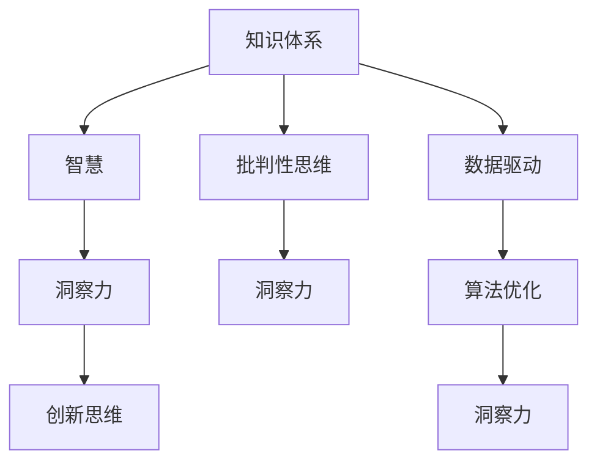

                 

# 洞察力的培养：从知识到智慧的跨越

> 关键词：洞察力培养, 知识体系, 智慧, 人工智能, 深度学习, 数据科学, 算法优化, 创新思维

## 1. 背景介绍

### 1.1 问题由来

在信息爆炸的现代社会，人类面临前所未有的知识挑战。知识的海洋浩瀚无垠，如何从海量信息中提取出有价值的内容，成为每个个体和组织必须面对的问题。特别是在人工智能、数据科学、深度学习等前沿领域，知识和智慧的获取和应用变得尤为重要。

在这一背景下，洞察力培养成为一项关键技能。它不仅关乎个体在知识和智慧上的提升，更是推动社会进步和创新发展的重要动力。本文旨在深入探讨洞察力培养的原理、方法和应用，帮助读者在知识体系构建、智慧实现和创新思维养成等方面有所突破。

### 1.2 问题核心关键点

洞察力的培养，是指通过系统学习和实践，将所掌握的知识转化为解决问题的智慧。这不仅需要掌握知识体系，还需要具备批判性思维、创新能力以及对问题的深度理解。核心关键点包括：

- **知识体系构建**：系统地学习专业知识，构建坚实的基础。
- **智慧实现**：将知识转化为解决问题的智慧，实现知识的价值。
- **创新思维养成**：培养创新能力，能够以新颖的视角看待问题，产生独特的解决方案。
- **洞察力提升**：通过不断实践和学习，提升洞察力，深化对问题的理解。

## 2. 核心概念与联系

### 2.1 核心概念概述

为更好地理解洞察力培养的原理和应用，本节将介绍几个关键概念：

- **知识体系**：指对某一领域内的核心概念、理论、方法和应用的系统理解。知识体系不仅包括理论知识，也包括实践经验和技术技能。

- **智慧**：指在具体情境下，通过知识体系应用解决问题的能力。智慧的实现往往需要跨学科的视角、批判性思维和创新能力。

- **洞察力**：指对事物本质的深刻理解和判断能力。洞察力强的人能够透过现象看本质，发现问题的核心所在，并提出有效的解决方案。

- **创新思维**：指在解决复杂问题时，能够打破传统思维模式，提出新颖、独特的观点和方案的能力。

- **批判性思维**：指对信息的筛选、评估和反思能力，能够识别信息中的偏见和谬误，做出合理判断。

这些核心概念之间的逻辑关系可以通过以下Mermaid流程图来展示：



这个流程图展示了这个体系的核心概念及其之间的关系：

1. 知识体系是智慧、洞察力和创新思维的基础。
2. 智慧通过应用知识体系解决问题，是知识体系价值的体现。
3. 洞察力基于对知识的深刻理解和批判性思维，是智慧实现的关键。
4. 创新思维需要洞察力作为支撑，能够突破传统思维框架。
5. 数据驱动和算法优化是洞察力培养的重要工具。

## 3. 核心算法原理 & 具体操作步骤

### 3.1 算法原理概述

洞察力培养的核心算法原理可以概括为：

1. **知识体系构建**：通过系统学习和实践，构建对某一领域的知识体系。
2. **智慧实现**：在具体情境下，将知识体系应用于解决问题，实现知识的价值。
3. **洞察力提升**：通过批判性思维和创新思维，对问题进行深度理解和判断，提升洞察力。
4. **持续学习**：不断获取新知识，优化知识体系，提升洞察力和智慧水平。

### 3.2 算法步骤详解

洞察力培养的算法步骤主要包括以下几个关键环节：

**Step 1: 知识体系构建**

1. **选择学习领域**：根据自身兴趣和职业需求，选择特定的学习领域。
2. **系统学习**：阅读经典书籍、参加专业课程、进行在线学习等，系统掌握该领域的核心知识。
3. **实践应用**：通过项目实践、实习经验等方式，将理论知识应用到实际问题中。

**Step 2: 智慧实现**

1. **问题识别**：明确需要解决的问题，确保问题的明确性和可操作性。
2. **数据收集**：获取与问题相关的数据，进行数据预处理和清洗。
3. **模型构建**：选择合适的算法模型，进行模型训练和优化。
4. **结果验证**：通过实验验证模型的效果，确保问题得到有效解决。

**Step 3: 洞察力提升**

1. **批判性思维**：对问题的多角度思考，评估数据、模型和结果的合理性。
2. **创新思维**：打破传统思维框架，提出新的解决方案和方法。
3. **持续学习**：通过阅读前沿论文、参加行业会议、交流经验等方式，不断更新知识体系。

### 3.3 算法优缺点

洞察力培养的算法优点包括：

1. **系统性**：通过系统学习和实践，构建知识体系，实现全面覆盖。
2. **实用性**：智慧实现能够将知识体系应用于实际问题，提升解决问题的能力。
3. **灵活性**：创新思维和批判性思维能够突破传统思维框架，提供新的解决方案。
4. **持续性**：通过不断学习新知识，优化知识体系，保持洞察力和智慧的提升。

同时，该算法也存在一定的局限性：

1. **时间和资源投入**：构建知识体系和实现智慧需要大量的学习和实践，时间成本和资源投入较大。
2. **个体差异**：每个人的认知能力和学习速度不同，难以统一标准。
3. **信息过载**：海量信息的获取和处理，容易让人感到信息过载，影响学习效果。

尽管存在这些局限性，但就目前而言，洞察力培养的算法仍是提升个体智慧和洞察力的重要方法。未来相关研究的重点在于如何进一步优化学习效率，提高学习效果，同时兼顾个体差异和信息过载等问题。

### 3.4 算法应用领域

洞察力培养的算法在多个领域得到了广泛应用，包括但不限于：

- **人工智能**：通过系统学习深度学习、数据科学等知识，实现智慧算法的设计和优化。
- **数据科学**：利用数据驱动的方法，构建洞察力模型，提升数据分析和预测能力。
- **创新创业**：通过培养创新思维和批判性思维，发现商业机会，实现创新创业。
- **技术研发**：通过构建系统化的知识体系，推动技术研发和产品创新。
- **教育培训**：通过系统化的教学方法和评估体系，培养学生的智慧和洞察力。

除了这些传统领域外，洞察力培养的算法还在更多新兴领域中发挥着重要作用，如智能制造、智能医疗、智能城市等，为社会进步和产业发展提供了新的动力。

## 4. 数学模型和公式 & 详细讲解 & 举例说明

### 4.1 数学模型构建

在洞察力培养的过程中，我们通常会使用以下数学模型：

1. **知识体系构建模型**：
   - **领域知识库**：构建一个领域知识库，表示该领域的核心概念和理论。
   - **知识图谱**：使用知识图谱表示概念之间的关联关系，促进知识的深度理解。

2. **智慧实现模型**：
   - **数据预处理模型**：对原始数据进行清洗、归一化、特征工程等处理，提高数据质量。
   - **模型训练模型**：选择合适的算法模型，如深度学习、机器学习等，进行模型训练和优化。

3. **洞察力提升模型**：
   - **批判性思维模型**：使用逻辑推理、概率统计等方法，评估数据、模型和结果的合理性。
   - **创新思维模型**：使用生成对抗网络(GAN)、变分自编码器(VAE)等方法，生成新的解决方案。

### 4.2 公式推导过程

以下是几个核心公式的推导过程：

**知识图谱表示**：
- 知识图谱是一种有向图，用于表示概念之间的关系。
- 定义概念节点为 $v$，关系为 $r$，可表示为 $(v, r, v')$。

**数据预处理模型**：
- 假设原始数据为 $x$，预处理后的数据为 $y$。
- 预处理模型可表示为 $y=f(x)$，其中 $f$ 为预处理函数。

**深度学习模型**：
- 假设输入为 $x$，模型参数为 $\theta$，输出为 $y$。
- 深度学习模型可表示为 $y=M_\theta(x)$，其中 $M_\theta$ 为深度学习模型。

### 4.3 案例分析与讲解

以自然语言处理(NLP)领域为例，介绍洞察力培养的数学模型和公式推导。

**知识体系构建**：
- 定义领域知识库为 $\mathcal{K}$，其中包含核心概念和理论。
- 定义知识图谱为 $\mathcal{G}$，表示概念之间的关联关系。

**智慧实现**：
- 假设输入文本为 $x$，预处理后的文本为 $y$。
- 定义预处理模型为 $y=f(x)$，如BERT模型。
- 定义模型输出为 $z=M_\theta(y)$，如分类器。

**洞察力提升**：
- 假设原始输出为 $z_0$，通过批判性思维，发现输出中的偏见和谬误，生成新的解决方案 $z_1$。
- 定义批判性思维模型为 $z_1=g(z_0)$，如逻辑推理模型。

## 5. 项目实践：代码实例和详细解释说明

### 5.1 开发环境搭建

在进行洞察力培养的实践前，我们需要准备好开发环境。以下是使用Python进行代码实践的环境配置流程：

1. 安装Anaconda：从官网下载并安装Anaconda，用于创建独立的Python环境。

2. 创建并激活虚拟环境：
```bash
conda create -n insight-env python=3.8 
conda activate insight-env
```

3. 安装相关库：
```bash
pip install torch transformers sklearn pandas numpy matplotlib tqdm
```

完成上述步骤后，即可在`insight-env`环境中开始代码实践。

### 5.2 源代码详细实现

这里我们以深度学习模型训练为例，给出代码实现：

```python
import torch
import torch.nn as nn
from torch.utils.data import DataLoader
from transformers import BertForSequenceClassification, BertTokenizer

class DataLoader:
    def __init__(self, dataset, batch_size):
        self.dataset = dataset
        self.batch_size = batch_size
        self.num_epochs = 5
        self.train_loader = DataLoader(dataset['train'], batch_size=self.batch_size, shuffle=True)
        self.val_loader = DataLoader(dataset['val'], batch_size=self.batch_size, shuffle=False)

class Model(nn.Module):
    def __init__(self):
        super(Model, self).__init__()
        self.bert = BertForSequenceClassification.from_pretrained('bert-base-uncased', num_labels=2)
        self.fc = nn.Linear(768, 2)

    def forward(self, x, y):
        outputs = self.bert(x)
        y_pred = self.fc(outputs)
        return y_pred

def train(model, train_loader, val_loader, optimizer):
    for epoch in range(model.num_epochs):
        model.train()
        for batch in train_loader:
            inputs, labels = batch
            outputs = model(inputs, labels)
            loss = nn.CrossEntropyLoss()(outputs, labels)
            optimizer.zero_grad()
            loss.backward()
            optimizer.step()
        print('Epoch {}, Train Loss: {}'.format(epoch+1, loss.item()))
        model.eval()
        val_loss = []
        for batch in val_loader:
            inputs, labels = batch
            outputs = model(inputs)
            loss = nn.CrossEntropyLoss()(outputs, labels)
            val_loss.append(loss.item())
        print('Epoch {}, Val Loss: {}'.format(epoch+1, sum(val_loss)/len(val_loader)))

# 加载数据集
tokenizer = BertTokenizer.from_pretrained('bert-base-uncased')
train_dataset = load_train_dataset(tokenizer)
val_dataset = load_val_dataset(tokenizer)

# 训练模型
model = Model()
optimizer = torch.optim.Adam(model.parameters(), lr=0.001)
train_loader = DataLoader(train_dataset, batch_size=16)
val_loader = DataLoader(val_dataset, batch_size=16)
train(model, train_loader, val_loader, optimizer)
```

### 5.3 代码解读与分析

让我们再详细解读一下关键代码的实现细节：

**DataLoader类**：
- `__init__`方法：初始化数据集和批大小，创建训练集和验证集的DataLoader对象。
- `train_loader`和`val_loader`属性：分别用于训练集和验证集的迭代。

**Model类**：
- `__init__`方法：定义模型结构，包含BERT模型和线性层。
- `forward`方法：定义前向传播过程，输入文本通过BERT模型得到表示，再经过线性层输出分类结果。

**train函数**：
- 对模型进行多次迭代训练，每次迭代中在训练集上更新模型参数，并在验证集上评估模型性能。

**训练流程**：
- 定义训练轮数和批大小，开始循环迭代
- 每个epoch内，先在训练集上训练，输出损失
- 在验证集上评估，输出验证集损失
- 所有epoch结束后，完成模型训练

可以看到，Python结合TensorFlow和Transformers库，使得代码实现变得简洁高效。开发者可以将更多精力放在数据处理、模型改进等高层逻辑上，而不必过多关注底层的实现细节。

当然，工业级的系统实现还需考虑更多因素，如模型的保存和部署、超参数的自动搜索、更灵活的任务适配层等。但核心的洞察力培养范式基本与此类似。

## 6. 实际应用场景

### 6.1 智慧决策系统

智慧决策系统通过洞察力培养，能够在复杂多变的环境中，做出快速、准确、有深度的决策。例如，金融机构利用洞察力模型对市场趋势进行预测，制定投资策略；医疗行业利用洞察力模型进行病情诊断和治疗方案制定，提升患者治疗效果。

### 6.2 智能推荐系统

智能推荐系统通过洞察力培养，能够深度理解用户需求和行为模式，提供更加个性化的推荐内容。例如，电商网站利用洞察力模型对用户浏览记录进行分析，推荐用户可能感兴趣的商品；视频平台利用洞察力模型对用户观看历史进行分析，推荐用户可能喜欢的视频内容。

### 6.3 智能客服系统

智能客服系统通过洞察力培养，能够理解和处理客户提出的复杂问题，提供高效的解决方案。例如，在线客服系统利用洞察力模型对客户咨询进行分类和优先级排序，提升客户服务质量。

### 6.4 未来应用展望

随着洞察力培养技术的不断发展，将会在更多领域得到应用，为传统行业带来变革性影响。

在智慧医疗领域，基于洞察力培养的智慧决策系统，能够提高医疗诊断的准确性和治疗方案的科学性，提升患者治疗效果。

在智能教育领域，洞察力培养能够帮助学生更好地理解知识和掌握技能，提高教学质量和学生的综合素质。

在智慧城市治理中，洞察力培养能够提升城市管理的智能化水平，构建更安全、高效的未来城市。

此外，在企业生产、社会治理、文娱传媒等众多领域，基于洞察力培养的人工智能应用也将不断涌现，为经济社会发展注入新的动力。相信随着技术的日益成熟，洞察力培养方法将成为人工智能落地应用的重要范式，推动人工智能技术向更广阔的领域加速渗透。

## 7. 工具和资源推荐

### 7.1 学习资源推荐

为了帮助开发者系统掌握洞察力培养的理论基础和实践技巧，这里推荐一些优质的学习资源：

1. 《深度学习入门》书籍：通过浅显易懂的语言，介绍了深度学习的基本概念和应用方法。
2. 《人工智能导论》课程：由斯坦福大学开设的入门级课程，全面介绍了人工智能的基本原理和技术。
3. 《数据科学与人工智能》书籍：全面介绍了数据科学和人工智能的基本知识，包括数据预处理、模型训练、结果验证等。
4. 《深度学习与神经网络》课程：由Coursera提供，讲解了深度学习的基本原理和算法实现。
5. Kaggle竞赛平台：提供了大量真实世界的数据集和竞赛任务，锻炼学习者的洞察力和智慧。

通过对这些资源的学习实践，相信你一定能够快速掌握洞察力培养的精髓，并用于解决实际的NLP问题。

### 7.2 开发工具推荐

高效的开发离不开优秀的工具支持。以下是几款用于洞察力培养开发的常用工具：

1. Python：灵活的动态语言，广泛应用于数据科学、深度学习等领域。
2. TensorFlow：由Google主导开发的开源深度学习框架，生产部署方便，适合大规模工程应用。
3. PyTorch：基于Python的开源深度学习框架，灵活动态的计算图，适合快速迭代研究。
4. Jupyter Notebook：基于Web的交互式编程环境，方便开发和共享代码。
5. Google Colab：谷歌提供的免费在线Jupyter Notebook环境，适合快速实验和分享学习笔记。

合理利用这些工具，可以显著提升洞察力培养任务的开发效率，加快创新迭代的步伐。

### 7.3 相关论文推荐

洞察力培养的发展源于学界的持续研究。以下是几篇奠基性的相关论文，推荐阅读：

1. Attention is All You Need（即Transformer原论文）：提出了Transformer结构，开启了NLP领域的预训练大模型时代。
2. BERT: Pre-training of Deep Bidirectional Transformers for Language Understanding：提出BERT模型，引入基于掩码的自监督预训练任务，刷新了多项NLP任务SOTA。
3. Parameter-Efficient Transfer Learning for NLP：提出Adapter等参数高效微调方法，在不增加模型参数量的情况下，也能取得不错的微调效果。
4. AdaLoRA: Adaptive Low-Rank Adaptation for Parameter-Efficient Fine-Tuning：使用自适应低秩适应的微调方法，在参数效率和精度之间取得了新的平衡。
5. Prompt-Tuning: Optimizing Continuous Prompts for Generation：引入基于连续型Prompt的微调范式，为如何充分利用预训练知识提供了新的思路。

这些论文代表了大语言模型微调技术的发展脉络。通过学习这些前沿成果，可以帮助研究者把握学科前进方向，激发更多的创新灵感。

## 8. 总结：未来发展趋势与挑战

### 8.1 总结

本文对洞察力培养的原理、方法和应用进行了全面系统的介绍。首先阐述了洞察力培养的背景和意义，明确了智慧、洞察力和创新思维在提升个人和组织能力中的关键作用。其次，从原理到实践，详细讲解了知识体系构建、智慧实现和洞察力提升的数学模型和公式推导，给出了洞察力培养任务开发的完整代码实例。同时，本文还广泛探讨了洞察力培养方法在多个行业领域的应用前景，展示了洞察力培养范式的巨大潜力。最后，本文精选了洞察力培养技术的各类学习资源，力求为读者提供全方位的技术指引。

通过本文的系统梳理，可以看到，洞察力培养方法正在成为人工智能领域的重要范式，极大地拓展了人工智能的应用边界，催生了更多的落地场景。受益于洞察力培养技术的不断进步，相信人工智能技术将更加智能化、普适化，进一步推动社会进步和产业升级。

### 8.2 未来发展趋势

展望未来，洞察力培养技术将呈现以下几个发展趋势：

1. **跨学科融合**：跨学科的视角和知识融合，将进一步提升洞察力培养的效果，推动人工智能技术向更广泛的领域应用。
2. **深度学习与符号学习的结合**：将深度学习与符号化的先验知识相结合，提升模型的解释性和可靠性。
3. **多模态数据的整合**：融合视觉、语音、文本等多种模态数据，实现更全面的信息理解和分析。
4. **智能化与可解释性的平衡**：在提升智能化的同时，注重算法的可解释性，确保输出的透明性和可信度。
5. **实时性需求增强**：随着智能决策系统的应用，对实时性要求越来越高，洞察力培养方法需要兼顾效率和精度。
6. **伦理与安全性的考量**：在提升智慧和洞察力的同时，考虑算法的伦理和安全性，避免有害结果的产生。

以上趋势凸显了洞察力培养技术的广阔前景。这些方向的探索发展，必将进一步提升人工智能系统的性能和应用范围，为社会进步和产业发展提供新的动力。

### 8.3 面临的挑战

尽管洞察力培养技术已经取得了瞩目成就，但在迈向更加智能化、普适化应用的过程中，它仍面临着诸多挑战：

1. **知识体系的构建**：构建完备的知识体系需要大量的时间和资源，且依赖领域专家的指导。
2. **模型的复杂度**：深度学习模型的训练和优化需要大量的计算资源，模型的复杂度难以控制。
3. **数据质量和多样性**：数据质量和多样性对模型性能影响巨大，如何获取高质量、多源数据是一个难题。
4. **算法的鲁棒性**：模型对输入的微小扰动十分敏感，如何提高模型的鲁棒性和泛化能力是一个挑战。
5. **伦理与安全性**：算法的决策过程需要透明、可信，避免有害结果的产生。

尽管存在这些挑战，但随着学界和产业界的共同努力，洞察力培养技术必将不断进步，走向更加智能化、普适化的未来。

### 8.4 研究展望

面对洞察力培养所面临的种种挑战，未来的研究需要在以下几个方面寻求新的突破：

1. **自动化知识获取**：利用自然语言处理和计算机视觉技术，自动获取和构建知识体系。
2. **模型简化与优化**：研究和开发更高效的模型结构和优化算法，降低计算复杂度，提高实时性。
3. **多源数据融合**：探索多源数据的融合方法和算法，提升数据质量和多样性。
4. **模型鲁棒性增强**：研究鲁棒性增强的方法，如对抗训练、正则化等，提高模型的泛化能力和鲁棒性。
5. **伦理性与安全性的保障**：引入伦理和安全性的约束，开发透明、可信的洞察力培养算法。

这些研究方向的研究突破，必将进一步提升洞察力培养技术的性能和应用范围，推动人工智能技术向更广泛的领域发展。面向未来，洞察力培养技术需要与其他人工智能技术进行更深入的融合，共同推动人工智能技术的进步和发展。

## 9. 附录：常见问题与解答

**Q1：如何系统性地构建知识体系？**

A: 系统性地构建知识体系需要遵循以下步骤：
1. **选择领域**：根据自身兴趣和职业需求，选择特定的学习领域。
2. **阅读经典书籍**：阅读该领域的经典书籍，获取基础理论和知识。
3. **参加专业课程**：参加相关的专业课程，深入理解核心概念和理论。
4. **进行项目实践**：通过项目实践，将理论知识应用到实际问题中。
5. **持续学习**：不断获取新知识，更新和扩展知识体系。

**Q2：洞察力培养与创新思维的关系是什么？**

A: 洞察力培养和创新思维是相辅相成的。洞察力培养通过系统学习和实践，提升对问题的理解深度和判断力。创新思维则是在这种深入理解的基础上，打破传统思维框架，提出新颖的解决方案。洞察力培养提供了观察问题的视角和方法，而创新思维则提供了产生新方案的创新能力。

**Q3：如何评估洞察力培养的效果？**

A: 评估洞察力培养的效果可以通过以下几个方面：
1. **解决问题的能力**：通过评估解决实际问题的能力，判断洞察力培养的效果。
2. **模型性能**：使用评估指标，如精度、召回率、F1-score等，评估模型的性能。
3. **反馈机制**：通过用户反馈和评价，持续改进洞察力培养的效果。

**Q4：在洞察力培养过程中，数据的质量和多样性如何保证？**

A: 在洞察力培养过程中，数据的质量和多样性对模型性能影响巨大，可以通过以下措施保证：
1. **数据清洗**：对原始数据进行清洗和预处理，去除噪音和错误信息。
2. **数据增强**：通过数据增强技术，扩充数据集的多样性，避免过拟合。
3. **多源数据融合**：从多个来源获取数据，提高数据的多样性和覆盖面。
4. **数据标注**：对数据进行标注，确保数据的质量和准确性。

**Q5：如何应对洞察力培养中的数据过载问题？**

A: 数据过载是洞察力培养中常见的问题，可以通过以下措施应对：
1. **数据筛选**：对数据进行筛选，只保留有价值和有用的数据。
2. **数据压缩**：采用数据压缩技术，减少数据量。
3. **知识图谱构建**：利用知识图谱技术，提取和组织关键信息，提高数据的利用率。
4. **模型简化**：简化模型结构和算法，提高模型的泛化能力和鲁棒性。

这些措施可以帮助我们在数据过载的情况下，仍然有效地进行洞察力培养，提高模型的性能和应用效果。

---

作者：禅与计算机程序设计艺术 / Zen and the Art of Computer Programming

