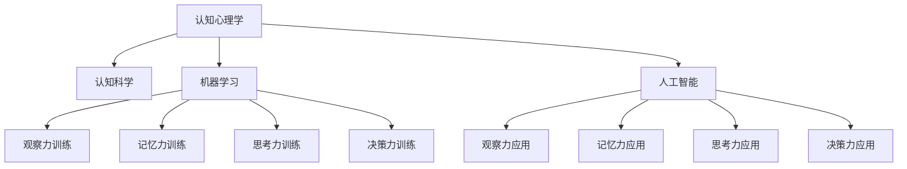

                 

# 洞察力的训练：提升观察和分析能力

> 关键词：洞察力训练,观察能力提升,分析能力提升,认知心理学,认知科学,机器学习,人工智能

## 1. 背景介绍

### 1.1 问题由来

在当今信息爆炸的时代，我们每天需要面对海量数据，从繁杂的信息中提取有价值的内容，做出正确的决策，对个人和组织的成功至关重要。这种能力，我们称之为“洞察力”。洞察力是指在大量信息中，能够快速、准确地识别和提取关键信息，并做出合理判断的能力。

### 1.2 问题核心关键点

洞察力的训练涉及多个方面，包括观察、记忆、思考、决策等。通过机器学习和认知科学的研究，我们可以更好地理解和训练人类的洞察力。

- 观察能力：指从外界获取信息的敏锐度，包括感知细节、理解情境等。
- 记忆能力：指将信息存储在长期记忆中，以便后续使用。
- 思考能力：指对信息的加工处理，包括逻辑推理、归纳总结等。
- 决策能力：指在综合分析信息后，做出合理决策的能力。

通过训练这些能力，我们可以提升个体的洞察力，使其在多个领域中发挥更大的作用。

## 2. 核心概念与联系

### 2.1 核心概念概述

为更好地理解洞察力的训练，本节将介绍几个密切相关的核心概念：

- 认知心理学(Cognitive Psychology)：研究人类认知过程的科学，包括感知、记忆、思维和决策等。
- 认知科学(Cognitive Science)：研究人脑如何处理信息，包括计算模型、算法和认知模型等。
- 机器学习(Machine Learning)：通过算法使机器学习数据，并做出预测或决策的过程。
- 人工智能(Artificial Intelligence)：使机器具备人类智能，包括观察、推理、决策等能力。
- 观察力(Perception)：指感知外界信息的能力，包括视觉、听觉、触觉等。
- 记忆力(Memory)：指将信息存储和回忆的能力，包括短期记忆和长期记忆。
- 思考力(Thought)：指分析和推理的能力，包括逻辑推理、归纳总结等。
- 决策力(Decision-making)：指根据信息做出合理决策的能力，包括风险评估、选择最佳方案等。

这些核心概念之间的逻辑关系可以通过以下Mermaid流程图来展示：



这个流程图展示了一系列与洞察力相关的核心概念及其之间的关系：

1. 认知心理学和认知科学提供了人类认知过程的理论基础。
2. 机器学习和人工智能将这些理论转化为算法和模型，实现对人类认知过程的模拟和训练。
3. 观察力、记忆力、思考力和决策力是认知过程中四个重要环节，通过训练这些能力，可以提升个体的洞察力。
4. 训练好的模型和算法可以在实际应用中发挥作用，如通过机器学习进行观察力、记忆力、思考力和决策力的训练。

这些概念共同构成了洞察力训练的理论基础和实现框架，使其能够在各个领域中发挥作用。通过理解这些核心概念，我们可以更好地把握洞察力训练的精髓，并用于解决实际问题。

## 3. 核心算法原理 & 具体操作步骤
### 3.1 算法原理概述

洞察力的训练通常采用机器学习的方法，通过大量数据和算法训练出模型，模拟人类的认知过程。其主要原理包括：

- 监督学习(Supervised Learning)：利用已标注的数据，训练模型识别和提取关键信息的能力。
- 无监督学习(Unsupervised Learning)：利用未标注的数据，训练模型自动发现数据中的结构和模式。
- 强化学习(Reinforcement Learning)：通过奖励机制，训练模型在复杂环境中做出最优决策。

这些方法在多个维度上模拟人类的认知过程，如感知、记忆、思考和决策等。

### 3.2 算法步骤详解

基于机器学习的洞察力训练一般包括以下几个关键步骤：

**Step 1: 数据准备**
- 收集与洞察力相关的数据集，如文本、图像、语音等。
- 对数据进行预处理，包括数据清洗、特征提取、归一化等。

**Step 2: 模型选择**
- 选择合适的机器学习模型，如线性回归、神经网络、决策树等。
- 设计合适的损失函数，如均方误差、交叉熵等。

**Step 3: 模型训练**
- 将数据集划分为训练集、验证集和测试集。
- 使用训练集对模型进行训练，使用验证集进行参数调优。
- 在测试集上评估模型性能，确保模型泛化能力。

**Step 4: 模型评估**
- 使用多种评估指标，如准确率、召回率、F1值等，衡量模型的性能。
- 根据评估结果，对模型进行调整和优化。

**Step 5: 模型应用**
- 将训练好的模型应用于实际问题，如文本分类、图像识别、语音识别等。
- 对用户输入的数据进行观察、记忆、思考和决策，生成输出结果。

### 3.3 算法优缺点

基于机器学习的洞察力训练方法具有以下优点：

1. 数据驱动：通过大量数据训练模型，可以发现数据中的结构和模式，提升模型性能。
2. 可解释性：许多机器学习模型可以提供特征权重和决策路径，有助于理解模型的训练过程。
3. 自动化：机器学习算法可以自动化处理数据，节省大量人工干预的时间和成本。

同时，这些方法也存在一些局限性：

1. 数据依赖：模型的性能很大程度上依赖于数据的质量和数量，获取高质量数据成本较高。
2. 泛化能力有限：当模型过于复杂或数据分布不均时，模型可能出现过拟合或欠拟合的问题。
3. 可解释性不足：某些机器学习算法（如深度神经网络）的决策过程难以解释，存在"黑箱"问题。
4. 对抗攻击易感性：模型可能容易受到对抗样本的攻击，输出结果不稳健。

尽管存在这些局限性，但就目前而言，基于机器学习的洞察力训练方法仍然是研究的热点，其在多个领域中展示了巨大的潜力。

### 3.4 算法应用领域

基于洞察力训练的机器学习方法，在多个领域中得到了广泛的应用，例如：

- 自然语言处理(NLP)：利用机器学习模型进行文本分类、情感分析、机器翻译等任务。
- 计算机视觉(Computer Vision)：通过图像识别、目标检测等技术，提升视觉系统对图像的理解能力。
- 语音识别(Speech Recognition)：利用机器学习模型进行语音转文本、语音合成等任务。
- 推荐系统(Recommendation Systems)：通过分析用户行为数据，推荐个性化的产品和服务。
- 金融风控(Financial Risk Control)：利用机器学习模型进行信用评分、欺诈检测等任务。
- 医疗诊断(Medical Diagnosis)：通过分析医疗影像和病历数据，辅助医生进行疾病诊断和治疗方案推荐。

除了这些经典应用外，基于洞察力训练的方法还在更多场景中得到了创新性的应用，如个性化推荐、智能客服、智能制造等，为各行各业带来了新的突破。

## 4. 数学模型和公式 & 详细讲解
### 4.1 数学模型构建

基于洞察力训练的机器学习模型，通常采用监督学习的方法，通过大量有标注的数据训练模型，从而提升模型对数据的观察和分析能力。

假设训练数据集为 $\{(x_i,y_i)\}_{i=1}^N$，其中 $x_i$ 为输入数据，$y_i$ 为标注结果，$x_i \in \mathcal{X}, y_i \in \mathcal{Y}$。定义模型 $f_{\theta}$ 为从 $\mathcal{X}$ 到 $\mathcal{Y}$ 的映射，其中 $\theta$ 为模型参数。模型的损失函数为：

$$
\mathcal{L}(\theta) = \frac{1}{N} \sum_{i=1}^N \ell(f_{\theta}(x_i),y_i)
$$

其中 $\ell$ 为损失函数，通常选择交叉熵损失函数：

$$
\ell(f_{\theta}(x_i),y_i) = -y_i\log(f_{\theta}(x_i)) - (1-y_i)\log(1-f_{\theta}(x_i))
$$

在训练过程中，通过优化算法（如梯度下降法）不断更新模型参数 $\theta$，最小化损失函数 $\mathcal{L}(\theta)$，使模型输出的概率分布逼近真实标签。

### 4.2 公式推导过程

以下我们以二分类任务为例，推导交叉熵损失函数及其梯度的计算公式。

假设模型 $f_{\theta}$ 在输入 $x$ 上的输出为 $\hat{y}=f_{\theta}(x) \in [0,1]$，表示样本属于正类的概率。真实标签 $y \in \{0,1\}$。则二分类交叉熵损失函数定义为：

$$
\ell(f_{\theta}(x),y) = -[y\log \hat{y} + (1-y)\log (1-\hat{y})]
$$

将其代入损失函数公式，得：

$$
\mathcal{L}(\theta) = -\frac{1}{N}\sum_{i=1}^N [y_i\log f_{\theta}(x_i)+(1-y_i)\log(1-f_{\theta}(x_i))]
$$

根据链式法则，损失函数对参数 $\theta_k$ 的梯度为：

$$
\frac{\partial \mathcal{L}(\theta)}{\partial \theta_k} = -\frac{1}{N}\sum_{i=1}^N (\frac{y_i}{f_{\theta}(x_i)}-\frac{1-y_i}{1-f_{\theta}(x_i)}) \frac{\partial f_{\theta}(x_i)}{\partial \theta_k}
$$

其中 $\frac{\partial f_{\theta}(x_i)}{\partial \theta_k}$ 可进一步递归展开，利用自动微分技术完成计算。

### 4.3 案例分析与讲解

以文本分类任务为例，说明基于机器学习的洞察力训练方法的应用。

假设任务为电影评论情感分类，将电影评论文本作为输入 $x$，输出为情感类别 $y \in \{positive, negative\}$。构建如下模型：

- 输入层：将文本转换为词向量 $x \in \mathbb{R}^d$。
- 隐藏层：通过多个全连接层或卷积层对输入进行特征提取。
- 输出层：利用softmax函数输出分类概率分布 $f_{\theta}(x) \in \mathbb{R}^2$。

模型训练步骤如下：

1. 收集电影评论数据集，进行预处理，如分词、去停用词、构建词向量等。
2. 将数据集划分为训练集、验证集和测试集。
3. 选择合适的模型结构，如深度神经网络。
4. 设置损失函数为交叉熵损失函数，优化器为AdamW。
5. 使用训练集对模型进行训练，通过反向传播更新参数。
6. 在验证集上评估模型性能，调整超参数。
7. 在测试集上评估模型泛化能力。

通过训练好的模型，可以对新的电影评论文本进行情感分类。例如，输入一段文本："The film is extremely boring and has terrible acting."，模型输出的概率分布为：

$$
f_{\theta}(x) = [0.02, 0.98]
$$

表示该文本属于负面情感的置信度为98%。

## 5. 项目实践：代码实例和详细解释说明
### 5.1 开发环境搭建

在进行洞察力训练实践前，我们需要准备好开发环境。以下是使用Python进行Keras开发的环境配置流程：

1. 安装Anaconda：从官网下载并安装Anaconda，用于创建独立的Python环境。

2. 创建并激活虚拟环境：
```bash
conda create -n keras-env python=3.8 
conda activate keras-env
```

3. 安装Keras：根据CUDA版本，从官网获取对应的安装命令。例如：
```bash
conda install keras
```

4. 安装TensorFlow：
```bash
conda install tensorflow -c tensorflow
```

5. 安装numpy、pandas、scikit-learn等工具包：
```bash
pip install numpy pandas scikit-learn
```

完成上述步骤后，即可在`keras-env`环境中开始洞察力训练实践。

### 5.2 源代码详细实现

下面我们以文本分类任务为例，给出使用Keras实现洞察力训练的代码实现。

首先，定义数据集处理函数：

```python
import numpy as np
from keras.preprocessing.text import Tokenizer
from keras.preprocessing.sequence import pad_sequences
from keras.utils import to_categorical

def load_data(file_path):
    with open(file_path, 'r') as f:
        lines = f.readlines()
    texts = [line.strip() for line in lines]
    labels = np.array([1 if 'positive' in line else 0 for line in lines])
    return texts, labels

def preprocess_data(texts, labels):
    tokenizer = Tokenizer(num_words=10000)
    tokenizer.fit_on_texts(texts)
    sequences = tokenizer.texts_to_sequences(texts)
    padded_sequences = pad_sequences(sequences, maxlen=100)
    labels = to_categorical(labels)
    return padded_sequences, labels
```

然后，定义模型和优化器：

```python
from keras.models import Sequential
from keras.layers import Dense, Embedding, LSTM

model = Sequential([
    Embedding(input_dim=10000, output_dim=64, input_length=100),
    LSTM(128, return_sequences=True),
    LSTM(128),
    Dense(1, activation='sigmoid')
])

optimizer = 'adam'
```

接着，定义训练和评估函数：

```python
from keras.models import Model
from keras.callbacks import EarlyStopping

def train_model(model, x_train, y_train, x_valid, y_valid, epochs=10, batch_size=128):
    model.compile(loss='binary_crossentropy', optimizer=optimizer, metrics=['accuracy'])
    history = model.fit(x_train, y_train, batch_size=batch_size, epochs=epochs, validation_data=(x_valid, y_valid), callbacks=[EarlyStopping(patience=2)])
    return history

def evaluate_model(model, x_test, y_test):
    loss, accuracy = model.evaluate(x_test, y_test, verbose=0)
    return accuracy
```

最后，启动训练流程并在测试集上评估：

```python
# 加载数据集
train_data, train_labels = load_data('train.txt')
dev_data, dev_labels = load_data('dev.txt')
test_data, test_labels = load_data('test.txt')

# 预处理数据集
train_sequences, train_labels = preprocess_data(train_data, train_labels)
dev_sequences, dev_labels = preprocess_data(dev_data, dev_labels)
test_sequences, test_labels = preprocess_data(test_data, test_labels)

# 训练模型
history = train_model(model, train_sequences, train_labels, dev_sequences, dev_labels)

# 评估模型
test_accuracy = evaluate_model(model, test_sequences, test_labels)
print('Test Accuracy:', test_accuracy)
```

以上就是使用Keras进行文本分类任务洞察力训练的完整代码实现。可以看到，Keras提供了强大的API，使得模型的构建和训练变得简洁高效。

### 5.3 代码解读与分析

让我们再详细解读一下关键代码的实现细节：

**load_data函数**：
- 从文件中加载数据集，返回文本列表和标签列表。

**preprocess_data函数**：
- 对文本进行分词、去停用词、构建词向量等预处理。
- 使用Keras的Tokenizer和pad_sequences函数将文本转换为模型可用的格式。
- 使用to_categorical函数将标签转换为one-hot编码。

**train_model函数**：
- 使用Keras的Sequential模型定义神经网络结构。
- 选择Embedding层、LSTM层和Dense层作为隐藏层，输出层使用sigmoid激活函数。
- 定义优化器和损失函数。
- 使用model.compile函数编译模型。
- 使用model.fit函数进行模型训练，设置EarlyStopping回调函数以避免过拟合。
- 返回训练过程中的历史数据。

**evaluate_model函数**：
- 使用model.evaluate函数在测试集上评估模型性能。
- 返回测试集上的准确率。

**训练流程**：
- 加载数据集，并预处理成模型可用的格式。
- 使用train_model函数训练模型，设置训练轮数和批次大小。
- 在验证集上评估模型性能，调整超参数。
- 在测试集上评估模型泛化能力。

可以看到，Keras提供了丰富的API和便捷的接口，使得洞察力训练的开发变得简单易懂。开发者可以更加专注于模型的设计和优化，而不必过多关注底层的实现细节。

当然，工业级的系统实现还需考虑更多因素，如模型的保存和部署、超参数的自动搜索、更灵活的任务适配层等。但核心的洞察力训练范式基本与此类似。

## 6. 实际应用场景
### 6.1 智能客服系统

基于洞察力训练的智能客服系统，可以应用于客户服务过程中，提升客服系统的智能化水平。传统客服往往依赖于人工介入，高峰期响应缓慢，且一致性和专业性难以保证。而使用洞察力训练的客服系统，可以自动理解客户咨询，提供快速准确的答案。

在技术实现上，可以收集历史客服对话记录，将问题和最佳答复构建成监督数据，训练洞察力模型学习客户意图和最佳回答。微调后的模型能够自动分析用户咨询，匹配最合适的答案模板进行回复。对于复杂问题，还可以接入检索系统实时搜索相关内容，动态组织生成回答。如此构建的智能客服系统，能大幅提升客户咨询体验和问题解决效率。

### 6.2 金融舆情监测

金融机构需要实时监测市场舆论动向，以便及时应对负面信息传播，规避金融风险。传统的人工监测方式成本高、效率低，难以应对网络时代海量信息爆发的挑战。基于洞察力训练的文本分类和情感分析技术，为金融舆情监测提供了新的解决方案。

具体而言，可以收集金融领域相关的新闻、报道、评论等文本数据，并对其进行主题标注和情感标注。在此基础上训练洞察力模型，使其能够自动判断文本属于何种主题，情感倾向是正面、中性还是负面。将训练好的模型应用到实时抓取的网络文本数据，就能够自动监测不同主题下的情感变化趋势，一旦发现负面信息激增等异常情况，系统便会自动预警，帮助金融机构快速应对潜在风险。

### 6.3 个性化推荐系统

当前的推荐系统往往只依赖用户的历史行为数据进行物品推荐，无法深入理解用户的真实兴趣偏好。基于洞察力训练的个性化推荐系统，可以更好地挖掘用户行为背后的语义信息，从而提供更精准、多样的推荐内容。

在实践中，可以收集用户浏览、点击、评论、分享等行为数据，提取和用户交互的物品标题、描述、标签等文本内容。将文本内容作为模型输入，用户的后续行为（如是否点击、购买等）作为监督信号，在此基础上训练洞察力模型。训练好的模型能够从文本内容中准确把握用户的兴趣点。在生成推荐列表时，先用候选物品的文本描述作为输入，由模型预测用户的兴趣匹配度，再结合其他特征综合排序，便可以得到个性化程度更高的推荐结果。

### 6.4 未来应用展望

随着洞察力训练方法的发展，未来将在更多领域得到应用，为传统行业带来变革性影响。

在智慧医疗领域，基于洞察力训练的医疗问答、病历分析、药物研发等应用将提升医疗服务的智能化水平，辅助医生诊疗，加速新药开发进程。

在智能教育领域，洞察力训练可应用于作业批改、学情分析、知识推荐等方面，因材施教，促进教育公平，提高教学质量。

在智慧城市治理中，洞察力训练可应用于城市事件监测、舆情分析、应急指挥等环节，提高城市管理的自动化和智能化水平，构建更安全、高效的未来城市。

此外，在企业生产、社会治理、文娱传媒等众多领域，基于洞察力训练的人工智能应用也将不断涌现，为经济社会发展注入新的动力。相信随着技术的日益成熟，洞察力训练必将在构建人机协同的智能时代中扮演越来越重要的角色。

## 7. 工具和资源推荐
### 7.1 学习资源推荐

为了帮助开发者系统掌握洞察力训练的理论基础和实践技巧，这里推荐一些优质的学习资源：

1. 《深度学习》课程：斯坦福大学开设的深度学习课程，系统讲解深度学习的基本概念和算法，适合入门学习。

2. 《Python深度学习》书籍：结合深度学习框架Keras和TensorFlow，详细介绍了深度学习模型的构建和训练。

3. 《机器学习实战》书籍：通过实际项目，介绍机器学习模型的应用，适合实战练习。

4. Kaggle平台：提供大量公开数据集和比赛，适合练习和实践机器学习算法。

5. Coursera平台：提供多个认知科学和人工智能相关的课程，适合系统学习。

通过对这些资源的学习实践，相信你一定能够快速掌握洞察力训练的精髓，并用于解决实际的NLP问题。
### 7.2 开发工具推荐

高效的开发离不开优秀的工具支持。以下是几款用于洞察力训练开发的常用工具：

1. Keras：基于Python的深度学习框架，简单易用，适合快速迭代研究。Keras提供了丰富的API，方便构建和训练神经网络模型。

2. TensorFlow：由Google主导开发的开源深度学习框架，生产部署方便，适合大规模工程应用。TensorFlow提供了灵活的计算图，支持分布式计算。

3. PyTorch：由Facebook开发的高性能深度学习框架，支持动态计算图，灵活高效。PyTorch提供了强大的自动微分能力，适合复杂模型的构建和优化。

4. Weights & Biases：模型训练的实验跟踪工具，可以记录和可视化模型训练过程中的各项指标，方便对比和调优。与主流深度学习框架无缝集成。

5. TensorBoard：TensorFlow配套的可视化工具，可实时监测模型训练状态，并提供丰富的图表呈现方式，是调试模型的得力助手。

6. Jupyter Notebook：交互式编程环境，支持Python和多种语言，适合实验和开发。

合理利用这些工具，可以显著提升洞察力训练的开发效率，加快创新迭代的步伐。

### 7.3 相关论文推荐

洞察力训练技术的发展源于学界的持续研究。以下是几篇奠基性的相关论文，推荐阅读：

1. 《自然语言处理综述》：斯坦福大学刘嘉伟教授等人编写，全面介绍了自然语言处理的基本概念和技术。

2. 《深度学习：视觉感知与神经网络》：DeepMind公司发表论文，介绍了深度学习在计算机视觉中的应用。

3. 《机器学习：理论与算法》：周志华教授等人编写，系统介绍了机器学习的基本理论和算法。

4. 《认知模型与计算》：大量论文和研究论文，介绍了认知科学的基本理论和模型。

这些论文代表了大语言模型洞察力训练的研究方向，通过学习这些前沿成果，可以帮助研究者把握学科前进方向，激发更多的创新灵感。

## 8. 总结：未来发展趋势与挑战
### 8.1 总结

本文对基于洞察力训练的机器学习方法进行了全面系统的介绍。首先阐述了洞察力训练的研究背景和意义，明确了洞察力在多个领域中的重要性。其次，从原理到实践，详细讲解了洞察力训练的数学模型和算法流程，给出了训练任务开发的完整代码实例。同时，本文还广泛探讨了洞察力训练在智能客服、金融舆情、个性化推荐等多个行业领域的应用前景，展示了洞察力训练范式的巨大潜力。此外，本文精选了洞察力训练技术的各类学习资源，力求为读者提供全方位的技术指引。

通过本文的系统梳理，可以看到，基于洞察力训练的机器学习方法正在成为人工智能研究的热点，极大地提升了数据的观察和分析能力，使机器能够更好地理解和处理复杂任务。未来的研究将继续在数据驱动、模型设计、算法优化等方面深入探索，推动人工智能技术的不断进步。

### 8.2 未来发展趋势

展望未来，洞察力训练技术将呈现以下几个发展趋势：

1. 数据驱动：随着大规模数据的积累，训练出的模型将具备更加丰富的语义信息，从而提升观察和分析能力。

2. 模型结构优化：通过优化模型结构，减少计算资源消耗，提高推理效率。

3. 跨领域应用：将洞察力训练技术应用于更多领域，如金融、医疗、教育等，提升各行业的智能化水平。

4. 结合知识库：将符号化的知识与神经网络模型结合，提升模型的常识推理和跨领域迁移能力。

5. 多模态融合：将视觉、语音等多模态数据与文本数据结合，提升模型的全面感知能力。

6. 自监督学习：利用未标注数据进行预训练，提升模型的泛化能力。

这些趋势凸显了洞察力训练技术的广阔前景，其应用场景将不断扩展，为各行各业带来新的突破。

### 8.3 面临的挑战

尽管洞察力训练技术已经取得了瞩目成就，但在迈向更加智能化、普适化应用的过程中，它仍面临着诸多挑战：

1. 数据质量和多样性：获取高质量、多样化的数据集是洞察力训练的基础，但数据采集成本高，数据获取难度大。

2. 模型复杂度：大规模模型的训练和推理需要大量计算资源，难以在资源受限的环境中应用。

3. 模型鲁棒性：模型在面对异常数据或对抗样本时，容易产生错误的观察和分析。

4. 可解释性：深度学习模型的决策过程难以解释，存在"黑箱"问题，难以信任。

5. 跨领域迁移：洞察力训练模型在不同领域的应用效果往往不稳定，需要重新适应新领域的数据分布。

6. 隐私保护：在处理个人数据时，需要严格遵守数据隐私保护法规。

这些挑战需要技术开发者不断创新和突破，才能使洞察力训练技术更好地服务于实际问题。

### 8.4 研究展望

面对洞察力训练技术所面临的挑战，未来的研究需要在以下几个方面寻求新的突破：

1. 探索无监督和半监督学习方法：摆脱对大规模标注数据的依赖，利用自监督学习、主动学习等无监督和半监督范式，最大限度利用非结构化数据，实现更加灵活高效的洞察力训练。

2. 研究参数高效和计算高效的洞察力训练方法：开发更加参数高效的洞察力训练方法，在固定大部分预训练参数的同时，只更新极少量的任务相关参数。同时优化训练过程中的计算图，减少前向传播和反向传播的资源消耗，实现更加轻量级、实时性的部署。

3. 融合因果和对比学习范式：通过引入因果推断和对比学习思想，增强洞察力模型建立稳定因果关系的能力，学习更加普适、鲁棒的语言表征，从而提升模型泛化性和抗干扰能力。

4. 引入更多先验知识：将符号化的先验知识，如知识图谱、逻辑规则等，与神经网络模型进行巧妙融合，引导洞察力训练过程学习更准确、合理的语言模型。

5. 结合因果分析和博弈论工具：将因果分析方法引入洞察力训练模型，识别出模型决策的关键特征，增强输出解释的因果性和逻辑性。借助博弈论工具刻画人机交互过程，主动探索并规避模型的脆弱点，提高系统稳定性。

6. 纳入伦理道德约束：在模型训练目标中引入伦理导向的评估指标，过滤和惩罚有偏见、有害的输出倾向。同时加强人工干预和审核，建立模型行为的监管机制，确保输出符合人类价值观和伦理道德。

这些研究方向将引领洞察力训练技术迈向更高的台阶，为构建安全、可靠、可解释、可控的智能系统铺平道路。面向未来，洞察力训练技术还需要与其他人工智能技术进行更深入的融合，如知识表示、因果推理、强化学习等，多路径协同发力，共同推动自然语言理解和智能交互系统的进步。只有勇于创新、敢于突破，才能不断拓展人工智能的边界，让智能技术更好地造福人类社会。

## 9. 附录：常见问题与解答

**Q1：如何衡量洞察力训练模型的性能？**

A: 洞察力训练模型的性能可以通过多种评估指标进行衡量，如准确率、召回率、F1值等。对于文本分类任务，还可以使用混淆矩阵、ROC曲线等指标评估模型性能。同时，可以通过模型在不同数据集上的表现，判断模型的泛化能力。

**Q2：训练洞察力模型需要哪些数据？**

A: 训练洞察力模型需要大量的标注数据，这些数据应该具有代表性，涵盖不同的语境和场景。数据集应该包含各种类型的文本，如新闻、评论、博客、邮件等。同时，数据集应该标注清晰，包含分类标签、情感标签等相关信息。

**Q3：如何提高洞察力训练模型的泛化能力？**

A: 提高洞察力训练模型的泛化能力，可以从以下几个方面入手：
1. 数据增强：通过数据扩充、数据平衡等技术，增加数据集的多样性。
2. 正则化：使用L2正则、Dropout等方法，防止模型过拟合。
3. 模型集成：通过集成多个模型，提升模型的鲁棒性和泛化能力。
4. 迁移学习：利用预训练模型的知识，进行领域迁移学习，提升模型的泛化能力。

**Q4：训练洞察力模型时需要注意哪些问题？**

A: 训练洞察力模型时，需要注意以下几个问题：
1. 数据预处理：对文本进行分词、去停用词、构建词向量等预处理，确保输入数据的一致性。
2. 模型结构选择：选择合适的模型结构，如神经网络、LSTM等，根据任务需求进行设计。
3. 超参数调优：设置合适的超参数，如学习率、批次大小等，避免模型过拟合。
4. 评估指标选择：选择合适的评估指标，如准确率、召回率、F1值等，评估模型性能。

**Q5：洞察力训练模型在实际应用中需要注意哪些问题？**

A: 洞察力训练模型在实际应用中，需要注意以下几个问题：
1. 模型部署：将训练好的模型部署到生产环境中，需要考虑模型的内存占用、计算效率等问题。
2. 数据实时获取：确保模型能够实时获取最新的数据，进行实时分析和推理。
3. 用户反馈：及时收集用户反馈，进行模型调整和优化。
4. 数据隐私保护：在处理个人数据时，需要严格遵守数据隐私保护法规。

通过合理利用这些工具和资源，可以显著提升洞察力训练的开发效率，加快创新迭代的步伐。

---

作者：禅与计算机程序设计艺术 / Zen and the Art of Computer Programming

