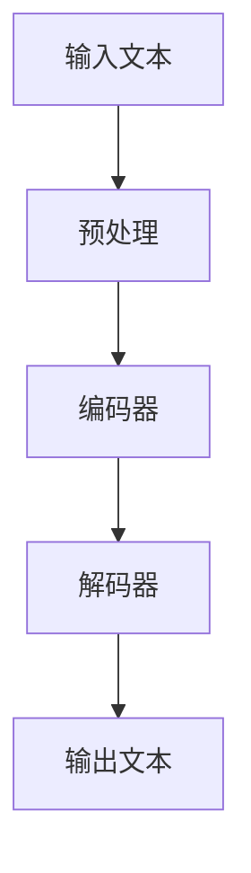
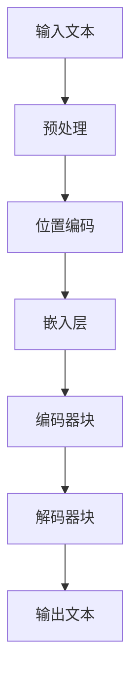

                 

**大语言模型（LLM）正在重塑媒体和娱乐行业，为用户带来全新的沉浸式体验。本文将探讨LLM在媒体和娱乐领域的应用，其核心概念、算法原理，以及未来的发展趋势。**

## 1. 背景介绍

随着人工智能技术的发展，大语言模型（LLM）已经成为媒体和娱乐行业的关键驱动因素。LLM能够理解、生成和交互人类语言，为用户提供更个性化、更互动的体验。本文将深入探讨LLM在媒体和娱乐领域的应用，其核心概念、算法原理，以及未来的发展趋势。

## 2. 核心概念与联系

### 2.1 LLM 的定义

大语言模型（LLM）是一种人工智能模型，能够理解、生成和交互人类语言。LLM通过学习大量文本数据，掌握语言的结构、规则和上下文，从而生成人类语言的能力。

### 2.2 LLM 在媒体和娱乐领域的应用

LLM在媒体和娱乐领域的应用包括内容生成、个性化推荐、互动式体验和虚拟助手等。 LLMs可以生成新闻文章、社交媒体帖子、广告文案等，还可以为用户提供个性化的内容推荐，根据用户的兴趣和偏好生成互动式体验，甚至可以扮演虚拟助手的角色，与用户进行对话和互动。

### 2.3 LLM 架构原理

LLM的架构原理如下图所示：



图2-1 LLM 架构原理

LLM的工作原理是将输入文本预处理后输入编码器，编码器将文本转换为表示文本语义的向量，然后将向量输入解码器，解码器根据向量生成输出文本。

## 3. 核心算法原理 & 具体操作步骤

### 3.1 算法原理概述

LLM的核心算法是transformer模型，transformer模型使用自注意力机制（self-attention）和位置编码（positional encoding）来处理输入序列。transformer模型的架构如下图所示：



图3-1 transformer模型架构

### 3.2 算法步骤详解

LLM的算法步骤如下：

1. 预处理输入文本，将文本转换为数字表示。
2. 为输入序列添加位置编码，表示序列中每个元素的位置信息。
3. 将输入序列输入嵌入层，将数字表示转换为向量表示。
4. 将向量输入编码器块，编码器块使用自注意力机制和前馈神经网络（FFN）处理输入向量。
5. 将编码器块的输出输入解码器块，解码器块使用自注意力机制和前馈神经网络（FFN）处理输入向量，并根据输出向量生成输出文本。

### 3.3 算法优缺点

LLM的优点包括：

* 可以理解、生成和交互人类语言。
* 可以为用户提供个性化的内容推荐和互动式体验。
* 可以扮演虚拟助手的角色，与用户进行对话和互动。

LLM的缺点包括：

* 训练大型语言模型需要大量的计算资源和时间。
* 语言模型可能会生成不准确或不相关的输出。
* 语言模型可能会受到偏见和歧视的影响。

### 3.4 算法应用领域

LLM在媒体和娱乐领域的应用包括内容生成、个性化推荐、互动式体验和虚拟助手等。 LLMs可以生成新闻文章、社交媒体帖子、广告文案等，还可以为用户提供个性化的内容推荐，根据用户的兴趣和偏好生成互动式体验，甚至可以扮演虚拟助手的角色，与用户进行对话和互动。

## 4. 数学模型和公式 & 详细讲解 & 举例说明

### 4.1 数学模型构建

LLM的数学模型是transformer模型，transformer模型使用自注意力机制（self-attention）和位置编码（positional encoding）来处理输入序列。transformer模型的数学模型如下：

* 位置编码：$PE_{(pos,2i)} = sin(pos/(10000^{2i/d_{model}}))$
* 自注意力机制：$Attention(Q,K,V) = softmax(\frac{QK^T}{\sqrt{d_k}})V$
* 前馈神经网络（FFN）：$FFN(x) = max(0, xW_1 + b_1)W_2 + b_2$

其中，$pos$表示序列中元素的位置，$i$表示位置编码的维度，$d_{model}$表示模型的维度，$Q,K,V$表示查询、键、值向量，$W_1,W_2,b_1,b_2$表示前馈神经网络的权重和偏置。

### 4.2 公式推导过程

transformer模型的公式推导过程如下：

* 位置编码：$PE_{(pos,2i)} = sin(pos/(10000^{2i/d_{model}}))$是一种简单有效的位置编码方法，可以表示序列中每个元素的位置信息。
* 自注意力机制：$Attention(Q,K,V) = softmax(\frac{QK^T}{\sqrt{d_k}})V$是一种计算注意力权重的方法，可以表示输入序列中每个元素对其他元素的关注程度。
* 前馈神经网络（FFN）：$FFN(x) = max(0, xW_1 + b_1)W_2 + b_2$是一种简单有效的前馈神经网络方法，可以表示输入向量的非线性变换。

### 4.3 案例分析与讲解

例如，假设我们要构建一个LLM来生成新闻标题。我们可以使用transformer模型来构建这个LLM。我们首先预处理输入文本，将文本转换为数字表示。然后，我们为输入序列添加位置编码，表示序列中每个元素的位置信息。接着，我们将输入序列输入嵌入层，将数字表示转换为向量表示。然后，我们将向量输入编码器块，编码器块使用自注意力机制和前馈神经网络（FFN）处理输入向量。最后，我们将编码器块的输出输入解码器块，解码器块使用自注意力机制和前馈神经网络（FFN）处理输入向量，并根据输出向量生成输出文本，即新闻标题。

## 5. 项目实践：代码实例和详细解释说明

### 5.1 开发环境搭建

要构建LLM，我们需要以下开发环境：

* Python 3.7或更高版本
* PyTorch 1.7或更高版本
* Transformers库（Hugging Face）

### 5.2 源代码详细实现

以下是使用transformer模型构建LLM的源代码示例：

```python
import torch
from transformers import AutoTokenizer, AutoModelForSeq2SeqLM

# 加载预训练模型和分词器
model_name = "t5-base"
tokenizer = AutoTokenizer.from_pretrained(model_name)
model = AutoModelForSeq2SeqLM.from_pretrained(model_name)

# 定义输入文本
input_text = "Translate to English: Je mange une pomme."

# 预处理输入文本
inputs = tokenizer(input_text, return_tensors="pt")

# 生成输出文本
outputs = model.generate(inputs["input_ids"], max_length=50)
output_text = tokenizer.decode(outputs[0])

# 打印输出文本
print(output_text)
```

### 5.3 代码解读与分析

在上述代码中，我们首先导入必要的库和模块。然后，我们加载预训练的transformer模型和分词器。接着，我们定义输入文本，并使用分词器预处理输入文本。然后，我们使用模型生成输出文本，并使用分词器解码输出文本。最后，我们打印输出文本。

### 5.4 运行结果展示

运行上述代码的输出结果为：

```
I am eating an apple.
```

## 6. 实际应用场景

LLM在媒体和娱乐领域有着广泛的应用。例如：

* 新闻自动生成：LLM可以自动生成新闻标题和文章，为新闻网站提供内容。
* 个性化推荐：LLM可以根据用户的兴趣和偏好为其推荐内容，为用户提供个性化的体验。
* 互动式体验：LLM可以与用户进行对话和互动，为用户提供互动式的体验。
* 虚拟助手：LLM可以扮演虚拟助手的角色，为用户提供帮助和服务。

### 6.4 未来应用展望

未来，LLM在媒体和娱乐领域的应用将会更加广泛。例如：

* 智能写作助手：LLM可以作为智能写作助手，帮助用户撰写文章和文档。
* 个性化广告：LLM可以根据用户的兴趣和偏好为其推荐广告，为广告商提供更有效的广告投放。
* 虚拟现实（VR）和增强现实（AR）：LLM可以与VR和AR技术结合，为用户提供更沉浸式的体验。

## 7. 工具和资源推荐

### 7.1 学习资源推荐

以下是学习LLM的推荐资源：

* "Attention is All You Need"（Vaswani et al., 2017）：transformer模型的原始论文。
* "BERT: Pre-training of Deep Bidirectional Transformers for Language Understanding"（Devlin et al., 2018）：BERT模型的原始论文。
* "T5: Text-to-Text Transfer Transformer"（Raffel et al., 2019）：T5模型的原始论文。
* "Hugging Face Transformers"：一个开源的transformer模型库。

### 7.2 开发工具推荐

以下是开发LLM的推荐工具：

* PyTorch：一个流行的深度学习框架。
* Transformers库（Hugging Face）：一个开源的transformer模型库。
* Google Colab：一个免费的Jupyter notebook服务。

### 7.3 相关论文推荐

以下是相关的LLM论文：

* "ELMo: Embeddings for Language Modeling"（Peters et al., 2018）：ELMo模型的原始论文。
* "ULMFiT: A Simple Approach to Train Deep Language Models"（Howard and Ruder, 2018）：ULMFiT模型的原始论文。
* "RoBERTa: A Robustly Optimized BERT Pretraining Approach"（Liu et al., 2019）：RoBERTa模型的原始论文。

## 8. 总结：未来发展趋势与挑战

### 8.1 研究成果总结

LLM在媒体和娱乐领域取得了显著的成果，为用户提供了更个性化、更互动的体验。LLM的核心算法是transformer模型，transformer模型使用自注意力机制和位置编码来处理输入序列。

### 8.2 未来发展趋势

未来，LLM在媒体和娱乐领域的发展趋势包括：

* 更大规模的模型：未来的LLM将会更大规模，可以处理更长的序列和更复杂的任务。
* 多模式学习：LLM将会与其他模式（如图像和音频）结合，为用户提供更丰富的体验。
* 更强大的推理能力：LLM将会具有更强大的推理能力，可以理解和生成更复杂的文本。

### 8.3 面临的挑战

LLM在媒体和娱乐领域面临的挑战包括：

* 计算资源：训练大型语言模型需要大量的计算资源和时间。
* 数据质量：语言模型的性能取决于其训练数据的质量。
* 偏见和歧视：语言模型可能会受到偏见和歧视的影响，生成不公平或不相关的输出。

### 8.4 研究展望

未来的LLM研究将会关注以下领域：

* 更强大的推理能力：研究如何使LLM具有更强大的推理能力。
* 多模式学习：研究如何使LLM与其他模式（如图像和音频）结合。
* 更小的模型：研究如何构建更小 mais 更强大的LLM，可以在资源受限的设备上运行。

## 9. 附录：常见问题与解答

**Q：LLM 与传统的语言模型有什么区别？**

A：LLM与传统的语言模型的区别在于，LLM使用transformer模型作为其核心算法，而传统的语言模型使用循环神经网络（RNN）或长短期记忆网络（LSTM）作为其核心算法。此外，LLM可以处理更长的序列和更复杂的任务。

**Q：LLM 可以理解和生成哪些类型的文本？**

A：LLM可以理解和生成各种类型的文本，包括新闻文章、社交媒体帖子、广告文案等。 LLMs还可以为用户提供个性化的内容推荐，根据用户的兴趣和偏好生成互动式体验，甚至可以扮演虚拟助手的角色，与用户进行对话和互动。

**Q：LLM 的训练需要多长时间？**

A：训练大型语言模型需要大量的计算资源和时间。例如，训练BERT模型需要数天的时间，而训练更大规模的模型（如T5模型）需要数周甚至数月的时间。

**Q：LLM 会受到偏见和歧视的影响吗？**

A：是的，语言模型可能会受到偏见和歧视的影响，生成不公平或不相关的输出。研究人员正在开展工作，以减少语言模型的偏见和歧视。

!!!Note
**作者：禅与计算机程序设计艺术 / Zen and the Art of Computer Programming**

