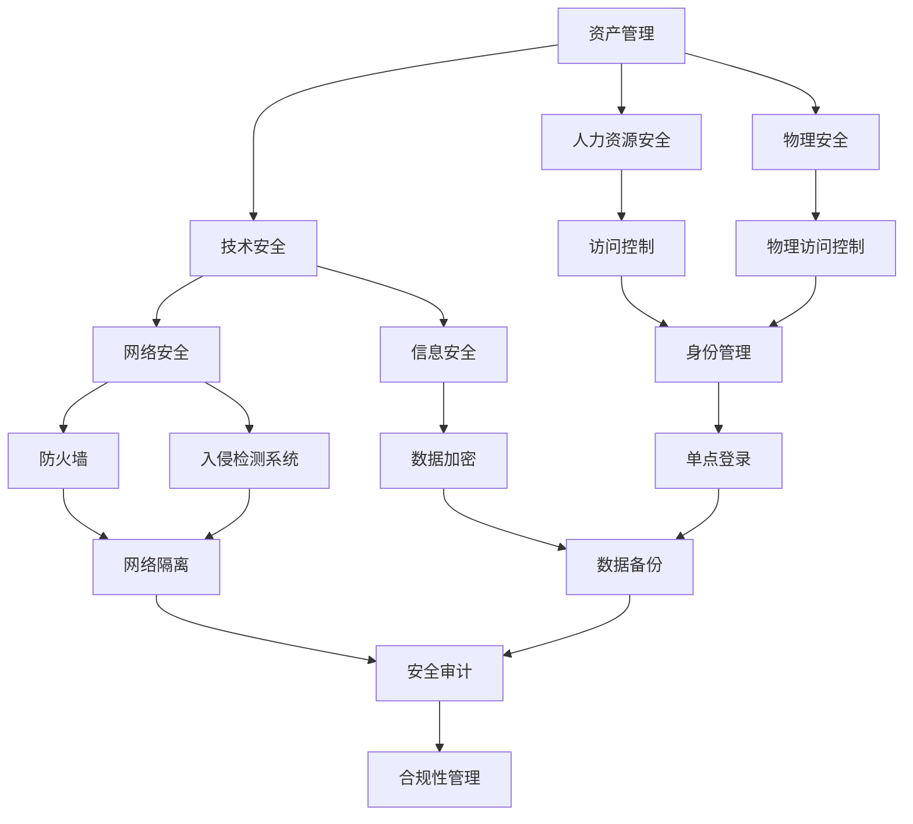

                 

**安全管理：确保workplace安全和合规**

## 1. 背景介绍

在当今数字化的世界里，企业面临着前所未有的安全挑战。随着远程工作的增多和网络攻击的日益复杂，确保workplace安全和合规变得至关重要。本文将深入探讨安全管理的关键概念、算法原理、数学模型，并提供实际的项目实践和工具推荐，帮助读者理解和应对当前的安全挑战。

## 2. 核心概念与联系

### 2.1 安全管理的定义

安全管理是指保护组织资源免受未授权访问、使用、披露、破坏或拒绝服务的各项活动。它包括识别、评估、控制和监控安全风险的过程。

### 2.2 安全管理的关键要素

安全管理的关键要素包括：

- **资产管理**：识别和管理组织的关键资产。
- **人力资源安全**：管理员工的安全行为和访问权限。
- **物理安全**：保护组织的物理设施和资产。
- **技术安全**：保护组织的技术基础设施和数据。
- **合规性**：确保组织遵循相关法律法规和标准。

### 2.3 安全管理架构

安全管理架构是指组织为实施安全管理而建立的结构。以下是一个简单的安全管理架构示例：



## 3. 核心算法原理 & 具体操作步骤

### 3.1 算法原理概述

安全管理的核心算法原理包括风险评估、访问控制和异常检测。以下将详细介绍风险评估算法。

### 3.2 风险评估算法步骤

风险评估算法的步骤如下：

1. **识别风险**：识别组织面临的安全风险。
2. **评估风险**：评估风险的严重性和可能性。
3. **控制风险**：实施控制措施降低风险。
4. **监控风险**：监控风险的变化并更新控制措施。

### 3.3 算法优缺点

风险评估算法的优点包括：

- 有助于组织识别和管理安全风险。
- 提供了一个结构化的过程来评估和控制风险。
- 有助于组织做出明智的安全投资决策。

缺点包括：

- 需要大量的时间和资源。
- 结果的准确性取决于输入数据的质量。
- 无法预测未知的风险。

### 3.4 算法应用领域

风险评估算法广泛应用于各个行业，包括金融、医疗、政府和零售等。它帮助组织识别和管理安全风险，确保组织的安全和合规。

## 4. 数学模型和公式 & 详细讲解 & 举例说明

### 4.1 数学模型构建

风险评估的数学模型可以表示为：

$$R = (A \times P) - C$$

其中：

- $R$ 是风险，
- $A$ 是资产的价值，
- $P$ 是风险发生的可能性，
- $C$ 是控制措施的成本。

### 4.2 公式推导过程

风险评估的公式推导过程如下：

1. 识别资产的价值，$A$。
2. 评估风险发生的可能性，$P$。
3. 确定控制措施的成本，$C$。
4. 计算风险，$R = (A \times P) - C$。

### 4.3 案例分析与讲解

假设一家银行想要评估其在线 banking系统的风险。该系统的价值为$A = 1,000,000$美元，风险发生的可能性为$P = 0.05$，控制措施的成本为$C = 100,000$美元。则风险评估结果为：

$$R = (1,000,000 \times 0.05) - 100,000 = 40,000$$

这意味着，如果不实施任何控制措施，该系统面临的风险为4万美元。

## 5. 项目实践：代码实例和详细解释说明

### 5.1 开发环境搭建

本项目使用Python作为编程语言，并使用Jupyter Notebook作为开发环境。

### 5.2 源代码详细实现

以下是风险评估算法的Python实现：

```python
def risk_evaluation(asset_value, probability, control_cost):
    risk = (asset_value * probability) - control_cost
    return risk

# 示例用法
asset_value = 1000000  # 资产价值为100万美元
probability = 0.05  # 风险发生可能性为5%
control_cost = 100000  # 控制措施成本为1万美元

risk = risk_evaluation(asset_value, probability, control_cost)
print(f"Risk: ${risk:.2f}")
```

### 5.3 代码解读与分析

该代码定义了一个名为`risk_evaluation`的函数，该函数接受资产价值、风险发生可能性和控制措施成本作为输入，并返回风险评估结果。示例用法演示了如何使用该函数评估风险。

### 5.4 运行结果展示

运行示例用法的输出为：

```
Risk: $40000.00
```

这与手动计算的结果一致。

## 6. 实际应用场景

### 6.1 安全管理在企业中的应用

安全管理在企业中的应用包括：

- **风险管理**：识别和管理安全风险。
- **合规性管理**：确保组织遵循相关法律法规和标准。
- **灾难恢复**：制定和实施灾难恢复计划。
- **安全培训**：培训员工安全意识和最佳实践。

### 6.2 安全管理在政府中的应用

安全管理在政府中的应用包括：

- **信息安全**：保护政府数据免受未授权访问和泄露。
- **网络安全**：保护政府网络免受攻击。
- **物理安全**：保护政府设施和资产。
- **灾难管理**：制定和实施灾难管理计划。

### 6.3 安全管理在医疗中的应用

安全管理在医疗中的应用包括：

- **信息安全**：保护患者数据免受未授权访问和泄露。
- **网络安全**：保护医疗设备免受攻击。
- **物理安全**：保护医疗设施和资产。
- **生物安全**：防止生物恐怖主义和传染病传播。

### 6.4 未来应用展望

未来安全管理的应用将更加依赖于人工智能和机器学习技术。这些技术将帮助组织更好地识别和管理安全风险，并实时监控和响应安全威胁。

## 7. 工具和资源推荐

### 7.1 学习资源推荐

- **书籍**：
  - "信息安全与管理"（Information Security Management: A Manager's Guide）
  - "网络安全：原理与实践"（Network Security: Principles and Practice）
- **在线课程**：
  - Coursera上的"信息安全管理"课程
  - Udemy上的"网络安全"课程

### 7.2 开发工具推荐

- **风险评估工具**：Risk Register、Risk Doctor、RiskyProject
- **访问控制工具**：Active Directory、Okta、OneLogin
- **入侵检测系统**：Snort、Suricata、Bro

### 7.3 相关论文推荐

- "信息安全管理：挑战和解决方案"（Information Security Management: Challenges and Solutions）
- "网络安全：挑战和解决方案"（Network Security: Challenges and Solutions）
- "人工智能在信息安全管理中的应用"（The Application of Artificial Intelligence in Information Security Management）

## 8. 总结：未来发展趋势与挑战

### 8.1 研究成果总结

本文介绍了安全管理的关键概念、算法原理、数学模型，并提供了实际的项目实践和工具推荐。我们还讨论了安全管理在企业、政府和医疗中的应用，并展望了未来的发展趋势。

### 8.2 未来发展趋势

未来安全管理的发展趋势包括：

- **人工智能和机器学习的应用**：这些技术将帮助组织更好地识别和管理安全风险。
- **云安全**：随着云计算的普及，云安全将变得越来越重要。
- **物联网安全**：物联网设备的安全将成为关注的焦点。

### 8.3 面临的挑战

安全管理面临的挑战包括：

- **资金限制**：安全管理需要大量的时间和资源。
- **技术变化**：安全管理必须跟上技术的发展步伐。
- **人才短缺**：安全管理领域缺乏合格的专业人才。

### 8.4 研究展望

未来的研究将关注人工智能和机器学习在安全管理中的应用，云安全和物联网安全等领域。

## 9. 附录：常见问题与解答

**Q1：什么是安全管理？**

A1：安全管理是指保护组织资源免受未授权访问、使用、披露、破坏或拒绝服务的各项活动。

**Q2：安全管理的关键要素是什么？**

A2：安全管理的关键要素包括资产管理、人力资源安全、物理安全、技术安全和合规性。

**Q3：如何进行风险评估？**

A3：风险评估的步骤包括识别风险、评估风险、控制风险和监控风险。

**Q4：什么是风险评估的数学模型？**

A4：风险评估的数学模型为$R = (A \times P) - C$，其中$R$是风险，$A$是资产的价值，$P$是风险发生的可能性，$C$是控制措施的成本。

**Q5：安全管理在哪些领域有应用？**

A5：安全管理在企业、政府和医疗等领域有广泛的应用。

**Q6：未来安全管理的发展趋势是什么？**

A6：未来安全管理的发展趋势包括人工智能和机器学习的应用、云安全和物联网安全等领域。

---

作者：禅与计算机程序设计艺术 / Zen and the Art of Computer Programming

