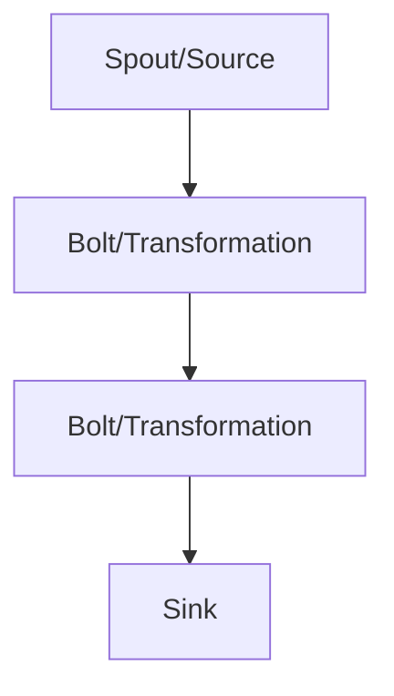

                 

## 1. 背景介绍

随着大数据时代的到来，实时处理海量数据已成为各行各业的关键需求。传统的批处理系统已无法满足实时性要求，因此，实时流处理系统应运而生。Apache Storm和Apache Flink是两款流行的实时流处理框架，本文将深入探讨这两款框架的核心概念、算法原理、数学模型，并提供项目实践和实际应用场景。

## 2. 核心概念与联系

### 2.1 Apache Storm

Apache Storm是一个分布式实时计算系统，用于处理无限数据流。它提供了类似Hadoop MapReduce的简单编程模型，但具有更高的吞吐量和更低的延迟。Storm支持各种应用程序，如实时分析、机器学习和数据库支持。

**Storm的核心组件**

- **Spout**：数据源，将数据推送到Storm集群。
- **Bolt**：处理单元，接收Spout发送的数据，执行计算任务，并将结果发送给下游Bolt或存储系统。
- **Topology**：Spout和Bolt的组合，定义了数据流向和处理逻辑。

### 2.2 Apache Flink

Apache Flink是一个分布式流处理框架，提供了有状态流处理和批处理的统一模型。Flink支持事件时间和处理时间，提供了丰富的窗口函数和聚合函数。Flink的设计目标是提供低延迟、高吞吐量和高可用性。

**Flink的核心组件**

- **Source**：数据源，将数据推送到Flink集群。
- **Transformation**：处理单元，接收Source发送的数据，执行计算任务，并将结果发送给下游Transformation或Sink。
- **Sink**：结果存储单元，接收Transformation发送的结果，并将其存储到外部系统。

### 2.3 Mermaid流程图

以下是Storm和Flink的核心组件流程图：



## 3. 核心算法原理 & 具体操作步骤

### 3.1 算法原理概述

Storm和Flink都是基于流式处理的框架，它们接收无限数据流，对其进行处理，并生成结果。两者的核心算法原理都是基于数据流的处理，但它们的实现细节和特性有所不同。

### 3.2 算法步骤详解

#### Storm算法步骤

1. 定义Spout，从数据源读取数据并发送到下游Bolt。
2. 定义Bolt，接收Spout发送的数据，执行计算任务，并将结果发送给下游Bolt或存储系统。
3. 定义Topology，组合Spout和Bolt，定义数据流向和处理逻辑。
4. 部署Topology到Storm集群，执行数据处理任务。

#### Flink算法步骤

1. 定义Source，从数据源读取数据并发送到下游Transformation。
2. 定义Transformation，接收Source发送的数据，执行计算任务，并将结果发送给下游Transformation或Sink。
3. 定义Sink，接收Transformation发送的结果，并将其存储到外部系统。
4. 部署数据处理任务到Flink集群，执行数据处理任务。

### 3.3 算法优缺点

**Storm优缺点**

- 优点：简单易用，高吞吐量，低延迟，支持各种应用程序。
- 缺点：不支持有状态流处理，不支持事件时间和处理时间，不支持窗口函数和聚合函数。

**Flink优缺点**

- 优点：支持有状态流处理，支持事件时间和处理时间，提供丰富的窗口函数和聚合函数，低延迟，高吞吐量，高可用性。
- 缺点：相对复杂，学习曲线较陡。

### 3.4 算法应用领域

Storm和Flink都可以应用于各种实时流处理场景，如实时分析、机器学习、数据库支持、物联网数据处理等。两者的选择取决于具体的应用需求和场景。

## 4. 数学模型和公式 & 详细讲解 & 举例说明

### 4.1 数学模型构建

 Storm和Flink都是基于数据流的处理，因此，它们的数学模型都是基于流的数学模型。流的数学模型描述了数据流的特性，如流速、流量、流量变化率等。

### 4.2 公式推导过程

假设数据流的流量为$Q(t)$，流速为$V(t)$，则数据流的吞吐量为$T(t) = Q(t) \cdot V(t)$。流量变化率为$R(t) = \frac{dQ(t)}{dt}$，流速变化率为$S(t) = \frac{dV(t)}{dt}$。

### 4.3 案例分析与讲解

例如，在实时流处理应用中，我们需要处理来自多个数据源的数据流。假设数据源1的流量为$Q_1(t)$，流速为$V_1(t)$；数据源2的流量为$Q_2(t)$，流速为$V_2(t)$；则总的流量为$Q(t) = Q_1(t) + Q_2(t)$，总的流速为$V(t) = \frac{Q_1(t) \cdot V_1(t) + Q_2(t) \cdot V_2(t)}{Q_1(t) + Q_2(t)}$。

## 5. 项目实践：代码实例和详细解释说明

### 5.1 开发环境搭建

 Storm和Flink都需要Java开发环境，建议使用Maven进行项目管理。 Storm和Flink的官方网站提供了详细的安装指南。

### 5.2 源代码详细实现

以下是一个简单的Storm和Flink项目实例，实现了单词计数功能。

**Storm实现**

```java
public class WordCount extends BaseRichBolt {
    private Map<String, Integer> counts = new HashMap<>();

    @Override
    public void execute(Tuple input, BasicOutputCollector collector) {
        String word = input.getStringByField("word");
        counts.put(word, counts.getOrDefault(word, 0) + 1);
        collector.emit(new Values(word, counts.get(word)));
    }
}
```

**Flink实现**

```java
public class WordCount extends RichFlatMapFunction<Word, Tuple2<String, Integer>> {
    private Map<String, Integer> counts = new HashMap<>();

    @Override
    public void flatMap(Word value, Collector<Tuple2<String, Integer>> out) throws Exception {
        counts.put(value.getWord(), counts.getOrDefault(value.getWord(), 0) + 1);
        out.collect(new Tuple2<>(value.getWord(), counts.get(value.getWord())));
    }
}
```

### 5.3 代码解读与分析

在Storm实现中，我们定义了一个Bolt，接收Spout发送的单词，并对其进行计数。在Flink实现中，我们定义了一个FlatMapFunction，接收Source发送的单词，并对其进行计数。

### 5.4 运行结果展示

运行Storm和Flink项目后，我们可以在控制台或日志文件中看到单词计数结果。

## 6. 实际应用场景

### 6.1 Storm应用场景

Storm可以应用于各种实时流处理场景，如实时分析、机器学习、数据库支持等。例如，Twitter使用Storm处理实时推文数据，进行实时分析和推荐。

### 6.2 Flink应用场景

Flink可以应用于各种实时流处理场景，如实时分析、机器学习、数据库支持、物联网数据处理等。例如，Alibaba使用Flink处理实时交易数据，进行实时分析和推荐。

### 6.3 未来应用展望

随着大数据时代的到来，实时流处理将成为各行各业的关键需求。 Storm和Flink等实时流处理框架将在未来的应用中发挥越来越重要的作用。

## 7. 工具和资源推荐

### 7.1 学习资源推荐

- Storm官方文档：<https://storm.apache.org/documentation.html>
- Flink官方文档：<https://flink.apache.org/documentation.html>
- Storm和Flink的在线课程：<https://www.coursera.org/learn/apache-storm-and-flink>

### 7.2 开发工具推荐

- IntelliJ IDEA：<https://www.jetbrains.com/idea/>
- Eclipse：<https://www.eclipse.org/>

### 7.3 相关论文推荐

- "Storm: High-throughput distributed realtime computation"：<https://www.usenix.org/system/files/login/articles/login_summer13_06_storm.pdf>
- "Flink: Stream processing in action"：<https://www.vldb.org/pvldb/vol8/p1793-zaharia.pdf>

## 8. 总结：未来发展趋势与挑战

### 8.1 研究成果总结

本文介绍了Storm和Flink两款流行的实时流处理框架，详细讲解了它们的核心概念、算法原理、数学模型，并提供了项目实践和实际应用场景。

### 8.2 未来发展趋势

实时流处理将成为未来大数据处理的关键趋势，Storm和Flink等框架将在未来的应用中发挥越来越重要的作用。此外，边缘计算、5G网络等技术的发展也将推动实时流处理的发展。

### 8.3 面临的挑战

实时流处理面临的挑战包括数据处理的实时性、可靠性、可扩展性等。此外，如何处理海量数据、如何保证数据一致性等问题也需要进一步研究。

### 8.4 研究展望

未来的研究方向包括实时流处理的可靠性、一致性、可扩展性等，以及如何处理海量数据、如何保证数据质量等问题。此外，如何将实时流处理与人工智能、区块链等技术结合，也是未来研究的方向。

## 9. 附录：常见问题与解答

**Q：Storm和Flink有什么区别？**

A：Storm和Flink都是实时流处理框架，但它们的设计目标、特性和实现细节有所不同。Storm侧重于简单易用、高吞吐量和低延迟，而Flink侧重于支持有状态流处理、事件时间和处理时间、窗口函数和聚合函数等。

**Q：如何选择Storm或Flink？**

A：选择Storm或Flink取决于具体的应用需求和场景。如果应用需要简单易用、高吞吐量和低延迟，则可以选择Storm。如果应用需要支持有状态流处理、事件时间和处理时间、窗口函数和聚合函数等，则可以选择Flink。

**Q：Storm和Flink的未来发展趋势是什么？**

A：实时流处理将成为未来大数据处理的关键趋势，Storm和Flink等框架将在未来的应用中发挥越来越重要的作用。此外，边缘计算、5G网络等技术的发展也将推动实时流处理的发展。

!!!Note
作者：禅与计算机程序设计艺术 / Zen and the Art of Computer Programming

