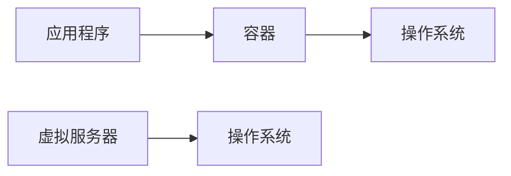

                 

## 1. 背景介绍

在当今的软件开发领域，微服务架构已然成为一种主流的设计理念。微服务允许我们将应用程序分解为一组小型、松散耦合的服务，每个服务都可以单独部署和扩展。然而，微服务架构也带来了新的挑战，其中之一就是如何简化微服务的部署和扩展。容器化是一种有效的解决方案，它可以帮助我们轻松地部署和扩展微服务。

## 2. 核心概念与联系

### 2.1 容器化的概念

容器化是一种将应用程序及其依赖项打包到容器中的方法。容器是一个轻量级的、可移植的、标准化的单元，它封装了应用程序及其运行环境。容器化允许我们在任何地方、任何时候运行应用程序，无需考虑底层基础设施的差异。

### 2.2 容器化与虚拟化的区别

虚拟化是一种将物理服务器分隔成多个虚拟服务器的技术。每个虚拟服务器都有自己的操作系统和资源。相比之下，容器化则是将应用程序及其依赖项打包到一个单一的、轻量级的容器中，容器共享底层操作系统。



### 2.3 容器化与微服务的联系

容器化是微服务架构的关键组成部分。每个微服务都可以打包到一个单独的容器中，从而实现松散耦合和独立部署。容器化还允许我们轻松地扩展微服务，只需创建更多的容器实例即可。

## 3. 核心算法原理 & 具体操作步骤

### 3.1 算法原理概述

容器化的核心原理是使用容器运行时（如Docker）将应用程序及其依赖项打包到容器中。容器运行时负责创建和管理容器，并为容器提供运行环境。

### 3.2 算法步骤详解

1. **创建Dockerfile**：Dockerfile是一个文本文件，它包含了构建容器镜像所需的所有指令。我们需要在Dockerfile中指定应用程序的基础镜像、安装依赖项和配置应用程序。
2. **构建容器镜像**：使用Dockerfile构建容器镜像。镜像是一个只读的模板，它包含了应用程序及其依赖项。我们可以使用`docker build`命令构建镜像。
3. **运行容器**：使用镜像创建容器实例。我们可以使用`docker run`命令运行容器，并指定容器的配置和端口映射。
4. **扩展容器**：如果需要扩展应用程序，我们可以创建更多的容器实例。这可以通过使用`docker scale`命令来实现。

### 3.3 算法优缺点

**优点**：

* 容器化允许我们轻松地部署和扩展应用程序。
* 容器化提供了应用程序及其依赖项的完整环境，从而消除了部署时的兼容性问题。
* 容器化允许我们在任何地方、任何时候运行应用程序，无需考虑底层基础设施的差异。

**缺点**：

* 容器化需要额外的学习曲线和设置时间。
* 容器化可能会导致性能开销，因为每个容器都需要额外的资源来运行容器运行时。

### 3.4 算法应用领域

容器化适用于任何需要轻松部署和扩展的应用程序。它特别适合于微服务架构，因为它允许我们将应用程序分解为小型、松散耦合的服务，每个服务都可以单独部署和扩展。

## 4. 数学模型和公式 & 详细讲解 & 举例说明

### 4.1 数学模型构建

容器化的数学模型可以表示为以下公式：

$$C = f(A, D, R)$$

其中：

* $C$ 是容器，
* $A$ 是应用程序，
* $D$ 是应用程序的依赖项，
* $R$ 是容器运行时。

### 4.2 公式推导过程

容器化的过程可以分为两个步骤：

1. **打包应用程序**：将应用程序及其依赖项打包到一个单一的单元中。这个单元可以是一个tar文件或一个Docker镜像。
2. **创建容器**：使用容器运行时创建容器实例。容器运行时负责提供运行环境和管理容器。

### 4.3 案例分析与讲解

假设我们有一个简单的Web应用程序，它需要Python和Nginx来运行。我们可以使用Dockerfile来构建容器镜像，如下所示：

```Dockerfile
# 使用Python镜像作为基础镜像
FROM python:3.8-slim-buster

# 更新包索引并安装Nginx
RUN apt-get update && apt-get install -y nginx

# 复制应用程序代码到容器中
COPY. /app

# 切换到应用程序目录
WORKDIR /app

# 安装应用程序的依赖项
RUN pip install -r requirements.txt

# 设置Nginx配置文件
COPY nginx.conf /etc/nginx/nginx.conf

# 设置默认的命令为Nginx
CMD ["nginx", "-g", "daemon off;"]
```

## 5. 项目实践：代码实例和详细解释说明

### 5.1 开发环境搭建

要开始容器化，我们需要安装Docker。我们可以从[Docker官方网站](https://www.docker.com/)下载并安装Docker。

### 5.2 源代码详细实现

我们将使用之前的Dockerfile来构建容器镜像。首先，我们需要创建一个名为`Dockerfile`的文件，并粘贴之前的Dockerfile内容。然后，我们可以使用以下命令构建镜像：

```bash
docker build -t my-web-app.
```

### 5.3 代码解读与分析

在Dockerfile中，我们首先使用Python镜像作为基础镜像。然后，我们更新包索引并安装Nginx。接下来，我们复制应用程序代码到容器中，并切换到应用程序目录。我们安装应用程序的依赖项，并设置Nginx配置文件。最后，我们设置默认的命令为Nginx。

### 5.4 运行结果展示

一旦镜像构建完成，我们可以使用以下命令运行容器：

```bash
docker run -p 80:80 my-web-app
```

这将启动一个容器实例，并将容器的80端口映射到主机的80端口。我们可以在浏览器中输入`http://localhost`来访问应用程序。

## 6. 实际应用场景

### 6.1 容器化的优势

容器化允许我们轻松地部署和扩展应用程序。它还提供了应用程序及其依赖项的完整环境，从而消除了部署时的兼容性问题。此外，容器化允许我们在任何地方、任何时候运行应用程序，无需考虑底层基础设施的差异。

### 6.2 容器化的挑战

容器化需要额外的学习曲线和设置时间。此外，容器化可能会导致性能开销，因为每个容器都需要额外的资源来运行容器运行时。

### 6.3 容器化的未来

容器化是当今软件开发领域的一个关键趋势。随着云原生计算的兴起，容器化将变得越来越重要。我们可以期待看到更多的工具和框架被开发出来，以简化容器化的过程。

## 7. 工具和资源推荐

### 7.1 学习资源推荐

* [Docker官方文档](https://docs.docker.com/)
* [Docker入门教程](https://www.runoob.com/docker/docker-tutorial.html)
* [Docker中文网](https://www.docker.org.cn/)

### 7.2 开发工具推荐

* [Docker Compose](https://docs.docker.com/compose/)：用于定义和运行多容器Docker应用程序的工具。
* [Kubernetes](https://kubernetes.io/)：用于自动化容器化应用程序的开源平台。

### 7.3 相关论文推荐

* [Docker: A Containerization Platform for Developers and Sysadmins](https://arxiv.org/abs/1309.4893)
* [Kubernetes: An Open-Source Platform for Automating Deployment, Scaling, and Operations of Application Containers](https://arxiv.org/abs/1512.00565)

## 8. 总结：未来发展趋势与挑战

### 8.1 研究成果总结

容器化是一种有效的解决方案，它可以帮助我们轻松地部署和扩展微服务。容器化允许我们将应用程序及其依赖项打包到容器中，从而提供了应用程序及其依赖项的完整环境。容器化还允许我们在任何地方、任何时候运行应用程序，无需考虑底层基础设施的差异。

### 8.2 未来发展趋势

容器化是当今软件开发领域的一个关键趋势。随着云原生计算的兴起，容器化将变得越来越重要。我们可以期待看到更多的工具和框架被开发出来，以简化容器化的过程。

### 8.3 面临的挑战

容器化需要额外的学习曲线和设置时间。此外，容器化可能会导致性能开销，因为每个容器都需要额外的资源来运行容器运行时。

### 8.4 研究展望

未来的研究将关注如何进一步简化容器化的过程，并降低容器化的性能开销。我们还将看到更多的工具和框架被开发出来，以帮助我们管理和部署容器化的应用程序。

## 9. 附录：常见问题与解答

**Q：容器化与虚拟化有什么区别？**

**A：虚拟化是一种将物理服务器分隔成多个虚拟服务器的技术。每个虚拟服务器都有自己的操作系统和资源。相比之下，容器化则是将应用程序及其依赖项打包到一个单一的、轻量级的容器中，容器共享底层操作系统。**

**Q：容器化适用于哪些应用程序？**

**A：容器化适用于任何需要轻松部署和扩展的应用程序。它特别适合于微服务架构，因为它允许我们将应用程序分解为小型、松散耦合的服务，每个服务都可以单独部署和扩展。**

**Q：容器化的优缺点是什么？**

**A：容器化的优点包括轻松地部署和扩展应用程序，提供应用程序及其依赖项的完整环境，以及在任何地方、任何时候运行应用程序。容器化的缺点包括需要额外的学习曲线和设置时间，以及可能会导致性能开销。**

!!!Note
作者：禅与计算机程序设计艺术 / Zen and the Art of Computer Programming

