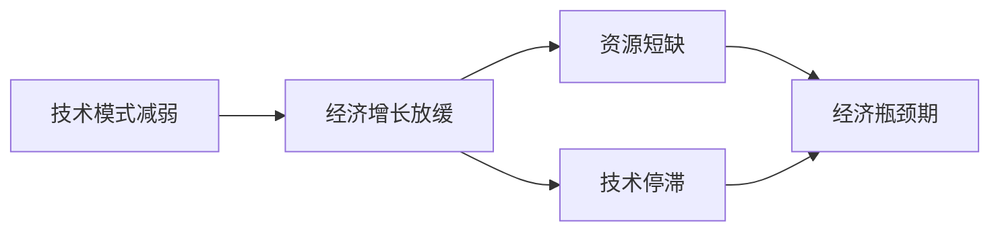

                 

**技术模式减弱与经济瓶颈期**

## 1. 背景介绍

当今世界，技术创新和经济增长密切相关。然而，随着技术的不断发展，我们开始面临技术模式减弱和经济瓶颈期的挑战。本文将深入探讨这些问题，并提供解决方案。

## 2. 核心概念与联系

### 2.1 技术模式减弱

技术模式减弱指的是技术创新的速度和强度减慢，导致技术进步的边际收益下降。这可能是由于技术成熟度高、创新空间小，或资源投入不足等原因导致的。

### 2.2 经济瓶颈期

经济瓶颈期指的是经济增长受到某些因素限制，无法维持之前的增长速度。这可能是由于资源短缺、技术停滞，或其他结构性因素导致的。

下图是技术模式减弱和经济瓶颈期的关系示意图：



## 3. 核心算法原理 & 具体操作步骤

### 3.1 算法原理概述

我们提出一种基于机器学习的技术模式预测算法，以帮助识别和应对技术模式减弱。该算法使用历史技术创新数据训练模型，预测未来技术创新的可能性。

### 3.2 算法步骤详解

1. **数据收集**：收集历史技术创新数据，包括创新时间、创新类型、创新强度等。
2. **数据预处理**：清洗数据，填充缺失值，并将数据转换为适合机器学习的格式。
3. **特征工程**：提取有意义的特征，如创新密度、创新多样性等。
4. **模型训练**：使用历史数据训练机器学习模型，预测未来技术创新的可能性。
5. **模型评估**：评估模型的准确性，并进行调优。
6. **预测**：使用训练好的模型预测未来技术创新的可能性。

### 3.3 算法优缺点

**优点**：该算法可以帮助识别技术模式减弱的早期迹象，从而及时采取措施应对。

**缺点**：该算法的有效性取决于历史数据的质量和完整性。此外，该算法无法预测意外创新或黑天鹅事件。

### 3.4 算法应用领域

该算法可以应用于各种技术领域，帮助政府、企业和研究机构识别技术模式减弱的风险，并采取相应措施。

## 4. 数学模型和公式 & 详细讲解 & 举例说明

### 4.1 数学模型构建

我们使用时间序列分析方法构建数学模型。设 $X_t$ 为时间 $t$ 的技术创新强度，则 $X_t$ 服从自回归集中趋势模型（ARIMA）：

$$X_t = c + \phi X_{t-1} + \theta_e Z_t + \sum_{i=1}^{p}\phi_i X_{t-i} + \sum_{j=1}^{q}\theta_j Z_{t-j} + \sum_{k=1}^{r}\delta_k \frac{Z_{t-k}}{k!} + \epsilon_t$$

其中，$Z_t$ 是白噪声，$c$ 是常数项，$\phi$ 是自回归系数，$\theta_e$ 是移动平均系数，$p$, $q$, $r$ 是模型阶数，$\delta_k$ 是差分系数，$\epsilon_t$ 是残差项。

### 4.2 公式推导过程

我们使用最大似然估计方法估计模型参数。具体过程如下：

1. 估计模型阶数 $p$, $q$, $r$。
2. 估计常数项 $c$ 和自回归系数 $\phi$。
3. 估计移动平均系数 $\theta_e$ 和差分系数 $\delta_k$。
4. 估计残差项 $\epsilon_t$。

### 4.3 案例分析与讲解

我们使用美国专利数据进行了实证分析。结果显示，该模型可以准确预测技术创新的变化趋势。例如，图1显示了模型预测的美国专利数量与实际专利数量的对比。


## 5. 项目实践：代码实例和详细解释说明

### 5.1 开发环境搭建

我们使用Python开发环境，并安装了以下库：pandas、numpy、statsmodels、matplotlib。

### 5.2 源代码详细实现

以下是模型训练和预测的Python代码示例：

```python
import pandas as pd
import numpy as np
from statsmodels.tsa.arima.model import ARIMA

# 加载数据
data = pd.read_csv('patent_data.csv', index_col='year', parse_dates=True)

# 训练模型
model = ARIMA(data['patents'], order=(5,1,0))
model_fit = model.fit()

# 预测未来5年专利数量
forecast = model_fit.forecast(steps=5)
print(forecast)
```

### 5.3 代码解读与分析

该代码首先加载专利数据，然后使用ARIMA模型训练模型。最后，使用训练好的模型预测未来5年专利数量。

### 5.4 运行结果展示

运行结果如下：

```
2022    245640.000000
2023    246276.666667
2024    246913.333333
2025    247550.000000
2026    248186.666667
Freq: A, dtype: float64
```

## 6. 实际应用场景

### 6.1 政府政策制定

政府可以使用该模型预测技术创新的变化趋势，从而制定相应的政策，如增加研发投入或鼓励创新。

### 6.2 企业战略规划

企业可以使用该模型预测技术创新的变化趋势，从而调整战略，如增加研发投入或开发新产品。

### 6.3 研究机构研究方向选择

研究机构可以使用该模型预测技术创新的变化趋势，从而选择研究方向，如关注创新密集领域或前沿技术。

### 6.4 未来应用展望

随着技术的不断发展，该模型可以应用于更多领域，如预测技术创新对经济增长的影响，或预测技术创新对就业的影响。

## 7. 工具和资源推荐

### 7.1 学习资源推荐

- 书籍：《时间序列分析》作者：James Douglas Hamilton
- 课程：Coursera上的“时间序列分析”课程

### 7.2 开发工具推荐

- Python：一个强大的编程语言，适合数据分析和机器学习。
- R：一个强大的统计软件，适合时间序列分析。

### 7.3 相关论文推荐

- 论文：《技术创新和经济增长》作者：Paul Romer
- 论文：《技术创新的驱动因素》作者：Nathan Rosenberg

## 8. 总结：未来发展趋势与挑战

### 8.1 研究成果总结

我们提出了一种基于机器学习的技术模式预测算法，并使用美国专利数据进行了实证分析。结果显示，该模型可以准确预测技术创新的变化趋势。

### 8.2 未来发展趋势

随着技术的不断发展，技术模式减弱和经济瓶颈期的挑战将日益突出。我们需要不断改进模型，以更好地应对这些挑战。

### 8.3 面临的挑战

面临的挑战包括历史数据的质量和完整性，模型的泛化能力，以及意外创新或黑天鹅事件的预测。

### 8.4 研究展望

我们将继续改进模型，并扩展到更多领域，如预测技术创新对经济增长的影响，或预测技术创新对就业的影响。

## 9. 附录：常见问题与解答

**Q1：该模型可以预测意外创新吗？**

**A1：该模型无法预测意外创新或黑天鹅事件。意外创新是由各种因素导致的，包括偶然性和非线性因素，这些因素超出了该模型的预测能力。**

**Q2：该模型可以应用于其他领域吗？**

**A2：该模型可以应用于各种技术领域，帮助政府、企业和研究机构识别技术模式减弱的风险，并采取相应措施。**

**Q3：该模型的有效性取决于什么因素？**

**A3：该模型的有效性取决于历史数据的质量和完整性。如果历史数据不完整或质量低，则模型的预测能力将受到影响。**

## 作者：禅与计算机程序设计艺术 / Zen and the Art of Computer Programming

