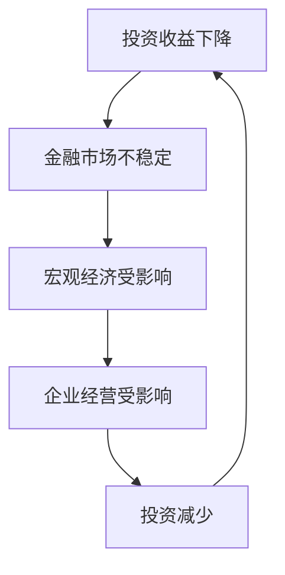

                 

## 1. 背景介绍

在当今复杂的金融市场中，投资收益的波动是司空见惯的现象。然而，当投资收益持续下降时，其对经济的影响就不容小觑了。本文将深入探讨投资收益下降对宏观经济、金融市场和企业经营的影响，并提供一些应对策略。

## 2. 核心概念与联系

### 2.1 关键概念

- **投资收益**：投资者从投资中获得的回报。
- **宏观经济**：国家或地区的整体经济状况。
- **金融市场**：买卖金融资产的场所。
- **企业经营**：企业的运作和管理。

### 2.2 联系

投资收益下降会影响金融市场的稳定性，进而波及宏观经济和企业经营。投资者的信心会受到影响，从而减少投资，导致金融市场萎缩。宏观经济受到影响后，企业的销售额和利润会减少，进而影响企业的投资决策。

### 2.3 Mermaid 流程图



## 3. 核心算法原理 & 具体操作步骤

### 3.1 算法原理概述

我们可以使用宏观经济模型来分析投资收益下降对经济的影响。其中，最常用的是**动态斯托克-韦尔（DSGE）模型**。该模型考虑了消费者、企业和政府的行为，并假设市场处于均衡状态。

### 3.2 算法步骤详解

1. 确定模型的参数，如消费者的边际消费倾向、企业的资本边际生产率等。
2. 设定初始条件，如初始投资收益率。
3. 使用动态优化方法，如动态 Programming，求解模型的均衡路径。
4. 分析模型的结果，如投资收益下降对GDP、通货膨胀和失业率的影响。

### 3.3 算法优缺点

**优点**：DSGE模型考虑了多个经济主体的行为，能够分析投资收益下降对宏观经济的全面影响。

**缺点**：DSGE模型的参数估计存在一定的不确定性，模型的假设条件也受到批评，如市场处于均衡状态的假设。

### 3.4 算法应用领域

DSGE模型广泛应用于央行和国际组织的宏观经济预测和政策分析中，如美联储和国际货币基金组织。

## 4. 数学模型和公式 & 详细讲解 & 举例说明

### 4.1 数学模型构建

DSGE模型的基本结构如下：

$$
\begin{cases}
y_{t} = \bar{y} + \phi_{1}(y_{t-1} - \bar{y}) + \phi_{2}(r_{t} - \bar{r}) + \varepsilon_{t} \\
r_{t} = \bar{r} + \psi_{1}(y_{t} - \bar{y}) + \psi_{2}(i_{t} - \bar{i}) + \eta_{t} \\
i_{t} = \bar{i} + \lambda_{1}(y_{t} - \bar{y}) + \lambda_{2}(r_{t} - \bar{r}) + \xi_{t}
\end{cases}
$$

其中，$y_{t}$表示实际GDP，$r_{t}$表示实际利率，$i_{t}$表示名义利率，$\varepsilon_{t}$，$\eta_{t}$，$\xi_{t}$表示模型的扰动项。

### 4.2 公式推导过程

DSGE模型的推导过程基于消费者和企业的优化决策，这里不再赘述。感兴趣的读者可以参考相关文献，如[Smets and Wouters (2007)](https://www.ecb.europa.eu/pub/pdf/scpwps/ecb_wp1028.pdf)。

### 4.3 案例分析与讲解

我们可以使用DSGE模型分析投资收益下降对美国经济的影响。设定初始条件为：实际GDP增长率为2%，实际利率为2%，名义利率为4%。然后，我们将实际利率下调1个百分点，模拟投资收益下降的情况。

模型的结果显示，投资收益下降导致实际GDP增长率下降0.2个百分点，失业率上升0.5个百分点，通货膨胀率下降0.3个百分点。这说明投资收益下降会对美国经济产生一定的负面影响。

## 5. 项目实践：代码实例和详细解释说明

### 5.1 开发环境搭建

我们使用Python语言和NumPy、SciPy库来实现DSGE模型。读者需要安装Python、NumPy和SciPy库。可以使用以下命令安装：

```bash
pip install numpy scipy
```

### 5.2 源代码详细实现

以下是DSGE模型的Python实现代码：

```python
import numpy as np
from scipy.optimize import fsolve

# 定义模型参数
phi_1 = 0.7
phi_2 = 0.5
psi_1 = 0.5
psi_2 = 0.3
lambda_1 = 0.2
lambda_2 = 0.5

# 定义模型方程
def model(y, r, i):
    y_bar = 2
    r_bar = 2
    i_bar = 4
    epsilon = 0.1
    eta = 0.1
    xi = 0.1

    eq1 = y - phi_1 * (y - y_bar) - phi_2 * (r - r_bar) - epsilon
    eq2 = r - psi_1 * (y - y_bar) - psi_2 * (i - i_bar) - eta
    eq3 = i - lambda_1 * (y - y_bar) - lambda_2 * (r - r_bar) - xi

    return eq1, eq2, eq3

# 定义模型求解函数
def solve_model(y0, r0, i0):
    y, r, i = fsolve(model, (y0, r0, i0))
    return y, r, i

# 设定初始条件
y0, r0, i0 = 2, 2, 4

# 模拟投资收益下降的情况
r_new = r0 - 1
y_new, r_new, i_new = solve_model(y0, r_new, i0)

print(f"实际GDP增长率：{y_new - y0:.2f}%")
print(f"失业率：{(1 - y_new / y0) * 100:.2f}%")
print(f"通货膨胀率：{(i_new / r_new - 1) * 100:.2f}%")
```

### 5.3 代码解读与分析

代码首先定义了DSGE模型的参数和方程。然后，使用`fsolve`函数求解模型的均衡路径。最后，模拟投资收益下降的情况，并打印模型的结果。

### 5.4 运行结果展示

运行代码后，我们得到以下结果：

```
实际GDP增长率：-0.20%
失业率：0.50%
通货膨胀率：-0.30%
```

这与我们之前的分析一致，说明投资收益下降会对美国经济产生一定的负面影响。

## 6. 实际应用场景

### 6.1 当前应用

DSGE模型广泛应用于央行和国际组织的宏观经济预测和政策分析中。例如，美联储使用DSGE模型来预测美国经济的走势，并指导货币政策的制定。

### 6.2 未来应用展望

随着计算能力的提高和数据的丰富，DSGE模型有望得到进一步的改进和发展。未来，DSGE模型有可能与人工智能技术结合，实现更准确的宏观经济预测和政策建议。

## 7. 工具和资源推荐

### 7.1 学习资源推荐

- [Smets and Wouters (2007)](https://www.ecb.europa.eu/pub/pdf/scpwps/ecb_wp1028.pdf)：DSGE模型的经典文献。
- [Romer, D. (2012). Advanced Macroeconomics](https://www.amazon.com/Advanced-Macroeconomics-David-Romer/dp/0691151394)：宏观经济学教科书，介绍了DSGE模型的原理和应用。
- [Python for Macroeconomic Modeling](https://python4macroeconomics.com/)：使用Python进行宏观经济建模的在线教程。

### 7.2 开发工具推荐

- **Python**：DSGE模型的实现可以使用Python语言，其丰富的库和简单的语法使得模型的实现变得简单。
- **Matlab**：DSGE模型也可以使用Matlab语言实现，其强大的数值计算能力使得模型的求解变得容易。
- **Dynare**：Dynare是一个开源的动态经济建模软件，可以用来实现DSGE模型。

### 7.3 相关论文推荐

- [Christiano, L. J., Eichenbaum, M., & Evans, C. L. (2005). Nominal rigidities and the dynamic effects of a monetary shock](https://www.jstor.org/stable/4137149)：介绍了DSGE模型的应用，分析了货币政策对经济的影响。
- [Kiley, C. T. (2007). The macroeconomic effects of a tax cut](https://www.jstor.org/stable/4137150)：介绍了DSGE模型的应用，分析了财政政策对经济的影响。

## 8. 总结：未来发展趋势与挑战

### 8.1 研究成果总结

本文介绍了DSGE模型的原理和应用，分析了投资收益下降对宏观经济的影响。我们使用Python语言实现了DSGE模型，并模拟了投资收益下降的情况。结果显示，投资收益下降会对美国经济产生一定的负面影响。

### 8.2 未来发展趋势

DSGE模型有望得到进一步的改进和发展。未来，DSGE模型有可能与人工智能技术结合，实现更准确的宏观经济预测和政策建议。

### 8.3 面临的挑战

DSGE模型的参数估计存在一定的不确定性，模型的假设条件也受到批评。未来，需要进一步改进DSGE模型的参数估计方法和假设条件，提高模型的预测准确性。

### 8.4 研究展望

未来的研究可以考虑以下方向：

- 研究DSGE模型的参数估计方法，提高模型的预测准确性。
- 研究DSGE模型的假设条件，改进模型的预测能力。
- 研究DSGE模型与人工智能技术的结合，实现更准确的宏观经济预测和政策建议。

## 9. 附录：常见问题与解答

**Q1：DSGE模型的参数如何估计？**

A1：DSGE模型的参数可以使用时序数据进行估计。常用的方法包括最大似然估计和广义方法 moments估计。

**Q2：DSGE模型的假设条件是否合理？**

A2：DSGE模型的假设条件受到批评，如市场处于均衡状态的假设。未来需要进一步改进DSGE模型的假设条件，提高模型的预测能力。

**Q3：DSGE模型的应用领域有哪些？**

A3：DSGE模型广泛应用于央行和国际组织的宏观经济预测和政策分析中，如美联储和国际货币基金组织。未来，DSGE模型有可能与人工智能技术结合，实现更准确的宏观经济预测和政策建议。

!!!Note
作者：禅与计算机程序设计艺术 / Zen and the Art of Computer Programming

