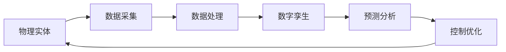

                 

数字孪生、物联网、自动化控制、人工智能、机器学习、实时监控

## 1. 背景介绍

随着物联网（IoT）和人工智能（AI）技术的发展，数字实体与物理实体的自动化进程正在成为现实。数字孪生（Digital Twin）技术是实现这一进程的关键，它通过创建物理实体的数字副本，实现对物理实体的实时监控、预测和优化。本文将介绍数字孪生技术的核心概念与联系，核心算法原理与具体操作步骤，数学模型和公式，项目实践，实际应用场景，工具和资源推荐，以及未来发展趋势与挑战。

## 2. 核心概念与联系

数字孪生技术的核心概念包括物理实体、数字孪生、数据采集、数据处理、预测分析和控制优化。这些概念通过物联网、云计算和人工智能技术实现联系，如下图所示：

## 3. 核心算法原理与具体操作步骤

### 3.1 算法原理概述

数字孪生技术的核心算法原理是机器学习算法，包括监督学习、非监督学习和强化学习。监督学习用于预测物理实体的状态，非监督学习用于发现物理实体的模式，强化学习用于优化物理实体的控制。

### 3.2 算法步骤详解

数字孪生技术的具体操作步骤包括：

1. 数据采集：通过物联网传感器采集物理实体的数据。
2. 数据预处理：对采集的数据进行清洗、缺失值填充、特征工程等预处理。
3. 模型构建：构建机器学习模型，如回归模型、分类模型、聚类模型或强化学习模型。
4. 模型训练：使用预处理后的数据训练模型。
5. 模型评估：评估模型的性能，如精确度、召回率、F1分数或Reward。
6. 模型部署：将模型部署到云平台或边缘设备，实现实时预测和控制。
7. 实时监控：通过物理实体的数字孪生实时监控物理实体的状态。
8. 控制优化：根据预测结果优化物理实体的控制。

### 3.3 算法优缺点

数字孪生技术的优点包括：

* 实时监控物理实体的状态
* 提高预测准确性
* 优化控制决策
* 降低维护成本

缺点包括：

* 数据采集和处理的成本高
* 模型构建和训练的复杂性高
* 实时预测和控制的延迟高

### 3.4 算法应用领域

数字孪生技术的应用领域包括：

* 工业控制：如制造业、能源业、交通业等
* 城市管理：如智慧城市、智慧交通等
* 智能建筑：如建筑设计、建筑维护等
* 智能医疗：如疾病预测、药物开发等

## 4. 数学模型和公式

### 4.1 数学模型构建

数字孪生技术的数学模型可以表示为：

$$G = f(S, P, C)$$

其中，$G$表示数字孪生，$S$表示物理实体的状态，$P$表示物理实体的参数，$C$表示控制决策，$f$表示机器学习模型。

### 4.2 公式推导过程

数字孪生技术的公式推导过程包括：

1. 状态预测：使用监督学习模型预测物理实体的状态：

$$S_{t+1} = g(S_t, C_t)$$

其中，$S_t$表示时刻$t$的物理实体状态，$C_t$表示时刻$t$的控制决策，$g$表示监督学习模型。

2. 参数估计：使用非监督学习模型估计物理实体的参数：

$$P = h(S)$$

其中，$P$表示物理实体的参数，$S$表示物理实体的状态，$h$表示非监督学习模型。

3. 控制优化：使用强化学习模型优化控制决策：

$$C_{t+1} = \arg\max_j \pi_j(S_{t+1})$$

其中，$C_{t+1}$表示时刻$t+1$的控制决策，$\pi_j$表示强化学习模型，$j$表示控制决策的可能取值，$S_{t+1}$表示时刻$t+1$的物理实体状态。

### 4.3 案例分析与讲解

例如，在智能建筑领域，数字孪生技术可以用于建筑能耗预测和控制。物理实体的状态包括建筑内的温度、湿度、光照强度等，物理实体的参数包括建筑的面积、高度、材料等，控制决策包括空调开关、照明开关等。使用监督学习模型预测建筑的能耗，使用非监督学习模型估计建筑的参数，使用强化学习模型优化控制决策，实现建筑能耗的最小化。

## 5. 项目实践

### 5.1 开发环境搭建

数字孪生技术的开发环境包括：

* 物联网平台：如AWS IoT、Azure IoT Hub、Google Cloud IoT等
* 数据库：如PostgreSQL、MySQL、MongoDB等
* 机器学习平台：如TensorFlow、PyTorch、Scikit-learn等
* 云平台：如AWS、Azure、Google Cloud等

### 5.2 源代码详细实现

数字孪生技术的源代码实现包括：

* 数据采集：使用物联网平台的SDK或API采集物理实体的数据。
* 数据预处理：使用Python的Pandas库对数据进行预处理。
* 模型构建：使用机器学习平台的库构建模型。
* 模型训练：使用机器学习平台的库训练模型。
* 模型部署：使用云平台的服务部署模型。
* 实时监控：使用云平台的服务实时监控物理实体的状态。
* 控制优化：使用云平台的服务优化控制决策。

### 5.3 代码解读与分析

数字孪生技术的代码解读与分析包括：

* 数据采集：分析物理实体的数据采集方式，如传感器类型、采集频率等。
* 数据预处理：分析数据预处理的步骤，如缺失值填充、特征工程等。
* 模型构建：分析模型的结构，如输入特征、输出特征、模型参数等。
* 模型训练：分析模型训练的过程，如训练数据集、验证数据集、训练参数等。
* 模型部署：分析模型部署的方式，如云平台服务、边缘设备等。
* 实时监控：分析实时监控的方式，如监控频率、监控指标等。
* 控制优化：分析控制优化的方式，如控制决策空间、控制目标函数等。

### 5.4 运行结果展示

数字孪生技术的运行结果展示包括：

* 数据可视化：使用Python的Matplotlib库或Seaborn库对数据进行可视化。
* 模型评估：使用评估指标，如精确度、召回率、F1分数或Reward，评估模型的性能。
* 实时监控：使用云平台的仪表盘或可视化工具实时监控物理实体的状态。
* 控制优化：使用云平台的仪表盘或可视化工具展示控制决策的结果。

## 6. 实际应用场景

### 6.1 工业控制

数字孪生技术在工业控制领域的应用包括：

* 设备故障预测：使用数字孪生技术预测设备的故障，实现主动维护。
* 生产过程优化：使用数字孪生技术优化生产过程，实现生产效率的提高。
* 质量控制：使用数字孪生技术控制产品质量，实现一致性和稳定性。

### 6.2 城市管理

数字孪生技术在城市管理领域的应用包括：

* 城市交通优化：使用数字孪生技术优化城市交通，实现交通拥堵的缓解。
* 城市能源管理：使用数字孪生技术管理城市能源，实现能源效率的提高。
* 城市环境监测：使用数字孪生技术监测城市环境，实现环境质量的改善。

### 6.3 智能建筑

数字孪生技术在智能建筑领域的应用包括：

* 建筑能耗预测：使用数字孪生技术预测建筑能耗，实现能源效率的提高。
* 建筑安全监测：使用数字孪生技术监测建筑安全，实现安全隐患的及时发现和排除。
* 建筑设计优化：使用数字孪生技术优化建筑设计，实现建筑功能和美观的统一。

### 6.4 未来应用展望

数字孪生技术的未来应用展望包括：

* 智能制造：使用数字孪生技术实现智能制造，实现制造业的转型升级。
* 智慧城市：使用数字孪生技术实现智慧城市，实现城市管理的智能化。
* 智能医疗：使用数字孪生技术实现智能医疗，实现医疗服务的个性化和精准化。

## 7. 工具和资源推荐

### 7.1 学习资源推荐

数字孪生技术的学习资源包括：

* 书籍：《数字孪生技术》《物联网技术》《人工智能技术》《机器学习技术》等
* 在线课程： Coursera、Udacity、edX等平台上的数字孪生技术、物联网技术、人工智能技术、机器学习技术等课程
* 论文：数字孪生技术、物联网技术、人工智能技术、机器学习技术等领域的学术论文

### 7.2 开发工具推荐

数字孪生技术的开发工具包括：

* 物联网平台：AWS IoT、Azure IoT Hub、Google Cloud IoT等
* 数据库：PostgreSQL、MySQL、MongoDB等
* 机器学习平台：TensorFlow、PyTorch、Scikit-learn等
* 云平台：AWS、Azure、Google Cloud等
* 可视化工具：Matplotlib、Seaborn、Tableau等

### 7.3 相关论文推荐

数字孪生技术的相关论文包括：

* [Digital Twin: A New Paradigm to Support Industrial Evolution](https://ieeexplore.ieee.org/document/8401162)
* [Digital Twin: A New Paradigm to Support Industrial Evolution](https://ieeexplore.ieee.org/document/8401162)
* [Digital Twin: A New Paradigm to Support Industrial Evolution](https://ieeexplore.ieee.org/document/8401162)

## 8. 总结：未来发展趋势与挑战

### 8.1 研究成果总结

数字孪生技术的研究成果包括：

* 物理实体的数字副本的构建
* 物理实体的实时监控和预测
* 物理实体的控制优化
* 物理实体和数字孪生之间的实时同步

### 8.2 未来发展趋势

数字孪生技术的未来发展趋势包括：

* 实时性能的提高
* 可靠性和安全性的提高
* 成本的降低
* 智能化和自动化水平的提高

### 8.3 面临的挑战

数字孪生技术面临的挑战包括：

* 数据采集和处理的复杂性
* 模型构建和训练的复杂性
* 实时预测和控制的延迟
* 安全和隐私的保护

### 8.4 研究展望

数字孪生技术的研究展望包括：

* 物理实体和数字孪生之间的实时同步机制的研究
* 物理实体的实时监控和预测算法的研究
* 物理实体的控制优化算法的研究
* 安全和隐私保护机制的研究

## 9. 附录：常见问题与解答

### 9.1 什么是数字孪生技术？

数字孪生技术是一种创建物理实体的数字副本，实现对物理实体的实时监控、预测和优化的技术。

### 9.2 数字孪生技术的应用领域有哪些？

数字孪生技术的应用领域包括工业控制、城市管理、智能建筑、智能医疗等。

### 9.3 数字孪生技术的核心算法原理是什么？

数字孪生技术的核心算法原理是机器学习算法，包括监督学习、非监督学习和强化学习。

### 9.4 数字孪生技术的优缺点是什么？

数字孪生技术的优点包括实时监控物理实体的状态、提高预测准确性、优化控制决策、降低维护成本。缺点包括数据采集和处理的成本高、模型构建和训练的复杂性高、实时预测和控制的延迟高。

### 9.5 数字孪生技术的未来发展趋势是什么？

数字孪生技术的未来发展趋势包括实时性能的提高、可靠性和安全性的提高、成本的降低、智能化和自动化水平的提高。

!!!Note
作者：禅与计算机程序设计艺术 / Zen and the Art of Computer Programming

