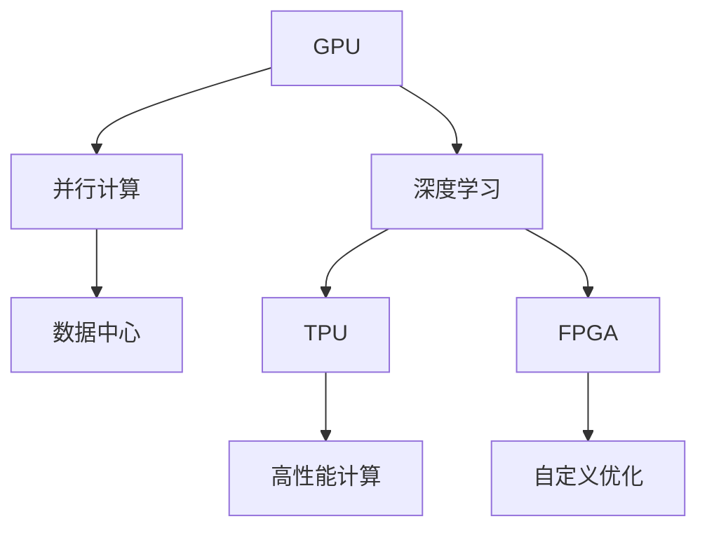

                 

# 深入计算机底层：理解AI硬件加速

## 1. 背景介绍

随着人工智能技术的快速发展，AI硬件加速已经成为实现高效AI计算的重要手段。AI硬件加速包括GPU、TPU、FPGA等加速器，通过对模型进行优化，大大提升了AI模型的训练和推理速度，满足了人工智能在各行业的应用需求。本文将深入探讨AI硬件加速的基本原理、核心算法以及具体实现，帮助读者全面理解这一领域的技术细节。

## 2. 核心概念与联系

### 2.1 核心概念概述

为了更好地理解AI硬件加速，我们先来定义一些核心概念：

- GPU（Graphics Processing Unit）：图形处理单元，通过并行计算加速图像和科学计算等任务。GPU以其强大的并行计算能力著称，可以高效地执行大规模矩阵运算。
- TPU（Tensor Processing Unit）：张量处理单元，专为深度学习模型设计，具备优化的硬件电路和专用指令集，能够加速神经网络运算。
- FPGA（Field Programmable Gate Array）：现场可编程门阵列，通过编程实现灵活的逻辑电路，支持AI模型在硬件上的优化和定制。
- 深度学习：一种基于神经网络的机器学习方法，用于图像识别、语音识别、自然语言处理等任务。深度学习模型的核心是多层神经网络，通过反向传播算法进行训练。
- 并行计算：将大任务分解为多个子任务，通过多个计算单元并行处理，加速计算速度。
- 流水线计算：通过将任务分解为不同阶段，每个阶段由独立的计算单元处理，实现高效计算。
- 数据中心：由大量服务器和网络设备组成的数据处理中心，用于大规模数据存储、处理和计算。

这些核心概念之间的逻辑关系可以通过以下Mermaid流程图来展示：



这个流程图展示了一些基本概念及其之间的联系：

1. GPU通过并行计算加速深度学习模型。
2. TPU是专门为深度学习设计的加速器，进一步提升模型计算效率。
3. FPGA通过编程实现灵活逻辑，支持深度学习模型的硬件加速和优化。
4. 数据中心提供了大规模计算资源，支持深度学习模型的训练和推理。

这些概念共同构成了AI硬件加速的基础框架，帮助我们理解硬件加速对AI模型的影响。

## 3. 核心算法原理 & 具体操作步骤
### 3.1 算法原理概述

AI硬件加速的核心在于通过硬件优化，提升深度学习模型的计算效率。具体的优化策略包括：

1. 并行计算：利用GPU和TPU的并行处理能力，将深度学习模型中的大规模矩阵运算并行化。
2. 流水线计算：将深度学习模型的计算过程分解为多个阶段，每个阶段由独立的计算单元处理，加速整体计算。
3. 自定义优化：通过FPGA等可编程硬件，对深度学习模型进行硬件级的优化和定制。

这些优化策略通过硬件加速，显著提升了深度学习模型的训练和推理速度，满足了实际应用的需求。

### 3.2 算法步骤详解

AI硬件加速的具体实现步骤如下：

1. **选择合适的硬件加速器**：根据深度学习模型的特点和应用需求，选择合适的硬件加速器，如GPU、TPU或FPGA。
2. **模型优化**：对深度学习模型进行优化，包括数据预处理、模型结构调整和算法优化。
3. **编译与部署**：将优化后的模型编译为硬件可执行代码，部署到选定的硬件加速器上。
4. **训练与推理**：在数据中心或高性能计算集群中，使用硬件加速器进行模型的训练和推理。

### 3.3 算法优缺点

AI硬件加速的优点包括：

1. 计算效率高：通过并行计算和流水线计算，显著提升了深度学习模型的计算速度。
2. 资源利用率高：硬件加速器可以高效利用计算资源，减少能源消耗和设备成本。
3. 模型性能好：优化后的深度学习模型可以在硬件加速器上获得更好的性能和准确度。

同时，硬件加速也存在一些缺点：

1. 成本高：硬件加速器设备昂贵，需要较大的前期投资。
2. 开发复杂：硬件加速器的编程和优化需要一定的专业知识，开发难度较大。
3. 可扩展性差：不同的硬件加速器之间可能存在兼容性问题，系统扩展性较差。

### 3.4 算法应用领域

AI硬件加速在多个领域得到了广泛应用，包括：

1. 计算机视觉：图像识别、物体检测、人脸识别等任务，通过硬件加速可以显著提升计算速度。
2. 自然语言处理：文本分类、机器翻译、情感分析等任务，硬件加速可以加速模型的训练和推理。
3. 语音识别：语音识别和处理任务，通过硬件加速可以提升系统的响应速度和准确度。
4. 推荐系统：个性化推荐任务，硬件加速可以加速模型训练和推理，提升推荐效率。
5. 医疗影像：医学影像分析、疾病诊断等任务，硬件加速可以处理大规模医疗数据，提升诊断效率。

## 4. 数学模型和公式 & 详细讲解 & 举例说明
### 4.1 数学模型构建

AI硬件加速的核心是深度学习模型的优化，我们以卷积神经网络（CNN）为例，介绍数学模型的构建。

假设卷积神经网络包含多个卷积层和池化层，每层包含多个特征图，每张特征图的大小为$W \times H$。卷积操作可以表示为：

$$
\text{Conv}(x, w) = \sum_{i=1}^{W}\sum_{j=1}^{H}x(i, j)w(i, j)
$$

其中$x$表示特征图，$w$表示卷积核，$(i, j)$表示特征图和卷积核上的位置。

### 4.2 公式推导过程

卷积操作的并行计算可以通过矩阵乘法来实现。假设卷积核的大小为$k \times k$，则卷积操作可以表示为：

$$
Y_{i, j} = \sum_{i'=1}^{k}\sum_{j'=1}^{k}X_{i'+k-1, j'+k-1}W_{i', j'}
$$

其中$Y_{i, j}$表示输出特征图上的每个位置，$X$表示输入特征图，$W$表示卷积核。

通过将卷积操作转化为矩阵乘法，可以显著提升计算速度。此外，通过将卷积层和池化层结合，可以进一步优化模型的计算效率。

### 4.3 案例分析与讲解

以图像识别为例，深度学习模型需要对图像像素进行卷积运算，然后通过池化层进行特征提取。假设图像大小为$n \times n$，卷积核大小为$m \times m$，则卷积操作的计算量为：

$$
n^2 \times n^2 \times m^2
$$

通过使用GPU或TPU进行并行计算，可以将计算量显著降低。例如，在使用NVIDIA V100 GPU时，可以通过并行计算将计算量降低到：

$$
n^2 \times n^2 \times m^2 \times 1024
$$

其中1024表示GPU的计算能力。

## 5. 项目实践：代码实例和详细解释说明
### 5.1 开发环境搭建

在进行AI硬件加速的实践之前，我们需要准备好开发环境。以下是使用Python和TensorFlow进行GPU加速的开发环境配置流程：

1. 安装Anaconda：从官网下载并安装Anaconda，用于创建独立的Python环境。

2. 创建并激活虚拟环境：
```bash
conda create -n tf-env python=3.8 
conda activate tf-env
```

3. 安装TensorFlow：根据CUDA版本，从官网获取对应的安装命令。例如：
```bash
conda install tensorflow-gpu=2.6.0-cudatoolkit=11.1 -c pytorch -c conda-forge
```

4. 安装GPU驱动和CUDA：确保你的机器上有适合版本的GPU驱动和CUDA库，安装命令如下：
```bash
conda install --channel https://repo.anaconda.com/miniconda/linux-64 cudatoolkit=11.1
```

5. 安装NumPy和pandas：
```bash
conda install numpy pandas
```

完成上述步骤后，即可在`tf-env`环境中开始AI硬件加速的实践。

### 5.2 源代码详细实现

下面是使用TensorFlow和TensorBoard进行图像识别任务的GPU加速代码实现。

```python
import tensorflow as tf
from tensorflow import keras
import tensorflow_datasets as tfds
import tensorflow_hub as hub

# 加载图像数据集
train_dataset, test_dataset = tfds.load(name='mnist', split=['train', 'test'], with_info=True)

# 数据预处理
def preprocess_image(image, label):
    image = tf.image.convert_image_dtype(image, tf.float32)
    image = tf.image.resize(image, (28, 28))
    image /= 255.0
    label = tf.keras.utils.to_categorical(label, 10)
    return image, label

train_dataset = train_dataset.map(preprocess_image)
test_dataset = test_dataset.map(preprocess_image)

# 构建CNN模型
model = keras.Sequential([
    keras.layers.Conv2D(32, (3, 3), activation='relu', input_shape=(28, 28, 1)),
    keras.layers.MaxPooling2D((2, 2)),
    keras.layers.Conv2D(64, (3, 3), activation='relu'),
    keras.layers.MaxPooling2D((2, 2)),
    keras.layers.Flatten(),
    keras.layers.Dense(64, activation='relu'),
    keras.layers.Dense(10, activation='softmax')
])

# 编译模型
model.compile(optimizer='adam', loss='categorical_crossentropy', metrics=['accuracy'])

# 训练模型
history = model.fit(train_dataset, epochs=5, validation_data=test_dataset)

# 保存模型
model.save('mnist_model.h5')
```

### 5.3 代码解读与分析

让我们再详细解读一下关键代码的实现细节：

**数据预处理函数**：
- `preprocess_image`函数：将图像数据预处理为模型所需格式，包括图像归一化、标签编码等操作。

**模型定义**：
- 使用`keras.Sequential`定义一个简单的CNN模型，包含卷积层、池化层和全连接层。
- 在卷积层中，使用`Conv2D`定义卷积操作，指定卷积核大小和激活函数。

**模型编译**：
- 使用`model.compile`方法编译模型，指定优化器、损失函数和评估指标。

**模型训练**：
- 使用`model.fit`方法训练模型，指定训练集和验证集，设置训练轮数。

**模型保存**：
- 使用`model.save`方法保存训练好的模型，便于后续使用和部署。

这个代码实现展示了如何使用TensorFlow进行GPU加速的图像识别任务。可以看到，TensorFlow提供了简单易用的API，可以方便地定义和训练深度学习模型，并且支持在GPU上高效计算。

## 6. 实际应用场景
### 6.1 计算机视觉

AI硬件加速在计算机视觉领域得到了广泛应用。例如，在自动驾驶中，深度学习模型需要实时处理传感器数据，进行目标检测、车道线和交通标志识别等任务。通过使用GPU或TPU进行硬件加速，可以显著提升模型的计算速度和响应时间。

在安防监控中，深度学习模型需要对视频流进行实时处理，检测异常行为和事件。通过使用硬件加速，可以实现高精度和高实时性的安防监控系统。

### 6.2 自然语言处理

AI硬件加速在自然语言处理领域同样有重要应用。例如，在机器翻译中，深度学习模型需要处理大量的文本数据，进行词向量嵌入、编码解码等操作。通过使用GPU或TPU进行硬件加速，可以显著提升模型的训练和推理速度。

在情感分析中，深度学习模型需要处理大量的文本数据，进行情感分类。通过使用硬件加速，可以加速模型的训练和推理，提升情感分析的准确度。

### 6.3 推荐系统

AI硬件加速在推荐系统中也有广泛应用。例如，在电商推荐中，深度学习模型需要处理大量的用户数据和商品数据，进行个性化推荐。通过使用GPU或TPU进行硬件加速，可以加速模型的训练和推理，提升推荐系统的效率和效果。

在金融推荐中，深度学习模型需要处理大量的用户数据和金融产品数据，进行个性化推荐。通过使用硬件加速，可以加速模型的训练和推理，提升推荐系统的效率和效果。

## 7. 工具和资源推荐
### 7.1 学习资源推荐

为了帮助开发者掌握AI硬件加速的技术，这里推荐一些优质的学习资源：

1. **《深度学习基础》课程**：斯坦福大学提供的深度学习入门课程，涵盖深度学习的基本概念和常用算法。
2. **《TensorFlow实战》书籍**：TensorFlow官方指南，介绍了TensorFlow的基本用法和实际应用。
3. **《GPU计算基础》课程**：Coursera上的GPU计算课程，介绍了GPU的基础知识和计算模型。
4. **《深度学习优化技术》书籍**：深度学习优化技术指南，介绍了各种优化算法和优化技巧。
5. **《TensorFlow HLO调试指南》**：TensorFlow HLO调试指南，介绍了如何调试和优化TensorFlow模型的性能。

这些学习资源可以帮助开发者深入理解AI硬件加速的原理和实现方法，掌握相关技术。

### 7.2 开发工具推荐

高效的开发离不开优秀的工具支持。以下是几款用于AI硬件加速开发的常用工具：

1. **TensorFlow**：Google开发的深度学习框架，支持GPU和TPU等硬件加速，提供了丰富的API和工具。
2. **TensorBoard**：TensorFlow配套的可视化工具，可以实时监测模型训练和推理的状态。
3. **PyTorch**：Facebook开发的深度学习框架，支持GPU和TPU等硬件加速，提供了灵活的API和工具。
4. **PyTorch Lightning**：PyTorch的加速开发框架，提供了分布式训练、自动化调参等功能。
5. **NVIDIA DeepLearning SDK**：NVIDIA提供的深度学习SDK，支持GPU和TPU等硬件加速，提供了丰富的API和工具。

这些工具可以帮助开发者更方便地进行AI硬件加速的开发和优化。

### 7.3 相关论文推荐

AI硬件加速技术的不断发展离不开学术界的不断探索。以下是几篇奠基性的相关论文，推荐阅读：

1. **《深度学习加速器：GPU、TPU和FPGA》**：介绍了GPU、TPU和FPGA等加速器的基本原理和应用。
2. **《深度学习优化技术》**：介绍了深度学习模型的优化算法和技术，包括参数优化和模型优化。
3. **《GPU加速深度学习》**：介绍了GPU加速深度学习的具体实现方法和技术。
4. **《TPU加速深度学习》**：介绍了TPU加速深度学习的具体实现方法和技术。
5. **《FPGA加速深度学习》**：介绍了FPGA加速深度学习的具体实现方法和技术。

这些论文代表了大规模加速器的研究发展脉络，可以帮助开发者更好地理解AI硬件加速的原理和实现方法。

## 8. 总结：未来发展趋势与挑战
### 8.1 研究成果总结

AI硬件加速技术的发展主要集中在以下几个方面：

1. **硬件加速器的优化**：通过改进硬件电路和优化指令集，提升加速器的计算能力和能效比。
2. **深度学习算法的优化**：通过算法优化和模型精简，提升深度学习模型的计算效率和性能。
3. **系统架构的优化**：通过优化软件架构和硬件资源分配，提升系统的吞吐量和响应速度。

这些技术的发展推动了AI硬件加速在各领域的应用，满足了深度学习模型的计算需求。

### 8.2 未来发展趋势

展望未来，AI硬件加速技术将呈现以下几个发展趋势：

1. **硬件加速器的多样化**：未来的硬件加速器将更加多样化，包括通用加速器和专用加速器，满足不同应用场景的需求。
2. **软件架构的优化**：未来的软件架构将更加灵活，支持多种加速器混合部署，提升系统性能和可扩展性。
3. **模型和算法的优化**：未来的深度学习模型和算法将更加优化，支持更高的计算精度和效率。
4. **AI系统的智能化**：未来的AI系统将更加智能化，具备更强的自我学习能力和适应能力。

这些趋势将推动AI硬件加速技术向更加高效、灵活和智能的方向发展。

### 8.3 面临的挑战

尽管AI硬件加速技术已经取得了显著进展，但在实际应用中仍面临诸多挑战：

1. **硬件成本高**：硬件加速器的设备成本较高，限制了其广泛应用。
2. **开发复杂度高**：硬件加速器的编程和优化需要专业知识，增加了开发难度。
3. **兼容性问题**：不同的硬件加速器之间可能存在兼容性问题，限制了系统的扩展性。
4. **能效问题**：硬件加速器的能效问题仍需解决，降低能耗和维护成本。

### 8.4 研究展望

未来，需要在以下几个方面进行进一步研究：

1. **成本优化**：通过改进硬件设计和生产工艺，降低硬件加速器的成本。
2. **易用性提升**：开发更易用、更灵活的软件工具，降低开发难度。
3. **系统优化**：优化系统的软件架构和资源分配，提升系统的性能和可扩展性。
4. **智能算法**：开发更高效、更智能的深度学习算法，提升模型的计算效率和性能。

## 9. 附录：常见问题与解答

**Q1：AI硬件加速对深度学习模型的影响有哪些？**

A: AI硬件加速可以显著提升深度学习模型的计算效率和性能。通过并行计算、流水线计算和自定义优化，AI硬件加速器可以加速模型的训练和推理，缩短计算时间，降低能源消耗。

**Q2：如何选择合适的硬件加速器？**

A: 选择合适的硬件加速器需要考虑以下几个因素：
1. 模型的计算需求：选择计算能力足够的硬件加速器，满足模型的计算需求。
2. 成本和投资：考虑硬件加速器的购买和维护成本，选择性价比高的硬件加速器。
3. 兼容性和扩展性：选择兼容性好、扩展性强的硬件加速器，支持多种应用场景。

**Q3：AI硬件加速的开发难度大吗？**

A: AI硬件加速的开发难度较大，需要具备一定的专业知识。具体开发难度取决于以下几个因素：
1. 硬件加速器的选择：不同的硬件加速器有其特定的API和工具，开发难度不同。
2. 模型的优化：需要深入了解深度学习模型的优化方法，进行模型精简和算法优化。
3. 系统的集成：需要将硬件加速器和软件工具集成到系统中，进行系统优化和测试。

**Q4：AI硬件加速的资源消耗大吗？**

A: 虽然AI硬件加速可以提升计算效率，但也需要考虑资源消耗问题。具体资源消耗取决于以下几个因素：
1. 计算量：计算量越大，资源消耗越大。
2. 硬件加速器的性能：性能更好的硬件加速器可以降低资源消耗。
3. 数据传输：数据传输的带宽和延迟也会影响资源消耗。

**Q5：AI硬件加速的应用场景有哪些？**

A: AI硬件加速在多个领域得到了广泛应用，包括：
1. 计算机视觉：图像识别、目标检测、视频分析等任务。
2. 自然语言处理：机器翻译、情感分析、语音识别等任务。
3. 推荐系统：个性化推荐、广告推荐等任务。
4. 金融分析：风险评估、量化交易等任务。
5. 医疗影像：医学影像分析、疾病诊断等任务。

这些应用场景展示了AI硬件加速技术的广泛应用，推动了人工智能在各行业的发展。

---

作者：禅与计算机程序设计艺术 / Zen and the Art of Computer Programming

