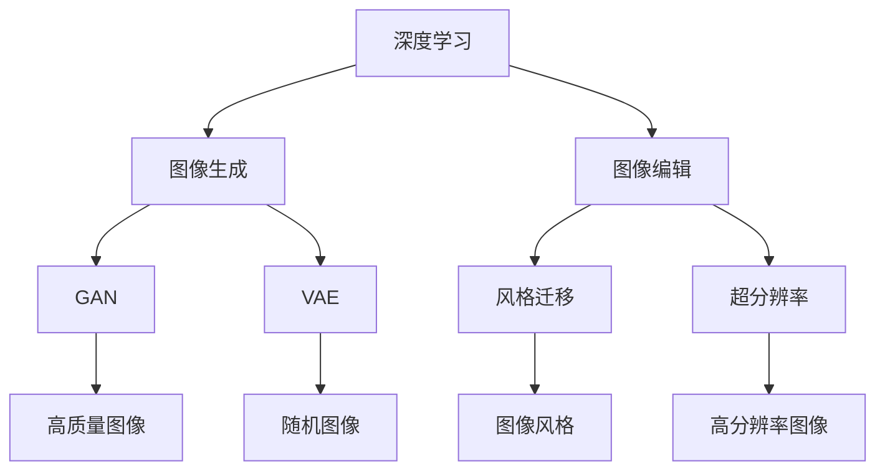

                 

# 深度学习在图像生成与编辑中的应用

> 关键词：深度学习, 图像生成, 图像编辑, 生成对抗网络(GAN), 变分自编码器(VAE), 图像风格迁移, 图像超分辨率

## 1. 背景介绍

随着深度学习技术的发展，图像生成与编辑领域涌现出了许多令人瞩目的突破。深度学习算法不仅能够生成高质量的图像，还能够对图像进行各种创意性的编辑操作。本文将详细介绍深度学习在图像生成与编辑中的核心技术，并探讨其在实际应用中的潜力和挑战。

## 2. 核心概念与联系

### 2.1 核心概念概述

在图像生成与编辑领域，深度学习主要涉及以下几个核心概念：

- **深度学习**：一种基于神经网络的机器学习范式，能够自动从大量数据中学习特征表示，进行模式识别、分类、生成等任务。
- **图像生成**：使用深度学习模型生成具有视觉吸引力的新图像，广泛应用于艺术创作、虚拟现实等领域。
- **图像编辑**：通过深度学习模型对图像进行修图、着色、风格转换等操作，实现图像的创意表达和美化。
- **生成对抗网络(GAN)**：一种通过对抗训练生成高质量图像的深度学习模型，能够产生具有高度逼真度的图像。
- **变分自编码器(VAE)**：一种能够生成随机图像并学习图像分布的深度学习模型，常用于图像生成和特征提取。
- **图像风格迁移**：通过深度学习模型将一幅图像的风格应用到另一幅图像上，实现图像风格的转换。
- **图像超分辨率**：使用深度学习模型将低分辨率图像提升为高分辨率图像，提高图像清晰度。

这些核心概念之间的联系可以通过以下Mermaid流程图来展示：



这个流程图展示了深度学习在图像生成与编辑领域的应用路径：

1. 深度学习提供强大的图像生成与编辑能力。
2. GAN 和 VAE 作为深度学习的重要分支，通过生成高质量图像，支持图像生成任务。
3. 风格迁移和超分辨率等技术，通过改进生成模型，进一步拓展了图像编辑的应用范围。

## 3. 核心算法原理 & 具体操作步骤
### 3.1 算法原理概述

深度学习在图像生成与编辑中的应用，主要依赖于生成模型和编辑模型。生成模型负责生成高质量的新图像，而编辑模型则用于对现有图像进行各种创意性的编辑操作。

在图像生成方面，GAN和VAE是最常用的生成模型。GAN通过对抗训练的方式生成逼真度极高的图像，VAE则通过对图像进行随机采样和分布学习，生成具有多样性的图像。

在图像编辑方面，风格迁移和超分辨率是两种常用的编辑技术。风格迁移通过将一幅图像的风格应用到另一幅图像上，实现图像风格的转换。超分辨率则通过提升低分辨率图像的分辨率，提高图像清晰度。

### 3.2 算法步骤详解

#### 3.2.1 GAN 生成高质量图像

1. **模型选择**：选择基于深度神经网络的结构，如卷积神经网络(CNN)。
2. **损失函数设计**：设计对抗损失函数，包括生成器损失和判别器损失。
3. **对抗训练**：通过交替优化生成器和判别器，不断优化模型生成高质量的图像。
4. **模型验证**：在验证集上评估模型生成图像的质量，调整超参数进行优化。

#### 3.2.2 VAE 生成随机图像

1. **模型选择**：选择基于深度神经网络的编码器-解码器结构，如变分自编码器。
2. **损失函数设计**：设计重构损失和KL散度损失。
3. **随机采样**：通过随机采样生成新的图像。
4. **模型验证**：在验证集上评估生成图像的质量和多样性，调整超参数进行优化。

#### 3.2.3 图像风格迁移

1. **模型选择**：选择基于深度神经网络的结构，如卷积神经网络。
2. **风格编码**：将待迁移风格的图像表示为向量。
3. **内容编码**：将待迁移内容的图像表示为向量。
4. **风格迁移**：通过线性组合和卷积操作，将内容图像和风格向量进行融合。
5. **模型验证**：在验证集上评估风格迁移效果，调整超参数进行优化。

#### 3.2.4 图像超分辨率

1. **模型选择**：选择基于深度神经网络的结构，如卷积神经网络。
2. **损失函数设计**：设计超分辨率损失函数，包括重建损失和边缘损失。
3. **模型训练**：通过高分辨率图像的低分辨率版本进行训练。
4. **模型验证**：在验证集上评估超分辨率效果，调整超参数进行优化。

### 3.3 算法优缺点

深度学习在图像生成与编辑中的应用具有以下优点：

- **高质量生成**：能够生成高质量的图像，具有高度逼真度和多样性。
- **灵活性高**：能够进行各种创意性的编辑操作，如风格迁移、超分辨率等。
- **应用广泛**：广泛应用于艺术创作、虚拟现实、医疗影像等领域。

同时，也存在一些缺点：

- **计算资源需求高**：需要大量的计算资源进行训练和推理。
- **数据依赖性强**：生成模型和编辑模型的效果高度依赖于训练数据的质量和数量。
- **可解释性差**：深度学习模型通常被视为"黑盒"，难以解释其内部的决策逻辑。

### 3.4 算法应用领域

深度学习在图像生成与编辑中的应用涵盖了多个领域，例如：

- **艺术创作**：生成各种风格和主题的图像，支持艺术家的创作灵感。
- **虚拟现实**：生成高质量的虚拟场景和角色，增强虚拟体验的沉浸感。
- **医疗影像**：生成高质量的医学图像，辅助医生进行诊断和治疗。
- **图像修复**：修复损坏的图像，提升图像质量。
- **广告设计**：生成广告图像和海报，提升品牌形象。
- **视频制作**：生成高质量的视频帧，支持视频制作和编辑。

## 4. 数学模型和公式 & 详细讲解 & 举例说明

### 4.1 数学模型构建

在图像生成与编辑中，深度学习模型通常采用神经网络结构。这里以GAN为例，介绍生成对抗网络的基本结构。

GAN由生成器和判别器两部分组成：

- **生成器**：将随机噪声映射到图像空间。
- **判别器**：判断输入图像是真实图像还是生成图像。

生成器和判别器的目标函数分别为：

- **生成器损失**：
$$
L_G = \mathbb{E}_{z \sim p(z)}[\log D(G(z))]
$$

- **判别器损失**：
$$
L_D = \mathbb{E}_{x \sim p(x)}[\log D(x)] + \mathbb{E}_{z \sim p(z)}[\log(1 - D(G(z)))]
$$

其中，$z$为随机噪声，$G(z)$为生成器生成的图像，$D(x)$为判别器对真实图像$x$的判别结果。

### 4.2 公式推导过程

GAN的生成器和判别器的损失函数可以通过最小化最大化的方式进行优化。具体推导过程如下：

1. **生成器优化**：
$$
\min_G \mathbb{E}_{z \sim p(z)}[\log(1 - D(G(z)))]
$$

2. **判别器优化**：
$$
\max_D \mathbb{E}_{x \sim p(x)}[\log D(x)] + \mathbb{E}_{z \sim p(z)}[\log(1 - D(G(z)))]
$$

### 4.3 案例分析与讲解

#### 案例一：GAN生成逼真人脸图像

1. **数据准备**：收集大量高质量的人脸图像，并将其转换为标准尺寸。
2. **模型训练**：选择适合的人脸生成模型，如DCGAN、WGAN等，使用对抗训练生成逼真人脸图像。
3. **结果评估**：在验证集上评估生成图像的质量和多样性，调整超参数进行优化。
4. **应用场景**：在虚拟现实、影视制作等领域应用生成的人脸图像。

#### 案例二：VAE生成随机图像

1. **数据准备**：收集大量高质量的图像，并将其转换为标准尺寸。
2. **模型训练**：选择适合的数据生成模型，如VAE，使用随机采样生成新的图像。
3. **结果评估**：在验证集上评估生成图像的质量和多样性，调整超参数进行优化。
4. **应用场景**：在艺术创作、游戏设计等领域应用生成的随机图像。

## 5. 项目实践：代码实例和详细解释说明

### 5.1 开发环境搭建

在进行图像生成与编辑的应用开发前，需要准备好开发环境。以下是使用Python进行PyTorch开发的环境配置流程：

1. 安装Anaconda：从官网下载并安装Anaconda，用于创建独立的Python环境。

2. 创建并激活虚拟环境：
```bash
conda create -n pytorch-env python=3.8 
conda activate pytorch-env
```

3. 安装PyTorch：根据CUDA版本，从官网获取对应的安装命令。例如：
```bash
conda install pytorch torchvision torchaudio cudatoolkit=11.1 -c pytorch -c conda-forge
```

4. 安装图像处理库：
```bash
pip install opencv-python numpy scipy matplotlib
```

完成上述步骤后，即可在`pytorch-env`环境中开始图像生成与编辑的应用开发。

### 5.2 源代码详细实现

这里以GAN生成人脸图像为例，展示PyTorch代码实现。

首先，定义GAN模型的结构：

```python
import torch
import torch.nn as nn
import torch.optim as optim
from torch.autograd import Variable

class Generator(nn.Module):
    def __init__(self):
        super(Generator, self).__init__()
        self.main = nn.Sequential(
            nn.ConvTranspose2d(100, 256, 4, 1, 0, bias=False),
            nn.BatchNorm2d(256),
            nn.ReLU(True),
            nn.ConvTranspose2d(256, 128, 4, 2, 1, bias=False),
            nn.BatchNorm2d(128),
            nn.ReLU(True),
            nn.ConvTranspose2d(128, 64, 4, 2, 1, bias=False),
            nn.BatchNorm2d(64),
            nn.ReLU(True),
            nn.ConvTranspose2d(64, 3, 4, 2, 1, bias=False),
            nn.Tanh()
        )

    def forward(self, input):
        return self.main(input)

class Discriminator(nn.Module):
    def __init__(self):
        super(Discriminator, self).__init__()
        self.main = nn.Sequential(
            nn.Conv2d(3, 64, 4, 2, 1, bias=False),
            nn.LeakyReLU(0.2, inplace=True),
            nn.Conv2d(64, 128, 4, 2, 1, bias=False),
            nn.BatchNorm2d(128),
            nn.LeakyReLU(0.2, inplace=True),
            nn.Conv2d(128, 256, 4, 2, 1, bias=False),
            nn.BatchNorm2d(256),
            nn.LeakyReLU(0.2, inplace=True),
            nn.Conv2d(256, 1, 4, 1, 0, bias=False),
            nn.Sigmoid()
        )

    def forward(self, input):
        return self.main(input)
```

然后，定义训练函数：

```python
def train(G, D, optimizer_G, optimizer_D, z_dim, batch_size, epochs):
    criterion_G = nn.BCELoss()
    criterion_D = nn.BCELoss()

    for epoch in range(epochs):
        for i in range(0, len(train_loader), batch_size):
            real_images = train_loader[i:i+batch_size].data
            batch_size = real_images.size(0)

            # Adversarial ground truths
            real_labels = Variable(torch.ones(batch_size, 1))
            fake_labels = Variable(torch.zeros(batch_size, 1))

            # ---------------------
            #  Train G
            # ---------------------
            optimizer_G.zero_grad()

            # Sample noise
            z = Variable(torch.randn(batch_size, z_dim, 1, 1), volatile=True)

            # Generate a batch of images
            fake_images = G(z)

            # Adversarial loss
            g_loss = criterion_G(fake_images, real_labels)

            g_loss.backward()
            optimizer_G.step()

            # ---------------------
            #  Train D
            # ---------------------
            optimizer_D.zero_grad()

            # Real images
            real_outputs = D(real_images)
            real_loss = criterion_D(real_outputs, real_labels)

            # Fake images
            fake_outputs = D(fake_images)
            fake_loss = criterion_D(fake_outputs, fake_labels)

            d_loss = (real_loss + fake_loss) / 2

            d_loss.backward()
            optimizer_D.step()

        if (epoch+1) % 100 == 0:
            print('[%d/%d] - D loss: %f - G loss: %f' % (epoch+1, epochs, d_loss.data[0], g_loss.data[0]))
```

最后，启动训练流程：

```python
G = Generator()
D = Discriminator()

G.to(device)
D.to(device)

optimizer_G = optim.Adam(G.parameters(), lr=0.0002)
optimizer_D = optim.Adam(D.parameters(), lr=0.0002)

train(G, D, optimizer_G, optimizer_D, z_dim, batch_size, epochs)
```

以上就是使用PyTorch进行GAN生成人脸图像的完整代码实现。可以看到，PyTorch的自动微分和动态计算图特性，使得模型的构建和训练变得非常简单。

### 5.3 代码解读与分析

让我们再详细解读一下关键代码的实现细节：

**GAN模型**：
- **Generator**类：定义生成器的结构，包括多个卷积转置层和激活函数。
- **Discriminator**类：定义判别器的结构，包括多个卷积层和激活函数。

**训练函数**：
- 使用PyTorch的`nn.BCELoss`定义生成器和判别器的损失函数。
- 在每个epoch中，通过循环遍历训练集，进行前向传播和反向传播，更新模型参数。
- 使用`Adams`优化器进行模型参数的优化。
- 每100个epoch输出一次训练过程中的损失值，用于监控训练进度。

**启动训练流程**：
- 定义生成器和判别器模型。
- 将模型迁移到GPU上。
- 定义优化器，并使用`train`函数进行训练。

## 6. 实际应用场景

### 6.1 虚拟现实

在虚拟现实中，深度学习技术可以用于生成逼真的虚拟场景和角色，增强虚拟体验的沉浸感。例如，可以使用GAN生成高精度的3D模型，支持虚拟现实游戏和模拟环境。

### 6.2 广告设计

在广告设计中，深度学习技术可以用于生成高质量的广告图像和海报，提升品牌形象。例如，可以使用VAE生成具有多样性的广告图像，支持广告创意设计。

### 6.3 视频制作

在视频制作中，深度学习技术可以用于生成高质量的视频帧，支持视频剪辑和特效制作。例如，可以使用GAN生成高质量的视频背景和角色，增强视频的视觉吸引力。

### 6.4 未来应用展望

未来，深度学习在图像生成与编辑中的应用将更加广泛和深入。随着模型和算法的不断进步，我们可以期待以下趋势：

1. **生成模型的多样化**：除了GAN和VAE，未来还将涌现更多生成模型，如Flow、StyleGAN等，进一步提升图像生成的质量和多样性。
2. **实时生成**：通过优化生成模型的计算图和算法，实现实时生成高质量图像，支持实时应用场景。
3. **多模态融合**：结合视觉、听觉、文本等多种模态数据，生成更加复杂和逼真的多模态图像。
4. **跨领域应用**：深度学习技术将更多地应用于医疗、金融等领域，生成高质量的医学图像、财务报表等，支持专业应用场景。
5. **智能交互**：结合自然语言处理技术，实现与用户的智能交互，支持智能客服、虚拟助手等应用。

## 7. 工具和资源推荐

### 7.1 学习资源推荐

为了帮助开发者系统掌握深度学习在图像生成与编辑中的应用，这里推荐一些优质的学习资源：

1. 《Deep Learning for Computer Vision》课程：由斯坦福大学开设的深度学习课程，详细介绍了图像生成与编辑的基本概念和经典模型。

2. 《Generative Adversarial Nets》论文：GAN的奠基性论文，详细介绍了GAN的基本原理和应用场景。

3. 《Image-to-Image Translation with Conditional Adversarial Networks》论文：介绍了一种基于GAN的图像风格迁移技术，具有很高的参考价值。

4. 《Learning to Draw》论文：介绍了VAE在艺术创作中的应用，展示了VAE生成高质量艺术图像的能力。

5. 《Image Super-Resolution Using Deep Convolutional Networks》论文：介绍了超分辨率的基本原理和经典模型，展示了深度学习在图像增强中的应用。

通过对这些资源的学习实践，相信你一定能够快速掌握深度学习在图像生成与编辑中的精髓，并用于解决实际的图像处理问题。

### 7.2 开发工具推荐

高效的开发离不开优秀的工具支持。以下是几款用于深度学习图像生成与编辑开发的常用工具：

1. PyTorch：基于Python的开源深度学习框架，灵活动态的计算图，适合快速迭代研究。大部分生成和编辑模型都有PyTorch版本的实现。

2. TensorFlow：由Google主导开发的开源深度学习框架，生产部署方便，适合大规模工程应用。同样有丰富的图像生成与编辑模型资源。

3. Keras：基于TensorFlow和Theano的高级神经网络API，易于上手，支持图像生成与编辑任务的快速开发。

4. OpenCV：开源计算机视觉库，提供丰富的图像处理和分析功能，支持图像增强和超分辨率等任务。

5. Matplotlib：Python绘图库，支持生成高质量的图像和图表，支持图像生成与编辑任务的可视化分析。

6. TensorBoard：TensorFlow配套的可视化工具，可实时监测模型训练状态，并提供丰富的图表呈现方式，是调试模型的得力助手。

合理利用这些工具，可以显著提升深度学习图像生成与编辑任务的开发效率，加快创新迭代的步伐。

### 7.3 相关论文推荐

深度学习在图像生成与编辑中的应用源于学界的持续研究。以下是几篇奠基性的相关论文，推荐阅读：

1. Generative Adversarial Nets（即GAN原论文）：提出了GAN结构，开启了深度学习在图像生成领域的革命。

2. Conditional Image Synthesis with Auxiliary Classifier GANs：提出了一种基于GAN的图像生成方法，支持生成条件图像，如人脸、汽车等。

3. Progressive Growing of GANs for Improved Quality, Stability, and Variation：提出了一种渐进式增长的GAN结构，支持生成高质量图像。

4. Wasserstein GAN（即WGAN）：提出了一种基于Wasserstein距离的GAN结构，提高了生成图像的质量和稳定性。

5. Attention Is All You Need：提出了一种基于自注意力机制的图像生成方法，支持生成高质量的图像。

这些论文代表了大深度学习在图像生成与编辑领域的发展脉络。通过学习这些前沿成果，可以帮助研究者把握学科前进方向，激发更多的创新灵感。

## 8. 总结：未来发展趋势与挑战

### 8.1 总结

本文对深度学习在图像生成与编辑中的应用进行了全面系统的介绍。首先阐述了深度学习在图像生成与编辑领域的研究背景和意义，明确了GAN和VAE在图像生成中的核心地位。其次，从原理到实践，详细讲解了GAN、VAE、风格迁移和超分辨率等技术的基本算法和具体操作步骤。最后，探讨了深度学习在图像生成与编辑中的实际应用场景和未来发展趋势，并对相关工具和资源进行了推荐。

通过本文的系统梳理，可以看到，深度学习在图像生成与编辑领域的潜力巨大，已经广泛应用于艺术创作、虚拟现实、广告设计等多个领域。未来，随着模型和算法的不断进步，深度学习将进一步拓展其应用边界，为图像处理带来新的突破。

### 8.2 未来发展趋势

展望未来，深度学习在图像生成与编辑领域将呈现以下几个发展趋势：

1. **模型规模持续增大**：随着算力成本的下降和数据规模的扩张，深度学习模型的参数量还将持续增长。超大规模模型蕴含的丰富特征，将支持生成更多样、更逼真的图像。

2. **生成模型多样化**：除了GAN和VAE，未来还将涌现更多生成模型，如Flow、StyleGAN等，进一步提升图像生成的质量和多样性。

3. **实时生成**：通过优化生成模型的计算图和算法，实现实时生成高质量图像，支持实时应用场景。

4. **多模态融合**：结合视觉、听觉、文本等多种模态数据，生成更加复杂和逼真的多模态图像。

5. **跨领域应用**：深度学习技术将更多地应用于医疗、金融等领域，生成高质量的医学图像、财务报表等，支持专业应用场景。

6. **智能交互**：结合自然语言处理技术，实现与用户的智能交互，支持智能客服、虚拟助手等应用。

这些趋势凸显了深度学习在图像生成与编辑领域的广阔前景。这些方向的探索发展，必将进一步提升图像处理系统的性能和应用范围，为图像处理技术带来新的突破。

### 8.3 面临的挑战

尽管深度学习在图像生成与编辑中取得了显著成就，但在迈向更加智能化、普适化应用的过程中，它仍面临诸多挑战：

1. **计算资源瓶颈**：深度学习模型往往需要大量的计算资源进行训练和推理。GPU/TPU等高性能设备是必不可少的，但即便如此，超大批次的训练和推理也可能遇到显存不足的问题。

2. **数据依赖性强**：深度学习模型的效果高度依赖于训练数据的质量和数量。对于新任务的生成和编辑，需要收集大量的高质量数据，这往往需要耗费大量时间和成本。

3. **可解释性差**：深度学习模型通常被视为"黑盒"，难以解释其内部的决策逻辑。对于医疗、金融等高风险应用，算法的可解释性和可审计性尤为重要。

4. **安全性有待保障**：深度学习模型难免会学习到有偏见、有害的信息，通过生成和编辑传递到新任务，产生误导性、歧视性的输出，给实际应用带来安全隐患。

5. **知识整合能力不足**：现有的深度学习模型往往局限于任务内数据，难以灵活吸收和运用更广泛的先验知识。如何让生成和编辑模型更好地与外部知识库、规则库等专家知识结合，形成更加全面、准确的信息整合能力，还有很大的想象空间。

正视深度学习在图像生成与编辑中面临的这些挑战，积极应对并寻求突破，将是大规模深度学习模型走向成熟的必由之路。相信随着学界和产业界的共同努力，这些挑战终将一一被克服，深度学习模型必将在构建智能视觉系统、服务人类生产生活方面发挥更大的作用。

### 8.4 研究展望

面对深度学习在图像生成与编辑领域面临的挑战，未来的研究需要在以下几个方面寻求新的突破：

1. **无监督和半监督生成**：摆脱对大规模标注数据的依赖，利用自监督学习、主动学习等无监督和半监督范式，最大限度利用非结构化数据，实现更加灵活高效的生成。

2. **参数高效生成**：开发更加参数高效的生成模型，在固定大部分生成参数的情况下，只更新极少量的任务相关参数。同时优化生成模型的计算图，减少前向传播和反向传播的资源消耗，实现更加轻量级、实时性的部署。

3. **生成模型的鲁棒性**：通过引入因果推断和对比学习思想，增强生成模型建立稳定因果关系的能力，学习更加普适、鲁棒的语言表征，从而提升模型泛化性和抗干扰能力。

4. **结合因果分析和博弈论工具**：将因果分析方法引入生成模型，识别出模型决策的关键特征，增强输出解释的因果性和逻辑性。借助博弈论工具刻画人机交互过程，主动探索并规避模型的脆弱点，提高系统稳定性。

5. **融入伦理道德约束**：在模型训练目标中引入伦理导向的评估指标，过滤和惩罚有偏见、有害的输出倾向。同时加强人工干预和审核，建立模型行为的监管机制，确保输出符合人类价值观和伦理道德。

这些研究方向的探索，必将引领深度学习在图像生成与编辑技术迈向更高的台阶，为构建安全、可靠、可解释、可控的智能系统铺平道路。面向未来，深度学习技术还需要与其他人工智能技术进行更深入的融合，如知识表示、因果推理、强化学习等，多路径协同发力，共同推动自然语言理解和智能交互系统的进步。只有勇于创新、敢于突破，才能不断拓展图像生成与编辑系统的边界，让智能技术更好地造福人类社会。

## 9. 附录：常见问题与解答

**Q1：深度学习在图像生成与编辑中的应用是否能够替代传统图像处理技术？**

A: 深度学习在图像生成与编辑中的应用可以部分替代传统图像处理技术，特别是在创意性生成和编辑任务中。但传统图像处理技术在图像增强、图像修复、图像分割等任务中仍然具有重要地位。

**Q2：深度学习在图像生成与编辑中面临哪些挑战？**

A: 深度学习在图像生成与编辑中面临的挑战包括计算资源需求高、数据依赖性强、可解释性差、安全性有待保障、知识整合能力不足等。这些挑战需要通过算法创新、数据增强、模型优化等手段来克服。

**Q3：如何提高深度学习模型的可解释性？**

A: 提高深度学习模型的可解释性可以通过以下几种方式：
1. 使用可视化工具，展示模型内部的中间表示。
2. 使用特征重要性排序，展示模型对每个特征的依赖程度。
3. 使用可解释性模型，如LIME、SHAP等，提供模型的局部解释。

**Q4：如何提升深度学习模型的安全性？**

A: 提升深度学习模型的安全性可以通过以下几种方式：
1. 使用对抗训练，增强模型的鲁棒性。
2. 使用数据脱敏技术，保护用户隐私。
3. 引入伦理导向的评估指标，过滤和惩罚有害输出。

**Q5：深度学习在图像生成与编辑中的计算资源需求如何优化？**

A: 优化深度学习在图像生成与编辑中的计算资源需求可以通过以下几种方式：
1. 使用梯度积累技术，减少计算图中的梯度更新次数。
2. 使用混合精度训练，减小模型参数的位数。
3. 使用模型并行技术，加速计算过程。

这些优化手段可以显著降低深度学习在图像生成与编辑中的计算资源需求，提升模型的实时性和可扩展性。

---

作者：禅与计算机程序设计艺术 / Zen and the Art of Computer Programming

